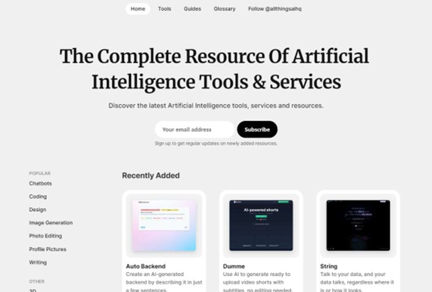
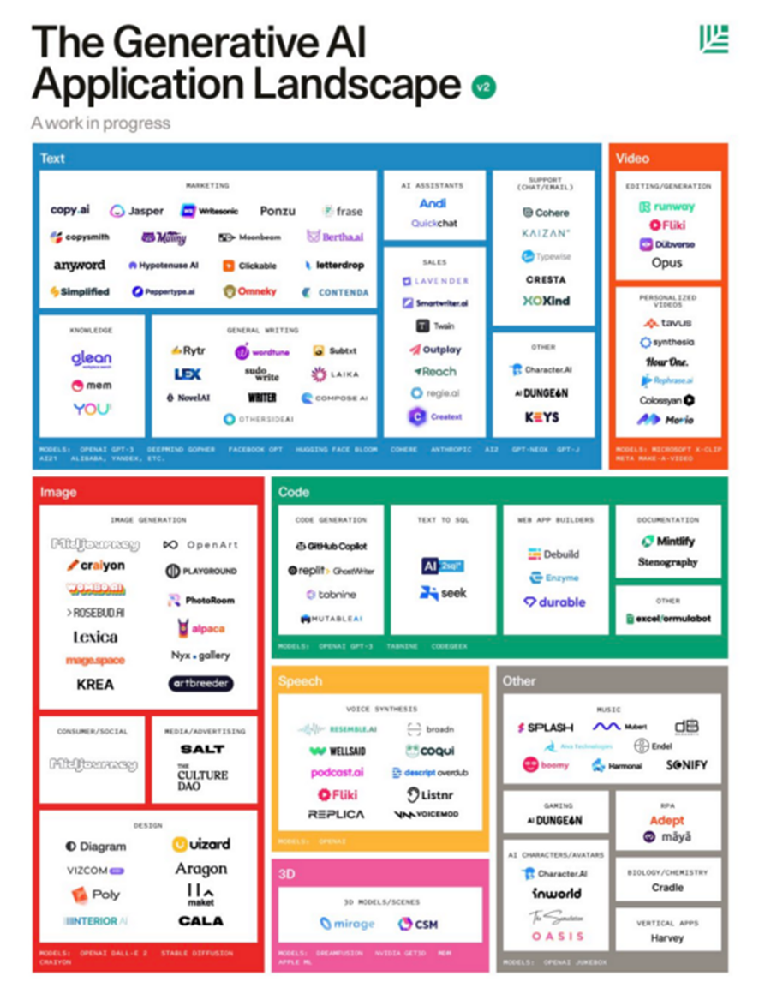
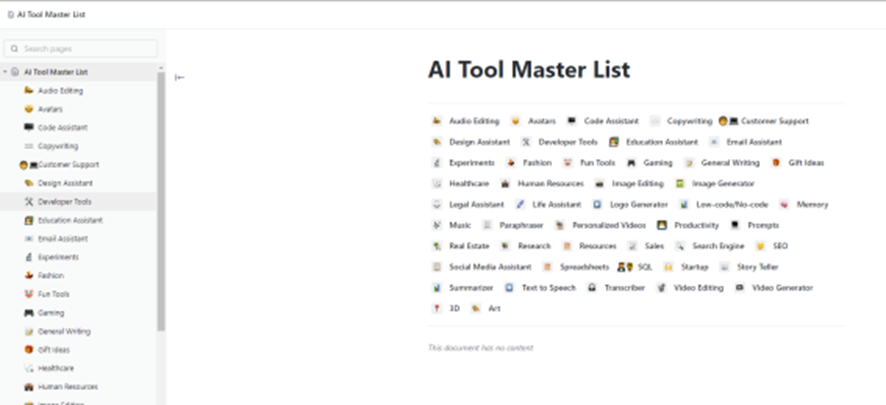
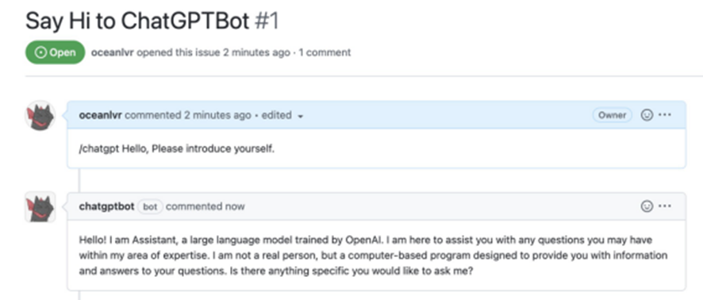
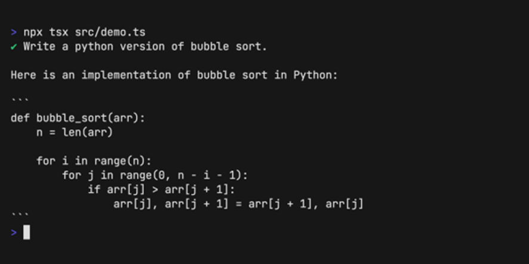
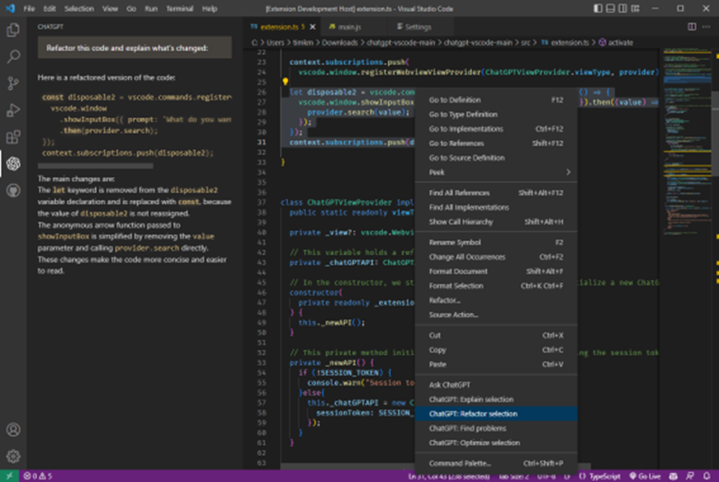
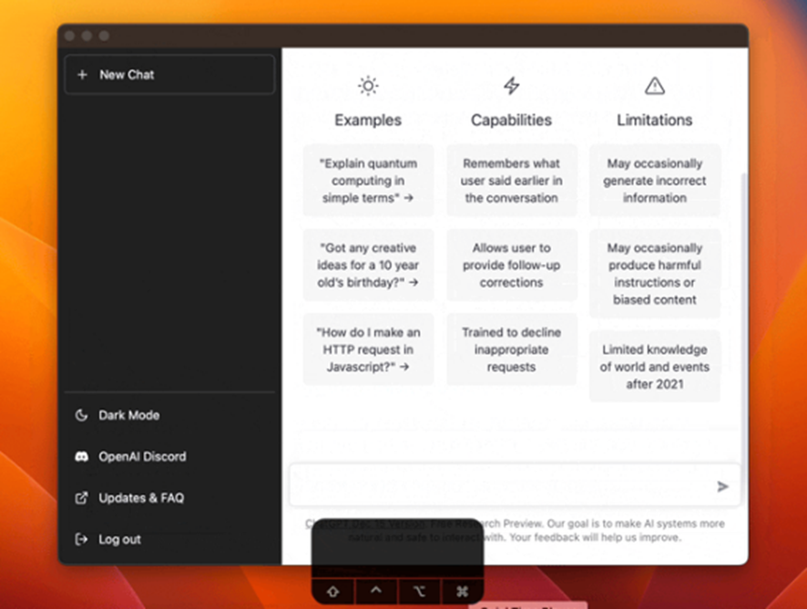
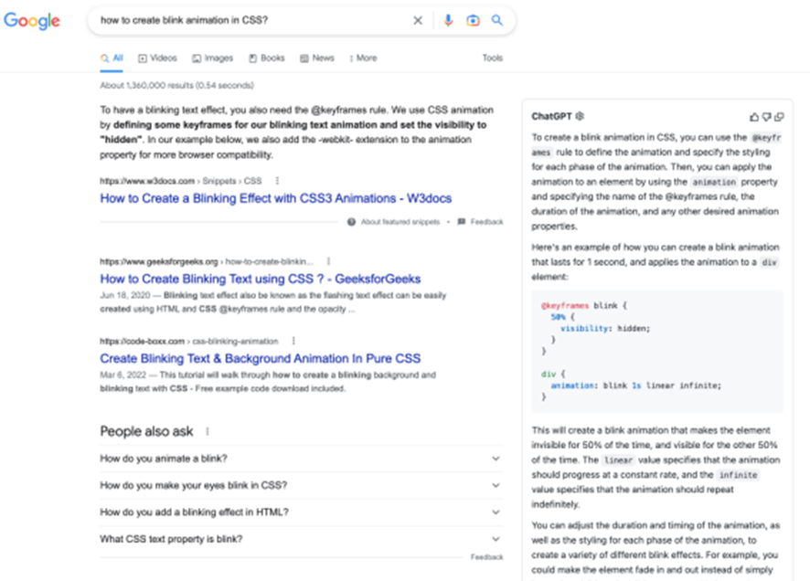
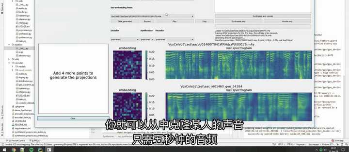

# AI工具导航

2023AIGC产业全景报告

[https://www.aliyundrive.com/s/KeMcbbWCxAZ](https://www.xgw5.com/go?_=c115b98e76aHR0cHM6Ly93d3cuYWxpeXVuZHJpdmUuY29tL3MvS2VNY2JiV0N4QVo%3D)

AI时代的颠覆论

[https://www.aliyundrive.com/s/foT3V1mHnvJ](https://www.xgw5.com/go?_=ab7f589018aHR0cHM6Ly93d3cuYWxpeXVuZHJpdmUuY29tL3MvZm9UM1YxbUhudko%3D)

ChatGPT主题报告合编（83份）

[https://www.aliyundrive.com/s/HrU92TF6cuE](https://www.xgw5.com/go?_=9bee509a92aHR0cHM6Ly93d3cuYWxpeXVuZHJpdmUuY29tL3MvSHJVOTJURjZjdUU%3D)

ChatGPT指令大全（调教口令）

[https://www.aliyundrive.com/s/sFoym2mCCej](https://www.xgw5.com/go?_=601fb8c9a5aHR0cHM6Ly93d3cuYWxpeXVuZHJpdmUuY29tL3Mvc0ZveW0ybUNDZWo%3D)

21个AI提示词站点收集！玩转AI必备的工具！.pdf

[https://www.aliyundrive.com/s/b8kXYgqZz2r](https://www.xgw5.com/go?_=73839734a5aHR0cHM6Ly93d3cuYWxpeXVuZHJpdmUuY29tL3MvYjhrWFlncVp6MnI%3D)

150种ChatGPT中文提示词收集

[https://www.aliyundrive.com/s/ABeVdrMbMnJ](https://www.xgw5.com/go?_=46e842b566aHR0cHM6Ly93d3cuYWxpeXVuZHJpdmUuY29tL3MvQUJlVmRyTWJNbko%3D)

ChatGPT技术报告（GPT-4）

[https://www.aliyundrive.com/s/t3gPEd8ogBg](https://www.xgw5.com/go?_=2d6f4b9eceaHR0cHM6Ly93d3cuYWxpeXVuZHJpdmUuY29tL3MvdDNnUEVkOG9nQmc%3D)

ChatGPT视频教程

[https://www.aliyundrive.com/s/pixGifESs1S](https://www.xgw5.com/go?_=2d60b4db16aHR0cHM6Ly93d3cuYWxpeXVuZHJpdmUuY29tL3MvcGl4R2lmRVNzMVM%3D)

ChatGPT商业版+自用版源码

[https://www.aliyundrive.com/s/jAwDhmiQHJU](https://www.xgw5.com/go?_=4a971833feaHR0cHM6Ly93d3cuYWxpeXVuZHJpdmUuY29tL3MvakF3RGhtaVFISlU%3D)

Midjourney入门到精通 AI绘图作画教学

[https://www.aliyundrive.com/s/FDnXMKY8RFV](https://www.xgw5.com/go?_=7805713dbeaHR0cHM6Ly93d3cuYWxpeXVuZHJpdmUuY29tL3MvRkRuWE1LWThSRlY%3D)

Midjourney入门到精通 AI绘画保姆级教程

[https://www.aliyundrive.com/s/E9VmnGR1Uz1](https://www.xgw5.com/go?_=eb612cb2e1aHR0cHM6Ly93d3cuYWxpeXVuZHJpdmUuY29tL3MvRTlWbW5HUjFVejE%3D)

Midjourney 绘画关键词+配图 12000+

[https://www.aliyundrive.com/s/oLNGyBNczPW](https://www.xgw5.com/go?_=7b21b05412aHR0cHM6Ly93d3cuYWxpeXVuZHJpdmUuY29tL3Mvb0xOR3lCTmN6UFc%3D)

Midjourney相关资料汇总

[https://www.aliyundrive.com/s/kguWnuDqqi3](https://www.xgw5.com/go?_=02b739c27baHR0cHM6Ly93d3cuYWxpeXVuZHJpdmUuY29tL3Mva2d1V251RHFxaTM%3D)

书籍分享:

工业人工智能三部曲（共3册）

[https://www.aliyundrive.com/s/GGjJ8k9vwFv](https://www.xgw5.com/go?_=7a6db51077aHR0cHM6Ly93d3cuYWxpeXVuZHJpdmUuY29tL3MvR0dqSjhrOXZ3RnY%3D)

ChatGPT 中文指令公式手册

[https://www.aliyundrive.com/s/xgJT9euFyL9](https://www.xgw5.com/go?_=45676584cdaHR0cHM6Ly93d3cuYWxpeXVuZHJpdmUuY29tL3MveGdKVDlldUZ5TDk%3D)

ChatGPT 提问艺术

[https://www.aliyundrive.com/s/LfUapq6m4uy](https://www.xgw5.com/go?_=67823c284daHR0cHM6Ly93d3cuYWxpeXVuZHJpdmUuY29tL3MvTGZVYXBxNm00dXk%3D)

ChatGPT4.0在投资中的运用初探

[https://www.aliyundrive.com/s/N5eieL8UTvN](https://www.xgw5.com/go?_=aa268174eaaHR0cHM6Ly93d3cuYWxpeXVuZHJpdmUuY29tL3MvTjVlaWVMOFVUdk4%3D)

————————————————————————————————————————

🧰 免费体验【ChatGPT】【GPT-4】【Claude】等工具汇总 ：https://t.zsxq.com/11Wa21d4S

各类AI工具：[未来百科AI工具 的个人主页 - 文章 - 掘金 (juejin.cn)](https://juejin.cn/user/3245414058301261/posts)

- 1.AI扩展图片：https://clipdrop.co/uncrop
- 2.AI模特试衣：https://www.x-design.com/?channel=10017
- 3.AI文本转3D：https://www.meshy.ai/
- 4.AI人声分离：https://vocalremover.org/zh/
- 5.AI黑白照上色：https://palette.fm/

**工具清单**

**ChatGPT**：https://openai.com/blog/chatgpt

ChatGPT 是一款非常好用的论文阅读和润色工具，只需要掌握基本的输入技巧，就可以完成角色扮演、背景介绍、关键词限定、任务目标、格式化输出等任务。

**ChatGPT Academic**：https://github.com/binary-husky/gpt_academic

ChatGPT Academic (ChatGPT 学术优化) 是一款学术版润色工具，为 GPT、GLM 提供了图形交互界面。模块化设计支持自定义快捷按钮和各种函数插件；并且新增 Python / C++ 项目剖析和自译解功能等。

**ChatReviewer / ChatResponse**：https://github.com/nishiwen1214/ChatReviewer

ChatReviewer 是一款基于 GPT-3.5 API 开发的智能论文分析与建议助手。可以对论文的优缺点进行快速总结和分析，提高科研人员的文献阅读和理解的效率；也可以对本地论文进行分析，生成改进建议帮助进行查漏补缺，进一步提高论文质量。

https://github.com/nishiwen1214/ChatReviewer

https://huggingface.co/spaces/ShiwenNi/ChatReviewer

**「使用时要注意学术伦理」**

ChatResponse 是一款根据审稿人的评论自动生成作者回复的AI助手，可以根据输入的审稿意见，自动提取其中各个审稿人的问题和担忧，并生成点对点的回复。

https://github.com/nishiwen1214/ChatReviewer

https://huggingface.co/spaces/ShiwenNi/ChatResponse

**「使用时要注意学术伦理」**

**New Bing**：http://www.bing.com/

对于在浏览器中打开的文档，NewBing不仅可以通过问答进行内容总结、大纲提炼等任务，还能跨中英文直接作答。事实上，不仅仅是PDF，任何浏览器中的页面都可以这样处理。关键，是免费的！真的强！

**ChatDOC**：https://chatdoc.com/

ChatDOC图片ChatDOC 是一个基于 ChatGPT 的文件阅读助手，支持中英文，可以快速从上传研究论文、书籍、手册等文件中提取、定位和汇总文件信息，并通过聊天的方式在几秒钟内给出问题的答案。

**ChatPDF**：https://www.chatpdf.com/

ChatPDF是一款强大的PDF阅读和问答工具，支持不同语言间的互动。原理是分析时创建PDF段落的语义索引，回答问题时找到最相关段落并利用OpenAl的API生成答案，每天可免费处理3个PDF (最多120页)。

**ChatPaper**：https://chatpaper.org/

ChatPaper 是一个超万星的 GitHub 热榜开源项目，可以根据用户输入的关键词自动下载 arxiv 最新论文，再利用 ChatGPT API 接口的强大总结能力，将论文总结为固定格式。当然，ChatPaper 也可以直接处理本地的 PDF 文档。

**BriefGPT**：https://briefgpt.xyz/

BriefGPT (AI论文速递)，是一个日更 Arxiv 最新人工智能论文的网站，项目作者 Rick Yu 抓取论文后通过 GPT 生成中文标题、论文概要、展示论文 Key Words，并设置了顶会、ChatGPT专栏，帮助用户快速了解 AI 最新动态。

**Auto-Draft**：https://github.com/CCCBora/auto-draft

https://huggingface.co/spaces/auto-academic/auto-draft

Auto-Draft 是一款基于 GPT-4 的文献整理辅助工具，通过输入一个领域的名称，即可自动对这个领域的相关文献进行归纳总结。Auto-Draft 提供了自动搜索主题相关文献、引用文献均有对应原文、按照 LaTeX 模板统一输出等功能。

**SciSpace**：https://typeset.io/

SciSpace 是一个科学写作平台，帮助研究人员发现、创建和发表他们的研究论文。可用于直接搜索在线论文，当然也支持上传本地文档；还可以额在右侧以问答的方式进行实时分析，帮助理解和学习论文。

**OpenRead**：https://www.openread.academy/home

OpenRead 是一款AI驱动的交互式论文工具，将论文阅读、笔记、写作和编辑功能高效地融合到了一款工具中，具备反向链接、外部链接功能，还有数千个期刊论文模板，加速论文阅读与学习过程。

**小绿鲸文献阅读**：https://www.xljsci.com/

小绿鲸文献阅读器是一款集翻译、笔记、文献管理、写作功能于一体的云端英文文献阅读器。重点推荐这款阅读器的各学科专业术语库和划词翻译功能，非常显著地提升了阅读效率和质量。更多AI相关功能，也即将上线。

#### 常见功能的工具选择建议

> > **1**. **「论文批量下载」**：ChatPaper、BriefGPT
>
> **2**. **「本地文件理解」**：New Bing
>
> **3**. **「文案生成」**：实时信息 New Bing；长文本输入 GPT-4
>
> **4**. **「简单代码生成」**：New Bing
>
> **5**. **「复杂代码生成」**：GPT-4
>
> **6**. **「API调用」**：GPT3.5、特殊场景调用 GPT-4
>
> **7**. **「绘图」**：New Bing
>
> **8**. **「论文润色」**：ChatGPT、GPT-4、ChatGPT Academic

#### 其他常见的科研加速小技巧

> > **1**. 作为某种意义上的条件概率生成模型，输入多 - 输出少，更能保证准确性和减少 hallucination
>
> **2**. **「基于关键词的角色扮演」**。你现在是xx领域的教授xx，请帮我润色下面的论文：[文本内容]
>
> **3**. **「格式化输出」**。请按照 xxx; xxx[yyy] 的格式输出/按照 latex 格式输出
>
> **4**. **「格式化的示例 (few-shot)」** 。按照论文的经验，提供一个完整的例子，便于LLM举一反三
>
> **5**. **「可验证的文本生成」**。对于你懂但记不清、或者懂的不多的领域，可以尝试让它实现具体某个任务，事半功倍
>
> **6**. **「哈佛博士的教程」**。GPT可以提供次优选项，让人做选择题，而不用做填空题 https://twitter.com/kareem_carr/status/1640003536925917185

**「其他常见的科研加速小技巧」**

> **GPT全流程加速科研技巧分享*
>
> 论文工具的介绍视频

https://www.bilibili.com/video/BV1WL411e7qM

## 衣食住行

🛒 购物 | 🍔 烹饪 | 🏡 智能家居 | 🤖 家用机器人 | ⌚ 可穿戴设备 | ✈️ 出行

### 🛒 购物

[**Entrupy**](https://www.entrupy.com/) — 奢侈品与运动鞋真伪鉴定。

### 🏡 智能家居

[**Aerial**](http://www.aerial.ai/) — 利用AI与无线基础设施创建传感智能，改善人们的日常生活。

[**Josh.ai**](https://www.josh.ai/) — 全屋语音控制。

[**Mycroft**](https://mycroft.ai/) — 可以保护隐私的语音助手，开源模块化系统可以移植到自有设备中。

[**Nanit**](https://www.nanit.com/) — 使用摄像头等产品套件，帮助父母在App端跟踪监护婴儿的睡眠质量。

### 🤖 家用机器人

[**Roboy**](http://roboy.org/) — 更人性化的机器人，模仿人体肌肉与肌腱，动作更柔和。

[**UBTECH Robotics**](http://www.ubtrobot.com/) — 消费类人形机器人、企业服务机器人以及提供儿童STEM技能培养机器人。

### ⌚ 可穿戴设备

[**Eli**](http://eli-talk.com/en/) — 戴在衣领上的小麦克风，可以连接到智能手机App，记录分析日常对话并生成个性化的外语课程。

[**Rokid**](https://www.rokid.com/) — 致力于AR眼镜等软硬件产品的研发，以YodaOS操作系统为载体构建AR生态，引领人机交互风向标。

[**KickAI**](https://www.kickai.com/) — 运动员与武术从业者的可穿戴设备，帮助提升训练效果。

### ✈️ 出行

[**Emma**](http://ema.ai/) — 从日历中自动获取旅行信息，更合理地规划行程。

[**Nexar**](https://www.getnexar.com/) — 智能行车记录仪，支持在App中查看历史视频，出现问题时App可以远程接收警报。

[**Voya**](https://voya.ai/) — 预订和管理商务旅行，规划行程事宜。

[**Vinli**](https://www.vin.li/) — 为世界顶级车队和保险组织构建移动智能产品，功能包括车队管理、评估车辆保险的风险、提供数据驱动的业务决策支持。

## 美好生活

🎓 教育 | 💰 财务 | 🏛️ 法律 | 🩺 健康 | 🏃 运动 | 🎵 音乐 | 👄 娱乐

## 个人助理

🧰 工作助手 | ⏳ 生活助理

## 商业智能

📊 BI | 💎 AI平台 | 📋 数据采集 | 🔬 数据科学 | 💻 发展 | 📂 内部数据 | 🤖 机器学习 | 📡 传感器 | 😎 愿景

## 持续增长

🎙 聊天机器人 | 🤝 客户关系 | 🔍 客户研究 | ☎️ 客户支持 | 📈 市场调研 | 📣 广告营销 | 📩 邮件营销 | 💰 销售 | 🌎 SEO

## 管理优化

👥 人才招聘 | 👭 团队协作 | 💻 网站搭建 | 📲 App制作 | ✒ Logo设计

## 基础建设

🐷 农业

## 生产制造

⚙ 制造业 | 🦾 工业机器人 | 🛩 无人机 | 📺 VR & AR | 🚘 自动驾驶 | 📦 供应链与物流

## 社会发展

🧬 生物医学 | 💉 医疗保健 | 🎞 医学影像 | 💻 网络安全 | 💸 电子商务 | 🛌 本地生活 | 🎮 游戏开发

🔒 安保 | 🎓 教育 | 💵 金融 | 👜 贷款 | 🏢 保险 | 🏛 法律 | 🏗️ 基础设施 | ❤️ 社会影响

## 内容创作

🌐 文字翻译 | 📜 文本生成 | 📚 文本分析 | 📺 文字转视频 | 🔉 音频处理 | 🖼 图片处理 | 👀 演示工具

## 学术研究

🏟 研究 | 🎓 机构和大学

## 技术开发

📰 新闻和博客 | 🎫 活动、会议和社区 | 🧩 开发者工具 | 🏆 开源库 | 🛠 硬件

## 海外AI工具导航网站，包含44个网址链接

这是一份非常完备的海外AI工具导航网站，包含44个网址链接。不论按照关键词和分类搜索AI工具，还是开发AI工具后自荐推广获得更多曝光，这个清单都非常有用且值得收藏：

> 1. **Product Hunt**：[www.producthunt.com](https://www.producthunt.com)
> 2. **AI Tools Directory**：[aitoolsdirectory.com](https://aitoolsdirectory.com)
> 3. **Futurepedia**：[www.futurepedia.io](https://www.futurepedia.io)
> 4. **AI Tool Board**：[aitoolboard.com](https://aitoolboard.com)
> 5. **AIdir**：[www.aidir.cc](https://www.aidir.cc)
> 6. **AI Search Tool**：[www.aisearchtool.com](https://www.aisearchtool.com)
> 7. **Textify**：[textify.ai/directory](https://textify.ai/directory)
> 8. **AI Tools Directory**：[www.aitools.directory](https://www.aitools.directory)
> 9. **Future Tools**：[www.futuretools.io](https://www.futuretools.io)
> 10. **AI Designer Source**：[aidesignresource.com](https://aidesignresource.com)
> 11. **Theresanaiforthat**：[theresanaiforthat.com](https://theresanaiforthat.com)
> 12. **Diffusiondb**：[diffusiondb.com](https://diffusiondb.com)
> 13. **Library Phygital**：[library.phygital.plus](https://library.phygital.plus)
> 14. **Tools for Humans**：[www.toolsforhumans.ai](https://www.toolsforhumans.ai)
> 15. **GPT3Demo**：[gpt3demo.com](https://gpt3demo.com)
> 16. **Creaitives**：[www.creaitives.com](https://www.creaitives.com)
> 17. **Saas AI Tools**：[saasaitools.com](https://saasaitools.com)
> 18. **SerpAI**：[serp.ai](https://serp.ai)
> 19. **AllthingsAI**：[allthingsai.com](https://allthingsai.com)
> 20. **Easy with AI**：[easywithai.com](https://easywithai.com)
> 21. **ToolsAI**：[toolsai.net](https://toolsai.net)
> 22. **AI Top Tools**：[aitoptools.com](https://aitoptools.com)
> 23. **AIcyclopedia**：[www.aicyclopedia.com](https://www.aicyclopedia.com)
> 24. **Tools Design**：[www.toools.design/ai-tools-fo…](https://www.toools.design/ai-tools-for-designers-and-marketing)
> 25. **Curated Design**：[www.curated.design](https://www.curated.design)
> 26. **GPTFrance**：[gptfrance.ai/outils](https://gptfrance.ai/outils)
> 27. **AI Tools Hunter**：[aitoolshunter.com](https://aitoolshunter.com)
> 28. **DomoreAI**：[domore.ai](https://domore.ai)
> 29. **AI Finder**：[ai-finder.net](https://ai-finder.net)
> 30. **AIscount**：[aiscout.net](https://aiscout.net)
> 31. **InsidrAI**：[www.insidr.ai](https://www.insidr.ai)
> 32. **AI Tool Mall**：[aitoolmall.com](https://aitoolmall.com)
> 33. **Draeno**：[draeno.io](https://draeno.io)
> 34. **Toolscout**：[toolscout.ai](https://toolscout.ai)
> 35. **AI Center**：[aicenter.ai](https://aicenter.ai)
> 36. **AI Tools Club**：[www.aitoolsclub.com](https://www.aitoolsclub.com)
> 37. **ChatGPTDemo**：[chatgptdemo.com](https://chatgptdemo.com)
> 38. **AI Tool Guru**：[aitoolguru.com](https://aitoolguru.com)
> 39. **TopAI**：[topai.tools](https://topai.tools)
> 40. **AI Hunter**：[ai-hunter.io](https://ai-hunter.io)
> 41. **AI Tools Arena**：[aitoolsarena.com](https://aitoolsarena.com)
> 42. **Super Tools Therundown**：[supertools.therundown.ai](https://supertools.therundown.ai)
> 43. **GPTE**：[gpte.ai](https://gpte.ai)
> 44. **AI Center**：[aicenter.ai](https://aicenter.ai)  [**⋙ 链接**](https://kostja-ai-studio.notion.site/AI-Tools-Directory-757611ae24e942eda884f260911cc103)

## 5.2 ChatGPT相关案例网站

[600+ ChatGPT and GPT-3 Examples, Demos, Apps, Showcase, and AI Use-cases | Discover AI use cases](https://gpt3demo.com/)

汇集了最新的ChatGPT的使用案例，能够提供很多案例思路。

[All Things AI - The Complete Resource Of Artificial Intelligence Tools & Services](https://allthingsai.com/)

汇集了很多Ai的案例，一切事情均可ai。

## 5.3 Ai相关的工具（700+）

### 5.3.1 100个Ai应用

### 5.3.2 600+ai工具箱

工具箱地址：[ClickUp](https://share-docs.clickup.com/25598832/d/h/rd6vg-14247/0b79ca1dc0f7429/rd6vg-12207)

### 5.3.3 ChatGPT 开源插件

1.ChatGPT ProBot

这是一个基于ChatGPT实现的Github机器人，可以让ChatGPT帮你审核代码、重构代码，还可以在Github页面上和它进行聊天，咨询问题。

仓库地址: [GitHub - oceanlvr/ChatGPT-ProBot: 🤖️ A GPTChat based GitHub robot. dialogue/CR/etc..](https://github.com/oceanlvr/ChatGPT-ProBot)

2.ChatGPT-api

这个项目是用Node.js基于OpenAI的ChatGPT实现和封装的工具。

可以使用它构建由 ChatGPT 支持的项目，例如，聊天机器人、网站等...

仓库地址: [GitHub - transitive-bullshit/chatgpt-api: Node.js client for the unofficial ChatGPT API. 🔥](https://github.com/transitive-bullshit/chatgpt-api)

3.ChatGPT-vscode

这是一个基于ChatGPT实现的VS Code扩展程序。

这款插件把ChatGPT和代码编辑在很多方面做了很好的结合。

例如，提出一个问题，它能够在编辑器内直接生成代码片段，或者选中代码，询问问题，它能够直接在VS Code内给出答复。

仓库地址: [GitHub - mpociot/chatgpt-vscode: A VSCode extension that allows you to use ChatGPT](https://github.com/mpociot/chatgpt-vscode)

4.ChatGPT

这个软件把 ChatGPT 包装成了跨平台的桌面应用，它可以同时在macOS、Windows、Linux上使用，通过这款应用程序可以直接和ChatGPT聊天。

仓库地址: [GitHub - lencx/ChatGPT: 🔮 ChatGPT Desktop Application (Mac, Windows and Linux)](https://github.com/lencx/ChatGPT)

5.ChatGPT-wechat-bot

几步即可获得一个基于 ChatGPT 的微信机器人 ,可以直接在微信中用ChatGPT，支持关键词唤醒、支持at时自动回复，当然也支持ChatGPT本身具备的问题回答、聊天功能。

仓库地址: [GitHub - AutumnWhj/ChatGPT-wechat-bot: ChatGPT for wechat https://github.com/AutumnWhj/ChatGPT-wechat-bot](https://github.com/AutumnWhj/ChatGPT-wechat-bot)

6.commitgpt

使用 ChatGPT 自动生成Git的提交消息。

OpenAI 添加了额外的 Cloudflare 保护，这使得访问非官方 API 变得更加困难。该工具暂时无法使用。

仓库地址: [GitHub - RomanHotsiy/commitgpt: Automatically generate commit messages using ChatGPT](https://github.com/RomanHotsiy/commitgpt)

7.ChatGPT for Google

这是一款ChatGPT的浏览器插件，可以安装在Chrome、Edge、Firefox浏览器，能够根据搜索引擎的内容自动生成搜索问题的答案，支持Google, Bing, DuckDuckGo, Brave, Yahoo, Naver, Yandex, Kagi这些主流的搜索引擎。

仓库地址: [GitHub - wong2/chatgpt-google-extension: A browser extension that enhance search engines with ChatGPT](https://github.com/wong2/chatgpt-google-extension)

## 5.4 其他领域的机器人

除了ChatGPT还有很多人工智能帮助你躺平，可以顺便了解下其他的机器人辅助。学会了，很多事就不用自己做啦。

解決任何问题: ChaicpT生成真人演讲: Murf时间管理大师:Timelt解決法律问题:Do Not Pay创作生术作品:Dall-E-2自动发布社交媒体:RepurposelO聊天机器人:Chatbot Live专为写文家而生:Jasper Al生成真人视频:Synthesia10、帮你写论文的:Jenni Al11、写故事:Tome会议记录:FireFlies

## AI工具教程

[MidjourneyAI绘画工具入门到精通 最新AI绘画保姆级教程 - 小高网_专注于资源收集与活动分享_小高教程最新技术爱分享网 (impactgame.store)](http://xg.impactgame.store/tisheng/9471.html)

[ChatGPT训练营 - 小高网_专注于资源收集与活动分享_小高教程最新技术爱分享网 (impactgame.store)](http://xg.impactgame.store/zixuejishu/9521.html)

[AI智能绘画课程学习经验分享学习，有需要的自存-小K网 (xkwo.com)](https://www.xkwo.com/article/30698.html)

[AI设计从入门到精通轻松上手-小刀娱乐网 - 专注活动，软件，教程分享！总之就是网络那些事。 (x6d.com)](https://xd.x6d.com/i-wz-23336.html)

[12000+AI绘画关键词分享-小K网 (xkwo.com)](https://www.xkwo.com/article/30154.html)

| 应用/工具简介                 | 应用地址                                          |
| ----------------------------- | ------------------------------------------------- |
| AI生成Logo                    | https://www.logosc.cn/                            |
| AI生成PPT                     | https://design.meitu.com/ppt/                     |
| 营销内容创作没Idear?AI来帮你! | https://copyai.cn/                                |
| AI生成短视频，再无需自己来    | https://yiqijian.com/                             |
| AI数字人，我的007打工仔       | https://zenvideo.qq.com/ http://shanjian.tv/  |
| 三秒实现扣图，再见PS          | https://www.remove.bg/                            |
| 有了它，闭着眼都能把图P好     | https://playgroundai.com/                         |
| 在几秒钟内删除不需要的东西    | https://magicstudio.com/zh/magiceraser            |
| 浏览器插件+Notion AI=办公利器 | https://mp.weixin.qq.com/s/sqF4KgOR44v9annOPd_G_A |
| 3秒钟创建和使用海量AI应用     | http://www.chatbox.cool                           |
| AI生成免费LOGO                | https://www.uugai.com                             |

## AI导航

| [chatGPT](https://chat.openai.com/) （需要梯子）        | [Midjourney](https://www.midjourney.com/) （AI图形生成，需要梯子） | [文心一言](https://yiyan.baidu.com/) （百度AI聊天）          |
| ------------------------------------------------------- | ------------------------------------------------------------ | ------------------------------------------------------------ |
| [文心一格](https://yige.baidu.com/) （百度AI图片生成）  | [PhotoRoom ](https://www.photoroom.com/background-remover) （AI图片去掉背景） | [秘塔写作猫](https://xiezuocat.com/) （AI写作，文章生成）    |
| [彩云小梦](https://if.caiyunai.com/) （能写小故事）     | [爱改写](https://www.aigaixie.com/) （人工智能改写）         | [悉语·智能文案](https://chuangyi.taobao.com/pages/aiCopy) （智能文案） |
| [effidit](https://effidit.qq.com/) （腾讯旗下智能写作） | [火龙果写作](https://www.mypitaya.com/) （AI驱动的文字生产力工具） | [HeyFriday](https://www.heyfriday.cn/home) （轻松生成高质量原创文章） |
| [WPS智能写作](https://aiwrite.wps.cn/)                  | [网易天音](https://tianyin.music.163.com/) （AI音乐创作）    | [讯飞智作](https://peiyin.xunfei.cn/) （音频，视频，虚拟人） |
| [腾讯智影](https://zenvideo.qq.com/) （在线视频制作）   | [万兴播爆](https://virbo.wondershare.cn/) （数字人视频）     | [一帧秒创](https://aigc.yizhentv.com/index.html) （AI视频创作） |
| [对话写作猫](https://xiezuocat.com/chat?s=)             |                                                              |                                                              |

[分享200+个关于AI的网站 - 掘金 (juejin.cn)](https://juejin.cn/post/7259715842875015205)

- [AI 学习平台 - AI工具箱](https://www.phpcms9.com/ai/aistudy?from=phpcms9.com)
- [AI工具集导航 | 500+ AI工具导航大全，国内外AI工具集合网站](https://ai-bot.cn/)
- [AI产品工具箱 - 人工智能创新应用导航平台 | AI共存派](https://www.163264.com/category/ai-tool)
- [Futurepedia - The Largest AI Tools Directory | Home](https://www.futurepedia.io/)
- [超实用的10个AI工具汇总！建议收藏](http://m.wuyaogexing.com/article/1682067597133307.html)
- [【AI】AI 工具合集_iHero的博客-CSDN博客](https://blog.csdn.net/ihero/article/details/129794540)
- [70+款AI工具合集，值得收藏 - 数英](https://www.digitaling.com/articles/925441.html)
- [2023最常用AI工具大合集，强大而且非常离谱](https://wenjie.org/archives/ai-tools)
- [AI智能工具集（含AI语音合成、视频补帧、视频放大、目标检测、图片风格化等） - 哔哩哔哩](https://www.bilibili.com/read/cv18049289)
- [(80 条消息) 有哪些好用的AI工具或者工具集网站？ - 知乎](https://www.zhihu.com/question/592101575/answer/2956731635?utm_id=0)
- [iperov/DeepFaceLive: Real-time face swap for PC streaming or video calls](https://github.com/iperov/DeepFaceLive)
- [(/≧▽≦/)你又回来啦！](https://blog.godgy.xyz/dmroom/otherv/336/?replytocom=12&only_author=1)
- [dflive_免费高速下载|百度网盘-分享无限制](https://pan.baidu.com/s/139ufJxAy_F9WHlcdQb-MYA?pwd=erx6#list/path=/&parentPath=/sharelink2143486987-658918314166307)
- [OpenGVLab/InternGPT: InternGPT (iGPT) is an open source demo platform where you can easily showcase your AI models. Now it supports DragGAN, ChatGPT, ImageBind, multimodal chat like GPT-4, SAM, interactive image editing, etc. Try it at igpt.opengvlab.com (支持DragGAN、ChatGPT、ImageBind、SAM的在线Demo系统)](https://github.com/OpenGVLab/InternGPT)
- [Zeqiang-Lai/DragGAN: Online Demo and Implementation of DragGAN - "Drag Your GAN: Interactive Point-based Manipulation on the Generative Image Manifold" （DragGAN 全功能实现，在线Demo，本地部署试用，代码、模型已全部开源，支持Windows, macOS, Linux）](https://github.com/Zeqiang-Lai/DragGAN)
- [AIGC Magic AI赋能超级个体 | 找到适合自己的AIGC产品](https://aigcmagic.com/)
- [AI研究所 – 国内外AI工具资讯首发站](https://www.aiyjs.com/)
- [ikaijua/Awesome-AITools: Collection of AI-related utilities. Welcome to submit issues and pull requests /收藏AI相关的实用工具，欢迎提交issues 或者pull requests](https://github.com/ikaijua/Awesome-AITools)

## 待定项目

**1、[Real-Time-Person-Removal](https://link.zhihu.com/?target=https%3A//github.com/jasonmayes/Real-Time-Person-Removal)**
在 Web 浏览器中实时移除人像。该项目采用 JavaScript+TensorFlow.js 实现“凭空消失”

**2、[Real-Time-Voice-Cloning](https://link.zhihu.com/?target=https%3A//github.com/CorentinJ/Real-Time-Voice-Cloning)** 克隆某个人说话声音的 AI 项目。仅需几秒音频，就能模仿出原音频的人声

**3、[Real-ESRGAN](https://link.zhihu.com/?target=https%3A//github.com/xinntao/Real-ESRGAN)**
[图像超分辨率](https://www.zhihu.com/search?q=图像超分辨率&search_source=Entity&hybrid_search_source=Entity&hybrid_search_extra={"sourceType"%3A"answer"%2C"sourceId"%3A2299113744})模型，修复漫画图像的效果惊艳。通过 AI 技术将低分辨率、模糊的[图像修复](https://www.zhihu.com/search?q=图像修复&search_source=Entity&hybrid_search_source=Entity&hybrid_search_extra={"sourceType"%3A"answer"%2C"sourceId"%3A2299113744})成高清图像，可用于图像放大和提升质量。基于它实现的[桌面工具](https://link.zhihu.com/?target=https%3A//github.com/X-Lucifer/AI-Lossless-Zoomer)，还有可以直接使用的 Python 脚本，快去试试效果吧

**4、[GameAISDK](https://link.zhihu.com/?target=https%3A//github.com/Tencent/GameAISDK)**
基于[图像识别](https://www.zhihu.com/search?q=图像识别&search_source=Entity&hybrid_search_source=Entity&hybrid_search_extra={"sourceType"%3A"answer"%2C"sourceId"%3A2299113744})的 AI [自动化](https://www.zhihu.com/search?q=自动化&search_source=Entity&hybrid_search_source=Entity&hybrid_search_extra={"sourceType"%3A"answer"%2C"sourceId"%3A2299113744})框架，支持吃鸡类、射击类、MOBA 类等[游戏类型](https://www.zhihu.com/search?q=游戏类型&search_source=Entity&hybrid_search_source=Entity&hybrid_search_extra={"sourceType"%3A"answer"%2C"sourceId"%3A2299113744})。内置多种图像识别算法和 AI 算法，不用抠图完全基于图像识别的 AI 训练和框架

**5、[DouZero_For_HappyDouDiZhu](https://link.zhihu.com/?target=https%3A//github.com/tianqiraf/DouZero_For_HappyDouDiZhu)**
基于快手开源的斗地主强化学习框架，实现的欢乐斗地主 AI 助手

## AI相关网站

AI+**艺术**：造梦日记、MidJourney、Stable Diffusion、Adobe、Stability、Remove

AI+**聊天**：ChatGPT、Discord、文心一言、Google Bard、星火、Character.Al

AI+**社区**：Kaggle、Hugging Face、H20、Github、Replicate、OpenCV

AI+**创造**：Heygen、RunwayML、Jasper、WriteSonic

AI+**设计**：Figma、Canva

AI+**框架**：PyTorch、Llamalndex、Auto GPT、Cafe、TensorFlow、LangChain、Keras、Google generativeAI+Developers、Fixie

AI+**硬件**：AMD、Nvidia、Hiascend

AI+**效率**：阿里通义、Notion、Zoom、Voice Al、Slack

AI+**研究**：Anthropic、Cohere、Al21、OpenAl

————————————————————————————————————————

**「阿里云」推出AI绘画创作模型「通义万相」**：有文生图、风格迁移、相似图生成三大能力 [wanxiang.aliyun.com](https://wanxiang.aliyun.com/)

**「华为云」推出大模型「盘古大模型3.0」**：是一个面向行业的大模型系列，包括 5+N+X 三层架构

**「天眼查+华为云」共同发布大模型数字产品「天眼妹」**：基于可信数据和可信算法，是面向个人端的天眼可信商业助理

**「上海AI实验室」发布「书生通用大模型体系」**：包含多模态、浦语、天际三个基座模型，同时推出了首个面向大模型研发与应用的全链条开源体系

**「第四范式」推出「式说大模型」**：提出了AIGS 技术战略，以生成式AI重构企业软件，提升软件的用户体验及开发效率

**「商汤科技」宣布升级「商汤日日新大模型」**：并公布了该体系下的一系列大模型产品更新和落地成果

**「中国移动」发布「九天」1+N大模型**：通用智能的AI大平台，定位为新型AI基础设施，承载面向国民经济主体的通用智能大模型、行业大模型等

**「中国电信」发布「TeleChat** **大模型」**：并展示了大模型赋能数据中台、智能客服和智慧政务三个方向的产品

**「中国电子云」推出城市级大模型平台「星智2.0」**：旨在构建城市级算法、模型、服务、生态一体化持续运营体系

**「网易有道」推出虚拟人口语教练「子曰」**：这是网易有道自研的国内首个教育大模型，中文作文指导与批改、英语习题精讲等系列应用成果将于7月26日发布 [**⋙ @2023世界人工智能大会官网**](https://online2023.worldaic.com.cn/home)

——————————————————————————————————————————

| 公司     | 产品              | 日期     | 阶段                 | 链接                                                         |
| -------- | ----------------- | -------- | -------------------- | ------------------------------------------------------------ |
| 2022年   |                   |          |                      |                                                              |
| OpenAI   | ChatGPT           | 11月30日 | 开放注册             | [chat.openai.com/](https://chat.openai.com/) |
| 2023年   |                   |          |                      |                                                              |
| Google   | Bard              | 2月8日   | 公开测试             | [bard.google.com/](https://bard.google.com/) |
| 复旦大学 | MOSS              | 2月20日  | 公开测试(目前升级中) | [moss.fastnlp.top/](https://moss.fastnlp.top/) |
| 清华大学 | ChatGLB-6B        | 3月15日  | 已开源               | [github.com/THUDM/ChatG…](https://github.com/THUDM/ChatGLM-6B) |
| 百度     | 文心一言          | 3月16日  | 企业用户内测         | [yiyan.baidu.com/](https://yiyan.baidu.com/) |
| 阿里     | 通义千问          | 4月7日   | 企业用户内测         | [tongyi.aliyun.com/](https://tongyi.aliyun.com/) |
| 360      | 360 智脑          | 4月10日  | 企业用户内测         | [www.360dmodel.com/](https://www.360dmodel.com/) |
| 商汤     | 商量 SenseChat    | 4月10日  | 即将邀请内测         | [www.sensecore.cn/](https://www.sensecore.cn/) |
| 昆仑万维 | 天工3.5           | 4月17日  | 即将邀请内测         | [tiangong.kunlun.com](https://tiangong.kunlun.com/) |
| 科大讯飞 | 1+N认知智能大模型 | 5月6日   | 即将发布             |                                                              |
| 网友有道 | 子曰              | 近期     | 即将发布             | 消息来源：网易新闻                                           |
| 京东     | 言犀              | 今年     | 未开放               | 消息来源：京东集团副总裁何晓冬                               |
| 腾讯     | //                | //       | 未开放               | 消息来源：腾讯集团高级执行副总裁汤道生                       |

AI+**艺术**：造梦日记、MidJourney、Stable Diffusion、Adobe、Stability、Remove

AI+**聊天**：ChatGPT、Discord、文心一言、Google Bard、星火、Character.Al

AI+**社区**：Kaggle、Hugging Face、H20、Github、Replicate、OpenCV

AI+**创造**：Heygen、RunwayML、Jasper、WriteSonic

AI+**设计**：Figma、Canva

AI+**框架**：PyTorch、Llamalndex、Auto GPT、Cafe、TensorFlow、LangChain、Keras、Google generativeAI+Developers、Fixie

AI+**硬件**：AMD、Nvidia、Hiascend

AI+**效率**：阿里通义、Notion、Zoom、Voice Al、Slack

AI+**研究**：Anthropic、Cohere、Al21、OpenAl

## AI 创业方向

**1. 医疗**。医疗保健领域的 AI 公司可以帮助医生使用最新技术识别和跟踪患者的病情，显著降低某些致命疾病的威胁，加速药物开发进程并降低医疗成本，从而增加人类的预期生命。

**2. 能源**。长久以来，制造业一直在寻求降低能源消耗成本的解决方案。使用 AI 精准预测未来所需的能源数量，可以在节约投资与减少浪费方面发挥作用。

**3. 在线学习 / 基于AI的学习类App**。班级里学业落后的学生，通常得不到老师足够多的注意力和帮助，而 AI 可以为学习者创建个性化课程和学习计划，也可以提升工作技能和职业生涯的发展。

**4. 建筑设计**。建筑设计行业价值数十亿美元，政府、企业与个人在聘请专业建筑设计师时，往往需要支付高额的账单。使用 AI 进行建筑设计可以充分拓展想象力，并压缩所需时间和资金，是一种成功且可扩展的商业模式。

**5. 音频内容专用搜索引擎**。文本和视频搜索领域，已经成为 Google、百度等互联网巨头的盘中餐，但音频播客领域的专用搜索引擎还是一片空白。当然的播客热潮，蕴藏着巨大的搜索需求，可能会催生一家使用语音搜索公司。

**6. 市场营销**。营销领域提供的传统解决方案，正面临着大数据和 AI 驱动的智能系统的威胁。智能化营销的效果也越来越趋于稳定。

**7. 招聘自动化**。找到合适的职位候选人并不是一件容易的事情，需要反复分析简历、匹配资历和经验等等。基于 AI 的招聘工具可以加速这一过程，帮助更轻松地找到和雇佣合适的人员。换言之，候选人的搜索结果将根据特定的工作角色量身定制。

**8. 内容创作**。可以构建一个 AI 内容创建者，使用先进的深度学习快速地制作任何主题的高质量内容。内容创作拥有数十亿美元的市场，而拥有优秀内容创作者的 AI 公司将吞噬掉其中的一部分，大量自由创作者会面临着巨大的职业威胁。

**9. 新零售**。AI 购物助手，可以根据客户定期给出想要/喜欢的物品以及预算，创建个性化的购买体验。

## 大模型进展汇总

4月20日，出门问问举办了 AIGC 战略发布会，发布了「序列猴子」大模型，以语言为核心的能力体系涵盖知识、对话、数学、逻辑、推理、规划等六个维度，能够同时支持文字生成、图片生成、3D内容生成、语音生成和语音识别等不同任务。

出门问问依托「序列猴子」大模型，整合发布文字生成、AI绘画、配音、数字人等产品矩阵，可以直接在线体验：

> *▢* **奇妙文：你的AI写作助理** ([wen.mobvoi.com/](https://wen.mobvoi.com))
>
> *▢* **言之画：你的AI绘画助理** ([paint.mobvoi.com/](https://paint.mobvoi.com))
>
> *▢* **魔音工坊：你的Al配音助理** ([www.moyin.com/](https://www.moyin.com))
>
> *▢* **奇妙元：你的AI数字分身** ([www.weta365.com/](https://www.weta365.com))
>
> *▢* **序列猴子：开放平台** ([openapi.mobvoi.com/](https://openapi.mobvoi.com)) 👉 [**更多测评**](https://mp.weixin.qq.comsazRrb1pSiXl3kCYyHo-xKQ)

### 企业大模型产品

4月17日，昆仑万维正式发布千亿级大语言模型「天工」，并启动邀请测试。

「天工」由昆仑万维与国内领先的AI团队奇点智源联合研发，是国内首个对标ChatGPT的双千亿级大语言模型，也是昆仑万维继AI绘画产品「天工巧绘」后的又一款生成式AI产品。

「天工」通过自然语言与用户进行问答式交互，AI生成能力可满足文案创作、知识问答、代码编程、逻辑推演、数理推算等多元化需求。即日起，获得邀请的用户可在「天工」官网登陆体验。[天工官网 (kunlun.com)](https://tiangong.kunlun.com/)

## 火山引擎发布「火山方舟」，字节迈出大模型赛道第一步

6月28日，在2023火山引擎 V-Tech 体验创新科技峰会上，火山引擎发布大模型服务平台「火山方舟」，面向企业提供模型精调、评测、推理等全方位的平台服务(MaaS，即 Model-as-a-Service)。

目前「火山方舟」集成了百川智能、出门问问、复旦大学MOSS、IDEA研究院、澜舟科技、MiniMax、智谱AI等多家AI科技公司及科研院所的大模型，并已对外启动邀测

## 华为发布多模态千亿级大模型 「盘古」3.0 版

7 月 7 日，华为开发者大会 HDC Cloud 在东莞举行，会上正式发布了「盘古大模型 3.0」。大模型分为L0基础大模型、L1行业大模型、L2场景模型三层架构，将重塑千行百业，利用 AI 技术给各行业带来价值。华为还介绍了大模型在其他领域的系列落地进展，包括政务领域、金融行业、制造业、气象预测、开发新药等。

华为还发布了基于大模型的代码生成工具「CodeArts」，具有三大核心能力：智能生成代码，智能问答和智能协同。盘古训练了 760 亿行精选代码，8500 万开源代码仓，1300 余万篇技术文档，目标是让它成为每个开发者的 AI 助手[【重磅】AI重塑千行百业，华为云盘古大模型3.0正式发布 (qq.com)](https://mp.weixin.qq.com/s/ZiA_q2AeVeLq0UdixYPL7Q)

## 阿里「通义听悟」推出浏览器插件，实时翻译/转写/摘要音视频

阿里「通义听悟」推出了**浏览器插件**，可以在浏览器中一键启动这个大模型工具，帮助实时翻译和记录音视频内容，生成字幕和内容摘要！体验非常便捷和炫酷~

将插件添加至 Chrome 或 Edge 浏览器后，在一个非空白页面点击插件按钮，注册登录后即可开始使用。结束后，前往**网页版** ([tingwu.aliyun.com](https://tingwu.aliyun.com/)) 查看结果，包括翻译、转录、概要、章节速览等内容 [**⋙ Chrome插件**](https://chrome.google.com/webstore/detail/%E9%80%9A%E4%B9%89%E5%90%AC%E6%82%9F-%E5%B7%A5%E4%BD%9C%E5%AD%A6%E4%B9%A0ai%E5%8A%A9%E6%89%8B/omlgpaciclcjgbligehccipcikleeiea) | [**Edge插件**](https://microsoftedge.microsoft.com/addons/detail/%E9%80%9A%E4%B9%89%E5%90%AC%E6%82%9F-%E5%B7%A5%E4%BD%9C%E5%AD%A6%E4%B9%A0ai%E5%8A%A9%E6%89%8B/hbfhdcdeikaehendoojplfpjcfifnlme) | [**使用教程**](https://tingwu.aliyun.com/helpcenter/9ba338)

## 🤖 字节「火山语音」推出AI多角色演播方案，超拟人的有声小说

7月5日，字节旗下的火山语音团队推出「AI多角色演播方案」，通过NLP技术智能理解文本内容，实现多个角色自动配音，千人千「声」，会「哭」会「笑」，形成媲美真人的多角色演播效果。

这是首个AI有声小说领域的高质量综合解决方案，包含 60+ 款优质音色，还结合有声创作流程，同时满足规模化、差异化、精品化的内容定制需求。

官网给出的示例非常好玩儿！可以前往体验 [**⋙ @火山语音团队**](https://mp.weixin.qq.com/s/kX5kK7uK1CNeSmuj0YA34g)

————————————————————————————————————————

Claude 是一款类ChatGPT的聊天机器人，由前OpenAI研究员和工程师另组团队开发，能够检测和回避ChatGPT的潜在陷阱，如逻辑错误、不恰当内容、重复性、无聊等。

近日，Anthropic公司宣布 Claude已经上线Slack平台，开放申请并免费使用。ShowMeAI社区伙伴们实测给出了几款聊天机器人的使用体验排名：

> ChatGPT > NewBing > Claude > 通义千问 > 文心一言 > Bard

*1*. 注册 Slack。打开网址 [slack.com/intl/zh-cn/](https://slack.comintlzh-cn) ，跟随系统提示即可顺利完成注册

*2*. 将Claude添加到Slack。打开网址 [www.anthropic.com/index/claud…](https://www.anthropic.comindexclaude-now-in-slack) ，点击 Add to Slack

*3*. 设置Slack工作区，允许Claude 访问Slack 工作区权限

*4*. 开始使用，操作简单，几乎秒答，小白也能快速上手

*More*. 如果想在Claude官网使用，论是在线使用，还是使用Claude API服务来开发自己的产品，都需要在这个页面提交申请并等待邮件回复 [www.anthropic.com/earlyaccess](https://www.anthropic.comearlyaccess)

| 企业      | 产品          | 发布日期       | 当前阶段        | 申请/使用链接                                     |
| --------- | ------------- | -------------- | --------------- | ------------------------------------------------- |
| 昆仑万雄  | 天工 3.5      | 4月17日        | 邀请内测        | <http://tiangong.kunlun.com>                        |
| Amazon    | Titan         | 4月14日        | 企业用户内测    | <https://awsamazon.com/cn/bedrock/titan/>           |
| 知乎      | 知海图 AI     | 4月13日        | 少量内部测试    | 消息来源: 2023 知乎发现大会                       |
| 字节飞书  | 智能助手MY AI | 4月11日        | 未开放          | 消息来源:飞书公众号                               |
| 商汤      | 日日新        | 4月10日        | 企业用户内测    | <https://lm_experience.sensetime.com>               |
| 360       | 360智脑       | 4月10日        | 企业用户内测    | <https://www.so.com/zt/invite.html#/>               |
| Anthropic | Claude        | 4月7日         | 开放 Slack 注册 | <https://www.anthropiccom/index/caude-now-in-slack> |
| 阿里      | 通义千问      | 4月7日         | 开放内测        | <https://tongyi.aliyun.com/>                        |
| 百度      | 文心一言      | 3月16日        | 开放内测        | <https://yiyan.baidu.com/>                          |
| OpenAl    | GPT-4         | 3月14日        | 公开测试        | <https://openai.com/product/gpt-4>                  |
| Google    | Bard          | 2月8日         | 公开测试        | <http://bard.google.com/>                           |
| OpenAl    | ChatGPT       | 2022年11月30日 | 开放注册        | <https://chatopenai.com/>                           |

### 开源大模型

| 机构          | 模型名称       | 开源时间        | 链接                                                         |
| ------------- | -------------- | --------------- | ------------------------------------------------------------ |
| 港中文(深圳)  | Phoenix等      | 2023年4月16日   | <https://github.com/FreedomIntelligence/LLMZoo>                |
| AetherCortex  | Llama-X        | 2023年4月15日   | <https://github.com/AetherCortex/Lama-X>                       |
| microsoft     | deepspeed-chat | 2023年4月14 日  | <https://github.com/microsoft/DeepSpeed/tree/master/blogs/deepspeed-chat> |
| 阿里巴巴      | Wombat         | 2023年4月13日   | <https://github.com/GanjinZero/RRHF>                           |
| Databricks    | Dolly 2.0      | 2023年4月12日   | <https://huggingface.co/databricks/dolly-v2-12b>               |
| Microsoft     | GPT-4-LLM      | 2023年4月6日    | <https://github.com/Instruction-Tuning-with-GPT-4/GPT-4-LLM>   |
| Hugging Face  | StackLLaMA     | 2023年4月5日    | <https://huggingface.co/trl-lib/llama-7b-se-rl-peft>           |
| UC Berkeley   | Koala          | 2023年4月3日    | <https://github.com/young-geng/EasyLM>                         |
| UCSD/SYSU     | baize          | 2023年4月3日    | <https://github.com/project-baize/baize>                       |
| UC Berkley 等 | Vicuna         | 2023年3月31日   | <https://github.com/lm-sys/FastChat>                           |
| DeepMind      | Open Flamingo  | 2023年3月29日   | <https://github.com/mlfoundations/open_flamingo>               |
| Nomic Al      | GPT4AI         | 2023年3月29日   | <https://github.com/nomic-ai/gpt4all>                          |
| Cerebras      | Cerebras-GPT   | 2023年3月 28日  | <https://huggingface.co/cerebras/Cerebras-GPT-13B>             |
| HKUST         | LMFlow         | 2023年3月 28日  | <https://github.com/OptimalScale/LMFlow>                       |
| PhoebusSi     | Alpaca-CoT     | 2023年3月26日   | <https://github.com/PhoebusSi/Alpaca-CoT>                      |
| 链家          | BELLE          | 2023年3月 25 日 | <https://github.com/LianjiaTech/BELLE>                         |
| UIUC/OSU/HDU  | ChatDoctor     | 2023年3月24 日  | <https://github.com/KentOn-Li/ChatDoctor>                      |
| 清华大学      | ChatGLM-6B     | 2023年3月15日   | <https://github.com/THUDM/ChatGLM-6B>                          |
| Stanford      | Alpaca         | 2023年3月13日   | <https://github.com/tatsu-lab/stanford_alpaca>                 |
| Together      | OpenChatKit    | 2023年3月10日   | <https://github.com/togethercomputer/OpenChatKit>              |
| OpenAI        | Consistency    | 2023年3月3日    | <https://github.com/openai/consistency_models>                 |
| Meta          | LLaMA          | 2023年2月24日   | <https://github.com/facebookresearch/llama>                    |
| Nebuly        | ChatLLaMA      | 2023年2月 27日  | <https://github.com/nebuly-ai/nebullvm/tree/main/apps/accelerate/chatllama> |
| 复旦大学      | MOSS           | 2023年2月 20日  | <https://moss.fastnlp.top/>                                    |
|               |                |                 |                                                              |

<https://github.com/SunLemuria/open_source_chatgpt_list>

## 『Magician for Figma』Figma 的 AI 图标设计工具

[magician.design/](https://magician.design/)

Magician 是一款使用 AI 技术进行图标设计的工具，可以根据文本描述生成矢量图标（icon）或者图像（image），拓展想象力与创造力，节省搜索、挑选、制作icon或图片的时间。

## 藏AI相关的实用工具

[ikaijua/Awesome-AITools: Collection of AI-related utilities. Welcome to submit issues and pull requests /收藏AI相关的实用工具，欢迎提交issues 或者pull requests (github.com)](https://github.com/ikaijua/Awesome-AITools)

——————————————————————————————————————————————

## 100个AI工具导航网站合集

[全网最全100个AI工具导航网站合集 - 掘金 (juejin.cn)](https://juejin.cn/post/7232572368623059005)

## AIGC 精品导航

官网：[首页 - AIGC 精品导航 (kcodez.com)](http://ai.kcodez.com/)

## 未来百科

是一个全面收录AI工具的导航网站，涵盖了多个领域和应用场景的优质AI产品。该网站旨在为用户提供一个方便快捷地寻找和使用AI工具的平台，让人们更好地了解和利用这些先进技术。

未来百科收录了1700+优质AI工具产品，其中包括ChatGPT工具、AI绘画、视频AI、语音AI、图像AI等多种类型。这些工具可以帮助我们更好地表达自己的创造力，并且可以帮助我们更好地完成复杂的任务，例如图像分类、视频编辑等。

未来百科还提供了多种分类和检索功能，让用户可以根据自己的需求和兴趣方便地找到自己需要的AI工具。例如，用户可以按照技术领域、应用场景、开发者/厂商等不同维度进行分类搜索，也可以通过输入关键词或者选择标签等方式进行检索。

除此之外，未来百科还为用户提供了一些额外的服务和资源。例如，该网站会不定期发布一些AI相关的新闻和资讯，让用户了解最新的技术趋势和应用案例。此外，未来百科还提供了一些AI研究资源和教程，供用户学习和研究AI技术使用。

网址：[未来百科](https://nav.6aiq.com/)

## iThinkAi

[iThinkAi-Tools](https://app.ithinkai.world/)

[AI Apps 应用 网址导航 - CoolTools](https://cooltools.top/ai.html)

## 工具达人AI

[AI导航 - AI人工智能工具导航 | 工具达人 (toolsdar.com)](https://toolsdar.com/ai)

## 飞猪ai导航

[ai导航-飞猪ai导航,一起用ai工具集箱网站吧!它是你的人工智能研究所,为你收集国内外aigc软件服务网址导航 (feizhuke.com)](https://feizhuke.com/)

## 微飞AI导航

[AI导航-薇飞导航 (fwfly.com)](https://www.fwfly.com/category-aidaohang.html)

## AI 研究所【重点】

AI研究所是一个致力于推进人工智能研究和发展的在线网站，有着全球AI工具资讯首发和**1200+AI工具**。

各种新的AI工具的资讯

> 传送门：[https://www.aiyjs.com/](http://www.aiyjs.com/)

## AIGC Magic

各种AI工具集合和使用教程

[AIGC Magic AI赋能超级个体-找到适合自己的AIGC产品](https://aigcmagic.com/)

## AI 工具集合

> 传送门：[aitoolist.net](http://www.aitoolist.net)

通过这个网站就能了解到时下**热门的AI工具**、最及时的AI动态信息，包括AI写作、AI讲故事、AI图片生成、AI代码助手、AI健康、AI金融、AI设计等等，一个网站搞定~

## AIHub

**简介**：AI 工具聚合站点，包括了中文 AI 工具。

地址：[AIHub - 免费好用的AI工具箱 | AI工具网址导航](https://www.aihub.cn/)

## AI-Lib

**简介**：发现和探索人工智能工具。国内站点。

**访问地址**：[https://www.ai-lib.club/](https://www.ai-lib.club/)

## 750+ AI Resources

访问地址：[750+ AI Resources (notion.site)](https://ignacio-velasquez.notion.site/750-AI-Resources-30379fa273a740aa9e263a405d0f80f1)

## Hugging Face

**简介**：Al 社区，目前已经共享了超100,000个预训练模型，10,000个数据集，变成了机器学习界的github。

**访问地址**：[https://huggingface.co/](https://huggingface.co/)

## Al-research-tools

简介: A 学术研究工具，用它辅助写论文，做学术研究事半功倍

[github.com](https://github.com/)搜索Al-research-tools

## Futurepedia

作为最大的AI导航网站，Futurepedia收录了50余个分类的上千个AI工具！

是否收费进行了不同的标记，如Free Trial代表免费试用，Freemium代表免费增值，方便大家进行选择。

网址：<https://www.futurepedia.io/>

## FutureTools

FutureTools是一个AI工具导航网站，收集和整理了各种各样的AI工具，让用户可以方便地发现和使用更多的AI人工智能工具。这些工具涵盖了多个领域和用途，例如营销、创意、生产力、娱乐、金融、教育等。用户可以根据自己的需求和兴趣，浏览或搜索不同的类别和标签，找到适合自己的AI工具，并点击访问它们的官方网站或应用程序。

该网站允许你对喜欢的工具进行投票，并按受欢迎程度、添加日期和工具名字进行排序，使用筛选功能定位到你想要查找的确切工具。

同时，还提供通过AI收集的每日更新的AI新闻，让你紧跟AI行业的趋势和热闻。

FutureTools不仅是一个AI工具目录网站，它还提供了一些其他的功能和资源，例如：

- 新闻：用户可以在这里查看最新的AI相关的新闻和动态，了解AI行业的发展和趋势。
- 学习：用户可以在这里学习一些基础的AI知识和概念，例如什么是AI、AI的历史和未来、AI的应用和影响等。
- 术语表：用户可以在这里查阅一些常见的AI术语和定义，例如机器学习、深度学习、神经网络、自然语言处理等。
- 提交：用户可以在这里提交自己发现或开发的AI工具，分享给其他用户和社区。

**特色功能**

FutureTools作为一个AI工具目录网站，有一些特色功能，让用户可以更轻松地找到和使用自己想要的AI工具。以下是一些特色功能的介绍：

- 推荐：可以根据用户的浏览和搜索历史，为用户推荐一些可能感兴趣的AI工具。可以发现一些自己可能不知道的AI工具，或者找到一些新的灵感和想法。
- 收藏：可以让用户收藏自己喜欢或想要再次使用的AI工具。只需在每个AI工具的页面上点击收藏按钮，将其添加到自己的收藏夹中。然后可以在个人中心查看和管理自己的收藏夹，并随时访问自己收藏的AI工具。
- 评价：这是一个互动的功能，可以让用户对自己使用过的AI工具进行评价和评论。可以在每个AI工具的页面上给出自己的评分和意见，分享自己的体验和感受。用户也可以查看其他用户的评价和评论，并与他们进行交流和讨论。

体验地址：<https://www.futuretools.io/>

## AI Design Resource

AI Design Resource是一个专注于收录产品设计常用的AI工具网站。

 发现最近为设计师提供的关于3d、虚拟形象、分析、ui构建器、研究等方面的人工智能工具!

网站涵盖有3D、分析、头像、色彩、文案、绘画、图片生成、Logo生成、演示、项目管理、UX调研、视频生成等分类，目前收录了超过200个AI工具和网站。

体验地址：<https://aidesignresource.com/>

## There's An AI For That

There's an AI for That是一个AI工具分享列表网站。

体验地址：<https://theresanaiforthat.com/>

网站每天都会发布新的人工智能应用和产品，帮助用户发现让他们生活和工作更轻松的工具。

该导航网站对不同AI工具的分类很全面，经常更新最新的内容，并提供了关于每个产品的详细功能的信息，目前针对于不同的500+任务，收录了超过2400余个AI工具。

## 工具达人官网

工具达人的AI导航是一个AI人工智能工具导航网站，该网站目前收录了文本语言、图片处理、音频处理、视频处理、生活助手、代码编程等6大分类的AI工具。

体验地址：<https://toolsdar.com/ai>

## AI Breakfast

**简介**：发现 AI 的Twitter 及 Newsletter

地址：[AI Breakfast (beehiiv.com)](https://aibreakfast.beehiiv.com/)

## AI 2045

**简介**：Discover AI tools for the future

**访问地址**：[https://ai2045.com/](https://ai2045.com/)

## AI导航网

AI导航网是一个专注收录优质AIGC人工智能项目的导航网站，包括AI写作工具、AI绘画修图工具、AI视频音频工具、AI写代码编程工具、以及其他一些交流社区和开放平台，除了AI产品的分享，网站内还包含了AI相关资讯以及AI使用教程。

每一个AI工具，作者都还写了介绍文章，部分复杂的AI产品还包括了使用方法！小白福音~如果你对AI感兴趣，这个导航网站绝对不容错过，让你快速了解更多的AI信息，并利用AI解决问题。

网站地址：<https://ai.tboxn.com/>

## AI导航

[AI导航 - ai人工智能爱好者必备ai导航网站！ (jb51.cc)](https://ai.jb51.cc/)

## AI Depot

**简介**：AI 工具清单

**访问地址**：[https://aidepot.co/](https://aidepot.co/)

## FuturePedia

**简介**：AI 收集和发现站点

**访问地址**：[https://www.futurepedia.io/](https://www.futurepedia.io/)

## FutureTools

**简介**：AI 工具收集站点

**访问地址**：[https://www.futuretools.io/](https://www.futuretools.io/)

## All Things AI

**简介**：AI 工具和服务资源聚合站点

Allthingsai是一个专注于人工智能工具和服务的网站，收集了最新的人工智能相关的资源，涵盖了聊天机器人、编程、设计、图像生成、写作、音频、自动化、数据、视频等多个领域。用户可以在网站上浏览、搜索和发现各种有趣和实用的人工智能应用，也可以订阅网站的更新，获取最新的资源信息。

Allthingsai的目标是为用户提供一个全面的人工智能资源库，让用户可以轻松地找到适合自己需求的人工智能工具和服务，无论是为了娱乐、学习、创作还是工作。网站上的资源都经过了筛选和分类，保证了质量和可用性。用户可以根据自己的兴趣和目的，选择不同的领域和标签，浏览相关的资源。

Allthingsai是一个非常有价值的网站，可以帮助用户了解人工智能的最新发展和应用，也可以激发用户的创造力和想象力，让用户体验到人工智能带来的乐趣和便利。无论你是一个人工智能的爱好者、学习者还是开发者，都可以在这个网站上找到适合你的资源。

**特色功能**

Allthingsai的特色功能主要有以下几点：

- 网站收录了超过200个人工智能相关的工具和服务，涵盖了多个领域和场景，覆盖了人工智能的各个方面。
- 网站上的资源都有详细的介绍和截图，用户可以快速地了解每个资源的功能和特点，也可以直接点击链接访问资源的官方网站或下载页面。
- 提供了多种筛选和排序方式，用户可以根据自己的喜好和需求，选择不同的领域、标签、时间等条件，找到最适合自己的资源。
- 还提供了一些人工智能相关的指南和文章，帮助用户更好地理解和使用人工智能技术，例如ChatGPT 101指南，介绍了如何使用ChatGPT这个强大的语言模型。
- 网站还有一个订阅功能，用户可以通过邮箱或RSS订阅网站的更新，获取最新添加的资源信息。

**访问地址**：[https://allthingsai.com/](https://allthingsai.com/)

## SaaS AI Tools

SaaS AI Tools 是一个不断更新的 1500+ AI 工具导航网站，可帮助你增强创造力和发现AI趋势。随时了解每日 AI 新闻和工具。

SaaS AI Tools是一个专注于提供各种AI人工智能工具和每日新闻的网站，旨在帮助你提升你的创造力和效率。无论你是商务人士、设计师、自由职业者还是爱好者，都可以在这个网站上找到适合你需求的AI工具。从商业到绘画和卡通，涵盖了各种不同类别的AI工具，让你可以轻松地创建、编辑、生成和管理各种内容。

网址链接：<https://saasaitools.com>

SaaS AI Tools不仅提供了丰富的AI工具，还提供了一个免费的AI入门套件，让你可以快速地了解和体验AI的魅力。此外网站还有一个博客栏目，定期发布关于AI的最新动态、技巧、案例和教程，让你可以跟上AI的发展趋势，学习如何更好地利用AI。

SaaS AI Tools是一个值得关注的AI人工智能工具集合网站，无论你是想要提高你的工作效率、增强你的创造力、还是探索AI的可能性，都可以在这个网站上找到合适的AI工具和资源。

**简介**：[https://saasaitools.com/#tools](https://saasaitools.com/#tools)

**访问地址**：SaaS 领域的 AI 工具聚合站点

## Creaitives

**简介**：Browse the largest database of AI

**访问地址**：[https://www.creaitives.com/tools](https://www.creaitives.com/tools)

## Ai Tool Hunt

**简介**：

**访问地址**：[https://www.aitoolhunt.com/](https://www.aitoolhunt.com/)

## Getinference

**简介**：Find All You Need For

**访问地址**：[https://airadar.getinference.com/](https://airadar.getinference.com/)

## AI Tool Navigation

AI Tool Navigation是一个专业的AI工具导航网站，为用户提供了海量的AI相关的工具、资源、平台、教程、案例等信息，帮助用户快速找到适合自己需求的AI解决方案。无论你是AI的初学者、爱好者、开发者、研究者还是企业家，都可以在AI Tool Navigation上发现有用的内容，提升你的AI技能和知识。

网址链接：<https://www.aitoolnavigation.com>

AI Tool Navigation的目标是打造一个全面、权威、实用的AI工具导航平台，让用户能够方便地浏览、搜索、比较和使用各种AI工具，从而节省时间和精力，提高效率和质量。AI Tool Navigation不仅收录了国内外知名的AI工具，还包括了一些新兴的、有潜力的、有创意的AI工具，让用户能够及时了解AI领域的最新动态和趋势。

**特色功能**

**分类清晰**

AI Tool Navigation将AI工具按照不同的维度进行了分类，让用户能够根据自己的需求和偏好进行筛选和选择。例如，用户可以按照AI工具的类型（如图像处理、语音识别、自然语言处理等）、用途（如教育、娱乐、商业等）、形式（如网站、软件、应用等）、价格（如免费、付费、开源等）、语言（如中文、英文等）等进行分类浏览。这样可以快速找到自己想要的AI工具，而不需要在海量的信息中迷失方向。

**评价客观**

AI Tool Navigation为每个AI工具提供了详细的介绍和评价，让用户能够了解每个AI工具的功能、特点、优缺点、适用场景等信息，从而做出更合理和更明智的选择。AI Tool Navigation的评价不是单方面的主观意见，而是基于多方面的数据和证据，如用户反馈、专家评审、媒体报道等。用户可以更客观地看待每个AI工具，而不会被误导或欺骗。

**比较方便**

AI Tool Navigation还提供了一个强大的比较功能，让用户能够同时对比多个AI工具之间的差异和优劣，从而做出更合适和更满意的决定。用户可以根据自己关心的指标（如功能、性能、易用性、稳定性等）进行比较，并且可以看到每个指标上每个AI工具的得分和排名。

**访问地址**：[https://www.aitoolnavigation.com/](https://www.aitoolnavigation.com/)

**AIcyclopedia**

AIcyclopedia是关于AI工具的热门导航网站之一。为任何有兴趣探索人工智能世界的人提供了一个丰富的资源数据库。该网站提供了广泛的内容和工具，使其成为了解有关AI领域最新动态的更多信息的的理想资源。

网址链接：[https://www.aicyclopedia.com/](https://www.aicyclopedia.com/)

**AI Awesome**

AI Awesome提供了AI技术的最新进展。网站的专家团队研究和测试人工智能领域最具创新性的工具，包括 GPT-4 和扩散模型。借助AI Awesome，企业可以在NLP和自动化等领域找到满足其需求的合适工具。

网址链接：[https://www.aiawesome.com/](https://www.aiawesome.com/)

**Supertools**

Supertools使用户可以更轻松地找到最佳的AI工具资源。包含世界上增长最快的 AI 时事通讯中提到的所有顶级工具。

网址链接：[https://supertools.therundown.ai/](https://supertools.therundown.ai/)

**Favird AI Tools**

Favird AI Tools是一个可以学习、共享和发现你喜爱的AI工具软件资源的网站平台。

网址链接：[https://favird.com/l/ai-tools-and-applications](https://favird.com/l/ai-tools-and-applications)

**AI Explorer**

AI Explorer是一个AI工具导航网站，可帮助用户驾驭快速发展的人工智能领域。利用最新的 AI 工具和技术，AI Explorer 为用户提供了释放 AI 力量并在该领域实现卓越的指南。通过AI Explorer，用户可以轻松探索AI世界，并获得可用的最佳资源和技术。

网址链接：[https://www.aiexplorer.app/](https://www.aiexplorer.app/)

**WhatTheAI**

WhatTheAI是网上最大的人工智能AI工具导航网站之一，每天更新 20 多种工具。其每周时事通讯的订阅者将收到最新的工具。

网址链接：[https://whattheai.tech/](https://whattheai.tech/)

**AI-Hunter**

AI-Hunter是网上最大的人工智能AI工具导航网站之一，提供 1300 多种工具。还为用户提供了对 10000 多个 AI 提示和资源的免费访问。

网址链接：[https://ai-hunter.io/](https://ai-hunter.io/)

**Instant AI**

Instant AI是一个热门的AI工具导航网站。提供对用户需要的所有 AI 工具的即时访问。该网站设计易于使用，具有多种人工智能工具。

网址链接：[https://instantai.io/](https://instantai.io/)

**SaaS GPTers**

SaaS GPTers 是最好的基于 GPT-4 技术的AI工具的导航网站，可以帮助用户掌握 ChatGPT 或寻找灵感来创建新的 GPT 应用程序。该网站为用户提供了将他们的 GPT 技能提升到新水平的绝佳机会。

网址链接：[https://saasgpters.com/](https://saasgpters.com/)

**Easy With AI**

Easy With AI 是发现和探索 AI 工具和服务世界的热门导航网站之一。用户可以轻松地在线找到流行的人工智能工具和服务，使开始使用人工智能变得简单。

网址链接：[https://easywithai.com/](https://easywithai.com/)

**Aitoolnet**

Aitoolnet是一个人工智能AI工具导航网站。是发现最新人工智能工具和技术的理想平台。无论你是在构建自己的 AI 应用程序还是为你的项目寻找最合适的解决方案，都可以帮助您找到合适的 AI 工具。

网址链接：[https://www.aitoolnet.com/](https://www.aitoolnet.com/)

**AI Tools Hub**

AI Tools Hub是Descene Digital创建的一个AI工具导航网站。提供了一个包含数百个AI工具的分类目录。并且会进行定期更新。

网址链接：[https://descenedigital.com/aitoolsdirectory/](https://descenedigital.com/aitoolsdirectory/)

**Dang.ai AI Tools**

Dang.ai 是AI工具的最佳导航网站。有超过 400+ 个选项可供选择，用户可以找到 AI 文案、AI 图像生成器、AI 视频创作者等基于AI技术的最新工具软件。

网址链接：[https://dang.ai/](https://dang.ai/)

**AI Marketing Directory**

AI Marketing Directory是营销人员发现人工智能AI工具和资源的综合平台，使其能够更高效、更快速、更经济地进行工作。可以在一个地方探索各种人工智能解决方案。

网址链接：[https://aimarketing.directory/](https://aimarketing.directory/)

**ListintAI**

ListintAI是一个AI工具导航网站，用于搜索和比较顶级AI工具。提供详细信息、客户评论和价格比较，使查找和使用 AI 技术变得简单。

网址链接：[https://www.listintai.com/](https://www.listintai.com/)

**Marsx’s AI Startups**

Marsx’s AI Startups是所有热门人工智能初创公司的导航网站。提供了人工智能和机器学习领域技术和进步的最新信息。

网址链接：[https://www.marsx.dev/ai-startups](https://www.marsx.dev/ai-startups)

**AI Trendz**

AI Trendz是另一个热门的AI工具导航网站。为用户提供了在人工智能的帮助下快速轻松地找到任何与AI相关的工具的能力。通过其直观的搜索机制，用户可以在几秒钟内快速找到他们需要的信息。是了解人工智能最新趋势的完美平台。

网址链接：[https://aitrendz.xyz/](https://aitrendz.xyz/)

**ToolsPedia**

ToolsPedia是AI工具的热门导航网站之一。可以发现属于各种类别的数百种 AI 工具，例如 SEO、文案、图像生成、视频编辑、营销和头像生成器。使用户可以轻松访问市场上最新的AI技术。

网址链接：[https://www.toolspedia.io/](https://www.toolspedia.io/)

**AIToolTracker**

AiTooltracker 是与人工智能相关的AI工具导航网站。营销人员、撰稿人和开发人员都可以在一个方便的地方找到需要的东西。从最新的人工智能趋势到有用的工具和资源。

网址链接：[https://aitooltracker.com/](https://aitooltracker.com/)

**Draeno**

Draeno是另外一个AI工具导航网站，提供超过500个按用途分类的AI人工智能工具，帮助用户更好的找到自己需要的产品。

网址链接：[https://draeno.io/](https://draeno.io/)

**Flipbytes**

Flipbytes是一个流行的AI工具导航网站。并且每天都会添加新工具，还可以通过加入时事通讯来了解最新的 AI 工具。订阅者将直接在其收件箱中收到所有最新更新。

网址链接：[https://www.flipbytes.com/](https://www.flipbytes.com/)

**AI Tools Arena**

AI Tools Arena提供最新的人工智能AI工具导航，旨在帮助各行各业的企业改善工作流程、提高生产力并保持竞争力。利用尖端的人工智能技术来增强组织的能力并在竞争中领先。

网址链接：[https://aitoolsarena.com/](https://aitoolsarena.com/)

**Daily Tech AI**

Daily Tech AI提供独特的生成式人工智能AI工具和服务，由人工智能提供支持，以协助用户的日常生活。

网址链接：[https://www.dailytech.ai/](https://www.dailytech.ai/)

**AI Scout**

AI Scout是一个AI工具导航网站。有超过一千种人工智能工具可用，用户可以找到人工智能写作工具、营销工具和文案工具等产品。

网址链接：[https://aiscout.net/](https://aiscout.net/)

**AITools.fyi**

AITools.fyi帮助用户发现最好的 AI 工具，快速轻松地创建下一个令人惊叹的项目。网站收集了所有热门的人工智能工具，并且会进行定时更新。

网址链接：[https://aitools.fyi/](https://aitools.fyi/)

**Machine-Mastery**

Machine-Mastery提供了最新，最强大的人工智能工具的全面选择。帮助用户找到适用于任何项目的完美AI工具。

网址链接：[https://machine-mastery.com/](https://machine-mastery.com/)

**AI Tools Directory**

AI Tools Directory是精心策划的人工智能软件AI工具的导航网站，可满足小企业主、博主、艺术家、音乐家、企业家、营销人员、作家和研究人员的需求。

网址链接：[https://aitoolsdirectory.com/](https://aitoolsdirectory.com/)

**AiToolsWiki**

AiToolswiki是一个AI工具导航网站，可以找到满足各种需求和兴趣的AI产品，并且会不断进行更新。

网址链接：[https://aitoolswiki.com/](https://aitoolswiki.com/)

**Textify AI Tools Directory**

Textify是一个提供AI工具聚合会员资格的平台，允许订阅用户免费访问流行的AI工具。有了这个会员资格，用户不再需要购买单独的人工智能工具会员资格，就可以免费使用众多热门的AI工具。

网址链接：[https://textify.ai/directory/](https://textify.ai/directory/)

**GPT Academy**

GPT Academy提供全面的 AI 工具和项目导航。通过其精选的 AI 博客了解人工智能领域的最新进展和创新。借助GPT Academy，用户可以发现终极 AI 信息资讯。

网址链接：[https://gptacademy.co/](https://gptacademy.co/)

**Startup AI Tools**

Startup AI Tools是一个AI工具导航网站。收录了超过1000个AI工具产品，涵盖 40 多个类别，例如 AI 内容检测、抄袭检查器、GPT、生成式 AI、聊天机器人构建器和视频编辑等 AI 工具。

网址链接：[https://www.startupaitools.com/](https://www.startupaitools.com/)

**Tools Story**

Tools Story是另一个AI工具导航网站。通过ToolsStory，可以在一个地方找到所有人工智能工具以及最新AI技术资讯等等。

网址链接：[https://toolsstory.net/](https://toolsstory.net/)

**Gravy AI**

Gravy AI致力于帮助B2B专业人士更好地了解AI软件领域。凭借丰富的知识，Gravy团队完全致力于寻找满足其需求的解决方案。

网址链接：[https://gravyai.com/](https://gravyai.com/)

**AI Tool Hunt**

AI Tool Hunt是希望找到最佳新 AI 工具和网站的用户的首选平台之一。网站不断更新最新人工智能工具，可以轻松发现和比较选项以满足任何用户的特定需求。

网址链接：[https://www.aitoolhunt.com/](https://www.aitoolhunt.com/)

**AI Tools Directory**

AI Tools Directory是一个热门的AI工具导航网站。在一个地方发现和筛选顶级 AI 工具。探索最适合你需求的产品，并找到可用的最佳 AI 工具。

网址链接：[https://www.aidir.cc/](https://www.aidir.cc/)

**GPT Demo**

[http://GptDemo.Net](https://GptDemo.Net) 是一个GPT工具导航网站，提供大量最好的基于GPT技术的人工智能工具。每天更新最新和最具创新性的人工智能工具，使用户能够快速轻松地找到他们正在寻找的AI工具。

网址链接：[https://www.gptdemo.net/](https://www.gptdemo.net/)

**[http://AIDirectory.org](https://AIDirectory.org)**

[http://AIDirectory.org](https://AIDirectory.org)是网络上最全面的人工智能 （AI） 和机器学习公司导航网站，涵盖所有行业。

网址链接：[https://www.aidirectory.org/](https://www.aidirectory.org/)

**AI Tool Directory**

AI Tool Directory可帮助用户找到满足其需求的最佳 AI 工具。并且会定期进行更新，以确保用户可以访问最新的 AI 工具。

网址链接：[https://aitooldirectory.com/](https://aitooldirectory.com/)

**NextPedia**：

NextPedia 是领先和最全面的 AI 工具导航网站，拥有70个类别的1000多种 AI 工具。从AI文案和图像生成到ChatGPT等等。

网址链接：[https://www.nextpedia.io/](https://www.nextpedia.io/)

**Amaete AI**

Amaete AI是一个AI工具导航网站。通过订阅更新和新闻，发现最具创新性的人工智能工具和前沿趋势。随时了解人工智能世界，并成为第一个了解最新发展的人。

网址链接：[https://www.amaete.ai/](https://www.amaete.ai/)

**AISpotter**

[http://AISpotter.io](https://AISpotter.io) 提供了一个易于使用的平台，可帮助用户跟踪最新的人工智能（AI）新闻。该网站提供来自不同来源的全面人工智能新闻和资源，特别关注人工智能行业更新。帮助用户随时了解不断发展的 AI 环境。通过 [http://AISpotter.io](https://AISpotter.io)，用户可以快速方便地访问最新的新闻和资源。

网址链接：[https://aispotter.io/](https://aispotter.io/)

**Chat AI Apps**

Chat AI Apps是一个适合想要探索ChatGPT的设计师、营销人员和企业的导航网站。查找最新的聊天机器人和 GPT-4 应用程序，以及有用的指南和教程。

网址链接：[https://www.chataiapps.com/](https://www.chataiapps.com/)

**Wikiaitools**

Wikiaitools是希望探索最新和最具创新性的人工智能工具和应用程序的人的首选平台。在一个方便的地方使用最新的 GPT-3 和 GPT-4 应用程序。探索 AI 的强大功能，并为自己配备可用的最佳工具。

网址链接：[https://www.wikiaitools.com/](https://www.wikiaitools.com/)

**All AI Tools**

AllAl.Tools 是帮助用户找到最佳和最新 AI 工具的导航网站。提供了对热门的 AI 工具的快速轻松访问，以帮助用户做出明智的决策。

网址链接：[https://www.allai.tools/](https://www.allai.tools/)

**Uneedbest**

Uneedbest是AI，学习，托管，CMS和3D工具最新工具的导航网站。为用户提供了将他们的技能提升到新水平的绝佳机会。该平台提供了广泛的工具，以帮助用户了解最新的技术发展。为希望提高技能和知识的用户提供了多合一的解决方案。

网址链接：[https://uneedbest.com/](https://uneedbest.com/)

**Free AI Tools Directory**

Free AI Tools Directory提供各种 AI 工具导航，包括用于 AI 文章生成、图像生成、自然语言处理、语音识别、计算机视觉、数据分析、机器学习等的尖端解决方案。

网址链接：[https://free-ai-tools-directory.com/](https://free-ai-tools-directory.com/)

**AI of the Day**

AI of the Day是一个发现最新AI工具产品的网站。每日更新最新AI人工智能工具。发现最新的 AI技术趋势。

网址链接：[https://aioftheday.com/](https://aioftheday.com/)

**AIToolTips**

AIToolTips是最大的 AI 工具和资源精选导航网站。探索新的和流行的 AI 工具和资源，同时寻找创新的 AI 工具。轻松按类别筛选，例如AI文案工具，AI助手，AI视频工具，AI音频工具，AI业务工具或AI教育工具。

网址链接：[https://aitooltips.com/](https://aitooltips.com/)

**AI Tools Guide**

AI Tools Guide收录了可用的最佳AI工具。发现这些工具的潜力，并利用它们来发挥您的优势。

网址链接：[https://aitoolsguide.com/](https://aitoolsguide.com/)

**ChatGPT Demo**

ChatGPT Demo是一个收录ChatGPT工具应用的导航网站。展示了与OpenAI，ChatGPT，GPT-3和GPT-4相关的各种人工智能（AI）工具。

网址链接：[https://chatgptdemo.com/](https://chatgptdemo.com/)

**AI Top Tools**

AI Top Tools是一个AI工具导航网站。发现顶级 AI 工具，并使用最新的 AI 技术简化您的工作流程。确保利用最新的 AI 工具来帮助您掌握不断变化的趋势。

网址链接：[https://aitoptools.com/](https://aitoptools.com/)

**Victrays**

Victrays 提供了全面的 AI 工具列表，旨在简化工作流程并提高生产力。拥有 1500 多种人工智能产品，提供了加速增长并充分利用任何项目的必要工具。

网址链接：[https://victrays.com/](https://victrays.com/)

**AI Tool Guru**

AI Tool Guru是最大的AI工具产品在线导航目录，每天更新新的免费AI工具以及AI生成器。对于任何希望了解最新 AI 发展的人来说，都是一个非常有用的资源。

网址链接：[https://aitoolguru.com/](https://aitoolguru.com/)

**[http://ToolsAI.net](https://ToolsAI.net)**

[http://ToolsAI.net](https://ToolsAI.net) 是最大的人工智能AI工具和平台导航目录，每天更新。网站为用户提供了比较AI工具，阅读博客文章等功能。

网址链接：[https://toolsai.net/](https://toolsai.net/)

**AIGadget**

AIGadget是一个AI工具导航网站。为用户提供最新的人工智能工具和最新的见解。

网址链接：[https://aigadget.io/](https://aigadget.io/)

**GPTForge**

GPTForge是另一个AI工具导航。发现使用 AI 构建的应用。每日更新。展示使用 GPT、LLM 和 AI 构建的 350+ 个工具。

网址链接：[https://gptforge.net/](https://gptforge.net/)

**AI Spree**

AI Spree是一个关注AI工具发展的博客网站，包含与人工智能相关的资源和信息。它提供了来自该领域专家的深思熟虑的见解，是最新新闻和发展的可靠来源。

网址链接：[https://aispree.com/](https://aispree.com/)

**The AI Generation**

The AI Generation是一个流行的 AI 工具导航网站。提供了不同类别的生成式 AI 工具目录，包括社交媒体、音乐、画外音、文本到图像等。

网址链接：[https://www.theaigeneration.com/](https://www.theaigeneration.com/)

**Future AGI Tools**

Future AGI Tools是一个提供了众多AI 工具的导航网站。还提供了强大的人工智能工具和有关如何使用它们的详细说明。

网址链接：[https://www.futureagitools.com/](https://www.futureagitools.com/)

**AI Tool Board**

AI Tool Board是 AI 工具和资源的综合导航目录。为用户提供了一种从各种来源查找和探索有用 AI 工具的便捷方式。网站设计直观且易于使用，使其成为希望了解有关 AI 的更多信息或找到帮助他们完成项目的工具的用户的理想资源。

网址链接：[https://aitoolboard.com/](https://aitoolboard.com/)

**Let’s View AI Tools**

Let’s View AI Tools是一个AI工具导航网站。在一个地方发现最好的 AI 工具。使用最有用的 AI 工具让您的生活和工作更轻松。

网址链接：[https://letsview.com/ai-tools](https://letsview.com/ai-tools)

**AITools.Directory**

AITools.Directory提供了全面的人工智能AI工具导航，包含可以帮助用户放大图像、自动撰写帖子以及从音频中提取声音的AI工具。

网址链接：[https://www.aitools.directory/](https://www.aitools.directory/)

**AI Startups**

AI Startups提供最新的 AI 创新工具导航。让你在 AI 行业保持领先地位。成为第一批探索人工智能可能性并成为行业前沿的一部分的人。

网址链接：[https://www.aistartups.net/](https://www.aistartups.net/)

**The AI Warehouse**

The AI Warehouse提供了全面、免费使用的最佳人工智能AI工具和产品选择。用户可以浏览、过滤和投票数百种人工智能产品和工具。

网址链接：[https://www.thewarehouse.ai/](https://www.thewarehouse.ai/)

**AI Infinity**

AI Infinity是一个由Meet Patel策划的AI工具导航目录，帮助用户发现适合各类用途的最新AI工具产品。

网址链接：[https://aiinfinity-meetpatel.notion.site/AI-Infinity-AI-Tools-Directory-0da673c487124ea2b6f8ebe59b75a231](https://aiinfinity-meetpatel.notion.site/AI-Infinity-AI-Tools-Directory-0da673c487124ea2b6f8ebe59b75a231)

**NoteableAi**

NoteableAi是一个提供了网络上可用的最佳 AI 工具的导航目录网站。可以帮助用户发现最新AI工具，掌握最新AI发展趋势。

网址链接：[https://noteableai.com/](https://noteableai.com/)

**TopTools.ai**

TopTools.ai是一个AI工具导航网站。发现最好的 AI 工具，以帮助提升您的业务并在竞争中脱颖而出。为您的企业提供所需的优势。

网址链接：[https://www.toptools.ai/](https://www.toptools.ai/)

**Metanerf AI Directory**

Metanerf AI Directory是一个关于人工智能AI工具的导航目录网站。在这里，您可以找到了解 AI 技术最新进展所需的所有信息。

网址链接：[https://metanerf.com/artificial-intelligence-directory/](https://metanerf.com/artificial-intelligence-directory/)

**TopAI.Tools**

TopAI.Tools是一个热门的AI工具导航网站之一，网站设计美观，可以帮助用户发现提高生产力的最佳 AI 工具，以释放业务和生活潜力，并将其提升到一个新的水平。

网址链接：[https://topai.tools/](https://topai.tools/)

**Every-AI**

Every-AI是一个AI工具导航网站。分享有用的人工智能AI工具。并且会每天进行更新。

网址链接：[https://every-ai.com/](https://every-ai.com/)

**Apps and Websites**

Apps and Websites是另一个AI工具导航网站，发现市场上最新、最出色的 AI 和 SaaS 工具。借助尖端的 AI 工具和技术提升您的业务。

网址链接：[https://appsandwebsites.com/](https://appsandwebsites.com/)

**AiCombined**

AiCombined提供各类AI工具导航，并未可以按各种类别、功能和定价选项搜索、筛选和浏览 AI 工具。

网址链接：[https://aicombined.com/](https://aicombined.com/)

**TenereTeam**

TenereTeam为用户提供了一个广泛的目录，其中包含35个类别的1000 +多个创新AI工具。这些工具涵盖了人工智能的各个方面，包括文案、图像生成和 ChatGPT。释放 AI 的力量，并通过 TenereTeam 访问您需要的所有工具。

网址链接：[https://www.tenereteam.com/ai-tool](https://www.tenereteam.com/ai-tool)

**AI-Search**

AI-Search是一个AI工具导航目录。发现适用于任何目的的最新 AI 工具。通过简单搜索音乐或图像编辑等功能，用户可以找到市场上最好的人工智能工具。并且会不断进行更新，以确保用户可以轻松找到最好的AI产品。

网址链接：[https://ai-search.io/](https://ai-search.io/)

**faind.ai**

Faind.ai 提供了一个全面的人工智能AI工具目录，每天更新，可以按类别轻松搜索。使用Faind的最佳AI目录快速轻松地找到您需要的AI工具。

网址链接：[https://faind.ai/](https://faind.ai/)

**All Things AI**

All Things AI是网上最热门的人工智能AI工具和服务资源的导航网站。可以找到各种人工智能产品和服务来满足用户的需求。该平台提供从最新软件到旨在帮助用户最大化其AI功能的综合服务的所有内容。

网址链接：[https://allthingsai.com/](https://allthingsai.com/)

**DigiProToolz**

DigiProToolz是最大的在线AI工具目录。使用户能够轻松搜索任何工具。让寻找最好的人工智能工具变得简单、流畅和高效。

网址链接：[https://digiprotoolz.com/](https://digiprotoolz.com/)

**AI Center**

AI Center是另一个AI工具目录网站。发现数百种 AI 工具，可以帮助简化工作、将想法变为现实，并为任何需求提供解决方案。

网址链接：[https://www.aicenter.ai/](https://www.aicenter.ai/)

**Insidr AI Tools**

Insidr AI Tools是一个流行AI工具产品导航目录网站。提供按各种类别排序的 AI 工具的完整分类列表。

网址链接：[https://www.insidr.ai/ai-tools/](https://www.insidr.ai/ai-tools/)

**ToolScout**

ToolScout是另一个AI工具导航目录，发现每天更新的数百种人工智能工具和新闻。借此机会探索最新的 AI 进步，并及时了解最先进的技术。

网址链接：[https://toolscout.ai/](https://toolscout.ai/)

**[http://DiscoverTools.io](https://DiscoverTools.io)**

[http://DiscoverTools.io](https://DiscoverTools.io)是一个AI工具导航网站。通过 AI 工具目录发现市场上最好的 AI 工具。并且为寻求适合其需求的 AI 工具的企业提供全面的评论和建议。

网址链接：[https://discovertools.io/](https://discovertools.io/)

**AI-Finder**

Ai Finder 是一个AI工具导航目录网站。使找到理想的AI工具变得更加简单。

网址链接：[https://ai-finder.net/](https://ai-finder.net/)

**Tools NoCode**

Tools NoCode是一个关于AI工具的导航网站。了解人工智能中使用的不同工具和技术，从机器学习算法到自然语言处理，再到深度学习神经网络。

网址链接：[https://www.toolsnocode.com/ai](https://www.toolsnocode.com/ai)

**DoMore.ai**

DoMore.ai是个性化的 AI 工具目录。提供超过500多个适合各种用例的AI工具产品。

网址链接：[https://domore.ai/](https://domore.ai/)

**AIHub.fyi**

AIHub.fyi是一个全面的AI应用程序和工具目录，根据其质量和实用性精心挑选可以快速轻松地为您的项目找到完美的 AI 工具。发现 AI 技术的最新进展，以及可用的最佳 AI 解决方案。

网址链接：[https://www.aihub.fyi/](https://www.aihub.fyi/)

**GPTE.ai**

GPTE.ai提供超过 1500 多种 AI 工具，发现最新的 AI 新闻、工具和趋势。探索人工智能世界，了解最新进展。

网址链接：[https://gpte.ai/](https://gpte.ai/)

**Ailib**

Ailib是一个俄罗斯的AI工具导航网站，在一个地方发现 1000 多种用于设计、开发、插图和营销的AI工具。

网址链接：[https://ailib.ru/](https://ailib.ru/)

**AI Library by Phygital**

AI Library提供超过 1000+ 神经网络和 AI 工具目录，使内容创建者能够利用人工智能的力量。借助生成式 AI 模型和工具，帮助用户更好的进行工作和生活。

网址链接：[https://library.phygital.plus/](https://library.phygital.plus/)

**AI Top Picks**

AITopPicks是获取最新、最棒的 AI 工具的首选平台。每日更新可确保您始终了解业内顶级项目。跟上新的创新，成为第一个发现 AI 世界进展的人。

网址链接：[https://www.aitoppicks.com/](https://www.aitoppicks.com/)

**OneHubAI**

OneHubAI让用户在一个地方发现最好的AI工具。快速轻松地找到完美的工具，帮助您充分利用 AI技术改进你的项目进展。

网址链接：[https://www.onehubai.com/](https://www.onehubai.com/)

**AiHabr**

Aihabr 提供您成功所需的所有 AI 工具。发现强大的神经网络，帮助您发展技能和知识。通过其收集的来自网络的最佳 AI 工具，您可以实现任何你的想法。

网址链接：[https://aihabr.com/](https://aihabr.com/)

**My AI Tools**

My AI Tools帮助用户找到市场上最好的 AI 工具的精选选择。无论您是数据科学家、开发人员还是企业主，都能满足您的需求。

网址链接：[https://www.myai.tools/](https://www.myai.tools/)

**Aiwizard**

Aiwizard 是您查找和比较最佳 AI 工具的终极资源。只需选择类别并查看最佳 AI 工具列表。

网址链接：[https://www.aiwizard.ai/](https://www.aiwizard.ai/)

## i For AI

AI一站式导航，你可以定制的AI世界！为AI而生 i For AI

[i For AI - 人工智能工具，一站式导航 | 快速找到您需要的人工智能资源，发现最新、最全面的人工智能工具，探索人工智能领域的无限可能性！](https://iforai.com/)

## AI-research-tools

**简介**：AI 学术研究工具。

**访问地址**：[https://github.com/bighuang624/AI-research-tools](https://github.com/bighuang624/AI-research-tools)

## Kalos-AIGC 艺术家样式库

**简介**：Your Ultimate Ai Artistic Style Library ✅ 目前全球规模最大，1300+艺术家共3万余张 4v1 样式图片； ✅ 覆盖三个主流图像生成模型； ✅ 为每个艺术家都生成了8~11种常见主题，如 人像、风景、科幻、街景、动物、花卉等主题

**访问地址**：[https://lib.kalos.art/](https://lib.kalos.art/)

## FlowUs 基于知识管理与协作平台的写作 AI

**FlowUs**：除了**块编辑器**和**多维表格**等核心功能之外，围绕知识管理工作流支持了**微信剪藏、网页剪藏、思维导图、PDF 标注、文件夹页面、页面分享密码**等功能。

目前，新增支持 **FlowUs AI** 功能——基于 GPT3 模型， 主要包括**头脑风暴、列大纲、续写、润色、总结、翻译**等功能。其中，翻译支持**文言文**输出。后续会逐步支持**拼写和语法检查、缩写、扩写、变换写作风格**等多种功能。

**访问地址**：[https://flowus.cn/product](https://flowus.cn/product)

## AI工具集

AI工具集专注于收录和推荐国内外热门、创意、有趣、前沿的AI工具和网站，致力于为大家提供一个快速访问任意人工智能网站的门户和入口。我们的目标是让所有人都方便快捷地探索AI技术，让你在个人学习、生活和工作中充分利用人工智能的潜力。

#### AI工具集的网站特色

- AI 工具和网站： 在AI工具集，你可以查看广泛的人工智能工具和应用程序的集合，本站收录了国内外数百个不同类型的AI工具，每日更新和添加最新AI工具，包括不限于AI写作工具、AI图像生成、AI音频转换、AI视频制作、AI编程开发、AI创意设计等分类，以满足你的不同需求。
- AI 教程和指南： 通过我们简单易懂的教程、指南、百科了解人工智能的来龙去脉，即使你是初学者或完全不懂AI，也能帮助你在不断发展的人工智能领域，开发新的技能并增加你的知识。
- AI 新闻和快讯： AI工具集采用每月3期的AI快讯版面，几乎每日更新AI行业的大事件，让你随时了解人工智能领域的最新趋势、突破和事件，为你带来人工智能领域最重要和最令人兴奋的更新！

网址：[AI工具集导航 | 500+ AI工具导航大全，国内外AI工具集合网站 (ai-bot.cn)](https://ai-bot.cn/)

## 一起用AI

一个国人创建的AI导航网站，除了集成了国内外的各大著名AI网站，还会有专门的注册和使用指南和相关资讯，可以说是非常贴心了！

## GongJu.One

[GongJu.One - 一个/工具/聚合站](https://www.gongju.one/)

## AIGC 导航

一个非常全的AI工具导航，这个导航专门用来搜集一些借助AI来进行内容生产的工具，目前这个导航搜集了全球超过1240的AI工具集，而且种类非常非常的多

[AIGC导航|AI工具导航|AI人工智能导航|找AI工具_一个AIGC导航网站就够了](https://www.aigc.cn/)

## W3Cschool 的 AI工具箱

[AI工具箱_W3Cschool极客导航](https://123.w3cschool.cn/navaitools)

## AI工具箱

[AI工具箱 - 发现AI世界的优质资源，让AI技术变得更简单易用 - AI工具箱 (phpcms9.com)](https://www.phpcms9.com/)

## 潮点 AI 工具导航

[潮点AI工具导航-AI导航站-专业AI人工智能网站导航 (aichaodian.com)](https://aichaodian.com/)

## 工具达人

[AI导航 - AI人工智能工具导航 | 工具达人 (toolsdar.com)](https://toolsdar.com/ai)

## Jay 的资源库

[Jay的资源库 | 互联网资源集大成者 (lovejay.top)](https://www.lovejay.top/)

## AI 导航

[AI导航网 | 收录优质AI人工智能项目，与你一起遇见未来！ (tboxn.com)](https://ai.tboxn.com/)

## AI 导航网  AINav

**简介**：中文 AI 工具导航站。AInav 是一个专为您整理最前沿的人工智能工具的平台，让您直接找到适合的工具，成为超人。

[AI导航网 - 精选AI人工智能工具，发现好用AI (ainav.cn)](https://www.ainav.cn/)

## AI在线免费导航

[AI免费导航 | 免费AI在线导航 AI大全网AI Online Free Nav (aiofn.com)](https://aiofn.com/)

## AI之旅导航

[AI之旅导航 | AI导航 - 最实用AI工具集和教程 (aijourney.vip)](https://aijourney.vip/)

## 123.5bei

[aigc网址导航 | 带你玩转AIGC (5bei.cn)](https://www.123.5bei.cn/)

## 91wink

[91Wink | AI导航](https://www.91wink.com/)

## AI兔子 一站式跨境AI工具大全

[aitools888.com | ai兔子工具导航-ai跨境工具大全](https://aitools888.com/)

## AI工具箱——AI工具汇聚，全方位满足你的各种需求

[AI工具箱 | 人工智能领域工具导航网站 | AILOOKME](https://www.ailookme.com/)

## AIL

[AIL - 人工智能工具资源库 (ai-lib.club)](https://www.ai-lib.club/)

## AIG123 工具导航

[AIG123.com | AI工具导航 | AIGC工具网址大全](https://www.aig123.com/)

## 零沫AI工具导航

[零沫AI工具导航-全球智能AI工具集网站，AI工具大全，AI工具箱 (0mo.com)](https://0mo.com/)

## 未来百科

[未来百科 | 为发现全球优质AI工具产品而生 (6aiq.com)](https://nav.6aiq.com/)

## AI Way

[AI智式官网 | AI工具导航站丨500+AI工具和国外AI工具合集 (aiwaytools.com)](https://aiwaytools.com/)

## gptdemo

[Gpt Demo - 发现最新最好用的AI工具 - GptDemo.Net](https://www.gptdemo.net/cn)

## openai666

[一站式AI导航 | 人工智能领域的导航网站-OpenAI666.com](https://openai666.com/)

## AI 大师

[AI大师 | 500+AI工具导航网站！ (aidashi.cn)](https://www.aidashi.cn/)

## AIAGC导航

AIAGC导航是一个专注于AI人工智能工具网站推荐的导航网站，可以帮助大家发现最新、最好用、最有趣的AI绘画、AI智能写作助手、AI聊天机器人、AI配音、AI音乐、AI换脸等各种AI工具应用软件，让AI帮助你更高效的工作、学习和娱乐。

AIAGC导航的网址是aiagc.com，它的名字是Artificial Intelligence All-in-one Guide Center的缩写，意思是人工智能一站式指南中心。它的口号是“让AI成为你的好帮手”，目标是打造一个全面、权威、实用、有趣的AI人工智能工具网站推荐平台。

AIAGC导航希望通过分享发现和使用过的AI人工智能工具网站，让更多的人了解和利用AI人工智能的强大功能和无限可能，同时也为AI人工智能领域的发展和创新做出自己的贡献。

**特色功能**

AIAGC导航有以下几个特色功能：

- 分类清晰：AIAGC导航将各种AI人工智能工具网站按照功能和用途进行了分类，例如：AI绘画、AI智能写作助手、AI聊天机器人、AI配音、AI音乐、AI换脸等，方便用户根据自己的需求和兴趣快速找到合适的AI人工智能工具网站。
- 评价客观：AIAGC导航对每个推荐的AI人工智能工具网站都进行了简短的介绍，包括：简介、截图等，让用户可以在浏览网站之前就有一个大致的了解和判断，避免浪费时间和精力。
- 更新及时：AIAGC导航每天都会更新最新的AI人工智能工具网站，让用户可以第一时间了解和体验最新最热门的AI人工智能工具网站，不错过任何一个有趣有用的AI工具。
- 互动友好：AIAGC导航还提供了用户评论和反馈功能，让用户可以在每个推荐的AI人工智能工具网站下面留下自己的使用感受和建议，也可以看到其他用户的评论和反馈，增加互动和交流，提高用户体验和满意度。
- 收藏功能：AIAGC导航还允许用户注册并登录自己的账号，并且可以收藏自己喜欢或者常用的人工智能工具。可以在自己的个人主页上查看和管理自己收藏的人工智能工具。
- 论坛圈子：AIAGC导航还提供了一个用户交流论坛，可以注册账号之后在论坛中和其他同样喜欢AI人工智能工具的用户进行在线交流，分享彼此的使用体验和技巧教程。

网址：[AIAGC导航 – 专业的AI人工智能工具导航网站](https://www.aiagc.com/)

## ChatGPT 导航站

[chatGPT导航站 | 一站式解决你遇到所有chatGPT的问题 (aifuturecome.com)](https://www.aifuturecome.com/)

## TopAi.tools

TopAi.tools是一个专注于AI工具的在线导航网站，每天为用户提供最新、最有用的AI工具，帮助用户提高个人和商业的生产力。涵盖了多个领域和场景的AI工具，包括图像、视频、音频、文本、数据分析、设计、开发、教育、营销、社交媒体等。用户可以在TopAi.tools上浏览、搜索、收藏和评价各种AI工具，也可以提交自己发现或开发的AI工具，与其他用户分享和交流。

网址链接：<https://topai.tools>

TopAi.tools不仅是一个AI工具的展示平台，也是一个AI工具的推荐平台。根据用户的兴趣和需求，为用户提供特别优惠、快速列表、精选工具等功能，帮助用户发现最适合自己的AI工具。TopAi.tools还提供了一些AI提示指南，教用户如何使用一些常见的AI工具，激发用户的创造力和灵感。

TopAi.tools是一个适合任何人使用的AI工具目录，无论你是一个AI爱好者、专家、开发者、创业者、教育者、内容创作者，还是一个普通的网民，都可以在TopAi.tools上找到你需要的AI工具，让AI为你服务。

**特色功能**

**特别优惠**

TopAi.tools与一些优质的AI工具合作，为用户提供特别优惠。这些优惠可能是免费试用、折扣价格、额外服务等，让用户可以以更低的成本享受更高的价值。可以在TopAi.tools的首页看到特别优惠栏目，点击进入查看详情和领取优惠。例如，目前有一个特别优惠是IngestAi，它是一个基于ChatGPT的知识库创建工具，用户可以在几分钟内创建一个知识库，并嵌入到自己的网站或应用中。通过TopAi.tools，用户可以免费使用IngestAi的基础版，并享受50%的折扣升级到高级版。

**快速列表**

TopAi.tools为用户提供了一些快速列表，让用户可以快速浏览一些特定主题或类别的AI工具。这些快速列表是根据一些常见的需求或场景制作的，例如最佳文本到图像AI工具、最佳AI编码助手等。用户可以在TopAi.tools的首页看到快速列表栏目，点击进入查看更多列表和工具。例如，有一个快速列表是最佳免费AI写作工具，包括了一些流行和实用的AI写作工具，如Jarvis、Copy.ai、Writesonic等。

**精选工具**

TopAi.tools每天为用户推荐一些精选工具，这些工具是根据一些标准和指标挑选出来的，例如功能性、创新性、易用性、评价等。精选工具可以让用户了解一些最新、最热门、最有价值的AI工具，并鼓励用户尝试和使用。用户可以在TopAi.tools的首页看到精选工具栏目，点击进入查看更多工具和详情。例如，有一个精选工具是QuickVid.ai，它是一个平台，可以让内容创作者和油管主从长视频中制作出适合社交媒体的短视频，使用AI技术自动剪辑、添加字幕、音乐和特效等。

**AI提示指南**

TopAi.tools为用户提供了一些AI提示指南，教用户如何使用一些常见的AI工具，激发用户的创造力和灵感。AI提示指南是一些由用户或TopAi.tools团队编写的文章，用来指导用户输入一些特定的内容或参数，让AI工具生成一些有趣或有用的结果。例如，有一个AI提示指南是如何使用Jarvis来写一个吸引人的标题，给出了一些示例和步骤，让用户可以轻松地创建自己的标题。

[Best and top AI tools and Services list](https://topai.tools/)

## 飞猪 AI 导航

[ai导航-飞猪ai导航,一起用ai工具集箱网站吧!它是你的人工智能研究所,为你收集国内外aigc软件服务网址导航 (feizhuke.com)](https://feizhuke.com/)

## 优设AI导航

优设网站官方收集的设计用的AI工具合集

[AI导航 - 优设AI导航 - 专业AIGC网站导航 (uisdc.com)](https://hao.uisdc.com/ai/)

## AI 导航猫

[AI导航猫-AI导航网_AI工具箱_AI网站大全_AI绘画网站 (h1z1tmc.com)](https://www.h1z1tmc.com/)

## AI工具箱

[AI工具箱 - AI工具集合导航第一站 (aiodt.com)](https://www.aiodt.com/)

## 51bbo

[AI工具导航 | AIGC导航 (51bbo.com)](https://www.51bbo.com/)

## AMZ123 AI导航

[AI工具导航 - AI人工智能导航 - AMZ123](https://www.amz123.com/ai)

## 国外AI导航网站

## theresanaiforthat

> [https://theresanaiforthat.com/](https://theresanaiforthat.com/)

个性鲜明的网站

## futurepedia

Futurepedia是一个人工智能工具导航网站，为用户提供了一个方便快捷的方式，来发现和使用各种人工智能工具。Futurepedia收录了1400+多个人工智能工具，涵盖了40多个类别，如文案写作、图像生成和视频编辑。可以按照类别、价格和功能来搜索和过滤自己感兴趣的工具，并且可以查看每个工具的详细介绍、评价和截图。Futurepedia还会每天更新5个以上的新人工智能工具，让用户随时了解最新的人工智能动态和趋势。

> [https://www.futurepedia.io/](https://www.futurepedia.io/)

## aidesignresource

> [https://aidesignresource.com/](https://aidesignresource.com/)

不仅仅收录 AIGC 工具的网站，还有很多神级功能

## huggingface

> [https://huggingface.co/](https://huggingface.co/)

非常著名的网站，其功能都很强大，值得浏览

## AI Depot

> [https://aidepot.co/](https://aidepot.co/)

## AiBard123 AI导航

网址：<https://aibard123.com/>

它是全中文的一个网站，没有网页翻译工具的朋友可以用，它里面不仅集合了国外的AI工具，还有很多国内的AI工具，给大家分享三个。而且还是一个开源的项目，这个项目在[github](https://github.com/go2coding/go2coding.github.io)上。

这个网站收录了国内热门的开源AI工具产品，包括TensorFlow、PyTorch和Keras等。对于那些想要深入学习AI的人，我们还提供了详细的学习教程，帮助您成为一个优秀的AI工程师。此外，我们还提供了一些优秀的开源AI代码库和资源，供学习和研究使用。在我们的网站上，您可以轻松地了解最新的AI技术趋势，发现新的开源AI工具产品，并与其他AI工程师交流分享经验。作为一个开源AI工具爱好者，这个网站绝对是您必须拥有的资源。

## All Things AI

它的界面设计相比`futurepedia`来说更加美观，他的工具分类这块做的相对会更好一些。提供了快速简单的导航方式，让您轻松找到所需的AI工具。
网站的核心功能包括词汇表、投稿通道和检索。

首先，我们的词汇表是一个全面的AI词汇库，为每一个AI领域的爱好者提供全方位的学习和了解AI的术语和概念。

其次，我们的投稿通道为开发者和创作者提供了机会，在我们的网站上分享他们的产品和创新想法，让更多的人了解和使用他们的作品。

最后，我们的检索功能是最关键的功能之一，它能让用户方便地搜索特定的AI产品或功能，节省时间，提高效率。我们希望为您提供最好的AI工具产品导航。

> [https://allthingsai.com/](https://allthingsai.com/)

## creaitives

> [https://www.creaitives.com](https://www.creaitives.com)

地址：<https://www.creaitives.com/tools>

Creaitives网站定期抓取所有其他 AI 数据库并汇总数据，目前，已收录了800+AI工具，配合浏览器翻译插件使用会更好。

**Airadar.getinference**

网址：<https://airadar.getinference.com/>

找到你需要的一切,主要用于创意和营销的AI工具 500+产品

## aitoolhunt

> [https://www.aitoolhunt.com/](https://www.aitoolhunt.com/)

## aitoolnavigation

> [https://www.aitoolnavigation.com/](https://www.aitoolnavigation.com/)

## kalos

> [https://lib.kalos.art](https://lib.kalos.art)

一个很炫酷的网站，还有 APP

## hayo

> [https://www.hayo.com/](https://www.hayo.com/)

## easywithai

> [https://easywithai.com/](https://easywithai.com/)

## ai tools directory

AI Tools Directory是一个专注于AI软件工具的导航网站，收录了世界上最好的AI工具，并按照不同的类别和功能进行了分类和标注，方便用户根据自己的需求进行筛选和浏览。无论你是想要用AI来生成高质量的内容、编辑精美的图片、制作有趣的视频、创作独特的音乐、自动化繁琐的任务、或者集成AI助手到你的工作流程中，都可以在这个网站上找到合适的工具。这些工具都经过了精心的挑选和评价，只有最优秀和最实用的工具才能入选。此外，网站还会定期更新和添加新的AI工具，让你可以随时了解AI领域的最新动态和发展。

网址链接：<https://aitoolsdirectory.com>

**特色功能**

- 搜索功能：可以在搜索框中输入关键词，来快速地找到你想要的AI工具。可以根据工具的名称、类别、价格或者功能来进行搜索，也可以组合多个关键词来进行更精确的搜索。
- 筛选功能：可以在左侧栏中选择不同的类别和标签，来筛选出符合你需求的AI工具。例如，如果你想要找到一个可以帮助你写作的AI工具，可以选择“写作助手”这个标签，就会看到所有相关的工具。
- 详情功能：当你点击某个AI工具时，可以看到该工具的详细信息，包括名称、类别、价格、简介、截图、视频演示等。可以更清楚地了解该工具的功能和特点，以及是否适合你使用。
- 收藏功能：如果你对某个AI工具感兴趣，但是还没有决定是否使用它，可以点击右上角的星星图标，将该工具添加到你的收藏夹中。这样就可以在任何时候方便地查看和访问你收藏的工具，而不用再次搜索或者浏览。
- 评论功能：如果你对某个AI工具有任何意见或者建议，可以在该工具的详情页面下方留下你的评论。对该工具的功能、性能、价格、优缺点等方面进行评价，也可以和其他用户交流你的使用体验和心得。帮助其他用户更好地了解和选择AI工具，也可以从其他用户的评论中获取有用的信息和反馈。
- 提交功能：如果你发现了一个很棒的AI工具，但是在这个网站上没有找到它，可以点击右上角的“提交”按钮，将该工具的信息提交给网站管理员。网站管理员会对你提交的工具进行审核和评估，如果符合网站的标准，就会将其添加到网站上。让更多的用户享受到你发现的AI工具带来的好处。

> [https://aitoolsdirectory.com/](https://aitoolsdirectory.com/)

## ai2045

> [https://ai2045.com/](https://ai2045.com/)

## saasaitools

> [https://saasaitools.com/](https://saasaitools.com/)

## aiawesome

> [https://www.aiawesome.com/](https://www.aiawesome.com/)

## supertools

> [https://supertools.therundown.ai/](https://supertools.therundown.ai/)

## whattheai

> [https://whattheai.tech/](https://whattheai.tech/)

## saasgpters

> [https://saasgpters.com/](https://saasgpters.com/)

## aitoolnet

> [https://www.aitoolnet.com](https://www.aitoolnet.com/)

## favird

> [https://favird.com/l/ai-tools-and-applications](https://favird.com/l/ai-tools-and-applications)

## listintai

> [https://www.listintai.com/](https://www.listintai.com/)

## marsx

> [https://www.marsx.dev/ai-startups](https://www.marsx.dev/ai-startups)

## toolspedia

> [https://www.toolspedia.io/](https://www.toolspedia.io/)

## er

> [https://aitooltracker.com/](https://aitooltracker.com/)

## flipbytes

> [https://www.flipbytes.com/](https://www.flipbytes.com/)

## aitoolsarena

> [https://aitoolsarena.com/](https://aitoolsarena.com/)

## aiscout

> [https://aiscout.net/](https://aiscout.net/)

## aitoolswiki

> [https://aitoolswiki.com/](https://aitoolswiki.com/)

## aidir

> [https://www.aidir.cc/](https://www.aidir.cc/)

## amaete

> [https://www.amaete.ai/](https://www.amaete.ai/)

## chataiapps

> [https://www.chataiapps.com/](https://www.chataiapps.com/)

## aidirectory

> [https://www.aidirectory.org/](https://www.aidirectory.org/)

## wikiaitools

> [https://www.wikiaitools.com/](https://www.wikiaitools.com/)

## free ai tools directory

> [https://free-ai-tools-directory.com/](https://free-ai-tools-directory.com/)

## aitoolsguide

> [https://aitoolsguide.com/](https://aitoolsguide.com/)

## victrays

> [https://victrays.com/](https://victrays.com/)

## chatgptdemo

> [https://chatgptdemo.com/](https://chatgptdemo.com/)

## gptforge

> [https://gptforge.net/](https://gptforge.net/)

## theaigeneration

> [https://www.theaigeneration.com/](https://www.theaigeneration.com/)

## futureagitools

> [https://www.futureagitools.com/](https://www.futureagitools.com/)

## aitools

> [https://www.aitools.directory/](https://www.aitools.directory/)

## aistartups

> [https://www.aistartups.net/](https://www.aistartups.net/)

## thewarehouse

> [https://www.thewarehouse.ai/](https://www.thewarehouse.ai/)

## appsandwebsites

> [https://appsandwebsites.com/](https://appsandwebsites.com/)

## faind

> [https://faind.ai/](https://faind.ai/)

## digiprotoolz

> [https://digiprotoolz.com/](https://digiprotoolz.com/)

## aicenter

> [https://aicenter.ai/](https://aicenter.ai/)

## discovertools

> [https://discovertools.io/](https://discovertools.io/)

## toolscout

> [https://toolscout.ai/](https://toolscout.ai/)

## ai finder

> [https://ai-finder.net/](https://ai-finder.net/)

## toolsnocode

> [https://www.toolsnocode.com/ai](https://www.toolsnocode.com/ai)

## ailib

> [https://ailib.ru/](https://ailib.ru/)

## phygital

> [https://library.phygital.plus/](https://library.phygital.plus/)

## myai

> [https://www.myai.tools/](https://www.myai.tools/)

<https://saasaitools.com/#tools>

<https://allthingsai.com/>

<https://www.futurepedia.io/>

<https://gpt3demo.com/map>

## AI导航网站集合

**中文网站：**

1. **AI工具集：<https://ai-bot.cn/>**
2. **AI研究所：<https://www.aiyjs.com/>**
3. **AIHub：<https://www.aihub.cn/>**
4. **AI工具集合：<https://www.aitoolist.cn/>**
5. **amz123 AI导航：<https://www.amz123.com/ai>**
6. **AI导航：<https://ai.tboxn.com/>**
7. **深度导航：<https://www.deepdh.com/ai>**
8. **AI帮个忙：<https://aibang.run/>**
9. **一起用AI：<https://17yongai.com/>**
10. **AI-Lib：<https://www.ai-lib.club/>**
    1. **简介**：发现和探索人工智能工具。就是访问速度有些慢。
11. **AI导航网：<http://www.ainav.cn/>**
12. **AI123导航：<http://www.fsl123.com/>**
13. **懂AI：<http://www.dongaiapp.com/>**
14. **AIAGC：<https://www.aiagc.com/>**
15. **工具达人官网AI导航：<https://toolsdar.com/ai>**
16. **AIGC.CN：<https://www.aigc.cn/>**
17. **ExplainAI：<https://www.explainthis.io/zh-hans/ai-toolkit>**

**英文网站：**

1. **Ai Design Resource：<https://aidesignresource.com/>**

2. **All Things AI：<https://allthingsai.com/>**

3. **SaaS** **AI Tools：<https://saasaitools.com/>**

4. **futurepedia：<https://www.futurepedia.io/>**

5. **Futuretools：<https://www.futuretools.io/>**

6. **Easy With AI：<https://easywithai.com/>**

   1. Easy With AI是一个AI工具导航网站，收集了各种类型和领域的AI工具，让用户可以方便地找到和使用适合自己的AI工具。无论你是想要提高工作效率，还是想要拓展创意空间，或者想要探索AI的未来趋势，都可以为你提供合适的AI工具。

      网址链接：<https://easywithai.com>

      **特色功能**

      - 工具分类：AI工具按照不同的类型和领域进行分类，例如文本、图像、音频、视频、数据分析、教育、娱乐、生活等，让用户可以快速地找到自己感兴趣或需要的AI工具。你可以根据自己的目的和场景，选择合适的工具分类，浏览和使用各种AI工具。
      - 工具评价：提供了对每个AI工具的详细评价，包括工具的简介、功能、优缺点、使用方法、价格等信息，让用户可以清楚地了解每个AI工具的特点和适用性。你可以根据自己的需求和预算，比较和选择最适合自己的AI工具。
      - 工具推荐：根据用户的喜好和行为，推荐一些可能感兴趣或有用的AI工具，让用户可以发现更多的AI工具。你可以根据自己的兴趣和好奇心，尝试和体验不同的AI工具，拓展自己的视野和能力。
      - 工具收藏：用户可以收藏自己喜欢或常用的AI工具，方便以后再次使用或分享。你可以根据自己的喜好和习惯，收藏自己觉得有价值或有趣的AI工具，建立自己的AI工具库。
      - 工具反馈：可以对每个AI工具进行评分和评论，表达自己的意见和建议，帮助其他用户和开发者改进AI工具。可以根据自己的使用体验和感受，给出自己的评分和评论，参与到AI工具的改进和发展中。

7. **Creaitives：<https://www.creaitives.com/>**

8. **AI Tool Hunt：<https://www.aitoolhunt.com/>**

   1. AI Tool Hunt是一个专门为发现最好的人工智能工具而设计的导航网站。不断地更新最新和最好的人工智能工具，让用户可以轻松地发现和比较适合他们特定需求的选项。无论你是想要用人工智能来生成文本、图像、音频、视频，还是想要用人工智能来提高你的生产力、创造力、沟通能力，或者想要用人工智能来学习、娱乐、启发，你都可以在AI Tool Hunt找到合适的AI工具。AI Tool Hunt还提供了各种分类、标签、评分、评论等功能，帮助你更快更准确地找到你想要的工具。

      网址链接：<https://www.aitoolhunt.com>

      **特色功能**

      - 搜索功能：可以在搜索框中输入任何关键词，比如“文本”、“音乐”、“设计”等，就可以看到与之相关的人工智能工具。也可以通过点击搜索框下方的热门标签，快速浏览某个类别的工具。
      - 筛选功能：可以在左侧栏中选择不同的筛选条件，比如价格、类别、标签、评分等，来缩小你的搜索范围。也可以在右上角点击“排序”按钮，来按照不同的标准，比如最新、最热、最高评分等，来排序搜索结果。
      - 收藏功能：可以在每个工具的右下角点击“收藏”按钮，来将其添加到你的收藏夹中。这样就可以在任何时候方便地回顾和访问你感兴趣的工具。你也可以在收藏夹中对你收藏的工具进行管理和删除。
      - 评论功能：可以在每个工具的详情页中，看到其他用户对该工具的评价和反馈。你也可以在下方留下你自己的评论，分享你对该工具的使用体验和建议。还可以对其他用户的评论进行点赞或回复。
      - 提交功能：如果你是一个人工智能工具的开发者或推广者，可以在网站的右上角点击“添加工具”按钮，来提交你的工具到AI Tool Hunt。提交后，你的工具会自动通过审核，并显示在网站上。这样就可以获得更多的曝光度和流量。

9. **Airadar.getinference：<https://airadar.getinference.com/>**

10. **THERE 'S AN AI FOR THAT：<https://theresanaiforthat.com/>**

11. **TopAi.tools：<https://topai.tools/>**

12. **AI Tools Directory：<https://aitoolsdirectory.com>**

13. **Toptools.ai：<https://www.toptools.ai/>**

    1. Toptools.ai是一个专注于提供各种AI工具导航的网站，旨在帮助用户提高工作效率和创造力。Toptools.ai上提供的AI工具涵盖了文本、图像、音频、视频、数据等多个领域，包括了文本生成、文本摘要、文本翻译、图像生成、图像编辑、音频转文字、视频剪辑、数据可视化等功能。所有工具都是基于人工智能技术开发的，能够根据用户的输入和需求，快速地生成高质量的输出结果。

       网址链接：<https://www.toptools.ai>

       Toptools.ai是一个适合各种用户和场景的平台，无论你是学生、老师、作家、设计师、记者、营销人员、企业家，还是其他任何职业，都可以在Toptools.ai找到适合你的AI工具，帮助你完成你的任务和项目。无论你是想要写一篇文章、制作一张海报、编辑一段音频、剪辑一部视频，还是想要分析一组数据，都可以在toptools.ai找到相应的工具，让你的工作变得更加轻松和有趣。

14. **AI2045：<https://ai2045.com/>**

15. **AI-Hunter：<https://ai-hunter.io/>**

16. **AI Tool Navigation：<https://www.aitoolnavigation.com/>**

17. **Allaitools.io：<https://allaitools.io/>**

    1. Allaitools.io是一个AI工具导航网站，收集了各种人工智能（AI）工具的信息，让用户可以方便地搜索、浏览和使用这些工具。allaitools.io每天都会更新新的AI工具，目前已经有超过1000个工具被收录，涵盖了各个领域和功能，例如代码助手、教育、生活助手、财务、娱乐等。allaitools.io的目标是成为最大的AI工具目录，让用户可以发现和利用AI的无限可能。

       网址链接：<https://allaitools.io>

       allaitools.io的网站设计简洁明了，用户可以通过关键词搜索或者分类浏览来找到自己感兴趣的AI工具。每个工具都有一个简短的介绍，包括名称、价格、功能、标签等，用户可以点击查看更多详情，或者直接访问工具的官网。allaitools.io还提供了一些额外的功能，例如用户可以给自己喜欢的工具添加收藏，或者给工具提供反馈和建议。

       allaitools.io一个非常有用的网站，它可以帮助用户节省时间和精力，快速找到适合自己需求的AI工具。无论用户是想要提高生产力、学习新知识、创造新内容、还是娱乐放松，allaitools.io都能为他们提供合适的选择。

       **特色功能**

       allaitools.io有很多特色功能，让用户可以更好地发现和使用AI工具。以下是一些主要的特色功能：

       - 每日更新：allaitools.io每天都会添加新的AI工具，保证用户可以获取最新和最全面的信息。用户可以在首页看到今天添加的工具数量，也可以通过日期筛选来查看历史记录。
       - 分类浏览：allaitools.io将AI工具分为不同的类别，例如代码助手、教育、生活助手等，用户可以根据自己的兴趣和需求来选择合适的类别。每个类别下还有更细分的子类别，例如代码助手下有开发者工具、教育下有财务等。
       - 关键词搜索：allaitools.io提供了一个强大的搜索工具，用户可以通过输入关键词来快速找到相关的AI工具。搜索结果会按照相关性排序，并显示出每个工具的简介和标签。
       - 收藏功能：allaitools.io允许用户给自己喜欢的AI工具添加收藏，方便以后再次查看或使用。可以在个人中心查看自己的收藏列表，并对收藏进行管理。
       - 反馈功能：allaitools.io鼓励用户给AI工具提供反馈和建议，帮助改进和优化工具的质量和体验。用户可以在每个工具的详情页点击“suggest an edit”按钮来提交反馈。

18. **Igniter.ai：<https://www.igniter.ai/>**

19. **AI Depot：<https://aidepot.co/>**

20. **WhatTheAI：<https://whattheai.tech/>**

## 具体工具介绍

## ChatGPT（Openai）

全球最最火爆的AI对话机器人

- 地址<https://chat.openai.com/>

## 需要国际网络才能使用

## 产品简介

ChatGPT是OpenAI旗下的人工智能技术驱动的AI对话聊天机器人，它能够通过学习和理解人类的语言来进行对话，还能根据聊天的上下文进行互动，真正像人类一样来聊天交流，甚至能完成撰写邮件、视频脚本、文案、翻译、代码等任务。

## 产品功能

ChatGPT是一个通用的语言模型，可以用于各种任务。以下能够做的一些事情：

1. 问答：我可以回答各种问题，例如历史、科学、文化、娱乐等各种领域的问题。我也可以提供解释和定义，帮助你理解各种概念和术语。
2. 对话：我可以进行有趣和富有启发性的对话，包括闲聊、谈论个人兴趣爱好、探讨新闻事件等等。
3. 搜索：我可以帮助你搜索各种信息，包括产品、服务、新闻、地址、电话号码等等。
4. 翻译：我可以进行文本翻译，帮助你翻译各种语言之间的文本。
5. 建议：我可以提供建议和意见，例如旅游目的地、餐厅选择、购物建议等等。

总之，ChatGPT可以作为你的智能帮手，帮助你更轻松地解决问题，找到答案，获得信息，或者只是提供一些娱乐和交流。

## Awesome GPT-3

**简介**：GPT-3 demos 产品和文章汇总

GPT-3 Demo是一个展示了700多个基于ChatGPT和GPT-3的示例、演示、应用、展示和生成式AI用例的网站。目标是让用户发现AI的各种用途，包括教育、娱乐、商业、科学等领域。用户可以在网站上浏览不同类别的应用，如聊天机器人、文本生成、图像生成、音频编辑、视频编辑等，也可以搜索自己感兴趣的主题或关键词，找到相关的应用。

GPT-3 Demo不仅展示了基于GPT-3的应用，还展示了一些基于其他大型语言模型（LLMs）的应用，如GPT-4、GPT-Neo、GPT-J等。这些LLMs都是受到GPT-3的启发，但有不同的特点和优势。另外也展示了一些开源的LLMs和相关的开发工具，如A。lpa、Cedille、DeepSpeed等。这些工具可以帮助开发者更容易地使用和开发基于LLMs的应用

GPT-3 Demo是一个非常有价值的资源，可以让用户了解到AI的最新进展和潜力，也可以激发用户的创造力和好奇心。是一个适合任何人使用的网站，无论是AI的专家、爱好者还是新手。

**特色功能**

- OpenAI GPT-3 Playground：这是一个基于网页的工具，可以让用户在不写一行代码的情况下测试GPT-3的能力。只需要提供一个简单的英文提示，就可以看到GPT-3给出的回答或生成的内容。可以选择不同的模型和参数，如温度、最大令牌数、引擎等，来调整GPT-3的输出。还可以保存和分享创建的提示和结果。OpenAI GPT-3 Playground是一个非常方便和有趣的工具，可以让用户快速地体验和探索GPT-3的可能性。
- Real-time Market Map：这是一个动态更新的市场地图，可以让用户看到基于ChatGPT和GPT-3的应用在不同领域和类别中的分布。可以点击任何一个类别或子类别，看到该类别下的所有应用，并且可以进入每个应用的详情页面，了解更多信息。Real-time Market Map是一个非常有用和直观的功能，可以让用户一目了然地看到基于ChatGPT和GPT-3的应用在哪些方面有所突破和创新。
- Popular and New Apps：这是两个列表，分别展示了最受欢迎和最新添加的基于ChatGPT和GPT-3的应用。可以在这些列表中发现一些有趣和实用的应用，如思想实验生成、Tinder开场白生成、AI Eminem、Excel（OpenAI Tabulate）、DALLE by OpenAI等。
- Request a New App：可以让用户提出一个他们想要的基于ChatGPT或GPT-3的应用的想法。只需要填写一个简单的表单，提供应用的名称、描述、类别和用途，就可以提交他们的请求。GPT-3 Demo的团队会定期审查这些请求，并且尝试实现一些可行和有价值的应用。Request a New App是一个非常有意义和互动的功能，可以让用户参与到基于ChatGPT和GPT-3的应用的创造过程中，也可以让GPT-3 Demo的团队了解用户的需求和期望。
- Similar Apps：可以让用户在每个应用的详情页面中看到一些与该应用相似或相关的应用。可以点击这些应用直接进入详情页面了解更多信息。Similar Apps是一个非常便捷和扩展的功能，可以让用户发现更多的基于ChatGPT和GPT-3的应用，也可以让用户比较不同应用之间的优劣和差异。

GitHub地址：[github.com](https://github.com/elyase/awesome-gpt3)

官网：<https://gpt3demo.com>

## GPT-3 DEMO

**简介**：GPT 使用案例和延伸工具

**访问地址**：[https://gpt3demo.com/](https://gpt3demo.com/)

## Bing搜索(ChatGPT版)

像聊天一样使用Bing搜索，甚至能完成撰写邮件、视频脚本、文案、翻译、代码等任务。

- 地址：<https://www.bing.com>

## 产品简介

Bing搜索+ChatGPT，是在微软Bing搜索引擎中，集成了最新版的ChatGPT，除了传统的搜索功能外，还能够通过学习和理解人类的语言来进行对话，还能根据聊天的上下文进行互动，真正像人类一样来聊天交流，甚至能完成撰写邮件、视频脚本、文案、翻译、代码等任务。

官网地址：[www.bing.com](http://www.bing.com/)

## 华为盘古AI大模型

华为旗下的AI大模型

- 地址<https://www.huaweicloud.com>

根据华为云官网消息，华为旗下的盘古系列AI大模型即将上线，该系列AI大模型中的NLP大模型、CV大模型、科学计算大模型（气象大模型）已经标记为即将上线状态。

据悉，盘古大模型采用了深度学习和自然语言处理技术，并使用了大量的中文语料库进行训练。该模型拥有超过1千亿个参数，可以支持多种自然语言处理任务，包括文本生成、文本分类、问答系统等等。

其中，盘古NLP大模型是被认为最接近人类中文理解能力的AI大模型。其首次使用Encoder-Decoder架构，兼顾NLP大模型的理解能力和生成能力，保证了模型在不同系统中的嵌入灵活性。下游应用中，仅需少量样本和可学习参数即可完成千亿规模大模型的快速微调和下游适配。

盘古CV大模型首次兼顾了图像判别与生成能力，能同时满足底层图像处理与高层语义的理解需求。基于模型大小和运行速度需求，自适应抽取不同规模模型，AI应用开发快速落地。使用层次化语义对齐和语义调整算法，在浅层特征上获得了更好的可分离性，使小样本学习的能力获得了显著提升，达到业界第一。

盘古气象大模型，气象预报精度首次超过传统数值方法，速度提升1000倍

盘古气象大模型提供秒级天气预报，例如重力势、湿度、风速、温度，气压等变量的1小时-7天预测。借助创新的3DEST网络结构以及分层时间聚合算法，盘古气象大模型在气象预报的关键要素（例如，重力势、湿度、风速、温度等）和常用时间范围上(从一个小时到一周)精度均超过当前最先进的预报方法，同时速度相比传统方法提升1000倍以上。

## Google Bard

Google旗下的类ChatGPT对话机器人

- 地址：bard.google.com

## Bard是什么？

Bard是一个类似ChatGPT的基于大型语言模型的聊天机器人。

您可以与 Bard 互动以提出问题并通过后续查询完善答案。

Bard目前只支持英语，且不具备编码能力。

官网地址：[bard.google.com](http://bard.google.com/)

## 如何申请试用？

目前先从美国和英国用户开放，随后根据情况逐步开放其他地区。

美国和英国用户可访问申请地址：[http://bard.google.com](http://bard.google.com/)提交体验申请。

国内用户申请其实也很简单，仅需两步：

- 第一步：可以打开谷歌（科学上网），IP节点使用美国或英国，浏览器使用无痕/隐私模式；
- 第二步：最好使用国外邮箱，谷歌Gmail，微软outlook都行。

## Bard可以做什么？

“您可以使用 Bard 来提高您的工作效率、加速您的想法并激发您的好奇心。你可能会要求Bard给你一些提示，以实现今年阅读更多书籍的目标，用简单的术语解释量子物理学，或者通过概述博客文章来激发你的创造力，”谷歌产品副总裁 Sissie Hsiao 和谷歌研究副总裁 Eli Collins 在博客文章中写道。

Bard 中使用的模型基于谷歌自己的 LaMDA（对话应用程序语言模型）——该公司正在使用 LaMDA 的轻量级优化版本。

在巴黎的一次会议上，Google 解释说 Bard 尤其适用于“NORA”查询——“没有正确答案”的问题。当然，对话式人工智能在准确性、信息来源和道德权宜之计方面也会提出问题。

## Bard是什么样子？

首先，你会看到一个空白的聊天框，其下方有一条免责声明，上面写着“Bard 可能会显示不代表 Google 观点的不准确或令人反感的信息。

有一些示例提示，但你也可以在文本字段中自由输入你想要的任何内容。之后，Bard 加载答案并一次性显示出来。感觉Bard并不是在逐字逐句地写答案，但谷歌表示它的工作方式与其他生成式 AI 聊天机器人非常相似，它是根据前面的单词提出下一个单词。

在答案的底部，你可以用“赞”或“不赞”来评价答案、重新开始对话或单击“Google it”按钮切换到 Google 的搜索引擎。

与 Microsoft 的 Bing 聊天机器人不同，Bard 没有标注信息来源。这些标注可以帮助检查答案的准确性。如果你对 Bard 的回答不满意，Google 还可以让你查看同一查询的更多答案。单击右上角的“查看其他草稿”，可以看到其他更多答案。

目前，Bard 是 Google 搜索引擎的独立产品。你目前还无法从搜索结果中与Bard互动。

换句话说，今天Bard的限量发布是一个漫长过程的第一步。当产品变得更广泛可用时，看看人们如何与产品互动，以及监管机构和内容创作者对谷歌新产品的看法，将会很有趣。

## 商量SenseChat

商汤大语言模型

- 地址：<https://chat.sensetime.com/wb/>

## 商量是什么？

“商量”是由商汤科技研发的一款基于自然语言处理技术的人工智能大语言模型，具备超凡的语言理解、生成能力，将科技与人文相互交融。作为高效聊天助手，它能秒解复杂问题，提供定制化建议，还能辅助创作一流文本，具备不断学习进化的特性。

## 商量可以做什么？

### 通用对话能力

作为高效聊天助手，它能秒解复杂问题，提供定制化建议，还能辅助创作一流文本。

### 商量·大医

商汤“大医”是基于海量医学知识和真实医患互动对话数据打造的中文医疗语言大模型，支持导诊、问诊、健康咨询、辅助决策等多场景多轮会话，持续赋能医院诊疗效率及患者服务提升。

### 商量 · AI代码助手

商汤”AI代码助手”，引领编程新时代！智能创新助力，提升编程效率，简化开发流程。让编程变得轻松、高效、愉悦。立即加入我们，让AI助手成为您的得力助手，共同开启人工智能编程的未来！

## 商量怎么用？

目前还没对外开放，请关注官网。

官网地址是：<https://chat.sensetime.com/wb/>

## 文心一言

百度推出的类ChatGPT的AI对话机器人

- 地址：<https://yiyan.baidu.com/>

## 文心一言是什么？

文心一言，英文名为ERNIE Bot，是百度基于文心大模型技术推出的生成式对话产品，类似ChatGPT的AI对话机器人。

百度全新一代知识增强大语言模型，文心大模型家族的新成员，能够与人对话互动，回答问题，协助创作，高效便捷地帮助人们获取信息、知识和灵感。

### 产品官网：[立即访问](https://yiyan.baidu.com/)

## 如何 注册和使用

目前没有直接可以体验的入口。

但百度同时公布了文心一言的邀请测试方案。

1、个人用户：

目前可在官网直接申请体验，申请通过后，百度会通知你。

文心一言官网：<https://yiyan.baidu.com/>

2、企业客户：

此外，百度智能云即将面向企业客户开放文心一言API接口调用服务。

3月16日起正式开放预约，搜索“百度智能云”进入官网，可申请加入文心一言云服务测试。

申请地址：

<https://cloud.baidu.com/survey_summit/wenxin.html>

按照要求填写完成后，申请通过后会收到百度通知。

## 文心一言可以做什么？

文心一言可以与人对话互动，回答问题，协助创作，高效便捷地帮助人们获取信息、知识和灵感。

百度文心一言面向语言理解、语言生成等NLP场景，具备超强语言理解能力以及对话生成、文学创作等能力。创新性地将大数据预训练与多源丰富知识相结合，通过持续学习技术，不断吸收海量文本数据中词汇、结构、语义等方面的新知识，实现模型效果不断进化。

## 星火认知

科大讯飞旗下大模型

- 地址：

星星之火，可以燎原。5月6日，讯飞星火认知大模型成果发布会在安徽合肥如期举行。科大讯飞董事长刘庆峰、研究院院长刘聪发布讯飞星火认知大模型，现场实测大模型七大核心能力，并发布教育、办公、汽车、数字员工四大行业应用成果。讯飞星火认知大模型可基于自然语言对话方式实现多领域多任务的用户需求理解与任务执行。

星星之火，何以燎原？如何让大模型赋能更多开发者，打造更具价值的应用？以讯飞星火大模型为引擎，以讯飞开放平台为依托，共建人工智能「星火」生态，将是“燎原”的必经之路。

AI 星火营生态计划正式启动

为打造人工智能「星火」生态，讯飞发起“2023科大讯飞AI星火营生态计划”， 面向AI开发者、大模型上下游企业、创业团队，提供技术赋能、通用标品、人才发掘、产销服务、创业扶持等全链路资源，实现星火大模型与千行百业的深度融合及创新发展，具体内容如下：

一、开放源头技术能力，引领创新应用落地。开放讯飞星火大模型能力接口以及插件市场，携手开发者共同探索基于讯飞星火大模型的生态应用创新性和可能性。

二、打造标杆解决方案，引领产业健康发展。围绕星火认知大模型，讯飞开放平台将进一步推进平台2.0战略，联合行业龙头，共同搭建行业的基线底座。

三、搭建 AI 竞赛平台，挖掘优秀 AI 人才。作为具有全球影响力的人工智能竞赛平台，“iFLYTEK A.I.开发者大赛”将在今年推出大模型类赛题，选拔优秀开发者团队，发掘优质创新项目，推动产学研联动。

四、提供优质产销服务，加速企业成长壮大。讯飞开放平台旗下AI产供销一体化平台“讯飞AI服务市场”，为大模型上中下游企业提供从品牌、管理、经营的全栈服务。

五、整合优质资源扶持，赋能优秀创业团队。特别打造“星火营·创业营”项目，通过产业赋能、资本对接、AI 项目路演活动，为大模型相关创新创业团队搭建产业资源和资本资源的对接平台。

为全面深度赋能开放平台合作伙伴，科大讯飞于5月6日在苏州、武汉、青岛、太原四座城市同步举办讯飞星火大模型成果发布会分会场，并率先启动AI星火营生态计划，邀请当地政府领导、企业嘉宾共话技术新突破，共创业务新模式。

围绕讯飞星火大模型核心能力，讯飞开放平台从用户体验、内容沉淀两个维度做了全新升级。用户体验方面，平台上线全局搜索功能——在首页搜索框内以自然语言提问，即可快速获得相匹配的能力与技术方案，以及讯飞星火大模型给予的详细解答。内容沉淀方面，AI社区全新升级——仅需一个关键词指令，讯飞星火大模型将为你直接输出发帖内容，你还可以针对不满意的地方自行编辑。

今年以来，以ChatGPT为代表的AI大模型产品成为人工智能领域万众瞩目的焦点。认知大模型的任意对话式理解和复杂逻辑的思维链推理，将深刻地影响人类的生产生活方式，这是人工智能在通用领域的一大契机，亦是人工智能开放生态全面升级的一个跳板。

今日，讯飞开放平台正式开放讯飞星火认知大模型能力接口以及插件市场，面向全行业招募生态合作伙伴；同时，讯飞开放平台宣布将联合首批接入的36个行业、3000余家企业开发者，共建大模型行业通用解决方案。

今年以来，以ChatGPT为代表的AI大模型产品成为人工智能领域万众瞩目的焦点。认知大模型的任意对话式理解和复杂逻辑的思维链推理，将深刻地影响人类的生产生活方式，这是人工智能在通用领域的一大契机，亦是人工智能开放生态全面升级的一个跳板。

今日，讯飞开放平台正式开放讯飞星火认知大模型能力接口以及插件市场，面向全行业招募生态合作伙伴；同时，讯飞开放平台宣布将联合首批接入的36个行业、3000余家企业开发者，共建大模型行业通用解决方案。

## Auto-GPT

基于GPT4的开源项目，AI会自己promtp自己直接生成详细方案，非常好用

- 开源地址：<https://github.com/Torantulino/Auto-GPT>

你是否想过，有一天，你可以让一台机器为你完成各种复杂的任务，而不需要你亲自动手？你是否想过，有一天，你可以拥有一个智能的助理，它可以根据你的需求，自动搜索信息，编写代码，管理业务，甚至创造内容？如果你有这样的想法，那么你一定要了解一下 AutoGPT 。

AutoGPT 是一个开源的项目，它旨在让 GPT-4 语言模型完全自主地运行。GPT-4 是目前最先进的自然语言处理技术，它可以生成各种类型的文本，从小说到新闻，从诗歌到代码。AutoGPT 利用了 GPT-4 的强大能力，让它可以自动完成各种任务，比如：

1、网络搜索和信息获取：AutoGPT 可以根据用户的输入，自动在互联网上搜索相关的信息，并返回最合适的答案。

2、自主编码和调试：AutoGPT 可以根据用户的需求，自动编写符合规范的代码，并检查并修复其中的错误。

3、立管理业务：AutoGPT 可以根据用户的目标，自动开发和管理各种业务项目，以提高净收入。

4、创造内容：AutoGPT 可以根据用户的指示，自动创造各种类型的内容，比如文章，歌词，图片等。

AutoGPT 是一个展示了 GPT-4 能力的实验性应用程序。它是目前为数不多的完全自主运行的人工智能之一。AutoGPT 打破了人工智能的界限，让我们看到了未来的可能性。

AutoGPT 目前已经在 GitHub 上获得了 5.4 万颗星星，受到了众多开发者和用户的关注和支持。它是一个免费的项目，任何人都可以下载并使用它。它只需要 Python  3.8 或更高版本， OpenAI  API 密钥和 PINECONE  API 密钥就可以运行。

当然， AutoGPT 也不是完美的。它目前存在一个主要的缺点，就是消耗 token 比较多。token 是 OpenAI 提供给用户使用 GPT-4 服务的一种计量单位。每次使用 GPT-4 生成文本或执行任务时，都会消耗一定数量的 token 。token 是有限且有价值的资源，每个用户每月只能获得一定数量的免费 token 。如果超过了限额，就需要付费购买更多的 token 。

AutoGPT 由于需要频繁地使用 GPT-4 来完成各种任务，因此消耗 token 比较快。这就限制了 AutoGPT 的使用时间和范围。如果用户想要长时间或大规模地使用 AutoGPT ，就需要花费更多的金钱来购买 token 。

这个问题目前还没有很好的解决方案。开发者们正在努力寻找更节省 token 的方法来优化 AutoGPT 。同时，也希望 OpenAI 能够提供更多更便宜的 token 给用户使用。

总之， AutoGPT 是一个非常强大和有趣的工具。它让我们看到了人工智能在未来可以做到什么程度。它也让我们感感受到了人工智能的魅力和乐趣。如果你对 AutoGPT 感兴趣，你可以访问它的 GitHub[1] 页面，了解更多的细节和使用方法。你也可以参与到它的开发和改进中，为这个项目做出贡献。

## Stable Diffusion

目前世界上最强大的开源AI绘画模型

- 地址<https://stability.ai/>

## 产品简介

Stable Diffusion 是目前世界上最强大的开源AI绘画模型，只需要输入一句提示词（prompt），就能够在几秒钟内创造出令人惊叹的绘画作品。

Stable Diffusion 完全免费开源，所有代码均在 GitHub 上公开，任何人都可以拷贝使用。

此模型由Stability AI公司开发，官网：<https://stability.ai/>

## 使用地址

1、个人在线使用：<https://beta.dreamstudio.ai/>

Photoshop插件：<https://exchange.adobe.com/apps/cc/114117da/stable-diffusion>

2、开发者API调用地址：<https://platform.stability.ai/>

3、GitHub开源地址（v2.0版）：<https://github.com/Stability-AI/stablediffusion>

4、Hugging face地址：<https://huggingface.co/stabilityai/stable-diffusion-2-1>

## 使用教程

[Stable Diffusion入门介绍和使用教程](https://mp.weixin.qq.com/s?__biz=MzI1MjQ2OTQ3Ng==&mid=2247589057&idx=2&sn=bf4ef82a82ff60fc003dfa2a0cab097e&chksm=e9e0954ade971c5c2ccf51c61f94012cd0b0006085593610ce8e99ab2c7fa278514935e42525&scene=27)

## 模型库大全

<https://civitai.com/>

## Midjourney

目前最强大的AI绘画软件

- 地址：www.midjourney.com

## 产品简介

[Midjourney](http://www.midjourney.com/)是目前非常流行的AI绘画工具之一，只要输入关键词（prompt），就能通过AI生成对应的图片。

目前搭载在discord平台上的AI绘画聊天机器人，有点像在微信里使用小程序。

使用的话，需要先注册discord账号，然后进入Midjourney频道即可使用。

## 产品特点

- 支持丰富多样的艺术风格。无论你是在寻找一幅充满活力的彩色油画，还是一些更黑暗、更反乌托邦的作品，Midjourney都会为你提供一系列精选的风格。

- 快速生成您的绘画作品！-通过Midjourney，利用人工智能的力量，在几秒钟内将你的想法和艺术风格转化为一幅美丽的画作。

- 普通人也可以画画了。你不需要画笔、铅笔或任何艺术用品来制作漂亮的艺术品，你所需要的只是一个想法，让Midjourney成为你作品的画笔。

## 产品价格

免费试用+收费版

- 免费：不可商用，要适合CC授权4.0规范，生成图片慢，限制25张。
- 收费：可商用，速度快，标准30刀的无张数限制，收费8、30、60刀三个方案。

如果免费额度用完了，可以在discord频道对话框输入『 /subscribe 』，会跳出专属付费厉链接即可付费。

## DALL·E 2

DALL·E 2是OpenAI开发的一个免费使用的、开源的图像生成器

- 地址<https://openai.com/dall-e-2/>

| [chatGPT](https://chat.openai.com/) （需要梯子）        | [Midjourney](https://www.midjourney.com/) （AI图形生成，需要梯子） | [文心一言](https://yiyan.baidu.com/) （百度AI聊天）          |
| ------------------------------------------------------- | ------------------------------------------------------------ | ------------------------------------------------------------ |
| [文心一格](https://yige.baidu.com/) （百度AI图片生成）  | [PhotoRoom](https://www.photoroom.com/background-remover) （AI图片去掉背景） | [秘塔写作猫](https://xiezuocat.com/) （AI写作，文章生成）    |
| [彩云小梦](https://if.caiyunai.com/) （能写小故事）     | [爱改写](https://www.aigaixie.com/) （人工智能改写）         | [悉语·智能文案](https://chuangyi.taobao.com/pages/aiCopy) （智能文案） |
| [effidit](https://effidit.qq.com/) （腾讯旗下智能写作） | [火龙果写作](https://www.mypitaya.com/) （AI驱动的文字生产力工具） | [HeyFriday](https://www.heyfriday.cn/home) （轻松生成高质量原创文章） |
| [WPS智能写作](https://aiwrite.wps.cn/)                  | [网易天音](https://tianyin.music.163.com/) （AI音乐创作）    | [讯飞智作](https://peiyin.xunfei.cn/) （音频，视频，虚拟人） |
| [腾讯智影](https://zenvideo.qq.com/) （在线视频制作）   | [万兴播爆](https://virbo.wondershare.cn/) （数字人视频）     | [一帧秒创](https://aigc.yizhentv.com/index.html) （AI视频创作） |
| [对话写作猫](https://xiezuocat.com/chat?s=)             |                                                              |                                                              |

## AI绘画提示词网站

AI绘画不懂提示词，那你就画不出优质的图片，废话不多说，有的需要科学上网，不懂的网络上搜索科普。

- PromptHero 推荐！最受欢迎的AI提示词网站   【[点击进入](https://prompthero.com/)】
- Prompt Hunt 按主题分类的SD提示词   【[点击进入](https://www.prompthunt.com/)】
- PromptBase AI提示词交易网站   【[点击进入](https://www.prompthunt.com/)】
- MJ Prompt Tool MJ提示词创造助手   【[点击进入](https://prompt.noonshot.com/)】
- Learning Prompt ChatGPT提示词中文指南   【[点击进入](https://learningprompt.wiki/)】
- PromptoMania MJ和SD提示词生成器   【[点击进入](https://promptomania.com/)】
- ClickPrompt 一款专为 Prompt 编写者设计的工具   【[点击进入](https://www.clickprompt.org/zh-CN/)】
- LIB.KALOS.ART 艺术风格流派参考库   【[点击进入](https://lib.kalos.art/)】
- Visual Prompt Builder 涨姿势系列！设计/绘画风格参考   【[点击进入](https://tools.saxifrage.xyz/prompt)】
- PublicPromptsAI 绘画模型+风格参考   【[点击进入](https://publicprompts.art/)】
- CLIP Interrogator 反向学习！从图片反推AI关键词   【[点击进入](https://replicate.com/pharmapsychotic/clip-interrogator)】
- Ordinary Prompts 有趣ChatGPT提示词   【[点击进入](https://www.ordinarypeopleprompts.com/)】

## AI标签生成器，Stable Diffusion提示词生成器

用AI生成图像，我们最烦恼的事情不是缺少模型，也不是缺少lora，最困扰我们的应该是不会自己写提示词，我就是不会自己写，只会抄作业，复制别人分享提示词，吃现成的。

今天给大家推荐一个提示词标签生成器，同时可以中英文对照选择填入。这样就对英文不好的小伙伴很友好了。

其中很多的功能，大家自己进入网址后探索，我自己体验了一下，这个小工具，还有一些优化的空间，毕竟是人家免费让我们使用的，还是非常感谢作者。

**网址：**[**https://tinygeeker.github.io/p/ai-prompt-generator/#/**](https://tinygeeker.github.io/p/ai-prompt-generator/#/)

另外再推荐一个，这个里面的提示词词典也不错

网址：<https://moonvy.com/apps/ops/>
