# AI绘画变现

[‍‬⁣⁢⁡‌‌⁡⁢‬‬‍⁢‍⁣⁤⁣⁤‬⁡‍‬‌⁢‌‌⁣‬‍⁡⁤‍‌⁣⁣⁤‌ChatGPT告诉你如何使用Midjourney搞IP赚钱？ - 飞书云文档 (feishu.cn)](https://ssw9noe1h6.feishu.cn/wiki/wikcnXM3SyeEOOX9InHGnncVtBc)

## AI 绘画目前变现渠道

AI 绘画如何变现，其实现在已经有很多国内 AI 绘画工具了，针对于个人用户来说，它们可能是免费的，但是一旦商用起来，就要开始收费了。

- 1、可以当成手机电脑等壁纸出售
- 2、可以打印出来贴家里或者做各种用途出售
- 3、也可以通过短视频引流或者教学培训
- 4、制作各种数字藏品挂到相应的网站出售
- 5、目前抖音对原创图片有流量扶持，即可以吸粉丝又可以获得抖音创作变现

## 宝宝起名服务

在宝宝起名服务的方面，你可以借助ChatGPT这种AI工具打造一个名字生成服务。

提问：

```bash
你是一个宝宝起名师，根据姓氏给宝宝取特别可爱的小名。我给你几个案例作为参考，你乡析总结出规律，并根据这个规律为后续姓氏起小名
李:小雪梨
张:小章鱼
胡:小胡桃刘:小石榴
陶:小桃子
小葫芦
胡吴陈
```

## AI科技热点号

AI科技热点号是通过以"素人视角"（即使用第一人称的手机拍摄屏幕）来描述AI今天又有了哪些破壁的进展和新的应用场景。通过引发观众的关注度，进一步吸引他们的关注。

## 头像壁纸号

目前 midjourney 或 disco difusion 变现的大多是抖音的壁纸号，我从 19 年开始做的抖音，壁纸号在短视频平台流量虽好，但个人认为，这条赛道特别卷，上限不高，明明有变现得更好的项目，不过面对其他行业来说，门槛较低，毕竟一组描述词，一天挂着能产出一个号一个星期的作品量了。网上关于抖音变现的攻略写得比较少，可以理解为目前仍是风口，都在闷声发大财，虽然我也做知识付费，但是这壁纸号的玩法，拿出来收费未免也太坑人了......

所以我决定，直接上教程......

### 1.准备抖音号

这一块不用多说，每个人应该都有抖音号，如果你是抖音的重度爱好者，隔三差 五都有刷视频的那种，那么只需要把原来自身生活化的视频隐藏，修改头像昵称，就可以开始做了。如果不怎么刷抖音，在开始发壁纸之前，需要 3 天的养号期，养号即是养账号的活跃度，活跃度能使初始作品播放正常(500 左右播放量)

养号的方法:每天刷视频的总时长超过三小时，一般是刷首页推荐的视频一个半小时，看直播一个半小时，夹杂着互动方式和真人行为检测，点赞评论转发或者收藏音乐地点等，还有一个重磅的独门养号秘籍，举报视频或直播定要有效举报，也就是抖音官方反馈举报生效，这样你的账号会被抖音判断为真人号，起码不是工作室批量养

### 2.入驻壁纸平台

抖音上能轻易找到的，很多都是店大欺客型，有的入驻要收费(特别不合理，为什么帮你平台赚钱还要交钱)，有的会偷偷扣量，最好找那种不是那么知名的壁纸平台入驻，在抖音放大镜处输入”壁纸小程序”，有很多小壁纸平台可供入驻，建议先了解他们的收益机制再入驻。

### 3.作品发布细节

1、目前抖音对图文抖音仍有扶持，最好选择时下热点蹭热度关联，具体的做法是在放大镜处查看每日抖音的热榜，选择与热榜上的话题创作图片，只要图片本身和标题有类似关联的话，很容易蹭到流量，经过测试，通过这个入口蹭到 100W 播放。只是这种流量属于泛流量，适合新手快速突破，如果运营了一段时间的账号，不建议操作。

每月抖音都会扶持一些话题，如“适合中秋节的文案”"九月你好”等等，如果是中秋节，那么我们选择与之相关的明月，玉兔等关键词进行 AI 绘图。

2、抖音作品的标题

标题甚至比图片更重要，尤其壁纸号更需要一个好的标题，标题决定了作品的互动数据，如果起不来就别提上热门了，标题平常可以多关注一些鸡汤文案号或者治愈系的号，建立起自己的素材库，在发图时能找到与图片相对关联的文案发出去。

新号每十个作品中，可以用这一个这样的文案:大数据是不会骗人的，当你刷到这条视频，说明你将要时来运转福气临门。

Ps：这种文案不可以多用，很容易把标签打混乱。一般账号做不起来时，用这种方法死马当活马医。因为喜欢这种文案的，都是偏年长的人群，这类人不怎么好做变现。

3、抖音的推送机制

抖音新号要做起来需要一个周期，一般 10 个作品当中会有一两个作品流量特别好的，这两个作品影响了下 10个作品的基础播放的层级，比如说一个新号上面发了 10 个作品，其中有一两个作品达到万播，那么下 10 个作品,可能每个作品至少给你 500-1000 的播放量，再如有一两个作品达到十万播，那么下 10 作品，每个作品基础播放或许就是 5K-1W 了

运用好这个机制，把各个方面做到极致，基本上都能上热门。

4、账号垂直度说明

想入手抖音，需要提前对账号进行定位，就算是壁纸号，也有很多细分领域的，如动漫治愈风，则吸引的一般是偏F年轻的女性群体，比较传统的山水画，吸引的是中老年人群体。只有风格定位下来后再去输出内容，才有可能把自己的账号打造成高价值的账号。

### 4、AI 智能绘图

你要阳春白雪还是下里巴人?
阳春白雪，高端的艺术，俗人是看不懂的，有时候做出一张艺术感满满的图片，不一定代表在抖音就能火，还是需要迎合群众的口味，正能量、治愈、少女心的图片，才有更多的机率上热门。很多人对上热门没有概念，说句不夸张的，一个热门，只要做好引导的情况下，引流到私域甚至一个晚上五六百人加入。
midjourney: 使用这个平台出的图，一天是可以轻轻松松高产的，就我试了很久的修仙场景，一组描述词成片率都很高，一个小时可以产出一个星期的量了。

disco diffusion: 相比 midjourney，我更喜欢谷歌的这个 AI 智能绘画平台，每次出图就像是开盲盒一样，而且上限很高，有时候出的图真的特别惊叹。

下面这张图片是我在写这篇文章的时候出的图，虽说有特别多的瑕疵需要优化，但明显这个构图我很喜欢，我把议张图片起名为“白日飞升”

### 5、总结

短视频变现无疑是普通人最容易接触到的 ai 智能绘的风口，曾经看过一篇文章，说是网上教你赚钱的，不一定赚钱，如果真要找项目，得去观察一些创投融资网站，看看资本的热钱现在扎堆往哪个领域投，资本是逐利的，这方面比你，比我都敏感得多。

梳理一下时间线，你看是不是这么回事:

都是资本牵头把一个盘子做大，先是扎克伯格提出元宇宙概念，并把名字改为 meta;接着 NFT 数藏平台大火，

AI 智能绘画上线

AI 确实要火了，9 月份是一个高潮，看来他们都准备好了百度“文心"已经开放了，免费使用，支持中文，在画二次元头像方面独树一帜，但图片的版权归版，完全归百度Tiamat 也在这篇文章之后的半个月内公测，这个平台是国内目前最好的 AI 人工智能绘画平台了，特别擅长画宫崎骏老爷子风格的图个人看法。据说公测后采取会员制，月卡挺贵的，248RMB，都快比上 midjourney 了，但midiourney 图片的版权完全归创作者，而 Tiamat 是要享受图片版权收益分成的，可以理解为，创作者与 tiamat是共同创作作品的。

——————————————————————————————————————————

这是一个对初学者友好的副业项目。变现路径清晰，易于上手，不需要占用太多时间，但是上限相对较小。如果你还没有任何项目在手，不妨尝试从这里开始。

[AI飞行家：AI头像壁纸号项目全流程深度拆解 - 飞书云文档 (feishu.cn)](https://y3if3fk7ce.feishu.cn/docx/Je4EdC5AzoMnD1xhO9NcODSGnTc)

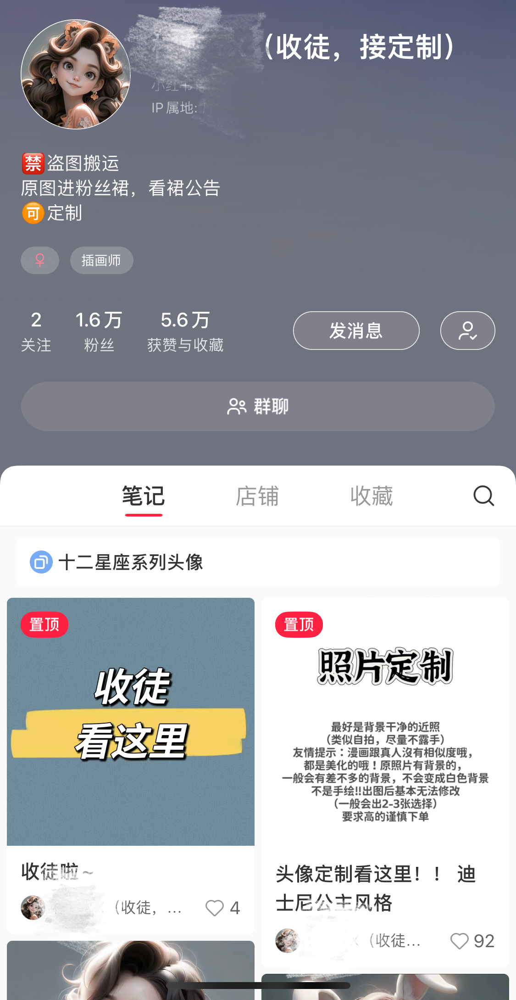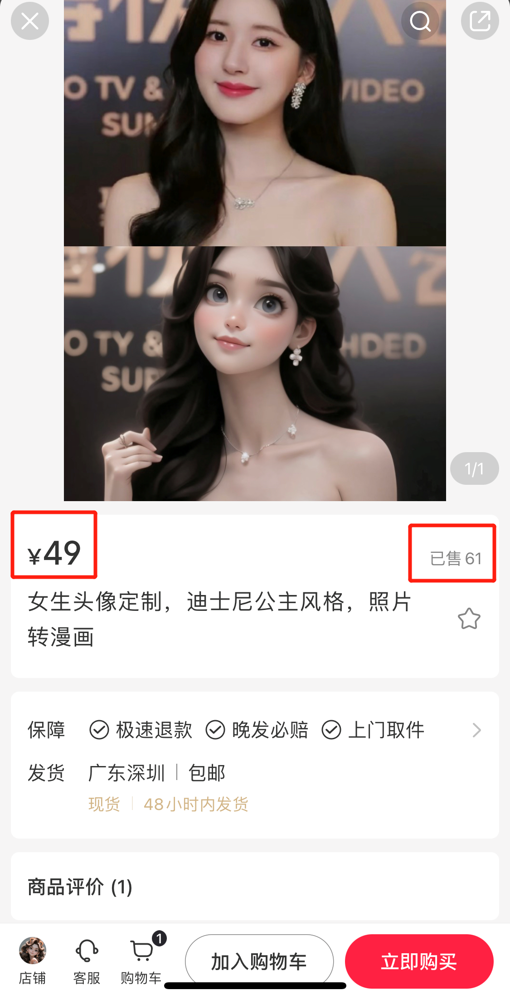

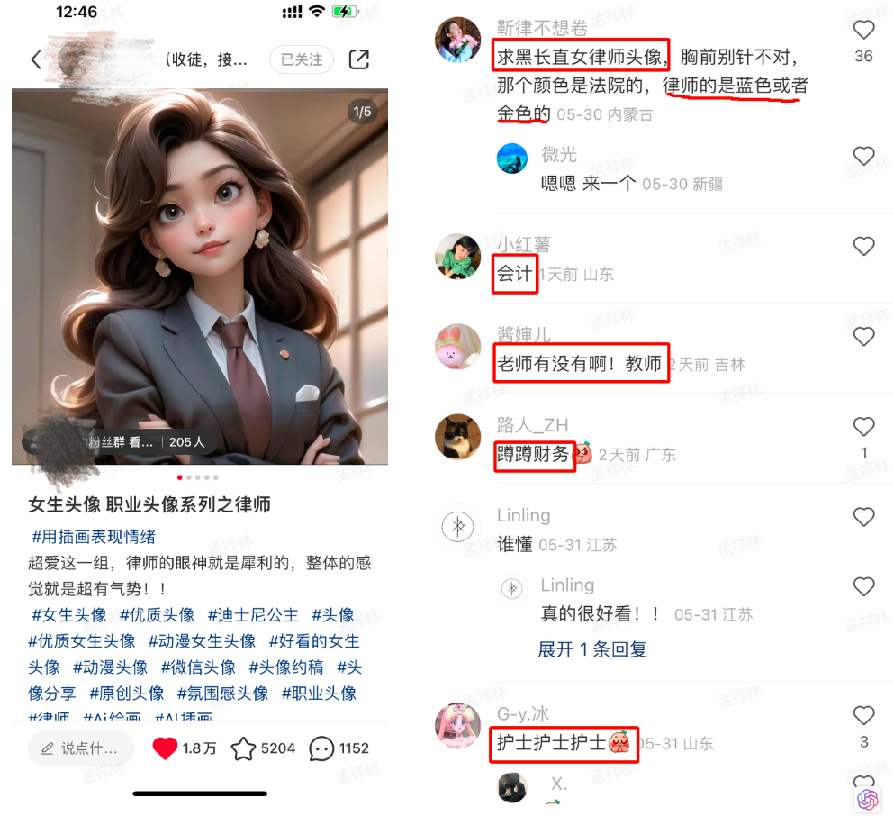

## 萌娃头像定制

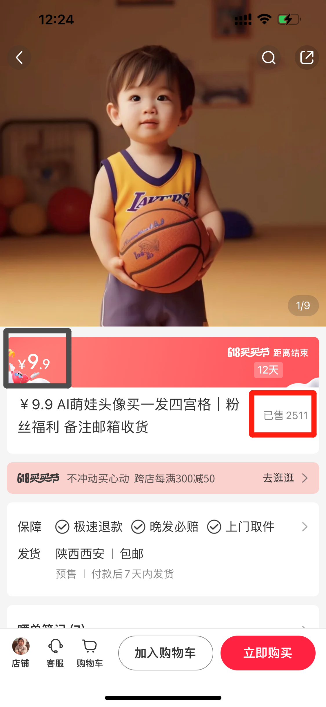

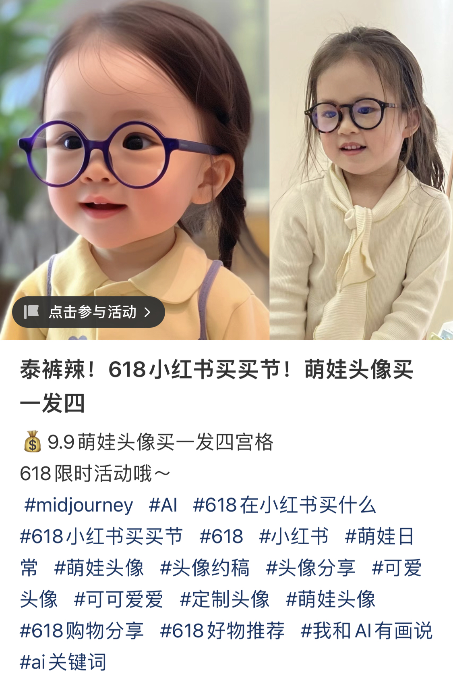

## 头像平台挂载

变现实操：[AI壁纸号一周增加上千粉丝，轻松变现的成功案例分享](https://y3if3fk7ce.feishu.cn/docx/WG42dlOmBolzapxpbN5c8O2tnnf) 

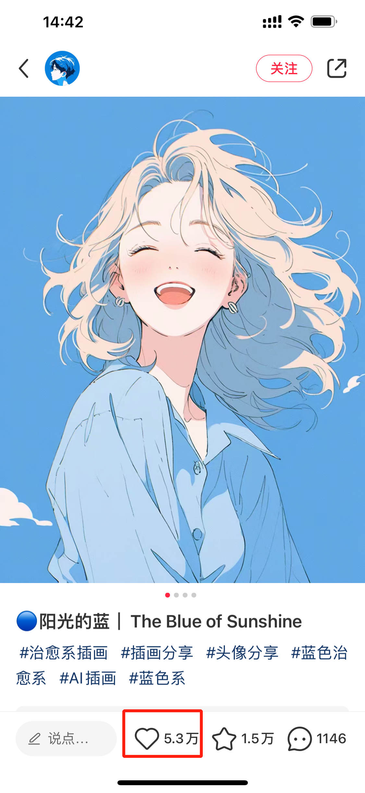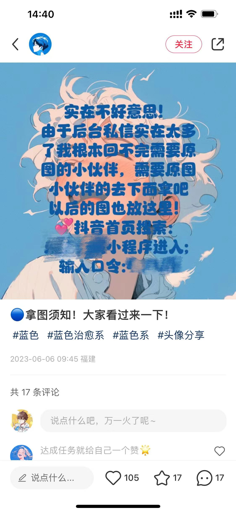

## 小说推广号

在小说推广号的领域，现在通过使用SD文生图，可以做到声画匹配，使得观众有更好的体验。

1. 清楚地了解小说推广项目的运作方式，可以自己创建帐号。
2. 如果你已经有一个团队在运行此项目，是否可以为团队做一些内容升级？
3. 是否可以掌握SD技术，然后为其他人生成对应的图片，做一些外包工作？

## 流量营销号

### 百家号AI共创计划

百家号新推出的活动，鼓励使用AI创作，并提供创作激励。可以利用GPT和AI绘画生成大量的内容以获取平台的流量收益。

百度最近的声量很大，但并不是每个声音都有用。百家号这个产品的流量依然相对较小。但也许由于大家都持有我这种狭隘的观念，反而在其中可能会发掘出一些非常好的赚钱机会。

## 公众号流量主

微信生态可能会成为一个很大的趋势。我不久前的一次使用视频号橱窗的体验也很好。如果你认为微信生态会是一个新的风口，那么你可以尝试从公众号开始进入。

1. 最直接的做法就是利用GPT和AI绘画来编写公众号文章，因为其产出速度非常快，你可以同时运营多个帐号来获取流量收益。

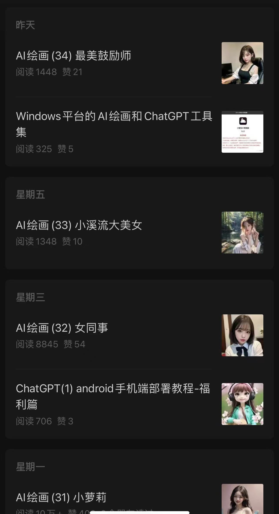

1. 如果你想更有创意一点，你可以在已有内容的基础上进行一些改变，比如将封面图片换成各种美女的照片。

（最近，由于公众号部分流量的释放，使得内容呈现出了推荐形式，因此，利用美女图片吸引眼球以获得更高的阅读量是一个不错的选择。你可以直接使用网红的照片，如果你担心风险的话，你也可以使用AI生成的美女图片。）

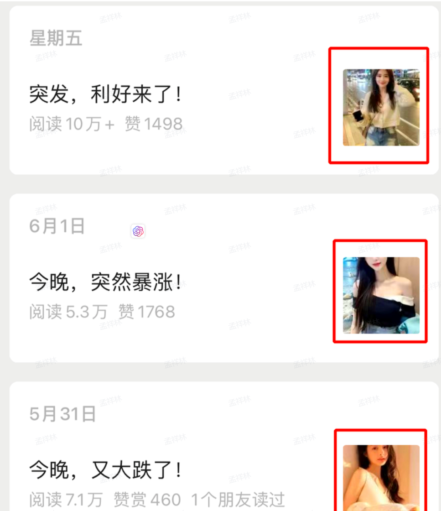

## 知识付费

知识付费可能是最赚钱的方式，比如卖课程，卖服务。

### 知识星球

普通人维护知识星球可能会有困难，你可以参考别的知识星球的内容，发到自己的星球。

很多星球也有推广收益，可以结合这两种方式，选择适合自己的就好。

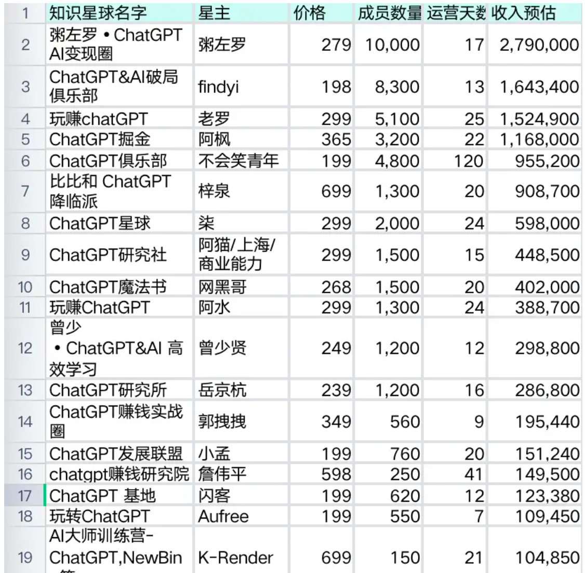

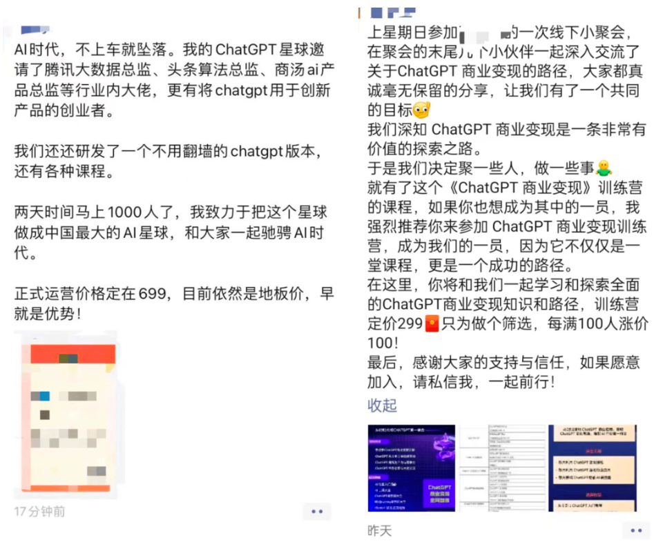

> 在卖一种产品之前，一定要清楚地了解用户真正的需求。
>
> 大多数人卖AI课程的时候，他们以为用户想要学习AI。

用户真的想学AI吗？ 可能并不是这样，因为目前AI的许多应用还不能“真正”地融入到他们的工作中。注意我说的是真正，而不是他们以为，或者他们感觉。

用户的表面需求可能是：AI非常火，我需要学习AI，掌握AI，然后成为超人。

用户的真正需求可能是：AI非常火，我感到非常焦虑，我需要购买一个课程来缓解我的内心焦虑。

有时，用户甚至不能清楚地意识到他们真正的需求是什么。

这就解释了为什么“李”的人工智能课程，即使讲的全是理论知识，还是有那么多人愿意购买。

很多人都说他在割韭菜，但我并不这么认为。

我认为，实际上是韭菜们自己想要被割，而“李”只是把镰刀放在那里而已。

以上这些都是我个人的真实想法，至少我现在还愿意写出一些真话。如果大家愿意听，那就听，如果听不进去，那就肯定是我说错了。

### 小报童

在知识付费变现领域中，"小报童"项目可以成为一个非常强大的工具，主要是因为它将个人的学习过程转化为他人可以付费订阅的有价值内容。具体的变现途径可以包括以下几个方面：

1. 个人学习内容的付费订阅服务：你可以将自己学习的内容整理并转化为一种结构化的形式，如文章、视频教程、音频教程等。这些内容可以提供给对该领域感兴趣，但没有时间深入学习的人。你可以设定一个合理的订阅费，让这些人可以随时随地获取你的学习内容。
2. 一对一咨询服务：你可以提供一对一的咨询或教学服务。如果你在某个领域具有较高的专业知识，你可以通过付费咨询服务将你的知识和经验分享给需要帮助的人。
3. 独家资源的访问权限：如果你在学习过程中创建了一些有价值的资源，比如原创的研究报告、深度的案例分析、独特的学习方法等，你可以设置一个付费门槛，让人们付费获取这些资源的访问权限。
4. 构建一个付费社区：你可以构建一个以你的学习领域为主题的付费社区，会员可以在社区中分享资源、交流心得，你也可以在社区中定期发布自己的学习内容，甚至组织线上或线下的活动。

在实现这些变现策略时，你需要考虑如何提供真正有价值的内容，以满足订阅者的需求和期望。此外，建立和维护订阅者的信任也至关重要。同时，你也需要不断学习和提升自己，以确保你能持续提供高质量的内容。

具体可以看下这个案例：[小报童60%分成-ChatGPT应用案例](https://y3if3fk7ce.feishu.cn/docx/KQxvdvr88orfykx6O2ocQiagnQb) 

## 案例1.AI绘画合成创意

[‍‬⁡‍⁣⁢⁡⁡⁤‬⁡⁤⁢‬⁤⁣⁣‬‍‌‬⁢⁣⁢⁣‍⁡⁣⁢‌‬⁡AI绘画创意合成，变现思路案例分享 - 飞书云文档 (feishu.cn)](https://y3if3fk7ce.feishu.cn/docx/AhdBdntudofC5lx5VCEce8qZnxb)

## 案例2.制作壁纸变现壁纸号

[‌‌⁢⁢⁢⁤⁣⁡‍‌⁤‍⁣‌‬‌‍‬‌⁤‬⁡‌⁢‬⁢⁢⁣⁣⁤‌⁢‬‬⁣AI壁纸号一周增加上千粉丝，轻松变现的成功案例分享 - 飞书云文档 (feishu.cn)](https://y3if3fk7ce.feishu.cn/docx/WG42dlOmBolzapxpbN5c8O2tnnf)

## 案例3.制作绘本变现

chatgpt写故事，midjourney绘图，制作专属儿童绘本

## 案例4.制作美女图像变现

近日看到挺多AI生成的美女照片的，然后又想到了前段时间的AI绘画诈骗，生成的AI美女真的太真实了，真看不出来是假的。 上小红书搜了一下AI绘画人像，发现也有挺多博主在做的，10天左右涨粉7千多，感觉这个赛道还可以。 可以让chatgpt帮你生成一些指令，使用MidJourney 做的ai真人，小红书点赞收藏爆棚。

## 案例5.AI绘画 prompt交易

图2这套可爱动物的prompt $4.99卖了384份。 平台好像是抽成20% 

## 案例6.Midjourney代充会员

Midjourney不再免费，这时候有条件、有能力的朋友可以试试代充，这也是一个不错的变现机会。 标准版30刀一个月，大概210rmb，淘宝上代充230多。