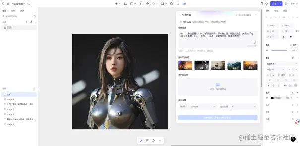

# AI 绘画工具

## AI 绘画工具对比

- DALL·E2：图像生成质量一般
- stability.ai：提示词较繁琐
- Midjourney：需要支付费用
- Ideogram：免费 创意生成

——————————————————————————————————————

[‍‬⁣‬‍⁡⁡‍⁣⁣‍⁡⁡⁣⁣⁢⁤⁢⁤⁡⁡‍‬‌⁢⁢⁤‬‍‌⁡‌⁢AIGC 从入门到精通教程汇总 - 飞书云文档 (feishu.cn)](https://y3if3fk7ce.feishu.cn/docx/QBqwdyde7omVf4x69paconlgnAc)

【海艺 AI】

<https://www.seaart.ai/s/ZnHzXj>

nowai

<https://discord.com/invite/nowai>

BlueWillow

<www.bluewillow.ai>

leonardo

<https://Leonardo.ai>

bing

<www.bing.com/create>

getimg

<https://getimg.ai>

谷歌插件
syntesys-x

图库平台模型文生图
lexica.art

## Pixso AI

Pixso 是一款在线协同设计工具，为产设研团队提供一站式白板、原型设计、UI/UX 设计、设计交付和私有化部署服务。Pixso AI 将人工智能与设计工具结合，为设计师提供了一种全新的方式来快速生成图像内容。

作为一款 AI 绘画网站免费，Pixso AI 利用先进的自然语言处理和图像生成算法，使设计师能够通过简单的文本描述，即可快速生成符合需求的高质量图像。


快速生成：设计师只需用简短的文本描述，无需手动绘制或寻找现成素材，即可迅速生成图像内容。这大大缩短了设计的时间周期，提高了工作效率。


灵活性和定制性：设计师可以根据需要提供具体的图像要求，包括颜色、形状、布局等，以获得符合设计目标的图像。AI 系统会尽可能地解读和还原设计师的意图，提供个性化的图像生成结果。



创意激发：AI 绘画网站免费 Pixso AI 不仅可以用于快速生成具体的设计元素，还可以用于创意的探索和激发。设计师可以使用简单的文本描述来表达想法，AI 系统会生成相应的图像，为设计师提供新颖的创意视角和可能性。


提高效率：借助 AI 技术，Pixso AI 文本生成图像功能可以大大减少重复劳动和资源浪费。设计师可以将更多精力投入到创造性的工作上，而不是花费时间在繁琐的图像绘制或寻找素材上。此外，Pixso AI 还提供 AI 灵感专家、AI 语言大师等功能。


## PaintsChainer


PaintsChainer 是一款出色的自动上色 AI 绘画网站免费。它采用深度学习技术，通过读取用户上传的黑白线稿，自动为画作上色。PaintsChainer 提供了多种上色风格和调色板选项，从传统水彩到油画效果，甚至是动漫风格，用户可以根据需求选择不同风格的上色效果。绘画师可以使用这款工具快速上色，从而将更多时间专注于创意构思和绘画技巧的提升。

lPaintsChainer 使用深度学习技术，可以自动将黑白线稿上色，为绘画师节省大量上色时间，提高作品的效率和质量。

lAI 绘画网站免费 PaintsChainer 提供了多种上色风格和调色板选项，用户可以根据需要选择不同风格的上色效果，创造出多样化的作品。

lPaintsChainer 允许用户对上色结果进行微调，包括颜色饱和度、明暗度等，满足绘画师对作品细节的精细控制。

## PhotoMania


PhotoMania 是一款功能强大的滤镜 AI 绘画网站免费。它提供了超过 500 种不同的滤镜效果，涵盖了人像、风景、艺术和动画等多种风格。用户可以将普通照片通过 PhotoMania 的滤镜转换成独特的艺术作品，为照片增色不少。这款软件的优势在于多样化的滤镜选项，用户可以随心所欲地优化和美化照片，使其在社交媒体平台上脱颖而出。

lPhotoMania 提供了超过 500 种不同的滤镜效果，包括人像、风景、艺术和动画等，让用户能够轻松将照片转换为艺术作品。

lPhotoMania 具有简单直观的用户界面，无需专业的图像处理知识，用户可以轻松使用滤镜来优化和美化照片。

lAI 绘画网站免费 PhotoMania 支持将处理后的照片直接分享到社交媒体平台，方便用户与朋友和粉丝分享创作成果。

## Prisma

Prisma 是备受欢迎的 AI 绘画网站免费，以其出色的艺术滤镜效果而闻名。Prisma 为用户提供多种艺术风格的滤镜，包括著名画家的风格，如梵高和毕加索，以及素描、卡通、水彩等风格。这款软件的优势在于实时预览功能，用户可以在应用滤镜前预览不同效果，从而选择最符合其创作愿景的滤镜风格。同时，Prisma 在处理照片时保持独特的细节和色彩，确保生成的艺术作品质量优异。

lAI 绘画网站免费 Prisma 提供了多种艺术滤镜效果，可以将普通照片转换成具有油画、素描、卡通风格等不同艺术风格的作品。

lPrisma 具有实时预览功能，用户可以在应用滤镜前预览不同效果，并选择最喜欢的滤镜风格进行处理。

lPrisma 支持将处理后的作品分享到社交平台，用户可以与朋友和粉丝分享自己的艺术作品。

## Toonify


Toonify 是一款有趣的卡通化 AI 绘画网站免费。它能够将人物照片转换为逼真的卡通效果。Toonify 的优势在于其卡通化效果的高度可定制性。用户可以根据个人喜好调整卡通化的强度和细节，从而得到符合自己风格的卡通作品。此外，该软件在卡通化的同时保留了照片的细节，使得转换后的作品更具表现力和真实感。

lAI 绘画网站免费 Toonify 使用 AI 技术，可以将人物照片转换为逼真的卡通化效果，让照片变得有趣和生动。

lToonify 允许用户调整卡通效果的强度和细节，满足用户对卡通化效果的个性化需求。

lToonify 的卡通化效果具有高质量的输出，不仅保留了照片的细节，还能添加卡通化的特殊效果。

## 优设网 Tag—AIGC

[AIGC - 优设网 - 学设计上优设 (uisdc.com)](https://www.uisdc.com/tag/aigc)

## 其他 AI 绘画工具

Stable Diffusion (开源)，在线使用地址：

- <https://dreamlike.art/create>
  - 使用教程：
- <https://playgroundai.com/create>
  - 使用教程：
- <https://dreamstudio.ai/dream>
  - 使用教程：

Disco Diffusion (开源) : <https://github.com/alembics/disco-diffusion>

Midjourney (未开源) : <www.midjourney.com，教程详见下面课程>

DALL-E-2(未开源): <https://openai.com/dall-e-2>

NovelAI (未开源) : [NovelAI - The AI Storyteller](https://novelai.net/)

[Hypotenuse AI](https://app.hypotenuse.ai/invited)（文字内容和绘画）：一款综合性的人工智能工具，专注于自动化文字内容和绘画生成。它利用了多种 AI 技术，包括自然语言处理、图像生成和深度学习，为用户提供一站式的创作解决方案。

## Alpaca

<https://gpt3demo.com/apps/alpaca>

## AI Render

<https://gpt3demo.com/apps/ai-render>

## Dall-E-2

<https://gpt3demo.com/apps/dall-e-2-by-openai>

## Diffusion Bee

<https://gpt3demo.com/apps/diffusion-bee>

## Getimg.ai

<https://gpt3demo.com/apps/getimg-ai>

## Hotpot.ai

<https://gpt3demo.com/apps/hotpot-ai>

## Midjourney

<https://gpt3demo.com/apps/midjourney>

## Pixray

<https://gpt3demo.com/apps/pixray>

## Playground ai

<https://gpt3demo.com/apps/playgroundai>

- Midjourney：这是一个基于扩散的文本到图像生成模型，它使用了一个 1.5 亿参数的 Transformer 编码器-解码器模型，并在一个包含 14 万张图片和 400 万个文本标签的数据集上进行预训练。Midjourney 可以根据简单或复杂的文本提示生成图像，并且可以通过调整不同的参数来控制图像的质量和多样性。Midjourney 的特点是新手友好，但可控性差、细节优化难。下限高，但上限低。
- Anything：这是一个以二次元漫画为主打的模型，一直也比较火。Anything 可以生成各种风格和主题的动漫图像，对关键词的要求不太高。Anything 的版本也比较多，包括 Anything-V3.5，Anything-V4.0，Anything-V4.5，Anything-V5.0 等等，不同版本下还有各类变形版本和剪枝版本。推荐下载 4.0 或者更新的版本。
- Chilloutmix：这是一个以亚洲美女为主打的模型，也是市面上你看到的大量的 AI 美女基本上都是这个模型生成的。Chilloutmix 可以生成高质量、高分辨率、高真实度的美女图像，对提示词的要求不高。但是，由于有人利用该模型从事网络诈骗行为，已经有骗子被网警抓进去了，因此吓得该模型的作者删库跑路。目前该模型在 Civitai 上仍可以继续下载，但由于该模型争议较大，因此不建议大家轻易下载使用，如果要使用，请谨慎使用，不要用于非法的目的。

- [CM3Leon](https://new.qq.com/rain/a/20230717A07ATQ00)：这是 Meta 公司开发的一款基于 Transformer 的多模态模型，它可以根据文本生成高质量的图像，也可以为图像生成文本描述，甚至可以根据文本指令编辑图像。Meta 公司称，这款模型在文本到图像生成方面达到了业界最高水平，超过了谷歌、微软等公司的产品。CM3Leon 是一种基于 tokenizer 的自回归模型，相比于其他基于扩散（diffusion）的模型，Transformer 模型更加高效，训练速度更快，计算成本更低。
- DALL-E：这是 OpenAI 开发的一款基于扩散的文本到图像生成模型，它可以根据复杂和多样的文本提示生成图像。DALL-E 使用了一个 12 亿参数的 Transformer 编码器-解码器模型，它可以同时处理文本和图像，并在一个大规模的数据集上进行预训练。DALL-E 可以生成各种风格和主题的图像，甚至可以创造出一些不存在或不合逻辑的事物。
- Midjourney：这是一个开源的基于扩散的文本到图像生成模型，它使用了一个 1.5 亿参数的 Transformer 编码器-解码器模型，并在一个包含 14 万张图片和 400 万个文本标签的数据集上进行预训练。Midjourney 可以根据简单或复杂的文本提示生成图像，并且可以通过调整不同的参数来控制图像的质量和多样性。

## 艺码

[艺码](https://yima.me/)


根据文字描述，将二维码转成一幅可扫描的图像的网页工具

## OpenJourney

待定

## AI 中文绘图

百度开发的开源 AI 图像生成器 📘[**ERNIE-ViLG**](https://cloud.baidu.com/doc/NLP/s/qlakgh129) 也在互联网上流传。

### 💡 ERNIE-ViLG 是什么

ERNIE 代表通过知识整合增强表示——视觉语言生成。它是一个统一的生成预训练框架，用于使用 Transformer 模型进行双向图像文本生成。

需要明确的是，ERNIE 并不是 Stable Duffusion 的一个变体版本，尽管这两种模型都是开源的。根据 📘[**ERNIE 论文**](https://arxiv.org/pdf/2210.15257.pdf)，ERNIE-ViLG 2.0 是一种改进的文本到图像扩散模型，具有知识增强的去噪专家组合，以结合有关视觉场景的额外知识，并在不同步骤中解耦去噪能力。


### 💡 ERNIE-ViLG 使用方法

现在可以通过 huggingface 免费访问该模型。我们可以在 📘[**ERNIE-ViLG Demo**](https://huggingface.co/spaces/PaddlePaddle/ERNIE-ViLG) 查看工具实例。


界面非常简单:可以看到经典的提示框，各种艺术风格的选择，以及图像分辨率。在艺术风格方面，ERNIE 提供了一些有趣的选择。这让我想起了 📘[**Dream by WOMBO**](https://dream.ai/) 中的一个类似功能。


让我们用提示“An astronaut riding a horse in space”来生成样本。


该应用程序生成六张分辨率为 1024x1024 的图像。

ERNIE 的研究人员声称，他们的方法比 Dall-E2 和 Stable Diffusion 产生更清晰、更自然的细节。

真的吗？现在让我们尝试将艺术风格更改为“油画”。


这些结果本身都非常惊艳。

质量上，ERNIE 可以与 Dall-E2 和 Stable Diffusion 相媲美。但是，它在一致性方面表现不佳，就像在上面提到的，其中两个结果中的马无处可寻。这可能是训练 ERNIE 的数据集较小所致。

不过，如果仔细考虑数据集的大小，训练了 14.5 亿张图像的 ERNIE 与 MidJourney、Google Parti 等大型竞争对手的差距并不大。


也许开发人员找到了一种优化算法的方法，使其能够在较小的数据集上运行良好。我假设如果模型是在更大的数据集上训练的，现有的限制就会消失。

需要特别注意的是，ERNIE 是用中文开发的。这意味着，在开始图像生成过程之前，必须将英文提示翻译成中文。当然，使用中文的宝宝可以尽情玩耍~

这里有更多示例结果。


> 上图提示文字：“戴眼镜的猫”风格“油画”


> 上图提示文字：“五官端正的绘画女生”

### 💡 API 访问 ERNIE-ViLG

您可以通过 API 访问 ERNIE。如果您想尝试使用 API，请按照这个 📘[PaddleHub/modules/image/text_to_image/ernie_vilg/README.md at develop · PaddlePaddle/PaddleHub (github.com)](https://github.com/PaddlePaddle/PaddleHub/blob/develop/modules/image/text_to_image/ernie_vilg/README.md) 上的指南进行操作。

示例 API 调用如下所示。

```python
def generate_image(
          text_prompts:str,
          style: Optional[str] = "探索无限",
          topk: Optional[int] = 6,
          output_dir: Optional[str] = 'ernievilg_output')
```

- `text_prompts`：输入提示
- `style` ：生成图像的风格
- `topk`：生成图像的数量（最多 6 个）
- `output_dir`：保存输出图像的目录

ERNIE 的使用指南还有一个建议列表，可帮助您找到结合使用样式和修饰符的最佳方式。

- 【作图规则】Prompt 构建是文本符合逻辑的组合，有序且丰富的描述可以不断提升画面效果
- 【新手入门】不知如何输入 Prompt？点击示例，体验文生图的魅力，参考教程，逐步进阶~
- 【风格生成】试试添加 “国潮”、“国风”等，感受中国风的魅力
- 【风格生成】试试混合两种代表性的风格，例如“赛博朋克，扁平化设计”、”皮克斯动画，赛博朋克”
- 【人像生成】添加“仙鹤、月亮、楼阁、小屋、街道、玫瑰、机械”，画面会更饱满
- 【人像生成】添加“精致面容、唯美、cg 感、细节清晰“等，人物刻画会更细致
- 【风格生成】添加“扁平化风格，logo”等，可以设计出各类图标等，例如 “猫猫头像，扁平化风格”
- 【风格生成】指定颜色，或添加“烟雾缭绕”、“火焰”、“烟尘”、“花瓣”，生成画面的氛围感更饱满
- 【创意生成】发挥想象力，例如：“中西混搭”、“泰迪熊唱京剧”、“米老鼠吃火锅”
- 【风格生成】“水彩”，“水墨”与古诗组合，画面意境会有提升~
- 【风格生成】想要日系头像和拟人化动物？试试关键词“日系手绘”、“治愈风”
- 【风格生成】添加“pixiv”，生成二次元或者动漫的画质更惊艳

## 1. 福托尔（Fotor）

Fotor，一站式多合一在线照片编辑器，最近发布了一个 精湛的[AI 图像生成器](https://www.fotor.com/features/ai-image-generator/) 。你只需要把你的想法输入到生成器中，然后你可以看到它在几秒钟内变成一个图像。Fotor 有多种图像样式供您选择，例如随机，3D，动漫等。

Fotor 的 AI 文本到艺术生成器最显着的特点是它非常适合初学者使用，只需填写文本并选择要生成图像的效果即可。如果您对照片不满意，可以多次重复生成，以确保获得最满意的结果。每个帐户每天都有一个积分可供您免费使用高质量的 [AI 艺术](https://www.fotor.com/features/ai-art-generator/)。

**主要特点：**

- 每天生成 10 张免费图片。
- 9 种灯光效果供您选择。
- 9 种不同的转换风格供您选择。
- 文本到图像和图像到图像的转换模式。
- 6 种作品可供选择。


## 2. 达尔-E 2（DALL-E 2）


公众已知的最受欢迎的 AI 绘画生成器是 [Dall-E-2](https://www.fotor.com/blog/dall-e-image-generator/)图像生成器 ，由 OpenAI 开发的 AI 图像生成器。只需几分钟，您就可以使用 AI 技术创建高度逼真的图像。该工具可用于创建插图、设计产品和为业务产生新想法。Dall-E-2 是一个易于使用的界面，任何人都可以使用 AI 创建高质量的图像。DALL-E 2 支持向生成的图像添加详细信息或对其进行其他修改。

**主要特点：**

- 高度逼真的图像。
- 创建插图。
- 设计产品。
- 可定制的多层图像。
- 编辑和修饰功能。
- 免费试用（尽管您必须通过等候名单获得邀请）。

## 3. 火锅（Hotpot ai）--支持 api

官网：[Hotpot.ai - Hotpot.ai](https://hotpot.ai/)


火锅 AI 可帮助您创建令人惊叹的图形、图像和文本。它激发创造力并自动化工作，而易于编辑的模板使任何人都可以创建设备模型、社交媒体帖子、营销图像、应用程序图标和其他工作图形。

火锅 AI 的文本到图像 AI 绘画生成器使任何人都可以创建有吸引力的绘画，插图和图像。描述你想要什么，并观看火锅将其变为现实。

付费创作在 3-10 秒内完成。免费请求需要 1-15 分钟，具体取决于流量。付费用户可以获得更快的服务器、更好的图像、商业用途，并避免每日限制。该系统为不太富裕的人免费提供补贴。您还可以免费申请积分以减少等待时间。

**主要特点：**

- 无需代码即可创建 API/批量。
- 快速照片生成（付费）。
- 每日免费照片生成积分可用。

## 4. 夜间咖啡厅（NightCafe）

NightCafe 官网：<https://creator.nightcafe.studio/>

NightCafe Creator：AI 绘画灵感生成器

一款免费的人工智能绘画灵感生成器，你只需输入一段描述文本，自动生成对应场景的图片。整体效果就像电脑手绘一样，几乎看不出区别，AI 绘画时代真的来了。


### 使用方法

1、打开工具地址，输入想要的画面描述，仅支持英文识别，如 A trapped pie from heaven（天上掉馅饼），选择想要的插画风格，这里有 16 种插画风格可选。

<https://creator.nightcafe.studio/create/text-to-image>

描述关键词参考：<http://www.sucaijishi.com/prompts-93-1.html>


2、选择渲染模式，默认就好，点击`CREATE`开始生成插画


3、生成效果如下图，20%完成度已经足够参考价值了，如果需要更完善，需要另外付费。


夜咖啡馆是著名的人工智能艺术生成器之一。它以比其他 AI 绘画生成器具有更多的算法和选项而闻名，并且新手很容易上手。您需要做的就是前往他们的网站并根据您的想象力输入文本提示。然后，您需要等待最多 30 秒，一件艺术品才会出现在您面前。Nightcafe 有自己的一套积分系统，您可以通过参加各种活动来获得积分，然后拥有可以免费生成图像的次数。此外，您还可以购买积分。

**主要特点：**

- 信用赚取系统。
- 视频生成工具。
- 有用的社交功能。
- 获得您生成的艺术品的所有权。
- 比其他生成器更多的算法

## 5. 深度人工智能（DeepAI）

DeepAI 官网：[DeepAI](https://www.deepai.com/)


自 2016 年以来，DeepAI 是首批通过开源软件生成人工智能图像的 AI 绘画生成器之一。

DeepAI 允许您创建任意数量的图像，并且每个图像都是唯一的。它是高度可定制的，允许您更改细节、颜色、纹理等的数量。如果您输入插图，DeepAI 可以立即生成与分辨率无关的矢量图像。

这是一个免费的在线 AI 图像生成器，这意味着您无需下载或进行其他设置。DeepAI 还有一个 API，开发人员可以使用它来连接到另一个软件项目。

**主要特点：**

- 始终免费使用。
- 为每个提示生成四个输出图像。
- 开源软件。
- 更改每个图像的各种细节。
- 使用卡通 GAN 创建卡通

## 6. 深度梦境生成器（Deep Dream Generator）

Deep Dream Generator 官网：[Trending Dreams | Deep Dream Generator](https://deepdreamgenerator.com/)

### eepdreamgenerator: AI 绘画图片生成社区平台

- [AI 工具](https://www.nettsz.com/ai)
- 5 月 7 日
- 0
- 1.8k

[](https://www.aiagc.com/?via=nettsz.com) [](https://link.nettsz.com/mfzydh) [](https://www.onetts.com/?via=nettsz.com) [](https://www.shijuezu.com/?via=nettsz.com)

deepdreamgenerator 是一个 AI 绘画生成社区平台，可以让你使用人工智能技术创造独一无二的图片作品。你可以上传你自己的图片，或者使用文本来描述你想要的场景，然后选择不同的风格和参数来生成图像。也可以浏览平台上其他用户生成的作品，给他们点赞或评论。

[访问网站](https://deepdreamgenerator.com/?utm_source=nettsz.com)

Deep Dream Generator 的灵感来源于 Google 的 Deep Dream 项目，它是一个利用神经网络来分析和重构图像的实验。Deep Dream Generator 将这一实验发展成了一个功能丰富和易用的平台，让任何人都可以利用 AI 来发挥自己的想象力。

Deep Dream Generator 有三种主要的模式：艺术模式、融合模式和文本模式。艺术模式可以让你将一张图片转换成不同的绘画风格，比如油画、水彩、卡通等。你可以选择预设的风格，或者上传自己喜欢的风格图片，让 AI 学习并应用到你的图片上。

融合模式可以让你将两张图片混合在一起，创造出新的图像。你可以控制混合的程度和方向，以及选择不同的算法来实现不同的效果。

文本模式可以让你通过输入一段文字来生成一张图像。你可以描述你想要的场景、物体、颜色、风格等，让 AI 根据你的提示来创造出逼真或梦幻的图像。

Deep Dream Generator 是一个适合所有人的平台，无论你是一个专业的艺术家、一个爱好者、或者一个好奇者，你都可以在这里找到乐趣和灵感。

你可以浏览其他用户创建和分享的图像，给他们点赞和评论，或者加入不同的主题和挑战来展示你的作品。你也可以下载和保存你生成的图像，或者将它们打印成海报、明信片等物品。

Deep Dream Generator 是一个连接 AI 和艺术的桥梁，它让你能够以一种全新的方式来表达自己。

**特色功能**：

Deep Dream Generator 支持高清图像生成，最高可达 4K 分辨率。这意味着你生成的图像会非常清晰和细致，适合放大或打印。

Deep Dream Generator 支持进化功能，让你可以对已经生成的图像进行再次生成，创造出更多样化和复杂的图像。你可以选择不同的风格、混合方式、文本提示等，让 AI 在原有的基础上进行改进和变化。

Deep Dream Generator 支持批量生成功能，让你可以一次性生成多张图像，节省时间和精力。你可以选择不同的风格、混合方式、文本提示等，让 AI 为你生成多个不同版本的图像。

Deep Dream Generator 支持视频生成功能，让你可以将一段视频转换成不同的绘画风格，或者将两段视频混合在一起，创造出新的视频。你可以控制视频的长度、分辨率、帧率等参数，以及选择不同的算法来实现不同的效果。

Deep Dream Generator 支持社交功能，让你可以与其他用户互动和交流。你可以浏览其他用户的图像，给他们点赞和评论，或者关注你喜欢的用户。你也可以加入不同的主题和挑战，展示你的作品并看看别人的创意。你还可以邀请你的朋友来使用 Deep Dream Generator，与他们分享你的图像和视频。

Deep Dream Generator 支持定制功能，让你可以根据自己的喜好和需求来调整生成的图像和视频。你可以选择不同的参数，比如风格强度、混合比例、色彩平衡、对比度、锐度等，来改变图像和视频的外观和感觉。你也可以使用裁剪、旋转、翻转等工具来调整图像和视频的大小和方向。

Deep Dream Generator 支持教育功能，让你可以学习更多关于 AI 和艺术的知识和技巧。你可以查看平台上提供的教程和指南，了解如何使用不同的模式和功能，以及如何优化你的生成结果。你也可以参考平台上提供的风格库，学习不同的绘画风格和艺术家，以及他们的作品和背景。

**产品价格**：

Deep Dream Generator 是一个免费的平台，任何人都可以注册并使用它来生成图像和视频。但是，如果你想要享受更多的功能和服务，你可以选择升级到高级会员或者专业会员。以下是不同会员等级的价格和优势：

- 免费会员：每天可以生成 10 张图像或者 1 分钟视频，最高分辨率为 1080p，无法使用进化功能、批量生成功能、视频生成功能、社交功能等。
- 高级会员：每月支付 9.99 美元，每天可以生成无限张图像或者 10 分钟视频，最高分辨率为 4K，可以使用进化功能、批量生成功能、视频生成功能、社交功能等。
- 专业会员：每月支付 19.99 美元，每天可以生成无限张图像或者 30 分钟视频，最高分辨率为 4K，可以使用进化功能、批量生成功能、视频生成功能、社交功能等，并且享受优先处理、专属客服、定制需求等特权。
- 如果你想要节省一些费用，你也可以选择年付或者终身付的方式来购买高级会员或者专业会员。年付方式可以节省 20%的费用，终身付方式只需支付一次 99.99 美元或者 199.99 美元就可以永久享受高级会员或者专业会员的服务。

**常见问题**：

Q: Deep Dream Generator 是如何工作的？

A: Deep Dream Generator 是基于深度学习技术开发的平台，它使用了一种叫做卷积神经网络（CNN）的算法来分析和重构图像。CNN 是一种模仿人类视觉系统工作原理的算法，它由多个层次组成，每个层次都负责识别图像中不同层次的特征，比如边缘、形状、纹理等。Deep Dream Generator 利用 CNN 来学习不同风格图片中的特征，并将它们应用到目标图片上，从而实现风格转换。Deep Dream Generator 也利用 CNN 来学习文本提示中描述的特征，并根据它们来生成图像。Deep Dream Generator 还利用 CNN 来将两张图片中的特征进行混合，从而实现图像融合。

Q: Deep Dream Generator 是安全的吗？

A: Deep Dream Generator 是一个安全和可信的平台，它尊重并保护用户的隐私和版权。你上传和生成的所有图像和视频都是加密存储的，只有你自己可以访问和管理它们。你可以随时删除你不想保留的图像和视频，它们也会从平台上永久删除。你分享的图像和视频都会标注你的用户名，以表明你是它们的原创作者。如果你发现有人侵犯了你的版权，你可以联系平台的客服，他们会及时处理你的投诉。

Q: Deep Dream Generator 支持哪些格式和大小的图像和视频？

A: Deep Dream Generator 支持常见的图像格式，比如 JPG、PNG、GIF 等，以及常见的视频格式，比如 MP4、MOV、AVI 等。你上传的图像或者视频的大小不应超过 100MB，否则可能会导致上传失败或者处理缓慢。你生成的图像或者视频的分辨率取决于你选择的模式和会员等级，最高可达 4K。

Q: Deep Dream Generator 需要多长时间来生成一张图像或者一段视频？

A: Deep Dream Generator 生成一张图像或者一段视频所需的时间取决于多个因素，比如你选择的模式、风格、参数、分辨率等，以及平台上当前的任务数量和服务器负载等。一般来说，生成一张图像需要几秒到几分钟不等，生成一段视频需要几分钟到几小时不等。如果你是高级会员或者专业会员，你可以享受优先处理的服务，从而缩短生成时间。


深度梦境生成器 是另一种流行的 AI 绘画生成器，支持在线人工智能来创建逼真的图像。Deep Dream 依赖于用数百万张图像训练的神经网络。它易于使用，只需要您上传图像，然后根据原始图像自动生成新图像，您还可以选择不同地方或时期的绘画风格。

该工具允许您选择一个类别，例如动物或风景，然后基于它创建逼真的图像。最重要的是，Deep Dream 允许您从三种样式中进行选择。深风格，薄风格或深梦。选择样式后，可以预览图像。

**主要特点：**

- 训练神经网络的数百万张图像。
- 不同的绘画风格。
- 图像的分类。
- 文本到图像，图像到图像。

## 7. 克雷永（Craiyon）

Craiyon AI: AI 绘画艺术图片生成器工具

Craiyon 官网：[www.craiyon.com](https://www.craiyon.com/)

[Craiyon AI: AI 绘画艺术图片生成器工具 – 网络探索者 (nettsz.com)](https://www.nettsz.com/craiyon-ai)

[](https://alternativeto.net/software/dall-e-mini/about/)

Craiyon，以前称为 DALL-E mini，是一种人工智能模型，可以从任何文本提示中绘制图像。只需输入文本描述，它将根据您输入的文本生成 9 个不同的图像。该模型需要大量计算，因此 Craiyon 依靠广告和捐赠来支付其服务器的费用。只要您尊重使用条款，您就可以随意使用它们供个人使用，无论您是想与朋友分享还是将它们打印在 T 恤上。 **主要特点：**

- 易于使用。
- 无需注册或注册。
- 免费生成无限的 AI 图像。
- 一次生成 9 张图像，以有趣和创造性的方式

## 8. 星空人工智能（StarryAI）

StarryAI 官网：


星空 AI 是一个 AI 绘画生成器，专注于将您的想法转化为 NFT 艺术。与大多数其他 AI 艺术生成器类似，Starry AI 赋予您生成图像的所有权。这意味着您可以在任何地方使用图像，用于个人或商业用途。

Starry AI 最好的部分是它是完全免费的。它是最好的免费 AI NFT 艺术生成器之一。它不需要用户的任何输入。它可以使用机器学习算法处理图像。该技术在不断改进，但已经有令人难以置信的使用该应用程序创作的艺术示例。

**主要特点：**

- 自动图像生成器。
- 无需用户输入。
- 免费的 NFT 生成器。
- 文本到图像

## Leap AI 绘画工具

**免费试玩**：

要 get 同款 AI 照片，步骤很简单。

首先，来到**tryleap.ai**这个网站，注册一个账号：<https://tryleap.ai>

然后戳进**Generate Images**这个选项，就可以开始生成图片啦。

后戳进**Generate Images**这个选项，就可以开始生成图片啦。


值得一提的是，在 Leap 里，有多种生成模型可选，包括 Stable Diffusion v1.5 和 v2.1。而想要生成更具真实感的图片，可以选择**Realistic Vision v2.0**这个模型。


步长、生成图片数量都可以自行选择。目前步长上限是 100，一次生成图片的最大数量是 4。

不过 upcaling（让图片更清晰、细节更丰富）这个功能需要加钱才能用。


来试试让 Leap 生成一个喜欢唱跳 rap 的篮球少年：


不过在实际测试中，我们发现相比于怼脸拍的照片，Leap 对全身照的把握还有所欠缺。经常顾得了身体姿态，就顾不上脸了

除了网页版本，你还可以拿上 Leap 提供的 API，在 Colab 上试玩：

或者直接接到自己的应用里：

费用方面，可以先免费试玩 100 张图像。升级 Pro 之后，Leap 的收费策略是“按需付费”，具体规则是：


其中提到的**Remix**是 P 图功能，目前只有付费用户可以使用。


## One More Thing

除了生成逼真图片，Leap 还发布过不少好玩的 AI 应用。

比如根据草图，生成建筑效果图。


让 AI 每小时给你生成一张新壁纸的 Chrome 插件。


感兴趣的话你也试一试吧~

## 🤖 『AI 绘画应用与工具大全』30+ 网站、App 与小程序全体验报告

这是一个持续更新的「AI 绘画」应用与工具大全，是 ShowMeAI 社区小伙伴们最常使用和最经常推荐、转发的应用/工具合辑，并贴心写明了是否需要魔法、是否免费等信息。清单目前包含 23 款网站、App 和小程序，并在持续增加中。


> ShowMeAI 知识星球标签：**找工具**

进入知识星球，点击「找工具」标签，或者使用关键词搜索，就可以看到本条内容啦！火热更新中，一起来尝试吧！

### 🔔 国外 | 需要魔法

- **Midjourney**：综合体验最好地 AI 绘画工具 [www.midjourney.com](https://www.midjourney.com)
- \***\*Stable Diffusion**：开源的图像合成模型，官网注册后有 200 张图片的在线额度；也可以本地部署 [stablediffusionweb.com/](https://stablediffusionweb.com/)
- **DALL·E 2**：OpenAI 开发的 AI 绘画工具，功能强大 [openai.com/product/dal…](https://openai.com/product/dall-e-2)
- **Adobe Firefly**：Adobe 推出的创意生成式 AI 模型集，网页版目前可申请内测 [www.adobe.com/sensei/gene…](https://www.adobe.com/sensei/generative-ai/firefly.html)
- **Bing image Creator**：微软推出的 AI 生成图片工具，技术由 OpenAI DALL∙E 驱动 [bing.com/create](https://bing.com/create)
- **NovelAI**：号称最强的二次元生成 AI 工具，非常适合用于漫画创作 [novelai.net/](https://novelai.net/)
- **Nijijourney**：由 Midjourney 与 Spellbrush 合作推出的绘画工具，专门生成二次元动漫风插画 [nijijourney.com/zh/](https://nijijourney.com/zh/)
- **Canva**：一款支持多平台的在线平面设计工具，包含集成了 AI 功能的系列产品 [www.canva.com/ai-image-ge…](https://www.canva.com/ai-image-generator/)
- **Fotor**：类似于 Canva 的设计平台，支持生成多种设计 [www.fotor.com/features/ai…](https://www.fotor.com/features/ai-image-generator/)
- **Leonardo**：AI 绘图社区，同时也是一个绘图工具，深度集成了 Stable Diffusion 各种插件 [leonardo.ai/](https://leonardo.ai/)
- **CivitAI**：分享和发现 AI 艺术创作资源的平台，可以浏览和下载其他用户创建的模型 [easywithai.com/resources/c…](https://easywithai.com/resources/civitai/)
- **DreamUp**：DeviantArt 推出的 AI 插图生成工具，可以根据输入的 Prompt 生成图片 [www.deviantart.com/dreamup](https://www.deviantart.com/dreamup)
- **Lexica**：提供了一个基于 Stable Diffusion 的 AI 图像的搜索引擎，也可以根据用户输入的 Prompt 生成逼真的图像 [lexica.art/aperture](https://lexica.art/aperture)

### 🔔 国内 | 无无无需魔法

- **文心一格**：依托百度飞桨、文心大模型的 AI 艺术与创意辅助平台 [yige.baidu.com/](https://yige.baidu.com/)
- **云景**：国内开发者发布的 AI 绘图网站，后台集成 22 个模型和多个国风 Lora，可以自由选择切换 [yunjing.gallery/](https://yunjing.gallery/)
- **即时 AI 创意画廊**：即时设计众多 AI 产品种的一款，并支持更多设计场景的应用 [js.design/AI-gallery](https://js.design/AI-gallery)
- **爱作画**：AIGC 开放平台，支持选择 Stable Diffusion、NovelAI、MidJourney、百度的模型[aizuohua.com/#/aicz](https://aizuohua.com/%23/aicz)
- **皮卡智能**：AI 艺术生成器是皮卡智能的功能之一，可以根据提示词生成图像[www.picup.shop/text2image.…](https://www.picup.shop/text2image.html%23/)
- **6pen Art**：国内团队出品的 AI 绘图网站，支持中文，支持多种不同的绘画风格，并支持图像尺寸、参考图、随机种子等核心参数设置 [6pen.art](https://6pen.art/)
- **PAI**：国内的文生图应用，基础功能可以根据 Prompt 生成创意图片，高级功能包含更多参数选项【 [artpai.xyz/#/](https://artpai.xyz/%23/)
- **Draft**：国产 AI 绘画应用，可以根据输入的 Prompt 生成图像，高级出图设置包括选择 Lora 模型、确认采样器和采样步数等选项 [draft.art](https://draft.art/)
- **意间 AI 绘画**：目前支持 App 和小程序，可以根据输入的提示词生成图片，还可以根据上传的图片生成魔法头像，或一键转为二次元风格图片
- **造梦日记**：微信小程序，操作便捷，五到十秒出图

## 『AI 绘画资料合集』最全资料宝库，帮你掌握 AI 绘画的魔法

[github.com/hua1995116/awesome-ai-painting](https://github.com/hua1995116/awesome-ai-painting)

目前有大量的平台推出了 AI 绘画的能力，🌍[**这里**](https://github.com/hua1995116/awesome-ai-painting) 做一个汇总，包含国内外可使用平台、使用教程、参数教程、部署教程、业界新闻等等。

1. **可使用绘画的平台**

> - 国外
> - 国内
> - 模型下载

1. **使用教程**

**Stable Diffusion（推荐）**：

> - 用 Colab 免费部署自己的 AI 绘画云平台—— Stable Diffusion
> - AI 数字绘画 stable-diffusion 保姆级教程

**Disco Diffusion**：

> - 最简单全面本地运行 Colab 及 Disco Diffusion 教程
> - 人工智能绘画工具 Disco Diffusion 入门教程
> - 一条录制的 Disco Diffusion 生成器教程的内容
> - 堪比艺术家！被疯狂安利的 AI 插画神器 Disco Diffusion 有多强？
> - 用 AI 如何画概念图？

1. **自建教程**

> - GPU 场景推荐
> - 显卡选择
> - 自建教程
> - MAC 自建

1. **调参教程**

> - NovelAI 专属
> - DD 关键词
> - SD 关键词
> - MJ 关键词
> - 法术解析

## AI 绘画新秀 Leonardo

免费的 AI 绘画工具——Leonardo。

这款软件无需使用魔法上网，国内用户直接可以使用，生成的图片质量也非常不错，可以作为 Midjourney 的替代品。

Leonardo 是一个 AI 绘画社区，同时也是一个 AI 绘画工具。

Leonardo 是基于 Stable Diffusion 的网站，同时深度集成了 Stable Diffusion 的各种插件，比如 ControlNET 的 openpose 姿势参考、局部重绘、prompt 提示等等，甚至还提供了傻瓜式在线训练自己模型的功能。

对 Stable Diffusion 了解比较多的人可能会知道一个 Stable Diffusion 模型分享社区–[civitai.com](https://civitai.com/)（魔法）。而 Leonardo 更像是 Civtai 和 Stable Diffusion 的集合体。

### 纯文字教程

Leonardo 注册教程：

1. 打开官网 [leonardo.ai/](https://leonardo.ai/) ，在输入框中输入邮箱，点击右侧"Count me in"加入。
2. 加入 Discord 社区，选择中文语言，同意使用规则。
3. 在左侧找到"priority-early-access"频道，点击蓝色链接，填写白名单资料并提交。

Leonardo 使用教程：

1. 打开官网 [leonardo.ai/](https://leonardo.ai/) ，点击右上角的"Launch App"。
2. 点击"Sign Up"，输入邮箱和密码注册，验证邮箱即可登录。
3. 登录后点击左边菜单的"AI Image Generation"，即可开始生成图片。

生成的图片可以进行精修，以获得更美观的效果。Leonardo 集成了很多训练好的模型，用户可以选择适合自己的模型进行绘画。在社区里，可以看到很多其他用户创作的优秀作品，并可以参照这些作品使用。此外，用户也可以训练自己的模型。

Leonardo 还有很多其他功能，大家可以慢慢探索体验。

平台采用代币制，每人每天有 250 个 token，渲染一张图大概需要 3~8 个 token，如果不是高频使用，一天的 token 绝对够用。

下面是详细的图文注册教程

### **eonardo.ai 注册图文教程**

首先打开官网地址：[leonardo.ai/](https://leonardo.ai/) 然后在输入框中输入你的邮箱，点击右侧 Count me in 加入。


然后加入 Discord 社区，Discord 也是用 midjourney 那个软件，这里需要用一下魔法。


点击加入，然后可以选择语言，就选一个中文就可以了，第二个可以跳过。


然后后面按还有两个选择，按图下选就行，选择完成之后还要同意一下使用规则。


然后在左侧找到 priority-early-access 这个频道，然后点击这个蓝色链接。


然后填写白名单资料，填写完成点击提交就可以了。


### **eonardo.ai 使用图文教程**

注册完成之后，我们再次打开官网，[leonardo.ai/](https://leonardo.ai/) ，点击右上角的 Launch App。


然后按步骤点击。


点 sign up，再输入邮箱和密码注册，然后邮箱会有一个验证码，登录即可。


登录之后点击左边菜单的 AI lmage Generation


然后就可以开始生成图片了。


生成后的图片还能进行精修，精修之后才好看。


Leonardo 集成了很多训练好的模型。你可以选择适合的模型进行绘画。在社区里，你可以看到非常多的，由其他用户创作的优秀作品，基于这些作品，你可以直接参照使用。有意思的是，你还可以训练自己的模型。

Leonardo 还有非常多的功能，大家可以慢慢体验~


平台采用代币制，每人每天 250 个 token，渲染一张图大概 3~8token 不等，基本上如果不是高频式的疯狂用，一天绝对够了。


## 🤖 国内首款 AI 商拍工具「WeShop」上线，降低电商拍摄成本


> <www.weshop.com/studio>

WeShop 是一款 AI 商拍工具，由时尚电商平台蘑菇街在今年 4 月孵化推出，**基于 Stable Diffusion 技术为商家提供商品实拍图场景及模特替换解决方案**。使用 WeShop，商家不再受限于模特、经纪、摄影、后期处理等方面的限制，甚至不再需要真人模特，也不再受拍摄地点和模特类型的限制。

目前，WeShop 已正式上线，并推出人台图、真人图、商品图、玩具图、童装图 5 种电商适配场景。用户只需选择场景并上传图像，工具即可自动切割所需部分；随后选择一个地点模版/或者使用 Prompt 生成一个地点，就能一键生成所需的展示图。

## 🤖 灵动 AI 推出业内首个工业级「AI 商品图」生成工具，发力千亿级营销设计市场


> <www.redoon.cn>

灵动 AI 最近发布了首款可商用的 AIGC 产品「**灵动 AI 商品图**」，并与京东智能新品孵化平台合作，为商家和产业带客户**提供 AIGC「营销+设计」服务**。

该工具包括了多个自研的特定风格场景的 LoRA 模型，多个 1 亿级参数的专用 AI 模型以及专业的智能审美评价系统。**在精准的算法控制下，主体商品与生成场景在构图、色彩、光影、氛围等方面完美融合，展现出独特的视觉特征和美学调性，为 B 端用户和设计师创作高质量商品场景图提供助力** [**⋙ 灵动无限科技**](https://mp.weixin.qq.com/s/X3clUSclVgzlfL6ZfxSnjw)

## ERNIE-ViLG

[**ERNIE-ViLG**](https://huggingface.co/spaces/PaddlePaddle/ERNIE-ViLG) 是一个先进的**text2img 模型**，可**从中文文本生成图像**。大家可以在 huggingface 上免费使用。

使用方式也是极其简单的，输入提示词，选择图片风格即可生成图片。

该项目是挂在百度的 PaddleHub 下，不知道这两者之前的关系是啥？有了解的读者可以在评论区留言哈。

出图质量还可以，比较适合头像、logo 之类的场景。但是速度是真的慢，大家可以按需使用。

下右图是使用的情况，使用英文也没关系，会先翻译成中文后再出图。


————————————————————————————————————————

包括以下工具：

### 国外 | 需要魔法

- **Midjourney**：综合体验最好地 AI 绘画工具 [www.midjourney.com](https://www.midjourney.com)
- \***\*Stable Diffusion**：开源的图像合成模型，官网注册后有 200 张图片的在线额度；也可以本地部署 [stablediffusionweb.com/](https://stablediffusionweb.com)
- **DALL·E 2**：OpenAI 开发的 AI 绘画工具，功能强大 [openai.com/product/dal…](https://openai.com/productdall-e-2)
- **Adobe Firefly**：Adobe 推出的创意生成式 AI 模型集，网页版目前可申请内测 [www.adobe.com/sensei/gene…](https://www.adobe.com/senseigenerative-aifirefly.html)
- **Bing image Creator**：微软推出的 AI 生成图片工具，技术由 OpenAI DALL∙E 驱动 [bing.com/create](https://bing.com/create)
- **NovelAI**：号称最强的二次元生成 AI 工具，非常适合用于漫画创作 [novelai.net/](https://novelai.net)
- **Nijijourney**：由 Midjourney 与 Spellbrush 合作推出的绘画工具，专门生成二次元动漫风插画 [nijijourney.com/zh/](https://nijijourney.com/zh)
- **Canva**：一款支持多平台的在线平面设计工具，包含集成了 AI 功能的系列产品 [www.canva.com/ai-image-ge…](https://www.canva.com/ai-image-generator)
- **Fotor**：类似于 Canva 的设计平台，支持生成多种设计 [www.fotor.com/features/ai…](https://www.fotor.com/featuresai-image-generator)
- **Leonardo**：AI 绘图社区，同时也是一个绘图工具，深度集成了 Stable Diffusion 各种插件 [leonardo.ai/](https://leonardo.ai)
- **CivitAI**：分享和发现 AI 艺术创作资源的平台，可以浏览和下载其他用户创建的模型 [easywithai.com/resources/c…](https://easywithai.com/resourcescivitai)
- **DreamUp**：DeviantArt 推出的 AI 插图生成工具，可以根据输入的 Prompt 生成图片 [www.deviantart.com/dreamup](https://www.deviantart.com/dreamup)
- **Lexica**：提供了一个基于 Stable Diffusion 的 AI 图像的搜索引擎，也可以根据用户输入的 Prompt 生成逼真的图像 [lexica.art/aperture](https://lexica.art/aperture)

### 🔔 国内 | 无需魔法

- **文心一格**：依托百度飞桨、文心大模型的 AI 艺术与创意辅助平台 [yige.baidu.com/](https://yige.baidu.com)
- **云景**：国内开发者发布的 AI 绘图网站，后台集成 22 个模型和多个国风 Lora，可以自由选择切换 [yunjing.gallery/](https://yunjing.gallery)
- **即时 AI 创意画廊**：即时设计众多 AI 产品种的一款，并支持更多设计场景的应用 [js.design/AI-gallery](https://js.designAI-gallery)
- **爱作画**：AIGC 开放平台，支持选择 Stable Diffusion、NovelAI、MidJourney、百度的模型[aizuohua.com/#/aicz](https://aizuohua.com/aicz)
- **皮卡智能**：AI 艺术生成器是皮卡智能的功能之一，可以根据提示词生成图像[www.picup.shop/text2image.…](https://www.picup.shop/text2image.html)
- **6pen Art**：国内团队出品的 AI 绘图网站，支持中文，支持多种不同的绘画风格，并支持图像尺寸、参考图、随机种子等核心参数设置 [6pen.art](https://6pen.art)
- **PAI**：国内的文生图应用，基础功能可以根据 Prompt 生成创意图片，高级功能包含更多参数选项【 [artpai.xyz/#/](https://artpai.xyz)
- **Draft**：国产 AI 绘画应用，可以根据输入的 Prompt 生成图像，高级出图设置包括选择 Lora 模型、确认采样器和采样步数等选项 [draft.art](https://draft.art)
- **意间 AI 绘画**：目前支持 App 和小程序，可以根据输入的提示词生成图片，还可以根据上传的图片生成魔法头像，或一键转为二次元风格图片
- **造梦日记**：微信小程序，操作便捷，五到十秒出图

## 受到冲击的图像相关行业

### 平面模特

图片一: 衣物的石膏模特图

图片二:AI 模特图

今年我们拍衣服不需要花四五万一天雇摄影师和模特了...完全够我们用了

平面模特行业快完蛋了平面模特行业也快完蛋了，从现在起倒计时按月算，实际上很多行业已经开始倒计时按月算。

#### 『手把手教你用 AI 取代淘宝模特』如何训练 AI 服装/模特

海辛是一位 AIGC 创作博主，他的虚拟时尚杂志「AI Bubbles 虚拟时尚杂志」自 3 月份发刊以来，已经更新了 3 期。最近他受邀在果壳发表了一篇详细的训练教程，分享自己的体验与心得。

> [**AI Bubbles 虚拟时尚杂志 Vol.1**](https://web.okjike.com/originalPost/6412f2e4a34a361bbc8b5685) | [**Vol.2**](https://web.okjike.com/originalPost/641ad7f7cbfd745653b989f2) | [**Vol.3**](https://web.okjike.com/originalPost/641c41061ccc7f65108c78fc) |

以下是全文要点总结，看他如何一步步做出**一个全员 AI 的虚拟时尚杂志**。

**初试：Midjourney V5 是能出片，但无法精确还原衣服**：

**再试：自己训练一个专属模型？让它记得住我喂的衣服单品**：

**保姆级教程：如何训练一个服装模型**：

> _1_. **准备：看看自己的显卡，安装必备软件**
>
> - 选显卡的时候，主要看算力和显存
> - 准备需要的环境
> - 安装 Kohya_ss 版本的 LoRA
>
> _2_. **准备训练：多找几张图**（**5 - 30 张**）
>
> - 尽量给出衣服在各个角度的图像
> - 图像的清晰度会直接影响到训练的质量
> - 尽量剪掉不必要的画面，让目标单品更显眼
>
> _3_. **让 AI 自动给图像标注**
>
> _4_. **开始训练了！**
>
> - 需要提前下载 Stable Diffusion V1.5 模型、Deliberate 模型
> - 训练时长差不多在 30 分钟左右
> - 完成！ 👉 [手把手教你用 AI 取代淘宝模特（不是） (qq.com)](https://mp.weixin.qq.com/s/8w8sqjB3aWNJPsgjKGdtkA)

### 卡通漫画

### 设计行业

汽车设计

## Midjourney，Stable Diffusion，无界 AI 的区别？

- Midjourney，收费，上手容易，做出来高精度的图需要自己掌握好咒语。咒语写不好，像是抽奖。里面的模型基本都是大模型，小模型太少，需要一些辅助机器人或者辅助操作保持画风的一致。
- Stable Diffusion，本地部署，可免费使用，需要一定的部署能力和电脑配置支持。需要学习一些基本知识（比如里面的小模型，Lora 等）才可以使用。
- 无界 AI，更容易上手，更像是傻瓜式的 AI 绘画，里面的小模型比较多，参数配置比较简单，界面操作也比较人性化。

## 无界 AI 注册使用

### 注册

无界 AI，创作无限，以致涌现! <https://www.wujieai.com/register?inviteCode=24YH4T>


### 简单介绍

这边界面上方有很多入口指南，可以参考一下。


刚开始注册我这边赠送了 80 积分，自己实操了一下几张图 现在还剩下 30 积分。

积分用量取决于精绘和分辨率还有加速生成。包括下载的超分辨。（超分辨需要 2 积分）

### 基础操作

**接下来是一些基础的操作，和选项。**


**这里会提供一些模型，种类还算齐全。可以选择自己需要的。**


**风格的话也可以选择，省去了在关键词里填写。**


**高级设置其实有点像 sd，但是有些是会员专享。**


**生成的话有普通生成，这个需要排队。加速生成的话也是只加了 2 积分。**


**我这边生成了一些简单的吉卜力风格的，AI 绘画统一问题还是手脚还是没搞清楚，这个后续看会不会完善。这边拿比较完整的一张给大家参考。**


### 生成效果图


。。。。
