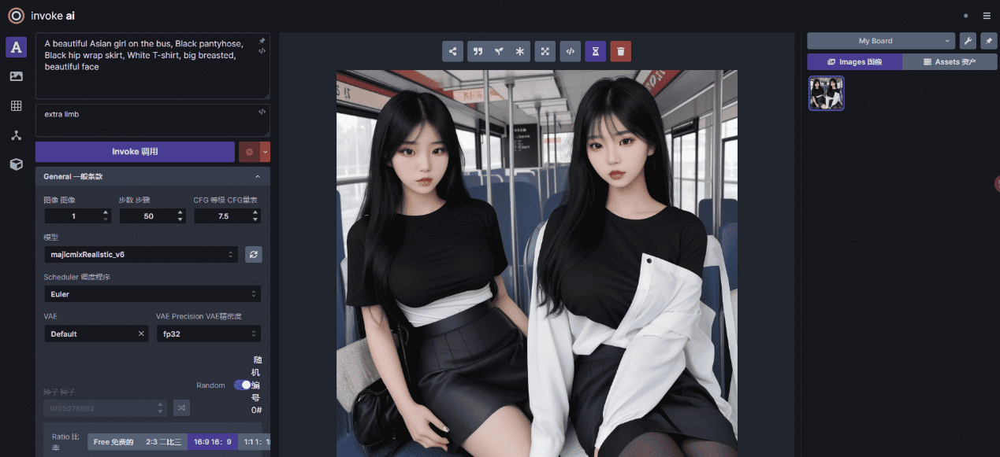

# Invoke AI

该安装包内自带linux和Windows的安装包

(左上角三条杠那里点开设置可以切换 中文)
InvokeAI只是一个目前完全免费且开源的可视化绘图工具，它提供一个AI绘画的基本框架、插件接口和UI界面，具体的绘制模型和lora模型等还需要下载和导入。

InvokeAI在早期没有controlnet和lora功能，但目前最新版已经加入了controlnet、lora、动态提示词等功能，极大的提高了绘画结果的可控性、稳定性和必要时的随机性(比如想抽卡生存随机的图片时)

InvokeAI对比类似功能的WebUI，InvokeAI有着更简单上手，部署条件更简单，学习成本更低的优点，并且随着开发者的更新InvokeAI的功能也已经逐渐追上了WebUI的步伐，如果需要安装插件或者导入新的文转图训练、模型CHECK_POINT、lora、vae等，InvokeAI也在操作页面有很方便快捷的可视化添加方式。

部署环境要求： python 3.9 或 3.10，Visual C++，

解压文件后，Windows用户启动install.bat""开始安装，linux用户启动"install.sh"开始安装。

开始安装后会询问是否安装默认路径安装（Y为按默认路径安装，N为自定义安装路径）

选择完路径后会开始安装Invoke本体，本体安装完成后会进入下一步让你选择你想下载的绘画模型(如果没有出现这一步，请把CMD窗口最大化然后等一会)
选择完模型后会开始下载模型，下载完成可能会遇到错误无法正常完成安装，只需要关闭窗口即可完成安装。
最后找到你的安装路径，点击里面的"invoke.bat"启动(linux选择"invoke.sh启动")InvokeAI,启动后会给你几个选项。我只说一下比较重要的几个选项，第1个选项是用网页启动InvokeAI，第3个是启动图转文训练，第5个是下载其他绘图模型，第9个是检查Invoke升级，Q选项是退出。(此处为InvokeAI Windows版3.0.2post1版本号的内容，不同版本可能顺序有所不同，具体选项可以自己对照窗口内文本翻译一下)
启动后选择第1个选项回车后等待一会后复制最末端的http:// 开头的地址复制粘贴到浏览器打开即可进入InvokeAI的可视化操作界面。(目前已知Windows用户可能会在这一步报错，但是不影响后续操作，点击"确认"无视然后等一会就可以了)

然后就可以尽情享受AI绘画了。
（安装过程需要联网，部分下载内容可能无法使用国内网络下载。）

Github项目地址:https://github.com/invoke-ai/InvokeAI

安装程序下载

链接: https://pan.baidu.com/s/1a_bchuDJTXIDWG6P38a1XQ?pwd=ykpf 提取码: ykpf