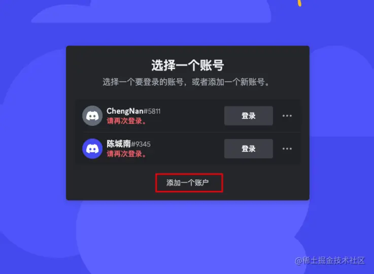
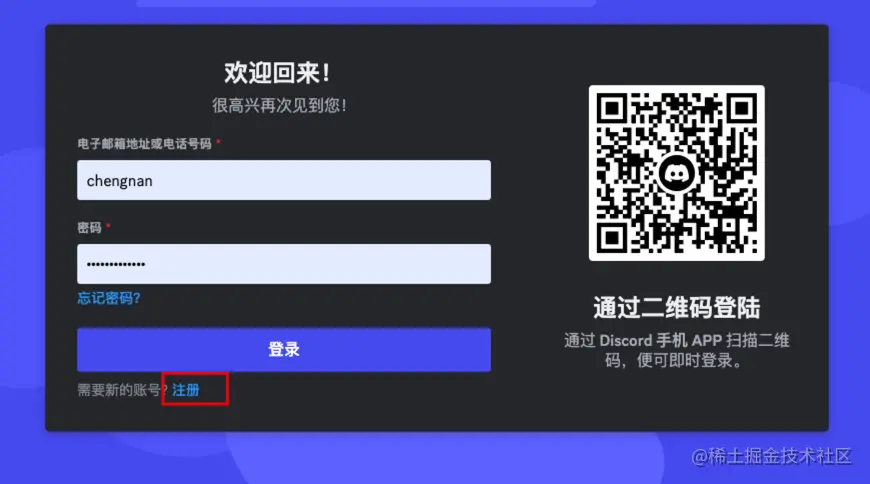
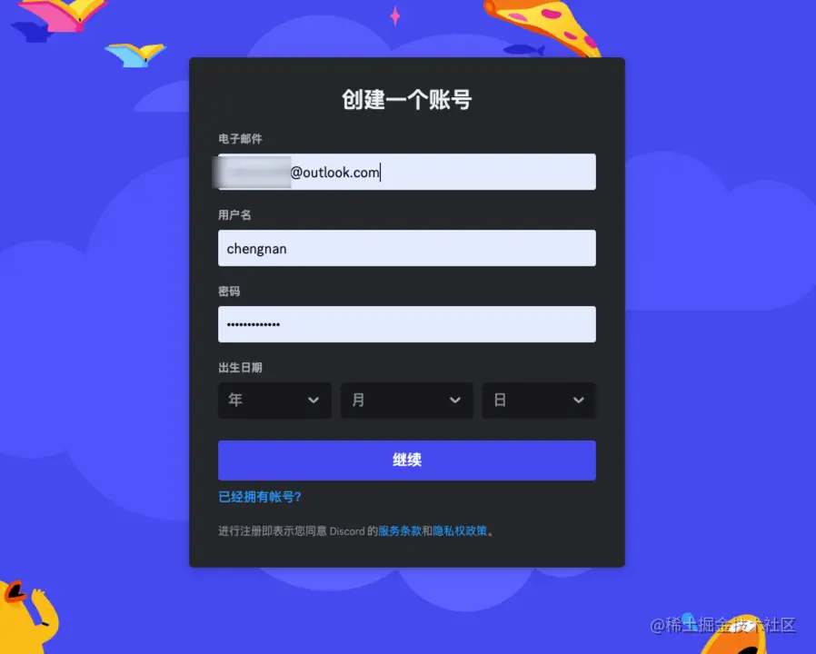
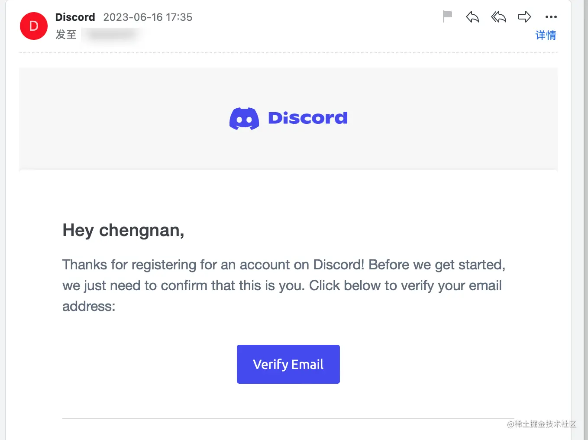

# Midjourney 注册

教程 UP 主：[莱森 LysonOber](https://space.bilibili.com/630876766)

教程：[1.1 - Midjourney 注册教程教学（保姆级全系列课程合集）免下载，通俗易懂\_哔哩哔哩\_bilibili](https://www.bilibili.com/video/BV1p24y1h7CQ/?vd_source=5f0c99b3deddffe219938763769b15ac)

【一站式入门 AI 绘画！Midjourney 胎教级入门指南！普通人也能成为设计师】<https://www.bilibili.com/video/BV1vm4y1B7gP?vd_source=36c9491a7fa2ab8a22ca060af01b7472>

## 新手常见问题

### Q1：Discord 是什么？

A：一款专为社群设计的免费通讯社交软体，类似于 LINE 或 Slack，但功能更为强大，自带机器人与各种程式功能，能够在上面发开自己工具，有网页版与手机版 App。

Discord 官网：<https://discord.gg/>

网页上使用：[Discord](https://discord.com/app)

### Q2：Midjourney 是软件吗？需要安装吗？

A：不用，Midjourney 并不是软件，也不用安装，它是一个架设在 Discord 之下的工具，使用方式只需要在 Discord 输入文字即可，所以与你电脑本身效能无关，运算中关闭 Midjourney 也没问题，因为真正运算图片的是云端电脑。

### Q3：Midjourney 生成图片是免费的吗？

10 美刀：每月可以生成 200 张图片，适合轻度使用者。

30 美刀：每月生成的图片无限制，每月 15 小时的 fast 使用时长。

## 介绍

Midjourney 是一款搭建在社交软件 Discord 上的 AI 绘画机器人。

## 前置

**前提：需要科学上网魔法才能使用**...

可以使用免费开源的加速器软件：Watt Toolkit，免费加速 Discord 网站。

官网：[瓦特工具箱(Steam++官网) - Watt Toolkit (steampp.net)](https://steampp.net/)

开源地址：

- [SteamTools: 🛠「Watt Toolkit」是一个开源跨平台的多功能 Steam 工具箱。 (gitee.com)](https://gitee.com/rmbgame/SteamTools)
- [BeyondDimension/SteamTools: 🛠「Watt Toolkit」是一个开源跨平台的多功能 Steam 工具箱。 (github.com)](https://github.com/BeyondDimension/SteamTools)

————————————————————————————————————————

可以使用国内邮箱：网易或 QQ 邮箱 + (非必要)国内手机号注册

在 discord 中使用 Midjourney：[discord.gg](https://discord.gg/midjourney)

注册好账号并登录：搜索并加入 Midjourney 频道，可以加公共频道，或创建自己的频道使用

## Discord 账号注册

目前主流的教程有很多，无非就是：邮箱注册；国外手机号注册；虚拟手机号注册；

- 为什么不用国内手机号注册，因为会被封，起码最近是这样的，我已经测了两个号，都完蛋了，成本拉满。

**但是！我探索出了一个新道路，只用邮件进行注册，不要验证手机号！不要验证手机号！不要验证手机号！**

这样，就不会被封了。这里我们从 Discord 官网进行注册，不要从 QuickQR.art 注册，这里需要验证手机号。

1.登录网站，选择注册：[discord.com/](https://discord.com/)

选择添加账号，这里就是我被封的两个账号...，选注册

这里我使用的 outlook 邮箱，建议大家用这个，gmail，qq 邮箱应该也行，但是我用的这个（因为 gmail 被封完了）

- **年龄一定要选满 18 岁，不然不能用！**

**然后大家跟着流程注册就行，最后会发一个邮件进行验证，如果让你验证手机号，一定要跳过，这里不要验证国内手机号，用邮件验证就行。**

## Discord 客户端

Discord 有网页版，也有桌面客户端。

注册 Discord 之后，可以下载客户端来使用

### 下载 Discord 客户端

[官方网站：https://discord.com/](https://discord.com/)，打开网址，下载您需要的版本。

注意：支持手机端（Android&ios），Windows，Linux，Mac
