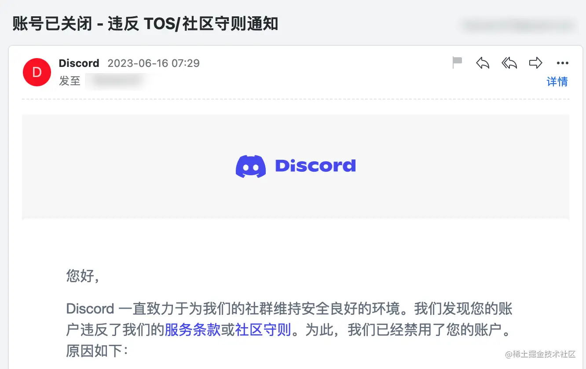
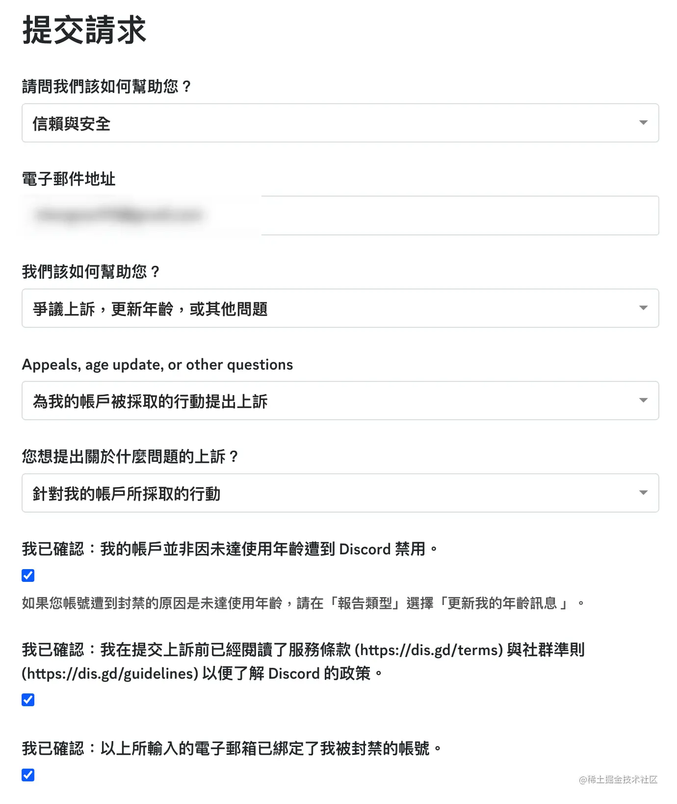
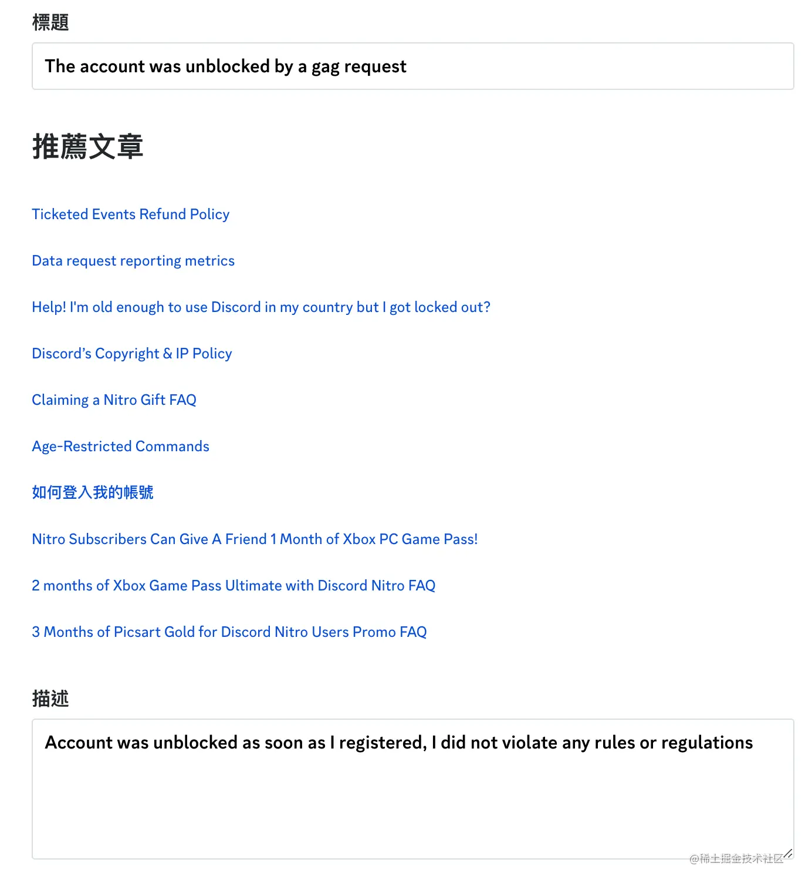

# Midjourney使用问题

## 问题1：Midjourney是什么？

Midjourney 是 AI 生成算图工具，输入文字就会自动产生图像，目前架设在Discord频道上。

## 问题2：Discord频道是什么？

Discord是国外的一个社群工具，类似QQ，Discord频道就类似QQ群。

Midjourney的使用方式是：通过给频道内的聊天机器人发送对应文本，聊天机器人返回对应的图片。

所以想用Midjourney，就要先注册一个Discord，然后进入Midjourney的Discord频道。

## 问题3：Midjourney图片版权归属？

版权归属于创作者，自己用关键词去生成！

## 问题4：Midjourney对硬件配置有要求吗？

部署在网络，而不是在本地，所以对本机硬件无要求，但因为国外的公司，需要可以魔法上网。

## 问题5：经常看到prompt，prompt到底是什么？

其实就是关键字（提示词），是你提供给Midjourney的文本，Midjourney依靠文本提示词来生成图片，Midjourney**关键词就是AI绘图的灵魂**，它直接影响你出图图片的质量！

大家记住：即使Midjourney关键词一样（修改任意一个元素 后），也没关系，只要是你自己生成的图品，你才有权限使用：

## 问题6：Midjourney免费吗？Midjourney要钱吗？

Midjourney 开始时免费，每个账号能生成25张图片。到达图片上限后，需要购买Midjourney会员。

但是现在已经没有了活动，都需要开通会员来生成。

## 问题7：Midjourney会员多少钱？

主要分为：

基础版会员（10美金一个月，一个月可以制作200张图）

标准版会员（30美金一个月，无限制作图，有15小时快速出图模式）

可以一个号登录5台设备

## 问题8：Midjourney如何购买会员？

需要使用可以支持外币支付的信用卡进行购买！

## 问题9：Midjourney社区里，我为什么无法查看别人的作品和prompt？

因为你需要先升级为Midjourney会员，才可以使用社区功能，查看更多作品。

## 问题10：Fast模式和Relax模式有什么差别？

在输入框输入“/fast”或者“/relax” 即可切换模式，默认是fast模式

fast模式：无需排队，发送prompt立马绘图，（30美金会员，支持15小时Fast模式）

relax模式：需要排队，排队完成自动生成。

## 问题11：如何查看自己生成过的历史作品？

进入Midjourney网站，点击右边的“sign in”进入自己的主页。在这里可以找到图片的描述、位置以及下载。

## 问题12：账号被封解决

如果账号绑定了手机号，被封了，咋办？

1. 建议换个账号
2. 申请解封，我试了下，还在等反馈，毕竟珍惜账号的可以试试；

刚注册...发现账号就被封了...好像跟中国电话注册有关，但是网上也没看到。于是我参考教程进行了解封申请，具体如下：

- 进入 <https://support.discord.com/hc/zh-tw/requests/new?ticket_form_id=360000029731申请解封>
- 电子邮箱地址就写需要解封的邮箱；

- 标题和描述就真实写，比如我是**刚注册就被封了**，就直接用软件翻译一下写：
  - 标题：`Account just registered was blocked, apply to cancel`
  - 描述：`Account was unblocked as soon as I registered, I did not violate any rules or regulations`

- 提交后就有一个反馈邮件，然后等几天等Discord核实；