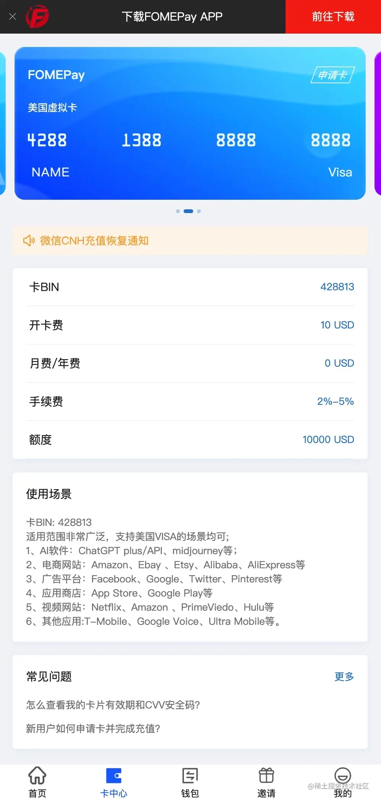
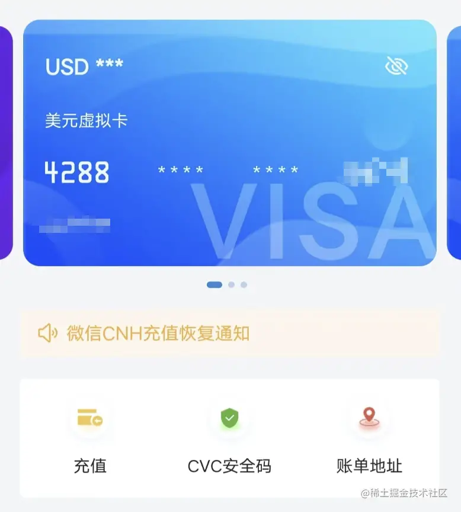
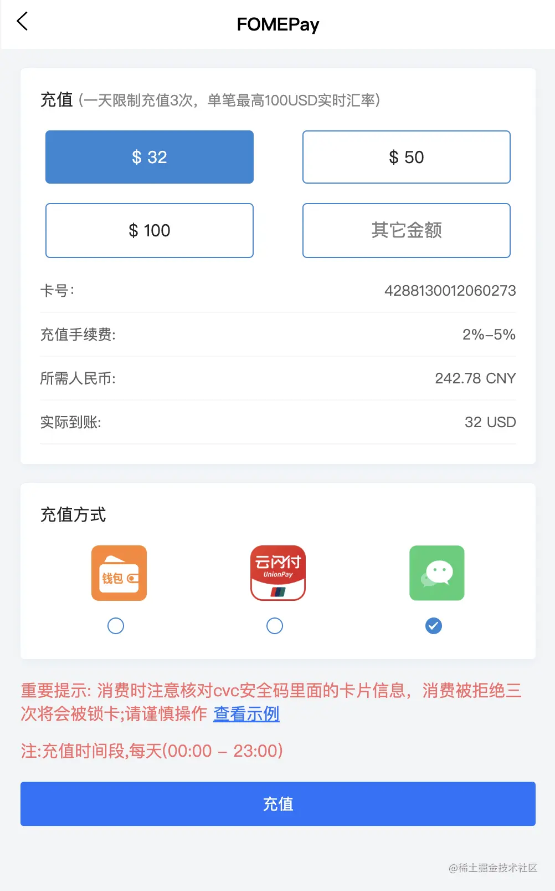
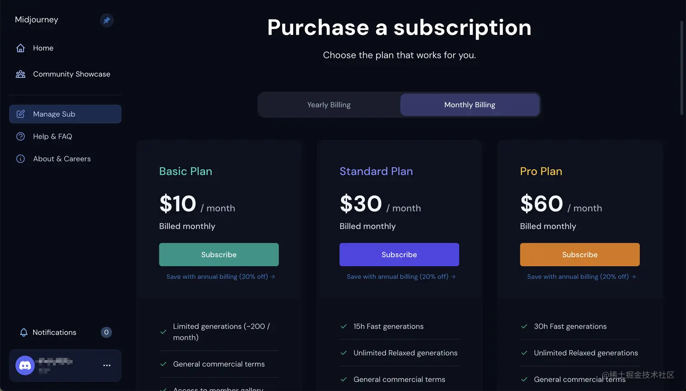
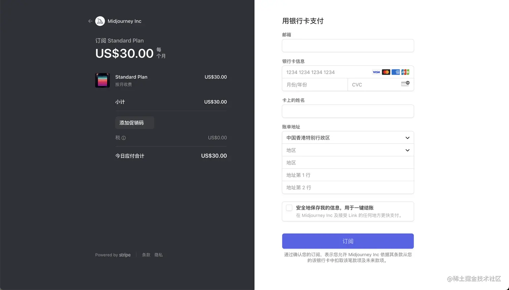
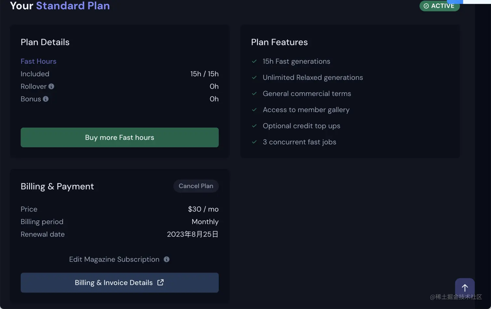
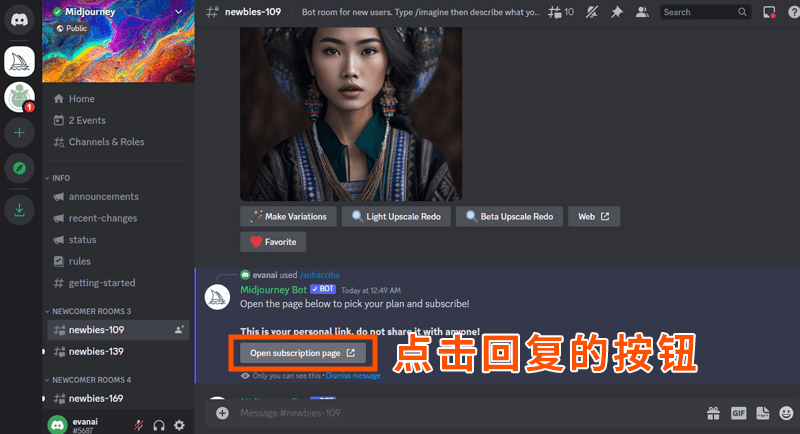
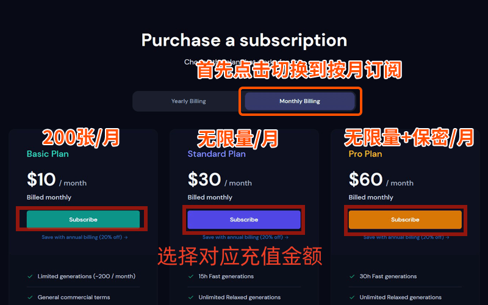
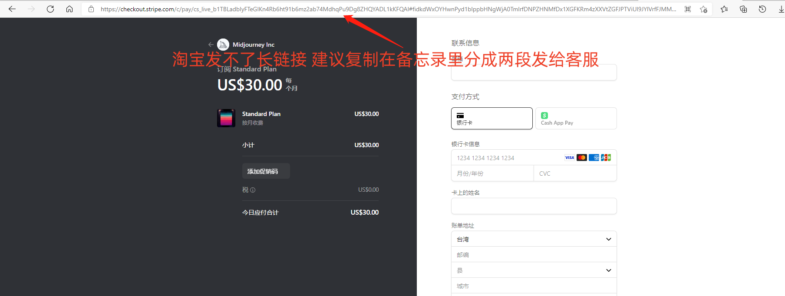

# Midjourney付费订阅

官网文档：[Midjourney Documentation and User Guide](https://docs.midjourney.com/)

## 付费卡FOMEPay

使用 FOMEPay卡，开卡费需要 $10

优势：

- 注册方便，仅需手机号即可完成注册。
- 无需实名认证，这点非常重要，再也不用担心平台跑路信息被泄漏了。
- 使用门槛低，可直接使用微信、云闪付完成支付。

邀请链接：[FOMEPay](https://gpt.fomepay.com/#/pages/login/index?d=678878)

### 申请卡

首先，进入「卡中心」页面，点击上方的「申请卡」即可申请一张虚拟卡。

注意，我们要申请的是「美国虚拟卡」，不要申请香港虚拟卡，只有「美国虚拟卡」才支持充值 Midjourney。

并且在网页顶部可以点击「前往下载」按钮下载 APP，方便操作。

### 充值

虚拟卡申请完成后，点击「充值」按钮进行充值，充值旁边还有一个「CVC安全码」，在充值 Midjourney 时所有需要的信息都可以在这里找到。

一天最多充值 3 次足够用了，可以选择微信和云闪付进行支付。开卡费 $10，充值 Midjourney 则根据所选择的订阅方式需要不同的金额，充值时需要计算下手续费，保证「实际到账」金额足够用来支付 Midjourney 订阅。

### 订阅 Midjourney

进入 www.midjourney.com/account/ 即可选择订阅套餐：

以下表单对照 FOMEPay APP 中「卡中心」的「CVC安全码」页面信息填写即可：

点击订阅按钮几秒钟后即可订阅完成，在 FOMEPay APP 中「卡中心」的「账单」列表可以看到一笔消费账单。

现在，就可以愉快的使用尊贵的 Midjourney 会员画图了。

温馨提示：如果想取消订阅，在 Discord 聊天窗口输入 `/subscribe` 后，打开 Midjourney，点击 `Cancel Plan` 即可取消订阅。

可选择立即取消，或者选择到期后取消防止自动连续订阅。

## 会员套餐

| 版本类型          | 基础版     | 标准版    | 专业版    |
| ----------------- | ---------- | --------- | --------- |
| Fast模式作图限制  | 仅200张/月 | 15小时/月 | 30小时/月 |
| Relax模式作图限制 | /          | 无限制/月 | 无限制/月 |
| 社区画廊          | 支持       | 支持      | 支持      |
| 商业模式          | 支持       | 支持      | 支持      |
| 私密模式          | /          | /         | 支持      |
| 并发作业数量      | 3个        | 3个       | 12个      |

备注：

- 作图次数按照操作计算，不按下载计算
- Fast模式：高优先级出图模式，出图速度更快，一个小时大约可生成60张图片（非准确数字）
- Relax模式：排队出图模式，视服务器拥挤而定
- 社区画廊：官方提供的高质量素材集合，且可以通过图片查看原始命令
- 商业模式：可将图片应用于任何商业化场景
- 私密模式：AI生成图片仅自己可见，在个人画廊中可隐藏不对外展示
- 并发作业：服务器最多可同时处理描述词的组数，若组数过多，超出部分会显示【排队中】，待处理完前置任务，服务器才会继续处理

如果按年付费，可以打八折。

付费说明：付款后一律无法退款

## 共享账号包月价格

备注：目前仅支持标准版，最多支持6人成团，账号官方提供，不可修改密码，Fast模式为共享15小时时长不可控制

- 标准版：
  - 官方价格：30美元/月
  - 代充价格：222人民币/月，按成团人数计算，如6人成团，则每人37元
    - 备注：因开通账户需要邮箱与手机验证码，故价格高于个人版

使用说明：

1. 报名后拉群，满6人开团
2. 不提供帮助解决登陆等问题
3. 首次登陆需使用邮箱验证，群公告可查询邮箱密码

## 一、 打开会员订阅页面

 

## 二、 选择您需要订阅的会员

### 在订阅页面上，切换到按月订阅后，再点会员订阅按钮

需要国外的visa卡支付，中国的信用卡也可以，只要能支付美金。

充值界面：

