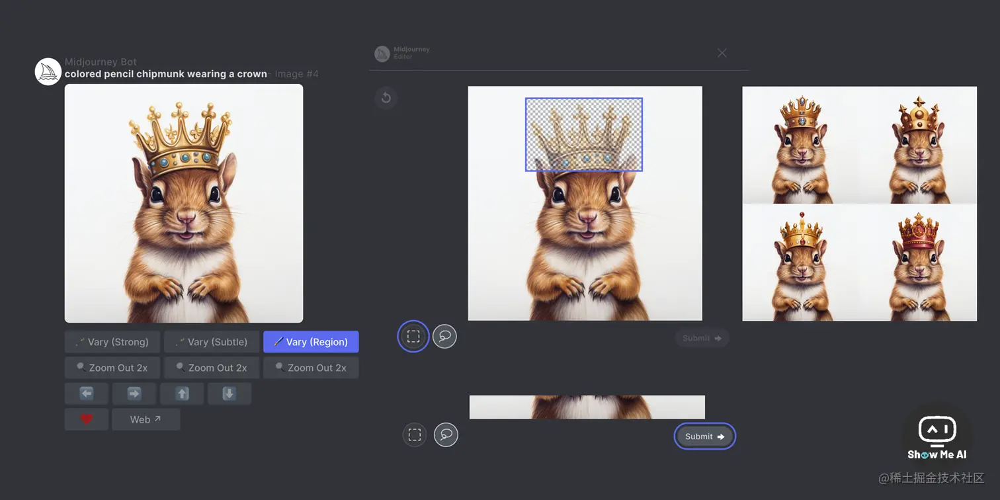

# Midjourney AI绘画工具的使用

Midjourney 中文社区 飞书文档链接：https://ja57xhnzz2n.feishu.cn/wiki/wikcnBeEslS7aRUvGRYFonV2ynd 密码: kiJ7

midjoumey官网使用手册(英文)：https://docs.midjoumey.com

## 教程

[‌⁤‌⁣‌⁣‌‍⁡⁢⁤⁡‌‍⁢⁡⁢⁤‌Midjourney 学习导航 - 飞书云文档 (feishu.cn)](https://ssw9noe1h6.feishu.cn/wiki/wikcn5LLVhHZ8G8AsaiiRsOpEYf)

[Midjourney 知识库 (yuque.com)](https://tob-design.yuque.com/kxcufk/mj)

[Midjourney教程：超详细Ai绘画新手入门攻略（附学习资源工具大全）干货合集，建议收藏 - 知乎 (zhihu.com)](https://zhuanlan.zhihu.com/p/611864651)

[‌⁢‬‬⁡⁢‌‬⁤‍‍⁡‌‍⁡‬⁤‬‌‬⁤⁤⁢⁢‌⁣‬⁢⁤⁣⁡‍⁢‍⁢⁤⁢‬⁡拍张证件照200元？Midjourney免费给你做一张 - 飞书云文档 (feishu.cn)](https://xikr8g3owj.feishu.cn/docx/VYXOdUvGooF2MTxnN2cc7a4Mnuh)

[Midjourney教程：超详细Ai绘画新手入门攻略（附学习资源工具大全）干货合集，建议收藏 - 知乎 (zhihu.com)](https://zhuanlan.zhihu.com/p/611864651)

——————————————————————————————————————

**Midjourney 学习导航**：[🧭 Midjourney 学习导航 | Learning Prompt](https://learningprompt.wiki/docs/midjourney-learning-path)

[Midjourney｜活动海报落地设计流程 (qq.com)](https://mp.weixin.qq.com/s/pDR54zUCdwzcyG7tU2IcEg)

[我嫌ai出图效率太低，又研究了一下进阶玩法！ (qq.com)](https://mp.weixin.qq.com/s/dLkoNpXAI51U9uc9IWhphA)

[人类还剩几集可以逃？ChatGPT + Midjourney + Clipchamp AI大军联合玩内容创作 (文稿/插图/配乐/配音/字幕全包)](https://www.bilibili.com/video/BV1wW4y1G7a3/?share_source=copy_web&vd_source=b68f853f829d65fae4ec428042e47343)

[2天300+作品，Midjourney将彻底颠覆食品包装设计！](https://mp.weixin.qq.com/s/b1v2Jp04119bDeyuBLv_Iw)

##  Midjourney 正式上线局部重绘功能 Vary (Region)

8月22日，Midjourney 正式上线了局部重绘功能，官方称之为 「Vary (Region)」，允许对生成图像的选定区域进行选择，并重新输入 Prompt 进行重新绘制，以下是操作步骤：

> 1. 使用 `/imagine` 命令创建图像
> 2. 点击 U 按钮放大选定图像
> 3. 点击 Vary (Region) 按钮，打开编辑界面
> 4. 选择要重新生成的图像区域
> 5. 提交并查看结果 [**⋙ Midjourney文档**](https://docs.midjourney.com/docs/vary-region) | [Midjourney发布局部修复功能，这里有一份6000字的使用指南 (qq.com)](https://mp.weixin.qq.com/s/DWWYQHpGMGY2IeOahNeC2g)

## Slack 可以添加使用MidJourney ，无魔法免费体验

MidJorney 是目前最受欢迎的AI绘图工具之一，可以根据用户输入的文本提示词，生成高质量图片。Slack 是一款企业内部通信工具，可以轻松集成很多第三项服务，比如 Notion、Claude、GitHub、Trello 等。

最新消息是，MidJorney 可以添加到 Slack 并免费体验。这意味着 Slack 用户可以更便捷地使用MJ的文生图功能，且无需魔法！ [**⋙ 详细操作教程**](https://t.zsxq.com/0eDQ8YZ6j)  |  [**添加至Slack**](https://www.mjslackbot.com/)

## Billfish素材管家

我们还可以借助免费的Billfish素材管家，来对我们的AI作品进行管理以下是使用 Billfish素材管家管理AI画作的步骤：

1、下载并安装 Billfish素材管家软件，并登录您的账户。

**2、导入 AI 画作：**在软件界面中选择 "导入"，然后选择您想要导入的 AI 画作文件夹。Billfish素材管家 支持多种类型的 AI 文件，如 SVG、EPS 和 AI 等格式。

**3、分类：**导入完成后，Billfish素材管家 会自动将所有图片进行分类，并进行关键词标记。您还可以通过添加自定义标签来进一步分类和组织您的画作。

**4、搜索和浏览：**可以使用关键词搜索功能查找特定的画作，也可以通过不同的分类标签来浏览您的画作集合。

总之，Billfish素材管家 是一款非常实用的画作管理工具，可以帮助您轻松地管理和组织大量的 AI 画作。无论您是个人用户还是团队，都可以通过这个工具提高工作效率和创作品质。

## Midjourney 功能更新资讯

### Midjourney 推出 pan 功能，上下左右，可以平移扩展图片场景

7月4日，Midjourney 宣布正在测试名为「**panning (平移)**」的新功能，可以按指定的上下左右方向，拓展生成图片的外部场景。这也使得「**outpainting (补全)**」功能更加强大。

用户生成图片后，下方菜单栏会出现⬅➡⬆⬇四个按钮，点击某个箭头后，图片就会按照这个方向进行拓展补全。不过此项功能当前还有一些限制，需要更多的后续开发完善 [**⋙ Twitter @Midjourney**](https://twitter.com/midjourney/status/1675969584229412864)

