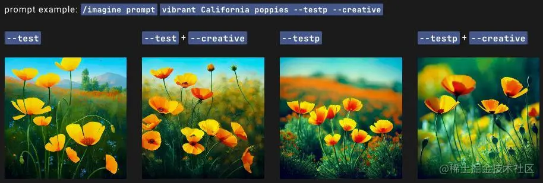
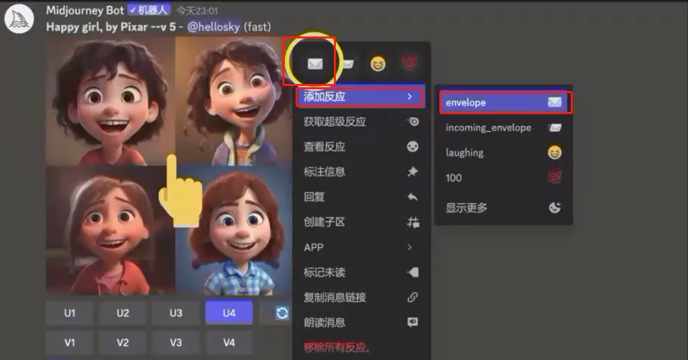

# Midjourney官方命令详解

## Midjourney官方预设

在对话框输入/setting可以看到基础设置项，主要包括：版本、绘图质量、风格、升格、模式等。


### 2.1 版本切换

最常用的是版本切换，其实也可以通过在prompt后添加--v加数字

V4对生物、地方、物体等有更多了解，在正确处理小细节方面要好得多，并能处理有多个人物或物体的复杂提示。

V4有两种略有不同的“风格”，对模型的风格调整进行了细微调整。通过在V4提示末尾添加--style 4a或--style 4b来试验这些版本。


Niji，它是Midjourney和Spellbrush合作的，可以制作动漫和插画风格。niji模型在动漫、动漫风格和动漫美学方面有大量的知识，它在动态和动作镜头以及以人物为中心的一般构图方面非常出色。


MJ Test是临时发布新的模型，供社区测试和反馈，偶尔可以试试。


### 2.2 绘图质量

质量的设置并不总是越高更好，有时，较低的质量设置可以产生更好的效果，这取决于你试图创建的图像。较低的画质设置可能最适合表现抽象的姿态，较高的质量值可能会改善受益于许多细节的建筑图像的外观，选择最符合你希望创建的图像类型的设置。

Half Quality = --q .5

Base Quality = --q 1

High Quality = --q 2

需要注意，V4和Niji目前不支持High Quality

### 2.3 风格切换


Midjourney已经被训练成产生有利于艺术色彩、构成和形式的图像。--stylize或-s参数影响了这种训练的强度。低风格化值产生的图像与提示密切相关，但艺术性较差。高风格化值产生的图像非常有艺术性，但与提示的联系较少。

Style Low = --s 50

Style Med = --s 100

Style High = --s 250

Style Very High = --s 750

--stylize的默认值为 100，并且在使用默认 [V4 模型] 时接受 0-1000 的整数值。

Version 4 Version 3 Test / Testp niji Stylize default 100 2500 2500 NA Stylize Range 0–1000 625–60000 1250–5000 NA

### 2.4 Upscale

Midjourney开始生成的是低分辨率的网格图像，然后需要试用升格来增加尺寸和添加额外的细节。

Regular (Default) Upscaler在平滑或细化细节的同时增加了图像尺寸，一些小的元素可能在初始网格图像和完成的升格之间发生变化。

Light Upscaler创建一个1024px x 1024px的图像，并添加适量的细节和纹理。在使用旧的Midjourney模型版本时，Light Uspscaler对脸和光滑的表面很有用。

Detailed Upscaler细节升标器，创建一个1024px x 1024px的图像，并在图像上增加许多额外的精细细节。用细节升格器升格后的图像，可以用升格到最大按钮再次升格，最终分辨率为1664px x 1664px。只有在快速模式下才可以升格到最大。详细升频器是Midjourney模式V1, V2, V3, 和hd版本的默认设置。

Beta UpscalerBeta Upscaler可以创建一个2048px x 2048px的图像，而不需要添加很多额外的细节。Beta升档器对脸部和光滑的表面很有用。使用-upbeta参数来改变U1 U2 U3 U4升档按钮的行为，以使用Beta升档器。

Anime Upscaler动漫升频器是--niji模型的默认升频器。它将图像升格为1024px x 1024px，并进行了优化，以便与插图和动漫风格很好地配合。使用--upanime参数来改变U1 U2 U3 U4升档按钮的行为，以使用动漫升档器。

Remaster重塑是一个额外的选项，适用于以前用V1、V2或V3模型版本制作的上标图像。重制将使用--测试和--创意参数再次提升图像的比例，混合原始图像的组成和较新的--测试模型的一致性。通过点击在原始升标处发现的重塑按钮，可以重塑任何先前升标的作业。如果要对非常老的作业进行重铸，可以使用/show命令在Discord中刷新该作业。

### 2.5 Mode

/stealth 和 /public命令在隐匿模式和公共模式之间切换。 试用版只能选Public, Pro Plan 的订户可以访问隐身模式，以防止他们的图像在 Midjourney 网站上被其他人看到。

Fast and Relax Modes标准和专业计划的用户每月可以在放松模式下创建无限数量的图像,Relax模式不会花费GPU时间，但工作将根据你使用该系统的程度被放入一个队列中。

Remix模式值得重点看看，可以改变提示、参数、模型版本或变体之间的长宽比。Remix将采用起始图像的总体构图，并将其作为新工作的一部分。Remix可以帮助改变图像的设置或照明，发展一个主题，或实现棘手的构图。Remix是实验性的功能，可能会在任何时候改变或被删除。

用/prefer remix命令或通过使用/settings命令和切换️Remix Mode按钮来激活。Remix改变图像网格下的变体按钮（V1、V2、V3、V4）的行为。当Remix被启用时，它允许你在每次变奏时编辑你的提示。若要对一个上级进行混音，请选择制作变体。


你可以在使用Remix模式时添加或删除参数，但你必须使用有效的参数组合。将/imagine prompt illustrated stack of pumpkins --version 3 --stylize 10000改为illustrated stack of pumpkins --version 4 --stylize 10000将返回一个错误，因为MJ4与Stylize参数不兼容。

### 2.6 自定义设置

Custom Preferences

可以用prefer命令创建自定义选项，自动将常用参数添加到提示末尾。

/prefer auto_dm完成的任务自动发送到私信

/prefer option创建或管理自定义选项

/prefer option list查看当前的自定义选项

/prefer suffix指定要添加到每个提示末尾的后缀

/prefer option set创建一个自定义参数，你可以用它来快速添加多个参数到提示语的末尾。最多可以设置20个option


/prefer option setmine--hd --ar 7:4创建一个名为 "mine "的选项，代表--hd --ar 7:4.


使用/imagine prompt vibrant California poppies --mine就等于/imagine prompt vibrant California poppies --hd --ar 7:4.

把value设置为空就相当于设置改选项删除

/prefer suffix会自动在所有提示后附加指定的后缀，使用没有数值的命令来重置。

比如:/prefer suffix--uplight --video

## MidJourney 快速上手指南 & 完整提示词手册

MidJourney关键词整句咒语分享 💬

形容词，名词，描述词语均可按需求进行更改。神圣风格用 niji 的模型会更好看。关键词前可垫图（图片的链接最后需要空两格再接关键词）

MidJourney提示词-案例学习资料 💬

 这是一份 MidJourney 提示词资料，展示了几十种风格的精美图片，以及对应的 Prompt。复制 Prompt 并尝试，就可以输出同类风格的图片啦！

❗ 注意顺序！【标题+Prompt+图片】是正确的顺序，当前排版，图片显示在了下一个页面。

⏹ Phantasmal Iridescent 【梦幻般的五彩缤纷】

⏹ A as B 【A作为B】

⏹ [Subject] made out of [material] 【用[材料]制成的[主题]】

⏹ Paper art 【纸艺】

⏹ Layered Paper 【分层纸】

⏹ Naive art 【天真的艺术】

⏹ Explode Objects by Nychos 【尼科斯的《[爆炸物](https://wx.zsxq.com/mweb/views/weread/search.html?keyword=爆炸物)》】

⏹ 3D loop 【三维循环】

⏹ Matrix Raining Code 【矩阵雨的代码】

⏹ Futuristic 【未来主义】

⏹ Cyberpunk style 【赛博朋克风格】

⏹ Blacklight 【黑光】

⏹ Infographic drawing 【信息图画】

⏹ Character concept design sheet 【角色概念设计表】

⏹ Double Exposure 【双重曝光】

⏹ Game Sheet 【游戏表】

⏹ 8-bit pixel art, 16-bit pixel art 【】

⏹ 3D Vibrant Model ( Leo Natsume) 【 3D活力模型】

⏹ Celestial 【天人合一】

⏹ A Layered Manuscript Paper 【分层手稿纸】

⏹ Futuristic Transparent Plastic Items 【未来主义的透明塑料物品】

MidJourney 快速上手必备

一. 熟悉基础设置

▶ 输入框中输入斜杠"/"后点击settings回车

▶ 第一行：目前midjourney的版本号

▶ 第二行：二次元模式

▶ 第三行：图片质量

▶ 第四行：风格化参数

▶ 第五行：模式切换

二. 关键词结构说明

▶ 结构建议：内容描述 + 风格描述 + 修图后缀 + 属性描述

▶ 一些重点后缀 三. 举个小栗子

## Midjourney的基础参数与指令


| **内容**             | **含义**                                                  |
| -------------------- | --------------------------------------------------------- |
| 指令/imagine prompt: | 用文本自动生成4张图像                                     |
| U1-U4                | 用来放大四张图片中的某一张。                              |
| V1-V4                | 基于当前选中格子中图片的风格和构图生成类似的另外 4 张图片 |

首先输入/imagine prompt:图片描述   生成图片。


然后图片下面的U1到U4是生成其中一张图片，加细节。


然后图片下面的V1到V4是按照这个风格重新设计4张图片。


右边这个图标则是对该图不满意，重新设计四张。


保存图片的很简单，直接右键就能保存了。


发送 /stealth 可以进入设置，可以设置版本、模式、质量、风格。


然后每次在描述后面添加 --quality 5 这个参数，渲染质量可以好一点，参数在 0.25-5之间，英文和数字之间需要加个空格。


描述后面添加 --ar  这个参数可以修改图片尺寸比例，比如 --ar 3:4 --2:1  --ar 16:9  英文和数字之间需要加个空格。


## Midjourney基本命令

- /help (查询提示)
- /imagine (文字生图)
- /describe (图像生成描述)
- /ask (询问问题)
- /blend (图像混合)
- /fast (切换到快速模式)
- /info (查看账户 &任务信息)
- /stealth (VIP功能：隐身模式)
- /public  (VIP功能: 公共模式)
- /subscribe (跳转个人页)
- /settings (工具设置)
- /prefer option (管理自定义选项)
- /prefer option list (查看自定义选项)
- /prefer sufftx (指定添加到每个提示未尾的后缀)
- /show (使用图像作业ID 在 Discord 中重新生成)

/ask : Get an answer to a question. 可以像机器人提问并获取答案

/blend Easily: blend two images together. 可以将2-5张图片混合，最多20张，并组成一张新图片

/daily_theme: Toggle notification pings for the #daily-themechannel update 可以切换频道通知

/fast: Switch to Fast mode. 可以切换到快速模式

/help: Shows helpful basic information and tips about theMidjourney Bot. 可以获取帮助

/imagine: Generate an image using a prompt. 用于生成图像

/info: View information about your account and any queued or running jobs. 可以查看账号信息

/stealth: For Pro Plan Subscribers: switch to Stealth Mode  针对订阅用户，可以切换到隐身模式

/public: For Pro Plan Subscribers: switch to Public Mode  切换成公共状态

/subscribe: Generate a personal link for a user's account page.  可以创建个人链接

/settings: View and adjust the Midjourney Bot's settings.  可以修改机器人设置

/prefer option: Create or manage a custom option.  可以选择偏好

## Midjourney绘图添加参数详解

### 1.纵横比aspec tratios

--ar

### 2.混乱Chaos

--c +数值:0-100

--chaos<数字0-100> 改变结果的变化程度，更高的值会产生更多不寻常的和意外的结果和构图，较低的--chaos值输出更可靠、可重复的结果。

--chaos <number 0-100> (混乱，结果更多变。值越高越容易出现意外效果)

### 3.种子值seed(重点)

--seed

--seed <在0-4294967295之间的整数> 玩机器学习的同学都懂，使用相同的提示词和随机种子可以保证输出相同的结果（限V4和Niji）。

--seed <integer between 0-42949672955> --sameseed（使用种子继续处理，理解为在此基础上微调，生成图像时随机生成种子编号)

生成第一次四宫格图片的时候的seed值才是有效的，升档后的图的seed值没有用

同一组图片，需要换衣服，换发型，换表情等。

对某一个生成的组的图右边上角，添加反应，点击信封图标，生成值。

### 4.停止stop

--stop +数值：10-100

--stop <integer between 10-100> (中途结束任务，值表示进度百分比，越早结束效果越差)

--stop<在10-100之间的整数> 使用--stop参数可以在指定的比例停止生成，这会产生一个更柔和、细节更少的初始图像，

--stop会影响最终Upscaler结果的细节水平

### 5.--aspec

--ar参数将接受从1:1（方形）到每个模型的最大长宽比的任何长宽比。然而，在图像生成或升格过程中，最终的输出可能会略有修改。例如：使用--ar 16:9(1.78)的提示，创建的图像的长宽比为7:4(1.75)

- --aspect 1:1 默认长宽比
- --aspect 5:4 常见的画面和打印比例
- --aspect 3:2 常见于印刷摄影
- --aspect 7:4 接近于高清电视屏幕和智能手机屏幕

--aspec'' --ar (调整图片的宽长比)：

### no

--no (移除，exp= 尝试把植物移除)

### quality

--quality <.25..5.1or2>" --q <25,.5.1 or 2> (调节质量，值和成本成正比。成本=渲染时间)

### style

--style <4a,4b or 4c> (模型版本4，版本之间切换)

### stylize

--stylize < number >'' --s < number > (理解为美术风格的强度)

--stylize , or --s参数影响Midjourney的默认美学风格在作业中的应用程度。

### Upscaler 参数

#### uplight

--uplight (使用轻型升频器进行细节处理。图像更细致更平滑)

--uplight当选择U按钮时，使用另一种 "光 "的升频器。其结果更接近于原始网格图像。上调后的图像细节较少，且更平滑。

#### upbeta

--upbeta (使用 beta 升频器进行细节处理)

--upbeta在选择U按钮时，使用另一个beta升频器。结果更接近原始网格图像。升级后的图像增加的细节明显减少。

### iw

--iw 图片权重调节：--iw 0.5到2之间

### tile

--tile 图像平铺：生成四方连续图像

--tile参数生成的图像可以作为重复的瓷砖，用于创建织物、壁纸和纹理的无缝图案。仅对V1，2，3有效。

### 其它参数

#### Creative

--creative修改test or testp版本，使其更加多样和有创意。注：无需加value



#### Sameseed

--sameseed种子值创建一个大的随机噪声场，应用于初始网格中的所有图像。当指定--sameseed时，初始网格中的所有图像都使用相同的起始噪声，并将产生非常相似的生成图像。


#### Video

使用--视频参数来创建一个初始图像网格生成的短片。用信封✉️ 表情符号对完成的工作做出反应，让Midjourney Bot在你的直接信息中发送一个视频链接。


--video仅在V1, 2, 3, test, testp中有效

获取视频的具体步骤：

1在提示语的末尾添加—video  2任务完成，点击Add Reaction

3选择✉️ emoji（搜索框搜envelope）


4.Midjourney将发送一个视频链接到你的Direct Messages中（见下图）5击该链接，在浏览器中查看，右键单击下载视频


### **已被弃用参数**

下面的参数已被弃用，大家看教程或学习他人prompt时留意一下：

--width and --w (replaced with --aspect)

--height and --h (replaced with --aspect)

--fast (replaced with --quality)

--vibe (now known as V1)

--hq

--newclip

--nostretch

--old

--beta

## Multi Prompts 多重提示

基础知识

在提示中加入双冒号::表示Midjourney Bot应该分别考虑提示的每一部分。 

在下面的例子中, 对于热狗的提示, 所有的词都被放在一起考虑, 而Midjourney Bot产生了美味的热狗的图像。

如果将提示分成两部分，hot:: dog这两个概念被分开考虑，产生一个温暖的狗的图片。


提示权重

当用双冒号::将一个提示分成不同的部分时，可以在双冒号后面紧接着添加一个数字，以指定该部分提示的相对重要性。

在下面的例子中，提示hot:: dog产生了一只热狗。将提示改为hot::2 dog后，hot一词的重要性是dog一词的两倍，产生的图像是一只非常热的狗

[模型版本]1、2、3只接受整数作为权数

[模型版本] 4可以接受小数位的权重

非指定的权重默认为1。


Negative Prompt Weights负的权重可以被添加到提示语中，以去除不需要的元素。

所有权重的总和必须是一个正数。


## ❤文生图语序

- 主体物: 告诉AI你要画啥
- 形容词:颜色,材质,发光的眼睛
- 风格词:对主体物的描述或场景的描述
- 构图和镜头:景深,物体位置,景别
- 后缀叁数:--ar,--C

## 以图生图

点击+号图标上传图片，然后回车确认上传

仿制上传的图片生成其他图片，复制上传的图片地址：/imagine 命令，先粘贴地址，然后再描述生成图片语句

## 混合生图

上传多张图片，然后混合起来，再确认直接生成图片，或者再添加一些描述生成图片

可以多图融合生成一张图

## 图片反推关键词

/describe  命令，然后点击上传图片，然后回车开始反推关键词

真人模式的就是默认的模式

需要使用单独的模式帮助反推，比如动漫图片的二次元模式，使用niji模式，需要在descord中搜索添加niji服务器，才能使用这个模式。

## Midjourney社区

官方社区：需要登录后，查看web打开已经生成的图片，下面的菜单，可以看别人生成的图片

lexica社区：https://lexica.art

neural.love：http://neural.love/

关键词生成：[Midjourney Prompt Helper | PromptFolder](https://promptfolder.com/midjourney-prompt-helper/)

关键词生成imiprompt(重点推荐)：https://imiprompt.com/builder

## 灯光的使用

### 电影灯光

cinematic lighting

### 双重曝光

double exposure

### 童话灯光

fairy light

### 全息投影

holography

## 风格词的使用

风格

## 图例生成

### 主题内容

宇宙飞船里面，有一个穿太空服的女孩

### 环境背景氛围

占在一个激光发射器旁边，激光器在正中间，周围有能量块，这个激光来自未来宇宙中

### 构图镜头

是一个多层的空间，第一视角

### 风格化/参考方向

是一个未来派风格加漫画风格

### 图像设定

8K，高清，超分辨率

描述词:

Girl in spacesuit, spaceship inside, Tsutomu nihei style, 5idonia no Kishi, gigantism, laser generator, multi - story space, futuristic style, 5ci - fi, hyperdetail, laser in centerlaser from the sky, energy clots, acceleration, light flash, speed, anime, drawing, 8K, HDsuper - resolution, manga graphics, Drawing, First - Person, 8K, HD, Super - Resolution

翻译：

太空服的女孩，里面的宇宙飞船，Tsutomu nihei 风格，Sidonia no Kishi，巨人症多层空间，未来派风格，科幻，超细节，中心激光，来自天空的激光，能量凝块，加速，闪光，速度动漫，绘图,8K，高清，超分辨率，漫画图形，绘图,第一人称,8K,高清，超分辨率

## 神秘性女孩

A mysterious illustration of aspectral woman holdinga glowing embryo, withintricate details and delicatelinework that evoke a senseof wonder and beauty，in the style ofArtgerm,Loish,andSakimichan.
The moon and stars in thebackground create ahaunting atmosphere thatdraws the viewer in.
幅神秘的插图，描绘了一个幽灵女人抱着一个发光的胚胎，复杂的细节和精致的线条唤起了一种惊奇和美丽的感觉，采用Artgerm、Loish 和Sakimichan 的风格。背景中的月亮和星星营造出一种令人难以忘怀的氛围，吸引着观众。

## 创作漫画/绘本/故事插画/小说配图/电影分镜/连环画/IP形象/贴纸/系列图标方法


需要几个稳定的角色，面容保持一直，这样有利于延展创作，去换不同服装和场景，动作，表情。

所以在输出描述词时候，需要添加特定的单词，命令，参数并进行正确的操作

### 方法一：[创建角色] + [复制图像URL] + [加入生成图案的描述] + [添加场景画面]

滴滴滴

### 方法二：运用seed

获取一种风格图片的seed参数，来生成相同风格的不同的描述图片

描述词：

```bash
Happy girl, by Pixar

一个快乐的女孩，皮克斯风格
```

#### 第一步：右键图像选择信封图标生成seed

右键添加反应，输入env



#### 第二步:系统就会为这个头像生成Seed编号

获取seed参数

Happy girl, by Pixar

Job1D: 4aef4ac4-057c-493b-ba13-e8f163fa81e0

Seed: 3758484277


#### 开始创作:URL+ 描述 + Seed

URL：

http5://cdn.discordapp.com/attachment5/1083101155883765855/1090289652734382230hellosky_Happy_girl by_Pixar_06598f89-658a-45f7-ae90-0b8549c971ca.png

描述词：

lucy, in the forest


这个女孩叫lucy，她在森林里

Seed编码seed：3758484277

公式：URL + 描述 + Seed

### 方法三：通过命令Panel

运用命令：Panel可创建连续的动作表情

```bash
Cute anime girl with pink hair, b panelswith different poses 8k

粉红色头发的可爱动漫女孩，6 个不同姿势的面板 8k
```


### 方法四：命令continuos runnig

如果想要连续动作：输入 continuos runnig

continuos runnig 是连续运行的意思，可以做成gif图，动画片


```bash
Cute Anime Mr. School, 6 panels runningconsecutively

可爱的动漫学校学生，6个面板连续运行
```


### 方法五：图片URl+iw

公式：URL + 描述 + 设置iw参数

--iw 数值范围为0.5~2，数字越大和参考图越像

### 方法六：切换成niji mode

niji MODE模式：正面，背面各种角度的图

如果你想设计一个虚拟绘本，漫画，小说角色就可以尝试这个方法

```bash
a portrait of kawai anime girl, charactersheet, full bodv 8 k

卡哇伊动漫女孩的肖像，角色表，全身 8k
```

### 方法七：使用emoji关键词

命令+描述：使用emoii 和expressin sheet

```bash
Funny colorful Toucan emoji, expression sheet, ultra detailed,8k
有趣的彩色巨嘴鸟表情符号，表情表，超详细，8k

# 除了要求机器人生成人物动作外，我们还可以运用experssing sheet 输出表情包
Funny dog emoji, expression sheet, ultra detailed,8k
有趣的狗表情符号，表情表，超详细，8k
```

## 基于上面绘制实战

### 儿童绘本

1.通过手册找到风格词汇

2.运用文心一言/ChatGPT输出一个故事

3.小兔子成长故事段落

```bash
从前有一个小兔子，它住在一个美丽的森林里。小兔子很喜欢在森林里玩要，但是它总是觉得自己太弱小，无法独自面对森林里的各种危险。

有一天，小兔子遇到了一只聪明的狐狸。狐狸告诉小兔子，如果它想变得更强大，就需要学会自己保护自己。

随着时间的推移小兔子变得越来越强大它可以独自在森林里游荡，甚至还帮助其他动物解决了很多问题。但是，小兔子仍然感到不安，因为森林里还有很多危险，它不知道下一个危险会是什么

有一天，兔子遇到了一只老虎。老虎说，森林里还有很多危险，并警告它不要太自信。只有通过不断学习和锻炼，才能成为真正的森林之王。

小兔子听了老虎的话，开始更加努力地学习和锻炼自己。它花费了更多的时间在森林里游荡，寻找更多的食物和危险，并学会了如何保护自己。

最终，小兔子成为了森柿之王。它变得更加强大和自信，但它仍然保持着谦虚和感恩之心，因为它知道，成为森林之王并不是一件容易的事情，需要不断地努力和学习。
```

#### 第一步：选定人物角色

场景一描述词
```bash
Once upon a time there was a little rabbit who livedin a beautiful forest. The little rabbit likes to play inthe forest, but he always feels that he is too weak toface all kinds of dangers in the forest alone

从前有一个小兔子，它住在一个美丽的森林里。小兔子很喜欢在森林里玩耍，但是它总是觉得自己太弱小，无法独自面对森林里的各种危险。
```

#### 第二步：获取 Seed 和URL 开始连续做图

获取值参考上面

#### 第三步：绘制场景故事

场景二描述词
```bash
One day, the little rabbit met a cleverfox. The fox tells the little rabbit thatif it wants to become stronger, it needsto learn how to protect itself.
+描述词+Seed:值

有一天，小兔子遇到了一只聪明的狐狸。狐狸告诉小兔子，如果它想变得更强大，就需要学会自己保护自己。
```

### 漫画/电影分镜头

1.找到风格关键词，如：Marvel style 漫威风格，也可以加上漫威电影等关键词

2.通过运用文心一言/ChatGPT来生成故事和分镜：生成故事剧本，多少个章节

3.故事剧本和章节

下面开始作图

#### 第一步：选定人物角色

描述词
```bash
tony 5tark was in Marvel movie's, Realistic, 3d Marvel Style

托尼·斯塔克出演漫威电影，现实主义，3d，漫威风格
```

#### 第二步：获取 Seed 和URL 开始连续做图

获取值参考上面

#### 第三步：绘制场景故事

场景二描述词

```bash
```

### 角色动漫

#### 第一步：选定人物角色

描述词

```bash
Wild camping girl, wavy hair, cartoon styling design,backpack holding camera, wearing cute hat, springgreen grass with cherry tree under, gradient styletide play blind box, clean background, natural lighting,8K, Super Detail 3D, Depth of Field, Pixar Trendsuper realistic, light tracking, complex details, Artback-ground, Super detail, solid color background, finetexture, OC renderer, Ultra HD, fine texture, frontbody，3D rendering,8K

野营女孩，波浪发，卡通造型设计，背着相机，戴着可爱的帽子，春绿的草地，樱花树下，渐变风格，潮玩盲盒，干净的背景，自然采光，8K，超细节，3D，景深场，皮克斯潮流，超写实，光追,复杂细节，艺术背景，超级细节，纯色背景，精细纹理0C渲染器，超高清，精细纹理，正面机身，3D渲染，8K
```

#### 第二步：获取 Seed 和URL 开始连续做图

获取值参考上面

#### 第三步：绘制场景故事

场景二描述词

```bash
The campground is beautiful and Ellieis happy to be able to play here. sheand her family pitch tents, bake breadand play games with other families. Atnight, Allie listens to stories by the campfire while eating her sandwich

野营地的景色非常美丽，艾丽很高兴能够在这里玩要。她和她的家人一起搭帐篷、烤面包还和其他家庭一起玩游戏。晚上，艾丽在篝火旁边听着故事，一边吃着她的三明治。

However, in the dead of night, Alisuddenly felt very scared. She didn't know what was wrong with her, butshe knew she needed to find a safeplace. So she gently left the campfire and walked along the path

然而在夜深人静的时候艾丽突然感到非常害怕。她不知道自己是怎么了，但她知道她需要找到一个安全的地方。于是，她轻轻地离开了筹火旁边，沿着小路走去。
```

## Q版3D人物生成

主体物:

一个可爱的女孩

形容词:

棕色的头发。玻璃质感的大眼睛白皙的皮肤

风格词:

盲盒，3D模型，pop mat，明亮的马克龙颜色

3D人物，IP人物，chibi，黏土风格

参数值:

C4D，光线追踪，高细节的，工作是灯光，虚拟引擎5；4K,--ar 3:4

## 泡泡玛特风格头像

--iw 权重：0-2，像参照图的风格还是像主要设置的风格

## B端设计3D风格图标绘制

主体物:

一个科技感的云处理器

环境描述:

一个浅橙色的背景，白色的桌面

构图:

居中

风格&参考方向:

3D，干净的，科技感的,dribbble,behance

**找一个参考图：垫图，加上自己的描述**

### 3D反光玻璃图标

...

### 磨砂|毛玻璃

...

## 人像证件照生成

需要拉入【InsightFace】换脸机器人，邀请地址：https://discord.com/api/oauth2/authorize?client_id=1090660574196674713&permissions=274877945856&scope=bot

InsightFace：放入自己的Midjourney服务器中，授权

要求：人的脸部高清正面照片，

指令：

```bash
/swapid idname 【22：证件照模板名，底图】 image 【要改证件照的高清正面人像图：00图片20230424081141.jpg】
```

证件照素材：https://pan.baidu.com/s/1vEZQufwoG1qUixke40jzjQ?pwd=1kam

## 预测宝宝长相

四维ai预测宝宝样貌

垫图顾客发的B超照片，加上自己的描述咒语

网上找到好看的宝宝图片，作为底图来生成，或者上传图片反推关键词

## 电商海报制作

618护肤品专场 开屏海报设计需求

标题：美丽加分 颜值天成

内容要求：3D场景，简约 护肤品样式自定

### 主体物

护肤品套装

### 环境描述

简约的，被水和植物包围的感觉，专业的商品图拍摄

### 构图

居中

### 风格/参考方向

产品模型，专业的，样机

### 参数

C4D，OC渲染器，高细节的，工作室灯光，4K

先在网上找一张想要的风格的图做垫图，然后加上自己的描述

## niji二次元多种模式详解

- Dafault Styie：(升级版)新默认模式
  - midiourney公开信里并没有细讲到底升级后的默认模式有什么具体区别。只是提到它是参考了用户的出图数据和反馈，然后以此调整了模型，更加符合用户的期待感(亲测之后，一句话总结新模式特征#更欧美风，更成熟，更写实，色调柔和，出图率高
- Expressive Style：更有表现力
  - 明暗交界线的强度:相比前代，更具动漫风格的美感统一的阴影和光线:模型的结果看起来很干净，纹理更少精确的细节:小细节，如眼睛高光
- Cute Style：可爱模式
  - 更逼真的眼睛:有利于渲染风格化的角色次表面散射: 为半透明物体提供更美丽的光线环境光遮蔽: 环境光遮蔽是一种 3D 染技术，可使对象具有更逼真的阴影高色度:表现力更饱和，使生成的图像看起来更温暖
- Scenic Styie：风景/事件描绘模式
  - 可爱的眼晴风格: 眼睛的设计与Niji5其他风格有所区别平面着色: 具有较少的3D光影，使用平面着色风格感觉更像2D留白: 可爱的风格提供了更多的空白空间来强调构图强大的细节: 具有更多的图形外观和细节
- Originat Styla：旧版默认模式
  - 使用默认面部造型: 使用与Nii5默认风格相同的现代动漫面部设计与Expressive模式相同的3D打光系统: 具有逼真的3D打光的美丽背景与Cute模式相同的2D风格: 以2D画面元素排列方式来实现平衡的构图

## 二次元AI模式生成

在社区中搜索：niji-journey的丰富动漫训练出来的机器人，有绿色认证勾，然后选择加入自己的服务器

niji-journey最擅长创建动态，和动态感十足的镜头，并且非常注重角色和构图。