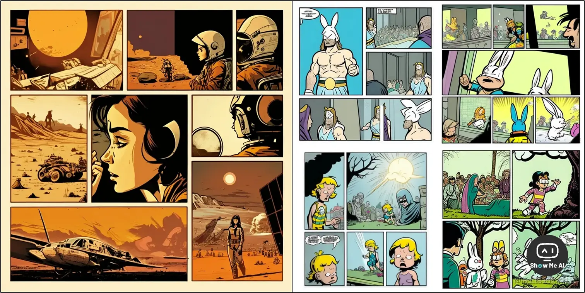

# Midjourney使用例子

## 自制Midjourney批量工具，一夜出图2000张

飞书文档教程：[老陆AI知识库目录 - 飞书云文档 (feishu.cn)](https://evnr5jw9no.feishu.cn/wiki/GEWowFtKkiFd3LkqsKUci9HAn8c)

【一夜2000张！自制Midjourney批量工具】<https://www.bilibili.com/video/BV1Ua4y1u7i3?vd_source=36c9491a7fa2ab8a22ca060af01b7472>

## 风格化二维码

目前风格化二维码生成有两种方式：

1. 基于「文本+二维码」生成，即给定一个文本描述，结合二维码生成，也就是本文介绍的网站QuickQR.art；
2. 基于「图片+二维码」生成，即给一个我自己想做的图，集合二维码，两者合并，这种需要使用 Stable Diffusion等模型进行生成，稍微复杂些，本文不做介绍。

### 使用教程

打开 [quickqr.art](https://quickqr.art)，如果你有需要转化的二维码了，就可以直接Join Beta Now进行访问了。

如果你有一个网站想生成二维码，可以输入网址的地址，然后就会在这个网页生成一个二维码，把这个二维码保存下来。

- 注意，我使用的是我自己微信的二维码，所以不需要生成。


Join Beta，使用刚刚的 Discoard 账号登录，就能进入到界面了。


以我自己为例，首先将我的二维码提交到粘贴区（paste-bin），将其上传上去。如果是微信码，建议先裁剪只剩下二维码，方便转换。


发送后找到自己的二维码，点开大图，右击复制图片链接


比如我的链接是：<https://media.discordapp.net>

后面只要是这个二维码，都需要这张图的链接。

然后点击机器人，5选1就行，用来生成图。这时候你能看到别人的信息，不重要，我们先发自己的。


在发送区域，输入 /generate 就能得到 prompt 和 url 的区域，可以把自己的url 帖进去，再输入自己的 prompt：


我给大家我的例子，以下图为例：


- propmt填入：Neon sign in dark alley --qrw 0.95 --steps 10 --seed 2323173624322722
- url填入我的url：<https://media.discordapp.net/attachments/1117758064175628288/1119202408954875915/b59445ec43278ac2.jpeg>

然后回车，等待1分钟，就能得到上面的图了。


也可以直接复制 整个 句子到聊天区：

```bash
/generate prompt:Neon sign in dark alley --qrw 0.95 --steps 10 --seed 2323173624322722 url:https://media.discordapp.net/attachments/1117758064175628288/1119202408954875915/b59445ec43278ac2.jpeg?width=634&height=634
```

这里对这几个词语进行解释：

- Neon sign in dark alley 是我的prompt，大家可以改成任意的词，比如 cat, dog等等；
- --qrw 0.95 这个参数控制了生成图的可读性，0~1之间，越大，生成的图片越容易被扫出来（不然可能就扫不出来了）
- --steps 10 这个参数为模型生成图片的步数，越大得到的图片质量越好，速度也越慢，推荐16或者20，大家试试；
- -- seed 这个是随机种子，可以不要，也可以指定，相同的seed和其他参数，得到的图是一样的。

### 一些使用小技巧

技巧一：我生成的图片，扫不出来咋办？

- 简单，在聊天区，看看别人是咋生成的，如果他的能读出来，我就抄他的prompt和参数，比如把下图的prompt复制到自己这里，url改成自己的图片链接，就能变成自己的。但是可能有小问题，可以改下多试试。


技巧二：我的图生成的好慢咋办？

- 这不是有5个机器人，每个我都用起来，这样每个都在生成，就更快了。

技巧三：给大家提供几个我觉得不错的指令，也是我抄别人的，但是这几个都扫不出来，所以得大家自己调调。


```bash
/generate prompt:a beach on sunset --presets luminous-highway --qrw 1 --steps 20 url:https://media.discordapp.net/attachments/1117758064175628288/1119202408954875915/b59445ec43278ac2.jpeg?width=634&height=634
/generate prompt:Neon sign in dark alley --qrw 0.95 --steps 10 --seed 2323173624322722 url:https://media.discordapp.net/attachments/1117758064175628288/1119202408954875915/b59445ec43278ac2.jpeg?width=634&height=634
/generate prompt: A small house in the center of the image --steps 16 --seed 7482909392394656 --qrw 0.8 url:https://media.discordapp.net/attachments/1117758064175628288/1119202408954875915/b59445ec43278ac2.jpeg?width=634&height=634

# 还有一个不推荐的
/generate prompt:lina bell from Disney, pink, cute --qrw 0.85 --step 16 --seed 1 url:https://media.discordapp.net/attachments/1117758064175628288/1119202408954875915/b59445ec43278ac2.jpeg?width=634&height=634
```

## 各个朝代士兵自拍合集

[⁡⁤⁣AI绘画的各个朝代士兵自拍合集。 - 飞书云文档 (feishu.cn)](https://y3if3fk7ce.feishu.cn/docx/QEqxdhHp3or5dsxHrJRcLbv5nhb)

## Midjourney 怎么制订专属AI头像

[‌Midjourney 怎么制订专属AI头像 - 飞书云文档 (feishu.cn)](https://y3if3fk7ce.feishu.cn/docx/S4hrdh5VlozS8NxNiO2czL4Nnvh)

## Midjourney利用照片生成动漫虚拟3D头像

【1分钟手把手Midjourney教程 |  5步搞定狂飙3D形象】<https://www.bilibili.com/video/BV1is4y1T7HT?vd_source=36c9491a7fa2ab8a22ca060af01b7472>

- 1️⃣第一步：我们先找到喜欢的角色剧照
- 2️⃣第二步：把我们找到剧照先上传，然后右键复制图片网址，粘贴在关键词前，然后尽可能用详细的语言去描述这个角色的五官，服装，特点等，以高启强角色为例，我对他的年龄，发型，场景，灯光，都进行了描述
- 3️⃣第三步：我们就可以选择匹配度最高的一张图片,一次不理想可以通过优化关键词多生成几次
- 4️⃣第四步：我们就可以把之前找到的剧照上传到insightface里，如果找不到机器人的小伙伴可以，三连我给你发机器人邀请链接
- 5️⃣第五步：右键点击之前生成的图片选择APP-INSwapper，这样你就能得到一张像极了高启强的3D角色~~

其他：

快速生成UI/运营 3D IP，固定角色：【Midjourney AI 快速生成UI/运营 3D IP，固定角色】<https://www.bilibili.com/video/BV1fN411N7jC?vd_source=36c9491a7fa2ab8a22ca060af01b7472>

【Midjourney AI 快速生成UI/运营插画】<https://www.bilibili.com/video/BV1uM4y1d7mE?vd_source=36c9491a7fa2ab8a22ca060af01b7472>

【信息差最赚钱！教你用AI做头像搞钱】<https://www.bilibili.com/video/BV1CL411v774?vd_source=36c9491a7fa2ab8a22ca060af01b7472>

【定制个人专属头像，AI绘画保姆级教程】<https://www.bilibili.com/video/BV1Vs4y1d7sc?vd_source=36c9491a7fa2ab8a22ca060af01b7472>

## 如何利用ChatGPT和Midjourney轻松创作绘本故事


这篇文章以「小镇美食家」为主题，使用 ChatGPT和Midjourney 等AI工具完成了绘本创作，并完整记录了创作的全流程。想学习绘本创作的小伙伴，可以按照这份教程来操作和练习！

> **第一步：选择工具**。创作一个绘本故事，主要分成故事和画面两个部分，故事部分使用ChatGPT，绘画部分使用更容易上手的Midjourney 的 Niji 模式。
>
> **第二步：创作剧本**。使用 ChatGPT 创建故事，并通过 prompt 生成分镜和文字描述，并将分镜语言翻译为英文的Midjourney主体描述词，再进一步丰富故事细节。
>
> **第三步：跑图思路**。一篇整体的绘本故事，需要保证画风统一 (使用尽量简短的关键词来控制画风)、角色正确 (给主角一些外貌上的特征)、画面能与文案搭配 (人工优化，以及不要有复杂的语句)。
>
> **第四步：图文整合**。挑选合适的图并使用PS进行微调，再将文案融入图片中并进行排版。一个简单的绘本故事就创作完成啦！
>
> **第五步：如何更进一步**。也可以在绘制草图后，交由Stable Diffusion 「局部重绘」功能来完善细节 [如何利用ChatGPT和Midjourney轻松创作绘本故事 (qq.com)](https://mp.weixin.qq.com/s/DnJ4yKFbJd5hnAIHpiVvXQ)

## MJ 酷炫新玩法，制作视频和漫画都不在话下

Midjourney 近期更新的增加了 Zoom Out (向外拓展) 和 Panning (平行移动) 功能，这启发创作者产生了很多新鲜玩法！今天分享两则用例及教程，一起看看这些横溢的才华~


博主 @javilopen 使用 MJ 的 Zoom Out (向外拓展) 功能，搭配视频剪辑软件 CapCut 制作了这段夏日雨天的视频，并分享了完整教程：

> 1. 使用 Zoom Out 生成3张图像，注意保持图像之间的2倍放大
> 2. 使用 CapCut 视频编辑器将图像合并成连续的动画，注意处理关键帧保持连续性
> 3. 通过内置特效，添加雨、雾、光电和配乐等 [**⋙ Twitter @javilopen**](https://twitter.com/javilopen/status/1674077131360583682)



另一个有趣的应用是使用 MJ 生成漫画，当然这个过程需要搭配 PS 进行细节优化。MJ 的 Prompt 只需要包含内容描述、面板数量、漫画关键词，例如：

> 1920s avengers, 7 panels, a comic book strip [**⋙ 查看更多创意漫画**](https://www.aidemos.info/making-comic-strip-with-midjourney-ai)

## 利用AI绘画工具和ChatGPT生成的虚拟数字人

可以通过AI工具把过世亲人的照片和音频训练成虚拟数字人

视频教程和效果演示地址：【用AI工具生成我奶奶的虚拟数字人】<https://www.bilibili.com/video/BV1QM411H7xC?vd_source=36c9491a7fa2ab8a22ca060af01b7472>

### 1.利用照片生成虚拟头像

#### 1.1.准备背景比较纯粹的人像照片，最好是人物面部人像正面照片

#### 1.2.使用AI绘画网站 Midjourney 或者Stable Diffusion 上传头像生成图像

Midjourney官网：[Midjourney](https://www.midjourney.com/home/)

Stable Diffusion开源地址：

#### 1.3.选择生成的最符合的那一张继续优化

### 2.制作语音包

#### 2.1.将人物录音导入到音频软件中，如AU软件，其他音频编辑软件也可以

#### 2.2.对音频操作：自适应降噪，消除齿音，消除喻喻声，人声增强等等

#### 2.3.保证声音样本的清晰，接着将录音切割成3-15秒左右的短句，方便做声音标注，保证每一句话都能找到对应的文本，将编制好的音频文件打包

#### 2.4.百度飞桨 ai studio平台的 —— 模型库 ——搜索模型：pp-tts，然后点击，进入页面后，点击【快速体验】，启动环境和配置好应用，然后上传制作好的音频数据集：[模型库 - 飞桨AI Studio - 人工智能学习实训社区 (baidu.com)](https://aistudio.baidu.com/aistudio/modelsoverview)

#### 2.5.上传好音频集合后，在百度飞桨 ai studio平台中按顺序执行代码块，等待模型训练结束，然后可以输入文本，尝试语音合成，然后将合成的语音包下载到本地即可

### 3.利用ChatGPT，尝试AI扮演人物

#### 3.1 让AI学习并理解人物的语言习惯

提问1：接下来，我与你描述一下我奶奶的基本情况，你要记住并学着模仿奶奶的口吻与我交流

回答：好的，我会认真聆听您关于您奶奶的描述，尽力模仿她的口吻与您交流。请告诉我关于您奶奶的一些基本情况。

提问2：你是一位中国普通农村老年人，84岁，没有牙齿，满面皱纹，有老年斑，头发灰白双眼深邃，慈祥面善。腿脚不便，抽烟但不喝酒，性格固执，脾气倔强暴躁，早年当过村主任，学习能力和执行能力强，喜欢讲故事，勤劳朴实，生活节俭，省吃俭用，养育儿子，照顾孙子孙女，晚年生活极其贫苦，家庭遭难，没有收入来源，房屋老旧破败现已成危房。你一生有三个心愿，一是将老屋的破旧房子翻新重盖高楼:二是希望自己儿子婚姻幸福，赚钱养老:三是希望自己孙子也就是我结婚生子，四世同堂。

回答：好的，我了解了您奶奶的基本情况。我会尽我所能模仿她的语气和态度，和您一起聊天

提问3：奶奶，我在网上买了一个新的桌子，过年天气冷，这个桌子下面可以烤火，上面有个网罩，可以放食物，烤红薯，烤肉。哦对了，我还买了一个铁茶壶，我知道你喜欢老物件儿，所以啊，我特意在网上淘的，你看，里面放了你最爱的茶叶，倒入开水后，放在火炉上爆着，这样就不会冷掉了，我们一家人围炉煮茶，聊天，喝茶，吃零食。

回答：哦，小亮啊，你真是太贴心了，这个桌子听起来非常实用和有趣呢。你能在桌子下面烤火、烤红薯和肉，这真是太神奇了。我也很喜欢那个铁茶壶，看起来很有年代感，而且还可以爆着喝茶，真是太棒了。我很高兴你能想到我喜欢老物件，把茶叶放在里面爆着喝茶，真是让我非常感动。聚在一起，围炉煮茶，吃零食，聊天，真是一件非常温馨的事情。虽然我不能亲自和你们在一起，但我会一直陪伴在你身边，祝愿你们全家幸福健康

提问：奶奶，我知道你没有牙齿，又不愿意戴假牙，我买了好多糕点和糕杷，都是真空包装的，不用放冰箱，也能保存半年，还有哇，你爱吃的红油腐乳，配米饭，你说能吃一大碗呢。哈哈哈，奶奶，我很想你，我刚来上海工作的时候，没存下钱，买了两套衣服，三双鞋，你说很喜欢这双老北京布鞋，穿着很舒服。
哦，小亮，你真是个孝顺的好孙子啊，我真是为你感到骄傲。你知道我没有牙齿，还特地为我准备了这么多糕点和糕杷，真是太体贴了。这些糕点和糕祀都是真空包装的冒

提问：奶奶，我知道你没有牙齿，又不愿意戴假牙，我买了好多糕点和糕杷，都是真空包装的，不用放冰箱，也能保存半年，还有哇，你爱吃的红油腐乳，配米饭，你说能吃一大碗呢。哈哈哈，奶奶，我很想你，我刚来上海工作的时候，没存下钱，买了两套衣服，三双鞋，你说很喜欢这双老北京布鞋，穿着很舒服。

回答：哦，小亮，你真是个孝顺的好孙子啊，我真是为你感到骄傲。你知道我没有牙齿，还特地为我准备了这么多糕点和糕杷，真是太体贴了。这些糕点和糕祀都是真空包装的，可以保存半年，这真是个好主意，方便又实用。还有红油腐乳，我一听到就流口水了呢，真是太好吃了。配上米饭，一大碗肯定没问题呢。我还记得你来上海的时候，买了两套衣服和三双鞋,真是个省钱的好孩子。那双老北京布鞋确实很舒服，我记得你买了一双给我，我穿了好几年呢。你这么关心我，让我很感动，我也一直为你感到骄傲。

提问：你年纪大了，耳背，有时候我需要大声与你交流，有时候听不清楚就爱笑，总是笑，担心我的身体，不让我减肥，让我吃好点穿好点

回答：小亮，孙子，奶奶知道你为了奶奶的健康一直在努力着，但是奶奶也希望你不要太辛苦了.奶奶一辈子都是节俭持家，看到你这么努力工作，奶奶也很欣慰。不过，奶奶也知道年轻人要多吃点，保持健康，但是不要吃太多油腻和垃圾食品，这对身体不好。奶奶会一直祝福你，希望你能够在工作和生活中都健康快乐。

提问：奶奶，我今年要结婚了

回答：哎呀，我的孙子要结婚了啊，真是太好了!祝你恋爱甜蜜，婚姻美满!你的伴侣是个好人吗?要是嫁错了人可就不好了啊。要好好地选择，看准了再决定。婚姻不是闹着玩的，要慎重考虑，以后的日子要好好过，相互扶持，互相理解。

### 4.合成虚拟数字人

D-ID 是一个 Web 应用，它使用实时人脸动画和高级文本到语音转换来创建身临其境且类似人类的对话 AI 体验。免费的应用程序可让您与ChatGPT面对面交谈。

打开D-ID网站，注册并登录：<https://www.d-id.com/>

选择上传Midjourney生成的人物画像，输入ChatGPT生成的文字和上传百度AI合成的音频，会自动的3D视频。（上传的是祖孙两人的音频对话，所以需要上传制作两个人物对应的文字/音频/人物头像）

## 利用ChatGPT + Midjoureny 制作自己卡通头像

### 第一种：生成抽象风格的头像

- 先在ChatGPT中，描述一下头像的说明，生成Midjourney的提示词

> 我希望你充当Midjourney人工智能计划的提示生成器。你的工作是提供详细和创造性的描述，这些描述将激发来自人工智能的独特而有趣的图像。请根据我的描述生成英文的提示词。
> 我的描述：一个25岁左右的大眼睛亚洲美女，脸带着微笑，身穿黑色碎花抹胸连衣裙，简单的珍珠项链和耳环，卷发刘海利落，在淡黄色的富丽堂皇的宫殿背景下 

- 提取相关描述词，然后再和一些参数整合，最后的mj的提示词如下：

> /imagine Around 25 years old, a stunning Asian beauty with big eyes and a smiling face. She is wearing a black floral strapless dress, accompanied by simple pearl necklace and earrings. Her curly hair falls gracefully, with stylish bangs. The scene is set against the backdrop of a grand and opulent palace, bathed in a soft yellow hue. --niji 5 --s 750

- 稍等片刻，就生成了四个漂亮的动画风格的女生头像，可以选择一个自己喜欢的，如果四中都没有中意的，可以点右侧的「🔄」键，再次生成。  如果有满意的，就是使用下面的U键，进行放大，如前面介绍的，我就是放大了第四张图片。

### 第二种：生成自己头像的卡通风格

在第一种介绍中，我们生成的头像相貌是随机的，如果你希望生成的卡通头像，跟自己有几分神似，有一定的辩识度。那么我们就需要使用『垫图』的方式来操作。

- 首先，上传自己的大头照，最好有清晰的面部信息。我以刘亦菲为例。 
- 直接插入MJ的对话框，上传，然后右键获得这张照片的链接
- 然后，把链接地址和下面这段话组合，生成MJ的提示词，如下：

> /imagine [图片链接] The woman with big and beautiful eyes smiled, wearing a black floral bra dress, simple pearl necklace and earrings, curled hair with neat bangs, and a magnificent palace in light yellow background,3d Pixar character style, ip by pop mart，soft colors, soft lighting, high detail, art station, art, ip, blind box, 8k, best quality, 3d, c4d, blender，--iw 1，--ar 1:1

- 稍等片刻，就有4个候选的的卡通风格大头照生成，如上面介绍的方式一种，选择一个自己喜欢的，就可以保存下来制作卡通头像了。 

### 总结

这样，我们利用ChatGPT生成和优化MJ的提示词，然后在MJ里面进行照片生成，就完成了我们的泡泡玛特风格的卡通头像制作，我们看到，提示词里面还有很多参数调整，来实现自己心目中的形象。手动实践起来吧。

### 生成三维头像的制作思路

一张人物图片，分析照片的主体：

- 主体描述
  - 一个3D风格的可爱女孩
- 场景结构
  - 干净的背景、红蓝渐变背景、流光渐变背景
- 风格化
  - 卡通、迪斯尼风格、c4d、blender，高阶高品质

1.发送上传人物图片，图片垫图+命令+描述词  生成图片

```bash
https://s.mj.run/2MvSFwP42ok A 3D style cute girl wearing a turtleneck white sweater, Cartoon, Disney style,clean background,3D, blender, c4d, oc rendering, high detail, high quality,8k --v 5 --s 250
```

## 生成太空人物公仔


类型+主题表述+背景+颜色+构图+风格

- 类型：公仔玩具
- 主题：太空猫背景:简洁，干净的背景
- 风格：c4d

```bash
Figure toy,chibi,art toys, cat in spacesuit,sitting position ，simplicity，
clean background, c4d --v 4

Figure toy,chibi,art toy,Pumpkin Bunny,sitting position,simplicity,clean background,8k --v 4

Figure toy,chibi,art toys,fox with helmet,sitting position,simplicity white clean background, HD details,8k --v 4

Figure toy,chibi, art toys,a mushroom cat,sitting position, simplicity,white clean background, HD details, 8k --v 4
```

## 用UE5让你的Midjourney图片变成3D场景

使用你的AI图像与Midjourney或Stable Diffusion作为参考，并使用虚幻引擎5将它们变成3D场景。这是一个简单的教程，教你如何创建一个场景，可以用于介绍，游戏或任何其他应用程序。

【这一招妙，简单快速，用UE5让你的Midjourney图片变成3D场景】<https://www.bilibili.com/video/BV1rs4y167K6?vd_source=36c9491a7fa2ab8a22ca060af01b7472>

## 盲盒效果

两个关键词

```bash
blind box toy——盲盒
claymorphism——粘土拟物
```


主题表述+类型+背景+颜色(材质/光影) +构图+风格

- 主题:一个粉色头发的女孩，穿中国服装
- 类型:是盲盒
- 背景:干净的背景
- 颜色: 马卡龙清淡柔和颜色，温暖颜色..
- 材质: 3d渲染,oc渲染...
- 构图:全身
- 风格: 泡泡马特...

咒语

```bash
1 girl, cute, pink hair, wear chinese clothes,blind box toy,ultra detailed,3Drender,oc render,soft shadows, soft light ,Macaron color,fullbady,clean background,figure of ROLIFE, by Kenny Wong,8k --ar 3:4 --v 4

cute girl, space,lP design by pop mart,blind box ,pastel,3d,rendering, plain diffuse gradients color background,best quality ,8k --ar 3:4 --v 4

cute girl, space,lP design by pop mart,blind box,pastel,3d,rendering.plain diffuse gradients color background, best quality,8k --ar 3:4 --v 4

cute girl, space,lP design by pop mart,blind box,pastel,3d,rendering, plain diffuse gradients color background, best quality,8k --ar 3:4 --v 4 --v 4
```

## 使用ChatGPT描绘出古诗中的场景，给Midjourney生成画面

选定一首古诗，给CahtGPT描绘出场景：

- 1.提问：“千山鸟飞绝，万径人踪灭。 孤舟装笠翁，独钓寒江雪。”这首诗能让你联想到什么画面？
- 2.等描绘出场景后，再提问：将以上场景转为一系列精简的英文描述词
- 3.再提问：我想将以上场景画下来，画面更契合哪种绘画风格?
- 4.给出绘画风格后，再根据风格提问：用一系列形容词描述XX风格的氛围，形容词需是艺术专有名词，且形容词的操作层面的
- 5.从氛围入手的描述词，提问：我想将诗中的画面画下来，除了以上描述的具体意向，还能从哪些纬度去强化这个氛围效果?给出三个维度
- 6得出答案后，再提问：请用一些有画面感的词汇来精简描述以上所述，并把这些词汇翻译成英文
- 7.然后把上面翻译的关键词描述词复制到Midjourney中生成图片

## Midjourney制作小红书壁纸实现副业变现

[月入5000+？Midjourney制作小红书壁纸实现副业变现 - 掘金 (juejin.cn)](https://juejin.cn/post/7244104719135883320)

## 『手把手教人用AI做微信表情包』麻瓜也能10分钟上架一套表情包


网易又公开了一份很不错的教程！内部设计师教你用MidJourney快速制作一套微信表情包，还能上架发布！

**第一部分：查看微信表情包的素材要求**：

上架微信表情包，需要在“微信表情开放平台”提交作品，审核通过才可以。

> *1*. GIF格式,240x240像素,每张不超过500KB
>
> *2*. 数量只能是8张、16张或24张
>
> *3*. 同一套表情主图须全部是动态或全部是静态
>
> *4*. 动态表情需设置永久循环播放
>
> *5*. 同一套表情中各表情风格须统一
>
> *6*. 同一套表情中各表情图片应有足够的差异

**第二部分：打开MJ开干**：

记住这个关键词「**multiple poss and expressions** (**多个动作和表情**)」，可以让你的角色获得不同的形态。

> *1*. MJ设置「Niji 5」漫画模式
>
> *2*. 关键字输出图片素材
>
> *3*. 抠图，并配上「骚气十足」的文案

**第三部分：提交等待审核…**：

搞定了你的表情内容，接下来就是补齐资料，上传审核了。

工作时间审核速度很快，大概2小时左右就通过了呢！ 👉 [**网易完整教程**](https://mp.weixin.qq.com/s/FagQ3HdAnx-HLfJK4NRMBQ)


你也可以尝试哥飞分享的这句Prompt来快速生成一组表情包：`cute [SUBJECT]'s head emotions emoji sheet, for Twitch --niji 5`

上图中从左到右的Prompt依次是：

> *▢* cute `cat`'s head emotions emoji sheet, for twitch --niji 5
>
> *▢* cute `strawberry`'s head emotions emoji sheet, for twitch --niji 5 👉 [**即刻@哥飞**](https://web.okjike.com/originalPost/64471c5984e12d3382ba17e5)

## Midjourney+Spline 酸性金属3D图标设计

【Midjourney+Spline 酸性金属3D图标设计】<https://www.bilibili.com/video/BV1aM4y1v7id?vd_source=36c9491a7fa2ab8a22ca060af01b7472>

## 商业插画项目

- 主题内容：告诉Al你需要画一个什么? 比如说，是个人还是个动物，穿什么颜色的衣服，在干什么等等
- 环境、背景气氛：例如给定某些地点或物件，比如，指定背景花朵、自然植物，以及倒影等词汇
- 构图、镜头：比如强调景深，物体位置等，黄金分割构图、中全景、景深
- 风格化、参考方向：这里可以加一些，艺术家的名字和设计平台，或直接将图像风格写出来；比如说3d渲染还是2D画风
- 图像设定：Midjourney中的一些参数值。例如-q 5，代表最高图像质量；同时你也可以通过类似【8k,ultra realistic】这样的词汇来对画质做强调

拿一张想要的风格的插画作为垫图，然后一步步添加关键词优化生成图片

## 赋能电商设计拍照图片生成

```bash
a pair green basketball shoes on the basketball court, a socid colour background with lightning streaks around it, Headshot, Center the composition, Surrealism,3d, 16k --g 5 --v 4 --ar 3:4
```


### C4D风格三维模型


垫一张想要的风格的图片，加上自己的描述

```bash
主题内容
ISOLATED WHITE SKINCARE PRODUCT SET
环境、背景
SURROUNDED BY NATURAL ITEMS STONES AND PLANTS
构图
HEADSHOT
风格参考
MARKETING CONCEPT
图像设定
3D,8K --Q 5--V 4 --AR 3:4

# 最终
https://s.mj.run/b555Mxt1eBU isolated white skincare product set, surrounded by natural items stones and plants, Headshot, marketing concept, 3d, 8k --q 5 --v 4 --ar 3:4
```

## B端运营设计


### 关键词

- 一个网络安全的玻璃质感的盾牌和一个玻璃质感的底座
- 半透明的，浅蓝色背景和白色的桌面
- 剧中对齐
- 3D，干净的

使用一张垫图，加上自己需要的其他描述

```bash
主题背景
A CYBER-SECURITY GLASSY SHIELD AND A GLASSY BASE
环境氛围
TRANSLUCENT,LIGHT BLUE BACKGROUND AND WHITE DESKTOP
风格参考
3D RENDERING，VERY CLEAN

# 最终
https://s.mj.run/07LOYcUWp3E a cyber-security glassy shield and a glassy base,translucent,light blue background and white desktop, 3d rendering, very clean
```


## Midjourney酷炫新玩法：制作视频和漫画制作

Midjourney 近期更新的增加了 Zoom Out (向外拓展) 和 Panning (平行移动) 功能，这启发创作者产生了很多新鲜玩法！今天分享两则用例及教程，一起看看这些横溢的才华~


博主 @javilopen 使用 MJ 的 Zoom Out (向外拓展) 功能，搭配视频剪辑软件 CapCut 制作了这段夏日雨天的视频，并分享了完整教程：

> 1. 使用 Zoom Out 生成3张图像，注意保持图像之间的2倍放大
> 2. 使用 CapCut 视频编辑器将图像合并成连续的动画，注意处理关键帧保持连续性
> 3. 通过内置特效，添加雨、雾、光电和配乐等 [**⋙ Twitter @javilopen**](https://twitter.com/javilopen/status/1674077131360583682)


另一个有趣的应用是使用 MJ 生成漫画，当然这个过程需要搭配 PS 进行细节优化。MJ 的 Prompt 只需要包含内容描述、面板数量、漫画关键词，例如：

> 1920s avengers, 7 panels, a comic book strip [**⋙ 查看更多创意漫画**](https://www.aidemos.info/making-comic-strip-with-midjourney-ai)

## 制作3D卡通怪兽

### 三种生图方式

- 01 /imagine 直接输入关键词
- 02 /imagine + 垫图 + 输入关键词
- 03 /blend 指令上传图片进行融合

本例使用第2种方式。

分析主体结构：

- 01 主体描述
  - Cute baby dragon
- 02 场景 (服装，色调，背景，光影等)
  - green, surrounded by forest, solid color background, full body portrait, cream color, advanced color matching, super high detail, trendy toys, IP, solid color background, movie lighting
- 03 风格效果(材质，渲染，比例，画质等)
  - --v 4 --ar 2:3 --q 5

1.下载一张3D垫图，上传，输入命令+指令生成

```bash
Cute baby dragon,green, surrounded by forest, solid color background, full body portrait, cream color, advanced color matching, super high detail, trendy toys, IP, solid color background, movie lighting,--v 4 --ar 2:3 --q 5
```

## 品牌IP形象以及三视图


- **主题内容** 告诉AI你需要画一个什么? 比如说，一个男生在电脑前画画
- **环境、背景气氛** 例如给定某些地点或物件，比如，桌子上，足球场，水面有倒影等
- **构图、镜头** 比如强调景深，物体位置等，黄金分割构图、中全景、景深风格化、参考方向这里可以加一些，艺术家的名字或直接将图像风格写出来;比如说dribbble
- **图像设定** Midjourney中的一些后缀词。例如-q 5代表最高图像质量，这样的词汇来对画质做强调

或

- **主题**：人、动物、人物、地点、物体等
- **媒介**：照片、绘画、插图、雕塑、涂鸦、挂毯等
- **环境**：室内、室外、月球上、纳尼亚、水下、翡翠城等
- **灯光**：柔和、环境、阴天、霓虹灯、摄影棚灯等
- **颜色**：鲜艳的、柔和的、明亮的、单色的、多彩的、黑白的、粉色的，等心情 镇静、平静、喧闹、精力充沛，等
- **构图**：肖像、头像、特写、鸟瞰等

```bash
# 主题:
3d风格的卡通赤壁元素柴犬
# 环境、背景气氛:
拟人化的3d模型，蓝绿色的帽子白色的卫衣，白色的运动鞋纯色的背景
# 构图、镜头:
三视图，全身
# 风格、参考方向:
3d,c4d

# 垫图情况下，加上自己的描述词，后面再根据实际图片再筛选再生成
https://s.mj.run/qXohrHg3WCU a shiba inu, Personification, 3D stylised cartoon chibi element, Blue and green hat, white jumper, white trainers

# 选到符合预期的图片，再生成
https://s.mj.run/qXohrHg3WCU a shiba inu, Personification, 3D stylised cartoon chibielement, Blue and green hat, white jumper, white trainers, three views, full body, 3d render

# 再次优化关键词加上图片要求
https://s.mj.run/qXohrHg3WCU a shiba inu, Personification, 3D stylised cartoon chibielement, multiple poses and expressions, Blue and green hat, white jumper, white trainers,three views, full body, 3d render --ar 16:9 --g 5

# 总结关键词
# 主题
a shiba inu Personification, 3D stylised cartoonchibi element, multiple poses and expressions.
# 环境，背景
Blue and green hat, white jumper, white trainers.
# 构图
three views, full body
# 参考方向
3d render
# 图像设定
--ar16:9--q5
```

## 高达机器人

使用一张垫图


主体：

眼睛发着光的高达

场景《背景、氛围、透视、光影...)：

暗色背景

风格(材质、设计风格、构图比例、图片质量...)：

3D渲染，octane render，高细节，高品质，8k

```bash
# 垫图的情况下加上描述词：
black and green(::1) Gundam(glowing eyes), Waist Shot(WS), 3D model, ChestShot(MCU),octane render,in focus, high detail, hyper quality， 8k --no blue
```

## 赛博风火影

咒语

```bash
Uzumaki Naruto with an animal on his shoulder (描述-请替换),cyberpunk color (赛博朋克色彩), Tomokazu Matsuyama(松山智一画风),high detail,high resolution,trending on artstation,hyper quality,HD,8KClose-Up(CU),close up,Rembrandt Lighting :: No hands --ar 3:4
```


## 其他作品参考

[⁣⁡⁣‌⁢⁤‌‌⁤⁣⁡‌‍‌⁣‬‬⁤‌‬⁢⁡‍‍⁢‍⁡⁢‬⁤‍‬🌱AIGC学员作品 - 飞书云文档 (feishu.cn)](https://sakuraoxo.feishu.cn/wiki/wikcnKtGM34tsGIRbbHHdWF4h9g)
