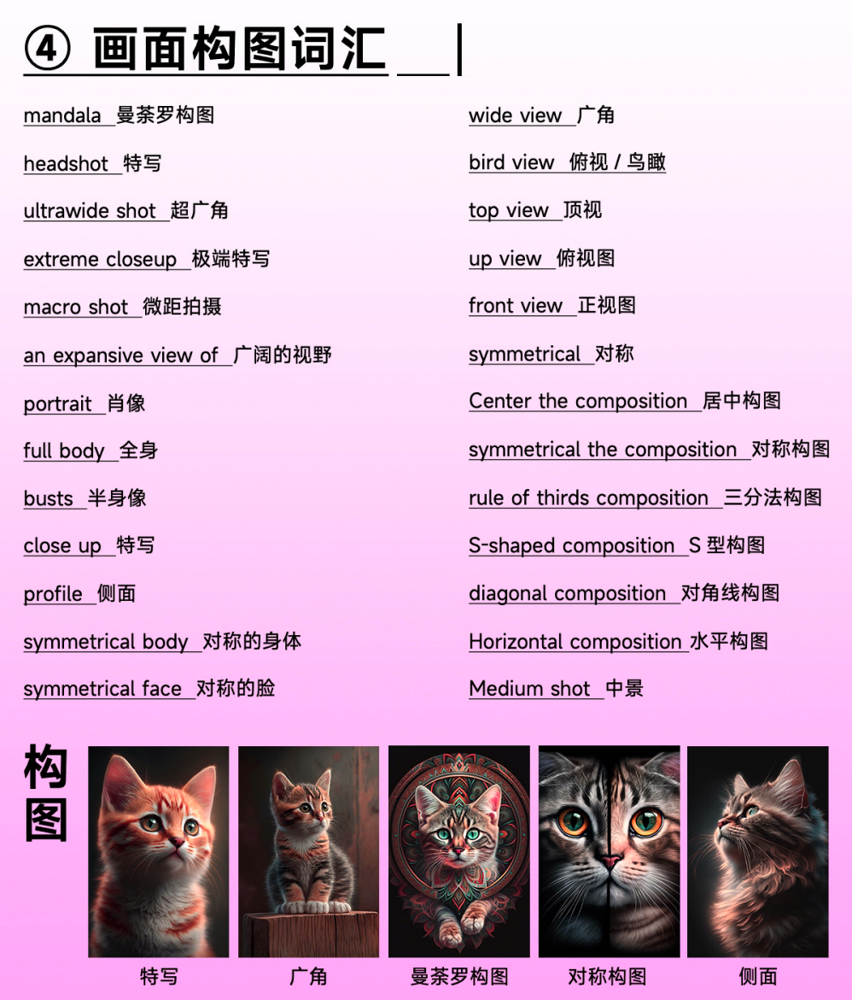

# Midjourney心得

# 最重要的Prompt和参数

AI绘画的核心就是Prompt，那么了解Prompt后你才能用的得心应手。

一图搞懂v5 MJ参数

一图搞懂V5的Prompt

### 基本 Prompts

一个简单的 Prompt 可以只是一个单词、短语或表情符号。

显示Midjourney Prompt结构的图像。

### 高级Prompts

更高级的 Prompts 可以包括一个或多个图像URL、多个文本短语和一个或多个参数。

显示中途提示结构的图像。

**图像 Prompts** 可以在 Prompts 中添加图像网址，以影响最终结果的样式和内容。图像网址始终位于提示的前面。

**文本 Prompts** 生成您想要的图像的文本描述。请参见以下Prompts信息和技巧。良好的Prompts有助于生成惊人的图像。

**参数** 参数会影响图像生成的方式。参数可以改变纵横比、模型、升频器等等。参数通常放在提示信息的结尾处。

### 一、构图指令结构

在Midjourney绘画AI中，有效的绘图指令是关键。一个好的指令结构建议如下： 画面内容+风格描述+修图后缀+属性描述 例如：“山水画+中国风+高清+雾气蒙蒙”

**画面内容：**主体内容，告诉 Al我们想画什么，比如是人还是建筑，是兔子还是老虎，穿什么衣服，什么颜色的，在干什么等等。

**风格描述：**告诉 Al 你需要什么风格的画面，比如艺术风格是写实还是国风的，是湿画法还是千画法等等。

**修图后缀：**甚至包括灯光角度、画面视角、相机品牌等等。

**属性描述：** 即基础词汇，包括画面尺寸、需要的 MJ 版本等等。

-常用基础后缀词汇

--v1/2/3/4/5/niji  

选择MJ的版本，V5目前是最新版；niji动漫风格。

--ar X:X

--aspect

以上两个指令都是画面比例，支持 1:2/3:2/16:9

--q .5/1/2.

画面质量，数宇越大，渲染时间越长。

--c 0-100

数值越大，风格越多变，越小，风格越统一。

--no ...

不要出现什么；比如--no people，则不会出现人

--seed

用于微调上一次生成的画面，获取 seed 值后微调描述词即可。

### 二、常用指令分享

指令结构：

指令1：/imagine prompt:    用文本自动生成4张图像，最常用的指令，不过多介绍。

指令2：/describe    用于图片生成文本描述，如下图所示

指令3：/setting   设置生成图的参数

指令4：/blend   两个图合并生成图的指令

### 三、操作技巧总结

新手刚开始不会，又想要生成想要的图片效果，垫图技巧必不可少。

1. **💫 图生文 /Describe**  

**通过图生成描述，让你不再发愁prompt怎么写。**

当然也可以利用ChatGPT调解生成：可参考这篇文章：[干货分享：Midjourney出图不理想？用ChatGPT调教批量出咒语，附30G网盘资料。](https://y3if3fk7ce.feishu.cn/docx/LTdodwUwCoHByxxXtKpcUZocnKh) 

1. **💫 图生图：**

**1）混合命令 /blend**

该命令允许用户上传 2-5 张图像，然后查看每张图像的概念和美学，并将它们合并成一个新颖的新图像。

**2）垫图指令 /imagine prompt: url1 url2 描述 参数**

**例如：htts://s.mj.run/h84Xh2GHYdM a cute girl --q 2 --niji 5 --s 750** **请注意，url 可以有两个，其效果类似/blend合成图的效果**

垫图技巧：

1. **💫 显示作业 /Show Job**
2. **💫 SEED值：保持画面一致性** 
   1.  **可以参考下这篇文章：****[SEED值：保持画面一致性](https://y3if3fk7ce.feishu.cn/docx/AsYxdCwS2oL9E2xvS4UcIY3Rnrr)** 
3. **💫 辅助网站:**

可视化编辑prompt辅助网站：https://moonvy.com/apps/ops/

（注意：上面的网站已开源：https://github.com/Moonvy/OpenPromptStudio） 

### 四、常用风格词汇

### 五、常用构图词汇

### 六、高频实用词汇推荐：

更多常用的词汇已总结，请访问这里查看下载：[‌⁡‍‌‍⁤⁡⁤⁣⁣⁡⁣⁡⁢⁤⁣‍⁢⁣⁤⁣⁡‌⁡‍⁤⁣⁣‬⁣⁢⁡AI绘图学习心得分享-Midjourney绘画AI，让你少走一些弯路 - 飞书云文档 (feishu.cn)](https://y3if3fk7ce.feishu.cn/docx/As0DdjQ0rohImBxMeUmcgII0nFg)

## Midjourney的一些学习心得：如何高效图生图

相信经常会看到好图也想要的，但是要么抄不出感觉，要么抄过来把水印也抄了

AI 绘画的核心就是给他怎么样的Prompt 。然而想让Midjourney 高效出图，图生图功能必不可少。 解决痛点：单一的描述Prompt 出不来我们想要的图片效果。 

有两种方法： 

1.图生图： 

- 指令：url +指令+参数 例如：hts://s.mj.run/h84Xh2GHYdM a beautiful girl --q 2 --niji 5 --s 750 请注意，url 可以有两个，其效果类似合成图的效果 

2.合成图： 

- 指令：/blend 
- 该命令允许用户上传 2-5 张图像，然后查看每张图像的概念和美学，并将它们合并成一个新颖的新图像。 

抄图有几个点需要注意的 

- 1.引用 
- 2.控制相似度 
- 3.控制风格强度 
- 4.强调符号

