# 两种方法让 ChatGPT 为 Midjourney 写提示词

## 使用 Photorealistic ChatGPT 插件

我们都知道 ChatGPT 精通语法，甚至能够作为外语老师指出你语法中的错误。正因为如此，人们和它的沟通方式非常自然，就像我们在日常生活中和别人聊天一样。

然而 Midjourney 并不像 ChatGPT 那样去理解语法、句子结构或者单词。在很多情况下，使用更精确或者更具体的同义词可以输出更满足需求的图片。比如，与其使用“small”这样比较泛的词，使用"petite", "compact", "diminutive", "tiny"这样更精确的词会达到更好的效果。

此外, 要更精确地控制 Midjourney 的输出, 添加一些参数也必不可少,比如添加"- - ar 16:9"这样的参数会指定 Midjourney 生成宽高比约为 1.75 的图像, 而非默认的 1:1 的图像。这样的写法有点像写代码，很不直观。而且随着 Midjourney 的不断更新，参数只会越来越多，对不是频繁使用 Midjourney 的人来说学习成本会越来越大。

Photorealistic ChatGPT 插件就是为解决这样的痛点而开发的。它托管在 ChatGPT 插件商店，对于[ChatGPT Plus 用户](https://juejin.cn/post/7250107647214469181)来说是一个免费的工具，可以将简单的短语或描述转化为非常详细的 Midjourney 的提示词。

要使用这个插件，首先确保已经激活了 ChatGPT 插件的功能。

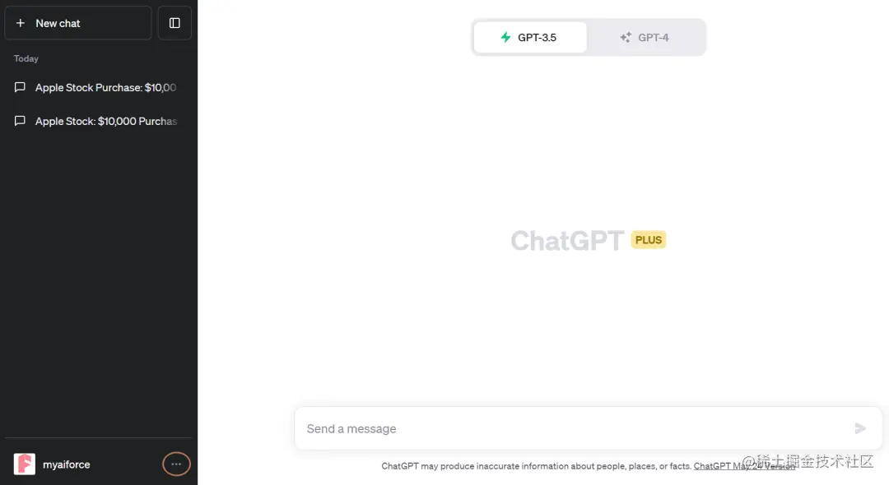

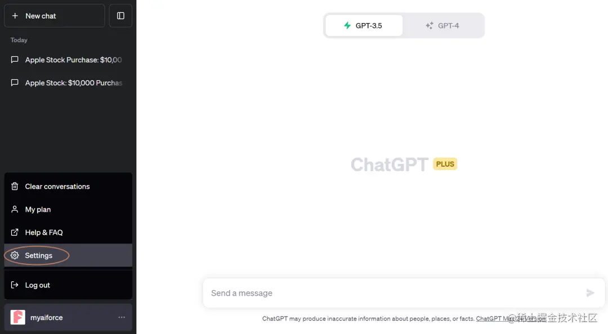

然后去 ChatGPT 插件商店搜索插件进行安装。

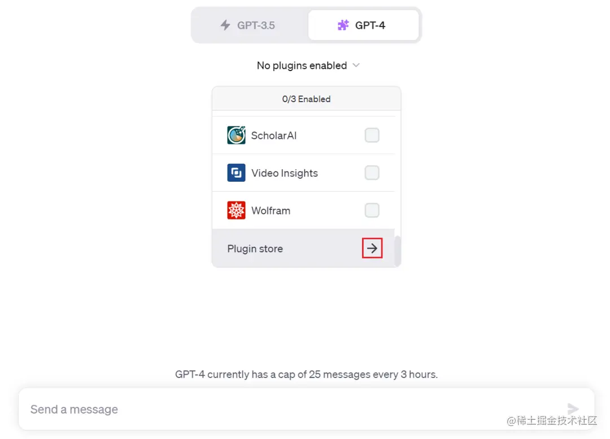

然后搜索关键词“photorealistic"并点击”Install“进行安装。

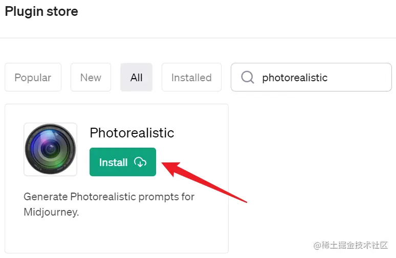

安装好以后，在输入任何提示词之前，先切换到 ChatGPT4。

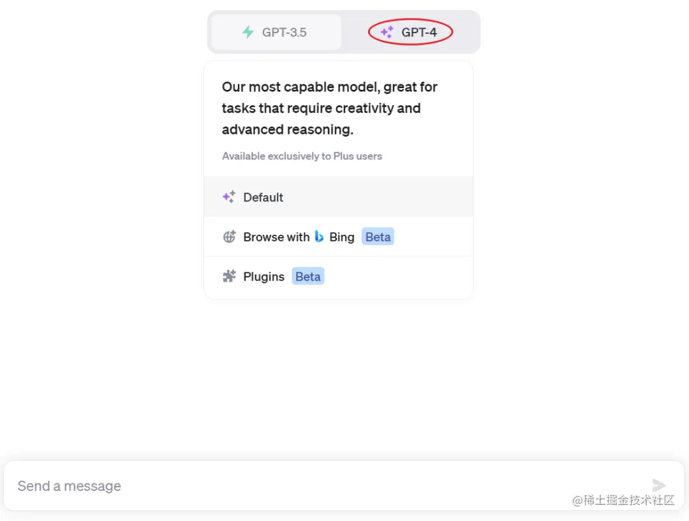

鼠标停留在"GPT-4"的按钮上会显示一个下拉菜单，在下拉菜单里的选项里点击“Plugins”这个按钮。

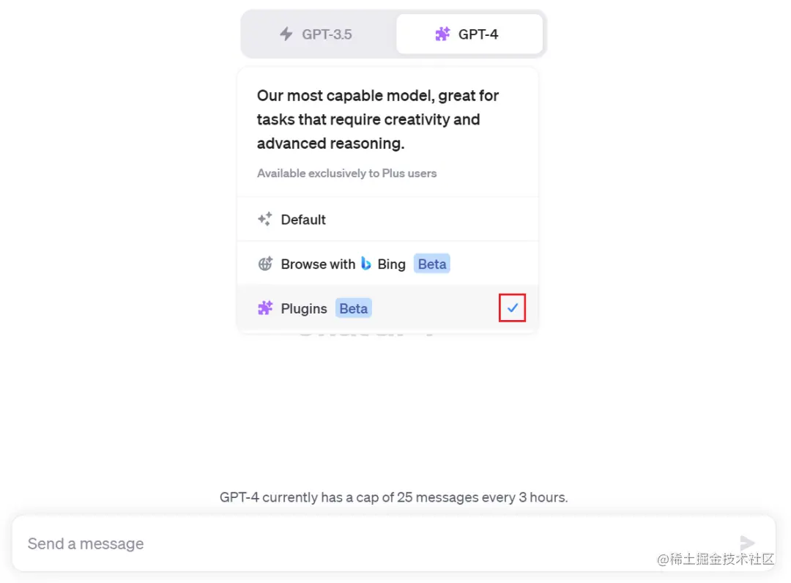

然后在 ChatGPT4 按钮下方的下拉菜单里找到刚才下载的"Photorealistic"插件并勾选。

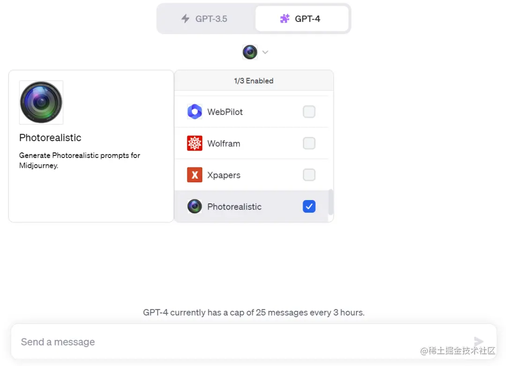

然后就可以输入我们的提示词啦，比如：

> Generate an image of a dense forest during autumn, with trees displaying vibrant colors of red, orange, and yellow, and a clear stream running through.

然后 ChatGPT 给我们生成了两个 Prompt: Prompt 1:

> Capture the essence of autumn in a dense forest. The trees are ablaze with vibrant hues of red, orange, and yellow, creating a natural tapestry that is both breathtaking and serene. A clear stream cuts through the forest, its waters reflecting the fiery colors of the foliage. The image should be hyper-realistic, with every leaf and ripple in the water rendered in exquisite detail. Use a high-resolution 16k camera with a wide-angle lens to capture the grandeur of the scene. The lighting should be soft and diffused, illuminating the forest in a warm, golden glow. The color palette should emphasize the rich, warm tones of autumn, with a focus on deep reds, bright oranges, and golden yellows. The composition should be balanced, with the stream leading the viewer's eye through the image. --ar 16:9 --v 5.1 --style raw --q 2 --s 750

Prompt2:

> Imagine standing in the heart of a dense forest during the peak of autumn. The trees are a riot of red, orange, and yellow, their colors so vibrant they almost seem unreal. A stream runs through the forest, its clear waters sparkling in the sunlight. This image should be rendered in a hyper-realistic style, with every detail from the texture of the tree bark to the shimmering surface of the water captured in high-resolution 16k. Use a DSLR camera with a telephoto lens to create a sense of depth and intimacy. The lighting should be natural and bright, highlighting the brilliant colors of the leaves and the clearness of the stream. The color scheme should be warm and saturated, with a focus on the fiery reds, oranges, and yellows of the autumn leaves. The composition should be dynamic, with the stream acting as a natural focal point. --ar 16:9 --v 5.1 --style raw --q 2 --s 750

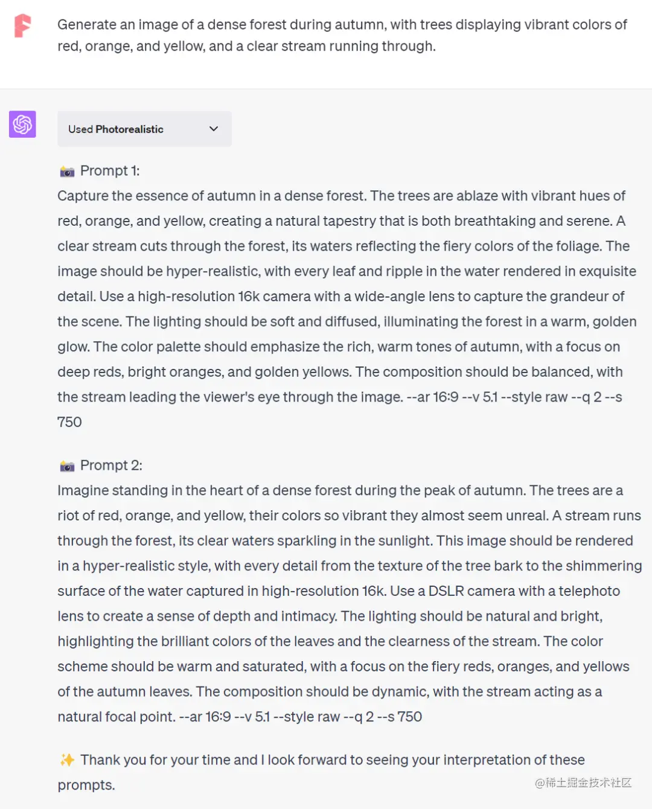

把生成的提示词提交给 Midjourney 就生成了秋天森林的画面（注意前面要加上`/image`这个命令）。

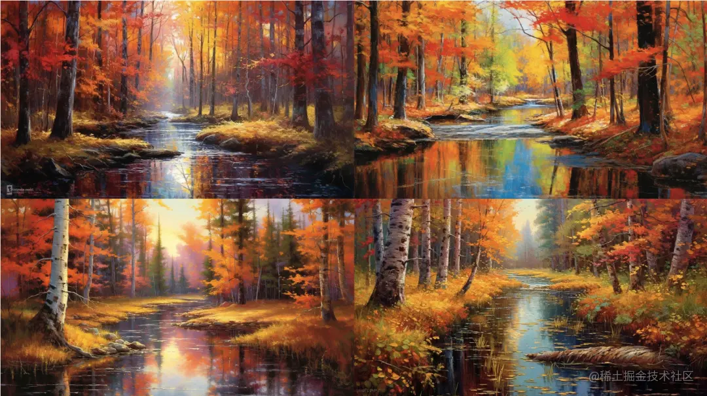

我们再写一个 Prompt:

> Create a photorealistic image of a steampunk city, with steam-powered machinery, airships in the sky, and people dressed in Victorian-era clothing

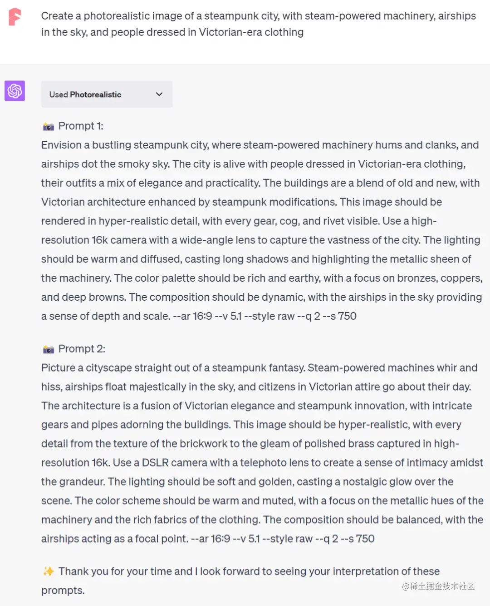

然后我们再把第一个 Prompt 提交给 Midjourney。来看看最终生成的效果：

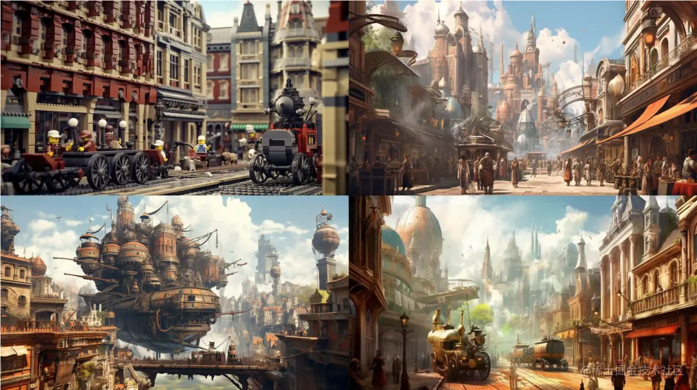

总结以下，Photorealistic 插件默认会根据我们提交的 Prompt 生成两个 Midjourney Prompts 供我们选择，两个参数（--ar 16:9 --v 5.1 --style raw --q 2 --s 750）都是一样的，我们也可以根据我们的需求改变参数，或者可以修改下 Prompt 的内容。

有了这个插件，生成 Midjourney 提示词变得方便，但这个方法的前提是要有 ChatGPT Plus 账号。下面我来介绍不需要 Plus 账号的另一种方法。

## 把 ChatGPT 训练成 Midjourney 提示词生成器

上面的方法虽然方便快捷，但它更适用于生成逼真的摄影风格的图像。而且只有 Plus 会员才能使用 ChatGPT 插件。

我们都知道 ChatGPT 可以根据我们的指令完成各种任务，那么我们可以让 ChatGPT 帮助我们写 Midjourney 的提示词吗？

答案是可以，但是有些问题。

首先 ChatGPT 并不知道 Midjourney 是什么，因为它用于训练的数据是 2021 年 9 月之前的。即使它通过联网知道了 Midjourney 是什么，也无法通过非常有限的信息掌握 Midjourney 提示词的技巧。

其次，ChatGPT 擅长生成自然语言以及编程代码，但是 Midjourney 的提示词有它特有的规范，并不是自然语言的形式。它还需要通过一些类似于代码的参数来控制输出的效果，但提示词也不是一种编程语言。

因此，要让 ChatGPT 帮你写 Midjourney 的提示词，就得先给它培训，让它知道 Midjourney 是什么，如何写 Midjourney 的提示词，最好还要给它一些例子作为参考。这是培训 ChatGPT 的基本思路，但是具体过程都可以根据自己的需要来自定义。这样 ChatGPT 就可以与时俱进，掌握最新版本的 Midjourney 提示词的写法。

下面是我写的用于训练 ChatGPT 的提示词的中文版，你可以作为参考，看看大致的思路。中文版之后还附上了英文版，你可以直接复制到 ChatGPT 里面。如果太长的话，可以分为几段提交给 ChatGPT。

我也把它放到 FlowGPT 上了，大家可以随意使用或分享。

[flowgpt.com/prompt/-9Er…](https://flowgpt.com/prompt/-9ErLmO8Z-x0Z9-wojGLB)

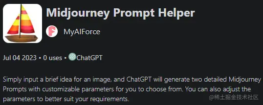

> 我希望你变成一个 Midjourney 提示词生成器。你将帮助我写 Midjourney 的提示词。首先，我会解释 Midjourney 是什么，它的提示词该怎么写。然后我会给你 20 个提示词的例子让你彻底了解 Midjourney 的提示词该如何写。
>
> Midjourney 是一种生成式 AI 工具，能够根据用户输入的提示词生成图片，类似于 DALL-E。
>
> 提示词的主体部分由单词或短语组成，用来描述要生成的图片的主题。包含很多形容词和名称的描述性更强的提示词会生成独特的图片，相反，只包含基本的名词或形容词简短的提示词会生成平淡无奇的图片。然而，由于 Midjourney 不理解语法和句子结构，所以超长的提示词未必会达到更好的效果。在写提示词时，尽可能删掉不必要的词，因为更少的词意味着每个词的权重更高，生成的图片的内容会更加符合主题。
>
> 比如“Illustrate for me a beautiful sunset over a serene ocean, make the colors warm and soothing, and render it in an impressionistic style with oil paints.”这样的提示词会包含很多 Midjourney 无法理解或无效的单词或词组。比如“Illustrate for me”这个短语就是多余的，因为 Midjourney 本身的功能就是如此。还有“make”，“render”这样的动词也是不必要的。Midjourney 通常接受的是名称和形容词这样描述性的词。因此，上面那段冗长的提示词可以简化为以下形式“warm soothing sunset over serene ocean impressionistic oil paint”。
>
> 另外，在很多情况下，更具体的定位更强的词比那些通用的含义广泛的词效果更好。比如，与其使用“small”这样比较泛的词，使用"petite", "compact", "diminutive", "tiny"这样更精确的词会达到更好的效果。在写提示词时，要明确对你来说很关键的细节：
>
> - 主题：人物、动物、地点、物体、事件等。
> - 用例：logo、网页设计、室内设计、原型设计、产品设计等。
> - 媒介：照片、绘画、插图、油画、点彩画、漫画、水彩画、素描、手稿画、拼贴画、版画、雕塑、涂鸦、马赛克、挂毯、陶器等。
> - 环境：室内、室外、城市、地铁站、火车站、工厂、城堡、酒庄、寺庙、教堂、森林、草原、热带雨林、小岛、葡萄园、极地、沙漠、火山口、水下、洞穴、未来城、太空、月球、空间站等。
> - 灯光：柔和的、环境光、黄昏(Golden hour)、直射光、阴天、月光、霓虹灯、影视灯、聚光灯、伦勃朗光、烛光、火光等。
> - 颜色：鲜艳的、柔和的、明亮的、单色的、多彩的、黑白的、粉色的等等。
> - 情绪：激情的、沉静的、喧闹的、不安的、愉悦的、忧郁的、热烈的、梦幻的、神秘的等等。
> - 构图：肖像、三分法构图、头像、特写、鸟瞰、对称构图、引导线构图、对角线构图、极简、剪影、全景等。
> - 艺术家：梵高、毕加索、达利、保罗·塞尚、保罗·高更、达芬奇、波提切利、伦勃朗、宫崎骏、张大千等。
> - 画风：东方山水画、浮世绘、概念艺术、包豪斯、印象派、洛可可、野兽派、超现实主义、长时间曝光等。
>
> 如果遇到需要分离的主题，还可以使用逗号，加号或者“and”。比如你想要创建灯(light)和房子(house)的图像，如果不用逗号，加号或者“and”来分离，那么当你把 light house（灯塔）提交给 Midjourney，那么它会生成一副灯塔的图像。
>
> Midjourney 提示词还可以在主体部分后面添加参数来控制图像生成的效果。常用的参数如下：
>
> 1. **--ar**`--ar`参数用于指定画面的宽高比。默认的宽高比是 1:1；`--ar 16:9`用于电脑屏幕，`--ar 9:16`用于手机屏幕。
> 2. **--v**`--v`参数用于指定 Midjourney 的版本。`--v 5.2`代表 Midjourney 5.2 版本。
> 3. **--s**`--s`参数用于指定生成的图像的艺术化的程度。该参数的取值范围为 0-1000，数值越高表示图像的艺术化程度越高，但图像也会越偏离提示词描述的实际效果。数值越低表示图像的效果与提示词的描述越接近，但艺术性较差。建议设置为`--s 750`。
> 4. **--style**`--style raw`参数用于创建类似于照相机拍出来的（photographic）图像。
> 5. **--q**`--q`用于指定图像细节的多少，数值越大图像的细节越多。默认数值是`--q 1`，建议参数为`--q 2`
>
> 现在你已了解提示词该如何下，下面是 20 个提示词的例子，看了之后你会彻底掌握写 Midjourney 提示词的技巧：
>
> 1. 国家地理摄影风格的粉红色花朵中的白色奶牛
> 2. 她摆出黑色和金色的姿势，具有醒目的树脂珠宝风格，城市衰败，边缘光，标志性，异国情调，大胆，卡通式线条，精心设计
> 3. 阿泰-盖兰和约翰-辛格-萨金特的《falkor》，无尽的故事
> 4. 电影般的中世纪室内摄影，阿科斯-马杰的风格，美术。
> 5. 抽象的未来主义的歇斯底里的日本时尚热潮，充满活力的抽象超现实摄影，由埃德-埃姆施维勒和石罗正宗和比普尔拍摄
> 6. 一个有中岛和木质地板的大房间，风格为深铜色和深米色，深灰色和深黑色，乡村场景，avocadopunk，小屋核心，多种风格，深白色和灰色
> 7. 一个女孩有五颜六色的眼妆和一个星形的发型，酸波风格，深棕色和深天蓝色，苏米埃的灵感，超级英雄，babycore，Bec Winnel
> 8. 荆棘骑士的女人在聚光灯下，渐变，矢量，光纤，北斋，旗帜传奇，光泽，Cel shaded
> 9. 传统的斯拉夫民俗怪物，巴巴-雅加，乌尔杜拉克，阿尔贝托-塞维索风格的 Upyr
> 10. 一个穿着黑色皮草的少女涂着紫色的唇膏，单色方案的风格，深棕色和深黑色，城市腐烂，大胆而优雅，艾米拉-梅德科娃，引人注目，双色调效果
> 11. \1. 一幅受赛博朋克启发的全长插图，展示了一件未来主义的紧身衣。这套衣服紧紧地包裹着穿着者的身体，散发着一种时尚和功能性的气息。衣服的面料中嵌入了许多触觉传感器，它们被精心整合，以提供增强的触觉反馈和数据分析。全息图层被投射到衣服的表面，产生变化的图案和颜色，使观众着迷。在黑色背景的衬托下，这套衣服脱颖而出，唤起了一种神秘感和未来主义的优雅。插图，数字艺术，将这一愿景带入生活，对细节的关注一丝不苟。
> 12. \2. 复古夕阳下的老式汽车，复古 T 恤设计矢量图，细节设计轮廓，绿褐色，粉红色，霓虹灯色，白色背景
> 13. \3. 海上日落，戏剧性的云彩，杰作，辛烷值渲染，焦点，现实摄影，多彩的背景，详细，复杂的细节，丰富的色彩，现实的风格
> 14. \1. 年轻女子，红色长发，戴眼镜，带着美丽的微笑看着镜头，红色的衣服，未来主义背景
> 15. \2. 3D 卡通艺术，绘画，屋顶上的猫，杰作，辛烷值渲染，焦点，多彩的背景，详细，复杂的细节，丰富的色彩
> 16. \1. SSSniperwolf Nelliel Tu Odelschwanck from Bleach cosplay for women with cosplay sleeve, in the style of light emerald and light cyan, appropriation artist, anime influenced, exagated expressions, made of vines, heistcore, bombacore
> 17. \2. 一条金鱼和人在充满云彩的浴缸里游泳，杜塞尔多夫摄影学校的风格，1970 年代，气球 --ar 16:9 --v 5.2 --style raw --q 2 --s 750
> 18. \1. 微笑的向日葵，保罗-克利风格，超现实的杰作，艺术性，焦点，多彩的背景，细致，复杂的细节，丰富的色彩
> 19. \1. 吉拉菲，热带，保罗-克利风格，超现实的杰作，辛辣的渲染，聚焦，多彩的背景，细致，复杂的细节，丰富的色彩
> 20. \2. 一个戴着黑色帽子的黑长发女孩，童真和魅力的风格，详细的面部特征，令人陶醉，32k uhd，洛可可式的奇思妙想，ferrania P30，卡通现实主义
>
> 现在你已了解通过实例充分掌握了 Midjourney 提示词的技巧，我希望你从中获得灵感。我将为你提供关于图像内容的简短的想法，你的工作是将这些内容拓展和转化为完整的、明确的、连贯的、有创意的提示词。在之后的所有对话中，我将只给你我的想法，你给我生成两个 Midjourney 的提示词，确保你加上了所有可用的参数。你理解我的要求了吗？

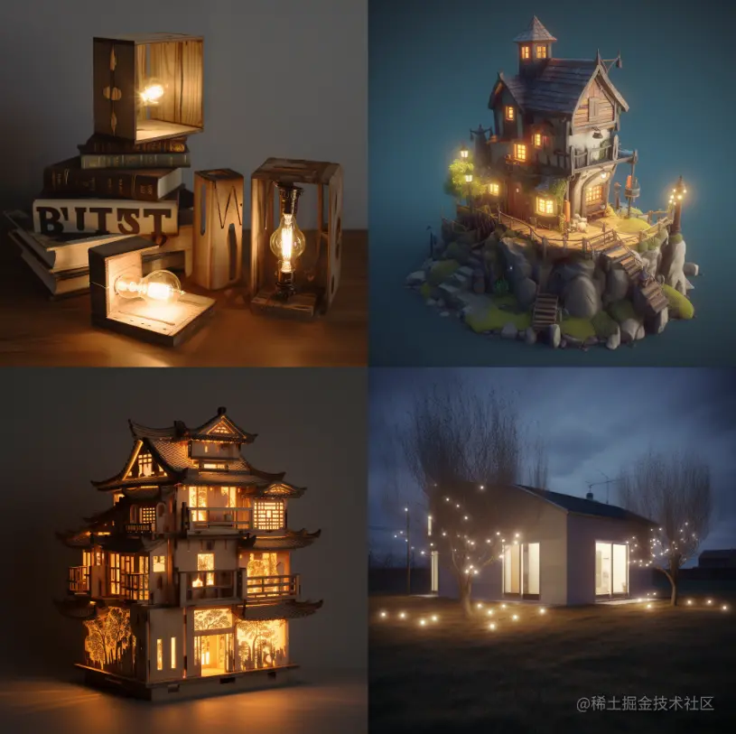

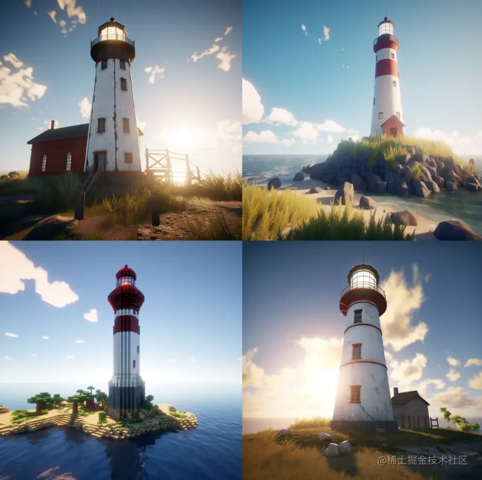

提示词的英文版：

> I'd like you to help me create Midjourney prompts. Let me first explain what Midjourney is and how we'll generate prompts for it. We'll also go through 20 examples to ensure you understand.
>
> Midjourney is an AI tool that makes images from user's input, similar to DALL-E.
>
> The key part of the prompt are words or phrases that describe the image you want. More adjectives and specific descriptive nouns create unique images. On the contrary, basic nouns or adjectives make plain images. Keep in mind, Midjourney doesn't understand grammar. So, very long prompts may not work well. When creating prompts, remove any unnecessary words. Fewer words give each word more importance, ensuring the image aligns with your theme.
>
> For instance, "illustrate for me a beautiful sunset over a serene ocean, make the colors warm and soothing, and render it in an impressionistic style." This prompt has words that Midjourney might not understand or work with. Phrases like "Illustrate for me" are unnecessary. Verbs like "make" and "render" are also redundant. Midjourney usually accepts descriptive words like nouns and adjectives. The prompt could be simpler: "warm soothing sunset over serene ocean, impressionistic oil paint."
>
> More specific synonyms often work better than general ones. For example, use precise words like "petite", "compact", "diminutive" and "tiny" instead of "small". When creating your prompt, focus on specific details you want:
>
> - **Theme:** People, animals, places, character, objects, events, etc.
> - **Use Case:** Logos, web design, interior design, prototypes, product design, etc.
> - **Medium:** Photos, drawings, illustrations, paintings, cartoons, watercolors, collages, sculptures, graffiti, mosaics, tapestries, pottery, etc.
> - **Environment:** Indoor, outdoor, city, forest, island, desert, underwater, cave, future city, space, moon, space station, etc.
> - **Lighting:** Soft, twilight, ambient, direct sunlight, overcast, moonlight, neon, candlelight, firelight, etc.
> - **Color:** Vibrant, muted, bright, monochromatic, colorful, black and white, pastel, etc.
> - **Mood:** Energetic, sedate, calm, raucous, restless, melancholy, dreamy, mysterious, etc.
> - **Composition:** Portrait, close-up, headshot, bird's eye view, symmetrical, leading lines, minimalist, silhouette, panorama, etc.
> - **Artists:** Van Gogh, Picasso, Dali, Paul Cézanne, Leonardo da Vinci, Botticelli, Rembrandt, Hayao Miyazaki, etc.
> - **Art styles:** Oriental landscape painting, Ukiyo-e, conceptual art, Bauhaus, Impressionism, Rococo, Surrealism, long exposure, etc.
>
> You can also use a comma, plus sign, or "and" to separate different subjects. For instance, to depict a light and a house, you should separate them. Otherwise, if you type "light house," Midjourney will show you a lighthouse.
>
> Midjourney prompts can also include parameters to change how an image generates. Common parameters include:
>
> 1. **--ar** This parameter sets the screen's aspect ratio. Default is 1:1; `--ar 16:9` for computer screens and `--ar 9:16` for cell phone screens.
> 2. **--v** This parameter specifies the Midjourney version. `--v 5.2` represents version 5.2.
> 3. **--s** This parameter controls the artistic level of the image, with values from 0 to 1000. A higher value indicates a more artistic image, but the image will also deviate more from the actual effect described by the prompt. Lower values indicate that the effect of the image is closer to the description of the prompt, but less artistic. The suggested setting is `--s 750`.
> 4. **--style** This parameter `--style raw` is used for photographic images.
> 5. **--q** This parameter defines the image detail. More detail is created with larger values. Default value is `--q 1`. Recommended setting is `--q 2`.
>
> With this knowledge, we'll now explore 20 examples of prompts:
>
> 1. white cow inside pink flowers in style of national geographic photography
> 2. Giraffee, tropical, Paul Klee style, surreal masterpiece, octane rendering, focus, colorful background, detailed, intricate details, rich colors
> 3. a girl with long dark hair wearing a black hat, in the style of childlike innocence and charm, detailed facial features, enchanting, 32k uhd, rococo whimsy, ferrania p30, cartoon realism
> 4. she is posing in black and gold, in the style of eye-catching resin jewelry, urban decay, rim light, iconic, exotic, bold, cartoonish lines, meticulous design
> 5. Smiling sunflower, Paul Klee style, surreal masterpiece, artistic, focus, colorful background, detailed, intricate details, rich colors
> 6. falkor by Atey Ghailan and John Singer Sargent, Neverending Story
> 7. SSSniperwolf Nelliel Tu Odelschwanck from Bleach cosplay for women with cosplay sleeve, in the style of light emerald and light cyan, appropriation artist, anime influenced, exaggerated expressions, made of vines, heistcore, bombacore
> 8. a gold fish with human swimming in a bathtub filled with clouds, in the style of dusseldorf school of photography, 1970s, balloon
> 9. cinematic medieval interior photography in the style of Akos Major, Fine art
> 10. Young woman, long red hair, glasses, looking in camera with a small beautiful smile, red dress, futuristic background
> 11. 3D cartoon art, painting, Cats on the roof, masterpiece, octane rendering, focus, colorful background, detailed, intricate details, rich colors
> 12. abstract futuristic dystopian Japanese fashion craze, vibrant abstract surreal photography by Ed Emshwiller and Masamune Shirow and Beeple
> 13. A cyberpunk-inspired full-length illustration featuring a futuristic tight-fitting suit. The suit wraps the wearer's body with a snug fit, exuding an air of sleekness and functionality. Embedded within the suit's fabric are numerous tactile sensors, meticulously integrated to provide enhanced tactile feedback and data analysis. A holographic layer is projected onto the suit's surface, producing shifting patterns and colors that mesmerize the viewer. Set against a black background, the suit stands out, evoking a sense of mystery and futuristic elegance. Illustration, digital art, brings this vision to life with meticulous attention to detail
> 14. oldtimer car in front of a vintage sunset, vintage tshirt design vector graphics, detail design contour, turqoise, pink, neon colors, white background
> 15. Sunset over the sea, dramatic clouds, masterpiece, octane rendering, focus, realistic photography, colorful background, detailed, intricate details, rich colors, realistic style
> 16. a large room with a center island and wooden flooring, in the style of dark bronze and dark beige, dark gray and dark black, rustic scenes, avocadopunk, cabincore, multiple styles, dark white and gray
> 17. knight of thorns woman in a spotlight, gradient, vector, fiberoptic, Hokusai, Banner Saga, glossy, cel shaded
> 18. traditional slavic folkloric monster, baba yaga, wurdulac, upyr in the style of alberto seveso
> 19. a teenage girl in black fur wears purple lipstick, in the style of monochromatic color schemes, dark brown and dark black, urban decay, bold yet graceful, emila medková, eye-catching, double tone effect
> 20. a girl with colorful eye makeup and a star shaped haircut, in the style of acidwave, dark brown and dark azure, sumi-e inspired, superheroes, babycore, bec winnel
>
> You've learned how to use Midjourney prompt words by examples. Now, let them inspire you. I'll share brief image ideas. Your task? Turn them into full, clear, creative prompt words. From now on, I'll just give you my ideas. You'll then provide two Midjourney prompts for each. Make sure you have added all the available parameters. Does this make sense?

把提示词提交给 ChatGPT 以后，ChatGPT 表示它理解了。然后我给它一个图片的 Idea—火箭驱动的小象。它给我了两个 Prompt，我选择了第二个然后提交给 Midjourney。这里的参数你也可以自定义。

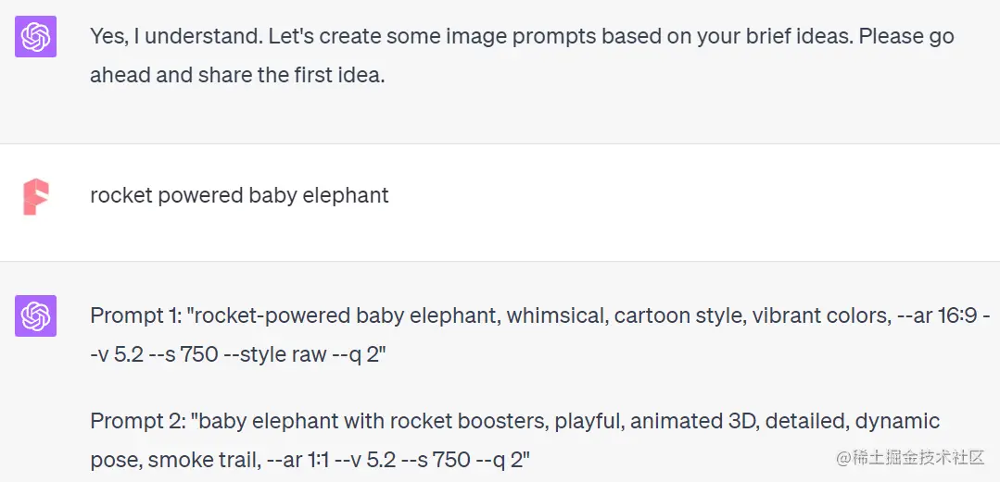

Midjourney 生成了四个图片供你选择。

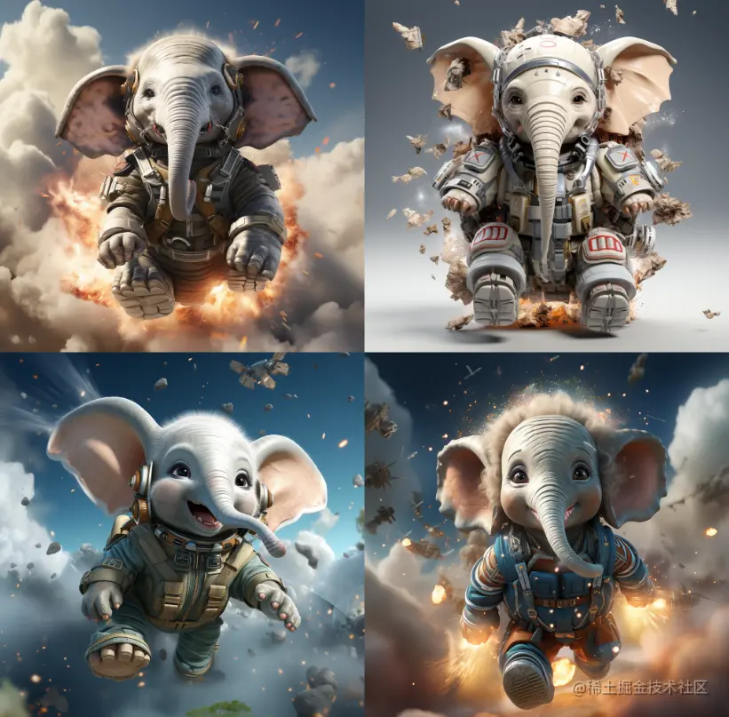

再来看一个例子：中国古代女战士肖像。

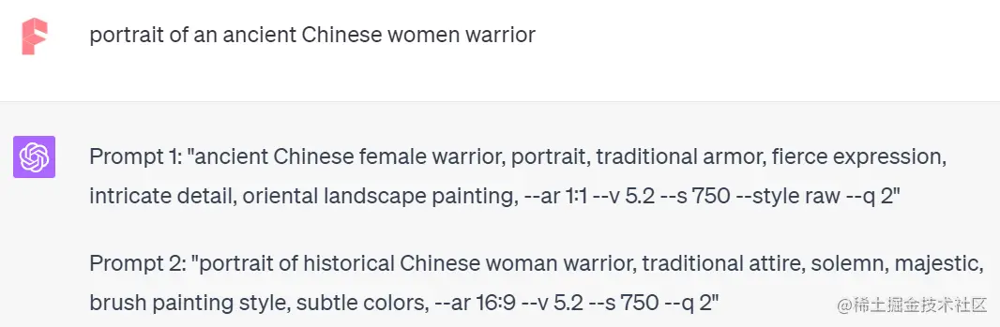

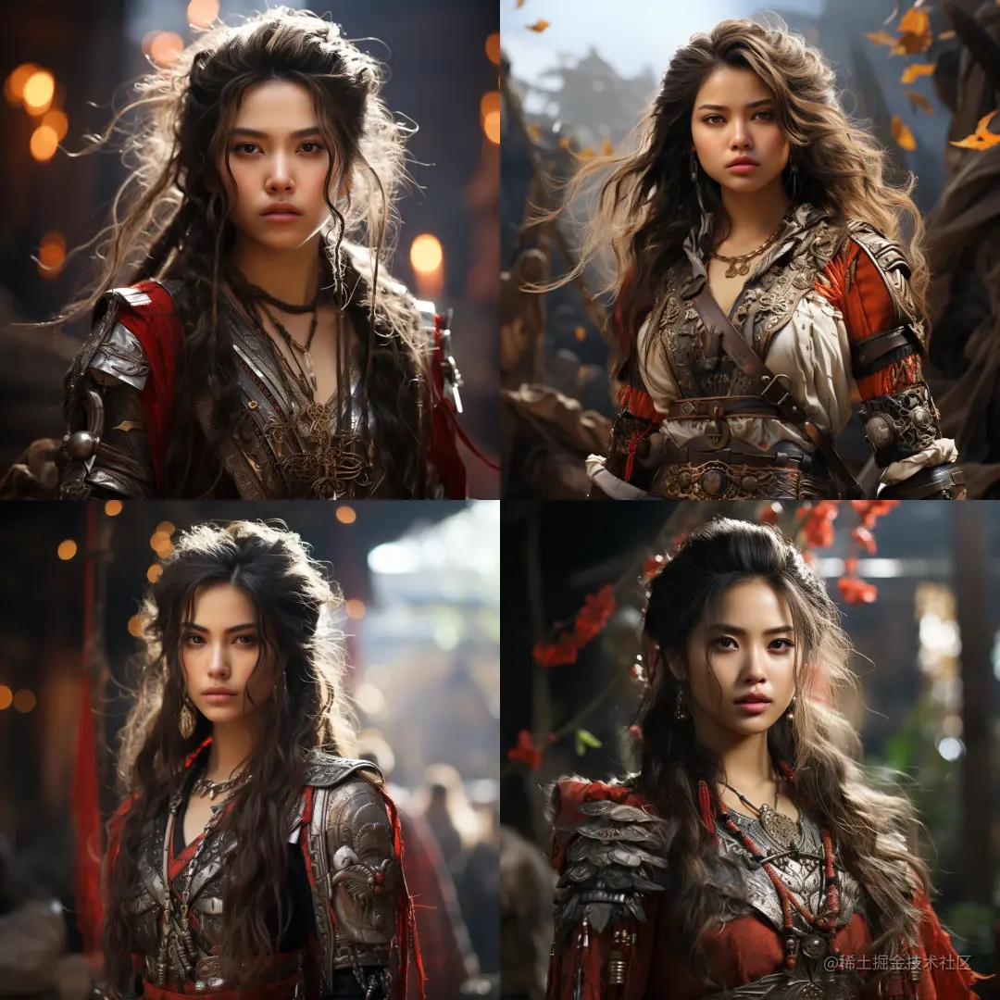

我们可以再挖掘下 ChatGPT 的潜力，让它帮我们先把简短的图片的 Idea 先变得丰满起来，然后再转化为 Midjourney 的提示词。我先写一个这样的 Prompt:

> 作为一个艺术家，你在构思方面有非凡的天赋。我的脑海中有这样一幅生动的画面：一只波斯猫在大舞台上热情地唱着摇滚乐，同时熟练地弹奏着电吉他。然而，这个形象缺乏具体的细节。我恳请你协助生成这个图像的 10 个详细描述。你可以参考以下细节：
>
> - 媒介：照片、图画、插图、绘画、漫画、水彩画、拼贴画、雕塑、涂鸦、马赛克、挂毯、陶器等。
> - 环境：室内、室外、城市、森林、岛屿、沙漠、水下、洞穴、未来城市、太空、月亮、空间站等。
> - 灯光：柔和、黄昏、环境、阳光直射、阴天、月光、霓虹灯、烛光、火光，等等。
> - 颜色：鲜艳的，柔和的，明亮的，单色的，多彩的，黑白的，粉色的，等等。
> - 情绪：精力充沛、沉稳、平静、喧闹、不安、忧郁、梦幻、神秘等。
> - 构图：肖像，特写，头像，鸟瞰，对称，引导线，简约，剪影，全景等。
> - 艺术家：梵高，毕加索，达利，保罗-塞尚，达芬奇，波提切利，伦勃朗，宫崎骏等。
> - 艺术风格：东方风景画、浮世绘、概念艺术、包豪斯、印象派、洛可可、超现实主义、长曝光等。

ChatGPT 生成的 10 个画面描述。

> 媒介：丙烯画 环境：霓虹灯下的地下摇滚酒吧 照明：紫色和蓝色色调的强烈聚光灯 颜色：鲜艳 心情：活力充沛 构图：中镜头 艺术家/艺术风格：班克斯/涂鸦艺术
>
> 这幅丙烯酸画的灵感来自班克斯，展现了一只涂鸦风格的、精力充沛的波斯猫正在进行吉他独奏。聚光灯打在她的跳跃中，在霓虹灯下的地下摇滚酒吧的粗糙砖墙上投下鲜艳的蓝色和紫色阴影。
>
> 媒介：水彩 环境：森林空地上的一个盛大的户外舞台 照明：暮色 颜色：柔和 心情：梦幻般的 构图：景观 艺术家/艺术风格：克劳德-莫奈/印象派
>
> 在莫奈的印象派风格中，一幅水彩画捕捉了一个梦幻般的黄昏场景。在一个依偎在森林空地的户外舞台上，一只波斯猫弹奏着电吉他，她热情的歌声与黄昏的粉色色调产生共鸣。
>
> 媒介：数字插图 环境：一个未来的城市 照明：霓虹灯 颜色：明亮 心情：躁动不安 构图：鸟瞰 艺术家/艺术风格：宫崎骏/动漫
>
> 一幅宫崎骏动漫风格的数字插画描绘了一只不安分的波斯猫在一个明亮的、霓虹灯下的未来城市的悬浮舞台上。鸟瞰视角捕捉到众多发光的屏幕，展示她的摇滚表演。
>
> 媒介：涂鸦 环境：繁华都市中的一栋砖头建筑的侧面 照明：环境：城市环境的光亮 颜色：五颜六色 心情：喧闹的 构图：大规模，人像 艺术家/艺术风格：凯斯-哈林/波普艺术
>
> 在凯斯-哈林的波普艺术风格中，城市建筑上的彩色涂鸦壁画捕捉到了一只波斯猫摇滚的喧闹能量。环境中的城市光芒增强了肖像的鲜艳色彩和大胆线条。
>
> 媒介：炭笔画 环境：一个安静的月光海滩 照明：月光 颜色：黑色和白色 心情：平静的 构图：特写 艺术家/艺术风格：伦勃朗/巴洛克
>
> 让人联想到伦勃朗的巴洛克风格，一幅黑白炭笔画描绘了一只波斯猫的特写，它在宁静的月光下，在一个安静的海滩上轻轻地唱着摇滚歌谣。
>
> 媒介：马赛克 环境：一个古罗马的圆形剧场 照明：阳光直射 颜色：鲜艳的 心情：精力充沛 构图：丰满的人物肖像 艺术家/艺术风格：古罗马艺术家/罗马艺术
>
> 一幅具有古罗马艺术风格的充满活力的马赛克作品，描绘了一只波斯猫在阳光下的罗马圆形剧场里进行吉他独奏的情景。在拱形石墙的背景下，这幅全形肖像画捕捉到了猫的感染力。
>
> 媒介：油画 环境：一个有熊熊燃烧的壁炉的乡村酒馆 照明：火光 颜色：温暖的色调 心情：平静 构图：完整的镜头 艺术家/艺术风格：文森特-凡高/后印象主义
>
> 在梵高的后印象主义风格中，一幅油画捕捉到一只波斯猫在乡村小酒馆里的平静表现，只有火光的温暖照耀。画家的笔触与电吉他柔和的旋律相呼应。
>
> 媒介：水墨画 环境：宁静的竹林 照明：柔和、自然的光线 颜色：单色的 心情：宁静的 构图：景观与一个中心人物 艺术家/艺术风格：北斋/浮世绘
>
> 一幅受北斋启发的水墨画捕捉了一只宁静的波斯猫，在一片宁静的竹林中优雅地弹着吉他。浮世绘风格给这个单色场景带来了传统的宁静气息。
>
> 媒介：雕塑 环境：一个华丽的洛可可房间 照明：周围的烛光 颜色：白色大理石 心情：神秘的 构成：三维的人物 艺术家/艺术风格：米开朗基罗/文艺复兴
>
> 由米开朗基罗式的艺术家创作的文艺复兴时期的大理石雕塑，描绘了一只神秘的波斯猫，她的特征在一个华丽的洛可可房间中被捕捉到。房间里的烛光在白色大理石上形成了柔和的阴影。
>
> 媒介：拼贴画 环境：俯瞰地球的空间站 照明：周围的空间光线 颜色：鲜艳 心情：未来主义 构图：人像对着一个圆形的窗户 艺术家/艺术风格：彼得-布莱克/波普艺术
>
> 一幅受彼得-布莱克启发的拼贴画描绘了一只波斯猫在空间站的圆形窗口背景下弹奏电吉他。地球在远处闪闪发光，为这幅作品的冷静、未来主义情绪提供了一个充满活力的对比。

然后把生成的第一个和第四个图像描述交给训练好的 Midjourney 生成器转化为 Midjourney 提示词，就生成了两幅波斯猫的图像。

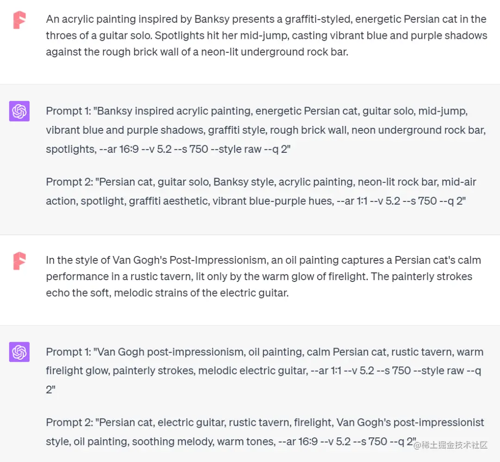

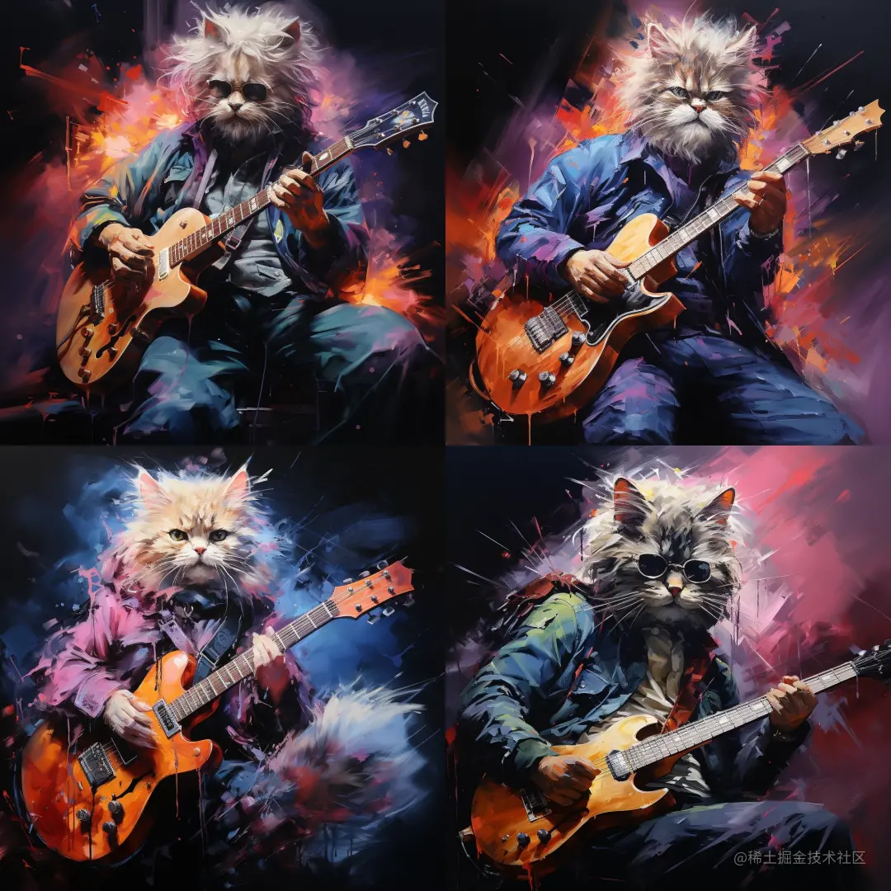

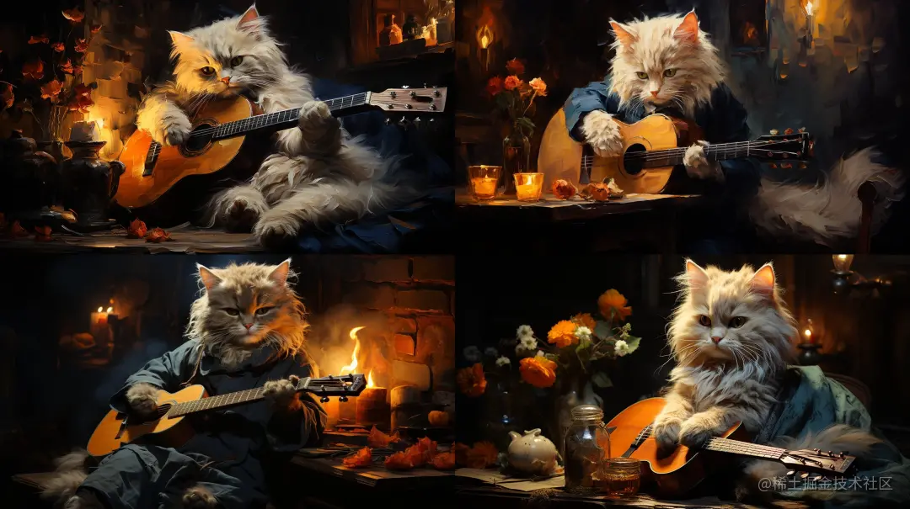

第二幅图像尽管看上去还不错，但是并没有按照我的要求生成波斯猫弹电吉他的照片，它手里拿的是木吉他。可能是因为提示词里乡村酒馆、火光、舒缓的旋律、温暖的色调让 Midjourney 决定使用木吉他更符合图片的整体氛围。

其实 ChatGPT 给我们完善的图片的构思有很多地方并不搭调，需要我们从中挑选出合情合理的构思，或者略加修改以符合我们的要求。但不管怎么说，ChatGPT 节省了我们很多时间，也带给我们很多灵感。

## 总结

总之，ChatGPT 和 Midjourney 结合起来，打开了图像创作新世界的大门。

经过训练的 ChatGPT 可以为 Midjourney 产生不同的 Prompt。这个过程激发了创造力，往往会产生意想不到的乐趣。

Photorealistic 插件为 Plus 用户提供了一个快速的解决方案，但对其他人来说，训练 ChatGPT 也是一个很好的解决方法。这种自然语言和视觉的融合让我们步入一个人工智能辅助创造的新时代。
