# Stable Diffusion部署

亚马逊云免费领一年主机部署Stable Diffusion：<https://mic.arcdmi.com/url/09>

## Stable Diffusion 电脑配置推荐

[SD推荐电脑配置 (qq.com)](https://docs.qq.com/sheet/DRU9ydUR3TmNWeWdE?tab=BB08J2)

- *▢* 基础配置 / 5500元
- *▢* 进阶配置 / 9000元
- *▢* 性价比配置 / 10000元
- *▢* 高级配置 / 14000元

电脑配置需求

操作系统：windows10以后

CPU：不做强制性要求

内存：推荐8G以上

显卡：必须是Nvidia的独立显卡，显存最低4G，推荐20系以后

A卡核显只能用CPU跑整合包，推荐放在固态硬盘中，提升模型加载速度

**所需配置**：

推荐配置：拥有Nvidia独立显卡、RTX20系以后的显卡。仅生成图片推荐8G显存（4G是最低保障配置）训练推荐大于12G（越大越好）

内存推荐16G及以上。

硬盘推荐使用固态硬盘500G以上，否则你开软件要等个5-10分钟。

CPU不做太多要求。

A卡能不能用？能，但是性能损耗很大。可以在Linux系统上获得最佳效果，但是由于我本人没有A卡，所以我也不会做相关的教程

## 本地运行部署项目：以【秋葉aaaki】的整合包为例

参考：[手把手教你本地部署Stable Diffusion AI绘画 - 掘金 (juejin.cn)](https://juejin.cn/post/7239279470250885175)

教程：<https://www.bilibili.com/video/BV1fa4y1G71W/>

上面链接下载完后，共有三类文件：

- `sd-webui-aki-v4.2.rar` 压缩包：主程序启动包
- `可选controlnet1.1`文件夹：模型和预处理器
- `启动器运行依赖-dotnet-6.0.11.exe` ：需要先双击这个，安装整合包需要的依赖

1.把`sd-webui-aki-v4.2.rar`压缩包解压

2.然后把 `可选controlnet1.1` 文件夹的 `模型` 文件夹内的模型文件复制到 文件夹：`sd-webui-aki\sd-webui-aki-v4.2\models\ControlNet`

3.再把 `可选controlnet1.1` 文件夹的 `预处理器` 文件夹内的 `downloads` 文件夹复制到 文件夹：`sd-webui-aki\sd-webui-aki-v4.2\extensions\sd-webui-controlnet\annotator`内覆盖

4.启动：双击`sd-webui-aki\sd-webui-aki-v4.2` 内的 `A启动器.exe` 文件启动软件

5.一键启动：点击界面的【一键启动】，会启动一个浏览器实例，便可以开始绘图了

### 绘制第一张图

#### 1.提示词

正向提示词

```text
masterpiece,best quality,
```

反向提示词

```bash
lowres,bad anatomy,bad hands,text,error,missing fingers,extra digit,fewer digits,cropped,worst quality,low quality,normal quality,jpeg artifacts,signature,watermark,username,blurry
```

正向反向提示词，如果要加大提示词比重，(word:1.5) - 将权重提高 1.5 倍

#### 2.采样和迭代步数

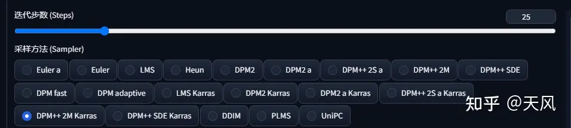

- **Sampler（采样器/采样方法）**

  - Euler a（Eular ancestral）可以以较少的步数产生很大的多样性，不同的步数可能有不同的结果。

  - DPM 相关的采样器通常具有不错的效果，但耗时也会相应增加。

  - Euler 是最简单、最快的

  - Euler a 更多样，不同步数可以生产出不同的图片。但是太高步数 (>30) 效果不会更好。

  - DDIM 收敛快，但效率相对较低，因为需要很多 step 才能获得好的结果，适合在重绘时候使用。

  - LMS 是 Euler 的衍生，它们使用一种相关但稍有不同的方法（平均过去的几个步骤以提高准确性）。大概 30 step 可以得到稳定结果

  - PLMS 是 Euler 的衍生，可以更好地处理神经网络结构中的奇异性。

  - DPM2 是一种神奇的方法，它旨在改进 DDIM，减少步骤以获得良好的结果。它需要每一步运行两次去噪，它的速度大约是 DDIM 的两倍，生图效果也非常好。但是如果你在进行调试提示词的实验，这个采样器可能会有点慢了。

  - UniPC 效果较好且速度非常快，对平面、卡通的表现较好，推荐使用。

  - 推荐 Euler a ，DPM2++2M Karras，DPM2++SDE Karras

- **迭代步数**
  - Stable Diffusion 的工作方式是从以随机高斯噪声起步，向符合提示的图像一步步降噪接近。随着步数增多，可以得到对目标更小、更精确的图像。但增加步数也会增加生成图像所需的时间。增加步数的边际收益递减，取决于采样器。一般开到 20~30。

#### 3.修复和图片相关设置

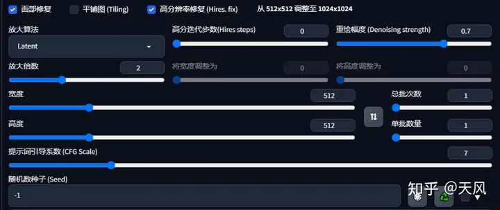

- **高清修复** 默认情况下，文生图在高分辨率下会生成非常混沌的图像。如果使用高清修复，会型首先按照指定的尺寸生成一张图片，然后通过放大算法将图片分辨率扩大，以实现高清大图效果。最终尺寸为（原分辨率*缩放系数 Upscale by)。
- **面部修复** 修复画面中人物的面部，但是非写实风格的人物开启面部修复可能导致面部崩坏。
- **放大算法中**，Latent 在许多情况下效果不错，但重绘幅度小于 0.5 后就不甚理想。ESRGAN_4x、SwinR 4x 对 0.5 以下的重绘幅度有较好支持。
- **Hires step** 表示在进行这一步时计算的步数。
- **Denoising strength** 字面翻译是降噪强度，表现为最后生成图片对原始输入图像内容的变化程度。该值越高，放大后图像就比放大前图像差别越大。低 denoising 意味着修正原图，高 denoising 就和原图就没有大的相关性了。一般来讲阈值是 0.7 左右，超过 0.7 和原图基本上无关，0.3 以下就是稍微改一些。实际执行中，具体的执行步骤为 Denoising strength * Sampling Steps。
- **CFG Scale（提示词相关性）** 图像与你的提示的匹配程度。增加这个值将导致图像更接近你的提示，但它也在一定程度上降低了图像质量。 可以用更多的采样步骤来抵消。过高的 CFG Scale 体现为粗犷的线条和过锐化的图像。一般开到 7~11。 CFG Scale 与采样器之间的关系：
- **生成批次** 每次生成图像的组数。一次运行生成图像的数量为“批次* 批次数量”。
- **每批数量** 同时生成多少个图像。增加这个值可以提高性能，但也需要更多的显存。大的 Batch Size 需要消耗巨量**显存**。若没有超过 12G 的显存，请保持为 1。
- **尺寸** 指定图像的长宽。出图尺寸太宽时，图中可能会出现多个主体。1024 之上的尺寸可能会出现不理想的结果，推荐使用小尺寸分辨率+高清修复（Hires fix)。
- **种子** 种子决定模型在生成图片时涉及的所有随机性，它初始化了 Diffusion 算法起点的初始值。 理论上，在应用完全相同参数（如 Step、CFG、Seed、prompts）的情况下，生产的图片应当完全相同。

**后续**：[stable diffusion 小白最全详细使用教程 - 知乎 (zhihu.com)](https://zhuanlan.zhihu.com/p/629493288)

### 街头少女

描述主题如下：一个女孩在街头大笑，湿透的，辫子，写实风格的，电影级别的，HDR的。

- Lora：无
- Embeddings:ng_deepnegative_v1_75t [1a3e]

#### Prompt

> a young woman, street, laughing, ponytails, (hdr:1.3), (muted colors:1.2), dramatic, complex background, cinematic, filmic, (rutkowski, artstation:0.8), soaking wet,

#### Negative Prompt

> (nsfw:2),Multiple people,easynegative,(worst quality:2),(low quality:2),lowres,(monochrome:1.4),(grayscale:1.4),big head,severed legs,short legs,missing legs,acnes,skin blemishes,age spot,backlight,(ugly:1.4),(duplicate:1.4),(morbid:1.2),(mutilated:1.2),mutated hands,(poorly drawn hands:1.4),blurry, (bad anatomy:1.4),(bad proportions:1.4),(disfigured:1.4),(unclear eyes:1.4),bad hands, bad tooth,missing fingers,extra digit,bad body,NG_DeepNegative_V1_75T,glans,EasyNegative:0.5,gross proportions.short arm,(missing arms:1.4),missing thighs,missing calf,mutation,duplicate,morbid,mutilated,poorly drawn cloth,strange finger,bad finger,(mutated hands and fingers:1.4),(text:1.4), bad-artist, bad_prompt_version2, bad-hands-5, bad-image-v2-39000,

#### 基础配置

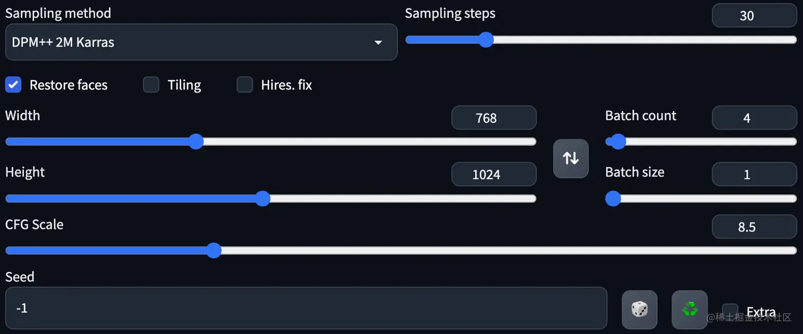

——————————————————————————————————————
[AI 绘画工具 Stable Diffusion 本地安装使用 - 掘金 (juejin.cn)](https://juejin.cn/post/7246960365736345660)

## 以AUTOMATIC1111/stable-diffusion-webui项目搭建

### 1、下载项目

`stable-diffusion-webui` 没有发布可执行程序（比如：`.exe`），我们需要通过 `git` 的方式将整个工程源码拉下来运行：

```shell
git clone https://github.com/AUTOMATIC1111/stable-diffusion-webui.git
```

> 注：这个开源项目目前的更新频率很快，会不定期的修复一些 bug 或加入一些新功能，所以建议可以时常 `git pull` 拉取最新代码。

### 2、Python 环境

`stable-diffusion-webui` 主要是使用 Python 开发的，所以运行这个工程，需要安装一下 Python 环境并配置好环境变量，因为 Python 环境的安装很简单，这里就不多说了，环境配置完成之后，可以通过以下命令查看 Python 的版本号，验证环境是否正常：

```shell
python --version
```

> 注意：官方推荐安装 `Python 3.10.6` 版本

另外，建议使用 `Anaconda` 管理多个 Python 环境，详见

- 官方的 conda 环境安装说明：[Install and Run on NVidia GPUs · AUTOMATIC1111/stable-diffusion-webui Wiki (github.com)](https://github.com/AUTOMATIC1111/stable-diffusion-webui/wiki/Install-and-Run-on-NVidia-GPUs#alternative-installation-on-windows-using-conda)
- anaconda 常用命令：[anaconda常用命令_anaconda命令_ligous的博客-CSDN博客](https://blog.csdn.net/ligous/article/details/124209700)

### 3、CUDA 环境

默认 `stable-diffusion-webui` 运行使用的是 GPU 算力，也就是说需要用到 Nvidia 显卡（配置越高，绘图越快）。这里我们需要安装 CUDA 驱动，先确定一下电脑能安装的 CUDA 版本，桌面右下角->右键 NVIDIA 设置图标->NVIDIA 控制面板：

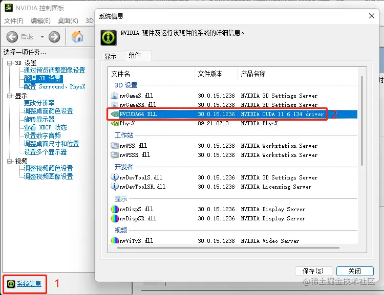

可以看到我的电脑的显示的是 `NVIDIA CUDA 11.6.134 driver`，所以我的电脑要安装的 CUDA 版本不能超过 11.6。

> 注意：高版本显卡是可以安装低版本的 CUDA 驱动的，比如我也可以安装经典的 10.2 版本，但是安装 11.6 版本可以获得更高的 GPU 运行效率，所以一般来说推荐安装显卡支持的最高 CUDA 版本。

在下面的网址中找到对应的 CUDA 版本进行安装：

- CUDA 官方归档：[developer.nvidia.com/cuda-toolkit-archive](https://developer.nvidia.com/cuda-toolkit-archive)

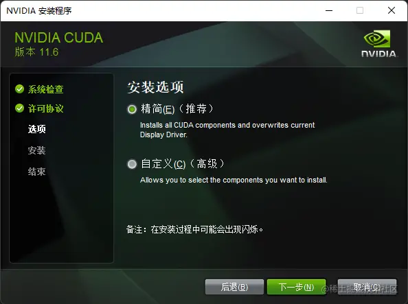

直接选择 "精简" 安装就可以了，安装完成之后，可以使用如下命令查看 CUDA 版本，来验证 CUDA 是否安装成功：

```shell
nvcc --version
```

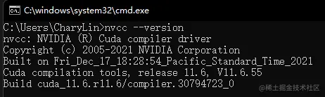

> 注：如果你没有 Nvidia 显卡，也可以通过给 `stable-diffusion-webui` 指定运行参数 `--use-cpu sd`，让其使用 CPU 算力运行，但是非常不建议你这么做，CPU 算力跟 GPU 算力相比简直天差地别，可能 GPU 只需要 10 秒就能绘制完成，而 CPU 却要 10 分钟，这不是开玩笑的。另外，如果你的显卡内存不多，建议 4G 的显卡加上 `--medvram` 启动参数，2G 的显卡加上 `--lowvram` 启动参数。怎么配置启动参数我们后面说。

### 4、启动项目

在安装配置好运行环境之后，直接运行工程下的 `webui-user.bat` 文件即可（如果是类 Unix 系统，则运行 `webui-user.sh`）。

首次启动会自动下载一些 Python 依赖库（具体哪些库请看工程下的 `requirements.txt`） ，以及项目需要用到的配置和模型文件（比如：`v1-5-pruned-emaonly.safetensors`，将近 4 个 G~），初始化一次之后，下次启动就快了。

```shell
Launching Web UI with arguments:
...
Running on local URL:  http://127.0.0.1:7860
To create a public link, set `share=True` in `launch()`.
```

看到这个提示就说明成功运行起来了，打开网址就可以看到程序的运行界面了：

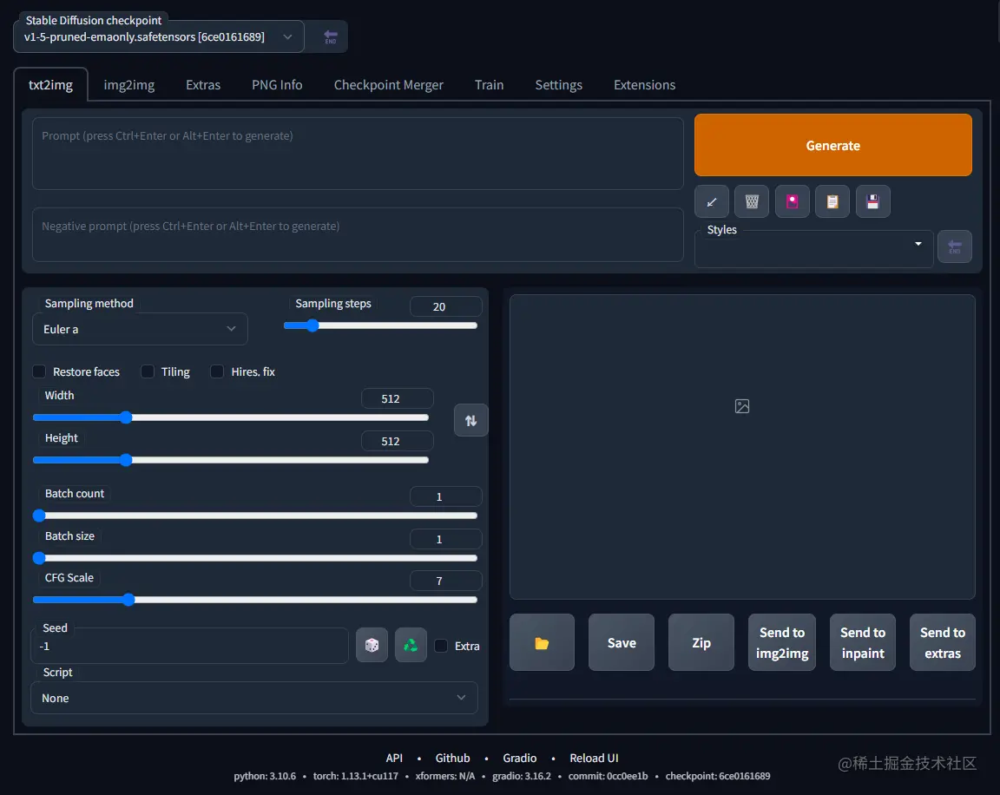

> 温馨提示：该项目是英文页面，可以使用浏览器的翻译功能转成中文来使用~

## Linux上如何使用Stable Diffusion WebUI

### 前提条件

- 已安装CUDA
- 已安装git
- 已安装Anaconda
  - 直接安装Anaconda。
  - 虽然Linux自带的Python，但是缺胳膊少腿，所以不要指望Linux自带的Python。

### 捣鼓好Stable Diffusion WebUI需要的环境

创建并激活进入虚拟环境：

```bash
conda create -n webui python=3.10.6
conda activate webui
```

成功进入虚拟环境之后就可以开搞了。

### 下载Stable Diffusion WebUI

从github上下载，终端中输入：

```bash
git clone https://github.com/AUTOMATIC1111/stable-diffusion-webui.git
```

进入文件夹：

```bash
cd stable-diffusion-webui
```

为了减少你的麻烦，请做好以下几个**铺垫步骤**：

#### pip换源

```bash
pip config set global.index-url <http://mirrors.aliyun.com/pypi/simple/>
pip config set global.trusted-host mirrors.aliyun.com
```

> **笔者提示：** 安装过程中可能会遇到奇怪的问题，**一般都是网络造成的**，很大一部分是pip源造成的。
>
> 我搭的时候弄得阿里云源，疯狂报错。搭的时候用的清华源，一下就成功了。
>
> 我又配另一个服务器，阿里云全部成功。我俩复盘了一下，就是当时网络的问题。所以阿里云源不好使，多换几个别的。

#### 修改lunch.py

找到下面这段代码，给每个github地址前边都加上：[GitHub Proxy 代理加速 (ghproxy.com)](https://ghproxy.com/)

```py
def prepare_environment():
    global skip_install

    torch_command = os.environ.get('TORCH_COMMAND', "pip install torch==1.13.1+cu117 torchvision==0.14.1+cu117 --extra-index-url https://download.pytorch.org/whl/cu117")
    requirements_file = os.environ.get('REQS_FILE', "requirements_versions.txt")
    commandline_args = os.environ.get('COMMANDLINE_ARGS', "")

    xformers_package = os.environ.get('XFORMERS_PACKAGE', 'xformers==0.0.16rc425')
    gfpgan_package = os.environ.get('GFPGAN_PACKAGE', "git+https://github.com/TencentARC/GFPGAN.git@8d2447a2d918f8eba5a4a01463fd48e45126a379")
    clip_package = os.environ.get('CLIP_PACKAGE', "git+https://github.com/openai/CLIP.git@d50d76daa670286dd6cacf3bcd80b5e4823fc8e1")
    openclip_package = os.environ.get('OPENCLIP_PACKAGE', "git+https://github.com/mlfoundations/open_clip.git@bb6e834e9c70d9c27d0dc3ecedeebeaeb1ffad6b")

    stable_diffusion_repo = os.environ.get('STABLE_DIFFUSION_REPO', "https://github.com/Stability-AI/stablediffusion.git")
    taming_transformers_repo = os.environ.get('TAMING_TRANSFORMERS_REPO', "https://github.com/CompVis/taming-transformers.git")
    k_diffusion_repo = os.environ.get('K_DIFFUSION_REPO', 'https://github.com/crowsonkb/k-diffusion.git')
    codeformer_repo = os.environ.get('CODEFORMER_REPO', 'https://github.com/sczhou/CodeFormer.git')
    blip_repo = os.environ.get('BLIP_REPO', 'https://github.com/salesforce/BLIP.git')
```

**笔者提示：** 刚才说安装过程中可能会遇到奇怪的问题，**一般都是网络造成的**，另一个原因就是从github下载东西的时候失败，所以这里直接加个代理省事。用梯子也不好使。

#### 下载默认模型

> **笔者提示：** 这一步不是必须的，webui.sh会自动运行下载的，但是我用服务器下的巨慢，所以手动下的。

下载：<https://huggingface.co/runwayml/stable-diffusion-v1-5/resolve/main/v1-5-pruned-emaonly.safetensors>，放到 `stable-diffusion-webui/models/Stable-diffusion/` 里

### 使用webui

终端输入启动webui：

```bash
bash webui.sh
```

**出现URL就是成功！** 点击链接用浏览器打开。

### 部分报错处理方法

一般都是网络问题，方法就是**找到Traceback里边的Command，重新给它换个别的国内源**，阿里云不行换清华、豆瓣等等。

1. RuntimeError

   > RuntimeError: Couldn't install torch.
   >
   > Command: "/home/Ann/stable-diffusion-webui/venv/bin/python3" -m  pip install torch==1.13.1+cu117 torchvision==0.14.1+cu117 --extra-index-url [download.pytorch.org/whl/cu117](https://download.pytorch.org/whl/cu117)
   >
   > Error code: 2

   下载源有问题，看一下你换源了么？已经换源的话不好使，那就再试一下别的源。

   把`command`后边那块复制下来，改一改：

   > pip install torch==1.13.1+cu117 torchvision==0.14.1+cu117 --trusted-host mirrors.aliyun.com  --extra-index-url [download.pytorch.org/whl/cu117](https://download.pytorch.org/whl/cu117) -i `别的源的地址`

2. Preparing metadata (setup.py) ... error

   > subprocess.CalledProcessError: Command '['/home/Ann/stable-diffusion-webui/venv/bin/python3', '-m', 'pip', '--disable-pip-version-check', 'wheel', '--no-deps', '-w', '/tmp/tmpmlg_i0y8', '--quiet', 'cython']' returned non-zero exit status 2.
   >
   > distutils.errors.DistutilsError: Command '['/home/Ann/stable-diffusion-webui/venv/bin/python3', '-m', 'pip', '--disable-pip-version-check', 'wheel', '--no-deps', '-w', '/tmp/tmpmlg_i0y8', '--quiet', 'cython']' returned non-zero exit status 2.

   还是看`Command`。报错转化出来是这个命令：

   > "/home/Ann/stable-diffusion-webui/venv/bin/python3" -m pip --disable-pip-version-check wheel --no-deps -w /tmp/tmpmlg_i0y8 --quiet cython

   表示在使用 pip 安装 cython 时，生成了一个 Wheel 文件。

   - 其中 **/home/liuyx169/stable-diffusion-webui/venv/bin/python3** 表示使用指定的 Python 解释器来执行 pip 命令。
   - **-m pip** 表示使用 pip 模块来执行命令。
   - **--disable-pip-version-check** 表示禁用 pip 版本检查
   - **wheel** 表示使用 Wheel 格式打包安装包
   - **--no-deps** 表示不安装依赖包
   - **-w /tmp/tmpmlg_i0y8** 表示将生成的 Wheel 文件放置在指定的目录下
   - **--quiet** 表示以安静模式运行，不输出详细信息
   - **cython** 表示要安装的 Python 包的名称。

   归根结底还是在安装cythom这个包的时候没装上，还是网的问题。

   如果你确定换源了，那解决方法还是再换个源手动装一下：

   > pip install cython  -i **别的源的地址** --disable-pip-version-check wheel --no-deps

3. pip._vendor.urllib3.exceptions.ReadTimeoutError: HTTPSConnectionPool(host='files.pythonhosted.org', port=443): Read timed out.

   还是源的问题。找到Traceback里边的Command再换个源。

4. The TLS connection was non-properly terminated.

   > fatal: unable to access '[github.com/TencentARC](https://github.com/TencentARC/GFPGAN.git/)': gnutls_handshake() failed: The TLS connection was non-properly terminated. error: subprocess-exited-with-error

   出现这个问题，回去看一下你的launch.py改对了么？确定给launch.py所有的github地址前边都加上[ghproxy.com/](https://ghproxy.com/) 即可。

## 全端搭建教程

[使用 ChatGPT、Stable Diffusion、React 和 NodeJS 🤯 构建一个网站LOGO - 掘金 (juejin.cn)](https://juejin.cn/post/7214288126222204988)

## 在 Mac OS 上安装 Stable Diffusion

[使用Mochi Diffusion在Apple芯片Mac上使用Stable Diffusion - 掘金 (juejin.cn)](https://juejin.cn/post/7241884241616339002)

### 实操环境

macOS 13 Arm64（建议12以上的系统使用）

Apple M1

### 一、安装 Home Brew


在开始我们需要安装下 [Home Brew](https://brew.sh/), 可以直接复制下面代码到终端并执行

下面是Homebrew官方给出的安装命令：（如果没有VPN，不要使用此命令安装！）

```bash
/bin/bash -c "$(curl -fsSL https://raw.githubusercontent.com/Homebrew/install/HEAD/install.sh)"
```

通常情况下，官网给出的指令会报错：

```Plain
curl: (7) Failed to connect to raw.githubusercontent.com port 443: Connection refused
```

因为这是国外网站，由于GFW（中国长城防火墙）的存在，如果没有vpn，是无法访问的，所以连接被拒绝！

以下为国内安装Homebrew的正确姿势：(基于gitee上某大神的自动安装脚本)

```bash
/bin/zsh -c "$(curl -fsSL https://gitee.com/cunkai/HomebrewCN/raw/master/Homebrew.sh)"
```

————————————————————————————————————————

回车执行指令后，根据提示操作。具体包括以下提示操作：

#### 1.选择下载镜像

根据需要选择下载源，例如，我这里选择中科大下载源，就输入‘1’，回车。

#### 2.确认删除旧版本

如果存在旧版本，会弹出删除旧版本提示，输入"Y"，回车。

#### 3.输入开机密码（用于mac确认第三方应用安装）

#### 4.回车跳过即可

#### 5.安装成功配置以后的镜像源选择

#### 6.重启终端或者运行source /Users/xixi/.zprofile  让brew生效

### 二、安装其他所需依赖

下面我们需要使用 `brew` 安装一些所需要的依赖包: `make` `protobuf` `rust` `python@3.10` `git` `wget`, 可以直接复制下面代码到终端并执行

```sh
brew install cmake protobuf rust python@3.10 git wget
```

### 三、拉取 Stable Diffusion Web UI 存储库

这里我们需要拉取下 `Stable Diffusion` 的一个 [WEB UI](https://github.com/AUTOMATIC1111/stable-diffusion-webui) 仓库代码

```sh
git clone https://github.com/AUTOMATIC1111/stable-diffusion-webui
```

### 四、下载模型

#### 软件安装

网盘下载：我用夸克网盘分享了「AITools(爱兔)」，点击链接即可保存。打开「夸克APP」

链接：<https://pan.quark.cn/s/7d93e96740e5>

或者在这里我们需要提前下载好一个基本的 [模型](https://huggingface.co/CompVis/stable-diffusion-v-1-4-original), 点击 [这里](https://huggingface.co/CompVis/stable-diffusion-v-1-4-original) 进入下载页

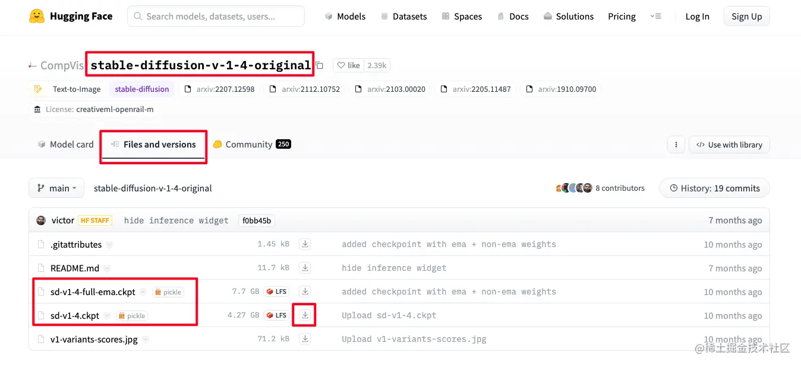

下载好模型后, 需要将模型文件放到 `stable-diffusion-webui/models/Stable-diffusion` 目录下

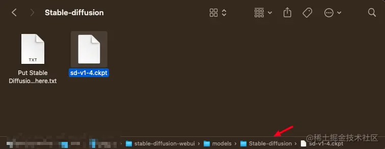

### 五、启动项目

进入项目, 执行 `webui.sh` 脚本

```sh
cd stable-diffusion-webui
./webui.sh
```

等待: 这一步会比较久, 需要耐心等待……

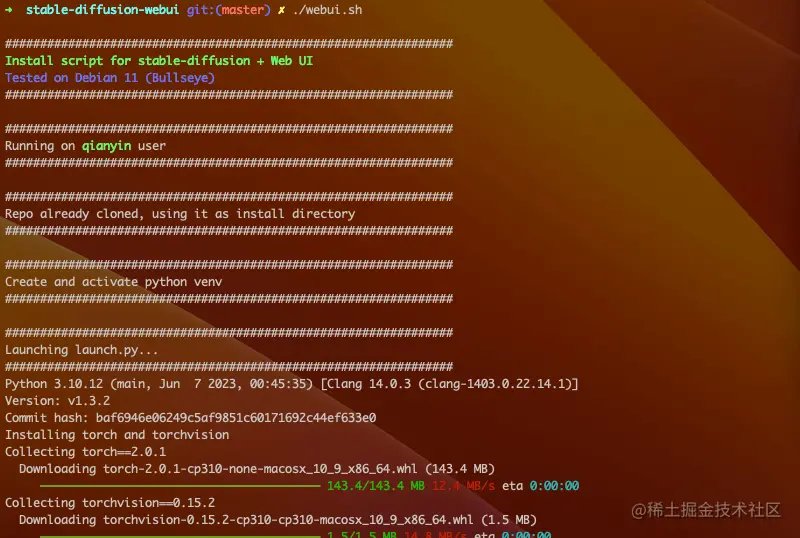

如果执行上面命令, 抛出错误了则需要修改项目根目录下的 `webui-user.sh` 文件: 该文件默认 `第十三行` 是被注释掉的, 我们需要修改这一行内容

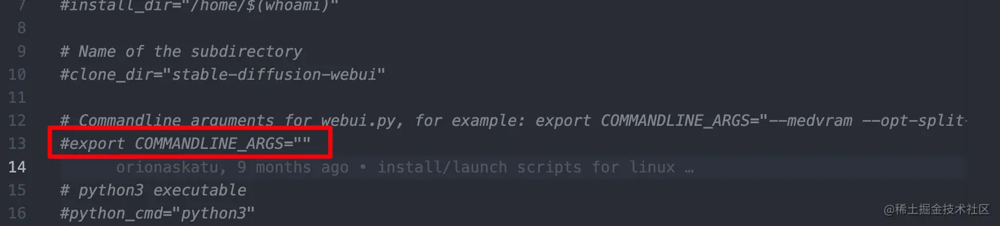

修改内容如下:

```diff
# 第13行
+ export COMMANDLINE_ARGS="--medvram --opt-split-attention --skip-torch-cuda-test --no-half --use-cpu all"
```

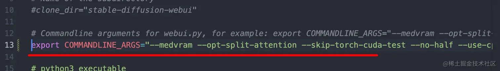

最后重新运行 `webui.sh` 脚本:

```sh
./webui.sh
```

等待片刻, 这里如果成功运行的话, 最后会给出一个 `WEB UI` 界面的 `访问地址`

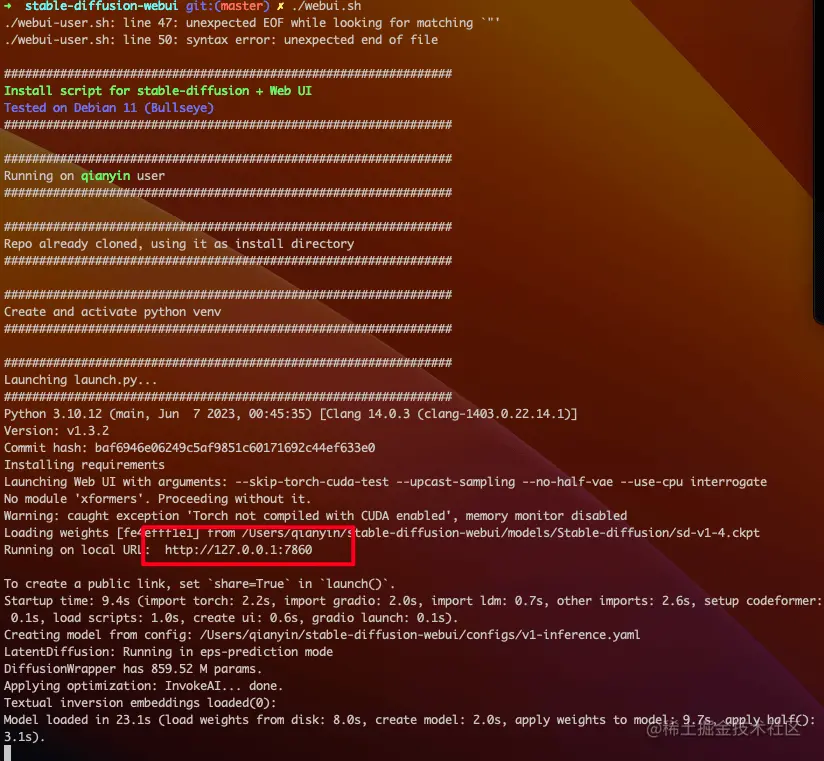

下面我们就可以通过上面的地址, 在浏览器访问 `Stable Diffusion` `WEB UI` 界面

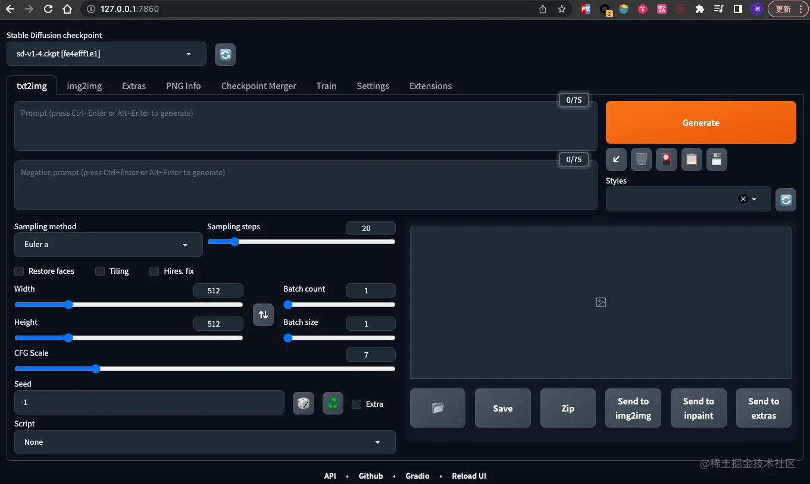

### 六、测试

下面我们尝试在界面上输入 `咒语` 生成图片, 如下截图在输入框中输入关键词 `home`, 然后点击 `Generate` 开始绘画

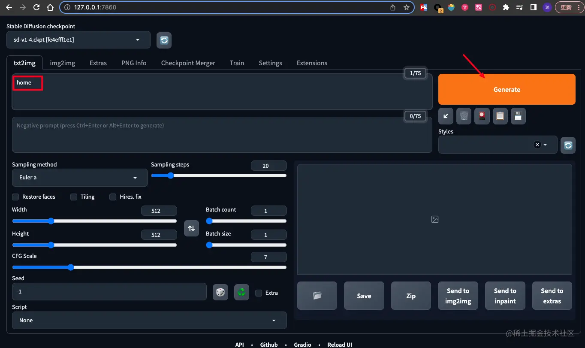

这里我们可以观察控制台, 就能够看到, 如下进度条, 这就说明系统正在生成图片

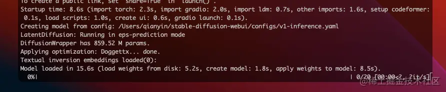

这里需要等待一会(机器配置好坏决定等待时长), 最终会在右边生成一张图(当然图片的质量肯定是一般般的, 因为我们的咒语还是太简单了)

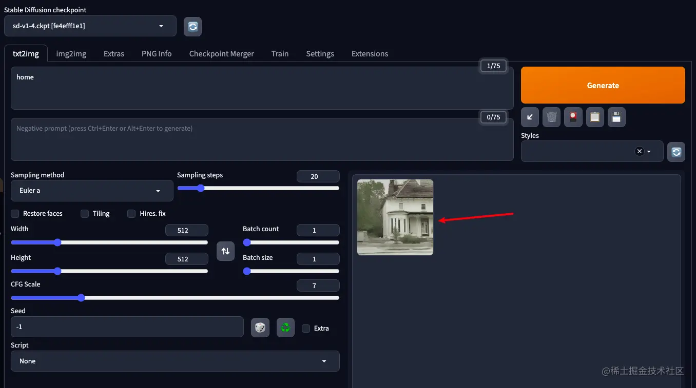

这里我们还可以看下, 终端进度条, 也以显示 `100%`

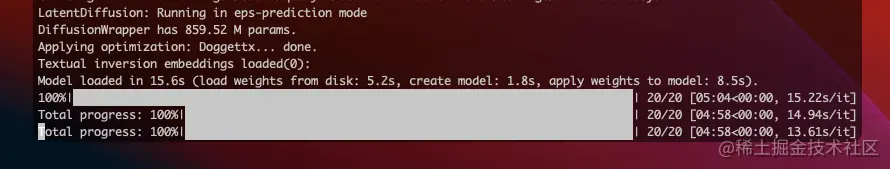

> 最后补充下: 如果出现如下报错, 请参考上一章节, 通过修改项目根目录下的 `webui-user.sh` 文件, 可修改该问题

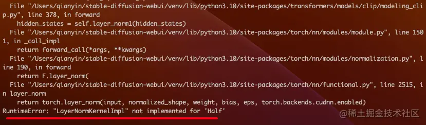

### 七、汉化

由于 `stable diffusion webui` 项目都英文的, 但是呢里面又涉及到很多设置与参数, 为了方便设置参数, 这里还是很有必要针对 `stable diffusion webui` 进行一个汉化

#### 7.1 安装汉化包

汉化包我们选择 [stable-diffusion-webui-chinese](https://github.com/VinsonLaro/stable-diffusion-webui-chinese), 在项目文档中介绍了两种安装方式, 这里我们选择第一种方式进行安装:

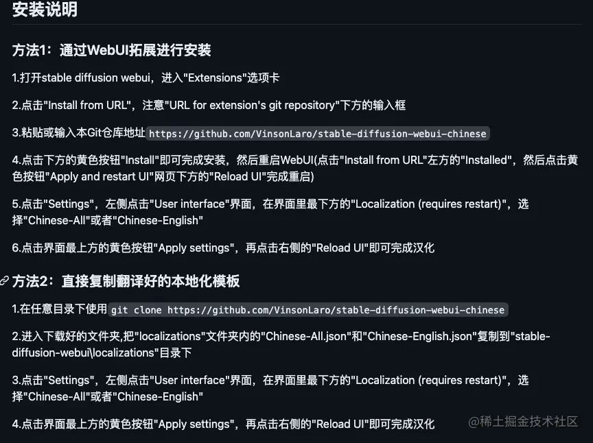

这里我们进入下载安装的一个界面(`Extensions` -> `Install from URL`), 这里可安装图示进行操作, 下面链接就是仓库地址 `https://github.com/VinsonLaro/stable-diffusion-webui-chinese`, 这里点击安装时会有个安装进度条(没截到 😭)

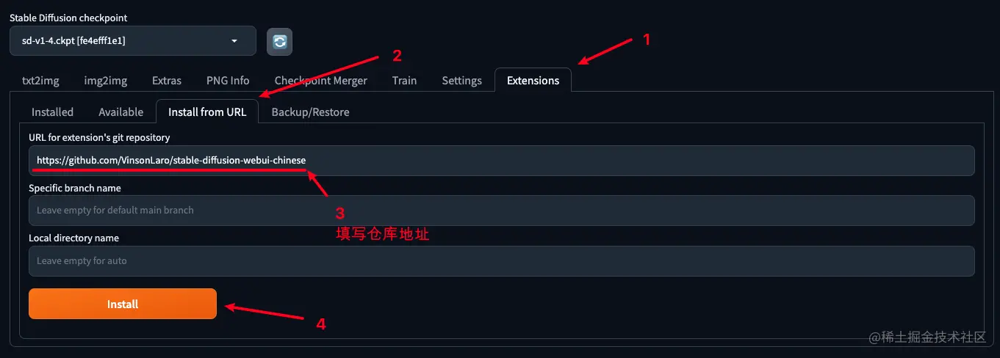

安装完成后, 我们还需要, 重新加载下 `UI`, 这里直接点击页面底部的 `Reload UI` 即可

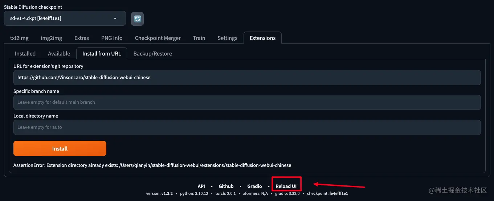

#### 7.2 配置语言

上面我们只是完成汉化包的安装, 下面还需要配置下语言, 配置路径: `Settings` -> `User interface` -> `Localization`, 这里我选择的是 `chinese-english-0512`, 这样的话页面就会有中英文的一个对照, 方便后面参数配置

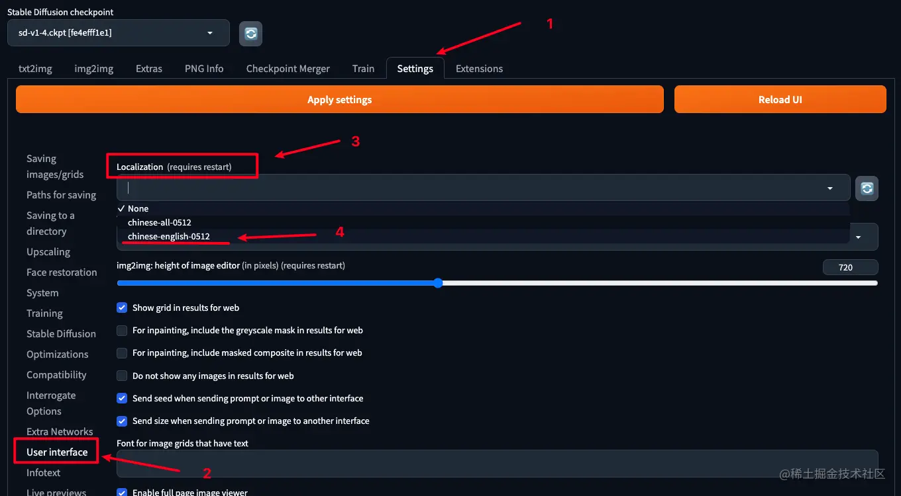

选择完后, `保存配置` 并 `重新加载 UI`

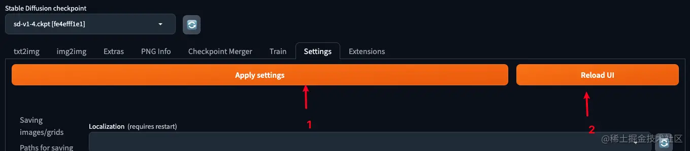

最后可以看下最终汉化后的效果

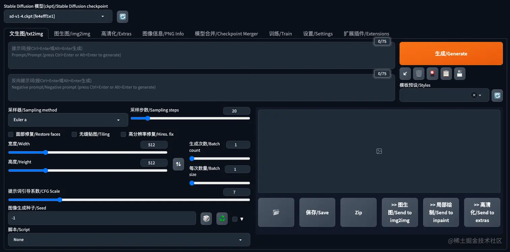

### 八、模型下载 & 演示

下面我们尝试下载安装模型, 进行一个简单的尝试

#### 8.1 模型下载

模型下载源这里推荐 [C 站](https://civitai.com), 在这上面我们可以下载各种风格的模型

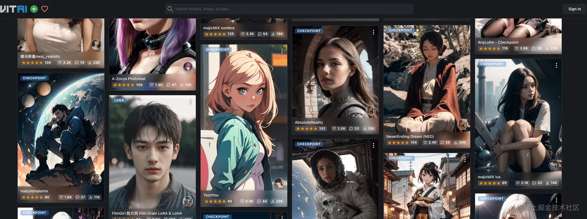

这里我选择 [toonyou](https://civitai.com/models/30240/toonyou) 模型, 并进行了下载

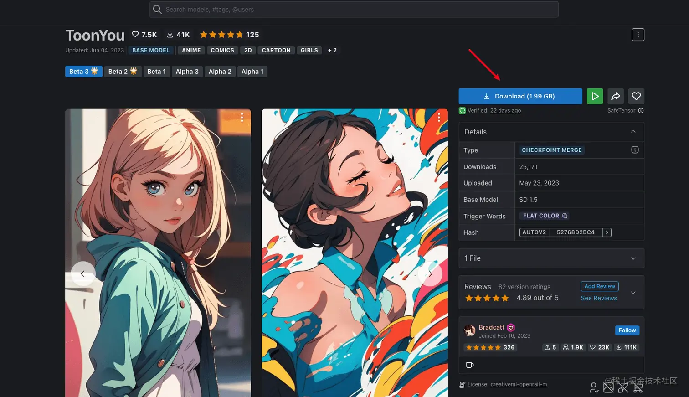

同上文, 这里我们需要将下载后的模型复制到 `stable-diffusion-webui/models/Stable-diffusion` 目录下

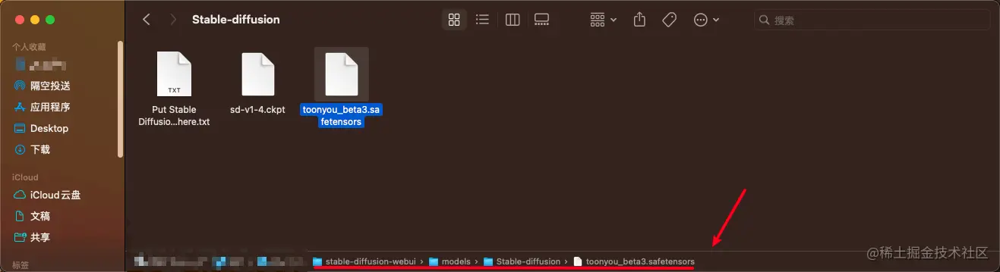

最后的最后, 我们需要重新加载下 `UI`

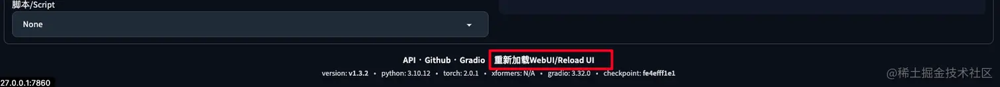

加载完成后, 就可以在模型选择一栏, 看到我们下载好的模型了

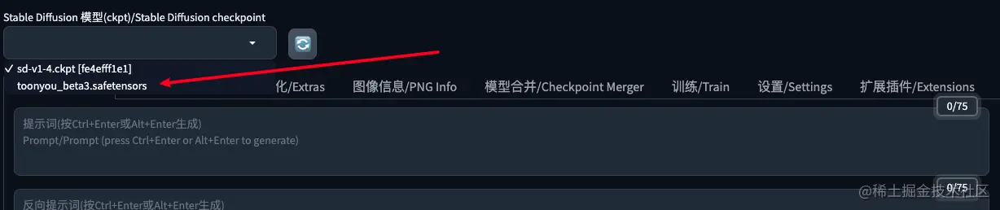

#### 8.2 开始魔法

如下演示图, `选择模型` -> `输入魔法` -> `点击生成`, 等待片刻... 即将完成一副巨作

> 咒语: `Girls, Hanfu, aestheticism, cherry, large cherry, petals fall, big scene, elegant Hanfu, dream, unreal, inception space, sci-fi --ar 3:4  --s 250     --q 2  --v 5 --q 1 --s 100`

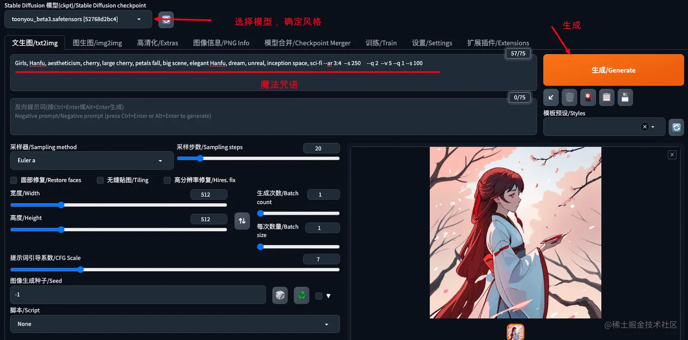

### 九、参考

- [轻松安装Stable Diffusion WebUI | MacOS M1&2, Intel CPU可用 | 完整指南和教程](https://www.youtube.com/watch?v=4vtLrafPd5c)
- [MacOS:轻松安装Stable Diffusion WebUI | M1, M2, Intel | 完整指南和教程](https://updayday.notion.site/MacOS-Stable-Diffusion-WebUI-M1-M2-Intel-61a0fd82ea0e451d9ead16beafc3a28b)
- [免费搭建一套可自由更换模型的stable-diffusion](https://mp.weixin.qq.com/s/gxfWc2tVS2ruoPZhcc1Qsw)

## 低成本Stable Diffusion API解决方案

- **stablediffusion api**：<https://stablediffusionapi.com/>
- **replicate**：<https://replicate.com/stability-ai/stable-diffusion>

## 远程云端部署Stable Diffusion

### 简单又便宜！所有人都能用上完整版 Stable Diffusion

|                       | **价格** | **简单** | **版本** | **便携** | **整体评价**                         |
| --------------------- | -------- | -------- | -------- | -------- | ------------------------------------ |
| **Google colab**      | ⭐⭐⭐⭐⭐    | ⭐⭐       | ⭐⭐⭐⭐     | ⭐⭐⭐⭐⭐    | 价格相对较低，操作简单，但稳定性较差 |
| **大厂云服务**        | ⭐⭐       | ⭐⭐       | ⭐⭐       | ⭐⭐⭐⭐⭐    | 价格较高，操作流程复杂，可能存在bug  |
| **AI工具整合包**      | ⭐⭐⭐      | ⭐⭐⭐⭐     | ⭐        | ⭐⭐⭐⭐⭐    | 价格适中，操作简单，但版本更新不及时 |
| **MAC 电脑本地安装**  | ⭐⭐       | ⭐        | ⭐        | ⭐⭐⭐      | 成本高，操作复杂，效果不佳           |
| **PC 台式机本地安装** | ⭐⭐⭐      | ⭐⭐⭐      | ⭐⭐⭐⭐     | ⭐        | 成本高，操作复杂，便携性差           |

苹果设备、电脑性能受限或者预算有限，可以使用完整版 Stable Diffusion 么？完全可以！作者 @逗砂 分享了自己尝试且放弃过的多个方案，并最终找到了最满意的工具 —— **揽睿星舟！**

*0*. **网址** ：[www.lanrui-ai.com/](https://www.lanrui-ai.com)

*1*. **价格**：一块 3090的每小时算力价格只要1.9元，这是目前看到的国内最低价格

*2*. **简单**：官方针对 Stable Diffusion 做了快捷版应用，直接点击安装就可以使用，更新也比较及时

*3*. **版本**：目前看到的唯一一个能够用非本地安装的方式看到最新版本的controlnet的工具，虽然目前只在基于工作空间的方式可以使用 [**⋙ 使用教程**](https://mp.weixin.qq.com/s/p1rqHPcjHXswowBdO5OHvQ)

————————————————————————————————————————————

教程：【AI绘画、国产ChatGPT一键部署，免费服务器A10显卡，10分钟搭建保姆级教程】<https://www.bilibili.com/video/BV18c411M7PM?vd_source=36c9491a7fa2ab8a22ca060af01b7472>

一键部署，使用阿里云，远程云端部署Stable Diffusion、通义千问，本地电脑无需高性能的显卡，不用部署复杂的开发环境，也能玩各种有趣好玩的AI算法。

- 免费试用中心：<https://click.aliyun.com/m/1000373727/>
- 函数计算FC：<https://click.aliyun.com/m/1000374159/>
- 文件存储NAS：<https://click.aliyun.com/m/1000374158/>

————————————————————————————————————————

【【AI绘画】阿里云在线试用 免费服务器v100显卡 5分钟搭建WebUI 保姆级教程】<https://www.bilibili.com/video/BV1po4y1877P?vd_source=36c9491a7fa2ab8a22ca060af01b7472>

- 阿里云试用宝典：<https://developer.aliyun.com/free/>
- 机器学习PAI控制台：<https://pai.console.aliyun.com/>
- 一键包/镜像资源：<https://pan.quark.cn/s/12af730acb20>

【保姆级教程：在colab云端上面部署stable diffusion并汉化，免费的15G显存】<https://www.bilibili.com/video/BV15m4y1r7Y3?vd_source=36c9491a7fa2ab8a22ca060af01b7472>

【AutoDL GPU云端部署，开启Stablediffusion无限跑图】<https://www.bilibili.com/video/BV1eL411B7jn?vd_source=36c9491a7fa2ab8a22ca060af01b7472>

【五分钟学会Stable Diffusion一键安装包Easy Diffusion】<https://www.bilibili.com/video/BV1B24y1j7jg?vd_source=36c9491a7fa2ab8a22ca060af01b7472>

【腾讯云GPU服务器部署Ai绘画Stable Diffusion全过程，操作简单，直接复制粘贴代码即可】<https://www.bilibili.com/video/BV1NY4y1S7eA?vd_source=36c9491a7fa2ab8a22ca060af01b7472>

## colab部署StableDiffusion

- 服务器在我们本地，不用联网了，空间大。
- 搭在服务器上还有另一个好处，就是我弄好以后全实验室都可以用，启动起来就不用停下了。
- Colab要科学上网。
- 谷歌硬盘空间太小，放不下我想要的所有checkpoint
- Colab长时间不用会自己断开
- ……

**绘图消耗的计算成本相对于自己装机或者购买显卡来说超级低，适合新入门尝鲜。**

- 首先，**访问一键部署脚本**。跳转谷歌 🌍[Google Colab](https://colab.research.google.com/drive/1lekLF7iib6M1R-NCylS0VMTF4wve-XuV)，并运行脚本中的第1步。
- 然后，在第2步中选择 SD 模型处填入 **ChilloutMix** ，点击运行。
- 接着，**设置 LoRA** (默认内置选项，或填写他人的 LoRA 模型下载地址)，点击运行。
- 继续，依次点击运行即可后续几步，直到显示**绘图环境安装成功。**
- **开始绘图**，按照作者教程填写 prompt 信息，选择 LoRA 模型，就可以生成图片啦。
- **参数优化**，如果觉得默认设置生成的图片分辨率低，可以按照图示调整参数。

[无显卡也能AI作画 | Colab + Stable Diffusion WebUI - 掘金 (juejin.cn)](https://juejin.cn/post/7217750296171233339)

## 阿里云Serverless部署StableDiffusion

[免费搭建个人stable-diffusion绘画(非本地、干货教程) - 掘金 (juejin.cn)](https://juejin.cn/post/7237004563647397946)

[阿里云 AIGC 白嫖 FC 搭建 stable diffusion - 掘金 (juejin.cn)](https://juejin.cn/post/7221142199391961147)

[阿里云 PAI 免费试用搭建 stable-diffusion-WebUI - 掘金 (juejin.cn)](https://juejin.cn/post/7221884988492398651)

[白嫖党 YYDS: 阿里云快速搭建 Stable Diffusion - 掘金 (juejin.cn)](https://juejin.cn/post/7246401806677442617)

————————————————————————————————————————

### 上手操作

之前我们部署应用，都是通过服务器或者云服务器居多，需要自己去：各种装软件，各种配环境（这一步往往就劝退了很多人），各种操作搞一通。

而这次我们彻底换一个方式，不用服务器，而是用容器，而且是基于Serverless的容器集群，然而**过程却非常简单**，**快速上手**。

老规矩，这里还是以阿里云为例。

这里**直接访问快速入口**：

[click.aliyun.com/m/100037316…](https://click.aliyun.com/m/1000373164/)

即可打开阿里云的资源领用中心：

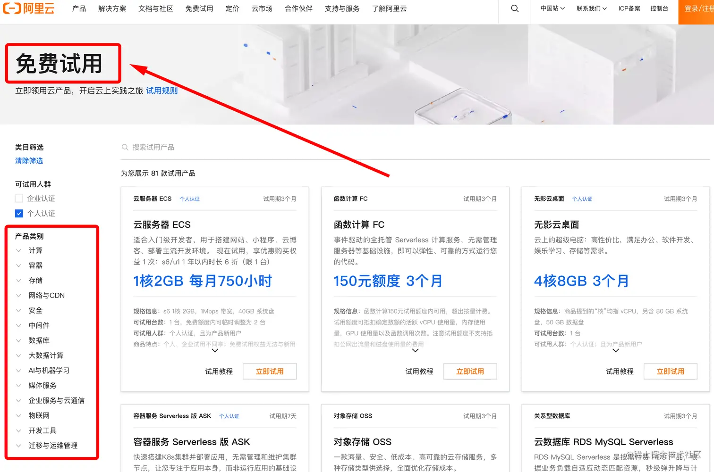

注意，这个地址大家可以收藏好。

因为我不止一次地收到过类似私信，说：

- 阿里云上是怎么免费领取资源来着？
- 新用户是怎么白瞟阿里云的资源来着？

而这个地址：

[click.aliyun.com/m/100037316…](https://click.aliyun.com/m/1000373164/)

**它就是总入口！**

打开之后可以看到，里面有很多分类和产品，用户之前如果没有用过这个产品的话，都可以免费领用。

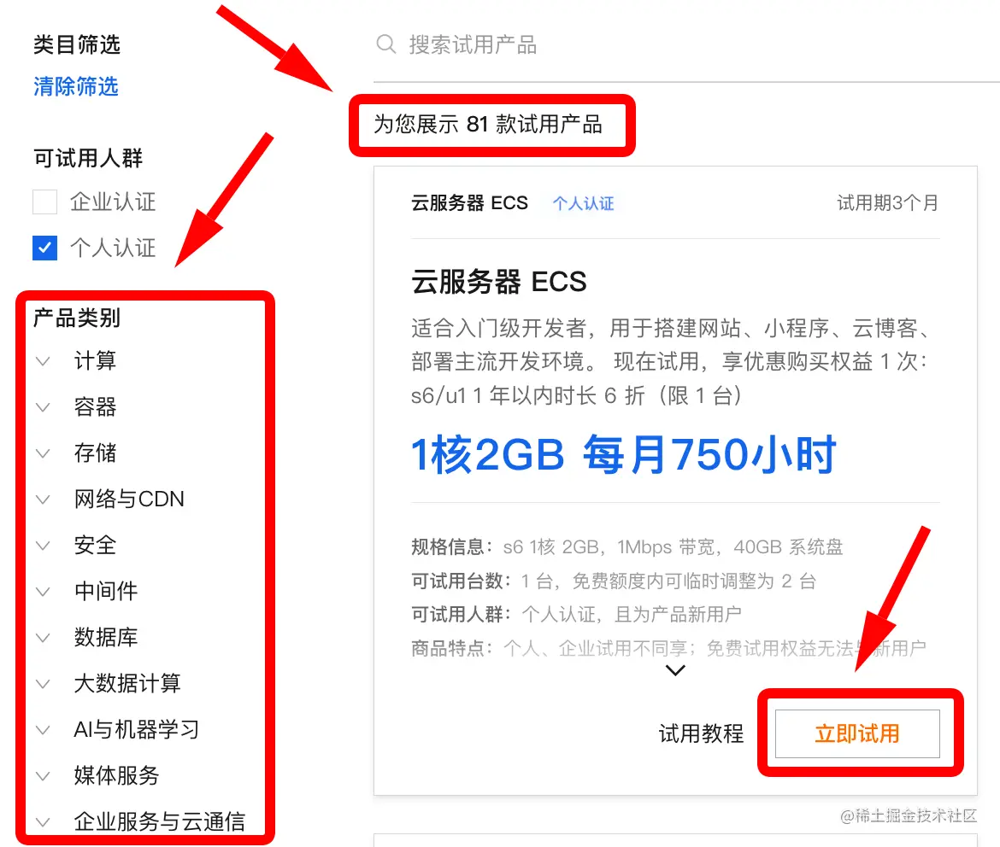

所以这个地址建议大家可以收藏好，免得后续临时想用时却找不到。或者说以后但凡想白瞟阿里云资源时（doge），就可以打开这个地址进去看看。

这次AI绘画应用的部署我们要用的是容器集群，**直接访问快速入口**：

[click.aliyun.com/m/100037408…](https://click.aliyun.com/m/1000374087/)

进去之后，我们直接点击「立即试用」按钮。

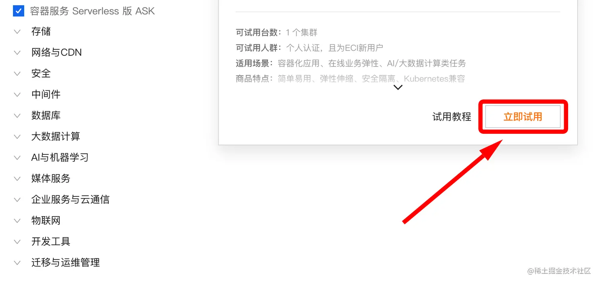

首先可以在弹出的面板上选择好地域，然后在服务协议右侧，单击「完成服务角色的授权」进入授权。


授权完成以后，再回到该面板，重新勾选服务协议之后：

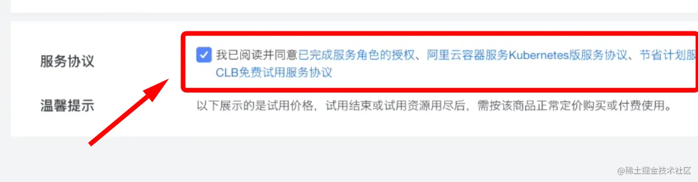

方可点击「立即试用」按钮来正式创建资源了。


完成之后，进入集群的控制台页面，可以看到系统正在帮我们自动创建一个标准版容器集群，等待几分钟后，当集群状态为「运行中」时，即可正常使用。

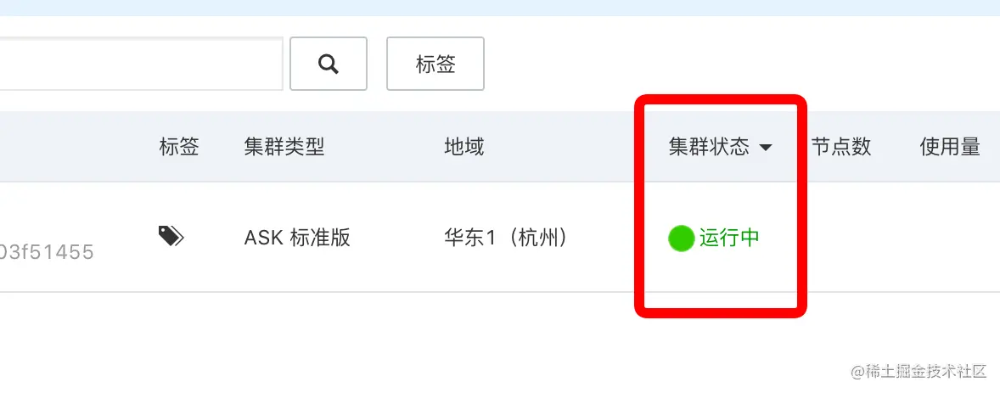

集群就绪以后，接下来我们就可以在里面部署各种各样好玩的应用了！

### 部署Stable Diffusion应用

接上一步，集群就绪以后，接下来我们就在这个容器集群里，来部署上线Stable Diffusion这个AI绘画应用。

它将会以容器的方式来运行，非常方便。

我们点进刚创建完成的集群，会进入到集群的工作页面。

此时我们进入左侧导航栏里的「工作负载」 > 「无状态」，然后选择右上角「使用镜像创建」的方式来部署此次AI绘画应用。

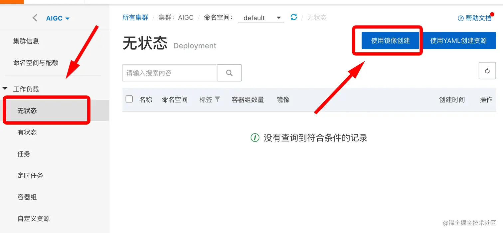

接下来按如下步骤填写几个关键信息，即可快速上线AI应用。

- 应用基本信息

这一步主要就是填写应用名称等信息，大家根据需要自行填写即可。

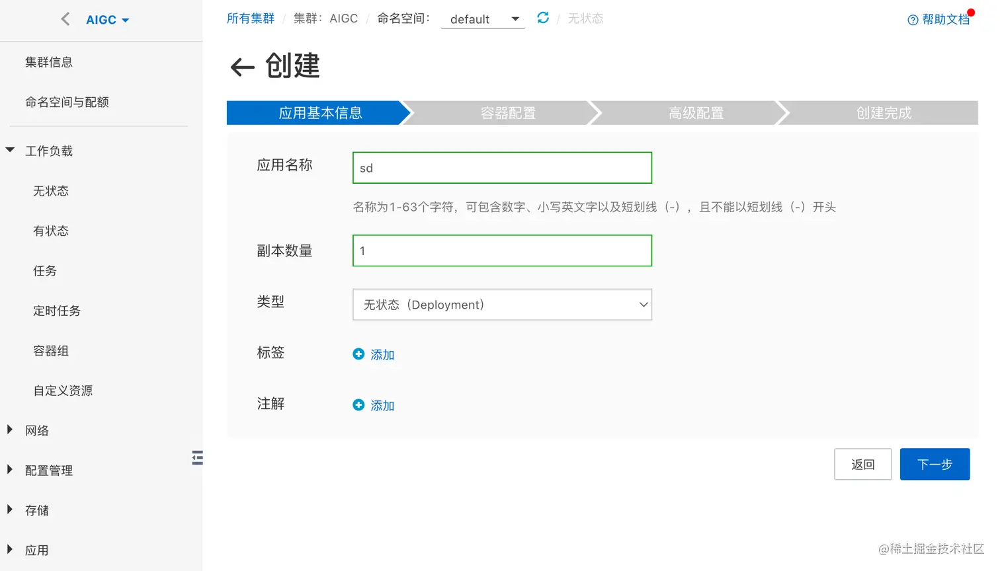

- 容器配置

这一步虽然比较关键，但是设置非常简单，我们只需要设置好如下几个选项即可，其他保持不动。

| 配置项       | 配置内容                                                     |
| ------------ | ------------------------------------------------------------ |
| 镜像名称     | `yunqi-registry.cn-shanghai.cr.aliyuncs.com/lab/stable-diffusion` |
| 镜像标签     | `v1.2.0`                                                     |
| 所需资源     | 8Core 16GB                                                   |
| 启动执行命令 | `["python3", "launch.py"]`                                   |
| 启动执行参数 | `["--listen", "--skip-torch-cuda-test", "--no-half"]`        |

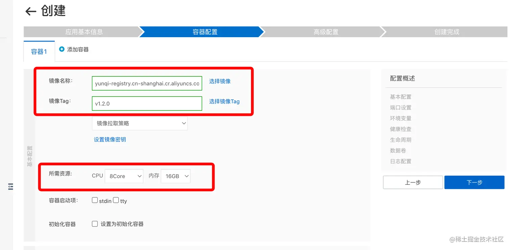

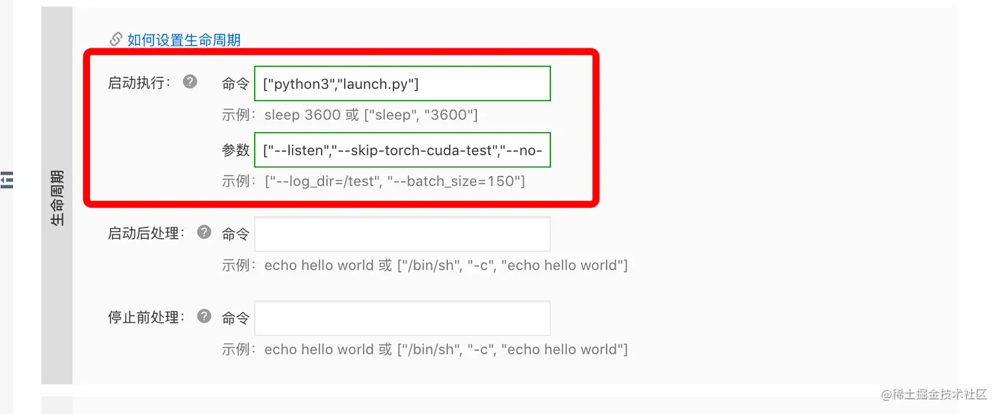

> 需要说明一点的是：正因为平台官方对该镜像做了加速，所以等下拉取会很快，不然像这种AI应用的镜像一般都比较大，动不动就十几GB，没有加速的话实在太慢了，所以这也是为什么这次选用该容器集群来进行应用部署的重要原因。

- 高级配置

在该Tab页部分，我们重点需要设置的就是「对外服务的Service」，我们希望这个应用能被大家所访问到。

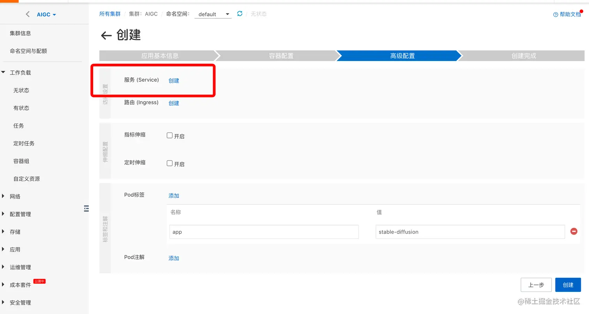

点击上图中的「创建」按钮之后，会弹出「创建服务」的对话框。

其他配置都不需要动，我们只需要设置一下端口映射关系即可：我们通过7860这个端口提供给大家访问。

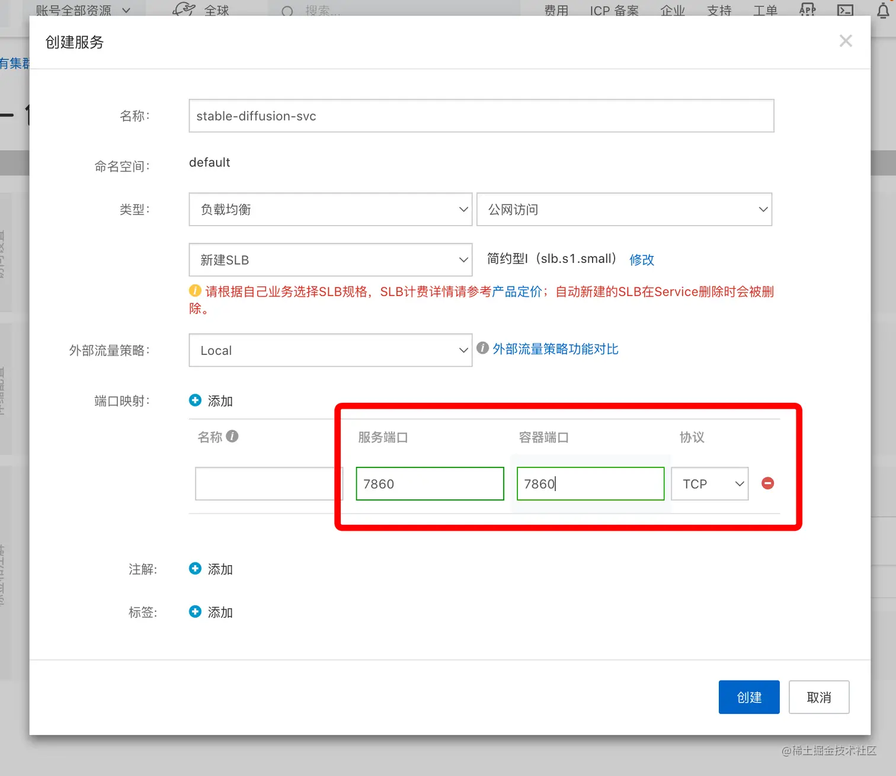

以上这些配置都完成以后，我们点击创建，系统就会自动提交并开始部署应用，**过程就是这么简单**！

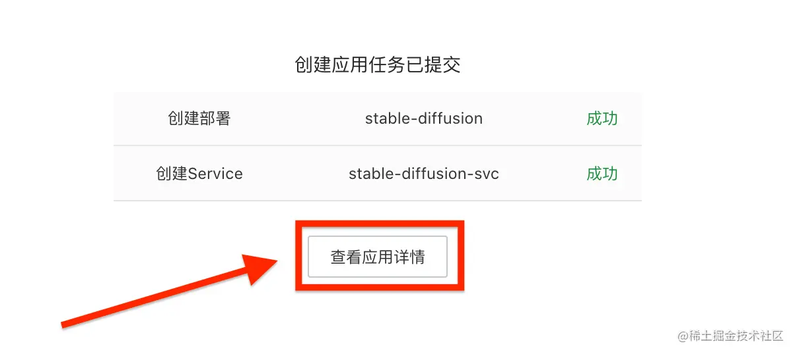

点击上方的「查看应用详情」后，我们也可以到控制台里去追踪应用的具体部署情况。等Pod的状态变为Running时，应用就已经成功上线了！

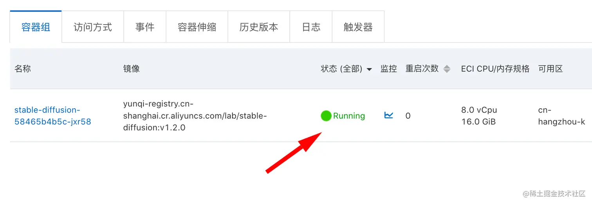

所以整个过程就是这么简单，我们通过一个非常**低成本且简单的方法**将Stable Diffusion这个AI绘画应用给部署上线了，并且公网可访问。

### 效果展示

以上操作完成以后，Stable Diffusion就已经顺利部署上线了。

此时我们回到集群页面，点击左侧导航栏里的「网络」 > 「服务」，可以看到对外提供的Stable Diffusion公网服务。

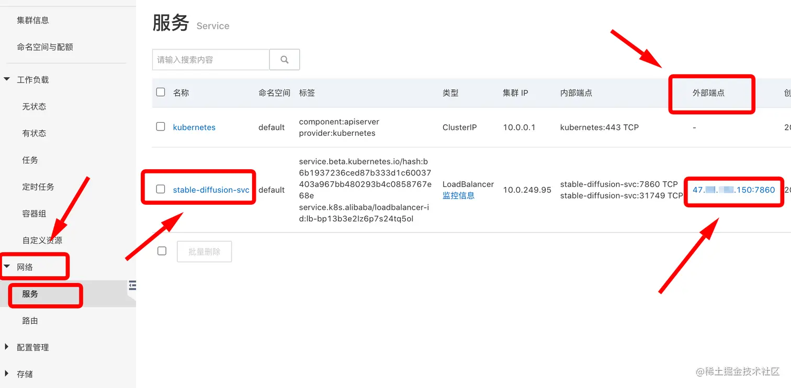

其对应有一个「外部端点」，即：一个可以访问Stable Diffusion AI绘画的公网IP。

我们直接点击，就可以打开浏览器，访问到Stable Diffusion的Web UI页面。

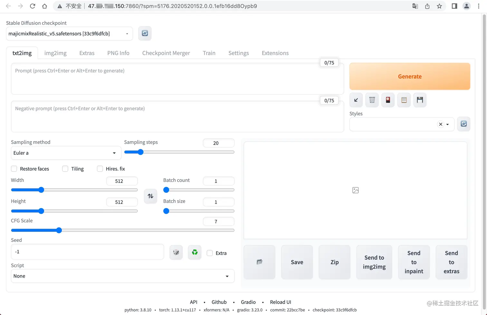

此时我们在该页面中输入提示词和参数，就可以开始AI绘画的创作了。

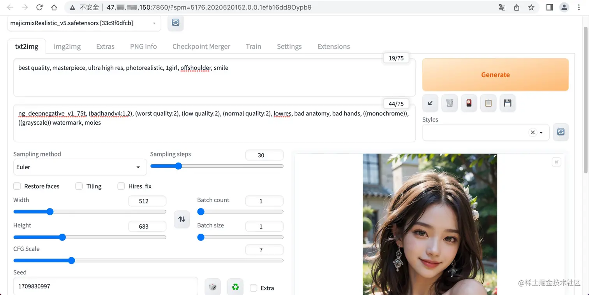

所以整个过程非常简单易上手。

### 上手使用

好啦，聊了这么多，落实到应用上，还是得自己上手实践一波。

大家可以按照上述过程操作一遍，这也可以说是目前非常低成本部署AI绘画应用的方式了，而且过程非常简单。

有兴趣的小伙伴可以尝试一波，具体快捷入口为：

[click.aliyun.com/m/100037408…](https://click.aliyun.com/m/1000374087/)

另外像civitai.com或者liandange.com等模型网站上也有很多AI绘画相关的模型，都可以直接在：[click.aliyun.com/m/100037408…](https://click.aliyun.com/m/1000374087/) 上进行部署使用。

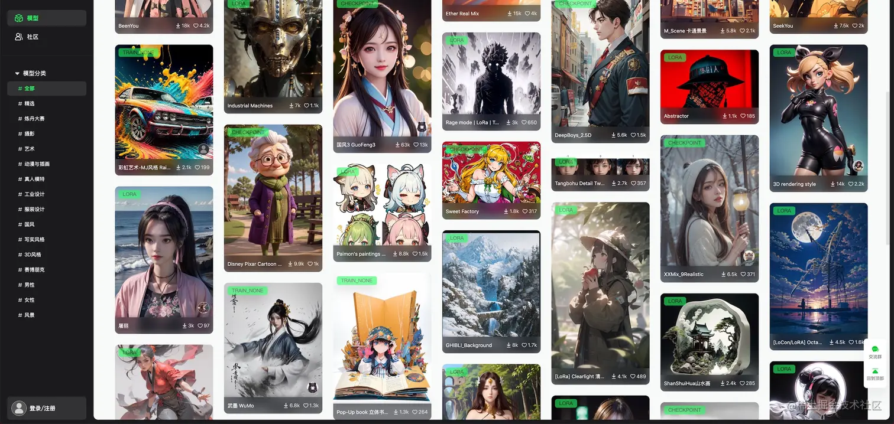

大家有兴趣也可以试一试，相信会打开一个新世界的大门

## 『腾讯云 Serverless Stable Diffusion 开放免费试用申请』人人都能开箱即用

⋙ 申请地址：[cloud.tencent.com/apply/p/3vy…](https://cloud.tencent.com/apply/p/3vynfzu3l8e)

[**⋙ 腾讯云官方发布**](https://mp.weixin.qq.com/s/bZ3F-e2UpW1fHVBSR5EUvQ)

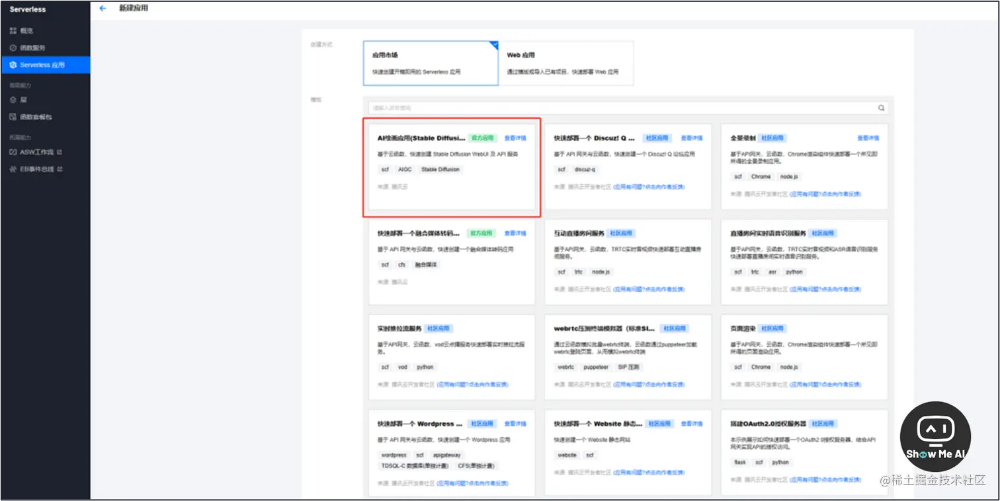

在过去的一段时间里，Stable Diffusion 在人物生成、场景生成、媒资生成、设计素材生成、游戏材质生成等领域，都展现出了极大的潜力与令人惊艳的效果。

除了自己动手在本地、服务器上搭建 Stable Diffusion 服务外，基于腾讯云函数 SCF 的云上 Stable Diffusion 应用将于近日发布，并已开启试用申请！部署完成后，你将直接得到一个可访问的 WebUI 链接 / API 地址！再也不用担心自己小电脑带不起来啦！

## 在亚马逊 SageMaker 进行 Stable Diffusion 模型服务部署

[如何在亚马逊 SageMaker 进行 Stable Diffusion 模型在线服务部署 - 掘金 (juejin.cn)](https://juejin.cn/post/7221497108008255548)

## Kaggle版部署

Kaggle 是世界上最大的数据科学社区，拥有强大的工具和资源，可帮助您实现数据科学目标。（每周可以免费使用30个小时）。

**AI绘画StableDiffusion：云端在线版免费使用笔记分享**：[‍⁢⁤⁢‍⁤⁤⁤⁣‍‬⁣⁣⁤⁡‍‬⁢‍‍‬⁣⁣⁤⁡⁤‌‍⁣⁤⁣‌⁡⁤AI绘画StableDiffusion：云端在线版免费使用笔记分享（Kaggle版） - 飞书云文档 (feishu.cn)](https://y3if3fk7ce.feishu.cn/docx/OiRUd0E6uoXOLexAkNicfyBEnBg)

[AI 绘画基于 Kaggle 10 分钟搭建 Stable Diffusion（保姆级教程） - 掘金 (juejin.cn)](https://juejin.cn/post/7247306840199135287)

[StableDiffusion（Kaggle版）笔记分享 - 掘金 (juejin.cn)](https://juejin.cn/post/7248072694334226469)

## 【ChatGLM-6B+StableDiffusion+网络搜索】本地部署绘图

视频教程：【【ChatGLM-6B+StableDiffusion+网络搜索】本地部署可绘图，网上寻找信息的AI】<https://www.bilibili.com/video/BV1gX4y1B7PV?vd_source=36c9491a7fa2ab8a22ca060af01b7472>

本项目基于 ChatGLM-6B (<https://github.com/THUDM/ChatGLM-6B>) 后期调教，

网络爬虫及 Stable Diffusion (<https://github.com/AUTOMATIC1111/stable-diffusion-webui>)

项目实现了 ChatGLM-6B 的网络搜索及图片生成功能

项目源码：<https://github.com/LemonQu-GIT/ChatGLM-6B-Engineering>

秋叶里改下端口设置下允许API就可以了， 秋叶安装包默认的7860端口改成这个默认7861

视频教程：【【AI绘图】ChatGLM+StableDiffusion整合包】<https://www.bilibili.com/video/BV1Wa4y1V77o?vd_source=36c9491a7fa2ab8a22ca060af01b7472>

网盘链接：<https://pan.baidu.com/s/19kbrJyZXKa093i3N6UYfqQ?pwd=pxok>

lemon大佬的github仓库：<https://github.com/LemonQu-GIT/ChatGLM-6B-Engineering>
秋叶大佬的SD整合包：<https://www.bilibili.com/video/BV1iM4y1y7oA>
lemon大佬的演示视频：<https://www.bilibili.com/video/BV1gX4y1B7PV>
ChatGLM-6B官方仓库：<https://github.com/THUDM/ChatGLM-6B>

视频音源：樱桃MOMO叉屁屁<https://space.bilibili.com/75044618>

## 把Stable Diffusion变成商用软件

视频：【开源！如何把stable diffusion变成商用软件？教你正确的调用stable diffusion api！】<https://www.bilibili.com/video/BV1Y14y127BY?vd_source=36c9491a7fa2ab8a22ca060af01b7472>

- sdwebui-api-manager: <https://github.com/nftblackmagic/sdwebui-api-manager>
- sd-webui-hook-v2: <https://github.com/nftblackmagic/sd-webui-hook-v2>
- stable diffusion webui: <https://github.com/AUTOMATIC1111/stable-diffusion-webui>

## 基于Stable Diffusion WebUI 本地启动

## Stable Diffusion的后端服务器实例部署

【Stable diffusion的后端服务器该如何选择？这个服务器最省钱！一键部署webui api服务实例！】<https://www.bilibili.com/video/BV1uP411e7eo?vd_source=36c9491a7fa2ab8a22ca060af01b7472>

- runpod：<https://runpod.io?ref=dceuo3m2>
- github开源：<https://github.com/nftblackmagic/sdwebui-api-manager.git>
- aws：<https://docs.aws.amazon.com/dlami/latest/devguide/gpu.html>
- lambda：<https://lambdalabs.com/service/gpu-cloud/pricing>

## StableDiffusion腾讯云快速部署

教程：【StableDiffusion腾讯云快速部署，全网最详细保姆级教程（AI绘画、技术小白必看）】<https://www.bilibili.com/video/BV1gu4y1o7Bg?vd_source=36c9491a7fa2ab8a22ca060af01b7472>

文中所涉及的软件以及地址：

- 腾讯云服务器购买入口：<http://985.so/mfnph>
- 叶秋一键安装包链接（含contrlnet1.1）: <http://985.so/mfz5h>
- hNVIDIA 官网驱动下载： <http://985.so/mfz54>
- FTP Rush：<http://985.so/mfz5g>
- 插件地址：
  - 中英文对照界面插件：<https://gitcode.net/overbill1683/stable-diffusion-webui-localization-zh_Hans>
  - 最牛提示词插件：<https://gitcode.net/ranting8323/sd-webui-prompt-all-in-one>

服务器环境搭建篇

### 一、前言

- 关键词：便捷、省钱、简单
- 大家好，我是AI训练师，一个并不懂技术的AI爱好者。
- 如今AI做图火了，各大云服务商开始降价，吸引AI玩家租用GPU服务器出图炼丹，网络上也有各类免费薅羊毛的视频供大家学习。但是经过一圈配置下来就会发现，使用过程会遇到各种坑：英文环境报错看不懂，图片不知道存哪里了，下载图片得一张张下，忘记关机还被扣费等等。玩到最后懵逼的你依然懵逼，我是来薅羊毛的，不是来学习一门计算机编程的（此处应该有掌声！）。
- 要知道，我只是个计算机小白好不好，平时用的是Windows11系统的电脑，点开秋叶整合包的启动器，直接弹出StableDiffusion的出图界面，才是我的习惯。
- 如何以最快、最省钱、最简单的方式使用StableDiffusion出图呢，我研究出了一整套小白也能看懂的腾讯云端Windows部署方案，让大家在云端部署后也能像在本地电脑一样使用方便。（这个方案还可以多人一起共享哟，费用有人AA了，是不是还有点小激动啊^-^）

### 二、操作步骤

#### 2.1 购买服务器

   跟大家想的一样，GN8型的服务器有P40的显卡，每天到时间就被抢光了，基本抢不到，手速好的可以试试。我们就买GN7型号的，自Tesla-T4显卡，也是个不错的选择。点击“立即购买”按钮 活动地址：<http://985.so/mfnph>

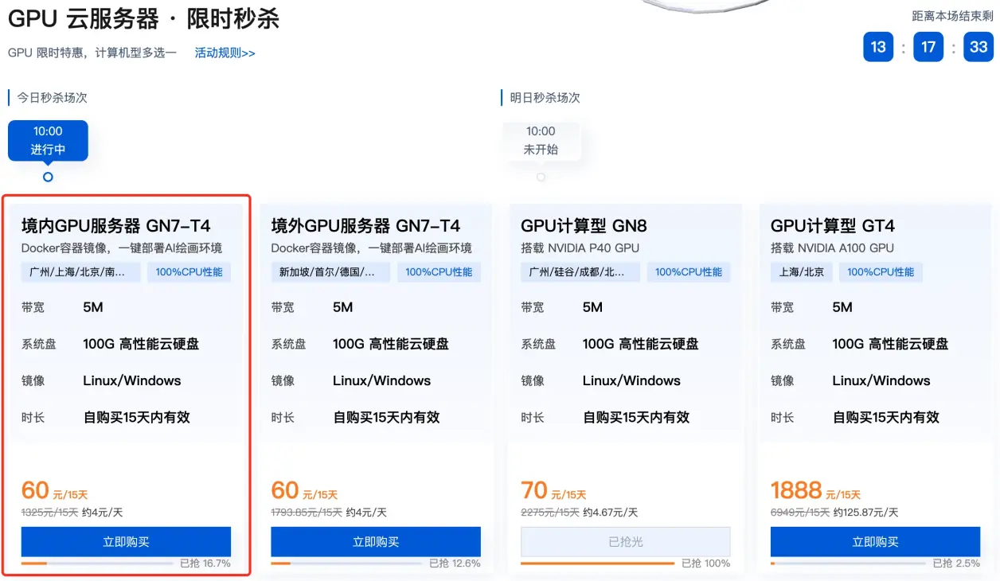

- 地域：选择离你最近的地点，不选默认也行，预装镜像：选择Windows sever 2019中文版，点击立即购买付款后


- 付款购买完成之后（大概5分钟后），我们点击右上角的“控制台”进入腾讯云总览首页，在“我的资源”当中点击“云服务器”即可进入服务器界面


- 这里插一嘴，默认购买的服务器硬盘是100G的，服务器系统直接占用了25G，也就是还剩下75G硬盘，通过我多年的经验，这个硬盘是不够的，建议将系统盘增加至200G，花费17.5元左右。


- 调整目标硬盘大小点击下一步付款就行。


#### 2.2 登录服务器

想要登录服务器获取服务器IP地址、用户名和密码，初始密码在顶部的站内信（小信封），点开即可看到，复制好密码后，点击右侧的登录按钮进入登录界面


- 填入密码就能登录，不过这个方式不方便，我一般是点击RDP文件下载，存到桌面，这个是今后登录服务器的快捷方式，如果还想用其他的登录方式可以查看这里<https://cloud.tencent.com/document/product/213/35697，>


- 这样就能直接进入到服务器的桌面了


#### 2.3 安装显卡驱动

- 注意了，初始状态下，服务器是没有特斯拉显卡驱动的，我们需要打开服务器自带浏览器，访问 NVIDIA 驱动下载 <http://985.so/mfz54> 官网 找到Tesla-T4的驱动，下载对应的驱动进行安装


- 默认安装完成之后，点击这个地址 C:\Program Files\NVIDIA Corporation\NVSMI，确认已经存在以下文件，进行下一步


- 右键“此电脑”选择属性，


- 点击系统高级系统设置


- 点开环境变量


- 将地址C:\Program Files\NVIDIA Corporation\NVSMI新建至path的环境变量当中，点击确定


- 开始菜单当中打开命令提示符，


- 输入nvidia-smi 看到以下界面表示驱动程序安装成功，


- 2.4 安装StableDiffusion主程序（敲黑板，关键点来了）

#### 2.4.1上传主程序到服务器

- 我们知道StableDiffusion的秋叶一键安装包体积大概快10G左右，介于各位大佬主程序的存储习惯，这里提供了3种下载方案给大家参考，个人最推荐的是第三种，各位可以根据需求选择：
- 方案一：百度网盘，须开通超级会员，下载速度实测 12M/s（不开会员你懂的），30元/月；
- 叶秋一键安装包链接: <https://pan.baidu.com/s/1kJX3bj_lV8Ks25m4hMkpwQ?pwd=jsnr>
- 方案二：夸克网盘，无需开通会员，下载速度实测 300K~500K/s，免费；
- 叶秋一键安装包链接：<https://pan.quark.cn/s/320cc763339b>
- 方案三：搭建FTP文件服务器，上传/下载速率实测 5M/s，免费；（服务器都租了，传文件还花钱，岂不是冤大头^-^），把本地文件拖动到服务器，或者从服务器上下载图片，拖动过去即可，跟在自己电脑上一样简单。
- 云端FTP服务器的搭建，建议参考官方的FTP搭建方式（<https://cloud.tencent.com/document/product/213/10414?from=20421&from_column=20421）> ，这里我就不赘述了，如果大家在搭建过程遇到很多问题，我再出一个手把手FTP服务器搭建教程。
- 本地FTP软件我推荐使用的是FTP Rush（<https://www.wftpserver.com/zh/download.htm#ftprush），适用于各个平台。>


- 另外说一下腾讯云本身也提供文件传输方式COSBrowser，个人不推荐，使用过后好像是按照存储量收费的，别问我怎么知道的，嗯哼~

#### 2.4.2 安装软件

- 先双击安装“启动器运行依赖”，之后解压sd-webui-aki-v4.1，解压好之后在文件夹内，双击“A启动器”


- 打开一键启动后


- 当你看到这个界面的时候就可以开始你的出AI之旅了，到此为止服务器配置基本完成。


### 三、使用技巧及常见问题

#### 3.1 插件的安装

- 汉化：在启动器界面勾选启用“云端页面汉化”，操作界面将会变成是中文的


- 推荐其他的必选插件
- 中英文对照界面插件  <https://gitcode.net/overbill1683/stable-diffusion-webui-localization-zh_Hans>
- 最牛提示词插件 <https://gitcode.net/ranting8323/sd-webui-prompt-all-in-one>


- 3.2大模型、lora的下载和安装
- 秋叶启动器上包含有模型管理，大家可以根据需要自行下载安装，如果这里没有的话，那就去C站<https://civitai.com/和抱脸上搜索https://huggingface.co/models，万能的互联网会告诉你一切。下载后的模型放在什么位置，点击启动器顶部的“打开文件夹”即可找到对应的文件路径，文件放进去即可。>


- 3.3如何实现多人使用服务器
- 一键启动之前，一定要在启动之前将这两个按钮打开，如果已经启动了，将黑色界面的控制台关掉重新配置打开。


- 启动之后就能得到这样的地址，将地址分享给你的朋友，用浏览器打开即可在多台电脑上实现云端出图


- 四、总结
- 上面就是以一个小白的视角搭建云端StableDiffusion的整体流程，注意啊，只是云端搭建流程，软件使用技巧体系过于庞大就不在这里详细说了。有说得不够详细的地方欢迎评论区留言讨论，如果有兴趣想了解其他的知识，我会根据具网友的反馈出额外的教程。
- 全程操作下来，总共花费79元（可用15天），时长大概有4个小时左右，毕竟我可是传了将近100多G 的文件上去呢。
- 最后，在线征集想一块租用服务器的小伙伴，合租是当前玩AI绘画最经济、实惠、高效的办法
