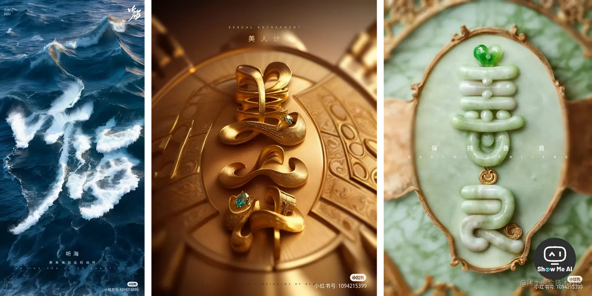
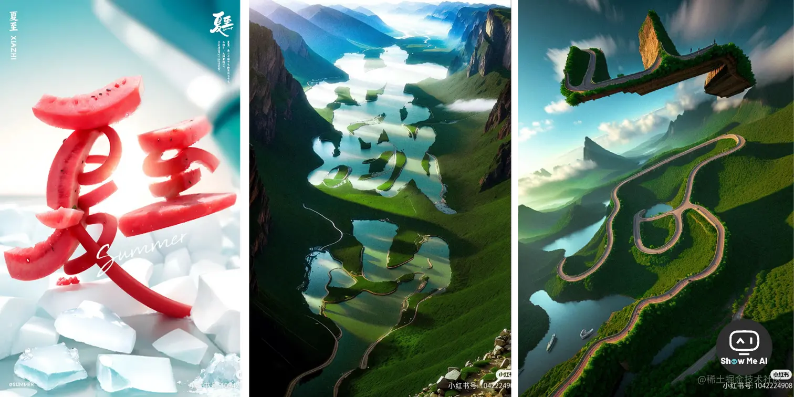
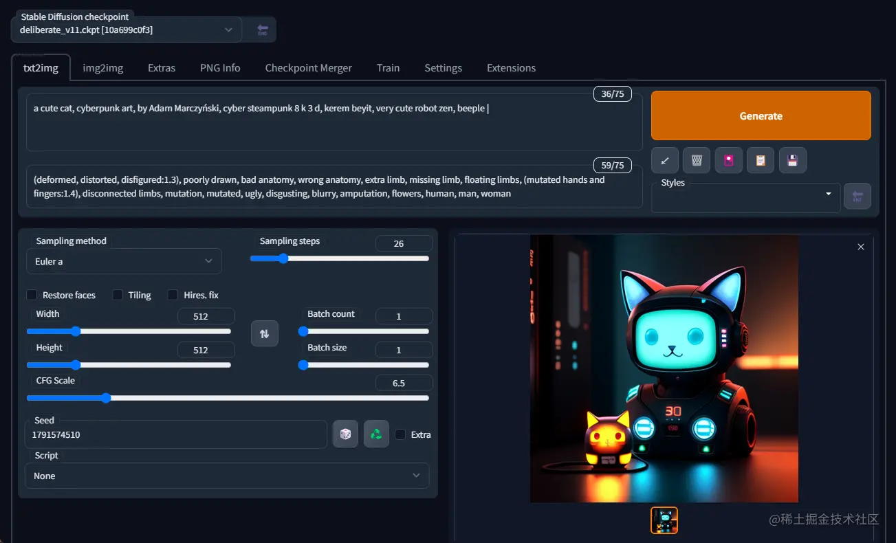
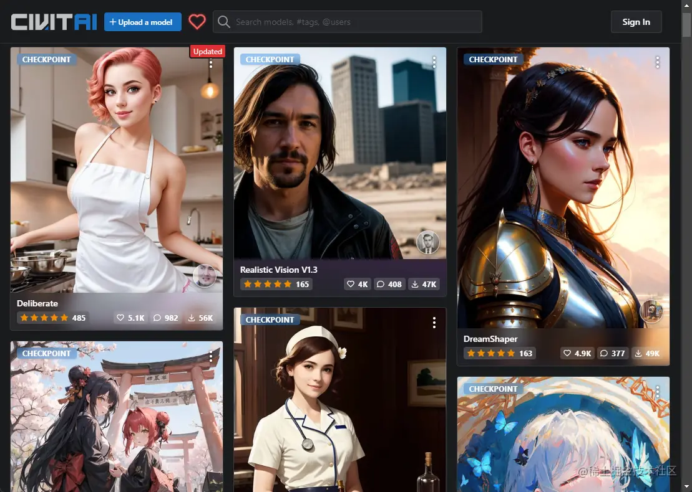
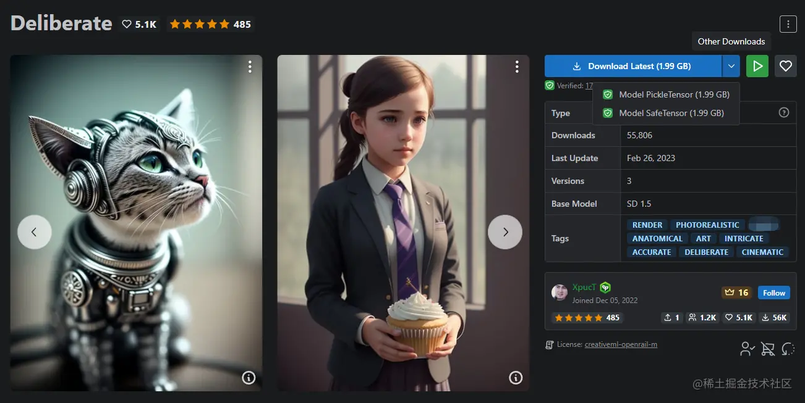
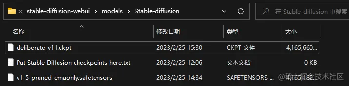
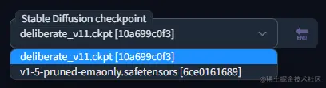
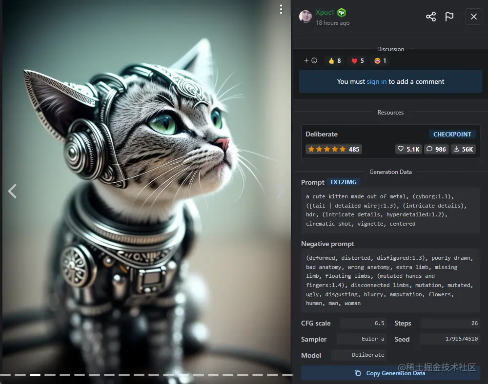
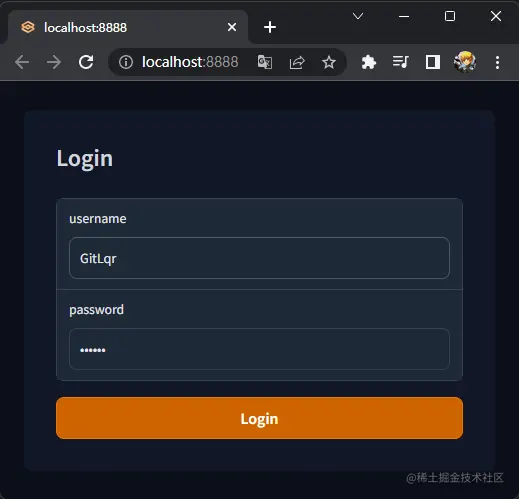
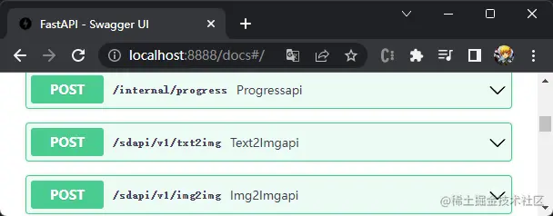

# Stable Diffusion工具的使用

[万字长文！从零开始带你进阶AI绘画神器Stable Diffusion - 优设网 - 学设计上优设 (uisdc.com)](https://www.uisdc.com/stable-diffusion-8)

[Stable Diffusion教程-①安装使用_哔哩哔哩_bilibili](https://www.bilibili.com/video/BV1BM4y127eD/?vd_source=5f0c99b3deddffe219938763769b15ac)

[Stable Diffusion 新手入门手册 - 知乎 (zhihu.com)](https://zhuanlan.zhihu.com/p/619120794)

这是一篇 Stable Diffusion 的进阶教程。开篇介绍了作者个人的 SD 学习路线，清晰合理，值得借鉴。

> 1. **跑通流程**：先学最基础的，大概理解参数模型提示词的用途，先把 SD 的流程跑通，这一步大概可以做出来相对看得过去的图了
> 2. **模型和提示词高级用法**：然后再去研究模型和提示词的高级用法，比如混用 lora 模型、提示词的分步和融合写法，并对图进行针对性的优化
> 3. **其他高级功能**：学习其他功能，图生图，Controlnet 插件，以及分层控制 Lora 模型等进阶功能
> 4. **训练自己的模型**

## 调试

### 💡 一、图片对比

> 1. XYZ 图表的使用
> 2. 提示词矩阵

### 💡 二、图片微调

### 💡 三、图片放大

> 1. 插件的安装
> 2. 插件的使用

### 💡 四、提示词进阶

> 1. 提示词的顺序
> 2. 分步描绘
> 3. 融合描绘
> 4. 反向提示词的进阶用法
> 5. 借助 ChatGPT 写提示词
> 6. 提示词管理

### 💡 五、**ControlNet 插件**

> 1. 插件安装与模型下载
> 2. 基本使用流程
> 3. 具体参数介绍

### 💡 六、**常见问题**

> 1. Vae 模型是否必须要有
> 2. 大模型和 lora 是否必须对应
> 3. 明明描述的是一个人，最终图像却生成了多个人
> 4. 无法生成全身照


**AI辅助设计高阶训练工作流 从零到一系统教程（￥599.90）**：[AI辅助设计高阶训练工作流 从零到一系统教程-设计小教室 (designdid.top)](https://www.designdid.top/series/XL101039)

推荐两个B站UP主：

- Nenly同学(Stable Diffusion的教程)：[Nenly同学的个人空间_哔哩哔哩_bilibili](https://space.bilibili.com/1814756990)
- 秋葉aaaki(制作了一键启动的Stable Diffusion的整合包)：[秋葉aaaki的个人空间_哔哩哔哩_bilibili](https://space.bilibili.com/12566101)

教程：

- Nenly同学的 **零基础学会Stable Diffusion课程**：【B站第一套系统的AI绘画课！零基础学会Stable Diffusion，这绝对是你看过的最容易上手的AI绘画教程 | SD WebUI 保姆级攻略】<https://www.bilibili.com/video/BV1As4y127HW?vd_source=36c9491a7fa2ab8a22ca060af01b7472>
- 【【SD教程】用Colab一键免费搭建AI画图神器Stable Diffusion，无限出图，白嫖google GPU，无电脑配置和显卡要求】<https://www.bilibili.com/video/BV17o4y1c7Cj?vd_source=36c9491a7fa2ab8a22ca060af01b7472>
- 【stable diffusion最清晰的保姆级上手教程 -  AI绘画 NovelAi webUI】<https://www.bilibili.com/video/BV1rM4y1k7Dv?vd_source=36c9491a7fa2ab8a22ca060af01b7472>

[AI绘画学习笔记- 文集 哔哩哔哩专栏 (bilibili.com)](https://www.bilibili.com/read/readlist/rl714930)

[耗时80小时！超详细的胎教级Stable Diffusion使用教程，看这一篇就够！ (qq.com)](https://mp.weixin.qq.com/s/eFi-xoVDQomzCBr5kO9nHA)

### 🔔 **一、为什么要学Stable Diffusion，它究竟有多强大？**

> *1*. Stable Diffusion能干嘛
>
> *2*. Stable Diffusion是什么

### 🔔 **二、三分钟教你装好Stable Diffusion**

> *1*. 什么电脑能带动SD，A卡和Mac系统也不慌
>
> *2*. 低配置电脑也能玩Stable Diffusion
>
> *3*. 一键式安装SD本地部署，解压即用，小白的福音

### 🔔 **三、小白快速上手Stable Diffusion**

> *1*. 用对模型，照片风格才对味儿
>
> *2*. 写好关键词，让你事半功倍
>
> *3*. 两分钟打造你的专属模特
>
> *4*. 为什么你生成的图就是跟别人不一样
>
> *5*. 一分钟生成自己的二次元造型
>
> *6*. 随便画几笔，你就是“神笔马良”
>
> *7*. 怎么给二次元老婆换衣服
>
> *8*. 两步拯救超糊照片
>
> *9*. 三秒教你获取大佬的咒语
>
> *10*. 一招让你自由指定女神的姿势
>
> *11*. 插画师的福音，线稿秒上色
>
> *12*. 小白也能进行室内设计

### 🔔 **四、Stable diffusion知识补充**

> *1*. VAE
>
> *2*. 迭代步数
>
> *3*. 采样方法
>
> *4*. 面部修复+高分辨率修复
>
> *5*. 图片分辨率（图片大小）
>
> *6*. 生成多图
>
> *7*. 用脚本进行照片对比

### 🔔**五、大神的模型从哪来**

> *1*. 模型在哪下载
>
> *2*. 模型下载到哪里
>
> *3*. 如何分辨模型

## 手把手教你用 Stable Diffusion 写好提示词

[手把手教你用Stable Diffusion写好提示词 (qq.com)](https://mp.weixin.qq.com/s/sEQpP5S7W_gsCUf3i7OZiQ)

Stable Diffusion 技术把 AI 图像生成提高到了一个全新高度，文生图 (Text to image) 生成质量很大程度上取决于你的提示词 Prompt 好不好。

本文从「**如何写好提示词**」出发，从提示词构成、调整规则和 chatGPT 辅助工具等角度，对文生图的提示词输入进行归纳总结。

### 🔔 **一 背景介绍**

### 🔔 **二 如何写好提示词？**

> **1 正面提示词**
>
> (1) 主体 subject
>
> (2) 媒介 medium
>
> (3) 风格 style
>
> (4) 画家 artist
>
> (5) website
>
> (6) 分辨率 resolution
>
> (7) 额外细节 additional details
>
> (8) 色调 color
>
> (9) 光影 lighting
>
> **2 负面提示词**
>
> (1) 移除物体 removing things
>
> (2) 修改图片 modifying images
>
> (3) 关键词切换 keyword switching
>
> (4) 修改风格 modifying styles
>
> **3 微调提示词**
>
> (1) 关键词权重
>
> (2) ()和[]语法
>
> (3) 关键词混合

## Stable Diffusion 如何写出更优雅的 Prompt

### 一、Prompt 要素

就像我们写作文一样，写 Prompt 也需要具备一些特定的格式，从而得到更好的出图质量

总的会分为以下几个方面：

- 画质
- 画风
- 主体
- 主体属性
- 主体特征：衣着、姿势
- 场景特征
- 环境特征
- 画面视角
- 反面提示词

#### 1.画质

如果我们没有任何画质的 prompt ，那么得出的效果就会很糊 

添加画质的 prompt 就可以很好的解决这个问题，画质也分为了两大类

- **通用型**：best quality, ultra-detailed, masterpiece, hires, 8k
- **特定型**：比如 extremely detailed CG unity 8k wallpaper（超精细的8K Unity游戏CG），unreal engine rendered（虚幻引擎渲染）

我们可以使用通用型举例，

如果加上高画质的 prompt，那么出图的质量就会大大提升 

#### 2.画风

画风就包括很多了，常见的

- 插画风：Painting、Illustration、drawing
- 二次元：Anime、Comic、Game CG
- 写实风：Photorealistic、Realistic
- 漫画风：comic
- Q版：chibi
- 等等

同样来举个例子看看效果： 

当我们使用相同的种子，

只是画风不同的时候效果也非常不错 

#### 3.主体

主体就是整个画面的主体是谁，这个就比较简单了，人、物可以

比如来一个帅哥！ 

#### 4.主体属性

主要是描述主题的一些特征，如果是人，那么他的高矮胖瘦，五官等等，主要会根据下面几个方面编写：

- 人物类型：人、职业...
- 身材
- 头发
- 五官

举个例子：画一个萝莉(loli)，比较瘦(thin)，穿着大衣(wear overcoat clothes),短马尾(short ponytail)，红色的头发(red hair)，得意的笑(smirk)，狐狸耳朵（fox ears），爱心眼(heart-shaped pupils)，有一个尾巴(tail) 

#### 5.主体特征：衣着和姿势

衣着和姿势 种类就非常多了。后面我们会提供一个大全供查看

我们也是举个例子：在上一个 prompt 的基础上添加

- 兜帽：hood
- 卫衣：hoodie
- 腰包：fanny pack
- 牛仔裙：denim skirt
- 高跟长靴：high heel boots 

#### 6.场景特征

场景特征决定了主体所处的背景。

比如：室内还是室外、大场景、小细节等等。

比如我希望我们的主体的背景是在 海边日落(beautiful purple sunset at beach) 

#### 7.环境特征

描述周围的环境是什么样。天气、季节、灯光、色调等。

同样举个例子：在前面的 prompt 后加上

- 电影光效：cinematic lighting
- 多云：cloudy


#### 8.画面视角

描述整个画面的角度是什么样的，比如：

- 距离
- 人物比例
- 观察视角

同样举个例子 在前面的 prompt 的基础上添加 从左侧视角观察(view of left side) 

#### 9.反向提示词

反向提示词则是我们不希望出现在画面上的，一般可以分为：

- 低质量的：如low quality、low res
- 单色灰度：如monochrome、grayscale
- 样貌身形：如bad proportions、ugly
- 四肢问题：如missing hands、extra fingers
- NSFW：no suitable for work

#### 10.回顾

在重新回顾一下：

从第一张图，只有一个简单的 girl prompt 

经过一系列的 prompt 的追加，

我们可以非常轻易的画出我们想要的画面 

#### 11. 完整的 prompt 如下


正向：

```Bash
best quality, ultra-detailed, masterpiece, hires, 8k,stand up,
pixel art,
girl,
loli,thin,short ponytail,red hair,smirk,fox ears,heart-shaped pupils,tail,
hood,hoodie,fanny pack,denim skirt,denim skirt,
beautiful purple sunset at beach,
cinematic lighting,cloudy,
view of left side
```

反向：

```Bash
(((NSFW))), (worst quality:2), (low quality:2), (normal quality:2), lowres, normal quality, ((monochrome)), ((grayscale)), skin spots, acnes, skin blemishes, age spot, (ugly:1.331), (duplicate:1.331), (morbid:1.21), (mutilated:1.21), (tranny:1.331), mutated hands, (poorly drawn hands:1.5), blurry, (bad anatomy:1.21), (bad proportions:1.331), extra limbs, (disfigured:1.331), (missing arms:1.331), (extra legs:1.331), (fused fingers:1.61051), (too many fingers:1.61051), (unclear eyes:1.331), lowers, bad hands, missing fingers, extra digit,bad hands, missing fingers, (((extra arms and legs))),
```

### 二、去哪找提示词

#### 1.专属提示词网站

考虑到大家的需求和网络状况，

**我为大家提供了main飞的 SD 提示词网站，可以直接使用**：

[sd.firstool.online/](https://sd.firstool.online) 

#### 2.直接翻译

根据自己描述的中文直接通过翻译软件进行翻译，然后把词条放在 prompt 中就行

翻译网站：[fanyi.baidu.com/](https://fanyi.baidu.com)

#### 3.抄作业

参考一些模型网站的例图与提示词记录网站的成品

- OpenArt：[openart.ai/](https://openart.ai)
- ArtHubAi：[arthub.ai/](https://arthub.ai)
- [www.aigodlike.com/](https://www.aigodlike.com)
- [civitai.com/](https://civitai.com)

## Stable Diffusion 进阶教程！让AI绘画更可控的混合语法

当我们需要混合多个颜色或者多种元素的时候，就需要混合语法啦!在 Stable Diffusion 中，混合语法有三种形式，我们挨个来看吧!

### 🔔 1. **竖杠混合**

用竖杠 `|` 分割多个关键词，可以混合多个元素 (竖杠 `|` 输入方法：按住 `Shift+`就可以输入 `|`)


> 1 girl, white | (pink:1.1) | (blue:0.9) hair
>
> 1.1 表示将粉色权重增加 0.1，0.9 表示将蓝色权重减少 0.1
>
> 1 dog | dragon in the sky
>
> 创造了结合狗和龙特征的新生物
>
> 除了竖杠，还可以用空格、逗号、加号+、或小写 and，但出图会有很大不同

### 🔔 2. **AND 混合**

用大写 AND 分割多个关键词，进行元素的混合 (注意！AND 要全部大写，以及部分采样方法不能用 AND法)


> 1 girl, pink hair AND green hair
>
> AND语法可以非常好的表现混色的感觉
>
> 1 dog:1.5 AND 1 cabbage
>
> 一只狗 AND 一个包心菜，狗子的权重增加到 1.5 倍

### 🔔 3. **交替词混合**

通过一对中括号和竖杠实现 `[tag1 | tag2]` (呈现的效果为第1步画 tag1，第2步画 tag2，以此来交替混合)


> [dog | panda | tiger]
>
> 这个语法不支持权重之类的，最后的结果全靠抽奖 ~ 不是很推荐使用 [**⋙ 来源**](https://www.uisdc.com/stable-diffusion-13)

## Stable Diffusion设计相关

【StableDiffusion创意合成·ControlNet.的运用-巧匠】<https://www.bilibili.com/video/BV1cu411a7DP?vd_source=36c9491a7fa2ab8a22ca060af01b7472>

【没想到，AI还能激发设计创造力】<https://www.bilibili.com/video/BV1CV4y127nt?vd_source=36c9491a7fa2ab8a22ca060af01b7472>

【StableDiffusion商业实战应用公开课】<https://www.bilibili.com/video/BV1QP411Q7pd?vd_source=36c9491a7fa2ab8a22ca060af01b7472>

PS加stable diffusion商业插画教程：【【AI+手绘创作】画力加倍，PS加stable diffusion商业插画教程，AIGC配合设计图文实例，sd只是打工人】<https://www.bilibili.com/video/BV1js4y1q7U2?vd_source=36c9491a7fa2ab8a22ca060af01b7472>

自媒体生成图片视频：一段生活中热点搞笑或者感人的视频，生成一副画面图片，剪辑发视频

生成3D人物IP：【Stable Diffusion AI 快速生成 IP & 固定动作，ControlNet】<https://www.bilibili.com/video/BV1aa4y1P7DN?vd_source=36c9491a7fa2ab8a22ca060af01b7472>

## AI绘画StableDiffusion：云端在线版免费使用笔记分享

[‍⁡‍⁣⁡⁤⁣‬‬⁡⁢⁤⁡⁡‍⁣‌‌⁡‬‍⁡‌⁣⁣‬⁢⁣⁡AI绘画：StableDiffusion制作AI赛博机车图保姆级教程 - 飞书云文档 (feishu.cn)](https://y3if3fk7ce.feishu.cn/docx/VyyUdeGAwos4WLxUIiJcvtSWnEb)

## 动画视频生成

补帧软件：TopazVideoAI

【【Ai教学】如何从0开始制作一个Ai动画视频】<https://www.bilibili.com/video/BV1Qh4y1o71m?vd_source=36c9491a7fa2ab8a22ca060af01b7472>

## Stable diffusion几乎不用提示词，复刻现有的图片画风完美迁移生成自己的图片

【文生图】：反向提示词：文本模型

【Stable diffusion几乎不用提示词,完成画风完美迁移，超简单（保姆级教程）】<https://www.bilibili.com/video/BV1oo4y1N7G7?vd_source=36c9491a7fa2ab8a22ca060af01b7472>

## 基于 stable diffusion 制作上世纪90年代的游戏美术风格

[基于 stable diffusion 制作上世纪90年代的游戏美术风格 - 掘金 (juejin.cn)](https://juejin.cn/post/7250348861238247461)

## 冰霜旗袍美女

[‌⁡⁡‬⁡‌⁡‍⁡⁣⁣⁣‌⁢‌‌‬⁢‍⁢⁤⁤‌⁡‍‍‌‬⁢‌⁣‌⁣‍⁢‬⁣AI绘画StableDiffusion实操教程：冰霜旗袍美女 - 飞书云文档 (feishu.cn)](https://y3if3fk7ce.feishu.cn/docx/MUU0dj28noea4hxkdsqcoAM7nPe)

## 62个咒语调教-时尚杂志封面

[‍‬⁡⁣‬⁡‍⁣⁣⁣⁡‌⁤⁣‬‬‬‌‌⁢‬⁡⁡⁡‍⁤⁣⁣⁡⁤⁡⁡‍⁤⁤AI绘画Stable Diffusion实战操作： 62个咒语调教-时尚杂志封面 - 飞书云文档 (feishu.cn)](https://y3if3fk7ce.feishu.cn/docx/HjNrd25yDoV0LqxWpxwcEDsMnib)

## 小说推文|小说转漫画

插件【漫画助手】：<https://pan.baidu.com/s/19F1MRHo_UpOfTjpz6zqFwg?pwd=1234>

【漫画助手V4.5发布，AI绘画国产漫画/推文插件，免费下载】<https://www.bilibili.com/video/BV1Aa4y1w7or?vd_source=36c9491a7fa2ab8a22ca060af01b7472>

教程：

- 【【首期发布】我用AI把小说生成了这篇漫画（内附详细教程）｜Stable Diffusion 启动器 AI绘画 模型 插件 整合包 Lora 云服务 macOS】<https://www.bilibili.com/video/BV1Hk4y177Z4?vd_source=36c9491a7fa2ab8a22ca060af01b7472>
- 【【NovelAI】解放双手GPT4+TTS+SD+Python一键成片批量操作】<https://www.bilibili.com/video/BV12L41187En?vd_source=36c9491a7fa2ab8a22ca060af01b7472>

Stable Diffusion 启动器 AI绘画 模型 插件 整合包 Lora 云服务 macOS

1.使用ChatGPT把小说的人物对话、场景描写、内心独白等内容转成画面性的词语，因为 stablediffusion只能识别画面性的描述词

2.使 ChatGPT按照小说文本内容划分为一个个场景

**批量出图，批量出描述词，批量出文案的小工具**：

**chatgpt + stable diffusion +moviepy + AI生成视频 + 视频一键生成：github地址**：<https://github.com/guifaChild/text_to_vedio>

<https://github.com/hexiaochun/text2video>

部署教程：【chatgpt + stable diffusion +moviepy + AI生成视频 + 视频一键生成 （自媒体的福音）】<https://www.bilibili.com/video/BV1no4y1J711?vd_source=36c9491a7fa2ab8a22ca060af01b7472>

## 小说推文工具

用作参考开发：[‌⁣⁤速推助手小说转漫画导航 - 飞书云文档 (feishu.cn)](https://snvazev2ds.feishu.cn/docx/P7Sld712PoFIvtxZXxXcO0q6nIe)

## 真人转绘

[堂哥让我给他做个真人动漫头像 - 掘金 (juejin.cn)](https://juejin.cn/post/7246199632387735608)

ebsynth+单帧脚本+controlnet

## 用AI给老婆拍写真 | 荷 2.0

[用AI给老婆拍写真 | 荷 2.0 (xiaohongshu.com)](https://www.xiaohongshu.com/explore/64b0c750000000001201319d)

荷叶罗裙一色裁，芙蓉向脸两边开。
乱入池中看不见，闻歌始觉有人来。

软件：midjourney & Stable Diffusion

模型：moonmix_utopia

人物lora： 老婆真人

后期：PS

```bash
Steps: 50, Sampler: DPM++ 2M SDE Karras, CFG scale: 7,
```

MJ关键词:
```bash
Ancient Beauty Wearing Tang Dynasty Clothing,surrounded by enormous lotus leaves with intricate patterns, standing in front of a massive full moon with a soft glow, in the style of Albert Watson, minimalism,elegant light green, --ar 3:4 --s 50 --v 5.2
```

SD咒语:

```bash
1girl, solo, flower, black hair, hair bun, lotus, dress, wide sleeves, standing, single hair bun, profile, closed eyes, long sleeves, full body, reflection, water, hair ornament, robe, white dress, (best quality, masterpiece:1.2),realistic,raw photo,ultra high res,portrait,8k wallpaper,perfect artwork,<lora:daisy-000018:0.7:faceh>
```


## Stable diffusion+Chatgpt+Heygen+剪映做虚拟数字人

1.使用在线的Stable Diffusion生成虚拟人图片：[MinisterAI - Free online AI Art Generator | Stable Diffusion (mst.xyz)](https://mst.xyz/home)

2.打开虚拟数字人口播生成网站，上传图片生成口播：具体看【未定义】

3.文案准备

4.剪辑软件准备

## 『用Stable Difussion (SD) 完美还原了金庸小说场景』飞雪连天射白鹿，笑书神侠倚碧鸳，都可以安排了~


Reddit 用户@Blade2019Runner 最近分享了他是如何利用 Stable Diffusion 画出了《天龙八部》系列插画的过程。原帖和评论区非常精彩，以下是核心流程的简化表述：

> 利用 ControlNet 获取构图 → **「PS叠放素材 → SD局部重绘 (inpaint)→ PS叠放素材 → SD局部重绘 (inpaint) → ……」**


**1、 使用 Blender 绘制人物基础模型**：

> 这一步并不要求高超的建模技巧，使用的3D基础模型也可以在资源网站轻松获得，主要目的是为后续流程能更好地获取角色的动作。导入 Blender 后，为角色设定好造型并截图，就可以进入第2步。

**2、使用 ContorlNet 获取构图**：

> 利用 Controlnet 的OpenPose、Canny、Depth三个应用模型，分别获得了姿势、线稿、景深，从而分别控制画面中的不同部分。

**3、PS 素材叠放 和 SD局部重绘**：

> 将从互联网上找到的「与期望近似的素材」，利用PhotoShop贴在SD生成的图片上，将原图中不理想的元素覆盖，然后使用SD进行局部重绘。

**2+3步反复进行，最终得到理想效果**：

[**⋙ reddit 原帖**](https://StableDiffusion/comments/13067z7/use_sd_to_graphic_my_beloved_swordsman_novel/) | [**专业解读**](https://mp.weixin.qq.com/s/ouAhsM8i4kYuY8dEjHPzYg)

## Stable Diffusion采样方法

视频：【stablediffusion采样方法完整教程】<https://www.bilibili.com/video/BV1iW4y1D7RW?vd_source=36c9491a7fa2ab8a22ca060af01b7472>

**Euler**：

- Euler a
- Euler
- LMS
- LMS Karras
- PLMS

**PDM**：

- DPM2
- DPM2a
- DPM++2Sa
- DPM++2M
- DPM++SDE
- DPM++2M SDE
- DPM fast
- DPM asaptive
- DPM2 Karras
- DPM2a Karras
- DPM++2S a Karras
- DPM++2M Karras
- DPM++SDE Karras
- DPM++2M SDE Karras
- DDIM

**其他**：

- HeunUinPC

## Stable Diffusion + Blender：生成的2D图像制作成3D动画

【Blender + AI 让AI动起来/如何将stable diffusion生成的2D图像制作成3D动画】<https://www.bilibili.com/video/BV1HX4y1t7wZ?vd_source=36c9491a7fa2ab8a22ca060af01b7472>

## 盗梦空间动画视频制作

视频：【秒杀Midjourney，无需订阅，免费制作，盗梦空间视频喂饭教学 #Ai绘画 #aigc #人工智能】<https://www.bilibili.com/video/BV1qs4y1F7BU?vd_source=36c9491a7fa2ab8a22ca060af01b7472>

【Stable Diffusion无限扩展盗梦空间动画他来了，Midjourney能生成的我们也能！还免费】<https://www.bilibili.com/video/BV1gu411b7S7?vd_source=36c9491a7fa2ab8a22ca060af01b7472>

## Stable Diffusion绘制创意二维码

【全网首发Stable Diffusion绘制创意二维码|人人都可以制作属于你的艺术二维码】<https://www.bilibili.com/video/BV1Jm4y1v76C?vd_source=36c9491a7fa2ab8a22ca060af01b7472>

【Stable Diffusion可识别二维码生成】<https://www.bilibili.com/video/BV1tm4y1q7WW?vd_source=36c9491a7fa2ab8a22ca060af01b7472>

## Stable Diffusion 艺术化二维码

Checkpoint + LoRA + QR Code ControlNet 组合实现出来的，下面是几张图片案例：


这是原作者的文章：[《AI 生成可扫码图像 — 新 ControlNet 模型展示》](https://mp.weixin.qq.com/s/i4WR5ULH1ZZYl8Watf3EPw)

不过，文章内并没有讲述艺术化二维码的具体过程，也没有现成的 `QR Code ControlNet` 可供使用（可能出于某些原因没有公布吧，瞎猜的~），从网上收集了一些资料，使用现有的 ControlNet 模型也能够实现同样的效果，下面来看看具体实现步骤。

### 二、实战

需要先下载 2 个 ControlNet 模型：

- SD15_brightness：[huggingface.co/ioclab/ioc-…](https://huggingface.co/ioclab/ioc-controlnet/tree/main/models)
- SD15_tile：[huggingface.co/lllyasviel/…](https://huggingface.co/lllyasviel/ControlNet-v1-1/tree/main)

下载后存放到 `stable-diffusion-webui\extensions\sd-webui-controlnet\models` 目录下。

> 注：建议将 ControlNet 插件升级到最新版本，支持更多预处理器，还有更方便好用的 UI。

#### 1、生成二维码

我们先准备一张二维码图片，可以通过以下任意一个网址生成：

- 草料二维码：[cli.im/](https://cli.im/)
- `QR.io`：[qr.io/](https://qr.io/)

#### 2、灰度处理

1. 上传二维码
2. ControlNet Unit 0：打钩启用（Enable）
3. 预处理器（Preprocessor）：`inpaint_global_harmonious`
4. 模型（Model）：`control_v1p_sd15_brightness`
5. 权重（Control Weight）：`0.4`
6. 开始与停止步骤（Starting Control Step、Ending Control Step）：`0` 和 `1`

> 注：如果你找不到 `inpaint_global_harmonious` 预处理器，把 ControlNet 插件升级到最新就有了。


#### 3、细节处理

1. 上传二维码
2. ControlNet Unit 1：打钩启用（Enable）
3. 预处理器（Preprocessor）：`inpaint_global_harmonious`
4. 模型（Model）：`control_v11f1e_sd15_tile`
5. 权重（Control Weight）：`0.6`
6. 开始与停止步骤（Starting Control Step、Ending Control Step）：`0.35` 和 `0.75`


> 注：如果你页面上没有多个 ControlNet 单元，可以到 Settings 中，找到 Multiple ControlNets 进行设置，详见：[《AI - AI 绘画的精准控图(ControlNet)》](https://mp.weixin.qq.com/s/-POx-c_fcMTtYU-6dWOaVg)

#### 4、配置描述

根据你希望在二维码画面中出现的东西进行配置，比如我希望在画面中出现一个战火中的高达，我的参数配置如下：

1. 正向提示词（Prompt）：`masterpiece, best quality, mecha, no humans, black armor, blue eyes, science fiction, fire, laser canon beam, war, conflict, destroyed city background`
2. 反向提示词（Negative prompt）：`UnrealisticDream, FastNegativeEmbedding`
3. 采样方法（Sampling method）：`Euler a`
4. 采样步数（Sampling steps）：`26`
5. CFG 比例（CFG Scale）：`6.5`
6. 随机种子（Seed）：`1234843297`

> 注：如果你不知道这些配置含义是什么，可以查阅这篇文章：[《AI - stable-diffusion(AI 绘画)的搭建与使用》](https://mp.weixin.qq.com/s/6AFd-4hyJQ6N7AVuJW4WIw)

配置完描述后，点击 `Generate` 按钮，等待图片生成即可：


至此，艺术化后的二维码就生成好了，而且是可以被正常扫码识别出来的哦~

### 三、资料

在上述实战中，出现了 1 个新的 ControlNet 预处理器和 2 个新的 ControlNet 模型，它们的作用分别是什么呢？

#### 1、预处理器 inpaint_global_harmonious

`inpaint_global_harmonious` 主要用于局部（遮罩部分）重绘，在原生基于图生图的重绘模式上加入了 ControlNet 的控制，从而让 inpaint 能够更加准确的预测重绘细节。但是注意，和普通局部重绘不同，ControlNet 的 inpaint 模型除了重绘遮罩部分外，遮罩以外的地方也会发生微小变化（重绘），这样做带来的好处是它能够更好地将重绘区域与整体画面融合，让整体出图更加和谐统一。当然你也能将 ControlNet 引导权重调节到最大，此时 ControlNet-inpaint 模型将尽可能得保持遮罩区域以外的画面不发生变化。


上图是传统图生图的局部重绘，原图蒙版重绘部分往往会出现与周围环境不相容的独立景物，无法统一整体布局。


可以看到，对比传统图生图的局部重绘，ControlNet 的 inpaint 模型能在统一整体效果的前提下，补全蒙版部分的内容，同时遮罩外部分的轮廓和细节也得到了较好的保留。

> 上述介绍源自：[www.jianshu.com/p/2e433f71f…](https://www.jianshu.com/p/2e433f71f544)

#### 2、模型 control_v1p_sd15_brightness

该模型为稳定扩散带来亮度控制，允许用户对灰度图像着色或对生成的图像重新着色。

> 上述介绍源自： [aigc.ioclab.com/sd-showcase…](https://aigc.ioclab.com/sd-showcase/brightness-controlnet.html)
> [huggingface.co/ioclab/cont…](https://huggingface.co/ioclab/control_v1p_sd15_brightness)

#### 3、模型 control_v11f1e_sd15_tile

tile 模型原本是为了放大图片而设计的，具体来讲需要先将原图分割为一块一块的小区域(叫做 Tile 或瓦块)，然后分别对每个瓦块进行图生图放大，最后集合所有放大后的瓦块，拼成完整的大图。之所以采用局部放大后拼接的模式是为了减少显存占用。但是这样放大图片也有弊端，那就是必须要求每个小图在图生图时重绘幅度不能太大，因为本质上每个小图使用的也是全图提示词，当重回幅度过高时，老版本 tile 模型很可能会在每个小图里生成全图提示词所描绘的全部内容。

ControlNet1.1 版本后的 Tile 模型更加强大，它具有两种特性：

- 忽略图像中的细节并生成新的细节。
- 如果局部瓦片语义和提示不匹配，则忽略全局提示，并根据局部上下文引导扩散。

因为该模型可以生成新的细节并忽略现有的图像细节，所以我们可以使用该模型去除不良细节并添加细化的细节。例如，消除由图像大小调整引起的模糊。

> 上述介绍源自： [www.jianshu.com/p/2e433f71f…](https://www.jianshu.com/p/2e433f71f544)
> [github.com/lllyasviel/…](https://github.com/lllyasviel/ControlNet-v1-1-nightly)

### 四、分析

我将实战中两个 ControlNet 单元依次生成的图片拆开，得到如下过程图：


结合上述资料中对两个 ControlNet 模型的介绍，可以大致理解为 `control_v1p_sd15_brightness` 在二维码图片的基础上进行重新着色，但会丢失二维码信息，`control_v11f1e_sd15_tile` 则在此基础上，对二维码信息细节进行补充。至于预处理器 `inpaint_global_harmonious`，因为此场景下二维码并不需要进行 inpaint 处理，所以把预处理器设为 none 也是可以的，对结果并不影响。

## 🤖 AI二维码制作方式大盘点，还有提升成功率的几个窍门


AI二维码已经风靡一段时间，除了让人眼前一亮的图片，更有向 AR 等方向发展的趋势 (如本文开篇)！非常酷炫！今天盘点目前可用的几个产品，这应该是最全的汇总啦！一起玩儿来~

> *▢* 这轮风潮起自 @倪豪 的一篇公众号文章，项目名为「QR Code ControlNet」，展示了将AI绘图与二维码结合后的各种酷炫场景。作者发布了文档，但是尚未开源项目或发布产品在线体验链接。
>
> *▢* 文档：[aigc.ioclab.com](https://aigc.ioclab.com/)
>
> *▢* 名称：StableDiffusion + ControlNET
>
> *▢* 教程：[mp.weixin.qq.com/s/9AgkkJy81…](https://mp.weixin.qq.com/s/9AgkkJy81jJ2wO-xa3Fcgg)
>
> *▢* 名称：**Hysli.io AI**
>
> *▢* 网址：[hysli.io](https://hysli.io/)
>
> *▢* 名称：**Quick QR Art**
>
> *▢* 链接：[quickqr.art](https://quickqr.art/)
>
> *▢* 教程：[mp.weixin.qq.com/s/wkFabH72I…](https://mp.weixin.qq.com/s/wkFabH72Iuj0BGNtCW3hsA)
>
> *▢* 名称：**DionTimmer / controlnet_qrcode**
>
> *▢* 链接：[huggingface.co/DionTimmer/…](https://huggingface.co/DionTimmer/controlnet_qrcode)

以下是在 ShowMeAI 社区在使用过程中总结的一些注意事项！可以明显提高成功率！

> *▢* **对原始二维码的要求**：完整，最好中间没有图标，容错率低，尺寸要尽量大一些，最好黑白色
>
> *▢* 如果AI生成的二维码不能被识别，那原始二维码需要经过「**草料二维码 ([cli.im)**」](https://cli.im) 等网站的再次加工 (解码-生成)，满足上方的要求
>
> *▢* **草料二维码网站设置参数建议**：容错 30%，尺寸 500x500px，二维码美化-码边距-4个色块

## 日夜天气变化

图生图模式

## 手把手教你使用 Stable Diffusion 制作AI创意字体





最近AI创意字体刷爆了 ShowMeAI 社群！伙伴们纷纷惊叹这也太美了！经过 @Z 指路和各路大神尝试，已经能用 Stable Diffusion 自己设计啦！今天日报的封面就出自社区 @傻瓜先生 之手~

小红书软件有一批AI创意字体玩家和流程、参数分享，感兴趣可以前往查看 [**⋙ 小红书 @字体设计师X**](https://www.xiaohongshu.com/user/profile/5f853ce90000000001007bee) | [**小红书 @AI字体研究所**](https://www.xiaohongshu.com/user/profile/5f8991a9000000000101c1b8) | [**Stable diffusion AI字体干货教程**](https://www.xiaohongshu.com/explore/64ae2044000000002b03b516)

## 把清明上河图变成了真实照片质感

## 固定动作与更换背景的形象

【Ai绘画，固定动作与更换背景，midjourney+stable diffution教程】<https://www.bilibili.com/video/BV1uo4y1T7Eo?vd_source=36c9491a7fa2ab8a22ca060af01b7472>

## tiled Vae插件

一个插件拯救低端配置，不再爆显存，如果你不想爆显卡，又想要生成高分辨率的图片：

1.Stable Diffusion作图配置：设置分辨率为：544*960，勾选：高分辨率修复(Hires.fix)，放大倍数为2.5倍；

2.勾选使用tiled Vae插件，其他设置保持默认，点击生成图片

Tiled VAE插件的原理：就是将画幅分割成一个个的小块，分别绘制，全部绘制完成后再拼接成完整的画幅

使用TiledVAE插件可以改善低端显卡爆显存的问题，但相应的，会拉长出图时间

如果勾选使用插件后还是会爆显存，那么可以将这个参数调小，直到不会爆显存，但是要注意，这个参数越小，就越会导致绘画时间拉长

## NovelAI AI作画 AI绘图

网站地址：<https://www.painthua.com>

【【AI绘画】我做的修 AI 图工具，可以修手脚，可以拓展画面，可以白嫖 colab 算力 // NovelAI AI作画 AI绘图】<https://www.bilibili.com/video/BV16e4y1a7ne?vd_source=36c9491a7fa2ab8a22ca060af01b7472>

## Stable Diffusion：训练真人脸部Lora教程

视频教程：【训练真人脸部lora教程stablediffusion】<https://www.bilibili.com/video/BV1rj411m7MY?vd_source=36c9491a7fa2ab8a22ca060af01b7472>

训练真人人脸图：拍照27张各个角度的人脸图，正面的稍微多几张，然后打tag

来到Stable Diffusion【训练】tab界面，然后再选择【图像预处理】tab，选择【源目录】和【目标目录(输出目录)】，勾选：【自动焦点裁切】、【使用 deepbooru 生成说明文字(tags)】

## 数字人Sadtalker插件云端部署教程 6个小时的踩坑经历

【数字人Sadtalker SD插件云端部署教程  6个小时的踩坑经历】<https://www.bilibili.com/video/BV1ik4y1n7KU?vd_source=36c9491a7fa2ab8a22ca060af01b7472>

## 视频转绘

教程：【【AI动画超详细教程】目前最稳定，高效转绘方式，基于Ebsynth流程的简化提升方案】<https://www.bilibili.com/video/BV1Yh4y1G7HM?vd_source=36c9491a7fa2ab8a22ca060af01b7472>

- 模型：CounterfeitV25_25
- LORA:cuteGirlMix4_v10
- 涉及到的插件件参考的大佬的教程：
- 星瞳毒唯：多帧渲染单帧模式，<https://www.bilibili.com/video/BV1nk4y1e76X/?spm_id_from=333.337.search-card.all.click&vd_source=e9dfe418195be8b1ec4900e22526df61>
- Waiting鱼子酱：Segment Anything GroundingDINO <https://www.bilibili.com/video/BV1th4y1b7AV/?spm_id_from=333.999.0.0&vd_source=e9dfe418195be8b1ec4900e22526df61>
- 不当作家当树吧:Ebsynth <https://www.bilibili.com/video/BV1354y1F7bd/?spm_id_from=333.999.0.0&vd_source=e9dfe418195be8b1ec4900e22526df61>
- 自带马赛克属性的阿尼：tagger（tag反推）<https://www.bilibili.com/video/BV1Ks4y1J7bF/?spm_id_from=333.337.search-card.all.click&vd_source=e9dfe418195be8b1ec4900e22526df61>
- 青龙圣者：BooruDatasetTagManager <https://www.bilibili.com/video/BV15j411F7nJ/?vd_source=e9dfe418195be8b1ec4900e22526df61>
- 批量改名字：教程
  Nenly同学：ControlNet <https://www.bilibili.com/video/BV1Ds4y1e7ZB/?spm_id_from=333.337.search-card.all.click&vd_source=e9dfe418195be8b1ec4900e22526df61>
- AKANG0920：Flowframes <https://www.bilibili.com/video/BV1ft4y1x7aj/?spm_id_from=333.337.search-card.all.click&vd_source=e9dfe418195be8b1ec4900e22526df61>
- uTools：批量替换 <https://www.bilibili.com/video/BV1tL4y147UC/?spm_id_from=333.337.search-card.all.click&vd_source=e9dfe418195be8b1ec4900e22526df61>
- AI次世代：Face Editor <https://www.bilibili.com/video/BV18a4y1P7qw/?spm_id_from=333.337.search-card.all.click&vd_source=e9dfe418195be8b1ec4900e22526df61>
- 网盘链接：<https://pan.baidu.com/s/1I-iMi3cnbg7aP4Cv8MOmCA>     提取码：5wpt

软件：

- PR等剪辑软件(可选)
- Ebsynth
- 批量遮罩生成: Segment Anything GroundingDINO
- tagger(tag反推)
- 批量修改提示词工具: BooruDatasetTagManager
- 批量改名字:教程
- 批量替换: uTools
- ControlNet
- 多顿渲染单帧模式(带单帧模式)
- 脸部优化插件: Face Editor
- 补帧软件: Flowframes

## Stable Diffusion插件＋EbSynth完成视频转绘

视频教程：【视频风格转绘，你们苦苦求的喂饭级教程来了！Stable Diffusion插件＋EbSynth完成，经验分享】<https://www.bilibili.com/video/BV1HM4y1E7FN?vd_source=36c9491a7fa2ab8a22ca060af01b7472>

教程里所用到的模型和插件、工具整合：<https://pan.quark.cn/s/baed0a6cbac>

教程里所用到的模型和插件、工具整合（夸克）：<https://pan.quark.cn/s/9da7f3c3ac0f>

h   ttps://pan.baidu.com/   s/1dYL_hTnO9-T   73ZZfrqehIQ?pwd=cx65   提取马：cx65  （度哥）视频的制作对显卡有一定的要求，最好是20系显卡以上，显存6G以上

如果显卡实在不好，可以考虑用云端制作自己的风格视频，如果云端也不想用，那就看视频后3分钟，去在线做一些自己喜欢的壁纸或者图片，也是OK的

最近tusi上线了算力系统，每天给100算力然后跑一张图要消耗2点，等于每天只能免费跑50张图，如果大家不够用的话，可以在编辑资料里面的邀请码里面填上“（带你吃火锅）”，然后就可以额外的获得100点算力（前提是必须新用户或者7天内注册的用户）然后邀请自己的朋友注册也可以得到额外算力

视频的制作对显卡有一定的要求，最好是20系显卡以上，显存6G以上

如果显卡实在不好，可以考虑用云端制作自己的风格视频，如果云端也不想用，那就看视频后3分钟，去在线做一些自己喜欢的壁纸或者图片，也是OK的

视频后3分钟提到的模型站 tusi.art 不吃电脑配置，在线生图，下模型也是无限速下

## Stable Diffusion产图小技巧分享 tile大法 实现高质量产图

【Stable Diffusion产图小技巧分享 tile大法 实现高质量产图】<https://www.bilibili.com/video/BV1fN411C7Bp?vd_source=36c9491a7fa2ab8a22ca060af01b7472>

## 二、使用

`stable-diffusion-webui` 的功能很多，主要有如下 2 个：

- 文生图（`text2img`）：根据提示词（Prompt）的描述生成相应的图片。
- 图生图（`img2img`）：将一张图片根据提示词（Prompt）描述的特点生成另一张新的图片。

> 注：本文只讲解文生图（`text2img`）功能，图生图（`img2img`）后续有机会再出文章，喜欢的请多多点赞关注支持一下 😃。

### 1、文生图（`text2img`）

在开始使用文生图之前，有必要了解以下几个参数的含义：

| 参数            | 说明                                                         |
| --------------- | ------------------------------------------------------------ |
| Prompt          | 提示词（正向）                                               |
| Negative prompt | 消极的提示词（反向）                                         |
| Width & Height  | 要生成的图片尺寸。尺寸越大，越耗性能，耗时越久。             |
| CFG scale       | AI 对描述参数（Prompt）的倾向程度。值越小生成的图片越偏离你的描述，但越符合逻辑；值越大则生成的图片越符合你的描述，但可能不符合逻辑。 |
| Sampling method | 采样方法。有很多种，但只是采样算法上有差别，没有好坏之分，选用适合的即可。 |
| Sampling steps  | 采样步长。太小的话采样的随机性会很高，太大的话采样的效率会很低，拒绝概率高(可以理解为没有采样到,采样的结果被舍弃了)。 |
| Seed            | 随机数种子。生成每张图片时的随机种子，这个种子是用来作为确定扩散初始状态的基础。不懂的话，用随机的即可。 |

> 以上对参数的解析源自以下文章：
>
> - [NovelAI模型各参数解析以及对应关系 - 知乎 (zhihu.com)](https://zhuanlan.zhihu.com/p/574063064)
> - [AI杀疯了｜文字生成图片详解 (baidu.com)](https://baijiahao.baidu.com/s?id=1758865024644276830&wfr=spider&for=pc)

接下来我们来生成一张赛博朋克风格的猫咪图片，配置以下参数后，点击 "Generate" 即可：

```less
Prompt：a cute cat, cyberpunk art, by Adam Marczyński, cyber steampunk 8 k 3 d, kerem beyit, very cute robot zen, beeple |

Negative prompt：(deformed, distorted, disfigured:1.3), poorly drawn, bad anatomy, wrong anatomy, extra limb, missing limb, floating limbs, (mutated hands and fingers:1.4), disconnected limbs, mutation, mutated, ugly, disgusting, blurry, amputation, flowers, human, man, woman

CFG scale：6.5

Sampling method：Euler a

Sampling steps：26

Seed：1791574510
```

> 注：提示词（Prompt）越多，AI 绘图结果会更加精准，另外，目前中文提示词的效果不好，还得使用英文提示词。



### 2、模型文件

眼尖的你可能发现了，上面截图里左上角 `Stable Diffusion checkpoint` 的值怎么跟之前截图里的不一样？这是因为我换了一个模型文件，还记得前面提到那个将近 4 个 G 大小的模型文件（`v1-5-pruned-emaonly.safetensors`）吗？那是 `stable-diffusion-webui` 的默认模型文件，用这个模型文件生成出来的图片比较丑，因此我换了另一个模型文件。模型文件下载的网站几个，比较出名的就是 `civitai`，这上面共享的都是别人训练好的模型。

> 模型文件下载地址：
>
> - `civitai`：[Civitai | Stable Diffusion models, embeddings, LoRAs and more](https://civitai.com/)
> - 默认的 `v1-5-pruned-emaonly`：[runwayml/stable-diffusion-v1-5 at main (huggingface.co)](https://huggingface.co/runwayml/stable-diffusion-v1-5/tree/main)



根据你要生成的图片风格（比如：动漫、风景），挑选合适的模型查看，前面那个文生图的例子，使用的就是这个 `Deliberate` 模型，直接点击 "Download Latest" 即可下载该模型文件。



> 注：模型文件有 2 种格式，分别是 `.ckpt`（Model PickleTensor） 和 `.safetensors`（Model SafeTensor），据说 `.safetensors` 更安全，这两种格式 `stable-diffusion-webui` 都支持，随意下载一种即可。

将下载好的模型文件放到 `stable-diffusion-webui\models\Stable-diffusion` 目录下：



放置好模型文件之后，需要重启一下 `stable-diffusion-webui`（执行 `webui-user.bat`）才能识别到。



这些模型文件一般会附带一组效果图，点击任意一张，就可以看到生成该效果图的一些参数配置：



把这些参数配置到 `stable-diffusion-webui` 中，点击 "Generate" 就可以生成类似效果的图片了。

> 注：因为 AI 绘图带有随机性质，所以生成出来的图片跟效果图不一定完全一样。

文生图功能有很多东西可以发掘，你可以用它来生成世界上独一无二的图片，而要用好文生图功能，提示词（Prompt）是必须掌握的重中之重，它是有语法规则的，在此推荐两篇对 Prompt 详细说明的文章：

- 全网 Stable Diffusion Prompt 运用技巧：[【AI绘画】全网 Stable Diffusion Prompt运用技巧（自用） - 哔哩哔哩 (bilibili.com)](https://www.bilibili.com/read/cv19903784)
- Prompt 工具網站：[4 個 AI 繪圖「 Prompt 工具網站」推薦！讓你輕鬆輸入精準指令掌控 AI｜Accucrazy 肖準行銷 - Accucrazy 肖準行銷](https://www.accucrazy.com/prompt-tools-ai/)

## 三、工程配置

前面说到，`stable-diffusion-webui` 是可以配置启动参数的，这是官方的 wiki：

- 配置参数文档：[Command Line Arguments and Settings · AUTOMATIC1111/stable-diffusion-webui Wiki (github.com)](https://github.com/AUTOMATIC1111/stable-diffusion-webui/wiki/Command-Line-Arguments-and-Settings)

### 1、常用参数

这里列几个常用的参数说明一下：

| 参数                            | 说明                                                         |
| ------------------------------- | ------------------------------------------------------------ |
| --listen                        | 默认启动绑定的 ip 是 `127.0.0.1`，只能是你自己电脑可以访问 webui，如果你想让同个局域网的人都可以访问的话，可以配置该参数（会自动绑定 `0.0.0.0` ip）。 |
| --port xxx                      | 默认端口是 `7860`，如果想换个端口，可以配置该参数，例如：`--port 8888`。 |
| --gradio-auth username:password | 如果你希望给 webui 设置登录密码，可以配置该参数，例如：`--gradio-auth GitLqr:123456`。 |
| --use-cpu                       | 默认使用 GPU 算力（需要 Nvidia 显卡），如果没显卡，可以配置该参数，改用 CPU 算力。 |
| --medvram                       | 为低显存（比如：4G）启用模型优化，会牺牲一点速度。           |
| --lowvram                       | 为极低显存（比如：2G）启用模型优化，会牺牲很多速度。         |
| --autolaunch                    | 启动时自动打开浏览器访问 webui。                             |

要配置这些参数很简单，打开 `webui-user.bat`，把你需要配置的参数添加到 `COMMANDLINE_ARGS` 后面即可：

```shell
@echo off

set PYTHON=
set GIT=
set VENV_DIR=
set COMMANDLINE_ARGS=--listen --port 8888 --gradio-auth GitLqr:123456 --autolaunch

call webui.bat
```



### 2、API 接口服务

除了上述几个常用的参数外，还有一个特别的参数 `--api`，可以在启动 `stable-diffusion-webui` 的同时，启动一个接口服务，在 `COMMANDLINE_ARGS` 后面追加上 `--api`：

```shell
@echo off

set PYTHON=
set GIT=
set VENV_DIR=
set COMMANDLINE_ARGS=--listen --port 8888 --gradio-auth GitLqr:123456 --autolaunch --api

call webui.bat
```

重启后在 url 后面加上 `/docs` 即可看到 api 请求说明文档：



这样我们就可以通过编写程序的方式，使用文生图、图生图等功能了，关于接口传参格式等要求，参见官方 wiki：

- 官方 api 说明文档：[API · AUTOMATIC1111/stable-diffusion-webui Wiki (github.com)](https://github.com/AUTOMATIC1111/stable-diffusion-webui/wiki/API#api-guide-by-kilvoctu)

## 各个领域的中英文对照表

室内/建筑关键词中英文对照表：[⁡‌⁤⁡⁢‍⁤‍⁡⁣⁢⁤⁢⁣‍⁣⁣‬‌‬⁢⁣‌‍‬‌⁡⁡⁣⁡⁢室内/建筑关键词中英文对照表 - 飞书云文档 (feishu.cn)](https://d36mqghu8a.feishu.cn/sheets/NnnwsdcCKh3dpgt88kCcQsc8nIe?sheet=oVqwGF)
