# Stable Diffusion模型训练(LoRA炼丹)

## 图片素材爬虫采集工具

收费：

- Eagle
- Bilfish

开源免费的爬虫：

## 图片反推文字工具tag反推工具

LLaMA-Adapter V2：[Gradio (opengvlab.com)](http://llama-adapter.opengvlab.com/)

|                         | 工具                                                         | 说明                                                         | 地址                                               |
| ----------------------- | ------------------------------------------------------------ | ------------------------------------------------------------ | -------------------------------------------------- |
|                         | 提示词工具                                                   | poe机器人，一个是SD，一个是MJ。 (如果出来的提示词出来时汉字，属于poe间歇性抽风综合征，需要我刷新下指令就可以了） | <https://poe.com/JJgeSD> <https://poe.com/JJgeMJ>  |
| 跑图相关                | 语义分割工具                                                 | oneformer（免费在线使用/免登录/正常上网）                    | <https://huggingface.co/spaces/shi-labs/OneFormer> |
| 对照表                  | [ADE20K_语义分割释义.pdf](https://d36mqghu8a.feishu.cn/file/Y3vnbbkR8oq5b0xI7GUcvbBZnj4) |                                                              |                                                    |
| 语义分割工具            | segment-anything                                             | [https://github.com/facebookresearch/segment-anything](https://github.com/facebookresearch/segment-anything) |                                                    |
| 百度翻译                | 遇到单词和英文语句问题可使用                                 | <https://fanyi.baidu.com/?aldtype=85#zh/en/>                 |                                                    |
| controlnet1.1介绍       | 有版本更新细节，和各个模形效果演示                           | <https://github.com/lllyasviel/ControlNet-v1-1-nightly>      |                                                    |
| controlnet模型库        | 会定期更新新模型(正常上网)                                   | <https://huggingface.co/lllyasviel/ControlNet-v1-1/tree/main> |                                                    |
| controlnet+tile图片放大 | 应该是目前讲的比较详细的教程了                               | [用controlnet  tile 放大图片步骤](https://d36mqghu8a.feishu.cn/docx/CURZdOGl9oXMDzxZsY0cOIuwnDc) |                                                    |
| 底模型，lora模型库      | 主要是底模型，lora，vae                                      | <https://civitai.com/> 国产C站（主打一个正常访问）： <https://www.liblibai.com>  <https://i-desai.com/> |                                                    |
| 建筑相关模型整理        | 由其他建筑大佬整理                                           | 文档放微信群公告里面了                                       |                                                    |
| stable diffusion安装包  | B站秋叶大佬封装的模型包                                      | <https://pan.baidu.com/s/1IlgadoGHHhRaUYPt2PKBxA?pwd=h40u>   |                                                    |
| sd模型类型识别工具      | 检查模型文件类型                                             | <https://spell.novelai.dev/>                                 |                                                    |
| 分辨率锁定高*宽比例     | 解决SD一大痛点，有了这个插件，调整分辨率的时候终于可以锁定宽高比 | <https://github.com/thomasasfk/sd-webui-aspect-ratio-helper.git> |                                                    |
| 提示词插件              | 可以安装到webui上的提示词插件，支持输入汉语                  | <https://github.com/Physton/sd-webui-prompt-all-in-one>      |                                                    |
| 放大算法                | 放大算法集合                                                 | <https://icedrive.net/s/43GNBihZyi>                          |                                                    |
| 提示词插件              | 基于chatgpt 的浏览器插件                                     | 没有链接去google应用商店搜索openai translator                |                                                    |
| Embeddings库            | 可下载Embeddings                                             | <https://cyberes.github.io/stable-diffusion-textual-inversion-models/> |                                                    |
| 设计风格图片库          |                                                              | Pinterest.ca                                                 |                                                    |
| upscale放大模型         | upscale放大模型系统介绍                                      | <https://upscale.wiki/wiki/Model_Database>                   |                                                    |
| tag反推插件             | 目前支持在线使用，期待被整合进去。亲测对图中元素的识别还存在偏差。这个反推与sd的反推算法差别在于可以输出成句子也就是自然语言，因此有了元素之间的联系和方位等介词信息。 | <http://llama-adapter.opengvlab.com/>                        |                                                    |
| ps的sd插件              |                                                              | 备忘，回头整理，怕忘了                                       |                                                    |
|                         | sd的ps插件                                                   |                                                              | 备忘，回头整理，怕忘了。感觉这俩相爱相杀           |
| 训练相关                | 图片裁剪工具                                                 | 能一次性，把所有照片传到网页上，自定义像素裁剪图片。 不足之处：不能对图片缩放后裁剪。比如想把头放大，就裁剪头部，那就没办法 | <https://www.birme.net/?target_height=384>         |
| tag修改高效工具         | 训练准备环节，用这个工具可以同时编辑多个tag。而且还带tag翻译功能，不用把翻译网页打开。 | <https://github.com/starik222/BooruDatasetTagManager>        |                                                    |
| 训练集标签编辑器：      |                                                              | <https://github.com/toshiaki1729/stable-diffusion-webui-dataset-tag-editor> |                                                    |
| 批量调整图片尺寸：      | 这个图片裁剪工具可以把几十张图放在一屏上调整，统一保存，不用挨个打开。不过有2个缺陷：1、不能对图片做缩放。2、输出的图片尺寸必须统一； | <https://www.birme.net/?target_width=512&target_height=512>  |                                                    |
| 青龙lora脚本            | 青龙大佬经常更新脚本，可以关注下他的b站“青龙圣者”            | [https://pan.quark.cn/s/2a0ad8446b85#/list/share/911cab837aca4890ae5cf0f8f7dfa62b-%E9%9D%92%E9%BE%99%E7%9A%84AI%E5%B7%A5%E5%85%B7](https://pan.quark.cn/s/2a0ad8446b85#/list/share/911cab837aca4890ae5cf0f8f7dfa62b-青龙的AI工具) |                                                    |
| 未完待续，长期更新...   |                                                              |                                                              |                                                    |
|                         |                                                              |                                                              |                                                    |

## 四、炼丹前的准备（**下载整合包**）

在炼Lora之前，需要大家先确认一下自己的电脑配置：

1.电脑配置需要N卡，并且6G显存以上

2.A卡和Mac系统，或者电脑配置不太行的小伙伴建议用云平台

我这里用的是B站up主朱尼酱的整合包：

我用夸克网盘分享了「StableDiffusion炼丹资料」

网盘链接：[pan.quark.cn/s/3c8cc96f3…](https://pan.quark.cn/s/3c8cc96f3221)

下载好了之后把它**解压到D盘或者E盘，不要放在C盘！！**

> 秋叶的整合包我也试过炼Lora，两个对比下来，我觉得朱尼酱的整合包会更适合小白

打开解压之后的文件夹，在“cfurnace_ui”文件夹里面找到“赛博丹炉”的应用程序

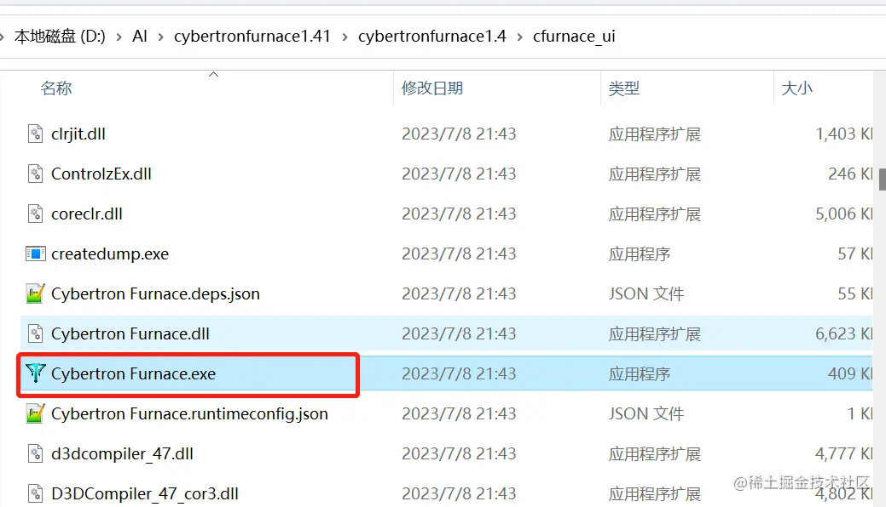

> 可以创建一个桌面快捷方式，这样就不用每次都要打开文件

看到这个页面就安装好了，点击“开启炼丹炉”就可以开始炼Lora啦！

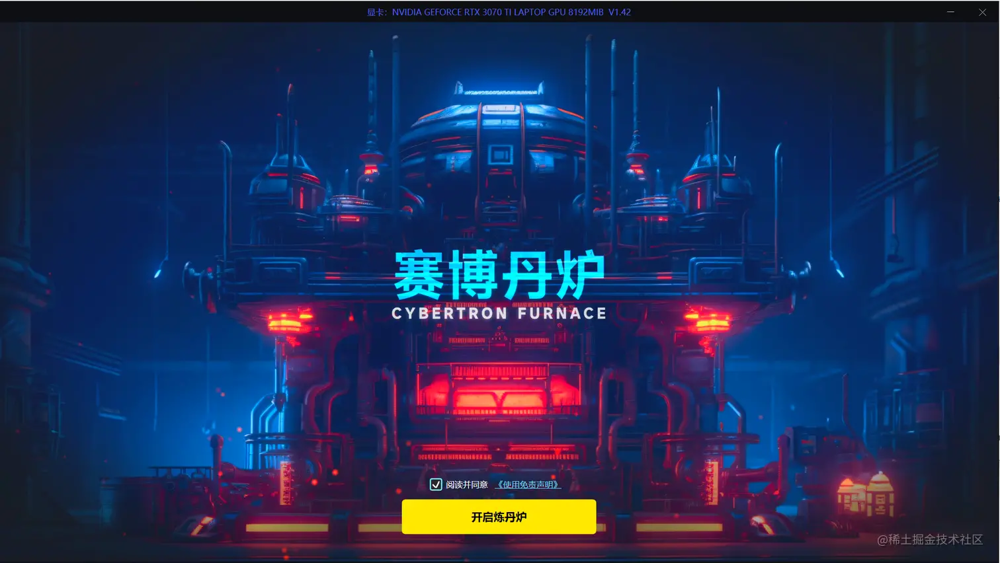

## 五、选择合适的大模型

跟画图一样，炼Lora之前也要先选一个大模型，确定Lora的画风

**这里训练的萌宠，我选择的是“cheeseDaddys_35”大模型**：

真人模型=》选用“chilloutmix”的大模型

二次元=》选用“anything”的大模型

如果你的Stable Diffusion里面没有模型，那就要先去下载模型噢！

网盘里面已经给大家放了这两个大模型

我用夸克网盘分享了「2.大模型checkpoint」

链接：[pan.quark.cn/s/9767ac274…](https://pan.quark.cn/s/9767ac274f83)

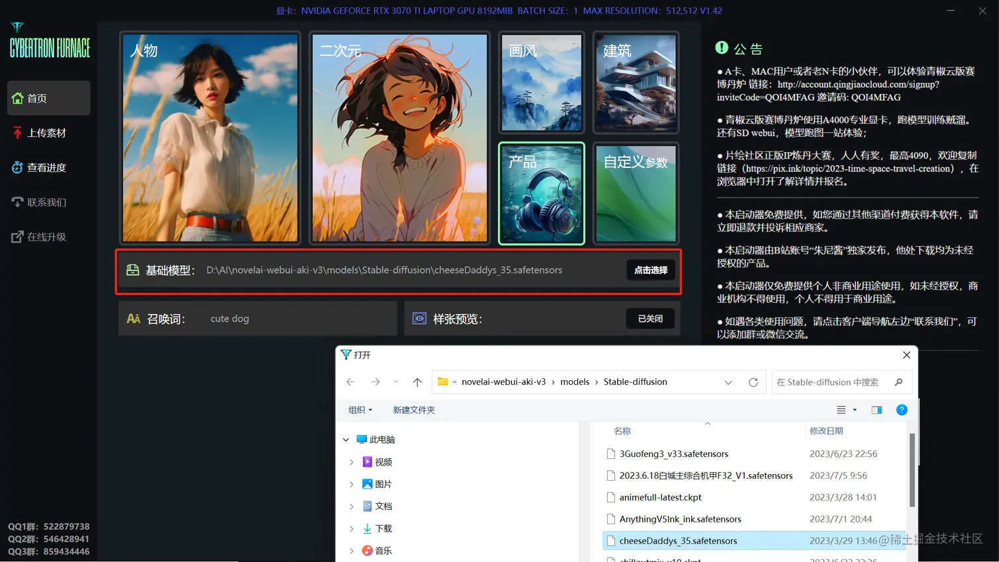

再往下就可以选择一个我们要训练的Lora的类型

选择之后就会帮我们选择默认的参数

训练真人Lora就选“人物”

训练二次元就选“二次元”

如果想炼绘画的风格可以选画风

除此之外还可以自定义去炼平面设计图或者建筑之类的

**我这里选择的是产品**：

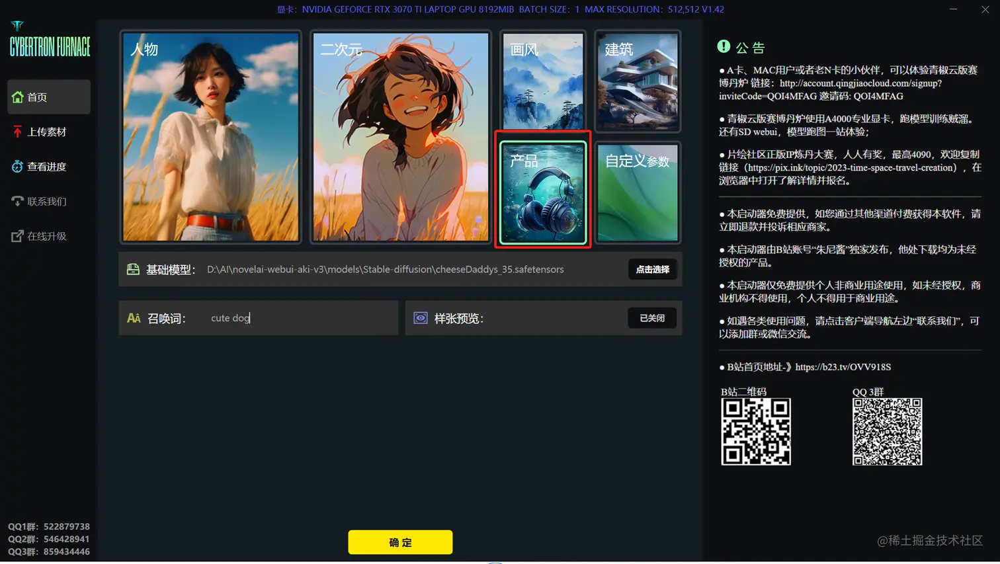

## 六、高质量素材的制作

以上准备工作及参数设置好了后，就可以开始上传自己的素材开始训练了。

这些素材就是我们要喂给AI学习的素材

素材的质量非常重要！！会直接影响最后出来的Lora的质量

我们的素材需要满足几个点：

**1.上传20~30张照片**：

**2.素材要高清！！！**：

**3.多角度照片**：

这里我就以炼萌宠Lora为例子，上传萌宠的照片

点击“删除全部”把默认的素材删掉

然后点击“上传素材”，上传自己的照片

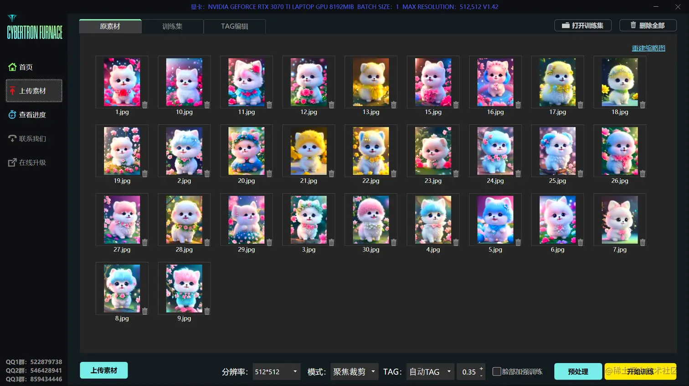

**一般情况下，下面的参数默认就可以了**：

需要调整参数的话，最好是需要了解参数的含义，如果乱调的话，可能会训练失败。

> 不要选择太高的分辨率，容易爆显存
>
> 另外，如果训练真人Lora，可以勾选最右边的“脸部加强训练”
>
> 勾选了之后就会再多裁剪出来一组只有脸的照片，这样AI能学到更多的脸部细节

## 七、耐心等待的训练过程

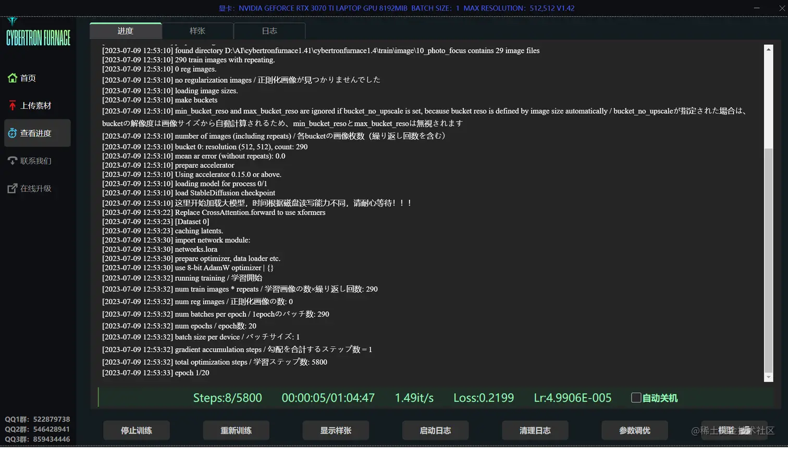

看到这个页面就是模型正在训练中

到这一步只要**耐心等待**就可以了，没什么需要操作的

我们可以看一下下面的参数是什么意思

“Steps”就是训练步数

每训练50步右下角就会出现一张图片

那样就可以实时看到Lora的样子

这个白头发和红裙子是后台加上去的关键词

可以测试Lora的泛化性

> 泛化性就是看这个Lora能不能自由的去更换照片里的东西，比如发型、发色、服装之类的

Loss可以用来参考模型的好坏

**一个好的模型Loss值在0.07~0.09之间**：

> 注意：具体好不好还是要在Stable Diffusion实际测试才知道

等训练完了之后，点击“模型”

就可以看到生成出来模型

按照默认参数训练会出来20个模型，但不是说最后一个模型就是最好的

有可能炼到第十六第是十七个模型就已经够了，再往后的模型就已经训练过度了

所以这些模型还要实际在SD测试一下，才知道哪个是最好的

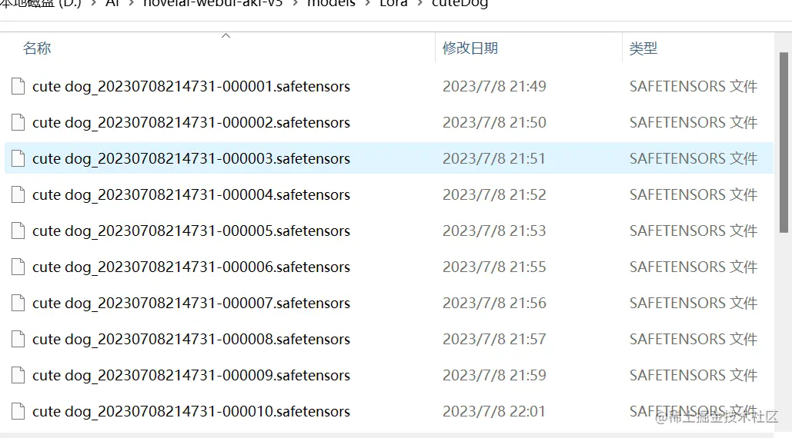

## 八、如何测试Lora的好坏

模型生成出来之后就可以到SD里面生成图片

在SD里面可以生成这么一张大图，可以直接看到所有模型在不同权重下出来的效果

比较一下哪个模型更好，就只保留那个模型就可以了

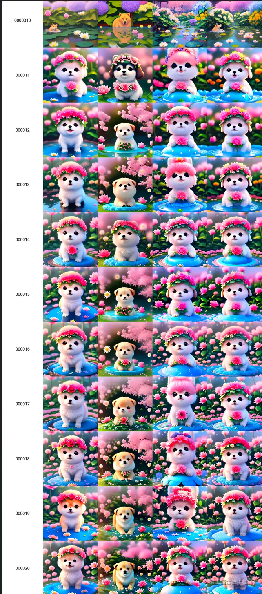

接下来我们就看看怎么生成这张大图

首先把新生成的10个模型复制到SD的models文件夹，放到Lora文件夹里面

> 注意：最好新建一个文件夹，比如cuteDog

然后把没有序号编码的那个Lora重命名

> 没有序号编码的Lora就是最后生成出来的一个模型，这里只是为了方便进行测试，统一一下所有模型的名称

保存好模型之后就可以打开SD进行测试了

首先先选一个大模型

你用哪一个大模型来训练lora就选哪个大模型

然后输入正面关键词和负面关键词

正面关键词可以输入一些质量词，比如最高质量、高清画质、大师杰作等等

负面关键词直接复制我们以前用过的就可以

接下来就是选用我们刚刚炼好的Lora

随便选一个都可以

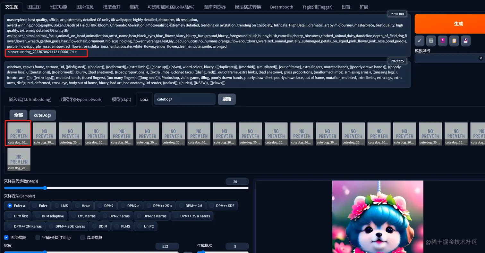

重点来了：把000017换成NUM，1换成STRENGTH

<lora:cute dog_20230708214731-000017:1>

例如：

<lora:cute dog_20230708214731-NUM:STRENGTH>

迭代步数，采样方法这些参数大家可以按照自己的习惯去修改

然后滑到最下面找到“脚本”

在脚本里面选择 “**X/Y/Z图表**”

X轴、Y轴类型都选择 “**提示词搜索/替换**”

X轴的值输入：NUM,000001,000002,000003,000004,000005,000006,000007,000008,000009,000010

> 这里的序号对应的就是我们10个Lora的编号

Y轴值输入：STRENGTH,0.1,0.2,0.3,0.4,0.5,0.6,0.7,0.8,0.9,1

> 这里的序号代表的是Lora的权重

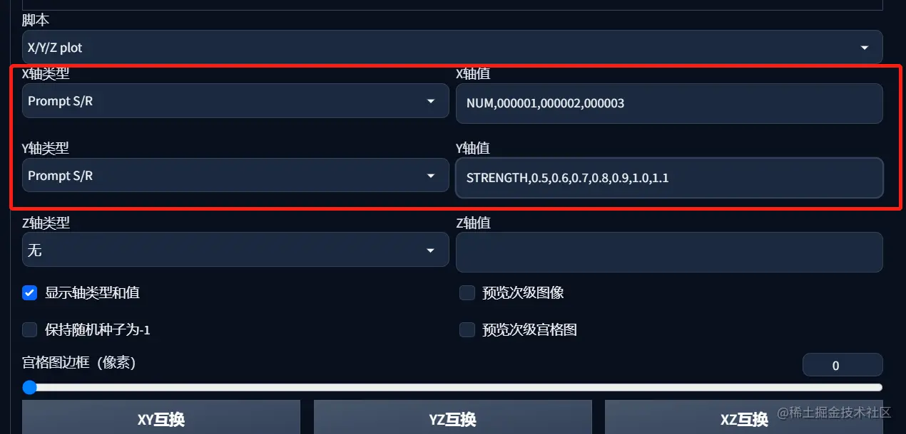

全部参数设置好了之后就可以点击“生成”

生成出来就是这么一张大图，可以看到这几个Lora模型在不同强度下的表现

## 九、如何优化Lora

实际上，炼丹是一件比较玄学的事

有的人可能一次性就能炼出自己满意的Lora

但有的人可能要炼好几次才出来一个好的Lora

这时候我们可以通过调整训练的参数再重新炼一个

**前提是 确保我们的喂给AI的素材是高质量的！**

不然不管怎么修改参数，出来的Lora都是不合格的

这里我们就把炼Lora会遇到的问题分成两种情况

1.Lora出来的照片不像本人：**AI没学好**

2.Lora过拟合，甚至出来的照片崩了：**AI学过头了**

过拟合就是不管输入什么关键词，出来的照片都是你喂给AI的照片

没办法自由控制人物的服装、发型、发色等

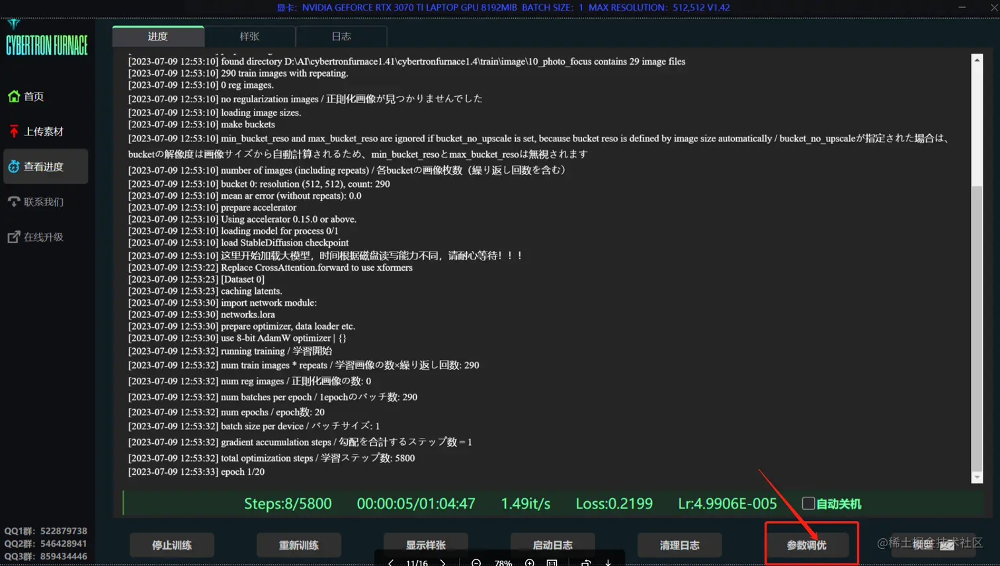

点击“参数调优”我们就可以自行设置参数

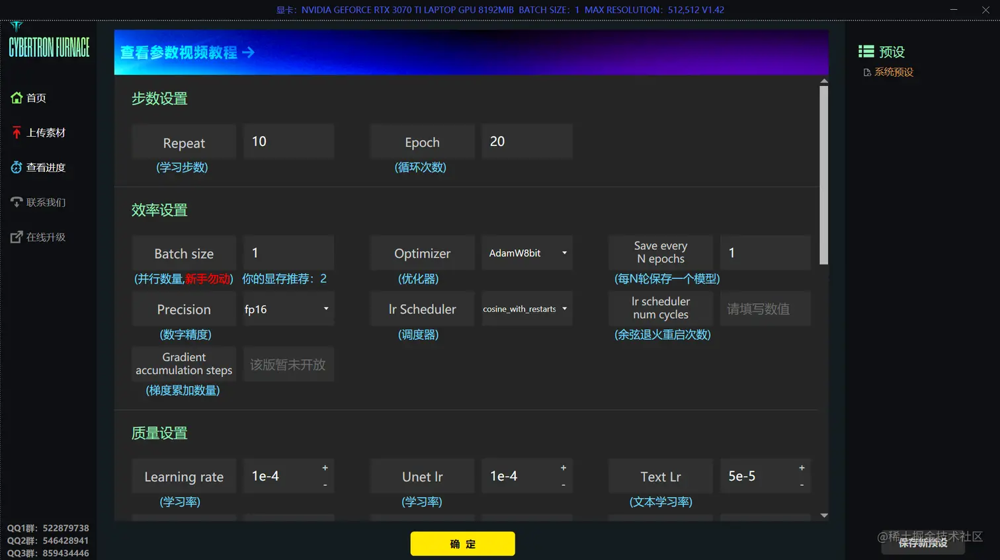

如果生成的照片不像本人，那就可以适当增加Repeat（学习步数）值

如果照片过拟合了，那就减少Repeat值

其他参数都可以不用调，因为默认的参数就差不多是最优值了

## 十、资源下载汇总

**Lora炼丹网盘资源汇总：** **[pan.quark.cn/s/3c8cc96f3…](https://pan.quark.cn/s/3c8cc96f3221)**

StableDiffusion资源整合安装包：[pan.quark.cn/s/2750beda9…](https://pan.quark.cn/s/2750beda9269)

StableDiffusion关键词分类查询：[StableDiffusion的关键词分类查询](https://y3if3fk7ce.feishu.cn/sheets/Wd2ZsLzTDh12LbtmlEgcp18Onjd)

ControlNet资料汇总：[pan.quark.cn/s/47bc8c798…](https://pan.quark.cn/s/47bc8c79892a)

AI资料网盘汇总（不定期更新）：[AI专区网盘资源汇总](https://y3if3fk7ce.feishu.cn/sheets/BIeAsn8IvhX3HUtcf84cFViinu3?table=tblTLSqLLvUznxAZ&view=vewP2B92zv)

AIGC从入门到精通教程汇总：[AIGC从入门到精通教程汇总](https://y3if3fk7ce.feishu.cn/docx/QBqwdyde7omVf4x69paconlgnAc)

原文链接阅读更舒服：[AI绘画：StableDiffusion炼丹Lora攻略-实战萌宠图片生成](https://y3if3fk7ce.feishu.cn/docx/YoabdC9ynoS7cSxRMLocPuldnAc)

## 如何从0开始训练一个高质量Lora模型

【Stable diffusion：lora模型篇，生成模型基础知识，看完就会，横扫C站，喂饭级，可还原任何作品。】<https://www.bilibili.com/video/BV1Tm4y117HK?vd_source=36c9491a7fa2ab8a22ca060af01b7472>

【Stable diffusion：万物皆可lora，生成自己的lora模型，喂饭级。】<https://www.bilibili.com/video/BV1Pu411t74w?vd_source=36c9491a7fa2ab8a22ca060af01b7472>

【【Ai教学】如何从0开始训练一个高质量Lora模型】<https://www.bilibili.com/video/BV1hs4y1M79K?vd_source=36c9491a7fa2ab8a22ca060af01b7472>

【【Ai教学】如何训练一个画风LoRA】<https://www.bilibili.com/video/BV1Kz4y1n7rF?vd_source=36c9491a7fa2ab8a22ca060af01b7472>

【【完美炼丹术，差异炼丹法】最新LoRA训练进阶教程10】<https://www.bilibili.com/video/BV11m4y147WQ?vd_source=36c9491a7fa2ab8a22ca060af01b7472>

BIRME - 调整多个图像的大小（在线和免费） (onlinephotosoft.com)

打标软件：BooruDatasetTagManager

日志查看：TensorBoard

### 训练的参数调整设置

## Stable Diffusion模型

- [【AI绘画】全网Stable Diffusion WebUI Model模型资源汇总（自用） - 哔哩哔哩 (bilibili.com)](https://www.bilibili.com/read/cv20039815)
- [出图效率倍增！47个高质量 Stable Diffusion 常用模型推荐 - 哔哩哔哩 (bilibili.com)](https://www.bilibili.com/read/cv23887580)

### 其他Model|模型资源

**社群免费图文版SD资料库**：

该资料库复覆盖的范围很广，包括部署、基本的操作、模型、插件、等，可以把它当成一个资料库来查阅。

学习地址：[tob-design.yuque.com/kxcufk/sd](https://tob-design.yuque.com/kxcufk/sd)

使用注意：

- 与ckpt文件同名的vae.pt文件用于稳固该模型的表现，直接放在相同文件夹即可。训练时将该文件改名或移走。并不是所有模型都需要使用vae文件。
- 公开资源：
  - <https://rentry.co/sdmodels>（目前觉得比较全）
  - <https://cyberes.github.io/stable-diffusion-models/>（SD模型）
  - <https://publicprompts.art/>（App Icon Generator，比较有趣想资源）
  - <https://huggingface.co/> （在网站中检索）
  - <http://aimodel.subrecovery.top>
  - <https://docs.qq.com/doc/DY0lFeWZuVXRCdUJU>
  - <http://www.123114514.xyz/models/ckpt>（挺多私炉的）

- 【Stable Diffusion怎么做小说推文的出图讲解第一期】<https://www.bilibili.com/video/BV1Vs4y1w7kH?vd_source=36c9491a7fa2ab8a22ca060af01b7472>
- 【Stable Diffusion怎么做小说推文的出图讲解第二期：抄作业大战】<https://www.bilibili.com/video/BV1Eu41147wv?vd_source=36c9491a7fa2ab8a22ca060af01b7472>
- 【Stable Diffusion小说推文实战讲解第三期：如何利用GPT制作分镜，并批量高效率出图。】<https://www.bilibili.com/video/BV1W14y1D7QG?vd_source=36c9491a7fa2ab8a22ca060af01b7472>
- 【指定形象生成多人场景，Stable Diffusion小说推文实战讲解第四期。】<https://www.bilibili.com/video/BV1qV4y1m7sS?vd_source=36c9491a7fa2ab8a22ca060af01b7472>

【Stable Diffusion+Midjourney强强联手出梦幻酷图】<https://www.bilibili.com/video/BV1aX4y1q7Rh?vd_source=36c9491a7fa2ab8a22ca060af01b7472>

将 2D 转为 3D 模型：

设计类AI大模型：<https://civitai.com/user/laizhende/models>

【AI绘画｜赛博修仙-御水之术】<https://www.bilibili.com/video/BV1Kh4y1o7Hs?vd_source=36c9491a7fa2ab8a22ca060af01b7472>

- 模型：基于majicmixSombre的魔改
- LORA：Detail Tweaker，hanfu 汉服，Zhongfenghua-style
- 基本步骤：mj跑底图-sd配合tile增加细节-ps修bug-sd配合tile放大到4k

搜索 chocolae

使用教程：【Stable Diffusion 何似在人间 仙侠模型发布 （适合小说插画、背景）】<https://www.bilibili.com/video/BV1Ph4y1X7ub?vd_source=36c9491a7fa2ab8a22ca060af01b7472>

4月AI绘画模型推荐榜：<https://mp.weixin.qq.com/s/ODdA6WsnbdTZkb-7OEZULw>

## 模型用处

[AI绘图StableDiffusion最强大模型盘点 - 诸神乱战 (qq.com)](https://mp.weixin.qq.com/s/bZ-_GyH8fUYTqfURPhA3pA)

[AI绘图StableDiffusion最棒LoRA模型盘点 - 小样也能出奇迹 (qq.com)](https://mp.weixin.qq.com/s/Z7onNo09-7--9eGrbPe0wA)

基础款AI生图模型checkpoint：

- 墨幽人造人：脸部模型固定
- AWPainting 1.1：日漫风格
- 国风3 GuoFeng3：汉服，国画，lora
- majicMIX系列：人造机器人，颜控福音

上次**图生图**的文章中也是使用的这些模型，这次直接使用**文生图**。

| 模型                                   | 介绍                                           |
| -------------------------------------- | ---------------------------------------------- |
| 2dn_1                                  | 动漫模型                                       |
| 3Guofeng3_v32Light                     | 中国、国风模型，感觉上偏3D国漫                 |
| anything-v4.5-pruned                   | 说是里面东西很多很杂                           |
| CamelliaMix_2.5D                       | 2.5D模型                                       |
| camelliamix_v20                        | 动漫模型                                       |
| chilloutmix_NiPrunedFp32Fix            | 真人模型，这个主要针对亚洲人训练的，热度比较高 |
| Dalcefo_v4_Painting                    | 动漫模型                                       |
| dalcefoPainting_3rd                    | 动漫模型，色彩比较淡                           |
| dalcefoRealistic_v2                    | 真人模型                                       |
| dreamshaper_4BakedVae                  | 动漫模型，有点3D的感觉                         |
| grapefruitHentaiModel_grapefruitv41    | 动漫模型，这个热度高                           |
| meinamix_meinaV8                       | 动漫复合模型                                   |
| openjourney-v4                         | 动漫模型，有些3D的意思                         |
| povSkinTexture_povSkinTextureDreamlike | 真人模型，很少用                               |
| realisticVisionV13_v13                 | 真人模型，很少用                               |
| realisticVisionV20_v20                 | 真人模型，很少用                               |

SDXL 0.9 demo：<https://github.com/lifeisboringsoprogramming/sd-webui-xldemo-txt2img>

SDXL Model huggingface :

- <https://huggingface.co/stabilityai/stable-diffusion-xl-base-0.9>
- <https://huggingface.co/stabilityai/stable-diffusion-xl-refiner-0.9>

## 模型训练器

【【AI绘画】模型训练器发布！简单又不失专业的LoRA模型训练一键包】<https://www.bilibili.com/video/BV1AL411q7Ub?vd_source=36c9491a7fa2ab8a22ca060af01b7472>

- AutoDL 云端使用教程：<https://www.bilibili.com/read/cv24050162>

具体的训练操作步骤：【【AI绘画】最佳人物模型训练！保姆式LoRA模型训练教程 一键包发布】<https://www.bilibili.com/video/BV1fs4y1x7p2?vd_source=36c9491a7fa2ab8a22ca060af01b7472>

## 模型训练|LoRA炼丹秘籍

LoRA训练文章四部曲链接：

- 【AI绘画进阶篇】喂饭级LoRA模型训练包安装教程 <https://www.bilibili.com/read/cv23746330>
- 【AI绘画进阶篇】（手把手教你炼丹）喂饭级LoRA模型训练教程(上) <https://www.bilibili.com/read/cv23640309>
- 【AI绘画进阶篇】（手把手教你炼丹）喂饭级LoRA模型训练教程(下) <https://www.bilibili.com/read/cv23684137>
- 【AI绘画进阶篇】使用XYZ脚本生成对比图进行LoRA模型测试教程 <https://www.bilibili.com/read/cv23572456>

教程：【可能是全网最快的LoRA模型训练教程（一），快来训练你的渡鸦小姐姐LoRA模型吧！】<https://www.bilibili.com/video/BV1Ms4y1k7eH?vd_source=36c9491a7fa2ab8a22ca060af01b7472>

[云服务上进行Lora训练(俗称炼丹)👗👗👗 - 掘金 (juejin.cn)](https://juejin.cn/post/7225474060423561274)

[Stable Diffusion Lora训练实践（云端训练篇） - 掘金 (juejin.cn)](https://juejin.cn/post/7233261440501563451)

【全网还原度最高的真人LORA训练方法！】<https://www.bilibili.com/video/BV18X4y1t7jn?vd_source=36c9491a7fa2ab8a22ca060af01b7472>

【AI模特~lora训练~穿指定衣服~】<https://www.bilibili.com/video/BV1VT411t7Na?vd_source=36c9491a7fa2ab8a22ca060af01b7472>

【如何训练一个非常像的真人Lora模型（深度探讨）】<https://www.bilibili.com/video/BV1Ba4y1M7LD?vd_source=36c9491a7fa2ab8a22ca060af01b7472>

【Stable Diffusion 建筑设计工作流（第二季）—秋叶lora脚本训练UI介绍/Tag批量修改更新】<https://www.bilibili.com/video/BV1jk4y1x7X4?vd_source=36c9491a7fa2ab8a22ca060af01b7472>

- Bytorch官网学习：<https://pytorch.org/tutorials/>
- Tag批量修改插件原网址：<https://github.com/starik222/BooruDatasetTagManager>
- 插件和课件百度网盘链接：<https://pan.baidu.com/s/1nVcKpS6OL0VOvyq8zEs8gg?pwd=wrfn>    提取码：wrfn

[炼丹！训练 stable diffusion 来生成LoRA定制模型 - 掘金 (juejin.cn)](https://juejin.cn/post/7215496238627209272)

[AI绘画：Stable Diffusion 终极炼丹宝典：从入门到精通(feishu.cn)](https://y3if3fk7ce.feishu.cn/docx/KqEMdhJigoFY8fxc9TPcwMninKf)

### LoRA训练 Part1 图片准备与批量裁切

1.收集整理你想训练的人物模型的人脸画像五官清晰的各种角度的图片20-50张，然后把这些图片批量裁切，成分辨率512乘以512的图片

2.打开Stable Diffusion 找到【训练】-【图像预处理】，粘贴图片所在的文件夹位置，再指定输出位置，勾选【自动面部焦点裁切】，然后点击【预处理】，便开始裁切，等待裁切完成。

### LORA训练 Part2 图片提示词批量反推

1.来到【WD 1.X 标签器(Tagger)】-【批量处理文件夹】，输入目录和输出目录都填入图片所在位置路径，然后点击“反推提示词“，便可以看到图片文件夹里多了txt文本文档，打开txt文本文档之后就可以看到自动反推出的提示词

2.接着对这些提示词进行批量打标(tag)操作：先安装【数据集标签编辑器】插件，【扩展】里搜索搜索【Dataset Tag Editor】来安装这个插件。

3.安装完成后会在顶部tab有了【Dataset Tag Editor】选项，填入【数据集目录】，然后点击【加载】，把图片加载进来

4.然后来到右边的tab【批量编辑描述】-【移除】tab页面。。。。。

## LoRA模型

[‍‌⁤⁤⁣‌‬⁡⁢⁡‌‬‌‬⁡⁤‍‌⁡‌⁢‬⁤⁤⁣⁣‍‍⁤‬‍⁣⁣‬‬‍AI绘画：Stable Diffusion 终极炼丹宝典：从入门到精通 - 飞书云文档 (feishu.cn)](https://y3if3fk7ce.feishu.cn/docx/KqEMdhJigoFY8fxc9TPcwMninKf)

[AI绘画：StableDiffusion炼丹Lora攻略-实战萌宠图片生成 - 掘金 (juejin.cn)](https://juejin.cn/post/7253434752837566501)

## 二、Lora作用

LORA可以让我们轻松画出特定的人物，物品，特殊的笔触和特殊的画风或风格，属于一种特殊训练的子集。

### 1.AI模特

炼出一个自己的模特，让这个模特穿上自己的商品

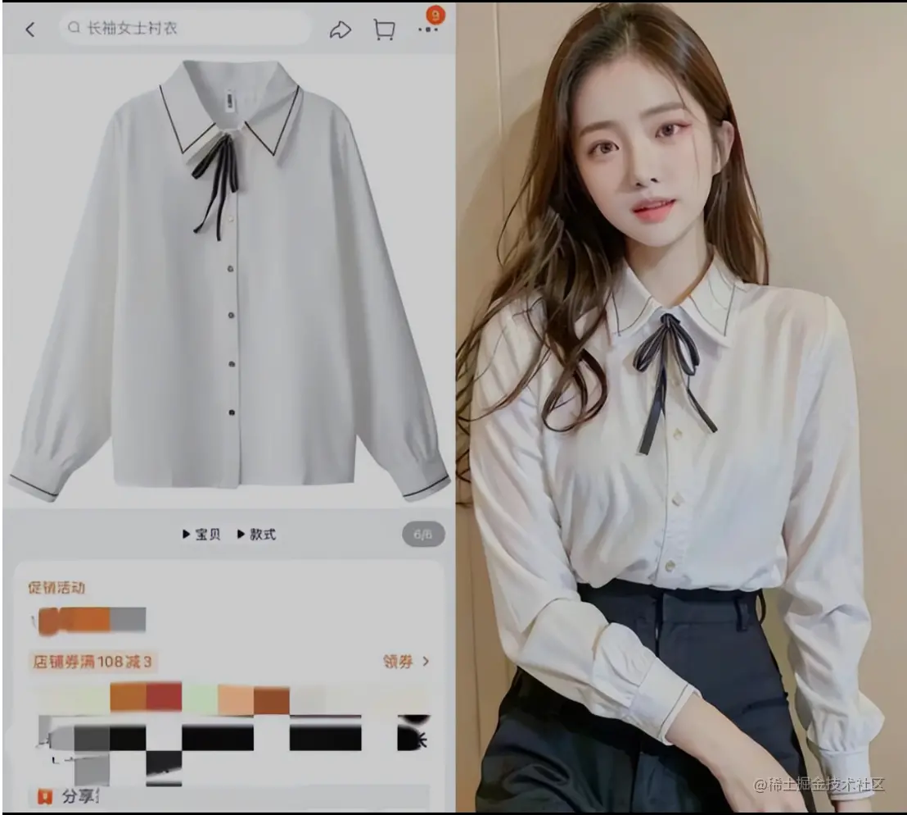

### 2.炼衣服Lora

添加一个衣服的Lora，就可以让人物穿上特定的衣服

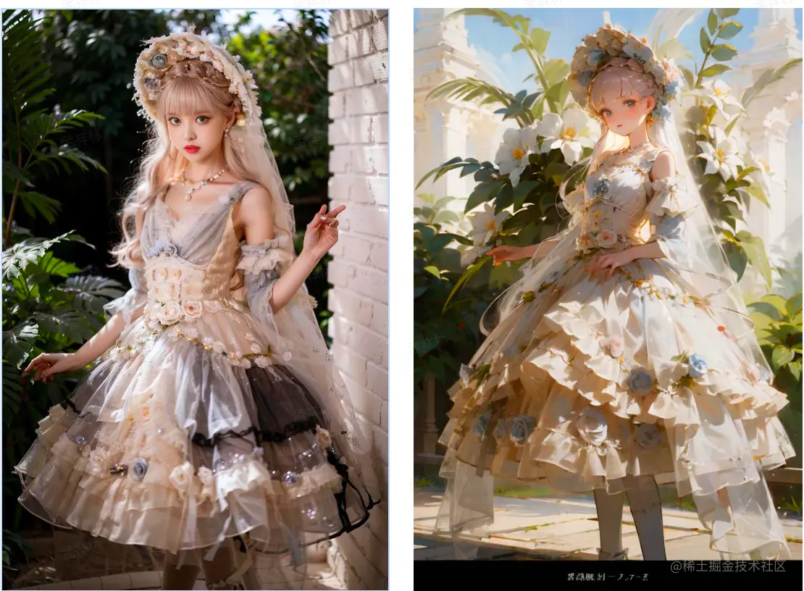

### 3.改变画风/画面背景

通过添加Lora改变照片的画风，这个画风可以自己去训练

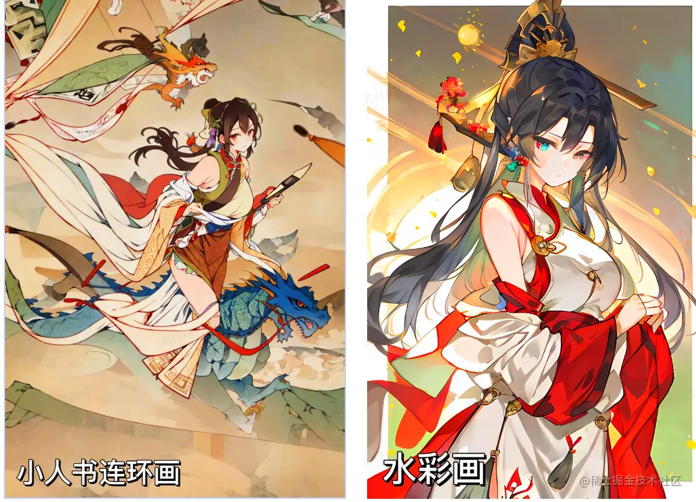

### Lora模型究竟是什么？

**专业的解释**：

LoRA的全称是[LoRA: Low-Rank Adaptation of Large Language Models](https://arxiv.org/abs/2106.09685)，可以理解为stable diffusion（SD)模型的一种插件，和hyper-network，controlNet一样，都是在不修改SD模型的前提下，利用少量数据训练出一种画风/IP/人物，实现定制化需求，所需的训练资源比训练SD模要小很多，非常适合社区使用者和个人开发者。LoRA最初应用于NLP领域，用于微调GPT-3等模型（也就是ChatGPT的前生）。由于GPT参数量超过千亿，训练成本太高，因此LoRA采用了一个办法，仅训练低秩矩阵（low rank matrics），使用时将LoRA模型的参数注入（inject）SD模型，从而改变SD模型的生成风格，或者为SD模型添加新的人物/IP。

**通俗的解释**：

Lora可以**复刻人物和物品的特征，固定人物动作，改变照片画风**

而且Lora只需要少量的数据就可以训练出来，比训练大模型要简单很多

所以大家可以通过训练自己的Lora，做出定制的图片

但不得不说的是，目前的Lora还不能做到100%相同，尤其是细节方面

但是相信随着之后的技术发展，万物皆可Lora的时代是不远的

## 三、如何炼制自己的Lora模型？

炼制Lora的方式有很多种

有用脚本训练的，也有在网站界面上训练的，最近还有很多朋友做出来了训练Lora的整合包

创建Lora模型的方式有许多，包括通过脚本进行训练，通过网页界面操作，甚至有一些专业人士最近提供了Lora训练的一键式整合包。尽管这些方法在表面上看起来有所不同，但其训练逻辑其实都是相同的。

因此，我们可以选择使用整合包。整合包的优点在于，它将炼丹所需的所有工具和步骤集成在一款软件中，为我们提供了一种更为便捷且有效的训练方式。

> 整合包就是把炼丹所需要的所有工具都整合到一个软件里

炼丹分为以下几步：

1.下载整合包

2.准备工作

3.开始训练

4.测试Lora

5.优化Lora
