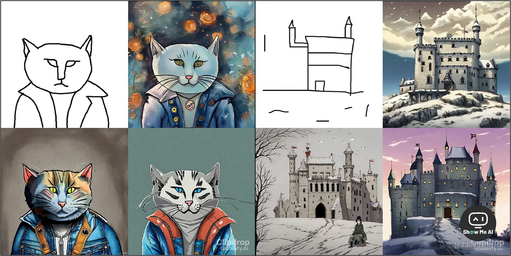

# Stability AI公司

## 🤖 Stability AI 发布 Stable Doodle，将草图转换为图像

> 工具地址：[Clipdrop - Stable Doodle](https://clipdrop.co/stable-doodle)

7月13日，StabilityAI在官方博客宣布推出 Stable Doodle，可以使用人工智能技术，将手绘草图转换为高清图像，并支持选择多种风格。

Stable Doodle 旨在提供更准确、更稳定的草图转图像功能，使用户能够轻松将想法转化为可视化图像 [**⋙ StabilityAI Blog**](https://stability.ai/blog/clipdrop-launches-stable-doodle)