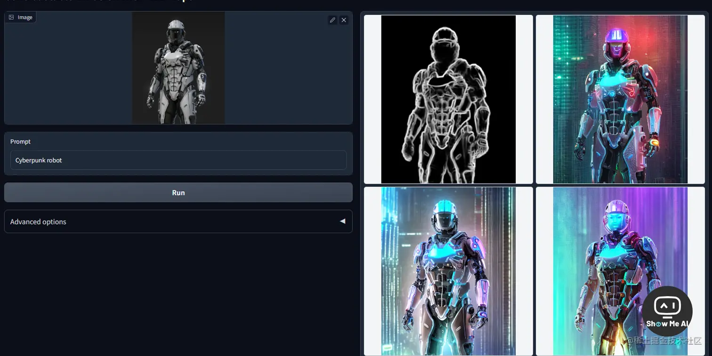

# ControlNet 条件控制

[Stable Diffusion入侵短视频，华人导演玩得太6，小扎都来请她 - 知乎 (zhihu.com)](https://zhuanlan.zhihu.com/p/581796145)

## 『关于 ControlNet 的一切』原理 & 代码 & 教程，20+最精华内容汇总

最近 ControlNet 势头很猛，补齐了Stable Diffusion 条件控制这块短板，实现了人体姿势、图像边缘、深度图、语义色块图、法线图等多种方式对生成的图像进行精确控制，往无缝融入生产工作流又迈进了一大步。这里汇总了目前看到的关于ControlNet的一切：

### 🔔 原理说明

> **项目与使用简介**：[mp.weixin.qq.com/s/UfWNIknn7…](https://mp.weixin.qq.com/s/UfWNIknn7h-JaiNNmLPybQ)
>
> **从玩具变成生产利器**：[mp.weixin.qq.com/s/n0YznjSnc…](https://mp.weixin.qq.com/s/n0YznjSncYPkI93RpYxcRg)

### 🔔 程序及代码

> **官方Github**：[github.com/lllyasviel/…](https://github.com/lllyasviel/ControlNet)
>
> **网页试玩demo**：[huggingface.co/spaces/hyst…](https://huggingface.co/spaces/hysts/ControlNet)
>
> **ControlNet stable diffusion webui automatic111插件**：[github.com/Mikubill/sd…](https://github.com/Mikubill/sd-webui-controlnet)
>
> **ControlNet video 代码（runway gen1视频编辑平替）**：[github.com/camenduru/f…](https://github.com/camenduru/fffilonis-controlnet-video)
>
> **ControlNet video 网页试玩**：[huggingface.co/spaces/fffi…](https://huggingface.co/spaces/fffiloni/ControlNet-Video)
>
> **新功能上线说明（无需文字引导，纯图片猜测生成）**：[mp.weixin.qq.com/s/10W6bIhPQ…](https://mp.weixin.qq.com/s/10W6bIhPQJ4aQafv_MaW9A)
>
> **ControlLoRA，一个能够控制Stable Diffusion空间信息的轻量神经网络，不需额外安装controlnet，使用Lora文件即可实现条件控制**：[github.com/HighCWu/Con…](https://github.com/HighCWu/ControlLoRA)
>
> **T2I-Adapter，一个类似ControlNet的算法，同样可以对SD生成的图片进行条件控制**：[github.com/TencentARC/…](https://github.com/TencentARC/T2I-Adapter)

### 🔔 教程及案例

> **初学者使用指南 (英文版)**：[www.reddit.com/r/StableDif…](https://www.reddit.com/r/StableDiffusion/comments/1167j0a/a_guide_for_beginners_on_a_controlnet_workflow/)
>
> **初学者使用指南 (中文版)**：[mp.weixin.qq.com/s/wAC_Mr_Ya…](https://mp.weixin.qq.com/s/wAC_Mr_YarV3seoM_0dLQA)
>
> **ControlNet SD webui 111插件安装**：[www.bilibili.com/video/BV1jM…](https://www.bilibili.com/video/BV1jM411c7ev/)
>
> **如果无法自动安装插件请看这里**：[www.bilibili.com/video/BV1RD…](https://www.bilibili.com/video/BV1RD4y1A7Cb/)
>
> **如何和具体应用场景结合**： [mp.weixin.qq.com/s/ylVbqeeZc…](https://mp.weixin.qq.com/s/ylVbqeeZc7XUHmrIrNmw9Q)
>
> **生成清晰的艺术字体**：[www.reddit.com/r/StableDif…](https://www.reddit.com/r/StableDiffusion/comments/119j8qr/clear_text_using_controlnet/) 👉 [**Simon的白日梦**](https://mp.weixin.qq.com/s/Rf3_MBK6wTg6lUr0In9xlA)

## 文案改写及AI绘画提示词

文案改写及AI绘画提示词网站：<https://888ai.net>

Stable Diffuion提示词工具：<https://poe.com/JJgeSD>

Midjourney提示词工具：<https://poe.com/JJgeMJ>

如：

- 给我一段室内客厅设计图的提示词
- 给我一段自然风光提示词，包含山川，河流，高山，峡谷

## ControlNet 目前最全面的资源合集

最近 ControlNet 势头很猛，补齐了 stable diffusion 条件控制这块短板，实现了人体姿势、图像边缘、深度图、语义色块图、法线图等多种方式对生成的图像进行精确控制，往无缝融入生产工作流又迈进了一大步。

**程序代码**：

> - **官方github**：[lllyasviel/ControlNet: Let us control diffusion models! (github.com)](https://github.com/lllyasviel/ControlNet)
> - **网页试玩demo**：[ControlNet - a Hugging Face Space by hysts](https://huggingface.co/spaces/hysts/ControlNet)
> - **ControlNet stable diffusion webui automatic111插件**：[Mikubill/sd-webui-controlnet: WebUI extension for ControlNet (github.com)](https://github.com/Mikubill/sd-webui-controlnet)
> - **ControlNet video 代码（runway gen1视频编辑平替）**：[camenduru/fffilonis-controlnet-video (github.com)](https://github.com/camenduru/fffilonis-controlnet-video)
> - **ControlNet video 网页试玩**：[ControlNet-Video - a Hugging Face Space by fffiloni](https://huggingface.co/spaces/fffiloni/ControlNet-Video)
> - **新功能上线说明（无需文字引导，纯图片猜测生成）**：[ControlNet 今日上线压轴新功能：猜测模式/非提示模式 (qq.com)](https://mp.weixin.qq.com/s/10W6bIhPQJ4aQafv_MaW9A)

**案例教程**：

> - **ControlNet SD webui 111插件安装**：[【AI绘画爱好者的福音插件】ControlNet安装与使用归纳教程_哔哩哔哩_bilibili](https://www.bilibili.com/video/BV1jM411c7ev/?vd_source=5f0c99b3deddffe219938763769b15ac)](<https://www.bilibili.com/video/BV1jM411c7ev>)
> - **如果无法自动安装请看这个**：[stable diffusion webui无法安装扩展插件的解决方法_哔哩哔哩_bilibili](https://www.bilibili.com/video/BV1RD4y1A7Cb/?vd_source=5f0c99b3deddffe219938763769b15ac)
> - **初学者使用指南**：[ControlNet 工作流程初学者指南 (qq.com)](https://mp.weixin.qq.com/s/wAC_Mr_YarV3seoM_0dLQA)
> - **如何与应用场景结合**：[精确控制 AI 图像生成的破冰方案，ControlNet 和 T2I-Adapter (qq.com)](https://mp.weixin.qq.com/s/ylVbqeeZc7XUHmrIrNmw9Q)
> - **生成清晰的艺术字体案例**：[ww.reddit.com](https://ww.reddit.com/r/StableDiffusion/comments/119j8qr/clear_text_using_controlnet/)
