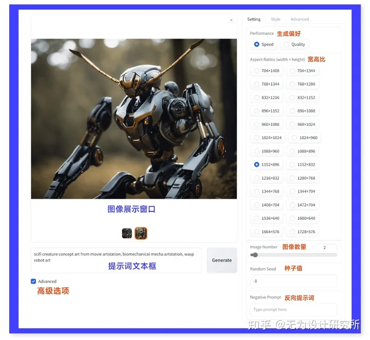
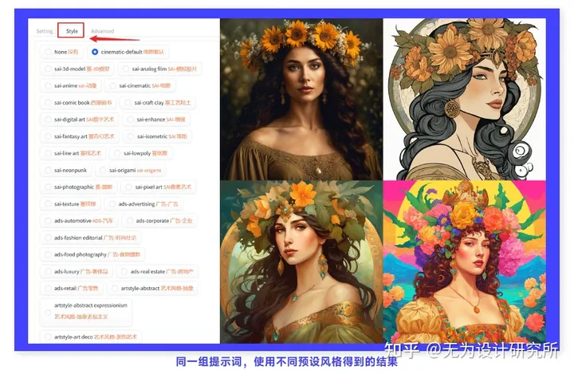
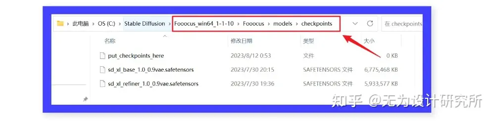
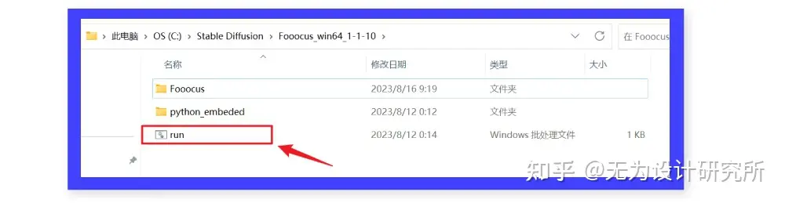
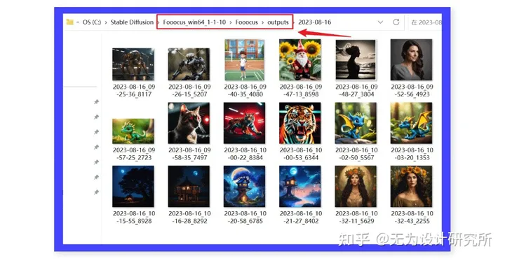
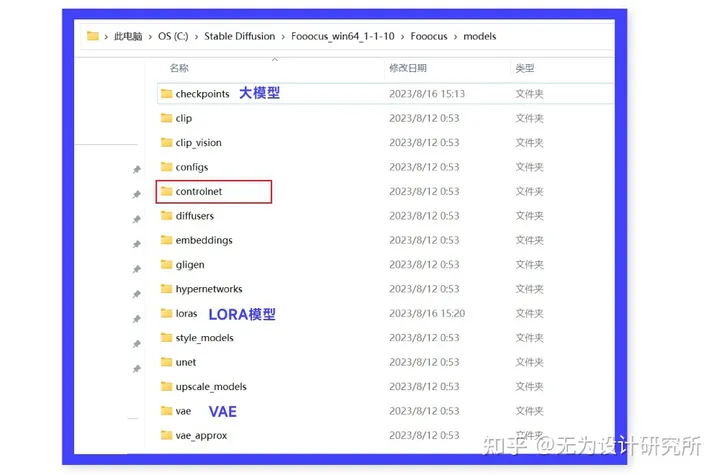

# Fooocus介绍和安装使用

Controlnet 的作者 lllyasviel（张吕敏） 在 Github 上发布了一款全新的开源 AI 绘画工具 Fooocus，可以和 Stable diffusion WebUI 一样部署到本地免费使用，同时具备 midjourney 一样便捷的操作界面

## 一、Fooocus 介绍

开源地址：[lllyasviel/Fooocus: Focus on prompting and generating (github.com)](https://github.com/lllyasviel/Fooocus)

使用文档：[Fooocus Advanced · lllyasviel/Fooocus · Discussion #117 (github.com)](https://github.com/lllyasviel/Fooocus/discussions/117)

据官方界面介绍，Fooocus 是对 stable diffusion 和 Midjourney 设计的重新思考：一方面保留了 SD 的开源属性，可以部署到本地免费使用；另一方面在操作界面上向 midjourney 学习，省去了 WebUI 中复杂的参数调节，让用户可以专注于提示和图像。

下图就是 Fooocus 的操作界面。它的基础界面非常简单，只有图像展示窗口、正向提示词和生成按钮 3 项。勾选“Advanced”会弹出高级设置的窗口，可以调整画面宽高比、风格、图像数量、种子值、反向提示词、模型、lora 权重比值、图像锐利程度等。

我用多组不同的提示词进行了测试，Fooocus 的表现非常不错，即使不填写反向提示词，也能直接生成高质量的图像，这点给人的体验和 midjourney 非常类似。我的电脑是 8G 的显存，完成一张 1024*1024 分辨了图像的时间在 50s 左右；虽然不是极速，也在可接受的范围内。

### 在 Fooocus 内生成的图像

Fooocus 的 style 版块内包含了 100 多种不同的预设风格，涉及写实、胶片、电影质感、动漫、水彩、黏土、3D、等距、像素、霓虹、赛博朋克、波普、纸艺等各个方面，让用户可以轻松生成更多样、更具艺术性的图像。

Fooocus 之所以能完成这样高质量的图像生成任务，是因为它用的是最新推出的 SDXL 1.0 模型，可以通过简单的提示词生成各种风格的高质量图像。另外 Fooocus 的程序在设计的时候，就已经进行了大量的内部优化，提前调整好的各项参数，在减少用户操作的同时，也保证生成的图像质量是最佳的。

之前为大家介绍 SDXL 1.0 时，就说过它的图像生成质量与 midjourney 目前的 v5.2 模型不相上下，没想到这么快就有一款工具把 SDXL 1.0 变成“本地化的 midjourney”了，开源领域所蕴含的潜力和创造力实在让人惊喜。

## 二、Fooocus 的安装

下载 2 款 SDXL 1.0 模型： [https://www.uisdc.com/sdxl-1-0](https://www.uisdc.com/sdxl-1-0) （内有百度云盘链接）

本地部署 Fooocus 对电脑设备有一定要求，需要 8GB 的内存和 4GB 的 Nvidia 显卡，但是整个过程非常简单，具体操作步骤如下：

①下载 Fooocus 安装包，解压到一个空间比较充足的磁盘中。

②点击上方链接，下载 SDXL 1.0 的 base 和 refiner 两款大模型，然后放到 Fooocus 根目录的 models/checkpoints 文件夹内（如果之前已经下载好了这 2 款模型，直接复制到 checkpoints 文件夹内即可）。

③点击运行 Fooocus 根目录的 run.bat 文件，会有一个后端控制窗口出现，等待相关内容加载完成，会在浏览器内看到一个新的 Fooocus 操作界面，就代表安装成功了。之后每次启动也都是点击这个 run.bat 文件。

Fooocus 启动成功后，直接在文本框内输入提示词，然后点击“Generate”按钮就可以生成图像了。勾选“Advanced”可以进行更多高级设置。 生成好的图像会自动保存在根目录的 outputs 文件夹内。

Fooocus 根目录的 models 文件夹内很多内容和 SD WebUI 都是相似的，用于放置 checkpoints、lora、Vae 等各种模型。 如果你有下载其他基于 SDXL1.0 训练的风格化大模型或者 lora 模型，同样可以放进对应的文件夹，然后在 Fooocus 中使用。

Fooocus 内还有一个 contronet 的文件夹，不知道作者未来是否会在界面中增加相关的功能。如果有的话，那 Fooocus 就很有可能成为 SD WebUI、ComfyUI 之后，另一个值得关注的开源 AI 绘画工具了，期待它之后的发展。

