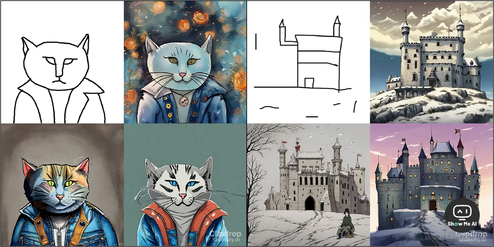

# Stability AI公司

## Stability AI开放 AI 图像生成平台 StableStudio

上个月 19 号，Stability AI 开源大语言模型 StableLM，模型的 Alpha 版本有 30 亿和 70 亿参数，并支持商用。

过去仅一个月，Stability AI 再次宣布，开放 AI 图像生成平台 **StableStudio**！真的是一个月放一次大招...

作为 DreamStudio 的开源版实现，StableStudio可在线完成 AI 图像生成、编辑、修复等工作。

未来还将加入 AI 聊天机器人、插件系统、桌面应用、WebGPU 本地推理、ControlNet 工具等新特性！

GitHub：https://github.com/Stability-AI/StableStudio


该项目的安装与使用也比较简单，下面讲下具体安装流程。

### 安装 & 使用

首先，克隆该项目到本地，并进入文件夹：

```bash
git clone https://github.com/Stability-AI/StableStudio.git
 cd StableStudio
```

然后安装 yarn 依赖，并运行本地服务器：

```bash
yarn

yarn dev
```

项目运行成功后，在网页访问地址（端口默认为 3000）：localhost:3000

到这一步，证明项目已成功部署。

如果要使用 AI 绘图功能，你需要配置下 DreamStudio API Key。

DreamStudio 是 Stability AI 旗下的一个 AI 图像生成平台，每个新注册的账户，会赠送 25 个积分。

> PS：1000 个积分价格是 10 刀，可生成大约 5000 次图像，

DreamStudio 账号注册也比较简单，你可以直接使用 Google 账号授权登录：

登录地址：https://dreamstudio.ai/generate

成功注册登录后，到设置页面复制 API Key：

https://dreamstudio.ai/account

复制成功后，再去到 StableStudio 设置页面，将 Key 填入页面底部的输入框：

http://localhost:3000/settings

然后，你便可以在 Prompt 输入框中填写提示词，愉快的使用 StableStudio 了。

### 介绍

图像支持动漫、电影、朋克、科幻、像素艺术等多种风格，点击 Style 按钮即可展开查看。

StableStudio 默认用的是最新的图像生成模型 Stabile Diffusion XL (SDXL)，一个为企业客户打造的最新图像生成模型，擅长生成更加真实的照片级图像。

SDXL 能够产生比其前身 Stable Diffusion 2.1 更为详细的图像和构图，并具备以下功能：

- 更优秀的照片写实功能；
- 增强的图像合成和人脸生成；
- 丰富的视觉效果和令人惊叹的美学；
- 使用较短的提示来创建描述性图像；
- 生成清晰文本的能力更强；

除了基于文本生成图像，SDXL 还支持图生图、图像修复、图像风格扩展等功能。

## 🤖 Stability AI 发布 Stable Doodle，将草图转换为图像



> 工具地址：[Clipdrop - Stable Doodle](https://clipdrop.co/stable-doodle)

7月13日，StabilityAI在官方博客宣布推出 Stable Doodle，可以使用人工智能技术，将手绘草图转换为高清图像，并支持选择多种风格。

Stable Doodle 旨在提供更准确、更稳定的草图转图像功能，使用户能够轻松将想法转化为可视化图像 [**⋙ StabilityAI Blog**](https://stability.ai/blog/clipdrop-launches-stable-doodle)