# 文生图模型—SDXL

**教程**：[深入浅出完整解析Stable Diffusion XL（SDXL）核心基础知识 - 知乎 (zhihu.com)](https://zhuanlan.zhihu.com/p/643420260)

[Stable Diffusion 免费升级 SDXL 1.0，有哪些提升点？使用体验如何？ - 知乎 (zhihu.com)](https://www.zhihu.com/question/614318047/answer/3138692507)

[最强开源SDXL 1.0发布！质量拉满，超简单prompt一键生成 - 知乎 (zhihu.com)](https://zhuanlan.zhihu.com/p/646287166)

[文生图模型之SDXL原理 - 知乎 (zhihu.com)](https://zhuanlan.zhihu.com/p/642496862)

————————————————————————————————————————————

Stable Diffusion官方的Discord服务器中体验：[Stability AI](https://stability.ai/)，找到【Try SDXL On Clipdrop】按钮点击

SDXL体验直达地址(生图需要排队，要不就付费开会员)：[Clipdrop - Stable Diffusion](https://clipdrop.co/stable-diffusion)

- 模型地址：[Stability-AI/generative-models: Generative Models by Stability AI (github.com)](https://github.com/Stability-AI/generative-models)
- 官方代码：<https://github.com/Stability-AI/generative-models>
- 模型权重：<https://huggingface.co/stabilityai/stable-diffusion-xl-base-0.9>
- 技术报告：[SDXL: Improving Latent Diffusion Models for High-Resolution Image Synthesis](https://arxiv.org/abs/2307.01952)
- 博客：[ANNOUNCING SDXL 1.0 — Stability AI](https://stability.ai/blog/stable-diffusion-sdxl-1-announcement)

而且SDXL也已经集成在了huggingface的diffusers库中：[diffusers/pipelines/stable_diffusion_xl](https://github.com/huggingface/diffusers/tree/main/src/diffusers/pipelines/stable_diffusion_xl)

SDXL和之前的版本一样也是采用latent diffusion架构，但SDXL相比之前的版本SD 1.x和SD 2.x有明显的提升

## 介绍

2023年7月27日，AI绘图圈一个里程碑的日子。

这一天，Stability AI正式发布了下一代文生图模型—SDXL 1.0。官方声称，SDXL 1.0拥有目前所有开放式图像模型中最大的参数数量，采用了创新的新架构，包括一个拥有35亿参数的基础模型和一个66亿参数的优化模型。

在月初的时候，Stability AI放出了SDXL 0.9的试玩版，我进行了介绍，并讲解了当时支持SDXL 0.9的工具ComfyUI。

短短两周，最常用的Stable Diffusion工具WebUI迅速紧跟升级，对SDXL 0.9进行了支持（事实上，0.9和1.0区别不大，所以1.0发布后，WebUI就支持1.0了）。

在SDXL1.0发布后几小时，WebUI也跟着做了个版本号更新，升级为1.5.1。

SDXL 1.0的试用非常简单，只需要把两个大模型文件拷贝到models\Stable-diffusion 即可（同时需要专用的VAE模型，文末附下载）。

经过简单的试用，发现有些插件需要等待升级。

## 特点

简单总结下SDXL1.0的特点：

1、绝大多数lora都无法在SDXL1.0的模型下使用。

也就是说，如果使用SDXL1.0的模型，提示词里不要出现lora。

当然了，很多模型创作者正在连夜改模型，预计很快将涌现出一大批支持SDXL1.0的新模型。

2、SDXL1.0的模型对自然语言的理解能力远远大于Stable Diffusion 1.5。

在Stable Diffusion1.5下，我们往往需要用各种复杂的提示词来强调画面的细节，甚至还要给出特定的权重。而SDXL1.0能够轻松的理解自然语言。

可以直接输入句子（英文），然后绘制出惊喜的效果。

3、SDXL1.0绘制的画面细腻程度非常高。

如果是照片模式（比如输入相机参数），则画面逼近真实拍摄。

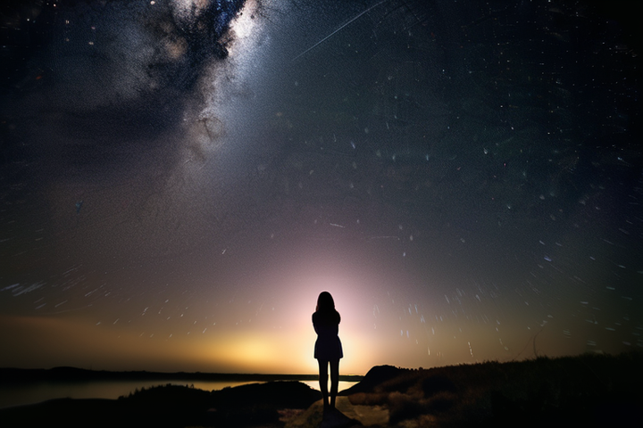

4、修脸的After Detailer插件支持SDXL1.0。

5、Roop插件支持SDXL1.0。

6、ControlNet暂不支持SDXL1.0。

不过，官方放出了正在适配中的新版ControlNet的预览效果，非常惊艳。

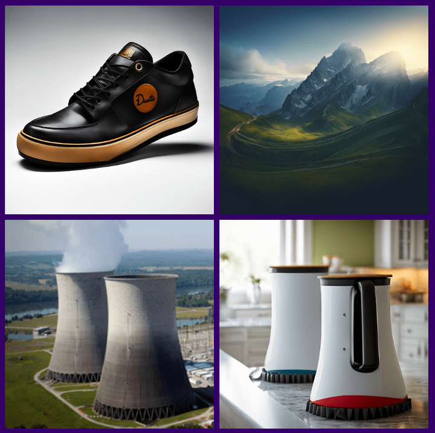

## 使用

目前能够加载Stable Diffusion XL模型并进行图像生成的框架有四种：

1. ComfyUI框架：<https://github.com/comfyanonymous/ComfyUI>
2. automatic框架：
3. Stable Diffusion WebUI框架：<https://github.com/AUTOMATIC1111/stable-diffusion-webui>
4. diffusers框架：<https://github.com/huggingface/diffusers>

SDXL1.0绘图赏析：

（1）弹吉他的男人

提示词：

```bash
Canon 6D, 35mm, standing in the sunset of the city, smiling and playing the guitar as a man , HDR,UHD,8K, best quality
```

负面提示词：

```bash
nsfw,logo,text,badhandv4,EasyNegative,ng_deepnegative_v1_75t,rev2-badprompt,verybadimagenegative_v1.3,negative_hand-neg,mutated hands and fingers,poorly drawn face,extra limb,missing limb,disconnected limbs,malformed hands,ugly,FastNegativeV2,aid291,NegfeetV2
```

作为一个摄影师，我比较喜欢用相机参数，发现SDXL1.0对相机参数理解蛮到位。


（手指依然画的很糟糕）

（2）一个夹鸡蛋的牛肉汉堡

提示词：

```bash
Canon 6D, 35mm, HDR,UHD,8K, best quality ,A hamburger with beef and eggs in it
```

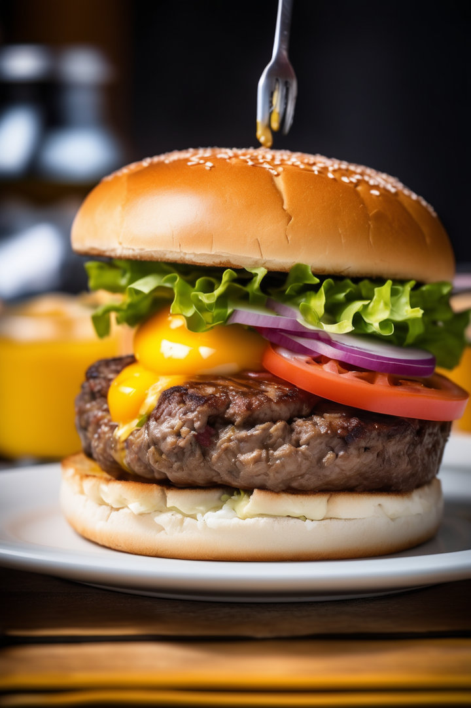

这个真实度，貌似可以商业应用了。

（3）换个动漫画风：山谷里的巨大机器人

提示词：

```bash
Anime style, giant robots in the valley
```

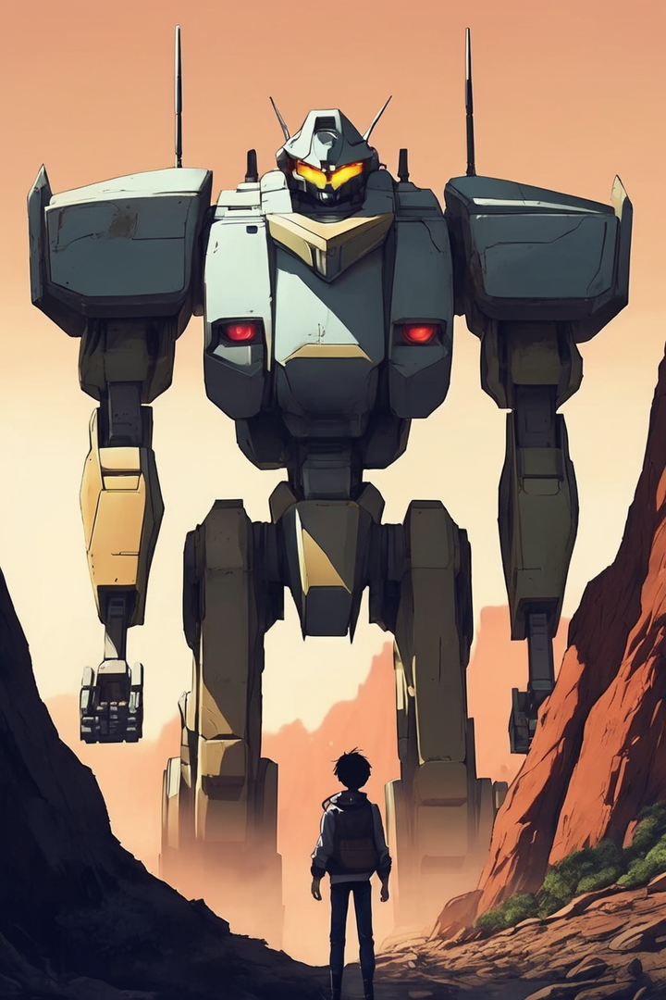

让人惊讶的是，同一个模型，在没有使用任何lora（还没有创作者改好）的情况下，画出的真实风格和动漫风格完全不同！

这在Stable Diffusion 1.5的时代，几乎是不可能的，一般需要两个不同的模型才能实现。

（4）抱着猫的女孩

提示词：

```bash
Sony A7,50mm,A girl holding a cat on the streets of the city , best quality, HDR,UHD,8K
```

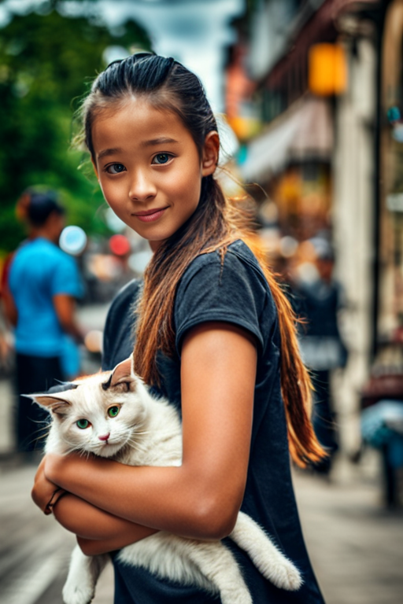

这次我换了索尼相机，我比较喜欢用定焦，选了50mm焦段。

（5）第一个适配SDXL的“民间”模型：DreamShaper

SDXL发布后，迅速涌现了一大批支持的模型，其中最知名的是DreamShaper。


DreamShaper是C站最受欢迎且下载量最高的模型之一，在SDXL0.9发布的时候，该模型就做了适配。SDXL1.0发布后，迅速推出了DreamShaper XL1.0 Alpha2。

从版本号可以看出，这个版本尚不完善。

作者的介绍：

> 尽管这仍然是一个alpha版本,但我认为与基于xl0.9的第一个alpha版本相比已经有了很大改进。
> 对于你需要的工作流程,你需要Math插件进行舒适配置(或者手动重新实现某些部分)。
> 基本上,我先用DreamShaperXL生成第一张图片,然后将其上采样到2倍大小,最后使用DreamShaperXL本身或者适合的1.5模型(如DreamShaper7或AbsoluteReality)进行img2img（图生图）。
> **相比SDXL1.0它做得更好的地方是什么?**
> \- 不需要refiner。只需做高分辨率修复(上采样+i2i)
> \- 更美观的人物
> \- 边缘模糊减少
> \- 75%更好的龙
> \- 更好的NSFW

我的眼神比较好，更好的NSFW，嗯，果然是LSP们的最爱。当然了，本文是绝对不可能放NSFW图的。

提示词：

```bash
photo of beautiful age 18 girl, pastel hair, freckles sexy, beautiful, close up, young, dslr, 8k, 4k, ultrarealistic, realistic, natural skin, textured skin
```

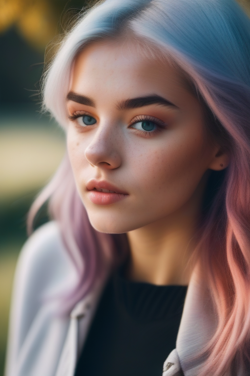

果然很梦幻，要比SDXL1.0发布的模型更美腻。

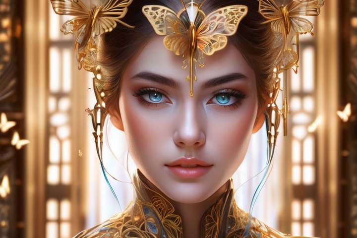

提示词 （[搜索引擎](https://www.zhihu.com/search?q=搜索引擎&search_source=Entity&hybrid_search_source=Entity&hybrid_search_extra={"sourceType"%3A"answer"%2C"sourceId"%3A3138235795})搜的 SD 咒语，随便找了个帖子）

```bash
(masterpiece:1.1), (best quality:1.2),((illustration)), ((floating hair)), ((chromatic aberration)), ((caustic)), lens flare, dynamic angle, highres, original, extremely detailed wallpaper, official art, amazing, ultra-detailed, facing the lens,(1girl:1.1), ((hidden hands)), aqua eyes, (beautiful detailed eyes),(hazmat suit), bare legs,butterfly hair ornament,((frills)), ribbons, bowties, buttons, (((small breast))), ((huge clocks)), ((glass strips)), (floating glass fragments), ((colorful refraction)), (beautiful detailed sky), ((dark intense shadows)), ((cinematic lighting)), ((overexposure)), ruins, park, petals on liquid, overexposure, dark intense shadows, depth of field, ((sharp focus)), ((extremely detailed)), colorful, hdr
```

负向提示词

```bash
lowres, bad anatomy, bad hands, text, error, missing fingers, extra digit, fewer digits, cropped, worst quality, low quality, normal quality, jpeg artifacts, signature, watermark, username, blurry, artist name, bad feet, missing legs, realistic, parody, traditional media, poorly drawn eyes, huge breasts, malformed arm, long neck, ugly, poorly drawn pantie, bad face, poorly drawn pussy, bad thigh gap, extra legs, futa, long face, missing arms, extra arm, bad_prompt
```

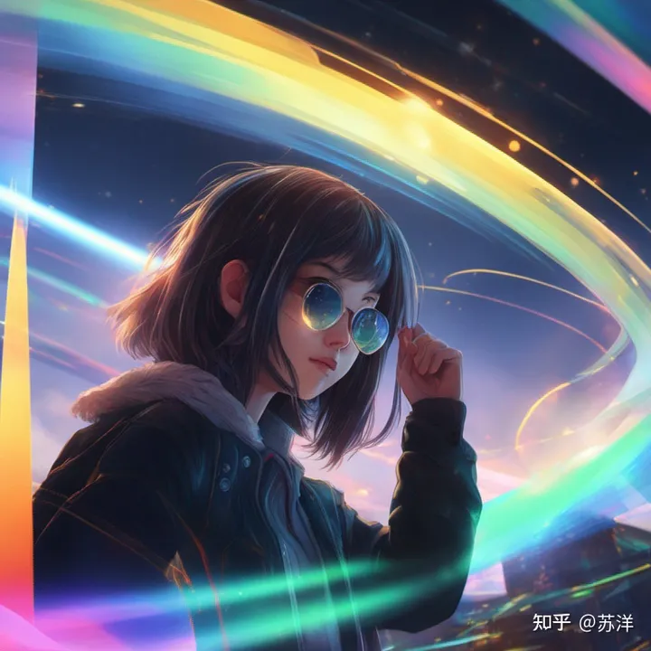

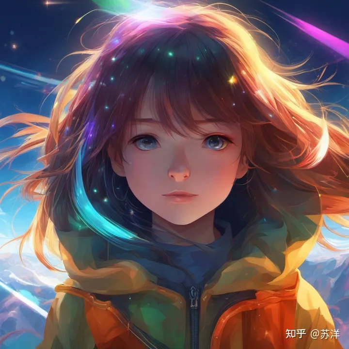


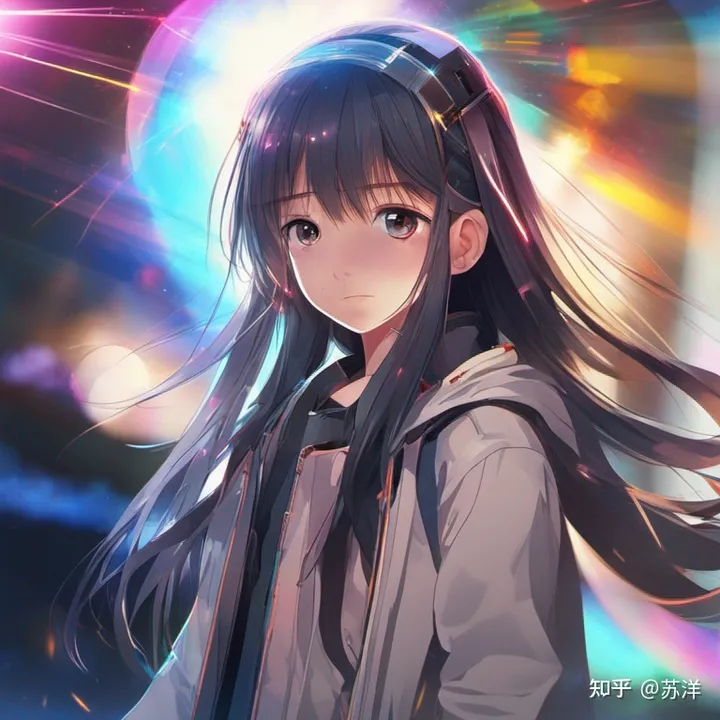

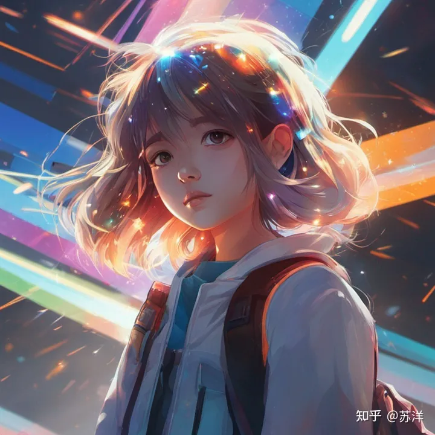

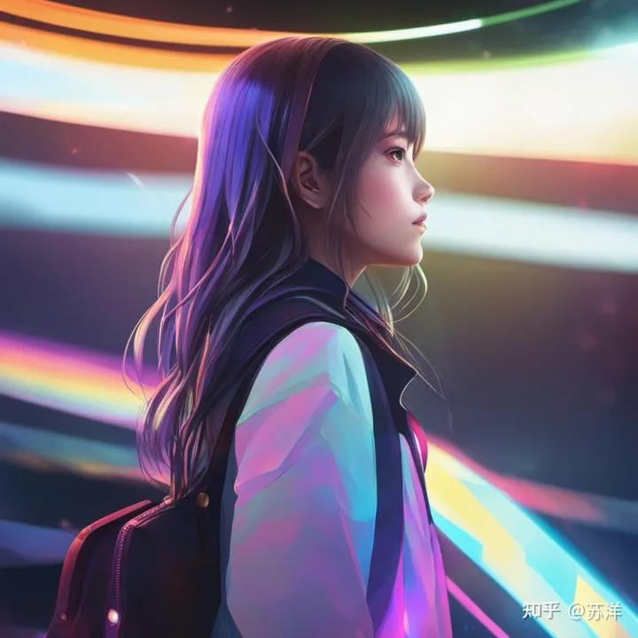

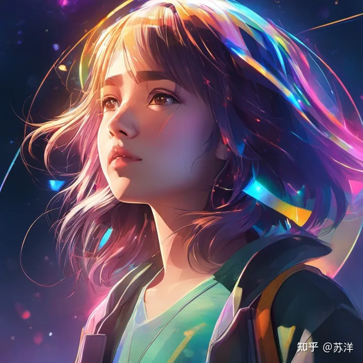

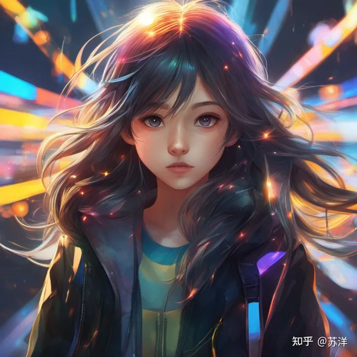

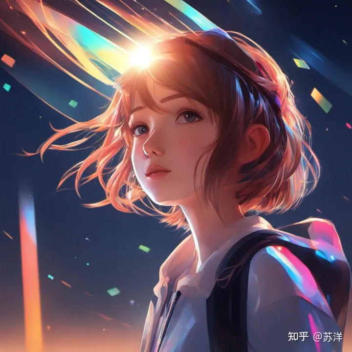

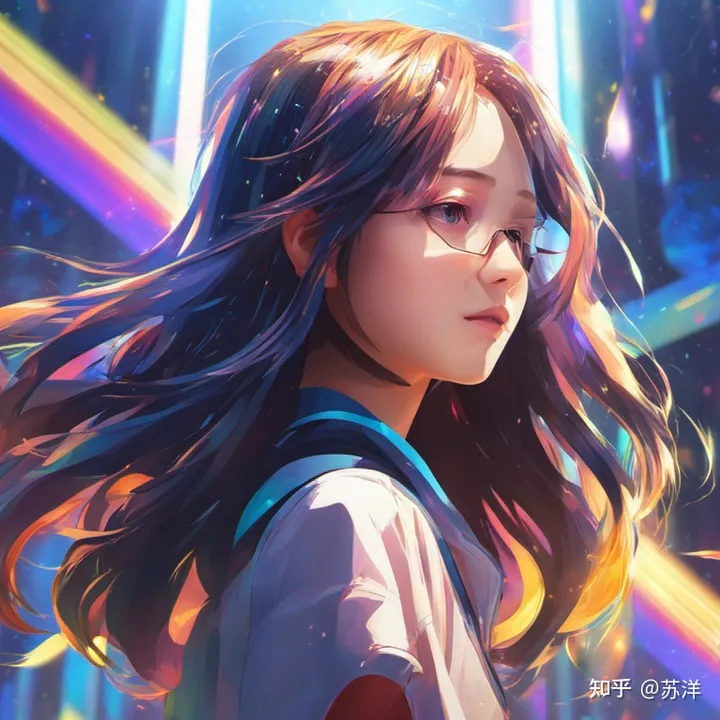

生成一幅日漫风格的图像，画风非常贴合，而且在光影的处理上也更加自然了。

```bash
1990s anime low resolution screengrab couple walking away in street at night
```

一幅风景照

让马斯克站在中式庭院里，抬头斜望着天空

```bash
Elon Musk in an ancient Chinese palace
```

或者是马斯克把苹果收购了？

在「WWDC」上，他举着全新款iPhone向人们展示，身边还围满了记者和粉丝（doge）。

```bash
Elon Musk releasing new iPhone at WWDC
```

除了这些马斯克的洋葱新闻之外，绘画风格的作品效果也不错。

左边的是齐白石水墨风格，而右边是一幅漫画。

```bash
左：Elon Musk delivering a speech, ink painting, Qi Baishi style
右：Elon Musk comic
```

除了绘画，也可以把马斯克放进我们的元青花。

```bash
Elon musk in the shape of Yuan Dynasty Blue and White Porcelain
```

马斯克在苏联担任汽修工人的珍贵照片

```bash
Elon Musk standing in a workroom, in the style of industrial machinery aesthetics, deutscher werkbund, uniformly staged images, soviet, light indigo and dark bronze, new american color photography, detailed facial features
```

2

```bash
elon musk eating food with chopsticks, in the style of peter coulson, cross-processing/processed, pinhole photography, herb trimpe, james tissot, transavanguardia, spot metering
```

## 其他功能

除了生成图像外，SDXL还提供了很多后期编辑功能。

在右上角左边按钮：

- 删除背景
- 清理瑕疵
- 重新点亮
- 增强/高档
- 重新构想
- 取消裁剪

这些功能是SDXL所在的Clipdrop平台上已有的，而SDXL可以一键将生成的图片传入对应模块。

目前，SDXL的免费使用额度还是比较高的，**登录后每个账户每天可生成400张**（需要排队）。

月付的价格是9美元每月，年付则相当于7美元（约50元人民币）每月，包含了1500张每天的SDXL额度，且无需排队。

不过不同区域的价格似乎也有所区别，比如阿根廷的年付价格平摊到每月是742比索（约合19.4元人民币或2.7美元）。

此外，由于付费版本实际上是Clipdrop平台的Pro订阅，所以也包含了该平台的其他功能。

除了Pro账户，还有API版本可供开发者使用（可以访问Stability AI、Amazon等平台）。

## 本地部署SDXL 1.0模型

### 各种下载

#### 1.SDXL1.0两个大模型

<https://www.123pan.com/s/ueDeVv-A20I.html>  提取码：lgyh

huggingface地址：

- base：[[stabilityai/stable-diffusion-xl-base-1.0 · Hugging Face](https://huggingface.co/stabilityai/stable-diffusion-xl-base-1.0)](<https://huggingface.co/stabilityai/stable-diffusion-xl-base-1.0>)
- refiner：[stabilityai/stable-diffusion-xl-refiner-1.0 · Hugging Face](https://huggingface.co/stabilityai/stable-diffusion-xl-refiner-1.0)

秋叶启动包：下载完放到目录：`C:\sd-webui-aki\sd-webui-aki-v4.2\models\Stable-diffusion`

#### 2.SDXL1.0专用VAE

<https://www.123pan.com/s/ueDeVv-920I.html> 提取码：lgyh

huggingface地址：[stabilityai/sdxl-vae · Hugging Face](https://huggingface.co/stabilityai/sdxl-vae)

秋叶启动包：下载完放到目录：`C:\sd-webui-aki\sd-webui-aki-v4.2\models\VAE`

#### 3.DreamShaper XL1.0 Alpha2

<https://www.123pan.com/s/ueDeVv-E20I.html> 提取码：lgyh

### 秋叶启动包设置

1.左下角—设置—一般设置—适配模式—改成【专家】

2.版本管理——切换最新版本1.5.1

3.高级设置——计算精度设置选项——把【开启VAE模型半精度优化】关闭

或者在webui-user.bat里面改成set COMMANDLINE_ARGS=--no-half-vae --xformers --medvram就能吃内存，然乎不要用秋叶的启动，直接用 `webui－user.bat` 命令启动

文档教程：<https://github.com/FurkanGozukara/Stable-Diffusion/blob/main/Tutorials/How-To-Use-SDXL-Locally-With-Automatic1111-SD-Web-UI.md>
