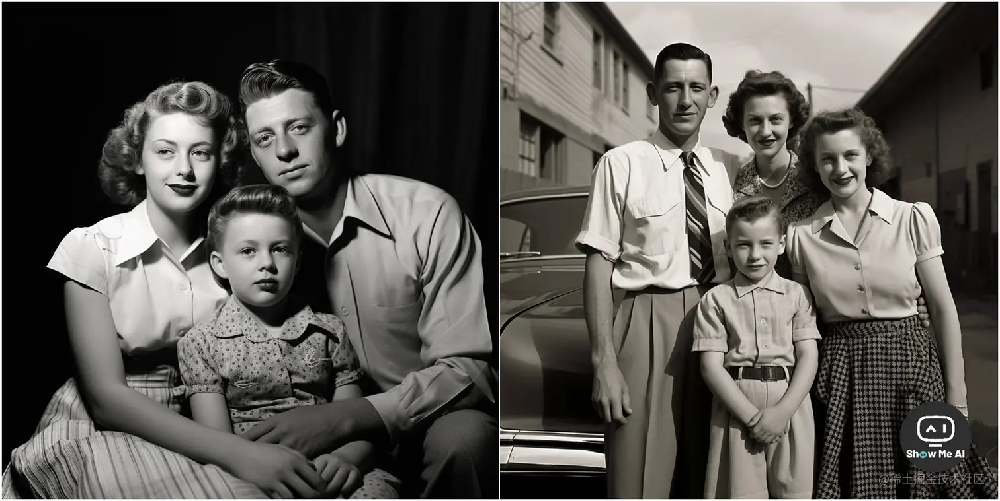

# 问题

## 判断是否是AI生成的图片

[**⋙ Reddit @Midjourney**](https://www.reddit.com/r/midjourney/comments/151ko7m/real_or_ai/)

这是 Reddit 论坛 Midjourney 子区一个非常热门的讨论：判断上面两张图是 AI 生成的，还是真实拍摄的。根据经验我们几乎可以快速判定，这是AI生成的图片！

但如果让你说出几条理由，是不是就卡壳了？因为这跟真实世界的图片太像了！原帖评论区的大神们，给出了非常细节的判断依据，我们一起来学习下：

> 1. **皮肤**太平滑无瑕疵，看起来不自然
> 2. **五官和面部**特征重复率高，缺乏细微差异
> 3. **牙齿、耳朵**等部位存在反常的绘制错误
> 4. **灯光和阴影**不协调，不同方向的光源
> 5. 背景物体**透视**对不准，存在失真
> 6. 存在马赛克和图像边缘毛刺等制作**瑕疵**
> 7. 衣服和背景缺乏质感和细节，**图案和阴影不协调**
> 8. 衣服与身体相接的部分处理不自然，**没有厚度和遮挡感**
> 9. **分辨率和清晰度**比当时胶片摄影水平要高，而非胶片质感，缺乏胶片风格的磨砂质感