# 魔法加速器

## Watt Toolkit（别名：Steam++）

### 说明

- 推荐软件：Watt Toolkit（别名：Steam++）
- 下载官网：https://steampp.net/
- 系统支持：Mac/Win/Android/Linux
- 价格：免费

### 功能

- 解决国内无法访问Discrod的问题
- 解决国内无法获取谷歌验证码的问题
- 解决国内无法访问Github的问题

### Mac版本安装教程

#### 1.访问官网选择对应版本

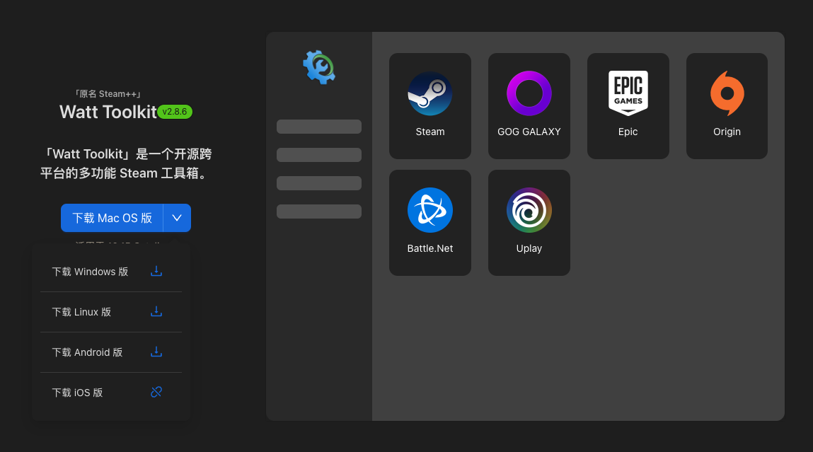

#### 2.同意条款

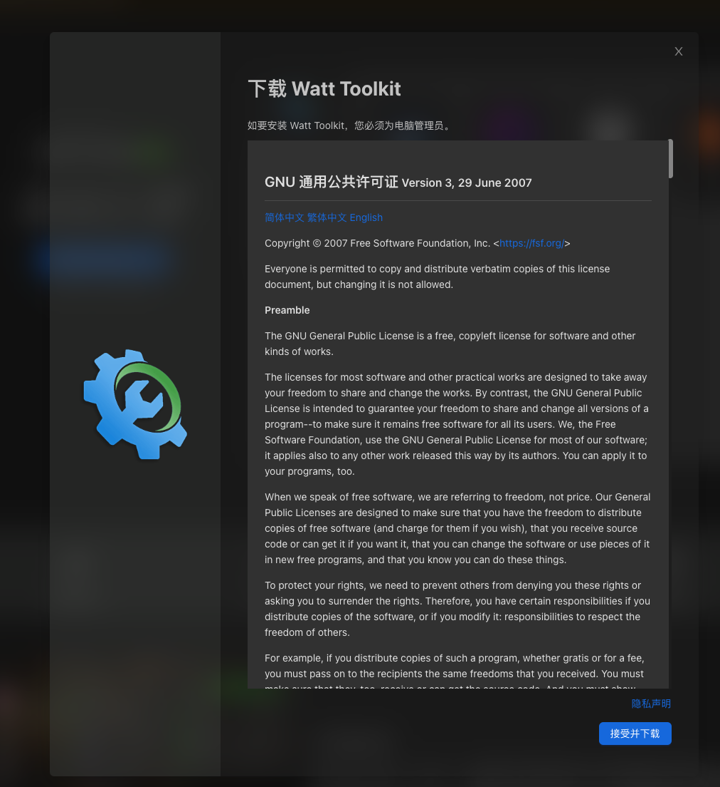

#### 3.选择渠道

- 推荐使用蓝奏云盘下载，密码：1234

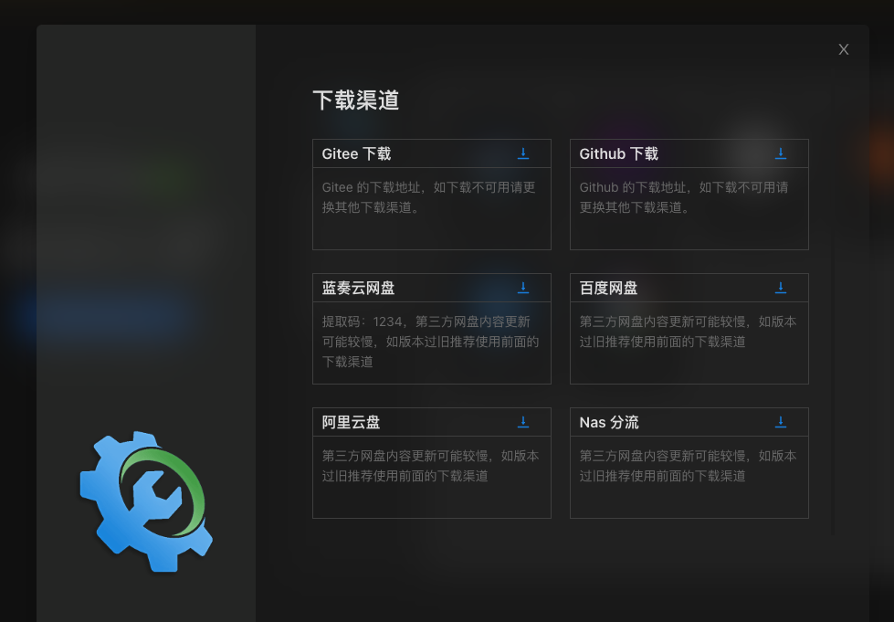

#### 4.选择版本

- 版本选择技巧：[【总结 电脑】怎么看mac电脑是arm64还是x64、windows电脑是是x64还是x86](http://www.360doc.com/content/22/0924/12/27492377_1049169328.shtml)

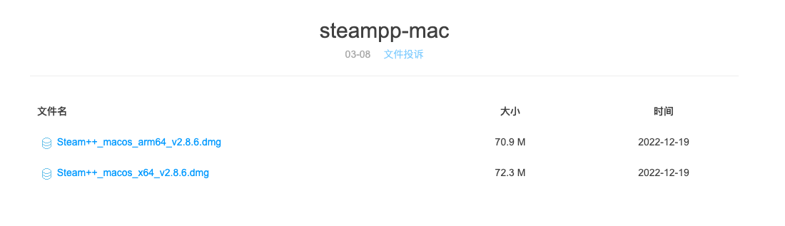

#### 5.完成安装

- 下载至本地并通过拖动完成安装

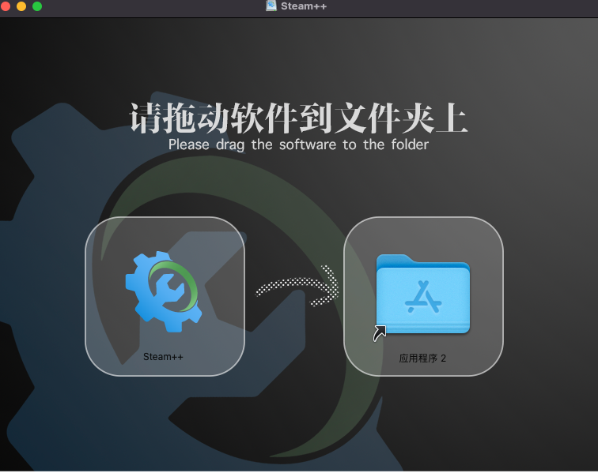

#### 6.打开软件

- 安装需要时间，稍等片刻，在启动台中双击打开软件

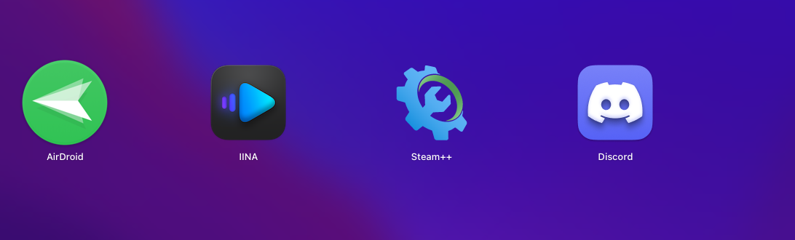

#### 7. 解决无法打开

- 若提示无法打开，则打开系统偏好设置-安全性与隐私-通用，选择仍要打开
- 备注：MACOS系统为13及以上请前往系统偏好设置-隐私与安全性，滑动至底部找到安全性板块

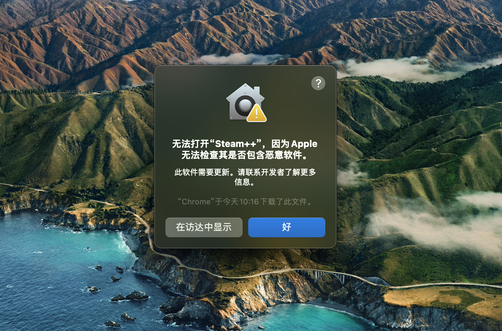

#### 8. 首次开启

- 点击弹窗中的“打开”，
- 打开Watt Toolkit，选择网络加速，勾选“discord语音聊天”，点击“一键加速”
- 点击“好”授权启动终端

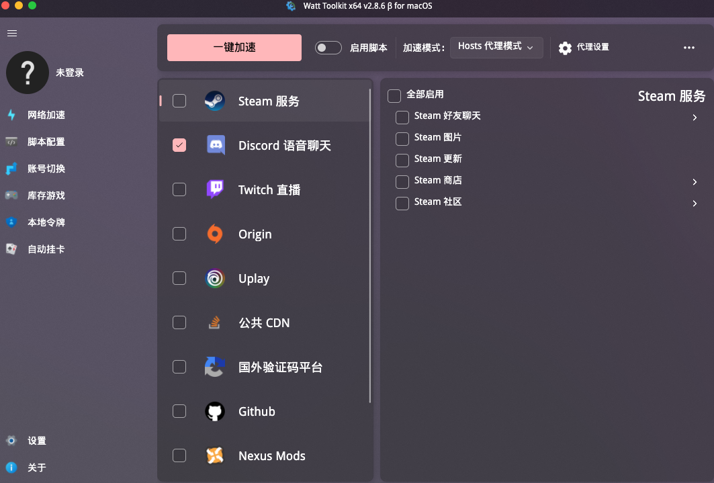

#### 9. 开启终端

- 此处注意，关闭这个弹窗，以及打开的终端弹窗，不要理他，最后再跟你解释为啥

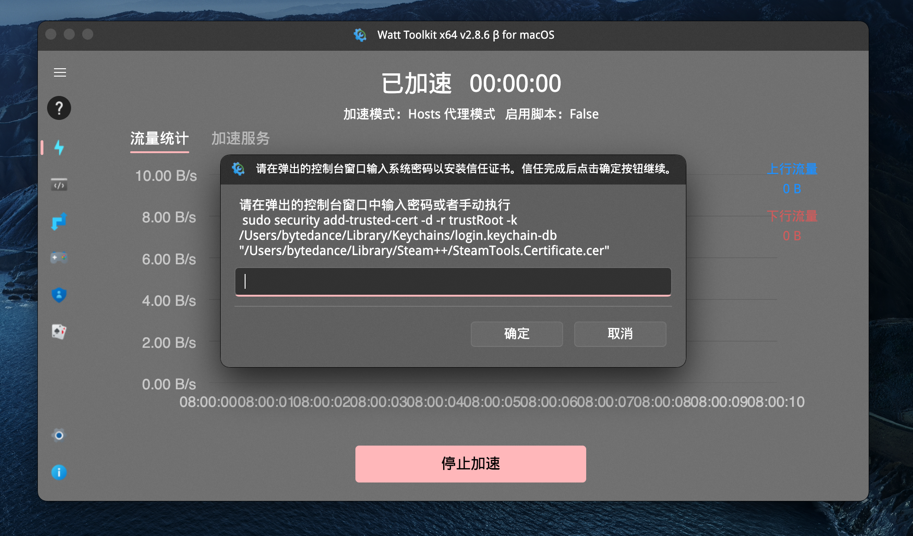

10.打开终端，添加系统证书

- 打开终端，输入以下代码然后，输入密码即可
- 如何查看用户名：请移步查看第11段开启Hosts权限

```Bash
sudo security add-trusted-cert -d -r trustRoot -k /Library/Keychains/System.keychain "/Users/此处请修改为您当前的用户名/Library/Steam++/SteamTools.Certificate.cer"
```

- 输入密码
  - 当“终端”窗口需要您输入密码时，你会看到钥匙形状的提示，且光标会发生变化。你在键入时，字符不会显示，以保护密码安全。虽然键入时不会显示字符且光标不会移动，盲输电脑开机密码即可，然后按下回车键。
  - 输入完成后，如右图所示，此时可关闭Watt Toolkit，再重新打开

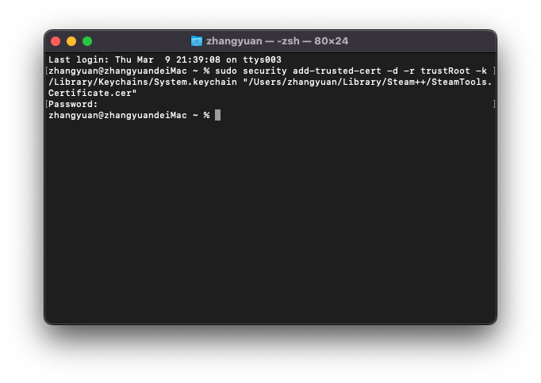

#### 11.开启Hosts权限

- 该情况非必然出现，若未出现跳过本段即可
- 若重启后提示“操作Hosts错误，文件访问被拒绝，没有权限”需要输入指令
  - 找到你的用户名：查看终端顶部最前面的名字，图例中的“yiche”这就是我的用户名
  - 启动台中打开终端，输入以下指令，将黄色部分替换为你上一步查到的用户名
  - 输入电脑开机密码，回车确认
  - ```C
    sudo chmod +a 'user:此处请修改为您当前的用户名:allow write' /etc/hosts
    ```

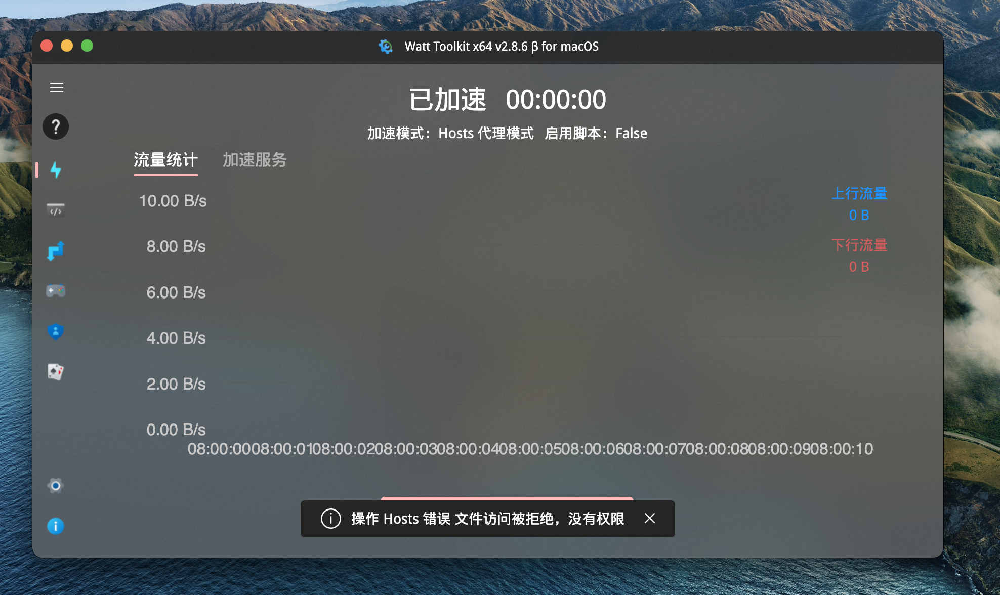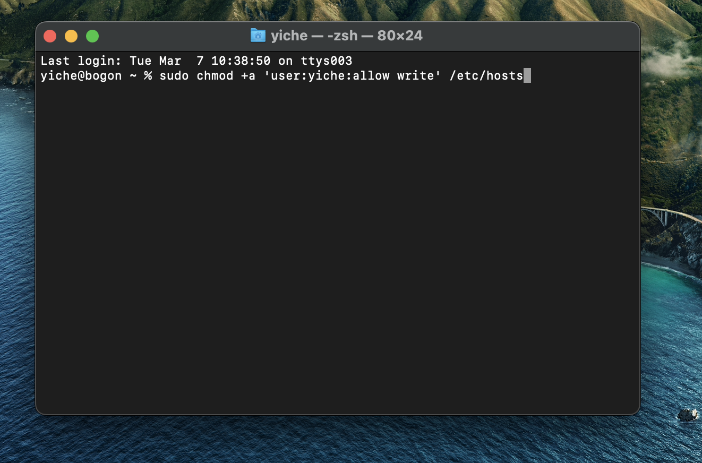

#### 12.成功加速

- 重新打开Watt Toolkit，勾选“discord语音聊天”，点击一键加速，无报错即说明正常
- 即可访问“https://discord.com”

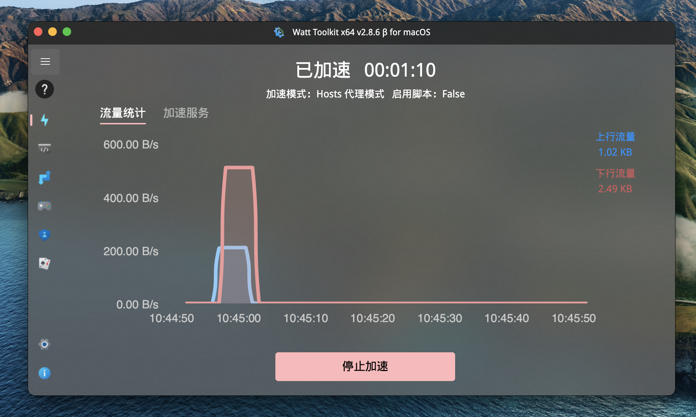

### 特殊说明

- 若使用chrome访问遇到👇问题，是因为软件将证书错误的安置于个人目录下，而非系统目录下，按以下操作步骤执行

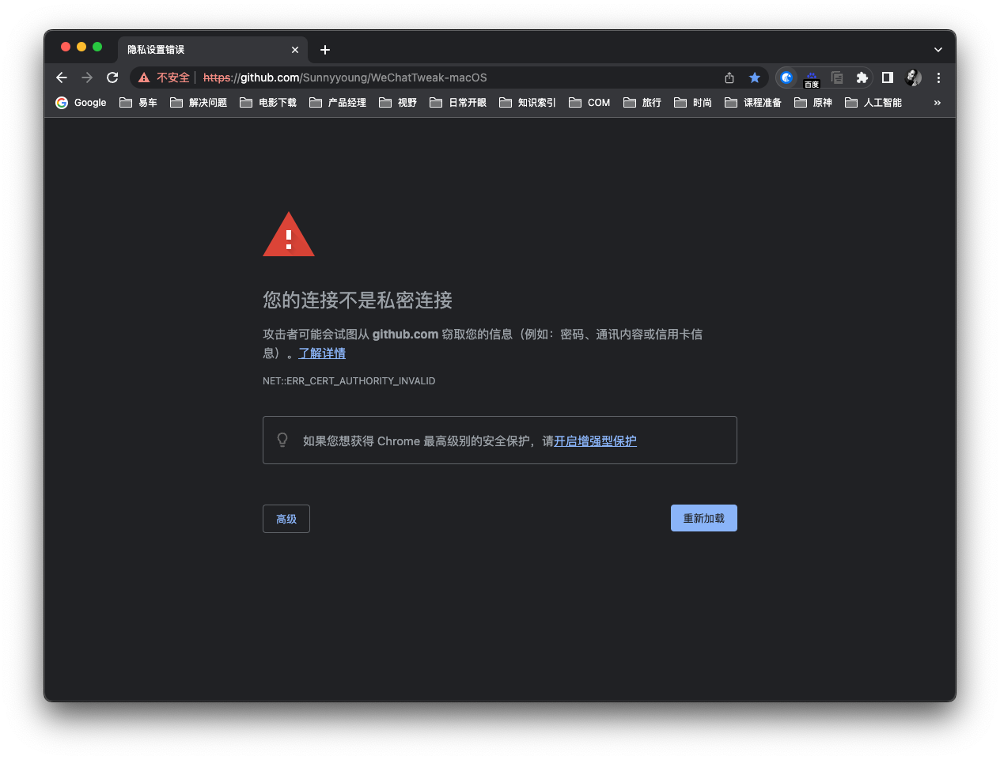

- 打开钥匙串访问
  - 选择登陆，已删除名为“SteamTools Certificate”的证书

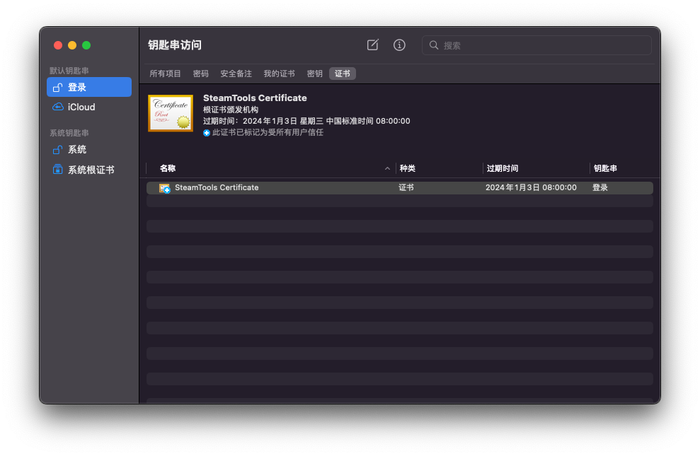

- 打开终端，输入以下代码，回车后输入密码即可，重启Watt Toolki，即可解决
- ps：请手动将“用户名”替换为你的电脑用户名，注意移除引号
  - 如何查看用户名：请向上查看第11段开启Hosts权限

```Bash
sudo security add-trusted-cert -d -r trustRoot -k /Library/Keychains/System.keychain "/Users/此处请修改为您当前的用户名/Library/Steam++/SteamTools.Certificate.cer"
```

### Win常见问题

若勾选discrod服务后，点击一键开启，提示“操作 hosts 错误 文件访问被拒绝，没有权限”按下方操作即可：

- 请先排查是否是杀毒软件拦截导致，如还是无法访问请尝试删除 `hosts` 文件后重开 Watt Toolkit 加速，程序会自动重新创建一个有权限的 `hosts` 文件，如依然提示没有权限则表示程序连创建程序也依然没有，你可以再尝试自己手动创建个空 `hosts` 文件。
- hosts文件位置：C:\Windows\System32\drivers\etc 注意是不带后缀的 hosts 文件
- 若无Hosts文件，请先确定是否被隐藏：https://jingyan.baidu.com/article/0bc808fc58c6b15ad585b947.html

### 常见问题

https://steampp.net/faq