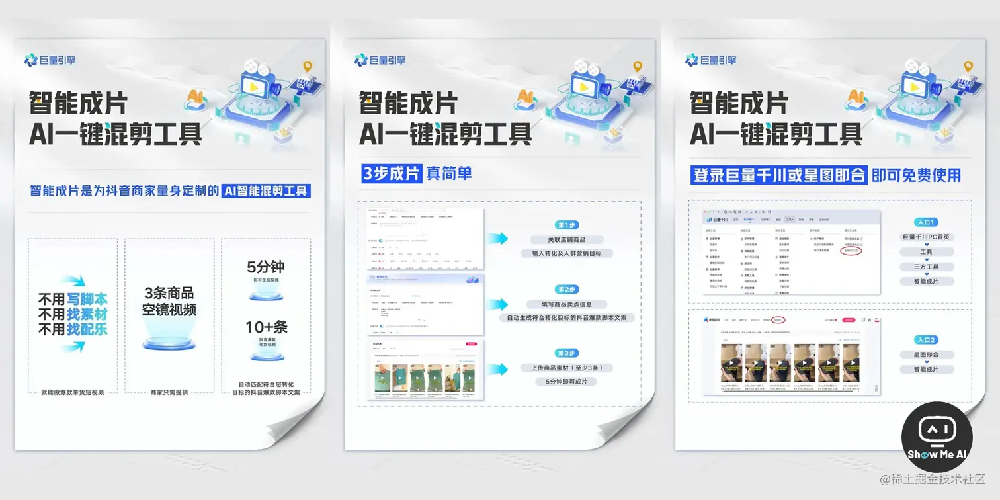

# AI等科技资讯

## 8 家大模型通过《生成式人工智能服务管理暂行办法》备案

8月31日共 8 家大模型通过《生成式人工智能服务管理暂行办法》备案，可正式上线面向公众提供服务。下方是这8家机构的清单和大模型使用链接，需要注意的是，大家关注的阿里通义千问、360 智脑、讯飞星火等均不在首批获批名单中。

> - **百度 (文心一言)**：[wenxin.baidu.com](https://wenxin.baidu.com)
> - **抖音 (云雀大模型)**：[www.doubao.com/chat](https://www.doubao.com/chat)
> - **智谱 AI (GLM 大模型)**：[chatglm.cn](https://chatglm.cn)
> - **中科院 (紫东太初大模型)**：[xihe.mindspore.cn](https://xihe.mindspore.cn)
> - **百川智能 (百川大模型)**：[www.baichuan-ai.com/home](https://www.baichuan-ai.com/home)
> - **商汤 (日日新大模型)**：[www.sensetime.com/cn](https://www.sensetime.com/cn)
> - **MiniMax (ABAB 大模型)**：[api.minimax.chat](https://api.minimax.chat)
> - **上海人工智能实验室 (书生通用大模型)**：[intern-ai.org.cn](https://intern-ai.org.cn)

## AI监管文件，于2023年8月15日起施行

[国家网信办等七部门联合公布《生成式人工智能服务管理暂行办法》_中央网络安全和信息化委员会办公室 (cac.gov.cn)](http://www.cac.gov.cn/2023-07/13/c_1690898326795531.htm)

8月15日起，《生成式人工智能服务管理暂行办法》(以下称《办法》) 开始施行，这也是**我国首个针对生成式人工智能产业的规范性政策**。

《办法》界定了生成式人工智能技术的基本概念，规定了生成式人工智能服务提供者的制度要求，为生成式人工智能的健康发展指明了方向：

> 1. 坚持发展和安全并重，对生成式人工智能服务实行包容审慎和分类分级监管
> 2. 明确适用对象和范围：适用于向境内公众提供AIGC服务，对大量垂直领域如科研、工业应用等场景排除适用范围
> 3. 以鼓励产业创新和发展为重，明确生成式人工智能技术发展路径和重点方向
> 4. 搭建人工智能全生命周期监管体系，对数据、算法等业务适度“松绑” [**⋙ 微信阅读全文**](https://mp.weixin.qq.com/s/TztAWbEJmA3qBCiLgvZMyg) | [**专家解读**](https://mp.weixin.qq.com/s/FERv605YrGK2Wie0kpFf5g)

## 新闻话题

* [ChatGPT 爆火带动全新职业提示工程师，提示工程有多重要？未来该职业走向如何？](https://www.zhihu.com/question/585294957)
* [重磅！Open AI开放ChatGPT模型API，“全民AIGC大时代”要来了！](https://mp.weixin.qq.com/s/TQTjLvmRNp3fuBzDmeatwQ)
* [ChatGPT 这个风口，普通人怎么抓住？](https://www.zhihu.com/question/582326598)
* [ChatGPT 有哪些神奇的使用方式？](https://www.zhihu.com/question/570729170)
* [微软德国首席技术官 Andreas Braun 表示，GPT-4 将于下周推出](https://mp.weixin.qq.com/s/yo47lOtUGMMtOBPT4XqqpA)
* [香港大学宣布禁用ChatGPT](https://m.weibo.cn/status/4870616702788642?sudaref=hf0y97ff1r.feishu.cn)
* [周鸿祎称 ChatGPT 可能两三年内就会产生自我意识威胁人类， ChatGPT 存在哪些安全问题？](https://www.zhihu.com/question/585757225?utm_campaign=Sharon&utm_medium=social&utm_oi=792817096856842240&utm_psn=1612465296727666688&utm_source=wechat_session&utm_content=group3_supplementQuestions)
* [微软 ChatGPT 版 Bing 上线了，使用体验如何？符合你的需求吗？](https://www.zhihu.com/question/583588366)
* [如何评价 ChatGPT ？会取代搜索引擎吗？](https://www.zhihu.com/question/570062224)
* [OpenAI CEO:将发布工具让用户定制AIGC系统](https://m.163.com/tech/article/HVF0CG7A00097U7T.html?spss=adap_pc)

## 🤖 巨量引擎推出AI智能成片工具，商家5分钟生成十余条带货短视频

上周，巨量引擎宣布推出AI混剪工具「**智能成片**」，免费开放给抖音商家使用，可以帮助商家轻松制作跑量的带货短视频。

不用写脚本、找素材、找配乐，只需有商品空镜视频 (至少3条)，就能制作爆款带货短视频啦！5分钟即可快速成片，提供10+条跑量效果好的短视频，而且商家0成本使用、批量成片，大幅节省开支~

以下两个路径均可使用「智能成片」工具：巨量千川PC首页 → 工具 → 三方工具 → 智能成片、星图即合 → 智能成片  [**⋙ 巨量千川**](https://qianchuan.jinritemai.com)   |   [**星图即合**](https://lcreative.xingtu.cn)

## 网易有道首推教育大模型「子曰」，6项应用可在线体验

论文速读：[read.youdao.com/](https://read.youdao.com/)

> 其他功能试玩地址：[aicenter.youdao.com/](https://aicenter.youdao.com/)

7月26日，网易有道举办了「powered by 子曰」教育大模型应用成果发布会，重磅推出了国内首个教育领域的垂直大模型「子曰」，作为基座模型支持诸多下游任务，向所有下游场景提供语义理解、知识表达等基础能力。

基于此，**有道研发团队在「子曰」大模型的基础上，为不同学习场景设计了定制化的模型，研发了六大创新应用**：

> - LLM翻译
> - 虚拟人口语教练
> - AI作文指导
> - 语法精讲
> - AIBox
> - 文档问答

## 小红书上线AI功能「此刻」，涂鸦和文生图能力非常亮眼

[小红书可以发纯文字笔记了｜红薯唠家常 (qq.com)](https://mp.weixin.qq.com/s/0OlMR1wd5i02RqTgfPaAuQ)

7月25日，小红书宣布推出新功能「此刻」。用户直接输入文字，算法会根据输入的文本内容生成相应的图片，有记事本、聊感悟、想吐槽三种图片格式。此外，用户也可以在画板上手绘涂鸦，并使用AI技术对涂鸦进行美化后发布。

这一功能基于AIGC技术开发，目前已经在最新版本中全量上线，供所有用户使用。**只需要输入纯文字或者绘制简笔画，就可以轻松获取美化图片、一键发布啦！**

## 山东能源与华为联合发布「盘古矿山大模型」，首个能源行业商业大模型

**山东能源集团、华为公司联合发布盘古矿山大模型**，将解决人工智能在矿山领域落地难的问题，引领矿山AI开发模式从作坊式向工厂式转变，为AI大规模进入矿山打下坚实基础。

作为AI大模型在能源领域的全球首次商用，山东能源、云鼎科技、华为在前期试点验证AI大模型赋能工业生产领域的基础上，正在开发和实施首批场景应用，**涵盖采煤、掘进、主运、辅运、提升、安监、防冲、洗选、焦化9个专业21个场景应用** 

[山东能源&华为，全球首个矿山领域商用人工智能大模型发布！ (qq.com)](https://mp.weixin.qq.com/s/pLqnqh1lWe2ueiKjyNI4gw)

## 阅文集团发布「阅文妙笔大模型」，国内第一个网文大模型

[AIGC助力！作家创作的“金手指”来了 (qq.com)](https://mp.weixin.qq.com/s/wBoCUSt5NVPxnpCC_hqXbg)

7月19日，阅文集团正式发布**国内网络文学行业首个大模型「阅文妙笔**」和基于这一大模型的应用产品「**作家助手妙笔版**」。

阅文妙笔大模型的知识储备能够覆盖情节内容、角色介绍、作品推荐、行业知识等，并在回答的准确度、全面性、提炼总结等方面表现出色，可以辅助阅文创作者完成创作。

阅文集团 CEO 兼总裁侯晓楠在致辞中表示，阅文妙笔是国内第一个网文大模型，也是最懂网文的大模型，将来会持续升级

## 英特尔推出34个开源AI参考套件，降低部署门槛，加速AI落地

[www.bakersfield.com](https://www.bakersfield.com/ap/news/intel-accelerates-ai-development-with-reference-kits/article_323634df-e88d-5311-b966-53d5e29b8533.html)

7月24日，英特尔公司向开发者社区发布了34个开源AI参考套件，包含模型代码、训练数据、机器学习流程说明、优化AI的库和oneAPI组件等，帮助开发者和数据科学家更便捷地部署人工智能。

这些基于oneAPI编程模型和英特尔端到端AI软件组合构建的参考套件，可以简化AI开发流程，提升现有智能解决方案，加速部署。这些预配置套件覆盖众多行业，包括消费品、能源、金融、医疗、制造、零售、电信等。

相比专有环境的局限，这些AI参考套件可以将解决方案时间从周缩短至天，帮助数据科学家和开发者以更低成本、更快速地训练模型。未来，英特尔将继续根据社区反馈更新维护部分套件

## 2023上半年AI发展突飞猛进，要点与亮点全盘回顾

[The First Half of 2023: Data Science and AI Developments - KDnuggets](https://www.kdnuggets.com/2023/07/first-half-2023-data-science-ai-developments.html)

2023年上半年，人工智能领域进展神速，出现了一系列技术突破与重要进展。本文通过回顾半年来AI领域的重要成果，总结了这一时期人工智能发展的主要趋势与特点。

> 1. **自然语言处理 (Natural Language Processing)** ：OpenAI 的 ChatGPT、Google 的 Bard 等对话机器人的出现，大大推动了自然语言处理技术的发展，新的语言模型不断涌现，语言能力显著提升
> 2. **自动机器学习 (AutoML)** ：AutoML 进一步发展，可以自动完成数据预处理、超参数调优等任务，大大节省了数据科学家的时间，提高了工作效率
> 3. **生成式AI (Generative AI)** ：基于用户提示，可以生成文本、图像等内容的生成式AI技术进一步成熟，被广泛应用于创作、辅助工作等领域
> 4. **深度学习 (Deep Learning)** ：深度学习算法不断改进，在图像分类、目标检测等任务上的性能显著提升，已广泛应用于自动驾驶、医疗等行业
> 5. **边缘计算 (Edge Computing)** ：为支持AI技术的计算需求，边缘计算技术进一步发展，使数据处理更实时高效，Google推出了新一代TPU加速芯片
> 6. **道德合规 (Ethical AI and Data Science)** ：随着AI应用日益广泛，各国加快出台法规，关注算法歧视、隐私保护等道德风险，推动AI的健康发展
