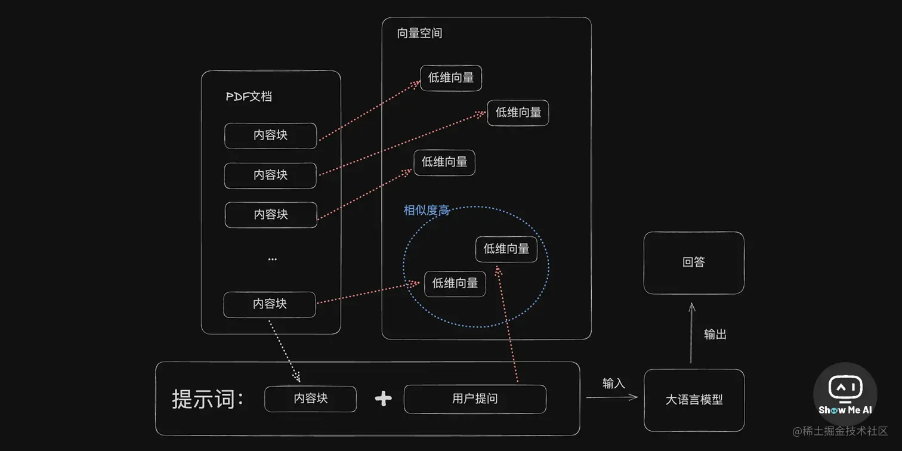

# AI代码工具合集

分享一些我常用的提升开发效率的工具：转于：[DaweiMa - 即刻 (okjike.com)](https://web.okjike.com/u/7A7EB661-B6FC-47CF-B75B-46DB8D096D5C)

## AI工具

GitHub Copilot：能极大的提高效率，不仅能在编辑器中根据代码上下文自动编写代码，还能以ChatGPT对话的方式回答问题。有了它，极大的降低了对StackOverflow的依赖。

ChatGPT：虽然GitHub Copilot以及能在写代码方面平替ChatGPT，但ChatGPT的GPT4 V的识图功能、DALL E3的绘图功能、移动端的语音对话功能都是GitHub Copilot无法替代的。用ChatGPT绘图或练英语还是很方便的。

[v0.dev](https://v0.dev/)：Vercel出品的AI画UI的神器，试了下，的确能大幅度降低画UI的工作量，相比ChatGPT直接生成代码，V0能以可视化的方式修改界面，这是ChatGPT无法做到的。

\#开发工具

VSCode：因为免费轻量级，哪怕是安装了很多插件，速度也比IDEA快。当然如果开发Java的话，IDEA还是更胜一筹。

DBeaver：数据库连接工具，主打免费可连接多种数据库。

pgAdmin4：管理PG数据库的工具，比DBeaver在PG的管理上更强一点。
云平台

GitHub：虽然你对GitHub估计很熟悉了，但也推荐看这篇文章：善用GitHub（[www.bmpi.dev](https://www.bmpi.dev/self/use-github-better/)）。

Cloudflare：Serverless最好的平台，能提供如常用的存储R2、KV数据库、CDN、Pages、Worker、MQ、甚至运行AI模型，我开发的个人产品（[www.i365.tech](https://www.i365.tech/)）大多都用它运行的。

Vercel：很适合部署运行Next.js的前端项目，Cloudflare Pages运行Next.js还需要额外的一些配置。

Fly.io：非常好的容器化平台，它能弥补Cloudflare只能运行Serverless的不足，能以Docker的方式运行各种重型API服务。

AWS/Azure/GCP：作为一个巨无霸的云平台，他们可以补充上面云平台所缺失的东西，比如AWS SES就是一个非常好的发邮件服务。

Newrelic：非常好的监控平台，尤其是它能作为免费的日志搜索平台，我把我产品的系统日志都上传到这个平台，然后对日志进行监控。一般的日志平台都是ES架构，价格并不便宜，单Newrelic却能免费。

Optimizely：一个不错的feature toggle平台，可以很方便的做产品的A/B测试。

\#分析工具

Umami：GA的开源平替，我网站流量都是用它监控的，速度快，数据还是自己的。

Plausible：更高级的GA开源平替，比Umami提供更多功能，但托管所需服务比较多，前者能免费跑在Vercel平台上。

Mixpanel：更更高级的GA商业平替，能做很复杂的用户行为分析与溯源，比GA高级多了。
支付平台

Lemonsqueezy：出海必备的支付平台，用国内身份就可以开通，然后开启出海之旅，赚美刀。

Stripe：相比前者，虽然费率便宜一些，但国内身份没发开通，需要做一些比较复杂的操作才能开通，比如开通一个美国或香港公司就可以开。

\#绘图工具

Excalidraw：非常好用的白板画图工具，适合个人使用。

PlantUML：一个支持文本绘制类UML图的工具，可以在Real World Plantuml找到很多用它实现的图。

Mermaid：通过文本生成各种UML图，最大的亮点是GitHub官方Markdown支持它，能渲染出多种图形如时序图与架构图等。

asciiflow：能简单的免费在线绘制ASCII风格图的网站，C语言大佬最爱的RFC风格绘图工具。

Sketch/OmniGraffle/Lucidchart/Draw.io/Google Drawings/Visio：这类工具相比大家或多或少用过，都是一些桌面端或浏览器常用的画图工具。

\#综合工具

Logseq：OKR + GTD + Note => Logseq（[www.bmpi.dev](https://www.bmpi.dev/self/okr-gtd-note-logseq/)），看完这篇文章，你会知道我为何而推荐这个工具，能做笔记、能规划任务或做OKR啥的。

Beancount：完美记账工具，配合Git能做到数据安全可控，可以看这篇我写的文章：使用Beancount管理家庭财务（[www.bmpi.dev](https://www.bmpi.dev/self/beancount-my-accounting-tool-v2/)），谁再给你推荐记账工具，请把这篇文章扔给他们看。

\#浏览器插件

AdblockPlus：这款插件可以自动屏蔽网站里的绝大多数广告，无需额外复杂的配置，安装好即可。

沉浸式翻译：搭配OpenAI的API Key可以做到非常完美的多语言网页翻译，读外文资料无障碍。

Internet Archive：网页时光机，很多网页因为时间很久的缘故可能无法访问（404），这个插件可以帮助我们找回这个页面，甚至可以像时光机一样查看网页不同时期的版本。

Screely：截屏工具，主要是能美化截屏界面，让其不再难看，比如加点背景。

wappalyzer：查看网站技术栈，比如使用它一些主流网站的技术栈。

SimilarWeb：查看网站PV流量的工具，但是结果有时候准确，有时候偏差挺大的。

SEOquake：查看网站的SEO相关的信息，如外链数量、索引数量、SEO的站内问题等。

Keyword Surfer：关键词工具，可以查看一些关键词的月搜索量。

META SEO inspector：网页Meta信息查看工具，可以方便地解决一些网页SEO的基本问题。分享一些我常用的提升开发效率的工具：

\#AI工具

GitHub Copilot：能极大的提高效率，不仅能在编辑器中根据代码上下文自动编写代码，还能以ChatGPT对话的方式回答问题。有了它，极大的降低了对StackOverflow的依赖。

ChatGPT：虽然GitHub Copilot以及能在写代码方面平替ChatGPT，但ChatGPT的GPT4 V的识图功能、DALL E3的绘图功能、移动端的语音对话功能都是GitHub Copilot无法替代的。用ChatGPT绘图或练英语还是很方便的。

[v0.dev](https://v0.dev/)：Vercel出品的AI画UI的神器，试了下，的确能大幅度降低画UI的工作量，相比ChatGPT直接生成代码，V0能以可视化的方式修改界面，这是ChatGPT无法做到的。

\#开发工具

VSCode：因为免费轻量级，哪怕是安装了很多插件，速度也比IDEA快。当然如果开发Java的话，IDEA还是更胜一筹。

DBeaver：数据库连接工具，主打免费可连接多种数据库。

pgAdmin4：管理PG数据库的工具，比DBeaver在PG的管理上更强一点。
云平台

GitHub：虽然你对GitHub估计很熟悉了，但也推荐看这篇文章：善用GitHub（[www.bmpi.dev](https://www.bmpi.dev/self/use-github-better/)）。

Cloudflare：Serverless最好的平台，能提供如常用的存储R2、KV数据库、CDN、Pages、Worker、MQ、甚至运行AI模型，我开发的个人产品（[www.i365.tech](https://www.i365.tech/)）大多都用它运行的。

Vercel：很适合部署运行Next.js的前端项目，Cloudflare Pages运行Next.js还需要额外的一些配置。

Fly.io：非常好的容器化平台，它能弥补Cloudflare只能运行Serverless的不足，能以Docker的方式运行各种重型API服务。

AWS/Azure/GCP：作为一个巨无霸的云平台，他们可以补充上面云平台所缺失的东西，比如AWS SES就是一个非常好的发邮件服务。

Newrelic：非常好的监控平台，尤其是它能作为免费的日志搜索平台，我把我产品的系统日志都上传到这个平台，然后对日志进行监控。一般的日志平台都是ES架构，价格并不便宜，单Newrelic却能免费。

Optimizely：一个不错的feature toggle平台，可以很方便的做产品的A/B测试。

\#分析工具

Umami：GA的开源平替，我网站流量都是用它监控的，速度快，数据还是自己的。

Plausible：更高级的GA开源平替，比Umami提供更多功能，但托管所需服务比较多，前者能免费跑在Vercel平台上。

Mixpanel：更更高级的GA商业平替，能做很复杂的用户行为分析与溯源，比GA高级多了。
支付平台

Lemonsqueezy：出海必备的支付平台，用国内身份就可以开通，然后开启出海之旅，赚美刀。

Stripe：相比前者，虽然费率便宜一些，但国内身份没发开通，需要做一些比较复杂的操作才能开通，比如开通一个美国或香港公司就可以开。

\#绘图工具

Excalidraw：非常好用的白板画图工具，适合个人使用。

PlantUML：一个支持文本绘制类UML图的工具，可以在Real World Plantuml找到很多用它实现的图。

Mermaid：通过文本生成各种UML图，最大的亮点是GitHub官方Markdown支持它，能渲染出多种图形如时序图与架构图等。

asciiflow：能简单的免费在线绘制ASCII风格图的网站，C语言大佬最爱的RFC风格绘图工具。

Sketch/OmniGraffle/Lucidchart/Draw.io/Google Drawings/Visio：这类工具相比大家或多或少用过，都是一些桌面端或浏览器常用的画图工具。

\#综合工具

Logseq：OKR + GTD + Note => Logseq（[www.bmpi.dev](https://www.bmpi.dev/self/okr-gtd-note-logseq/)），看完这篇文章，你会知道我为何而推荐这个工具，能做笔记、能规划任务或做OKR啥的。

Beancount：完美记账工具，配合Git能做到数据安全可控，可以看这篇我写的文章：使用Beancount管理家庭财务（[www.bmpi.dev](https://www.bmpi.dev/self/beancount-my-accounting-tool-v2/)），谁再给你推荐记账工具，请把这篇文章扔给他们看。

\#浏览器插件

AdblockPlus：这款插件可以自动屏蔽网站里的绝大多数广告，无需额外复杂的配置，安装好即可。

沉浸式翻译：搭配OpenAI的API Key可以做到非常完美的多语言网页翻译，读外文资料无障碍。

Internet Archive：网页时光机，很多网页因为时间很久的缘故可能无法访问（404），这个插件可以帮助我们找回这个页面，甚至可以像时光机一样查看网页不同时期的版本。

Screely：截屏工具，主要是能美化截屏界面，让其不再难看，比如加点背景。

wappalyzer：查看网站技术栈，比如使用它一些主流网站的技术栈。

SimilarWeb：查看网站PV流量的工具，但是结果有时候准确，有时候偏差挺大的。

SEOquake：查看网站的SEO相关的信息，如外链数量、索引数量、SEO的站内问题等。

Keyword Surfer：关键词工具，可以查看一些关键词的月搜索量。

META SEO inspector：网页Meta信息查看工具，可以方便地解决一些网页SEO的基本问题。

## 一份AI开发者的工具清单，60+工具帮你效率

[jamesmurdza/awesome-ai-devtools: Curated list of AI-powered developer tools. (github.com)](https://github.com/jamesmurdza/awesome-ai-devtools)

### 🔔 集成开发环境 IDEs

> - **Cursor**（[www.cursor.so/](https://link.juejin.cn?target=https%3A%2F%2Fwww.cursor.so%2F)）: 具有聊天、编辑、生成和调试功能的IDE。从VSCodium分叉，因此界面类似于VS Code。使用OpenAI。
> - **Mutable**（[mutable.ai/](https://link.juejin.cn?target=https%3A%2F%2Fmutable.ai%2F)）: 基于Web的IDE，与聊天机器人和GitHub集成。

### 🔔 助手 Assistants

> - **Replit Ghostwriter Chat**（[replit.com/site/ghostw…](https://link.juejin.cn?target=https%3A%2F%2Freplit.com%2Fsite%2Fghostwriter)）: 内置于 Replit 的助手，具有聊天、主动调试和自动补全功能。使用 OpenAI 进行聊天，并使用 replit-code-v1-3b（OS）进行自动补全。
> - **GitHub Copilot X**（[github.com/features/pr…](https://link.juejin.cn?target=https%3A%2F%2Fgithub.com%2Ffeatures%2Fpreview%2Fcopilot-x)）: 带有聊天、拉取请求文本生成和单元测试生成功能的 VS Code 扩展。
> - **Refact AI**（[refact.ai/](https://link.juejin.cn?target=https%3A%2F%2Frefact.ai%2F)）: 开源助手，具有聊天、补全、重构和针对代码库的细调功能。适用于 VS Code 和 JetBrains 的扩展。
> - **Codeium**（[codeium.com/](https://link.juejin.cn?target=https%3A%2F%2Fcodeium.com%2F)）: 带有自动补全、自然语言搜索和聊天功能的助手。适用于包括 VS Code、JetBrains、Neovim、Vim、Emacs、Eclipse、PyCharm 和 Xcode 在内的 21 个编辑器。企业版包括针对代码库的细调功能。
> - **Continue**（[continue.dev/](https://link.juejin.cn?target=https%3A%2F%2Fcontinue.dev%2F)）: 带有聊天、重构和代码生成功能的 VS Code 扩展。可编辑多个文件并代表您运行命令。
> - **Blackbox**（[www.useblackbox.io/](https://link.juejin.cn?target=https%3A%2F%2Fwww.useblackbox.io%2F)）: 带有自动补全和聊天功能的 VS Code 扩展，包括指向在线编码参考的链接。
> - **Source Graph Cody**（[about.sourcegraph.com/cody](https://link.juejin.cn?target=https%3A%2F%2Fabout.sourcegraph.com%2Fcody)）: 带有聊天、重构和单元测试生成功能的助手。适用于 VS Code 和 IntelliJ 的扩展。
> - **Quack AI**（[www.quack-ai.com/](https://link.juejin.cn?target=https%3A%2F%2Fwww.quack-ai.com%2F)）: 用于遵循项目编码规范的 VS Code 扩展。等候列表。
> - **talk-codebase**（[github.com/rsaryev/tal…](https://link.juejin.cn?target=https%3A%2F%2Fgithub.com%2Frsaryev%2Ftalk-codebase)）: 具有仓库上下文的命令行聊天机器人。支持 OpenAI，以及通过 GPT4All 本地运行的LLM。
> - **Magnet**（[www.magnet.run/](https://link.juejin.cn?target=https%3A%2F%2Fwww.magnet.run%2F)）: 基于 Web 的聊天机器人，以仓库和问题为上下文。
> - **Adrenaline**（[useadrenaline.com/](https://link.juejin.cn?target=https%3A%2F%2Fuseadrenaline.com%2F)）: 使用人工智能和 AST 来回答关于代码库的问题的基于 Web 的聊天机器人。
> - **Tabby**（[tabbyml.github.io/tabby/](https://link.juejin.cn?target=https%3A%2F%2Ftabbyml.github.io%2Ftabby%2F)）: 开源的、自托管的代码补全助手。适用于 VS Code 和 Vim 的扩展。
> - **Tabnine**（[www.tabnine.com/](https://link.juejin.cn?target=https%3A%2F%2Fwww.tabnine.com%2F)）: 开源的、自托管的代码补全助手。适用于包括 VS Code、IntelliJ、Neovim、Eclipse 和 PyCharm 在内的 15 个编辑器。
> - **CodeSquire**（[codesquire.ai/](https://link.juejin.cn?target=https%3A%2F%2Fcodesquire.ai%2F)）: 为 Google Colab、BigQuery 和 JupyterLab 添加自动补全功能的 Chrome 扩展。
> - **CodeMate**（[www.codemate.ai/](https://link.juejin.cn?target=https%3A%2F%2Fwww.codemate.ai%2F)）: 用于调试和优化代码的 VS Code 扩展。

### 🔔 Shell助手 Shell assistants

> - **AskCommand**（[www.askcommand.cppexpert.online/](https://link.juejin.cn?target=https%3A%2F%2Fwww.askcommand.cppexpert.online%2F)）: 使用人工智能自动从文本生成 Unix 命令的基于 Web 的工具。
> - **Butterfish**（[butterfi.sh/](https://link.juejin.cn?target=https%3A%2F%2Fbutterfi.sh%2F)）: 在您的 shell 中嵌入 ChatGPT 以提供方便访问的命令行工具。包括简单的自主能力。

### 🔔 智能体 Agents

> - **Smol Developer**（[github.com/smol-ai/dev…](https://link.juejin.cn?target=https%3A%2F%2Fgithub.com%2Fsmol-ai%2Fdeveloper)）: 通过CLI代理根据提示生成存储库。使用OpenAI和Anthropic。
> - **Aider**（[github.com/paul-gauthi…](https://link.juejin.cn?target=https%3A%2F%2Fgithub.com%2Fpaul-gauthier%2Faider)）: 通过CLI助手和代理生成更改和提交到存储库。使用OpenAI。
> - **Mentat**（[www.mentat.codes/](https://link.juejin.cn?target=https%3A%2F%2Fwww.mentat.codes%2F)）: 通过CLI助手和代理对存储库进行更改。
> - **GPT Engineer**（[github.com/AntonOsika/…](https://link.juejin.cn?target=https%3A%2F%2Fgithub.com%2FAntonOsika%2Fgpt-engineer)）: 通过CLI代理根据提示生成存储库，并提问澄清问题。
> - **GPT Migrate**（[github.com/0xpayne/gpt…](https://link.juejin.cn?target=https%3A%2F%2Fgithub.com%2F0xpayne%2Fgpt-migrate)）: 通过CLI代理将全栈应用程序从一种语言或框架转换为另一种。使用GPT-4 32k上下文。
> - **GitWit**（[gitwit.dev/](https://link.juejin.cn?target=https%3A%2F%2Fgitwit.dev%2F)）: 用于向Git存储库的全栈应用程序添加功能的基于Web的代理。
> - **DemoGPT**（[github.com/melih-unsal…](https://link.juejin.cn?target=https%3A%2F%2Fgithub.com%2Fmelih-unsal%2FDemoGPT)）: 具有Llama 2的强大力量的自动生成AI应用程序生成器
> - **DevOpsGPT**（[github.com/kuafuai/Dev…](https://link.juejin.cn?target=https%3A%2F%2Fgithub.com%2Fkuafuai%2FDevOpsGPT)）: DevOpsGPT基于AI的软件开发自动化解决方案
> - **Second.dev**（[www.second.dev/](https://link.juejin.cn?target=https%3A%2F%2Fwww.second.dev%2F)）: 用于向全栈应用程序添加功能的平台。
> - **Factory**（[www.factory.ai/](https://link.juejin.cn?target=https%3A%2F%2Fwww.factory.ai%2F)）: 用于代码生成的代理。等待中。

### 🔔 应用生成器 App generators

> - **Pico**（[picoapps.xyz/](https://link.juejin.cn?target=https%3A%2F%2Fpicoapps.xyz%2F)）: 具有即时部署的端到端微应用生成器
> - **Literally anything**（[literallyanything.io/](https://link.juejin.cn?target=https%3A%2F%2Fliterallyanything.io%2F) ） : HTML和JavaScript Web应用生成器。

### 🔔 代码片段生成器 Snippet generators

> - **CodePal**（[codepal.ai/](https://link.juejin.cn?target=https%3A%2F%2Fcodepal.ai%2F) ） : 一个用于快速生成或重构代码的Web工具。
> - **AI Code Convert**（[aicodeconvert.com/](https://link.juejin.cn?target=https%3A%2F%2Faicodeconvert.com%2F) ） : 一个用于在编程语言之间转换代码的Web工具。
> - **AI Code Playground**（[aicodeplayground.com/](https://link.juejin.cn?target=https%3A%2F%2Faicodeplayground.com%2F) ） : 用于重构和改进代码的Web工具。

### 🔔 文档 Documentation

> - **Trelent**（[trelent.net/](https://link.juejin.cn?target=https%3A%2F%2Ftrelent.net%2F)）: 一个用于生成文档字符串的VS Code扩展。使用专有模型。
> - **Docify**（[docify.ai4code.io/](https://link.juejin.cn?target=https%3A%2F%2Fdocify.ai4code.io%2F)）: 一个用于生成文档字符串的VS Code扩展。
> - **Mintlify Writer**（[writer.mintlify.com/](https://link.juejin.cn?target=https%3A%2F%2Fwriter.mintlify.com%2F)）: 一个用于生成文档字符串的VS Code扩展。

### 🔔 持续集成机器人 Continuous integration bots

> - **BitBuilder**（[www.bitbuilder.ai/](https://link.juejin.cn?target=https%3A%2F%2Fwww.bitbuilder.ai%2F)）: 一个用于从问题生成拉取请求的GitHub集成。
> - **Sweep**（[sweep.dev/](https://link.juejin.cn?target=https%3A%2F%2Fsweep.dev%2F)）: 另一个用于从问题生成拉取请求的GitHub集成。
> - **Code Review GPT**（[github.com/mattzcarey/…](https://link.juejin.cn?target=https%3A%2F%2Fgithub.com%2Fmattzcarey%2Fcode-review-gpt)）: 用于审查PR的开源工具。可以作为GitHub动作、Gitlab CLI或本地工具使用。
> - **Nova**（[www.trynova.ai/](https://link.juejin.cn?target=https%3A%2F%2Fwww.trynova.ai%2F)）: 一个用于为新的PR添加摘要和测试等操作的CI机器人。
> - **CodeRabbit**（[coderabbit.ai/](https://link.juejin.cn?target=https%3A%2F%2Fcoderabbit.ai%2F)）: 可定制的CI工具，用于为PR添加摘要和代码建议。

### 🔔 Code generation: 代码生成

> - **Magic**（[magic.dev/](https://link.juejin.cn?target=https%3A%2F%2Fmagic.dev%2F)）: 该公司承诺推出两款产品，一个助手和一个基于代码训练的底层基础模型LTM-1。等候名单。

### 🔔 智能体平台 Agent platforms

> - **E2B**（[www.e2b.dev/](https://link.juejin.cn?target=https%3A%2F%2Fwww.e2b.dev%2F)）: 用于托管基于LLM的代理的开源云平台。支持Smol Developer。
> - **Morph Rift**（[github.com/morph-labs/…](https://link.juejin.cn?target=https%3A%2F%2Fgithub.com%2Fmorph-labs%2Frift)）: 开源的VS Code扩展，允许合并代码生成代理的输出。
> - **SuperAGI**（[superagi.com/](https://link.juejin.cn?target=https%3A%2F%2Fsuperagi.com%2F)）: 用于托管基于LLM的代理的开源平台，包括SuperCoder。

### 🔔 OpenAI插件 OpenAI plugins

> - **ChatWithGit**（[gitsearch.sdan.io/](https://link.juejin.cn?target=https%3A%2F%2Fgitsearch.sdan.io%2F)）: 允许ChatGPT搜索GitHub并返回相关存储库的链接。
> - **Code ChatGPT Plugin**（[github.com/kesor/chatg…](https://link.juejin.cn?target=https%3A%2F%2Fgithub.com%2Fkesor%2Fchatgpt-code-plugin)）: ChatGPT插件的开源示例，从文件目录中提取上下文。

### 🔔 搜索 Search

> - **Bloop**（[bloop.ai/](https://link.juejin.cn?target=https%3A%2F%2Fbloop.ai%2F)）: 用于存储库的自然语言搜索。
> - **Buildt**（[www.buildt.ai/](https://link.juejin.cn?target=https%3A%2F%2Fwww.buildt.ai%2F)）: 用于存储库的自然语言搜索。

### 🔔 测试 Testing

> - **OctoMind**（[octomind.dev/](https://link.juejin.cn?target=https%3A%2F%2Foctomind.dev%2F)）: 自动维护和生成的基于浏览器的端到端测试，集成到Github Actions，Azure DevOps等。
> - **Traceloop**（[traceloop.com/](https://link.juejin.cn?target=https%3A%2F%2Ftraceloop.com%2F)）: 利用开放遥测跟踪数据和生成的人工智能来提高系统可靠性。
> - **Carbonate**（[carbonate.dev/](https://link.juejin.cn?target=https%3A%2F%2Fcarbonate.dev%2F)）: 使用自然语言进行端到端测试。与现有的测试套件集成（目前支持Jest，PHPUnit和Python的unittest）。
> - **Meticulous.ai**（[www.meticulous.ai/](https://link.juejin.cn?target=https%3A%2F%2Fwww.meticulous.ai%2F)）: 自动生成、自动维护的端到端测试: 随着应用程序的发展，测试套件也随之演变。
> - **DiffBlue**（[www.diffblue.com/](https://link.juejin.cn?target=https%3A%2F%2Fwww.diffblue.com%2F)）: 为Java自动生成单元测试 

## AI编程工作流

[【在公司前端项目中落地 ChatGPT】初探成果 - 掘金 (juejin.cn)](https://juejin.cn/post/7230319403723948093)

## 🤖 使用AI工具「bloop」读懂「Webpilot」插件源码，再高效教会我

[javascript - 效率max：AI读了源码后再教我 - 个人文章 - SegmentFault 思否](https://segmentfault.com/a/1190000044067958)



> **Webpilot** 是一个浏览器插件,允许用户对网页内容进行自然语言提问，并自动生成回答。
>
> **bloop**是一个面向软件开发者的AIGC工具，可以回答关于代码库的问题，核心技术是 embeddings——将代码块映射为向量，然后检索向量之间关联度最强的内容来回答问题。但是 bloop 不了解代码之间的依赖关系，在提问时需要提供足够上下文，才能得到准确回答。

作者在这篇文章中展示了如何使用 bloop 工具来分析 Webpilot 的源码：通过逐步深入的技术思路，先用 bloop 对项目做整体的概述，然后再针对关键功能细节继续提问，逐步让 bloop 解释代码的具体逻辑。核心流程如下：

> 1. 首先需要在 bloop 中绑定 Webpilot 的代码仓库，让 bloop 对代码进行向量化表示
> 2. 然后可以就项目整体提出一个概述性问题，如"简单介绍下这个项目"；这可以让 bloop 对项目有一个大致的了解
> 3. 在得到项目简介后，可以询问一些关键功能的实现，如"与网页进行自由形式对话"是如何实现的；bloop会指出相关的代码位置
> 4. 根据 bloop 提供的代码位置，可以继续询问该代码的详细作用和逻辑；bloop 会尝试解释代码含义
> 5. 在理解了一个功能点后，可以继续问其他功能的实现代码在哪，并重复上述过程逐步深入
> 6. 当对全部关键逻辑都进行了解析后，就可以比较系统地理解该项目的代码实现了
> 7. 在提问时，需要提供足够具体的上下文信息，而不要只问一些过于概括的问题
> 8. 如果bloop的回答不对或不全，需要修正提问方式提供更多上下文线索

## 🤖 程序员如何在 ChatGPT 世界中生存，并保持领先

[How Coders Can Survive—and Thrive—in a ChatGPT World - IEEE Spectrum](https://spectrum.ieee.org/ai-programming)

大语言模型 (LLM) 驱动的生成式人工智能，可能会让很多程序员丢掉饭碗。对于庞大的程序员群体来说，如何在 LLM 时代生存和发展，是一个迫在眉睫需要探讨的话题。这篇文章给出了4类技巧，或许可以答疑解惑：

> *1*. **坚持基础知识和最佳实践：编程的基本原理，是万变不离其宗的**
>
> *▢* 锻炼阅读和推理代码的能力，并且思考自己编写代码以适应更大的系统
>
> *▢* 分析问题、解决问题并找到优雅的解决方案，仍然是人类程序员的优势领域
>
> *▢* 良好的软件工程实践比以往更有价值，可以为AI工具提供一个良好的系统设计和软件架构环境

> *2*. **找到满足需求的工具：以不同的方式将AI工具合并到工作流，力图单元测试、生成测试数据、编写文档等**
>
> *▢* GitHub Copilot和其他AI编码助手可以增强编程能力，提供编程建议
>
> *▢* ChatGPT和谷歌 Bard 更像是对话式AI程序员，可以用来回答有关API相关问题，生成代码片段
>
> *▢* 保持开放的心态多多尝试，并使用生成式AI工具快速启动小项目并创建原型

> *3*. **清晰准确的对话至关重要：使用AI编程助手时，需要详细说明需要什么并多次迭代**
>
> *▢* 编写注释说明想要的代码，有助于快速生成所需的结果
>
> *▢* 了解构建提示词的最佳方式，对于程序员来说也是有帮助的
>
> *▢* 把一个问题分解成多个步骤，并解决每个步骤来解决整个问题
>
> *▢* 学习人工智能和机器学习的基本概念，了解大语言模型的工作原理及其优缺点，也是很有价值的

> *4*. **保持批判性并了解风险：软件工程师应该对大语言模型的输出保持批判态度**
>
> *▢* 大模型的输出会产生「幻觉」、不准确甚至包含漏洞的代码

## Wix 推出AI新工具，可以根据提示词创建整个网站

> [Website Builder - Create a Free Website Today | Wix.com](https://www.wix.com/)

Wix 是一个免费的建站工具，允许用户使用模板和拖拽功能等创建网站。

7月18日，Wix 发布了全新的建站工具 AI Site Generator，允许用户只输入提示词就能自动创建整个网站，包括各种内容呈现和视觉设计，完全无需编程和设计经验。不过，工具目前仍存在一些问题，主要是生成的文本和设计比较通用，缺乏个性化

[Wix will let you build an entire website using only AI prompts - The Verge](https://www.theverge.com/2023/7/17/23796600/wix-ai-generated-websites-chatgpt)

## 使用 ChatGPT 生成 SQL 语句

1. 作者先定义了一组示例数据库表，然后让 ChatGPT 根据表的文本描述自动推断出表关系。结果！**ChatGPT 居然把所有的表关系都推断出来了**！
2. 难度升级。作者使用简单的英语提示，让 ChatGPT 生成「查询客户订单数量」「查询时间范围内订单金额」SQL语句。**ChatGPT 也通通做对了！写出来的 SQL 语句一个比一个靠谱**!
3. 继续升级。作者经过测试发现，ChatGPT **能够详细指出不同数据库的语法和函数差异所在，并且能够根据作者要求生成专门适用于 SQL Server 的 SQL 语句！**
4. 作者总结了使用 ChatGPT 生成 SQL 语句的注意事项：

- 首先定义表，注意提示词要尽可能简单
- 确认 ChatGPT 理解了表结构，如果没有则需要添加一个提示，解释所需的表关系
- 用简单、明确的提示词，描述想要的查询结果
- 明确告知 ChatGPT 正在使用的数据库

最后！一定一定要注意！**ChatGPT自动生成的 SQL 语句并不能保证 100% 准确，需要经过验证** 

[**⋙ 阅读原文**](https://forta.com/2023/07/10/how-to-generate-sql-statements-with-chatgpt)

## 到 SQL 工具的文本列表

1.AI2sql: https://www.ai2sql.io

2.寻找: https://www.seek.ai/

#### [使用 LLMs 通过自然语言生成任意函数：AI Functions](https://www.askmarvin.ai/)

使用 OpenAI GPT4, 描述函数功能即刻得到相应的函数代码，使用 GPT4 替代程序猿更近一步了，下面是核心代码：

[GitHub 开源实现：AI-Functions](https://github.com/Torantulino/AI-Functions)

```
import openai

def ai_function(function, args, description, model = "gpt-4"):
    # parse args to comma seperated string
    args = ", ".join(args)
    messages = [{"role": "system", "content": f"You are now the following python function: ```# {description}\n{function}```\n\nOnly respond with your `return` value. no verbose, no chat."},{"role": "user", "content": args}]

    response = openai.ChatCompletion.create(
        model=model,
        messages=messages,
        temperature=0
    )

    return response.choices[0].message["content"]
```

### 向量数据库

如果说 ChatGPT 是 LLM 的处理核心，prompts 是 code，那么向量数据库就是 LLM 需要的存储。

| 名称                                             | 简介                                                         | 备注                                                         |
| ------------------------------------------------ | ------------------------------------------------------------ | ------------------------------------------------------------ |
| [PineCone](https://www.pinecone.io/)             | Pinecone为向量数据提供了数据存储解决方案。                   | 提供免费方案，目前注册火爆，需要等待                         |
| [Milvus](https://github.com/milvus-io/milvus)    | Milvus 是一个开源矢量数据库，旨在为嵌入相似性搜索和 AI 应用程序提供支持。 除了向量，Milvus 还支持布尔型、整数、浮点数等数据类型。 Milvus 中的一个集合可以包含多个字段，用于容纳不同的数据特征或属性。 Milvus 将标量过滤与强大的向量相似性搜索相结合，为分析非结构化数据提供了一个现代、灵活的平台。 | 目前提供多种部署方式，支持docker, k8s, embed-milvus(pip install嵌入安装)，同时也有[在线云服务](https://cloud.zilliz.com/)。 |
| [chroma](https://github.com/chroma-core/chroma)  | Chroma 是一个用于 Python / JavaScript LLM 应用程序的嵌入式数据库，它具有内存快速访问的优势。 | -                                                            |
| [weaviate](https://github.com/weaviate/weaviate) | 开源的向量数据库，可以存储对象和向量，允许将向量搜索与结构化过滤相结合，并具有云原生数据库的容错性和可扩展性，可通过 GraphQL、REST 和各种语言客户端进行访问。 | -                                                            |

## AI 帮你写代码

#### [AI代码助手: codeium](https://codeium.com/)

个人使用免费，有 vscode 插件，github copilot 平替

#### [Github Copilot 开源平替，可本地部署: Tabby ](https://github.com/TabbyML/tabby)

#### [将 OpenAI ChatGPT 集成到 VSCode: vscode-chatgpt](https://github.com/gencay/vscode-chatgpt)

#### [GPT 驱动的代码编辑器: Cursor](https://www.cursor.so/)

GPT-4 驱动的一款强大代码编辑器，可以辅助程序员进行日常的编码，目前免费。

#### [智能测试： codium](https://www.codium.ai/)

CodiumAI这个项目构建了一个名为TestGPT的语言模型，是一个专注于软件测试方面的AI，用它通过对话式来生成代码分析、测试计划和测试代码。目前有vscode和jetbrains的插件可供使用。

[GitHub 官方出品新一代代码编辑器：copilot-x](https://github.com/features/preview/copilot-x)

[将代码从一个语言翻译为另一个语言：ai-code-translator](https://github.com/mckaywrigley/ai-code-translator)

[Copilot](https://github.com/features/copilot)  

[Codeium](https://codeium.com/)  

[Replit](https://replit.com/)

### Codeium

<https://gpt3demo.com/apps/codeium>

### CodeVox

<https://gpt3demo.com/apps/codevox>

### Kodezi

<https://gpt3demo.com/apps/kodezi>

### Tabnine

<https://gpt3demo.com/apps/tabnine>

### DeepMind Alphacode

<https://gpt3demo.com/apps/deepmind-alphacode>

### Github Copilot

<https://gpt3demo.com/apps/github-copilot>

## AI 开发者工具

### Askai

<https://gpt3demo.com/apps/askai>

### Banana

<https://gpt3demo.com/apps/banana-dev>

### Codex CLI

<https://gpt3demo.com/apps/codex-cli>

### CommitGPT

<https://gpt3demo.com/apps/commitgpt>

### COG

<https://gpt3demo.com/apps/cog>

### DeepSpeed

<https://gpt3demo.com/apps/deepspeed>

### Everyprompt

<https://gpt3demo.com/apps/everyprompt>

### Fix

<https://gpt3demo.com/apps/fix>

### HASH

<https://gpt3demo.com/apps/hash-ai>

## SQL Chat

[SQL Chat](https://www.sqlchat.ai/)


一个 Web 应用，使用自然语言查询数据库，底层使用 OpenAI 的 API 将自然语言转成 SQL，支持 MySQL 和 PostgreSQL，[代码开源](https://github.com/bytebase/sqlchat)。

## 🤖 『面向 ChatGPT 编程的18种方法』成为10倍生产力的全栈开发

这是一篇非常完整的 🌍[**面向 ChatGPT 编程的实操教程**](https://mp.weixin.qq.com/s/d1qp3JnsLKfFa1Qe59Or9Q)，不仅有在一个语言内部的辅助编程能力演示，还拓展到了命令行、前端、数据库、全栈开发，帮助你成为一名合格的 Prompt 工程师！

> 那些诋毁这个工具的开发者正在忽略它的价值。


**0、搭建框架**

ChatGPT 可以帮我们开启想要编写的任何新内容的骨架结构，从而提升日常编码效率。

**1、代码解释**

你可以拿出想要理解的任何代码，比如上面这段 ChatGPT 自动生成的图片下载代码，让 ChatGPT 对其进行解释。

**2、改进现有的代码**

通过描述你想要实现的目标，让 ChatGPT 对现有的代码进行改进。


**3、使用正确的命名规范重写代码**

当重构由非本地 Go 开发人员编写的使用不同命名约定的代码时，这非常有用。

**4、使用正确的代码风格重写代码**

当审查（Review）和重构（Rewrite）由非本地 Go 开发人员编写的代码时，这非常有帮助。

**5、简化代码**

我们还可以让 ChatGPT 简化复杂的代码，结果将是原始代码的更紧凑版本。


**6、编写测试用例**

这已经成为我最喜欢的 ChatGPT 功能之一：询问它是否可以帮助你测试一个函数，它将为你编写测试用例。

**7、探索替代方案**

有的时候，我们可能面对的是一段并不是性能最好的代码实现。这个时候，可以让 ChatGPT 给我们提供思路，探索不同的解决方案。

**8、翻译代码**

每当你想要将某些代码从一种语言转换到另一种语言时，可以请求 ChatGPT 帮助翻译，这对它来说是小菜一碟。


**9、编写文档**

询问 ChatGPT 编写代码的文档，它通常可以很好地完成，甚至会将使用示例包括在文档中。

**10、调试代码&修复问题**

如果你在代码中遇到困难并且找不到错误，可以向 ChatGPT 寻求帮助。它可能只需要几秒钟就能够找到错误原因所在。不仅能找到问题，还能给出修复后的代码。

**11、正则表达式**

写正则表达式相信对很多开发者来说都是个很痛苦的事情。日后对于写正则表达式的需求，可以直接交给 ChatGPT 了，这比自己摸索测试要高效很多。


**12、学习新语言/技能**

学习一门新语言/框架/技术可以直接找 ChatGPT 给我们推荐相关的网站、博客、图片以及学习路线图。

**13、命令行助手**

日常开发/运维过程中，经常需要和各种终端命令打交道，有了 ChatGPT 后，就再也不用为这种琐碎的事情耗费精力了。

**14、数据库助手**

还可以让它帮我们生成各种 SQL 语句，这是程序员日常提效的另一个重要领域。


**15、HTML & CSS**

有了后端和数据库之后，接下来向前端迈进，完成面向 ChatGPT 实现全栈开发的最后一环。

**16、JavaScript**

仅有 HTML&CSS 是没法和后端进行交互的，所以需要引入 JavaScript，不过，面向 ChatGPT 编程也无需感知这些技术层面的术语，只需要通过自然语言给它提需求就好。

**17、面试准备**

成为一名合格的 Prompt 工程师后，就到了找工作的环节。这时仍然可以借助 ChatGPT 帮我们做好面试准备工作。

## 清华 CodeGeeX』多语言代码生成模型

[CodeGeeX: 多语言代码生成模型 (tsinghua.edu.cn)](https://keg.cs.tsinghua.edu.cn/codegeex/index_zh.html)

CodeGeeX 是一个具有 130 亿参数的多编程语言代码生成预训练模型，在 20 多种编程语言的代码语料库（>8500亿Token）上预训练得到。CodeGeeX 支持 Python、C++、Java、JavaScript、Go等多种主流编程语言的高精度代码生成，并且可以在不同编程语言间进行自动翻译转换。

CodeGeeX 已经发布了免费的 VS Code插件 和 JetBrains IDEs 插件，感兴趣的小伙伴可以尝试一下！


## 『Replit Ghostwriter』解释&生成代码的 AI 编程助手

[Ghostwriter - Code faster with AI - Replit](https://replit.com/site/ghostwriter)

Replit 11月推出了 AI 驱动的编程助手 Ghostwriter，可以运行于 Replit 在线开发环境中，为编程提供建议和辅助。Ghostwriter 包括四个主要组件：补全代码（分析编程内容并提供后续建议）、解释代码（分析现有代码并使用自然语言解释其功能）、转换代码（按照提出的要求重构代码）、生成代码（根据提示创建新代码）。

Replit 表示 Ghostwriter 支持16种语言（包括SQL、C、Java、Perl、Python 和 Ruby、HTML、CSS等），但在 JavaScript 和 Python 上表现最好。


## InsCode：这可能是下一代应用开发平台？

### 前言

上一次在掘金写文章还是上次 😁。

本文不讨论企业级大项目，就我们平时的个人项目、练习项目、小作品等等，比如一个`开源项目的文档`（如用 VitePress 搭建的）；或者`个人博客`（Hexo、WordPress 等）；或者`个人网站`、`在线简历`；或者一个在线的 `ChatGPT 聊天工具`。

常规开发这样一个应用，你需要先在电脑上装好对应的开发环境（如 Python、Java、Go、NodeJS），然后到 GitHub 上创建个项目，拉到本地，开发完后 push 代码。再到阿里云买云主机，配环境、证书，绑 ssh key，拉代码、编译...

纯前端项目相对方便一点，可以本地编译传 CDN，或使用 GitHub Pages 服务等（但这个速度真的不可理喻，懂的都懂...），总之，个人想折腾个网站还是挺麻烦的。

所以，对于一些初、中级程序员，想开发并部署一个中小应用还是有一定门槛的。

### 一站式应用开发平台

现在，有这样一个网站，完美地解决了上述问题：

**InsCode：** [inscode.net](https://inscode.net)

它的官网是这样介绍的：


从介绍看，是一个可以在浏览器中实时运行代码，支持数十种编程语言的开发平台。从`开发-部署-运维-运营`都可以在线完成。还内置了 `ChatGPT 问答助手`辅助编程。

#### 云端开发环境，丰富的模板


从首页可以看到，InsCode 提供了`2核/4GB`的`云端开发环境`和 `AI 编程助手`，可以开发普通项目、AI 应用、一键部署项目（也是2核/4GB的环境），以及现在最热门的`运行 AI 模型`。


模板中心里，提供了很多常见的`编程语言`，比如 Python、Java、HTML/CSS/JS、NodeJS、PHP、Go 等，像 Python 有近 5000 次使用，说明还是有不少人用的，目前来看后端比前端活跃呀 😄。

除了编程语言，还提供了丰富的模板，像热门的 `VueJS`、`React`、`Next.js`、`Nuxt.js` 都是有的，当然，也少不了 [iView](https://inscode.csdn.net/@aresn/ViewDesign) 😝（这里有一个小秘密：[InsCode](https://inscode.net) 网站就是用 [iView](https://github.com/view-design/ViewUIPlus) 开发的）。


还有不少`游戏`和`图形`相关的框架，比如 `Three.js`、`p5.js` 以及 `WebGL` 等。试了一下，[Kaboom](https://inscode.csdn.net/@inscode/Kaboom) 这个还挺好玩啊，大家可以去试试。


我们先创建一个 [VueJS](https://inscode.csdn.net/@inscode/VueJS) 的项目试一试吧。


创建好项目会自动进入一个`在线 IDE` 的页面，代码编辑器用的是 `VSCode`，编程体验上和本地 IDE 是一样的（本来就是一个东西嘛 🙂）。

点击顶部的 `Run` 按钮，右边会打开一个终端，这里可以看到运行了 `npm i` 和 `npm run dev` 命令，说明背后运行的是一个真实的 Node.JS 环境（可以 node -v 和 npm -v 看看版本）。通过终端信息可以看出这个模板使用了 `Vite`，启动后会在右侧打开 `预览`，在同一个界面里`写代码`、`运行代码`、`预览效果`，这个本地 IDE 还是不行的。

试了一下，还有 Vite 的 `热更新`，并且有熟悉的 `调试` 面板，这点还是很友好的 👍🏻：


IDE 的右上角能看到当前的`环境和服务`信息，CPU、内存使用率，还提供了 `MySQL` 使用，这个能玩的东西就多了，有空可以搞个后端项目玩一玩。


#### AI 编程助手

如果要问 2023 年啥技术最火，那必须得是 `ChatGPT`！

[InsCode](https://inscode.net) 就内置了 AI 辅助编程，这里我建了一个 `sendmail.js` 的文件，一开始就写了两行注释：

```javascript
//sendMail
// 参数：to、title、body
```

选择这两行代码，顶部会出现一个 `AI 工具栏`，点击 `完成代码` 按钮，右边的 AI 窗口就会返回需要的代码了，顺便还解释了步骤和用法，不得不佩服 GPT 的强大！


以下是 InsCode AI 编程助手返回的代码

```javascript
const nodemailer = require('nodemailer');

async function sendMail(to, title, body) {
  try {
    // 创建一个SMTP客户端配置
    const config = {
      host: "smtp.qq.com", // 邮箱的SMTP服务器地址
      port: 587, // 端口号，一般采用587
      auth: {
        user: "your-email@qq.com", // 发件人的邮箱地址
        pass: "your-email-password", // 邮箱的授权码
      },
    };

    // 创建一个SMTP客户端对象
    const transporter = nodemailer.createTransport(config);

    // 发送邮件
    const info = await transporter.sendMail({
      from: '"Your Name" <your-email@qq.com>', // 发件人的名称和邮箱地址
      to, // 收件人
      subject: title, // 邮件标题
      text: body, // 邮件正文
    });

    console.log("Message sent: %s", info.messageId);
  } catch (error) {
    console.error(error);
  }
}
```

除了 AI 完成代码，还有 `解释代码`、`添加注释`、`寻找 Bug`、`优化代码` 等，也可以根据某段选中的代码提问，这个功能在阅读别人代码，尤其是开源项目（比如 Vue）时可太有用了。

到 [InsCode 社区](https://inscode.csdn.net/community) 搜索了一下，已经有很多纯 AI 生成的作品了，这里随便贴几个链接体验一下：

- [网页九宫格小游戏（AI生成）](https://inscode.csdn.net/@tlf20010220/HTML-CSS-JS_01)
- [Python获取域名的解析IP地址](https://inscode.csdn.net/@weixin_42259925/Python)
- [21点小游戏](https://inscode.csdn.net/@aresn/21game)
- [Vue实现1024 霓虹灯](https://inscode.csdn.net/@weixin_42259925/VueJS)

#### 一键部署至生产环境

项目做好了，下一步就是 `部署` 出去让别人访问。

InsCode 可以直接一键部署，打开部署面板后，只需点击 `部署项目` 按钮就可以，也可以修改域名。


部署编译的过程：


部署成功：


部署好后点击域名就可以访问啦：


这个确实太方便了，想更新时，直接在 `云 IDE` 中修改代码，一键`更新部署`就行。而且这一切都是在`浏览器`中完成的，不需要配置环境，不需要买云主机... 随时随地都可以进行，`iPad` 自然也是可以的。

### 一键部署自己的专属 ChatGPT 应用

[InsCode](https://inscode.net) 在开发环境中还内置了 **GPT 3.5 API**，可以一键拥有一个专属自己的 ChatGPT 应用，使用这个官方提供的模板，一键 `Fork` 或者一键`部署`都可以的：

模板地址：[ChatGPT Template With Vue](https://inscode.csdn.net/@inscode/gpt-vue)


不用折腾 openAI 账号，也不用科学上网，妥妥的开箱即用呀 👍🏻。

我也自己做了一个 `AI 中英互译` 的 ChatGPT 应用，当输入中文时，自动翻译为英文，当输入英文时则翻译为中文：

在线体验：[AI 中英互译](https://inscode.csdn.net/@aresn/gpt-vue)

### 一键开启 Stable Diffusion AI 绘画

还没完呢，今年最火的除了 ChatGPT，还有 `AI 绘画`：`Stable Diffusion`。

就是下面这种类型的图，最近是不是经常看见呢：


它们都是由 AI 绘画模型 [Stable Diffusion](https://inscode.csdn.net/@inscode/Stable-Diffusion) 完成的。但是，想要安装 Stable Diffusion 是有一定门槛的，而且需要好点的显卡才能跑起来，这让很多想体验一下的新手用户就直接劝退了。

正好 InsCode 也提供了在线的 Stable Diffusion 模型，可以一键启动 `WebUI` 进行 AI 绘画，简单好用：


花一块钱，就能玩上一个小时，还是很不错滴，毕竟是 `RTX 3090` 呀：


这个是我画的，怎么样，还不错吧 😄：


试玩地址：[Stable Diffusion 模型](https://inscode.csdn.net/@inscode/Stable-Diffusion)，可以填写自己感兴趣的`关键词`看看效果哦。

### 社区学习

> [InsCode](https://inscode.net) 的 `Ins` 并不是 Instagram 的 Ins，而是 `Inspiration` 的 Ins。意思是创作、寻找**有灵感**的代码。

InsCode 本身也是一个很好的学习平台，在它的 [社区 - InsCode (csdn.net)](https://inscode.csdn.net/community) 中已经有非常多优秀的作品了，比如下面这几个：

- [Sentiment analysis AI 100k](https://inscode.csdn.net/@m0_73552311/Sentiment_analysis_AI_100k)：情感分析模型，基于TensorFlow，准确率83%,数据集为IBDM，参数量100k
- [Python实现五子棋](https://inscode.csdn.net/@weixin_46780832/Python)：一个用 Python 做的 Console game
- [指节跳动](https://inscode.csdn.net/@layyback/finger-dance_01)：一个练习打字的 HTML5 应用
- [Minecraft](https://inscode.csdn.net/@aresn/Minecraft)：我的世界 Web 版，这个太强大了，就不用多介绍了

每个发布到社区的作品代码都是`开源`的，可以很方便的学习：


有看不懂的地方，还可以直接问 `AI 编程助手`，对新手来说是很友好的，这可比百度搜索方便和准确多了：


### 结尾

好了，以上就是本文的全部内容了，感谢您能看到这里，更多有意思的内容还需要大家去探索 [InsCode](https://inscode.net)

## 免费的 AI 代码辅助工具-codeium

GitHub 发布了  [GitHub Copilot X](https://github.com/features/preview/copilot-x)，这是一款基于 OpenAI 的 GPT-4 模型开发的 AI 代码辅助工具。看介绍应该是和 Microsoft 365 Copilot 很像的产物，属于是特别为我们程序员准备的辅助工具。

通过观看视频介绍，感觉好厉害。但是只有一个缺点，就是这个工具和 GitHub Copilot 一样，是收费的。现在 GitHub Copilot 的个人版是每月 10 美元,每年 100 美元。虽说很多人可以凭借贡献知名度高的开源项目和学生认证免除这部分费用，但是更多的普通程序员是没有这个待遇的。

所以今天的主角 [codeium](https://codeium.com/) 登场了，最大杀器就是针对个人版本完全免费，企业版才收费。

### 介绍 codeium

Codeium 是由 Exafunction 的团队开发的，是一个建立在尖端 AI 技术上的代码加速工具包，通过与编辑器的轻松集成，可以让使用者专注于成为最好的软件开发人员，而不仅仅是搬砖者。Codeium 可以根据输入的自然语言注释在代码库中进行理解和修改，也可以帮助开发人员更快地编写代码。

Codeium 是现代编码的超级力量，是程序员“如虎添翼”的代码助手。

### 能力

1. 快速代码自动完成
2. 在开放源码数据上进行训练
3. 支持主流编辑器：VS Code,IDEA,WebStorm,Android Studio,vim 等等
4. 支持 40 多种编程语言： Javascript, Python, Typescript, PHP, Go, Java, C, C++, Rust, Ruby 等等
5. 端对端数据加密
6. 通过 Discord 社区提供支持

### 使用

使用的时候需要去自己常用的 IDE 上寻找对应的插件，然后需要注册或者直接 Google 帐户登录。


我自己的体验来讲是很不错的，会根据项目代码和上下文进行一些联想，省去了很多重复没有意义的操作，联想速度也很快。可能在自我学习和上下文理解上不如 GitHub Copilot X，但是毕竟是免费的，也可以真实的帮助到我们。

## 🤖 『面向 ChatGPT 编程的18种方法』成为10倍生产力的全栈开发

这是一篇非常完整的 🌍[**面向 ChatGPT 编程的实操教程**](https://mp.weixin.qq.com/s/d1qp3JnsLKfFa1Qe59Or9Q)，不仅有在一个语言内部的辅助编程能力演示，还拓展到了命令行、前端、数据库、全栈开发，帮助你成为一名合格的 Prompt 工程师！

> 那些诋毁这个工具的开发者正在忽略它的价值。


**0、搭建框架**

ChatGPT 可以帮我们开启想要编写的任何新内容的骨架结构，从而提升日常编码效率。

**1、代码解释**

你可以拿出想要理解的任何代码，比如上面这段 ChatGPT 自动生成的图片下载代码，让 ChatGPT 对其进行解释。

**2、改进现有的代码**

通过描述你想要实现的目标，让 ChatGPT 对现有的代码进行改进。


**3、使用正确的命名规范重写代码**

当重构由非本地 Go 开发人员编写的使用不同命名约定的代码时，这非常有用。

**4、使用正确的代码风格重写代码**

当审查（Review）和重构（Rewrite）由非本地 Go 开发人员编写的代码时，这非常有帮助。

**5、简化代码**

我们还可以让 ChatGPT 简化复杂的代码，结果将是原始代码的更紧凑版本。


**6、编写测试用例**

这已经成为我最喜欢的 ChatGPT 功能之一：询问它是否可以帮助你测试一个函数，它将为你编写测试用例。

**7、探索替代方案**

有的时候，我们可能面对的是一段并不是性能最好的代码实现。这个时候，可以让 ChatGPT 给我们提供思路，探索不同的解决方案。

**8、翻译代码**

每当你想要将某些代码从一种语言转换到另一种语言时，可以请求 ChatGPT 帮助翻译，这对它来说是小菜一碟。


**9、编写文档**

询问 ChatGPT 编写代码的文档，它通常可以很好地完成，甚至会将使用示例包括在文档中。

**10、调试代码&修复问题**

如果你在代码中遇到困难并且找不到错误，可以向 ChatGPT 寻求帮助。它可能只需要几秒钟就能够找到错误原因所在。不仅能找到问题，还能给出修复后的代码。

**11、正则表达式**

写正则表达式相信对很多开发者来说都是个很痛苦的事情。日后对于写正则表达式的需求，可以直接交给 ChatGPT 了，这比自己摸索测试要高效很多。


**12、学习新语言/技能**

学习一门新语言/框架/技术可以直接找 ChatGPT 给我们推荐相关的网站、博客、图片以及学习路线图。

**13、命令行助手**

日常开发/运维过程中，经常需要和各种终端命令打交道，有了 ChatGPT 后，就再也不用为这种琐碎的事情耗费精力了。

**14、数据库助手**

还可以让它帮我们生成各种 SQL 语句，这是程序员日常提效的另一个重要领域。


**15、HTML & CSS**

有了后端和数据库之后，接下来向前端迈进，完成面向 ChatGPT 实现全栈开发的最后一环。

**16、JavaScript**

仅有 HTML&CSS 是没法和后端进行交互的，所以需要引入 JavaScript，不过，面向 ChatGPT 编程也无需感知这些技术层面的术语，只需要通过自然语言给它提需求就好。

**17、面试准备**

成为一名合格的 Prompt 工程师后，就到了找工作的环节。这时仍然可以借助 ChatGPT 帮我们做好面试准备工作。

## AI 代码助手工具

[【AI编程工具合集】42 款 AI 代码助手工具大盘点！研发效率神器！ - 掘金 (juejin.cn)](https://juejin.cn/post/7241145428091977783)

## AI逐行代码解读工具

逐行代码解读网站仓库地址：<https://github.com/labmlai/annotated_deep_learning_paper_implementations>

代码解读可视化网站：<https://nn.labml.ai/>

## 🤖 『Cursor | 集成了 GPT-4 的编辑器』不需要订阅Copilot，不需要API Key，免费


🌍[**cursor**](https://www.cursor.so/) 是一款可以使用GPT-4编写、编辑代码并进行聊天的新型编辑器。

**订阅了 GitHub Copilot 还有必要去体验 Cursor 编辑器吗？有必要！非常有必要！**

1. Cursor 接入了 GPT-4，生成的质量差别比较大，何况还是免费的！光这一条理由就足够了，Copilot 还要收费呢。
2. Cursor 能支持整个代码文件，可以理解整个代码（长度限制肯定还是有的），基于整个代码做出操作，这点 Copilot 是做不到的，甚至代码稍微长一点都不行。
3. Cursor 接入了ChatGPT，可以针对当前代码回答提问和debug，对于遇到报错的时候非常有帮助。
4. Cursor 代码重构(编辑)体验很好，显示修改的部分，可以选择接受或者拒绝，尤其是代码。
5. Copilot 只能作为 VSCode 插件存在，Xcode 什么的就不支持了，或者特别麻烦。

但是，Cursor 还不能根据注释自动完成代码，本身的编辑功能也比较弱。**因此最佳使用姿势是，将 Cursor 与主流编辑器配合起来用，可以用来生成、重构、debug、解释代码等等！**

## 商量 · AI代码助手

商汤”AI代码助手”，引领编程新时代！智能创新助力，提升编程效率，简化开发流程。让编程变得轻松、高效、愉悦。立即加入我们，让AI助手成为您的得力助手，共同开启人工智能编程的未来！

## 『DebugCode.AI』免费的 AI 代码调试工具


DebugCode.AI 是一款强大且免费的 AI 代码调试工具，基于OpenAI API 智能分析和修复代码中的错误。你只需要粘贴代码、输入问题、然后点击 Debug 按钮，就可以得到一个修复方案！非常地简单和便捷，向手动调试的时代说再见！

官网：[debugcode.ai](https://debugcode.ai/)

## 『codeium AI代码工具』Copilot平替，个人永久免费使用，支持常用的编辑器


Codeium 是一个在线代码编辑器和编程辅助工具，可以理解为免费版的 GitHub Copilot。

Codeium 可以帮助开发者在不熟悉的语言或代码库进行修改，寻找和使用API，并且支持单元测试的自动生成，支持多种语言的自动补全，还提供了一个基于自然语言的全局查询能力。[Playground | Codeium · Free AI Code Completion & Chat](https://codeium.com/playground)

## 『亚马逊AI编程助手CodeWhisperer正式可用』面向个人开发者免费开放


亚马逊云科技宣布，实时AI编程助手Amazon CodeWhisperer正式可用，同时推出的还有供所有开发人员免费使用的个人版（CodeWhisperer Individual）。

CodeWhisperer帮助开发者基于注释生成代码，追踪开源参考，扫描查找漏洞。此外，还可以帮助开发者创建代码胜任如下场景，比如常规、耗时的无差别任务，或是在使用不熟悉的API或SDK时构建示例代码等。[Amazon offers free access to its AI coding assistant to undercut Microsoft - The Verge](

## 『GitHub Copilot X』太强了！碾压上一代


🌍[**GitHub Copilot X**](https://githubdaily.gitee.io/posts/2023-03-23-github-copilot-x) 是 GPT-4 加强版的Copilot，由四个产品共同组成：

- **GitHub Copilot Chat (边写代码边跟 AI 对话)**。在编辑器侧边栏直接获得 GPT-4 的能力，不需要对话框来回切换。
- **Copilot for Pull Requests (AI 协助处理 PR)**。自动检查代码质量，降低错误发生的可能性。
- **Copilot for Docs (智能文档系统)**。分析和理解开发者的需求，自动生成基于文档的解答，帮助开发者节省时间。
- **Copilot for CLI (让命令行用起来更智能)**。提供了一个高度集成的开发体验，可以在终端环境中直接执行 Copilot X 相关的命令，无需离开当前的开发环境。

> 申请内测：[github.com/github-copi…](https://github.com/github-copilot/chat_waitlist_signup/join)

## 🤖 『立竿见影，直接部署到生产环境』这些 ChatGPT 应用开发者不能错过

跟朋友聊到 ChatGPT 在开发者领域的应用，有哪些可以立竿见影看到效果、直接发布到生产环境使用的：

🧰 **生成 Commit log**。这是 ChatGPT 的强项，它能够快速理解逻辑和代码，通过 diff 归纳出概要。

> 开源工具：[zurawiki/gptcommit](https://github.com/zurawiki/gptcommit)

🧰 **生成测试用例**。团队内实践下来效果相当好。虽然 Copilot 和 Tabnine 等产品在代码自动补全方面已经表现不错，但相较于 codeium.com 和 cursor.so 这些能够使用自然语言生成代码的体验，还是稍逊一筹。

> 之所以不生成业务代码，是因为生成业务代码需要理解产品逻辑，而编写单元测试只需理解一个函数。

🧰 **生成 API 文档和代码注释**。ChatGPT 可以通过阅读代码，理解函数的输入、输出、功能以及用途，然后生成相应的 API 文档和注释。

> 开源工具：[awekrx/AutoDoc-ChatGPT: AutoDoc-ChatGPT is a Python script that leverages the power of ChatGPT model to automatically generate documentation for any programming language. With AutoDoc-ChatGPT, you can easily generate comprehensive documentation for your codebase. (github.com)](https://github.com/awekrx/AutoDoc-ChatGPT)

🧰 **生成 SQL**。已经看到 PingCAP 发布了相关产品 chat2query，对公司产品、运营等有数据需求但不懂数技术的岗位非常友好。

> chat2query：[Chat2Query: An Innovative AI-Powered SQL Generator for Faster Insights | PingCAP](https://www.pingcap.com/chat2query-an-innovative-ai-powered-sql-generator-for-faster-insights/)

🧰 **自动代码审查和漏洞检测**。ChatGPT 可以分析代码中的潜在问题，包括代码风格不一致、程序逻辑错误或安全漏洞等。

> 这个能力其实在 cursor.so 这个产品中就已经具备了，无需等到提交代码，在本地可以直接让程序先完成一轮 CR。

**很多体验做出来都会让人产生 Wow~ 的感觉，利用 ChatGPT 做 toD 方向的建设，确实可以提高开发效率，减少错误，提高代码质量，对公司和开发者还是具有很大价值的**。

## CodeWhisperer AI编程工具

CodeWhisperer官网注册链接：<https://aws.amazon.com/cn/codewhisperer/?trk=a2076b82-2c5d-475a-8b78-f22f4bb4f9a1&sc_channel=display+ads>

2023年度亚马逊云科技中国峰会报名：<https://summit.awsevents.cn/2023/form.html?source=A1Jmo+hFUc3p2QU//2KWmogg5HLpq2+1rdi8UDFl+>

【【AI编程】秒杀LeetCode！以后程序员只用写注释？CodeWhisperer安装使用教程】<https://www.bilibili.com/video/BV1Sg4y1K7iD?vd_source=36c9491a7fa2ab8a22ca060af01b7472>

## chatgpt engineer AI编程工具

## Github Copilot
