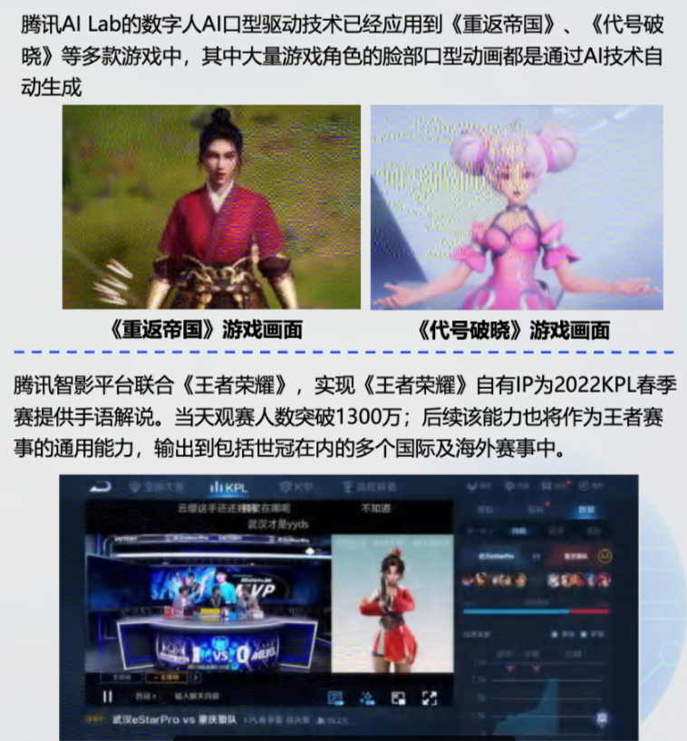

# 虚拟数字人

【泰裤辣！AI生成抽象视频、AI自动剪辑、AI自动拍电影！】<https://www.bilibili.com/video/BV14s4y1u7KX?vd_source=36c9491a7fa2ab8a22ca060af01b7472>

1.图片生成视频引擎kaiber Al：<https://kaiber.ai/>

2.AI自动剪辑视频：<https://www.autopod.fm/>

3.文字生成视频：<https://runwayml.com/>

[‍⁢用ChatGPT三分钟免费做出数字人视频- 提升自媒体魅力 - 飞书云文档 (feishu.cn)](https://y3if3fk7ce.feishu.cn/docx/EfeJdSqPcoh322x1XoCc8uObnic)

## 1.什么是数字人

数字人是指以数字形式存在于数字空间中，具有拟人或真人的外貌、行为和特点的虚拟人物，也称之为虚拟形象、数字虚拟人、虚拟数字人等。

数字人的核心技术主要包括计算机图形学、动作捕捉、图像渲染、AI等。数字人可以打造更完美的人设，为品牌带来正向价值。互联网、金融、电商平台、消费品牌、汽车出行等领域纷纷推出数字人，用于品牌营销、智能客服等方向。

### 1.1 数字人五要素

- 形象生成，数字人的载体.
- 文本生成，文本决定数字人表达的内容，根据不同场景要有智能化的文本生成以及口语表达。
- 语音生成，依赖文本语义的解析质量
- 表情生成，表情生成高度依赖音频韵律与文本语义的解析质量.
- 动作生成，好的肢体表现，高度依赖音频韵律与文本语义。

形象是载体，文本生成的智能程度决定了数宁人的价值上限，ChatGPT是数宁人的大脑。

语音、表情、动作是外在表现，是Agent。Agent的智能程度决定了是否能达到价值上限.

## 2.数字人分类

### 2.1 根据人物图形资源维度

#### 2.1.1 2D数字人

从外形上有2D卡通、2D真人等

#### 2.1.2 3D数字人

从外形上有3D卡通、3D风格化、3D写实、3D超写实、3D高保真等

### 2.2 根据交互与驱动维度

#### 2.2.1 播报型数字

是数字人单向输出，依据目标文本生成对应的人物语音及动画，并合成音视频呈现给用户用户可以自定义文本，通过TTS生成音频内容，音频进而驱动数字人动画;用户也可以直接上传真人录音、视频再驱动数字人动画特点是文本、音频是可以事先人工准备的，所以可控性强。

### 2.2.2 交互型数字人

#### 2.2.2.1 真人驱动交互

真人根据视频监控系统传来的用户视频，与用户实时语音，同时通过动作捕捉采集系统将真人的表情、动作呈现在虚拟数字人形象上。

特点是:从五要素来看，文本、音频都是人产生的，表情、动作 主要在面部捕捉、动作捕捉。

#### 2.2.2.2 AI驱动交互

通过智能系统自动读取并解析识别外界输入信息，根据解析结果决策数字人后续的输出文本(内容层)，然后驱动人物模型生成相应的语音与动作来使数字人跟用户互动 (表现层)。

持点是: 文本生成有大语言模型ChatGpT.音频生成有TTS，表情交互的嘴形相对比较成熟，其他表情交互或动作交互比较固定或者随机，技术还不够成熟。

#### 2.2.3 根据商业应用维度

可分为内容/IP型、功能服务型和虚拟分身等三种

数字人的最终服务对象为C端用户，在B端的应用领域从电影动画向广告营销、电商直播、虚拟偶像等领域不断扩展。未来，以虚拟分身为代表的应用潜力巨大

### 3.技术发展是数字人第一推动力

数字人是多技术综合产物，数字人近年的发展来源于CG(ComputerGraphics，利用计算机进行视觉设计和生产)、语音识别、图像识别、动捕、LLM等相关技术的共同成熟。

#### 3.1 2D数字人技术

2D数字人本质是生成图像，因此主要方式是利用深度学习技术根据视频生成与真人相同的图像，技术相对成熟。逻辑是: **预先拍摄真人视频素材进行训练，生成时将单顿图片合成多帧视频。**

#### 3.2  3D数字人涉及的技术环节拆解

3D数字人制作涉及众多技术领域建模、仿真、渲染、动作捕捉、面部捕捉，制作方法尚未完全定型，自动化程度相对较低，需要大量的人工参与，高效率的生产高质量难度较大，目前领域内部正通过管线化生产的方式对生产流程进行标准化，以提升制作效能

未来将在管线化生产的基础上，通过算法优化和更加便利的工具，如自动化的骨骼和表情绑定工具，使制作更加简单化和一体化，特别通过AI技术提升制作的智能化水平，减少人工参与编辑和调优。

##### 3.2.1 建模

##### 3.2.2 仿真

##### 3.2.3 渲染

###### 3.2.3.1 实时渲染

###### 3.2.3.2 离线渲染

##### 3.2.4 动作捕捉(肢体动作)

##### 3.2.5 面部捕捉

### AI驱动

AI驱动数字人是指数字人等语音表达、面部表情和动作形态等通过深度学习模型进行运算，并将其结果实时或者离线驱动，并进行渲染。当前数宁人对**语言理解还是以文本为主**，动作合成上**声唇同步较为完善**

目前主流的方式是围绕NLP能力通过文本驱动，本质是通过ASR-NLP-TTS等A技术进行感知-决策表的闭环来驱动数字人交互，同时需要预先设置相关的知识图谱或问答库等，与数字人的对话系统对接，但目前NLP在通用性场景的能力还需要进一步完善。

计算机视觉(CV)目前数字**人声唇同步**技术相对完善，在游戏中已经大量应用，而其他表情和动作还需要描述性的数据或者标签驱动，尚未智能合成，表情动作也是是AI驱动未来发展的重点方向。

游戏口播

腾讯数智人AI能力示意

AI技术正在覆盖数字人制作的全流程：除了利用ASR-NLP-TTS等技术驱动数字人交互外，AI技术也应用在2D数字人的视频生成、3D数字人的建模、视频驱动、物理仿真等多个环节。

数字人技术与SLAM、3D交互、体积视频、空间音频等技术深度融合，渲染将从本地到云端

数字人作为3D呈现的一种方式，未来将与其他3D技术如SLAM(即时定位与地图构建)、体积视频、空间音频等融合，进一步完善数字人和真实空间的交互。例如在直播场景中虚拟/真实空间中真人和数字人的交互，数字人对真实空间的感知等。·同时由于数字人对渲染能力要求较高，未来云端渲染是重要的方向，将推动云服务商从算力(CPU) 云服务，到渲染力 (GPU) 的云服务。但成本仍是云染普及的关键阻碍，需要突破。

### 4.千行千面的数字人将成为人机交互新入口

AI驱动的数字人通过AI能力建立人与大数据的连接，提高效率并满足人情感交流需求，提升用户体验，将成为人机交互新入口。
应用广度上:目前使用文字或语音交互的场景都可用A数字人软着陆的方式替代，不需要改变原有的业务逻辑和商业模式，大众接受成本较低，并提供更好的用户体验，未来应用场景非常广泛，可以与各种领域相结合，实现服务规模化和标准化。
应用深度上:数字人作为企业的数字资产，是对员工工作的增强，具有生产力的属性，可以进一步释放生产力，同时降本增效。未来数字人将根据不同行业的业务特点和应用场景进行更深度结合，孵化千行千面的数字员工，提供智能化服务。

后续：[‍⁣⁣⁢⁡⁤‬⁡‍‍⁢‬‌‍‌‬⁡⁤‌⁤⁣⁤⁢‍‬‌⁢‬‌‬‍⁡‬⁢⁡数字人行业概览（更新2023年07月） - 飞书云文档 (feishu.cn)](https://dnipkggqxh.feishu.cn/wiki/FlTMwGP0qiylz9k4jzwcd4VpnJg)

## 🤖 『让人物口型完美匹配音频的AI魔法』轻松制作AI数字替身

Wav2Lip 是一项基于 PyTorch 的深度学习技术，可以处理实时视频和图像序列，将人物口型与给定音频同步。Wav2Lip 的优势在于可以处理各种说话风格和语言，同时生成自然且准确的口型同步效果。

这篇教程详细介绍了 Wav2Lip 的安装和使用全过程，并生成了一个口型与音频同步的视频，展示实际效果。

> 准备工作：安装了需要的软件和库
>
> 第 1 步：下载 Wav2Lip 项目
>
> 第 2 步：安装依赖项
>
> 第 3 步：下载预训练模型
>
> 第 4 步：准备输入文件
>
> 第 5 步：运行 Wav2Lip
>
> 第 6 步：查看结果 [**⋙ 完整过程**](https://mp.weixin.qq.com/s/iKI27FhVCR0BrEYsvSNyCg)

## 🤖 赛博主播燎原东南亚：数字人挤走女主播，星星之火正燃向中国

[赛博主播燎原东南亚：数字人挤走女主播，星星之火正燃向中国 (qq.com)](https://mp.weixin.qq.com/s/Ya8mKXHEJC48gW76XvEFpQ)

东南亚跨境带货出现了大量数字人主播。他们可以自由选择形象和风格，会讲多国语言，24小时不间断直播带货，每个月的费用仅需数百人民币。

为了规避相关风险，大部分跨境商家都采用了数字人主播和真人主播等模式。虽然有真人出镜，会增加费用，但付出的成本依旧远低于聘用成熟主播的成本。

> 在一些碎片时段、边角时段，实际上很适合用数字人直播。数字人直播可以填补真人主播的空档，增加内容的丰富度和覆盖度。

全年无休的数字人正卷走东南亚主播的工作，而这股浪潮也在中国涌动。从2020年直播电商浪潮兴起，中国的数字人直播带货就越演越烈，视频平台上的数字人直播带货开始越来越多。想体验目前数字人最前沿的使用效果，可以跟踪以下平台和账号：

> *▢* 百度：智能数字人平台「曦灵」
>
> *▢* 阿里巴巴：虚拟社交平台「淘宝星球」
>
> *▢* B站：天矢禾念打造的「洛天依」，以及多个有衍生角色
>
> *▢* 抖音：创壹视频打造的虚拟美妆博主「柳夜熙」
>
> *▢* 小红书：燃麦科技打造的国内首个超写实数字人「AYAYI」

## AI 数字人 / 虚拟人 / 视频虚拟主播 数字克隆人

### 海外产品

| 产品         | 链接                      | API接口 | 价格          | 模特  | 克隆定制 |
| ------------ | ------------------------- | ------- | ------------- | ----- | -------- |
| D-ID         | <https://www.d-id.com/>     | 有      | 0.6美元/分钟  | 1200+ | 支持     |
| Heygen       | <https://www.heygen.com/>   |         | 2.4美元/分钟  | 1000+ | 支持     |
| Colossyan    | <https://www.colossyan.com> |         | 0.25美元/分钟 | 60+   | 支持     |
| Runway       | <https://runwayml.com>      |         |               |       |          |
| TwinSync     | <https://twinsync.xyz>      | 有      |               |       |          |
| elai         | <https://elai.io/>          |         |               |       |          |
| DeepBrain Al | <https://wwwdeepbrain.io/>  |         |               |       |          |

## Runway公司

Runway官网：<https://runwayml.com/>

Runway 宣布 Gen-1 和 Gen-2 完全开放，可以免费注册尝试

7月24日，Runway 宣布 Gen-1 和 Gen-2 已经完全开放，任何人都可以注册一个账号免费尝试。需要说明的是，Gen-1 和 Gen-2 是 Runway 研发的两代AI生成系统：

Gen-1是第一代系统，可以实现各种图像到图像、文本到图像等生成任务，如文字换脸、视频背景替换等

Gen-2是新一代系统，实现了文本到视频的生成，只需要文本描述就可以生成逼真的视频，并且图像生成质量也有了大幅度提高，可以生成更高分辨率和更逼真的图片

### 国内产品

| 产品       | 链接                                                 | API接口 | 价格       | 模特 | 克隆定制 |
| ---------- | ---------------------------------------------------- | ------- | ---------- | ---- | -------- |
| 腾讯智影   | <https://zenvideo.qq.com>                              |         | 4.8元/分钟 | 50   |          |
| 阿里数字人 | <https://help.aliyun.com/document_detail/2249316.html> | 有      |            |      | 有       |
| 闪剪       | <https://shanjian.tv>                                  |         | 9.9元/分钟 | 50   |          |
| 奇妙元     | <https://www.weta365.com>                              |         | 9.9元/分钟 | 50   | 有       |
| 跃迁引擎   | <https://www.warpengine.cc>                            |         | 9.8元/分钟 | 20   | 有       |
| 硅基智能   | <https://www.guiji.ai>                                 |         |            |      | 有       |
| 万兴播爆   | <https://virbo.wondershare.cn>                         |         |            | 180  |          |
|            |                                                      |         |            |      |          |

### 开源产品

| 产品      | 链接                                    | 模特 | 克隆定制 |
| --------- | --------------------------------------- | ---- | -------- |
| SadTalker | <https://github.com/OpenTalker/SadTalker> |      |          |
|           |                                         |      |          |
|           |                                         |      |          |
|           |                                         |      |          |
|           |                                         |      |          |

## 虚拟数字人导入剪映人物抠像实例教程

### 平台

| 平台                                                         | 核心功能                                                     | 数字人模板数         | 数字人定制   | 会员费用                                 |
| ------------------------------------------------------------ | ------------------------------------------------------------ | -------------------- | ------------ | ---------------------------------------- |
| 硅基智能 （[https://website.guiji.ai/](https://website.guiji.ai/)） | 语音识别、语义理解、语音合成、音意理解、对话管理、知识图谱、克隆人 | 204人                | 支持 8000/年 | 2380/年 限时长                           |
| KreadoAI ([https://www.kreadoai.com](https://www.kreadoai.com)) | 国内与海外AI数字人口播视频生成、真人实拍模特/虚拟人物融合口播视频创作、AI生成营销文案 | 近70人               | 支持         | 目前免费                                 |
| 风平智能（[https://fullpeace.cn/](https://fullpeace.cn/)）   | 数字人直播、AI短视频生产、虚拟人数字人IP定制                 | 约十几种（主推定制） | 支持         | 企业视频版13800元/年企业高级版26800元/年 |
| 闪剪（[https://shanjian.tv/](https://shanjian.tv/)）         | 图文一键转视频、AI智能完成直播切片、AI自动批量自动创作短视频、在线视频编辑器 | 168人                | 不支持       | 298/月                                   |

1.硅基智能（[https://website.guiji.ai/](https://website.guiji.ai/)）
硅基智能提供数字人技术解决方案，主要应用于金融、保险、医疗等领域。硅基智能的数字人技术具有高度的安全性和自然语言交互能力，可以实现高度个性化的数字人服务。数字人模板数量较多，覆盖各种场景，而且支持数字人定制，可以根据客户需求进行定制化服务，定制数字人的形象、动作、说话等都十分自然，因此可以为用户带来更加全面逼真的数字人体验。但使用会员费用较高，一般人可能会望而却步。

2.KreadoAI([https://www.kreadoai.com](https://www.kreadoai.com))
Kreado的数字人技术具有高度的自然语言交互能力和虚拟形象表现能力，主要应用于游戏、电商、娱乐等领域。目前市面上很多做得好的AI视频工具都是收费使用，价格高低不等，但是KreadoAI可以免费使用。此外，它支持140余种多语种语音合成，智能生成的营销文案高效又保质，可以根据场景需要选择数字人说话语气，为数字人语音注入情感，让出海营销更加便捷高效。免费使用、无需下载、用完即走，这些特点也让很多新手小白开始大胆尝试数字人视频创作。

3.风平智能（[https://fullpeace.cn/](https://fullpeace.cn/)）
风平智能通过AI深度神经网络生成技术生成的数字人形象，主播外观形象上更加逼真，在直播过程中，虚拟主播还可以实时回答观众的问题，互动性和精准性更强，因此在数字人直播和数字人IP定制方面表现较为出色。风平智能的数字人技术主要应用于短视频、直播、教育等领域。

闪剪是一款短视频制作工具，它可以帮助用户快速制作高质量的短视频内容，同时也提供了一些虚拟数字人模板，可以让用户在短视频中添加虚拟数字人。视频模板丰富，提供多个智能配音员和多样化背景音乐，操作简单，基于单一素材拆分、重组、包装，智能生产海量的差异化短视频内容，轻松进行视频创作。还有直播快剪功能，非常适合直播运营新手，轻松实现短视频引流。

### AI免费图片生成视频的网站

官网：[Genmo](https://alpha.genmo.ai/)

### D-ID数字人生成

D-ID 是一个 Web 应用，它使用实时人脸动画和高级文本到语音转换来创建身临其境且类似人类的对话 AI 体验。免费的应用程序可让您与ChatGPT面对面交谈。

打开D-ID网站，注册并登录：<https://www.d-id.com/>

文案和人物面部人像准备，上传和生成

### Colossyan数字人生成

在几分钟内从文本创建 AI 视频，只需单击一个按钮即可自动翻译成数十种语言。

官网：[Colossyan Creator - AI Video Generator](https://www.colossyan.com/)

收费网站，Colossyan新注册的账号有长达14天的一个pro版的免费试用，可以使用QQ邮箱进行账号注册

虚拟数字人口播

### KreadoAI数字人生成

KreadoAI官网：[KreadoAI_AI video creation platform/AI视频创作平台/kreadoai.com](https://www.kreadoai.com/)

它利用AI智能生成营销文案、超过140余种的多语种TTS语音合成、唇形语音视频合成等AI技术应用于虚拟数字人的视频内容创作过程中，基于平台提供的60余种多国家不同的数字人物，只要输入关键词，就可以生成多语种适配的高质量短视频，大大提高视频制作效率。它不仅可以帮你找到高质量的广告文案和素材，还可以让你轻松实现视频制作、批量化创作和国际化营销。而且它不不需要复杂的操作，注册登录后免费使用、无需下载、用完用完即走。

可以使用QQ邮箱注册，注册后登录，可以看到内置了一些数字人，可以选择生成，也可以自定义上传图像和输入自定义文案生成自己的数字人口播

### 数字人抠像

PS抠图：

抠图开源项目：

网站在线抠图：

剪映软件工具智能抠图：

## 数字人相关开源项目

RAD-NeRF：<https://github.com/ashawkey/RAD-NeRF>

教程：【数字人相关开源项目介绍】<https://www.bilibili.com/video/BV1dh4y1X7k3?vd_source=36c9491a7fa2ab8a22ca060af01b7472>
