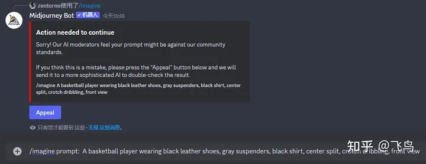

# 开源换脸项目

| 项目名称                  | 项目地址                                                | 项目描述                                                     | star 数 |
| :------------------------ | :------------------------------------------------------ | :----------------------------------------------------------- | :------ |
| generators-with-stylegan2 | https://github.com/a312863063/generators-with-stylegan2 | 基于 StyleGAN2 的人脸生成器，可以生成网红脸、明星脸、超模脸、萌娃脸、港风美女脸等，还可以编辑人脸属性 | 3.9k    |
| avatarify-python          | https://github.com/alievk/avatarify-python              | 实时视频换脸项目，可以将自己的脸替换成别人的脸，在视频会议中表现流畅 | 13.8k   |
| AnimeGAN                  | https://github.com/TachibanaYoshino/AnimeGAN            | 将照片转换为动漫风格的项目，支持宫崎骏、新海诚等日漫大师的手绘风格 | 6.9k    |
| photo2cartoon             | https://github.com/minivision-ai/photo2cartoon          | 将照片转换为动漫头像的项目，支持上传或拍摄照片，生成专属动漫头像 | 7.1k    |
| faceswap                  | https://github.com/deepfakes/faceswap                   | 最主流的开源换脸项目之一，支持多种模型和选项，可以实现高质量的换脸效果 | 36.8k   |

## DeepFaceLive

### 简介

DeepFaceLive是一款实时人脸交换软件，可用于PC流媒体或视频通话。

它可以在Discord上与其他用户交流，也有中文交流论坛和QQ群。

用户可以通过遵循FAQ中的建议训练自己的人脸模型，并将其分享到Discord上。

此外，GitHub上还有其他与中文字符和语言学习相关的项目，如描述汉字结构的RRPL和用于创建练习写字和闪卡的Python脚本。

### 软件地址

开源地址：[iperov/DeepFaceLive: Real-time face swap for PC streaming or video calls (github.com)](https://github.com/iperov/DeepFaceLive)

实时直播推流要求显卡最低2080ti

### 效果展示

- 【deepfacelive 杨幂dfm直播效果展示】<https://www.bilibili.com/video/BV1Ku411s7bb?vd_source=36c9491a7fa2ab8a22ca060af01b7472>
- 【deepfacelive测试--换脸成龙】<https://www.bilibili.com/video/BV1F8411f7rU?vd_source=36c9491a7fa2ab8a22ca060af01b7472>

## Deepfake

换脸开源项目叫做 **DeepFaker**，它是一个基于 **DeepFaceLab** 的在线换脸平台，可以让用户上传自己的视频和目标视频，然后自动进行换脸处理，生成新的视频

Deepfake 是 AI 生成的“假”图像、音频和视频，使用自动编码器或生成对抗网络，将原始图像/音视频中的人替换为其他人的肖像，从而轻松欺骗普通观众。自几年前推出以来，Deepfake 被居心叵测者大规模用于欺诈、色情或诽谤活动而备受关注。随着 Deepfake 技术变得越来越复杂，确定视频的真实性也变得越来越困难。

论文：[Protecting world leaders against deep fakes using facial, gestural, and vocal mannerisms (pnas.org)](https://www.pnas.org/doi/pdf/10.1073/pnas.2216035119)

- 不需要安装任何软件，只需要一个浏览器就可以使用
- 提供了多种换脸模型，包括 **Quick96**、**SAEHD**、**DFL-H128** 等
- 支持多种语言，包括 **中文**、**英文**、**日文** 等
- 提供了详细的换脸教程和常见问题解答
- 支持免费试用和付费服务，付费用户可以享受更高的换脸质量和速度

项目的网址是：https://www.deepfaker.xyz/

## DeepFaceLab

**DeepFaceLab** 是一个用于创建换脸视频的开源软件，它是目前市场上最领先的换脸系统，超过 95% 的换脸视频都是用它制作的。它的特点是：

- 它使用了 **深度学习** 的技术，可以实现高质量和高逼真度的换脸效果
- 它提供了多种换脸模型，包括 **DF**、**LIAE**、**SAE**、**SAEHD** 等，可以根据不同的数据集和需求选择合适的模型
- 它支持多种人脸类型，包括 **全脸**、**半脸**、**头部** 等，可以应对不同的场景和角度
- 它有详细的 **教程和文档**，可以帮助用户快速上手和解决问题
- 它有活跃的 **社区和讨论组**，可以让用户交流经验和反馈意见

这个项目的网址是：https://github.com/iperov/DeepFaceLab

你可以在这里下载最新的版本，查看源码和更新日志，以及参与讨论和贡献。

地址: https://deepfacelab.en.softonic.com/

开源地址：https://github.com/iperov/DeepFaceLab

中文网：[DeepFake中文网 – AI换脸入门教程，软件下载，使用交流 (deepfaker.xyz)](https://www.deepfaker.xyz/)

## InsightSwapFace

InsightSwapFace是一款由微软开发的面部替换工具。 它可以让用户将一个人的面部替换到另一个人的面部，即使他们在不同的图片中。 InsightSwapFace使用深度学习技术来实现这一点，它仍在开发中，但已经能够生成逼真的结果。

InsightSwapFace可能有许多潜在用途，例如在电影和电视制作中创建替身，或在新闻报道中保护受害者的隐私。 然而，它也可能被用于恶意目的，例如创建假新闻或在社交媒体上传播虚假信息。

**InsightFace官方网站**：[InsightFace: an open source 2D&3D deep face analysis library](https://insightface.ai/)

**InsightFace开源地址**：[deepinsight/insightface: State-of-the-art 2D and 3D Face Analysis Project (github.com)](https://github.com/deepinsight/insightface)

我们可以通过discord的InsightSwapFace直接实现一键换脸。

这是邀请链接：https://discord.com/oauth2/authorize

点击后直接确认授权添加到自己的服务器即可。在文本框内输入**/**，查看InsightSwapFace bot是否添加成功

现在简单介绍一下如何使用它，这里我简单写了一个参数指导文档：

### 命令列表

InsightFaceSwap bt支持以下斜杠命令:

```bash
/saveid name upload-image
```

用于上传照片注册ID特征

```bash
/setid name(s)
```

设定默认源ID名称

```bash
/listid
```

列出所有注册的ID名称

```bash
/delid name
```

删除特定ID名称

```bash
/delall
```

删除所有ID

```bash
/swapid name(s) upload-image
```

对上传的照片进行ID替换，使用指定的ID名称(或名称列表)。

在百度上找一张坤坤的正面照，把它保存至本地，如下图。


然后通过上面的**/saveid**命令，将这张图片上传至InsightFaceSwap。


下一步的工作就简单了，直接用Midjourney生成一张打篮球的图片，如果还不清楚如何使用Midjourney的同学参考这篇文章[再写一个midjourney的详细使用教程 | 高治中的个人空间 (x521.top)](https://x521.top/index.php/2023/07/01/midjourney-2/)：

通过[这个网站](https://ai.wayhu.cc/)来生成提示词，在[推荐几个适用于MJ和SD的提示词网站 | 高治中的个人空间 (x521.top)](https://x521.top/index.php/2023/07/06/prompt/)这篇文件内介绍过。


我按照上面提示词在MJ内生成一张打篮球照片居然违反了社区规定（看来哥哥的影响力无处不在）



那么修改一下提示词再试一下，就得到了如下的四组图片。


我们选择U2来提高画面的精细度，并在得到的图片上邮件选择--app-INSwapper，如下图。


这样就会得到经过AI换脸后的图像，下面这张是用Midjourney生成的原图：


这一张为AI换脸后的图片：


整体效果还可以，可能由于角度的问题看起来感觉不够自然。我生成一张中国篮球运动员重新换脸试一下：


嗯，看起来自然多了。好了，今天的教程到这里了，感兴趣的同学可以亲自上手试一下。


直播换脸技术被一些不法分子用于诈骗和欺骗，这是一种新型的诈骗手段。利用换脸技术，诈骗者可以冒充他人身份，欺骗受害者提供敏感信息、转账等。这种诈骗手段给个人和企业带来了巨大的风险和损失。

现在，很多科技公司正在研究如何利用AI技术来防范直播换脸欺诈。例如，微软的Azure云平台支持对视频流进行加密和解密，以及对传输的流的完整性进行验证。此外，一些公司还在开发基于人工智能的面部辨识技术，从而帮助检测和防止直播换脸欺诈。

下面介绍4款常用的换脸工具，大家依法使用，不要用在犯法的事情上。

## DeepSwap

链接：https://www.deepswap.ai/

DeepSwap是一款在线AI换脸应用，可用于视频、照片和GIF。

DeepSwap使用深度学习技术，可以将一个人的脸部特征转移到另一个人的脸上，从而实现换脸。DeepSwap是一款收费应用，但提供免费试用。试用期结束后，用户需要购买套餐才能继续使用DeepSwap。

## Faceswap

链接：https://faceswap.akool.com/

Akool FaceSwap是一款在线换脸工具，可以在几秒钟内完成换脸操作。

• Akool FaceSwap是一款在线换脸工具，可以帮助用户快速完成换脸操作。
• 该工具可以在照片和视频中交换人脸，生成有趣的照片和视频。
• Akool FaceSwap的结果非常逼真和流畅，可以用于广告和商业内容本地化。

## Swapface

链接：https://swapface.org/

Swapface是一种AI技术，可以实现面部交换，包括图片、视频、gif和直播。

🌍[**Swapface**](https://swapface.org/) 是一款实时换脸的 AI 工具，帮助你一秒钟成为任何人！使用 Swapface 可以在一秒钟内创建换脸直播，还可以从图库数千个高颜值面孔中进行选择，快速成为帅哥美女。

此外，**Swapface 允许任何人以极低的成本为PC流媒体、视频通话创建高质量的实时换脸**，因此技术在娱乐、游戏、讽刺和文化方面具有巨大的潜力。

## 生成对抗网络（GAN）技术

2014 年，大名鼎鼎的生成对抗网络（GAN）技术诞生，从那时起 AI 界涌现了大量好玩的换脸研究。GitHub 上的人脸生成器层出不穷，网红脸、明星脸、超模脸，你想要的样子，都能生成。
今天盘点 5 个有趣的 GitHub 项目，这些都应用了 GAN 这项技术，包括一键换脸、漫画头像、漫画风格等。关于 GAN 相关原理我在历史文章 [《GitHub 上有哪些去除马赛克的项目》](https://link.zhihu.com/?target=http%3A//mp.weixin.qq.com/s%3F__biz%3DMzUxNjg4NDEzNA%3D%3D%26mid%3D2247491431%26idx%3D1%26sn%3D0741ecb86a597fa49d0adaac62d8e8ea%26chksm%3Df9a1ccaeced645b83f416eff09d401ea6f0743c9af309909391af350593e8dd39e3258c1395d%26scene%3D21%23wechat_redirect) 中讲过，感兴趣的可以去看看。

本文提到的所有开源项目，我都提供了项目的链接，连接不上 GitHub 可以从下方取：链接: [https://pan.baidu.com/s/1GgBcxzEuMg8tHy8VU2k6ng](https://link.zhihu.com/?target=https%3A//pan.baidu.com/s/1GgBcxzEuMg8tHy8VU2k6ng) 密码: e9a8

***01.\* 人脸生成器**

这个开源项目是基于 StyleGAN2 制作的新版人脸生成器，可以生成网红脸、明星脸、超模脸、萌娃脸、港风美女脸等，而且还能够对人脸属性进行编辑，比如调节年龄、加个眼镜。

**地址**：https://github.com/a312863063/generators-with-stylegan2

下面这些港风脸都是通过香港美女的数据集训练出来的合成人脸：


还可以编辑人脸的熟悉，比如调节笑容：


更改年龄：


调整性别：


甚至可以调整颜值：


***02.\* 视频换脸**

换脸项目 Avatarify 火爆了 GitHub。利用这项技术，你可以将自己的脸实时替换成别人的脸，在视频会议中的表现十分流畅。迄今为止这个项目已在 GitHub 上获得了 13.8k 的 star 量。

你甚至不需要从头训练模型，有人发布了客户端版本，支持 Windows 系统。


**地址**：https://github.com/alievk/avatarify-python
**地址**：https://github.com/alievk/avatarify-desktop

除了换成明星脸，你也可以换成狗：


***03.\* 一键生成动漫风格**

随手拍张照片，顺势转换为宫崎骏、新海诚等日漫大师的手绘风格作品，这个专门生成动漫图像的开源项目，实测很好用。GitHub 上确实有这样的开源项目，输入一张手机拍摄的照片，立即变换为日本动漫风格。

**地址**：https://github.com/TachibanaYoshino/AnimeGAN


***04.\* 动漫头像**

这个开源项目比较有趣，上传或者拍摄一张自己的照片，2S后就能生成你的专属动漫头像。

**地址**：https://github.com/minivision-ai/photo2cartoon


***05.\* 自动 P 图**

你有没有想过这样一个场景，当你对着一张原图说：帮我 P 一个帅气的留海，啪！一个具有帅气留海的图片便自动生成了。


没错，现在已经有开源的算法能做到这些。输入原图，只需要附加上你想 P 成什么样的描述，它就会帮你自动 P 图。

看几个例子：

看看权游演员的一键 PS，第一列是输入的原图，第二列是莫西干的 Style，第三列是卷发，第四列是非洲 Style，还是最后一列粉嫩。


生成的最后一排的马斯克笑死我了，尤其是扫把头。


最后，防止找不到本篇文章，可以收藏点赞，方便翻阅查找。刚刚提到的所有开源项目，可以访问项目链接了解详情，连接不上 GitHub 可以从下方取：

链接: [https://pan.baidu.com/s/1GgBcxzEuMg8tHy8VU2k6ng](https://link.zhihu.com/?target=https%3A//pan.baidu.com/s/1GgBcxzEuMg8tHy8VU2k6ng) 密码: e9a8
