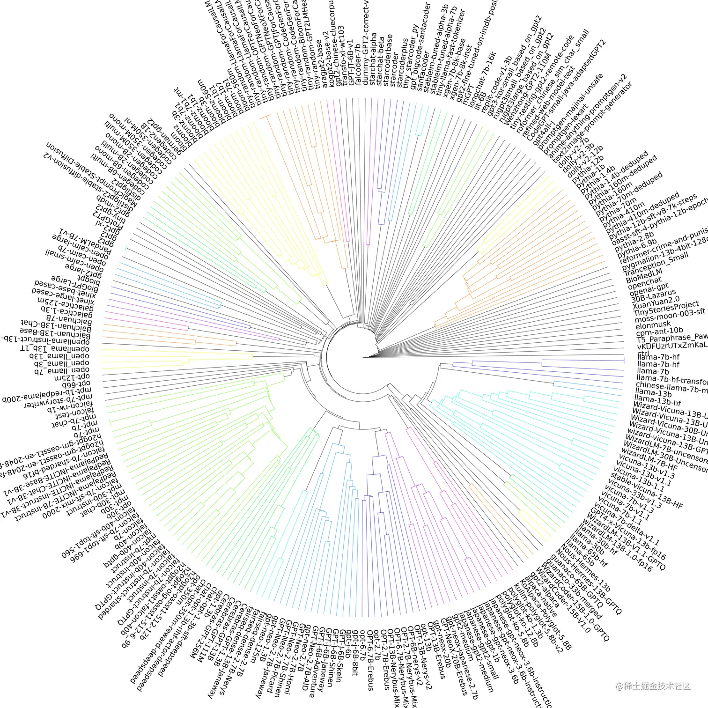

# 开源LLM微调训练指南

## Flowise - 轻松构建 LLM 应用程序

[FlowiseAI/Flowise：拖放UI来构建您的自定义LLM流程 (github.com)](https://github.com/FlowiseAI/Flowise)

## The Document is All You Need！一站式 LLM 底层技术原理入门指南

**飞书文档**：[⁡The Document is All You Need！一站式 LLM底层技术原理入门指南 - 飞书云文档 (feishu.cn)](https://s3tlxskbq3.feishu.cn/docx/NyPqdCKraoXz9gxNVCfcIFdnnAc)

这是一篇非常「硬核」的飞书文档，面向非科班出身但想要了解AI技术原理的受众，帮助实现**零基础入门大语言模型 (Large Language Mode, LLM) 底层技术原理**。

文档从浅到深，覆盖了非常多内容细节，并在持续更新 LLM 最新技术进展及相关原理！**如果你对ChatGPT等大语言模型感兴趣、希望入门了解大语言模型这件事、想知道这个世界上正在发生什么**，那这篇文档值得放入你的收藏夹~

> 1. Introduction：人工智能概述
> 2. 入门 | 多层感知器 Multiple-Layer Perceiver， MLP
> 3. 入门 | 卷积神经网络 Convolutional Neural Network， CNN
> 4. 入门 | 循环神经网络 Recurrent Neural Networks， RINNS
> 5. 入门 | 强化学习 Reinforcement Learning， RL
> 6. 入门 | 自然语言处理与语言模型 NLP & LanguageModeI， LM
> 7. 开始进入正题！seq2seq模型与注意力机制 Attention！ (2014)
> 8. RNN 时代的 BERT 和 GPT！Semi-Supervised Sequence Learning：怎么用大量无标注样本去做自监督学习？ (2015)
> 9. 欢迎来到芝麻街家族！图解ELMo：Embedding的新纪元 (2018.2)
> 10. Attention is All You Need！大语言模型的基石 Transfoormer (2017)
> 11. ULM-FiT 与多任务学习 Multitask Learning：NLP的 ImageNet 时刻 (2018.5)
> 12. 它来了它来了，终于等到你！大篇幅详解 GPT，GPT-2 与 GPT3
> 13. 预训练语言模型的新范式：Prompting！
> 14. 为什么它诞生之初远比 GPT 出风头？图解芝麻街家族新员BIERT！(2018.10)
> 15. 回看波澜壮阔的语言模型乃至 NLP 的发展史！

## Llama 2微调的极速指南，制作对话摘要生成器

[A simple guide to fine-tuning Llama 2 (brev.dev)](https://brev.dev/blog/fine-tuning-llama-2)

这是一篇极速操作指南，结合**代码案例**演示了如何使用 Hugging Face 库对 Llama 2 模型进行微调 (fine-tuning)，使其成为一个对话摘要生成器，对于 Llama 模型的实际使用具有很好的参考价值。

> 1. **Download the model**：通过 clone Llama 的 inference repo 来下载 Llama 2 的7B模型，并组织好目录结构，准备接下来的转换和训练；**这一步获取了基础的Llama 2模型**
> 2. **Convert model to Hugging Face format**：使用提供的转换脚本，将原始的 Llama 2 模型转换为 Hugging Face 的格式，方便后续通过 Hugging Face 的 API 进行微调；**这一步实现了模型格式的转换，为 fine-tuning 做好了准备**
> 3. **Run the fine-tuning notebook**：基于 Hugging Face 的 transformers 库，作者编写了一个 nNotebook，内含了数据集准备、模型加载、设置训练参数等代码，可以直接运行进行对话摘要任务的微调；**这一步完成了对话摘要模型的训练**
> 4. **Run inference on your fine-tuned model**：由于 Hugging Face 仅保存 adapter 权重，所以需要将经过微调的权重加载到完整 Llama 2 模型中，然后就可以进行推理和生成对话摘要了；**这一步实现了利用微调过的模型进行下游任务**

## LLM 超全综述博客，并在HN引发热烈讨论

[**⋙ Blog**](https://willthompson.name/what-we-know-about-llms-primer) | [**Hacker News**](https://news.ycombinator.com/item?id=36860992)

这是一篇由 Will Thompson 撰写的大语言模型 (LLM) 综述性文章，并被分享到了 Hacker News (HN) 引发了热烈的讨论。文章包含以下主要内容：

> 1. **介绍**：概述了当前社会各界对 LLM 的广泛关注和讨论，以及文章作者出于理性分析的立场进行撰写的目的
> 2. **我们对 LLM 的理解**
>
> - **LLM 的技术内涵**：详细介绍了 LLM 的技术原理 (包括 Transformer、Attention 机制、并行处理等)，分析了 LLM 相较 RNN 的优势，以及模型规模不断增长的趋势
> - **LLM 的分类**：根据语言处理过程的不同，可分为 Encoder、Decoder 和 Encoder-Decoder 三类 LLM 模型，各有优势
>
> 1. **我们过去对 LLM 的认知**
>
> - **泛化能力**： LLM 可快速泛化应用到新的任务，无需全新训练，体现出强大的迁移学习能力
> - **性能可预测**：模型规模越大，数据量越多， LLM 性能 predictable，呈现可量化的规模法则
> - **研究热点**：介绍了 LLM 研究的主要方向，包括模型缩放、效率提升、多模态等
>
> 1. **InstructGPT 的贡献**：InstructGPT 通过引入 SFT 和 RLHF 提升了 LLM 的可控性和 alignment，为后续模型奠定基础
> 2. **Instruction Fine-tuning 和 RLHF**：详细解释了InstructGPT的两大技术要点，包括实现方式、意义等
> 3. **LLM 作为推理代理**：基于 Prompt Engineering等技术，LLM 可作为推理代理完成复杂任务，发挥强大的问题解决能力

Hacker News 页面收获了近200条留言，评论者积极讨论了 LLM 的现状和发展前景等话题：

> 1. **LLM 技术目前还处在哪个阶段**：有人认为仍在高峰期，也有观点是已经进入「幻灭期」
> 2. **关于杀手级应用的意见不一**：有人认为 Copilot 等就是杀手级应用，也有评论认为目前还没有出现真正的杀手级应用
> 3. **关于商业应用**：讨论了 LLM 在知识管理、产品教学等方面的应用潜力。但也有观点认为空洞的营销应用居多
> 4. **关于社会影响**：担心就业损失的声音比较多。也有观点认为真正受影响的可能只是一小部分人
> 5. **技术讨论方面**：有评论分析了不同 Transformer 架构的区别，以及在不同任务上的适用性
> 6. **关于研究方向**：提到了 Interpretability 等让 LLM 决策更可解释的研究趋势
> 7. 还讨论了 customizable 芯片、降低训练成本等硬件方向，以及提升安全性、避免偏见等方面的研究价值

## 开源LLM微调训练指南：如何打造属于自己的LLM模型

原文：[开源LLM微调训练指南：如何打造属于自己的LLM模型 (qq.com)](https://mp.weixin.qq.com/s/R-6ds1bFmOqPANIgVCs2Gg)

LLM应该算是目前当之无愧的最有影响力的AI技术。而很多人在领略了 GPT 等大语言模型的魅力后，迫不及待地考虑能将模型能力集成到自己的产品中去。

这篇文章就聊到了这个话题——大语言模型 (LLM) 微调训练。这是一篇系统的 LLM 微调指南，对初学者掌握 LLM 微调技术非常有价值：

> 1. **介绍**：介绍了商用LLM模型存在的问题，包括使用成本高昂和数据隐私风险，因此建议微调开源LLM模型来实现自己的目标
> 2. **什么是迁移学习**：解释了什么是迁移学习,以及如何通过微调预训练语言模型来适应新的任务
> 3. **选择合适的基础模型**：提出了选择基础 LLM 模型的方法，包括参考模型排行榜、检查许可证、注意模型大小等，推荐使用 Hugging Face 的 falcon 系列
> 4. **如何准备模型训练数据**：详细解释了如何准备高质量的 LLM 训练数据集，包含数量、自动生成、遵循的格式等方面
> 5. **如何选择模型训练环境**：推荐了模型训练环境的选择，推荐了各种获取 GPU 资源的方式，建议初学者使用 Google Colab
> 6. **开始训练你的 LLM 模型**：指导了如何用 Hugging Face 的 Transformer 库加载模型，并使用 QLoRA 技术进行微调
> 7. **模型推理**：给出了模型推理的代码示例，展示了如何使用微调后的模型生成回复
> 8. **总结**：总结要点，微调开源LLM模型可以获得比较好的结果，适合各种实际应用场景

## LLM 开发必修课，6周教你用热门框架开发商业级 LLM 产品

[Databricks: Large Language Models: Application through Production | edX](https://www.edx.org/course/large-language-models-application-through-production/)

这是 Databricks 出品的「**Large Language Models: Application through Production (大语言模型：产品中的应用)**」在线课程，国内小伙伴们可以在 edX 网站免费观看。

这门课程面向开发人员、数据科学家和工程师，帮助使用最流行的框架 (如Hugging Face、LangChain) 来构建面向大语言模型的应用程序。通过这门课程的学习,你能够构建一个端到端的LLM工作流程，使其准备上线生产。

### 🔔 **课程章节**

> *▢* 模块1：用LLM应用
>
> *▢* 模块2：嵌入、向量数据库和搜索
>
> *▢* 模块3：多阶段推理
>
> *▢* 模块4：LLM的微调和评估
>
> *▢* 模块5：社会与LLM-偏见和安全
>
> *▢* 模块6：LLMOps

### 🔔 **学习收获**

> *▢* 如何使用流行的库 (如Hugging Face、LangChain) 将 LLM 应用到自然语言处理 (NLP) 的实际问题中
>
> *▢* **如何使用嵌入和向量数据库将域知识和记忆添加到 LLM 流程中**
>
> *▢* **理解预训练、微调和提示工程的细微差别,并将这些知识应用到自定义聊天模型的微调中**
>
> *▢* 如何使用不同的方法来评估 LLM 的效果和偏见
>
> *▢* 如何实现 LLMOps 和多阶段推理最佳实践的 LLM 工作流程
>
> *▢* **如何利用 LLMOps 最佳实践在规模上部署模型**

## LLM 进化树升级版！清晰展示 15821 个大语言模型的关系

[**⋙ 论文**](https://arxiv.org/ftp/arxiv/papers/2307/2307.09793.pdf)

这张进化图来自于论文 「***On the Origin of LLMs: An Evolutionary Tree and Graph for 15,821 Large Language Models***」，构建了一个包含15821个大型语言模型的进化树和关系图，以便探索不同的大模型之间的关系

## 大模型微调 (finetune) 方法总结，带你解锁5种技术

这篇文章详细介绍了 LoRA、Adapter、Prefix-tuning、P-tuning 和 Prompt-tuning 这5种微调技术的方法论、实现原理和优缺点，并对每种方法都进行了翔实的技术解读&效果展示，让读者快速理解每种微调技术的精髓所在。

在实践中合理地选择和应用这些大模型微调技术,可以有效提升下游任务的效果，取得与全模型微调接近的表现，而又大幅降低了算力和存储成本。这对于中小企业能否取得大模型带来的效果提升,具有重大意义。

> *1*. **LoRA**
>
> *▢* **论文**：LoRA: Low-Rank Adaptation of Large Language Models - [arxiv.org/pdf/2106.09…](https://arxiv.org/pdf/2106.09685.pdf)
>
> *▢* **代码**：[github.com/microsoft/L…](https://github.com/microsoft/LoRA)
>
> *▢* **简介**：通过增加旁路低秩矩阵来模拟全模型微调，只训练降维矩阵A和升维矩阵B，固定原模型参数，实现轻量级微调
>
> *2*. **Adapter**
>
> *▢* **论文**：Parameter-Efficient Transfer Learning for NLP - [arxiv.org/pdf/1902.00…](https://arxiv.org/pdf/1902.00751.pdf)
>
> *▢* **论文**：MAD-X: An Adapter-Based Framework for Multi-Task Cross-Lingual Transfer - [arxiv.org/pdf/2005.00…](https://arxiv.org/pdf/2005.00052.pdf)
>
> *▢* **简介**：在模型层中添加 Adapter 模块，只训练 Adapter 的参数，固定原模型，避免灾难性遗忘；Adapter Fusion 通过两阶段训练提升性能
>
> *3*. **Prefix-tuning**
>
> *▢* **论文**：Prefix-Tuning: Optimizing Continuous Prompts for Generation - [arxiv.org/pdf/2101.00…](https://arxiv.org/pdf/2101.00190.pdf)
>
> *▢* **代码**：[github.com/XiangLi1999…](https://github.com/XiangLi1999/PrefixTuning)
>
> *▢* **简介**：为模型添加连续的任务特定向量作为前缀，只优化前缀参数，实现轻量级微调
>
> *4*. **P-tuning**
>
> *▢* **论文**：GPT Understands, Too - [arxiv.org/abs/2103.10…](https://arxiv.org/abs/2103.10385)
>
> *▢* **代码**：[github.com/THUDM/P-tun…](https://github.com/THUDM/P-tuning)
>
> *▢* **简介**：使用模板和编码过的 prompt，在输入前后加入 anchor，同时只更新 prompt 的参数，适合 NLP 下游任务
>
> *5*. **Prompt-tuning**
>
> *▢* **简介**：为每个任务自定义 prompt 拼接在输入上，固定原模型只训练 prompt，可以达到与全模型微调相近的效果 [**⋙ 知乎 @腾讯技术工程**](https://zhuanlan.zhihu.com/p/644122818)

## 如何评估一个大语言模型？看微软这篇 LLM 能力评测综述

大型语言模型（Large language models, LLMs）因其在学术界和工业界展现出前所未有的性能而备受青睐。随着 LLMs 在研究和实际应用中被广泛使用，对其进行有效评估变得愈发重要。

微软亚洲研究院的 ***A Survey on Evaluation of Large Language Models*** 是大模型评测领域的第一篇综述文章，一共调研了219篇文献，以**评估对象 (what to evaluate)** 、**评估领域 (where to evaluate)** 、**评估方法 (How to evaluate)** 和目前的评估挑战等几大方面，对大模型的评估进行了详细的梳理和总结。

> 1. **评测什么**：自然语言处理、鲁棒性/伦理/偏见和真实性、医学应用、社会科学、自然科学与工程、代理应用、其他应用
> 2. **在哪评测**：总结了19个流行的基准测试，每个基准关注不同的方面和评估标准，为各自的领域做出了贡献
> 3. **如何评测**：介绍了自动评估和人工评估两种主要方法。这两种方法在评估语言模型和机器翻译等任务时起着重要的作用
> 4. **综述总结**：总结大语言模型的成功案例和可能的失败情况
>
> 1.**重大挑战**：提出了7项大语言模型评估面临的重大挑战
>
> - **设计 AGI 基准测试**：什么是可靠、可信任、可计算的能正确衡量 AGI 任务的评估指标？
> - **设计 AGI 基准完成行为评估**：除去标准任务之外，如何衡量 AGI 在其他任务，如机器人交互中的表现？
> - **稳健性评估**：目前的大模型对输入的 prompt 非常不鲁棒，如何构建更好的鲁棒性评估准则？
> - **动态演化评估**：大模型的能力在不断进化、也存在记忆训练数据的问题。如何设计更动态更进化式的评估方法？
> - **可信赖的评估**：如何保证所设计的评估准则是可信任的？
> - **支持所有大模型任务的统一评估**：大模型的评估并不是终点、如何将评估方案与大模型有关的下游任务进行融合？
> - **超越单纯的评估**：大模型的增强：评估出大模型的优缺点之后，如何开发新的算法来增强其在某方面的表现？ [**⋙ 论文**](https://arxiv.org/abs/2307.03109) | [**GitHub**](https://github.com/MLGroupJLU/LLM-eval-survey) | [**中文解读 @微软亚洲研究院**](https://mp.weixin.qq.com/s/eFNx97ajxZnWZ-X-19KBNg)

## 拾象实践：为了理解 AI-Native，我们做了几款AI应用

[**⋙ @海外独角兽**](https://mp.weixin.qq.com/s/QCpGXsqYRzfHIPBiHAlsRw)

拾象团队内部进行了一系列 LLM 应用开发的实践，既包括对话式内部知识库、音视频转录这类效率工具，也有复刻 GPT、LLM 输入法等偏实验性质尝试。这是技术负责人秦佳豪对 LLM 应用实践的阶段性总结回顾。

虽然大部分实践在这个时间点看起来已经「过时」甚至「徒劳」，但快速了解一个行业的最佳的方式就是参与其中，尤其是 LLM 这样的新浪潮。本篇 LLM 应用探索笔记则是一位一线开发者对 LLM 的思考。

### 💡 **LLM 应用实践复盘**

> *1*. **实践1-对话式内部知识库**：利用 GPT-3 接口实现对话式搜索，部署成飞书机器人使用；虽然效果不错，但 davinci-002 理解能力仍不足，需要连接真实数据才能提升准确性
>
> *2*. **实践2-复刻instruct GPT**：参考论文，使用 trlx 库对 GPT-2 中文进行 finetune，实现简易的instruct GPT；可以通过改变提示实现情感分析切换，但整体效果与ChatGPT相比仍有差距
>
> *3*. **实践3-让ChatGPT上网**：通过浏览器与网络接口，实现 ChatGPT 查询互联网信息的功能。不同任务使用不同的数据和 API，扩展了 ChatGPT 的能力边界
>
> *4*. **实践4-端侧推理产品探索**：尝试通过移动输入法、翻译耳机等端侧部署，实现本地推理；但受限于硬件和系统，效果一般

### 💡 **LLM应用一：PickPod**

> *1*. 开发了音视频内容总结工具，支持准确转录及提取关键信息
>
> *2*. **后期转为利用 LLM 提取「非共识」，实现个性化的播客发现和推荐，根据用户反馈不断改进**

### 💡 **LLM应用二：盗梦笔记**

> *1*. 实现基于网页的AI驱动跑团游戏，多个 AI agent 分工协作推进游戏
>
> *2*. 添加创作者模式，可以导入故事或通过提示自动生成游戏模块，还可以修改和优化
>
> *3*. **不同AI模型可以实现不同的游戏风格，Claude 表现突出，同时可以通过游戏采集交互数据**

### 💡 **总结**

> *1*. **工程实现被模型能力提升淹没，但可以快速感受 LLM 应用发展**
>
> *2*. **控制成本和实现可持续业务模式是关键**，游戏等娱乐形式有天然优势
>
> *3*. **模型强弱取决于使用场景**，端侧推理可提升安全性，基础服务可大幅提高应用效率
>
> *4*. **影响下一代用户和硬件发展，才是 LLM 应用的关键所在**
