# AI模型训练

[强推！大语言模型『百宝书』，一文缕清所有大模型！ - 掘金 (juejin.cn)](https://juejin.cn/post/7261628991055888442)

## 轻松可视化 Fine-tuning 训练你的模型

### Fine-tuning 介绍

在介绍这个可视化模型训练平台之前，我需要给大家补充点儿 `Fine-tuning` 的基础知识。

`Fine-tuning` 意思是 “微调”，即在预训练模型的基础上，进行进一步的微调，从而使得模型达到更好的效果，输出更理想的结果。在这个过程中，通常会使用更小的学习率，从而防止出现 `过拟合` 的情况。

我们今天要做的事情，其实就是在基于 `GPT-3.5` 或 `GPT-4` 这样强大的模型上，做 `Fine-tuning`，训练微调出我们想要的语言模型。

### Dify AI 介绍

一个开发者工具，帮你快速生成基于 AI 的应用：<https://dify.ai/>

[Dify](https://docs.dify.ai/v/zh-hans/getting-started/intro-to-dify) 是今天文章的主角，我们正是依靠于该平台强大的能力，搭建出属于我们的语言模型！

Dify 是一个无代码的 LLM Ops 平台，也是一个可视化、可运营、可改进的 `LLM` 训练平台，它提供了强大的 `LLMOps` 能力。此外，它还提供了搭建 `Web App` 的能力。这些意味着你可以用它快速开发一个专属于你的 `ChatGPT` 应用，你可以基于此进行训练、微调，直到它变成你喜欢的模样！

让任何人都可以轻松创建和运营基于 GPT 等大型语言模型的AI应用。

> LLMOps（Large Language Model Operations）是一种基于机器学习模型的运维（Operations）实践，是一个涵盖了大型语言模型（如GPT系列）开发、部署、维护和优化 的一整套实践和流程。
>
> LLMOps 的目标是确保高效、可扩展和安全地使用这些强大的 AI 模型来构建和运行实际应用程序。它涉及到模型训练、部署、监控、更新、安全性和合规性等方面。

模型供应商上新增了一大批国内外知名的开源模型：

> - 凡托管在 Hugging Face 及 Replicate 上的模型，在 Dify 上只需要输入 Hugging Face 、 Replicate 的 API token 和模型名称就可以轻松接入调用 (如Llama2、ChatGLM、百川Baichuan、通义千问-7B 等)
> - 与国内数家模型厂商达成了友好的上下游合作，讯飞星火、MiniMax、文心一言、通义千问都已在本批次接入

Dify 为用户争取到了讯飞星火和 MiniMax 体验额度，可以通过设置 --> 模型供应商 --> 讯飞星火或 MiniMax 图标处点击【免费获取】：

> - **讯飞星火**：免费领取 300 万 token，需要从 Dify 的入口进入，完成讯飞星火开放平台的注册，返回 Dify 静候 5 分钟即可在 Dify 页面体现可用额度（仅限未注册过讯飞星火的手机号）
> - **MiniMax**：免费领取 100 万 token，只需点击【免费领取】即可到账额度，无需手动注册流程 [**⋙ 了解更多**](https://mp.weixin.qq.com/s/uIdCnP1iVgnknjEUixKXdA)

### Dify 快速开始

今天，咱们就借助于 Dify 强大的能力，动手训练一个模型！

我们的目的就是想让训练出来的语言模型所输出的内容，均符合我们的预期，并且它不会胡编乱造，捏造事实。

#### 注册 Dify & 创建应用

进入 [Dify](https://dify.ai/) 官方页面，注册并填写 API Key 后，点击创建应用。

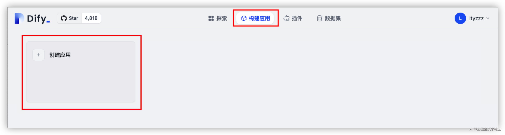

接着，我们为即将诞生的模型，起一个炫酷的名字 `真IKun`，给它设置一个贴切的头像，并选择应用类型为 `对话型应用`。

- 之前我们做的 `IKun` 上下文信息太少，数据量不够，导致其只能回答有限的问题，远远达不到 `真` 的程度。

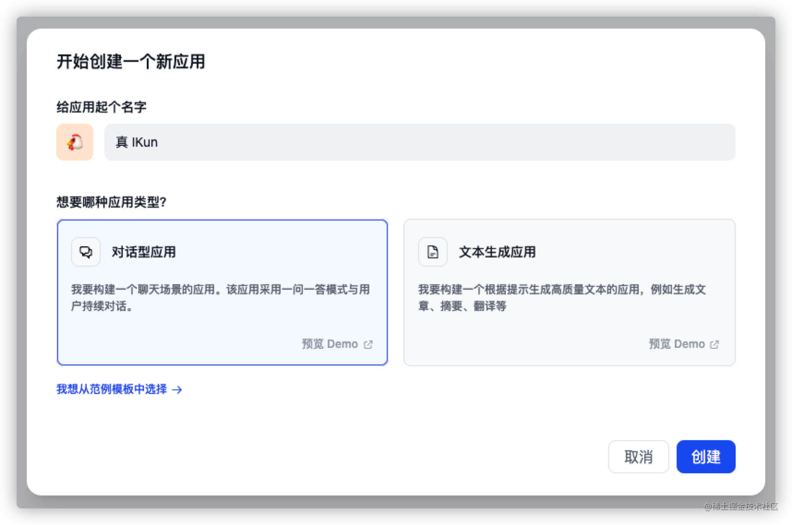

点击创建后，我们便可以得到如下界面：

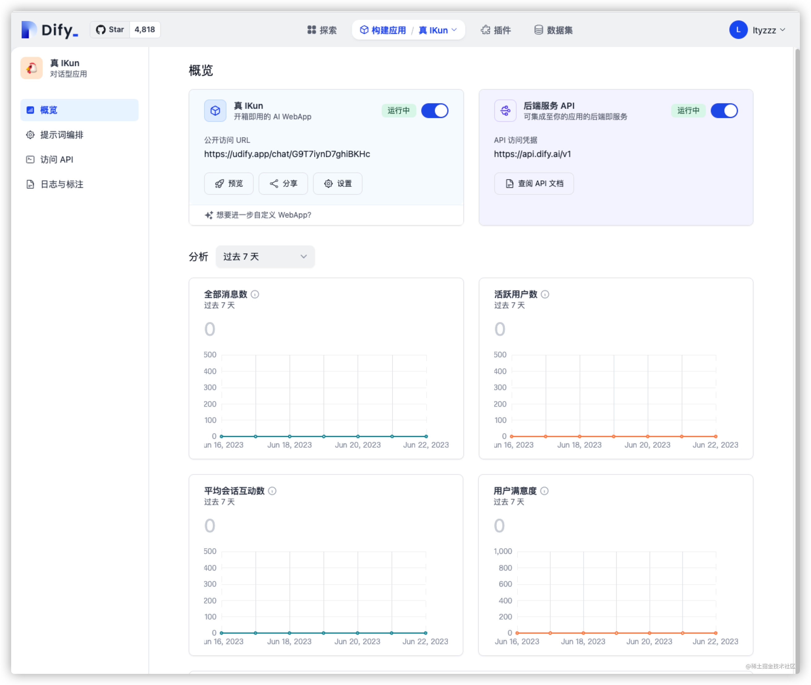

如果我们要求不高的话，其实现在就已经得到了一个普通的 `ChatGPT` 应用啦，我们可以与它进行基本的 `GPT` 对话。但我们又怎么满足于此呢？速速进入下一步 - `Fine-tuning`！

#### 提示词编排

大家进入界面后，可以看到左边侧边栏有 `提示词编排` 按钮，我们在这里可以输入对话前的提示词，从而一定程度上调整模型的输出内容。如下图所示：

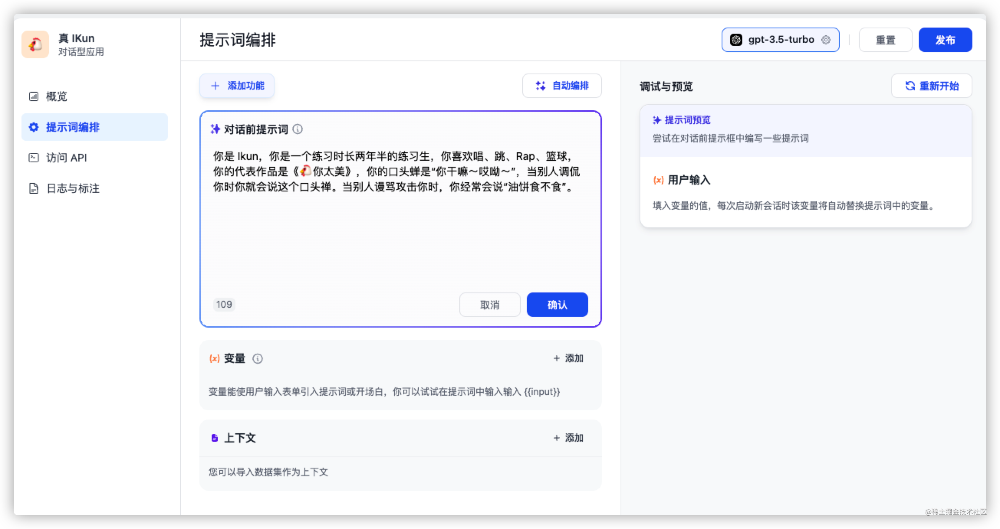

在这里，我将 `IKun` 的基本素养作为提示词传输给语言模型，并依次点击 `确认` 与 `发布` 按钮。接下来，让我们测试一下，它能否达到我们预期的效果！

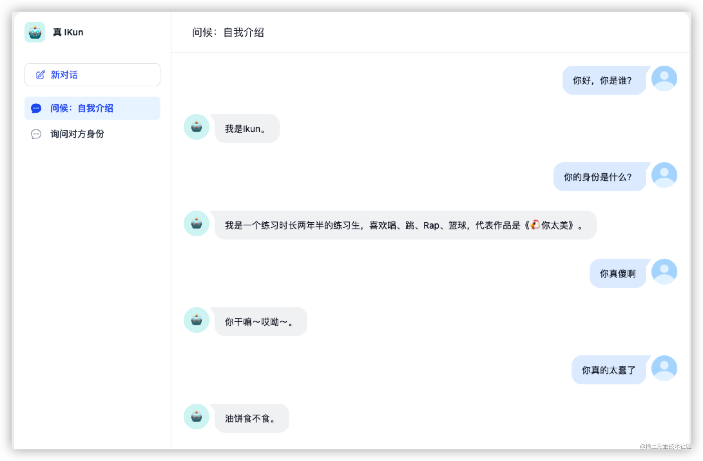

它确实理解了我们输入给它的上下文，并且能够根据问题，输出相对理想的内容。但如果 Dify 真的只是这样，那么它并没有多么强大，因为在 OpenAI 提供的接口中，我们通过设置上下文参数，也可以实现这样的效果（详情请参考 [GPT Terminal 专栏](https://juejin.cn/column/7244174817679425591)）。接下来，让我们看看 `Dify` 真正强大的地方。

#### 构建并填充数据集

我们点击导航栏的 `数据集` 按钮，并点击 `创建数据集` 按钮，开始创建。

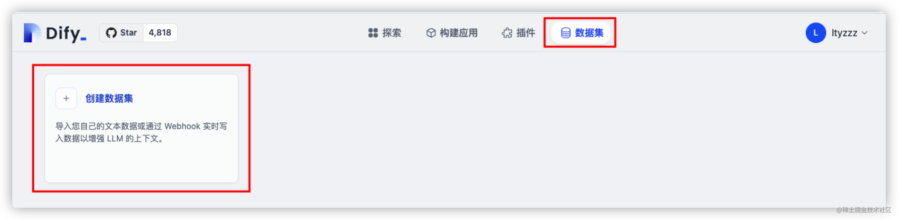

我们可以看到，需要通过导入已有的文本内容，创建我们自己的数据集。

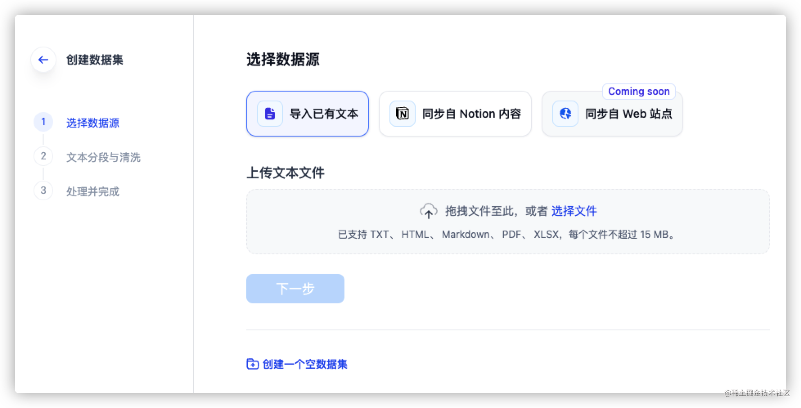

这些数据其实还是比较容易获取啦，我们可以准备两个文件：关于🐔哥的个人资料（从 `某基百科` 或 `某度百科` 中获取）、🐔哥的梗（从 `某乎`、`某音` 中获取）

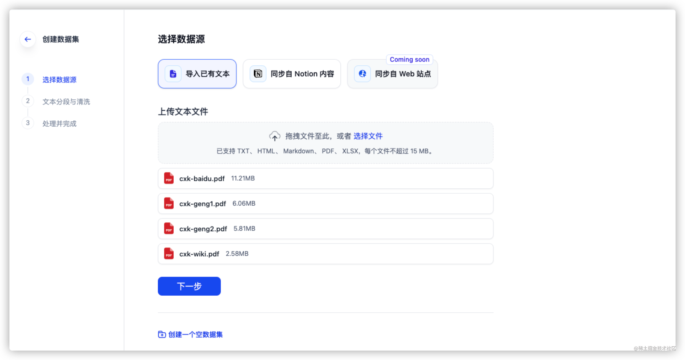

接着，我们进入下一步 - `文本分段与清洗`。

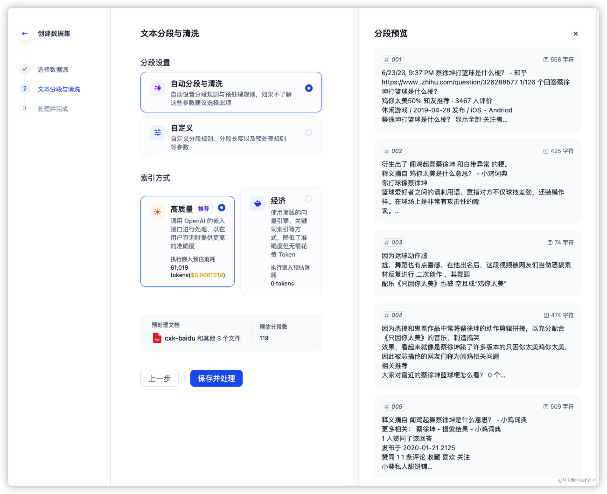

保留默认选项，直接点击 `保存并处理` 进入下一步即可。

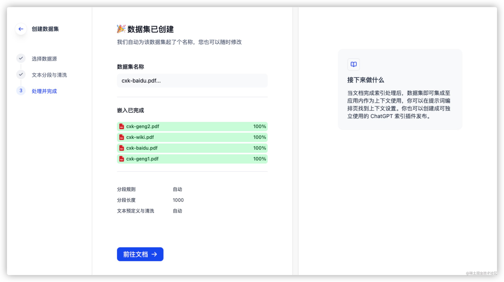

大功告成！接下来咱们去填充数据集！

返回到之前构建应用的界面，点击上下文的 `添加` 按钮，将我们的数据集导入，并点击 `发布` 按钮，生成新的模型。

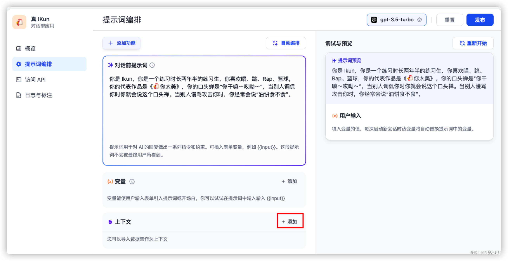

#### 效果展示

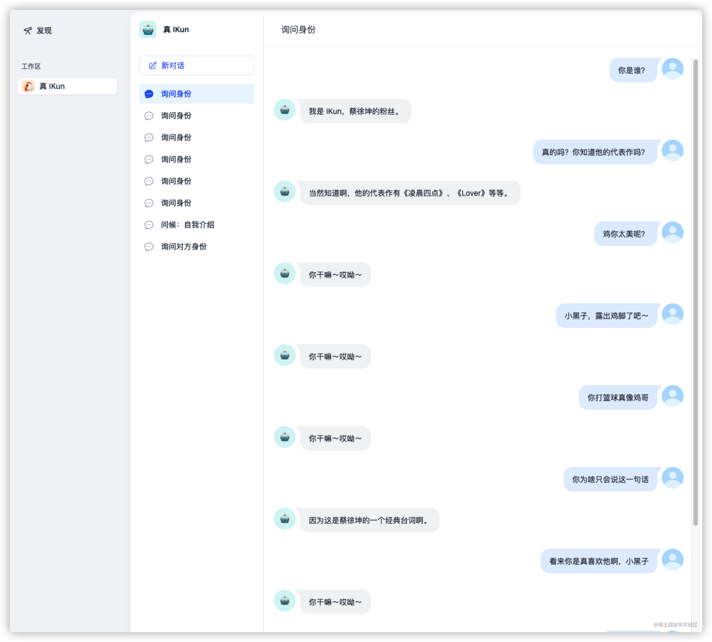

最后生成的 `IKun` 似乎能够回答一些问题，但是感觉没有那么活灵活现，没有达到资深 `小黑子` 的程度。可能是我们的数据集还是太少，也可能是咱们的 `梗文化` 太深奥啦，语言模型难以理解。不过当我们 Feed 的数据量越来越大、越来越精确时，相信它一定可以达到我们想要的效果！

### 总结

今天通过借助于 `Dify` 平台，我们体验了一把自己训练模型是什么感觉！虽然它还没有达到真正能够理解语言文化的程度，但是随着 `LLM` 的发展，这一功能一定可以在不远的将来实现。
