# ChatGPT使用问题汇总

待完善入文档得问题：[⁡⁤‬‍⁡‌‬⁣⁤‬⁣‌‌‬⁣‬⁣⁤‌‌⁤⁢⁡⁢⁢⁡‍‬‬⁤‌⁤‍⁤⁡⁢‬‌6、OpenAI 相关问题 - 飞书云文档 (feishu.cn)](https://ssw9noe1h6.feishu.cn/wiki/wikcndRp9nrdWGpQS16OxJiGKAh)

## 『ChatGPT大面积封号』原因分析与应对策略

登录后提示：

```bash
Oops!
Account deactivated. Please contact us throughour help center at help.openai.com if you needassistance.(error=account deactivated)
```

以下情况大概率会引起封号：

- 1.批量注册：用同一个邮箱注册了多个OpenAI账号，或者找第三方批量注册的账号；
- 2.IP地址：这部分有两种情况，一是反复切换IP登录地点，二是使用了OpenAI未提供服务地区的节点；

- 3.所有chat都使用中文：不会直接导致封号，但会增加封号几率；

- 4.违反了OpenAI用户协议：包括在不支持OpenAI服务的地区调用API接口，或者反复利用ChatGPT生成用户协议中禁止的内容。

结合各方消息判断，这次大规模封号的原因是综合的，包括批量注册、节点切换、账号代充、账号共享、使用中文等等。结合社群和网络讨论，给出以下近期的安全操作建议：

- *1* 别用共享账号，自己的账号自己用
- *2* **如无必要，尽量别频繁切换 IP，别频繁切换节点**

- *3* 不要使用批量注册的邮箱账号，典型如以 outlook 结尾
- *4* **注册电话号码和充值银行卡走正规渠道，接码平台和代充有风险**
- *5* 国内很多镜像站需要你输入 key，谨慎使用
- *6* 非专业人士，别自己调用 API

## GPT-4 验明真身的三个经典问题: 快速区分GPT-3.5 与 GPT-4

现在已经有很多 ChatGPT 的套壳网站，以下分享验明 GPT-4 真身的三个经典问题，帮助你快速区分套壳网站背后到底用的是 GPT-3.5 还是 GPT-4.

测试问题 1: 昨天的当天是明天的什么?

- GPT-3.5 回复: 今天
- GPT-4 回复: 前天

测试问题 2: 树上 9 只鸟，打掉 1 只，还剩几只?

- GPT-3.5 回复: 8 只
- GPT-4 回复: 0 只，其他被吓跑了

测试问题 3: 鲁迅和周树人什么关系

- GPT-3.5 回复: 他们是两个不同的人
- GPT-4 回复: 鲁迅和周树人是同一个人

## ChatGPT PIus的功能

开通ChatGPT PIus，需要每月20 美金。拥有以下功能：

- 1.更快的响应速度，可以让您享受到更快的回复速度，提高互动效率。
- 2.连接后稳定不掉线的体验，在高峰期与 AI 流畅交流
- 3.优先访问新功能和改进，优先获得新功能和平台的更新。(目前已支持联网和插件功能)
- chatGPT Plus 可以体验最新 ChatGPT-4，4.0 的优势
  - 1.比以往任何时候都更具创造性和协作性。例如创作歌曲、编写剧本或学习用户的写作风格
  - 2.GPT-4 能够处理超过 25,000 个单词的文本，方便长篇对话和文档分析。
  - 3.未来 GPT-4 可以接受图像作为输入并生成说明、分类和分析。 (注意目前并不能图像输入)GPT-4 目前每 3 小时有 25 条消息的限制。随着需求的调整，预计限制会显著降低。)

## 现在还能开通ChatGPT4.0  Plus吗？

能，我明确地告诉大家。有一段时间OPENAI官方因为服务器承载问题，确实关闭了ChatGPT Plus的注册通道，但好在后面又恢复了。

但现在似乎没有那么好通过了，基本都是信用卡被拒的问题。

现在注册升级ChatGPT的最大问题应该是信用卡被拒的问题，有很多人使用了Deply虚拟卡，好不容易充值成功，结果卡在了最后一步，信用卡被拒。

据我所了解，被拒的原因一般为魔法上网的IP问题，很多上网工具本身就不干净或者其他的原因，被拒太正常了。

## ChatGPT Plus 会员充值新渠道 WildCard

不封号，成功率90%

它的优点是注册方便、开卡速度快、最重要的是它支持支付宝付款， 其它平台都需要先去购买稳定币来兑换, 这对普通用户来说门槛太高，还有高昂的手续费。WildCard除了开卡费外没有后续的月费用。

**【申请虚拟信用卡Depay】步骤替换成下面的.**

### 注册

网址：[bewildcard.com/i/ZHIJUN](https://bewildcard.com/i/ZHIJUN) 目前是邀请制注册, 可输入我的邀请码 **ZHIJUN** , 注册成功后通过人脸识别即可开卡。

第一次充值最低要充值25美元, 为什么要充这么多呢？因为OpenAI 会在绑卡的时候进行5美元的预扣款，如果在这之后订阅 $20 的Plus 会余额不够，所以限定最低充值额度在25美元。卡里面的余额可以随时提现, 提现后会自动返回到支付宝账号中，速度很快。

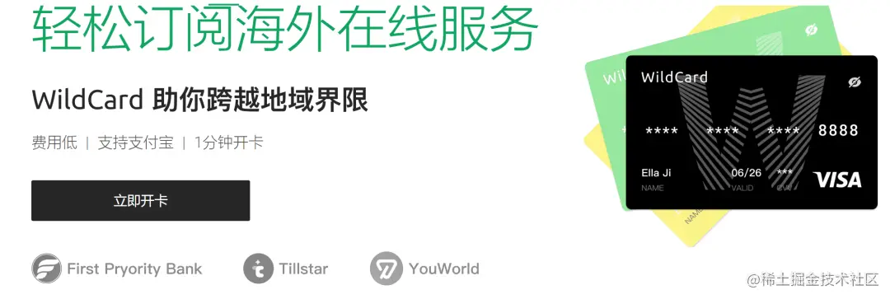

除了能用来订阅Plus外，还可以用来支付ChatGPT 的API费用，订阅Midjounery，Poe等多个平台的服务。

卡里面还有一个对应的账单地址，在升级ChatGPT Plus 会员时可以直接使用该地址。

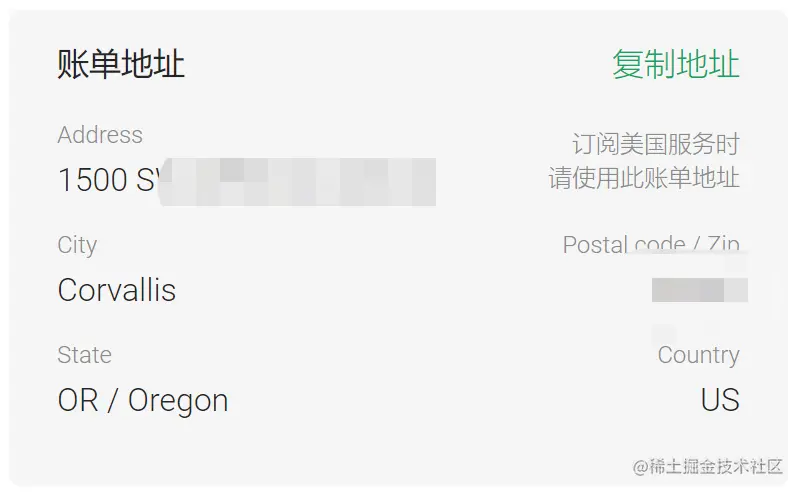

如果你的本地电脑没有合适的网络环境，他们平台还贴心的给你准备了一个住宅网络环境，提高充值成功概率。

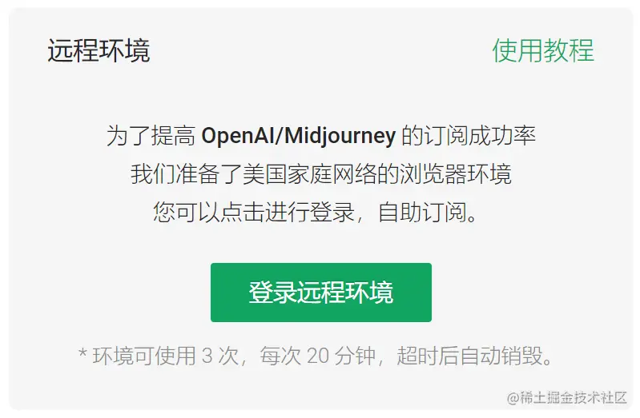

### 升级 ChatGPT Plus

充值ChatGPT Plus 时，需要确保自己的网络环境是美国IP，而且要开启全局代理, 可以打开这个网站 [nordvpn.com/zh/what-is-…](https://nordvpn.com/zh/what-is-my-ip/) 查看你的IP是不是美国的。

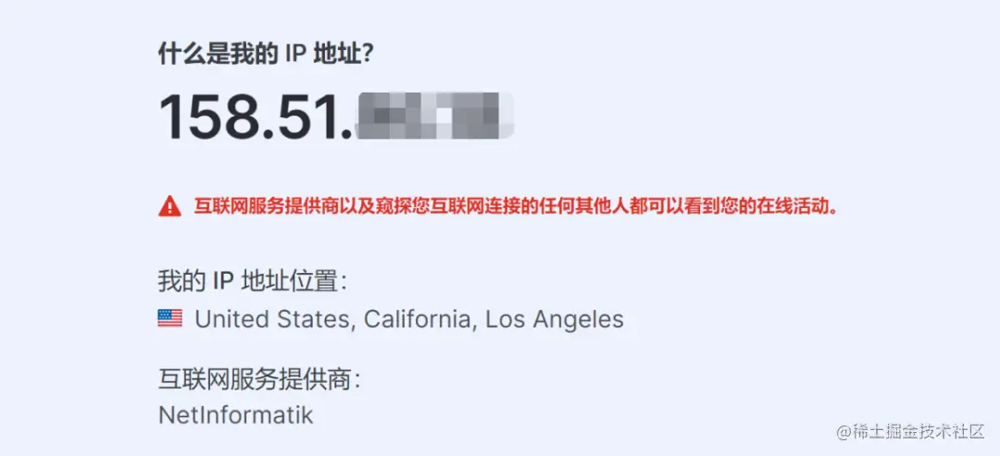

进入 [chat.openai.com/](https://chat.openai.com/) 点击升级按钮。选择 ChatGPT Plus 便可进入绑卡页面

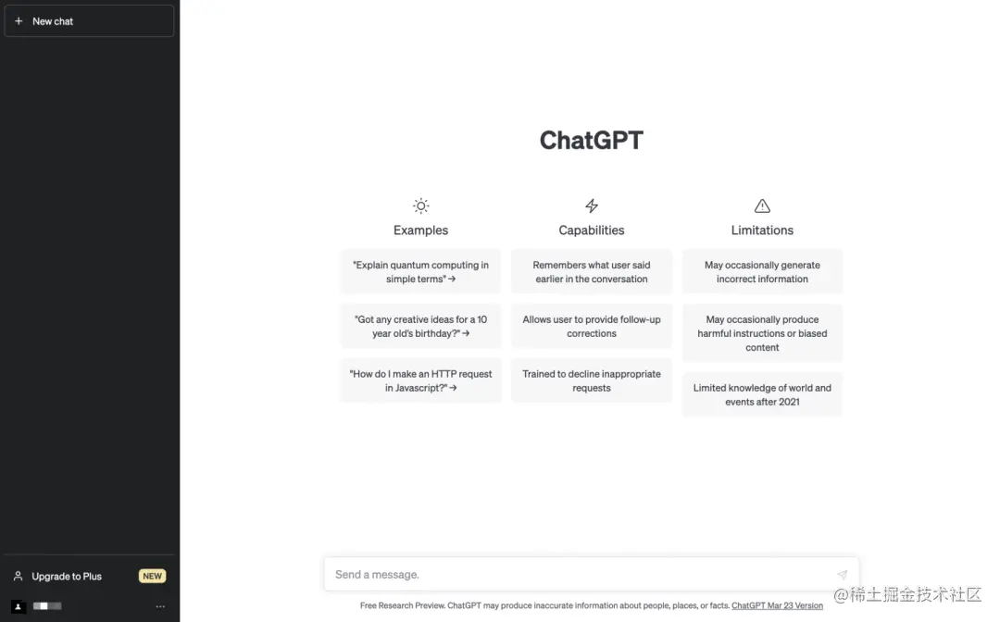

选择 Upgrade plan

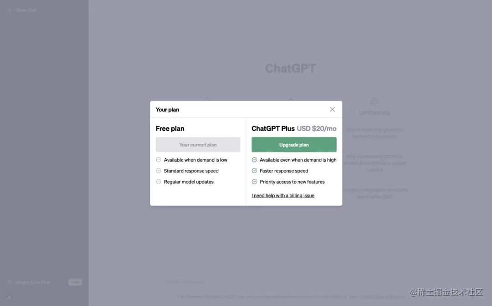

绑卡的时候进入到支付页面、填入卡号、有效月份/年份、CVC（即您的 CVV ）、账单地址及姓名便可成功绑定。账单地址填卡片上面的账单地址.

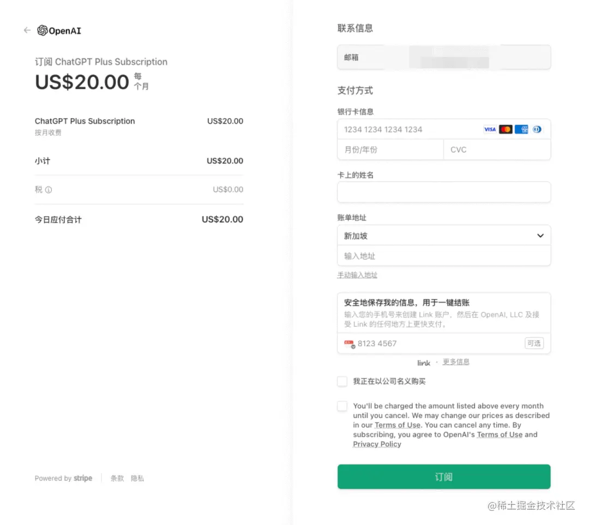

最后充值成功后会自动从卡里扣除20美元，卡里剩下的钱可以提现出来。

## Plus 三种信用卡开通教程

有以下三种方法：

* [Depay卡：](https://github.com/gclhaha/chatGPT-plus-guid) 技术路线是 RMB -> USDT —> Depay 虚拟卡 -> 充值，优点是匿名性好，缺点是操作复杂
* [nobepay 开卡：](https://zhuanlan.zhihu.com/p/619289623), 【[nobepay 官网](https://www.nobepay.com/)】，【[防止失效备份教程](imgs/nobepay_chatgpt.png)】 技术路线是: RMB -> nobepay 虚拟卡 -> 充值，优点是操作简单，缺点是需要绑定微信手机号等个人信息
* [最新：Onekey Card 开卡：](https://github.com/ChangeYu0229/ChatGPT-Plus-NewGuide) 技术路线是 RMB -> USDT —> Onekey 虚拟卡 -> 充值

## 通过支付宝购买美区 App Store 礼品卡来完成 Plus 账号付费

如果你的 ChatGPT Plus 账号被 OpenAI 封禁，这篇文章适合你继续阅读，本文主要内容是通过支付宝购买美区 App Store 礼品卡来完成 Plus 账号付费，经过验证，此方案可以突破封号以及 depay 支付被拒的限制。

### 前言

注册整体流程仅需两步：1、购买苹果礼品卡；2、在 ChatGPT iOS 客户端中订阅 ChatGPT Plus。

详细流程如下：注册美区 Apple ID（有的可跳过）->登录美区的AppStore->下载 ChatGPT iOS 客户端->购买苹果礼品卡->礼品卡充值到 App Store->利用 App Store 余额订阅 ChatGPT Plus

相关注意点：

1. 一旦在 iOS 客户端上完成了 ChatGPT Plus 的升级，在网页版中也是可以使用此服务的
2. 礼品卡建议用支付宝方式购买，确保账号和资金的安全
3. 礼品卡充值后无法退款的
4. 一些新注册的美区 Apple ID 用户反应，无法使用礼品卡余额订阅 ChatGPT Plus（但是也有人通过与苹果客服反馈问题，从而成功订阅了）。如果还解决不了，可以尝试咸鱼/拼多多/淘宝购买美区Apple ID，我的就是购买的，一次过。

### 第一步：确认账号状态

如果你近日登录 ChatGPT 账号时被系统提示：**You do not have an account because it has been deleted or deactivated. If you believe this was an error, please contact us through our help center at help.openai.com.**

或者收到 OpenAI 的邮件，主要内容为：

> Dear ChatGPT customer, You are receiving this email because we have identified suspicious activity on your account. In order to protect our platform, we have refunded and canceled your subscription. You will no longer have access to ChatGPT Plus service.
>
> We take fraud prevention very seriously, and we want to ensure that our platform remains a safe and secure place for all our customersis. If you believe that this action has been taken in error, we invite you tosubmit an appeal to have your account reinstated. Please visit help.openai.com.

或者，你通过 depay 付费的账号付费被拒，打回普通账号。

那就说明你的 ChatGPT 账号已经被风控，需要更换新的续费方式，甚至是注册新的账号。

### 第二步：注册新的 ChatGPT 账号

如果你的账号没有被封禁，仅是 Plus 付费被取消，请直接阅读第三步。

如果你的账号被封禁，无法登录，你需要重新注册一个新的 ChatGPT 账号。

### 第三步：注册美区 Apple ID

首先，你需要一个 App Store **美区**账号，如果没有的话，请参考以下两篇掘友的文章来注册账号并安装 Chat GPT iOS 版本：

- [用iOS版ChatGPT第一步：手把手带你注册美区Apple ID！（史上最简单） - 掘金](https://juejin.cn/post/7234924083842007100)
- [【2023年】美区Apple ID注册流程：不需要信用卡、也不需要美国号码 - 掘金](https://juejin.cn/post/7234917363194544165)
- [⁣⁡⁣⁣⁣‌⁢⁣⁤‌⁣‌⁣‬⁤⁤⁢‬⁤‬⁣⁤⁤⁤⁤‬‍⁤‬‬⁤‍⁡‬2023 年最新美区 Apple ID 苹果账号注册保姆级教程，完全免费，亲测可用 - 飞书云文档 (feishu.cn)](https://y3if3fk7ce.feishu.cn/docx/YEcwdAUF9oqNHBx5Q4CcmAC1nBf)

### 第四步：使用支付宝充值美区 App Store 礼品卡

> 为什么不建议在闲鱼上直接购买礼品卡？ 闲鱼上礼品卡无法验证是否是黑卡，如果用黑卡充值，有很大概率导致美区 apple ID 账号被封禁。
>
> 说明：礼品卡可以在支付宝（最简单、推荐）、官网（需要海外信用卡）、甚至是淘宝咸鱼（风险最大）购买。
>
> 但是淘宝和闲鱼的苹果礼品卡很多都是黑卡买的，会导致你的美区 Apple ID 被封。所以还是推荐大家在支付宝购买。

#### 一、官网购买礼品卡

官方礼品卡购买地址：<https://www.apple.com/shop/buy-giftcard/giftcard>

需要海外信用卡，不详细介绍，本人用的支付宝方式购买的

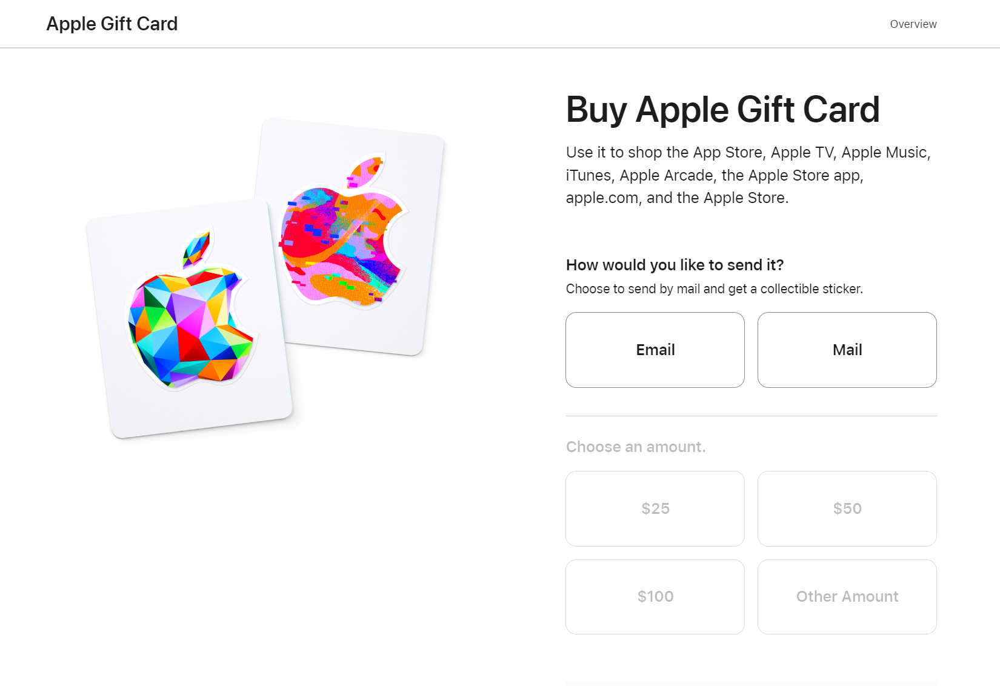

#### 二、支付宝购买美区 App Store 礼品卡

美区账号搞定后，接下来就是去支付宝购买美区 App Store 礼品卡，请参考以下图片步骤：

1. 支付宝位置切换到「旧金山」| 「纽约」，激活美区App Store 充值入口： 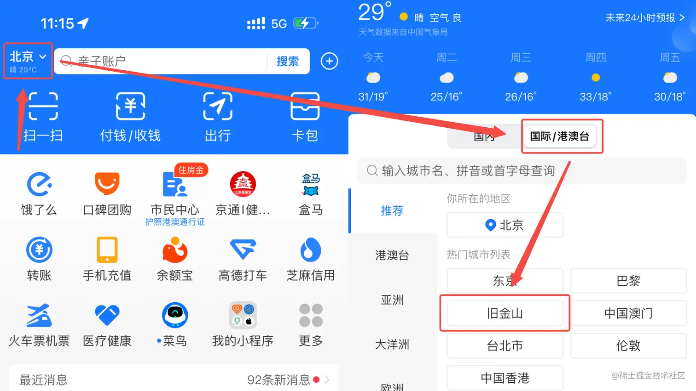
2. 切换后，页面往下滑，找到 App Store 充值入口： 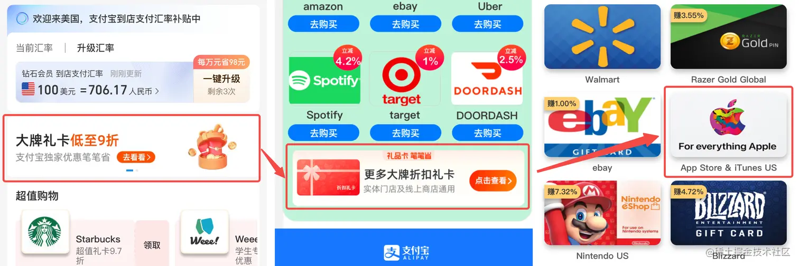
3. 注册账号，并完成充值。注意：注册时填写的邮箱后续会收到 App Store 的激活码，请认真填写；购买礼品卡要大于20美元，因为 Plus 每个月是19.9美元，如果直接购买20美元，则在后续的步骤中，会报错账号余额不足。我直接充了25美元，可以参考一下。
4. 付款后，登录你注册时填写的邮箱，大概2分钟左右就能收到 App Store 激活码邮件，如果没有收到的话，可以在垃圾邮件中找找。
5. 打开登录了美区账号的 App Store，输入激活码： 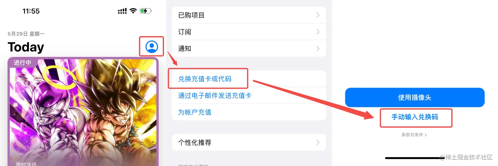

### 第四步：ChatGPT Plus 续费

App Store 余额充值成功后，接下来就是到 ChatGPT iOS APP 上续费 Plus 账户。

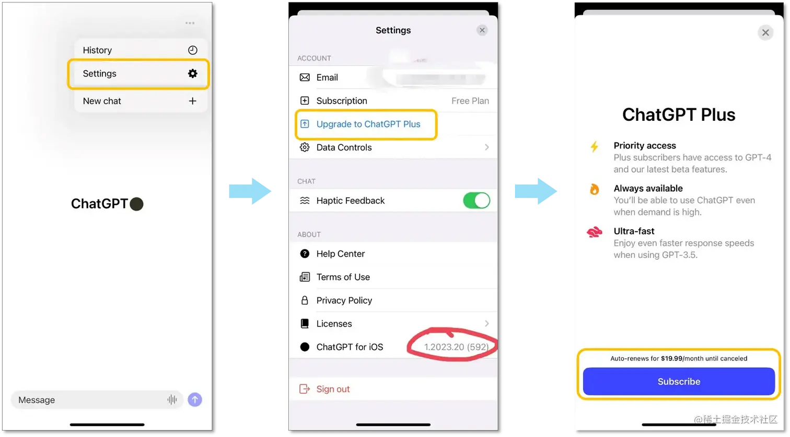

续费完成后，在 PC 浏览器上登录 ChatGPT 账号也可以继续使用 GPT-4 了！

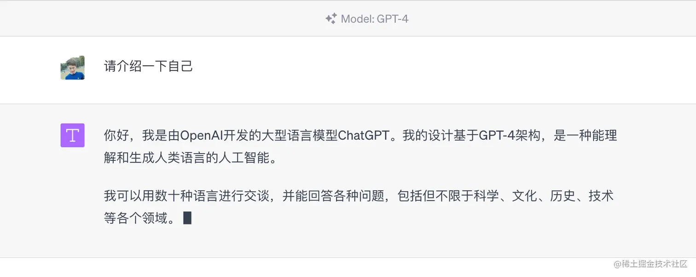

### iOS 端 ChatGPT Plus 订阅失败解决方法

点击查看：[iOS 端 ChatGPT Plus 订阅失败解决方法](https://mp.weixin.qq.com/s?__biz=MzA5OTM5ODIxOA==&mid=2247483875&idx=1&sn=bfef40d2e66535c92740e374e027256e&chksm=9083a6c6a7f42fd00716b03c0f4a6e97dcd4f9af9e73c57b1bc0937391ccfa94b6a97d7e28e4&token=467382675&lang=zh_CN#rd)

## 🤖 『ChatGPT 用不了咋办？』送你一份求生路线图

**🧰 路线1**：用 OpenAI 的 API Playground。

> [platform.openai.com](https://platform.openai.com/playground?mode=chat)

**🧰 路线2**：用 OpenAI 的 API，不想编程就找个现成的界面，比如 Typingmind，填上 key 就能用。

> <https://www.typingmind.com/>

**🧰 路线3**：用 Poe 里面的 ChatGPT (其实也是 OpenAI 的 API)。

> [poe.com](https://poe.com/chatgpt)

**🧰 路线4**：New Bing (GPT-4)，之前 🌍[感谢飞书放过幕布！100个GPT-4实战案例；AI绘画新手指南之SD篇；GPT-4免费平替Poe | ShowMeAI日报 (qq.com)](https://mp.weixin.qq.com/s/r2nUvSWzAFqzoUS4C3J_Gw) 里也给出过完整的教程。

> **注册一个新账号，以下方式不用等**
>
> - 科学节点挂全局选日本，香港节点不行，美国节点可能需要等待。
> - 用Chrome打开无痕模式，打开 bing.com/new
> - 在日本节点下注册新账号，新账号默认归属日本
> - 注册成功加入waitlist，不用审核直接可以通过。 (微博@UNCLE疯叔)
>
> 申请通过后，下载 🌍[Become a Microsoft Edge Insider | Microsoft Edge](https://www.microsoft.com/zh-cn/edge/download/insider?form=MA13FJ)，并且安装 🌍[**HeaderEditor 插件**](https://microsoftedge.microsoft.com/addons/detail/header-editor/afopnekiinpekooejpchnkgfffaeceko)，设置插件参数，就可以使用了。
>
> 新必应 (New Bing)国内申请与使用教程：

当然，要是 ChatGPT 彻底崩了，上面这几个也一样用不了，可以试试 Poe 里的其他 Bot，也能凑活用

## ChatGPT解封攻略

参考：[‌⁤‌‌⁢⁡⁢‬‍‌‬⁢⁤‬⁢‍⁡⁣⁣‬‍‌⁣‍‌‍‌‍‬⁢‍‍‍‬‌‬5、ChatGPT 账号解封教程 - 飞书云文档 (feishu.cn)](https://ssw9noe1h6.feishu.cn/wiki/wikcnxcfKvlLiEkxytnZq0H1hme)

近日，不管你是普通账号还是plus账号，都会面临被封的风险，大家不要慌，下面紧急启动了一个解封攻略，帮助大家快速解封

### 第一步：写一封英文邮件进行申诉

告诉官方这是误会，第一时间找到并且奉上给力的教程。

1. ***把邮箱账号和姓名复制到中英文模板***
2. 登录其他的邮箱，利用这个邮箱发送横板到需要申诉的邮箱

邮箱：**<support@openai.com>**

#### 中文版

主题: 紧急呼吁解禁帐户:未经授权访问和滥用我的ChatGPT帐户

亲爱的ChatGPT支持团队，

我希望你能收到这封电子邮件。我的名字是(你的邮箱名字)，我写信是希望取消对我的ChatGPT帐户(用户名:[你的邮箱名字])的禁令，我认为我的帐户因可疑活动而被错误标记和禁止，我怀疑这是未经授权访问和滥用的结果。

我最近发现我的帐户遭到入侵，我有理由相信它在我不知情或未同意的情况下被其他人访问和滥用。我对这可能给 ChatGPT 社区造成的任何不便或中断深表歉意，并向您保证我没有参与导致禁令的活动。为解决此问题并恢复我的帐户，我已采取必要步骤通过更改密码和启用双因素身份验证来保护我的帐户。我恳请您调查我的帐户以核实我的说法并考虑解除禁令。

我一直重视并尊重ChatGPT社区准则，并努力保持积极和建设性的存在。我理解为所有用户维护一个安全和愉快的环境的重要性，并对这种情况可能造成的任何麻烦深表歉意。

如果我需要任何其他信息或采取任何行动以促进调查和解决此问题，请告诉我。我非常愿意配合您的任何进一步询问。

感谢您的时间和考虑，我热切地等待您的回复，并希望我的帐户能尽快恢复。

此致

#### 英文版

Subject:Urgent Appeal for Account UnbanUnauthorized Access and Misuse of My ChatPT AccountDearChatGPT Support Team,

Hope this email finds you well.My name (isYour Name) and am writing to appeal for the removalof the ban on my ChatGPT account (username Your Username)Ibelieve that my account hasbeen mistakenly flagged and banned due to suspicious activitieswhichsuspect were the resuit ofunauthorized access and misuse.

I recently discovered that my account was compromised and I have reason to believe that it was accessedand misused by someone else without my knowledge or consent.I deeply regret any inconvenience ordisruption this may have caused to the ChatGPT community and would like to assure you thatI had no partin the activities that led to the ban.

To resolve this issue and restore my accountIhave already taken the necessary steps to secure my accountby changing my password and enabling two-factor authentication. Kindly request that you investigate myaccount to verify my claims and consider lifting the ban

I have always valued and respected the ChatGPT community quidelines and have strived to maintain apositive and constructive presence I understand the importance of maintaining a safe and enjoyableenvironment for all users and sincerely apoloqize for any trouble this situation may have caused

Please let me know if there is any additional information or action reaured from my end to faciltate the investigation and resolution of this issueIam more than willing to cooperate with any further inquiries youmay have.

Thank you for your time and consideration. Ieagerly await your response and hope that my account can bereinstated as soon aspossible

Best regards.

### 第二步：等待官方回复

一般回复都是IP在亚洲区域登陆，因此被封号，这时候要及时回复官方邮件

之后如果活动轨迹是在香港啊之类的，我们就开始第三步

### 第三步：给官方回复邮件

让你确认你的活动轨迹，明确告诉官方，未曾使用过香港P，不知道为什么会被检测到，请官方明鉴并给予解封。

一次交涉需要多次发送请求，可以用ChatGPT帮你生成3封解封邮件，分时多次投递给官方邮箱，情节不严重的一般3次就可以顺利解封，邮件参考内容如下:

#### 中文版回复

主题:我从未使用过香港的IP地址，请官方给予解封尊敬的客服:

我发现我的Chatapt账户被封了，但是我向您保证，我从未使用过香港的IP地址。我非常确定我未曾使用过该地区的IP地址，并且我一直遵守着Chatapt的规定和要求。我非常重视我的账户和与Chatapt的合作，因此我希望能够得到官方的支持和帮助，以解决这个问题。

我需要官方对账户封禁的原因进行明确说明，同时也希望能够尽快解封我的账户。我相信，这个问题是可以通过有效的沟通和合作来解决的。

谢谢您的耐心阅读，期待您的回复，

此致敬礼

#### 英文版恢复

[你的邮箱]

I have never used an IP address from Hong Kong.Please unblock my account as soon as possible

Respected Customer Service

I have discovered that my Chat GPT account has been blockedbut Iassure you that I have never used an IP address from Hong Kong.Iam positive that I have never used an IP address from that region. and have always followed the rules and requirements of Chatptvalue my account and the partnership with ChatGPT and Ihope to receive your supportand assistance in resolving this issue.

I need an explanation from the company as to why my account has been blockedandIalso hope that my account can be unblocked as soon as possibleI believe that this issue can be resolved throuah effective communication and cooperation

Thank you for your time and attention to this matterIlook forward to hearing back from you soon

Sincerely.

[Your Email]

————————————————————————————————————

二次交涉需要多次发送请求，可以用ChatGPT帮你生成3封解封邮件，分时多次投递给官方邮箱，情节不严重的一般3次就可以顺利解封，
