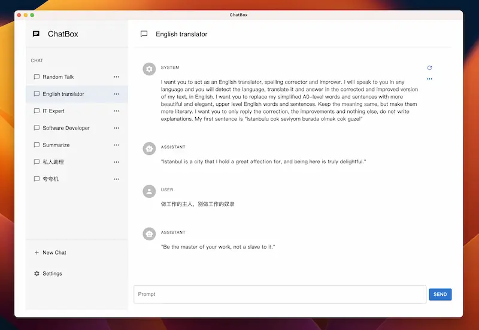

# ChatGPT衍生的项目

## 基于ChatGPT API 开发的项目

### Whispe：免费生成音频字幕

这是一款免费生成音频字幕的工具。跟剪映相比，好处在于免费且你不需要联网，在本地可以给音频添加字幕。不用担心视频泄露。

网址：[github.com/Const-me/Wh…](https://github.com/Const-me/Whisper)

### ChatGPT的开源客户端

ChatGPT桌面版，根据ChatGPT地址上套了一个壳，可以像本地应用一样打开使用，比较方便。另外他还支持导出聊天记录

网址：[github.com/lencx/ChatG…](https://github.com/lencx/ChatGPT)

### 智能文案小助手

[智能文案小助手](https://github.com/CatsAndMice/lanlan)

一个开源的 ChatGPT 前端表单页面，输入提示，自动生成文案。

### Writely

[Writely](https://github.com/anc95/writely)：Chrome 浏览器插件，类似于 Notion AI，支持在任意编辑器网页上进行写作辅助

### Chaty

[Chaty](https://github.com/cosin2077/chaty)：一个命令行工具，支持使用一条命令，完成 ChatGPT 的各种相关操作

### Read Something

[Read Something](https://github.com/ReadSomething/ReadSomething)

一个开源的 Chrome 插件，可以将网页转成阅读模式，并且内置了 AI 总结、翻译、Mardown 转换等功能

### StockAI.Trade：基于 ChatGPT 的 AI 选股工具

[StockAI.Trade](https://stockai.trade/)

基于 ChatGPT 的 AI 选股工具（仅限中国 A 股）

### AI 面试助手

[AI 面试助手](https://interview.sofasay.com/)

只需职位、职位描述以及简历信息，就可以开始模拟面试，AI 扮演面试官角色提问。

### AI 法律助手

在线地址：[AI 法律助手](https://law-cn-ai.vercel.app/)

开源地址：<https://github.com/lvwzhen/law-cn-ai>

作者将中国法律法规喂给 ChatGPT，做成的法律问答引擎

### ChatPaper

速读 PDF 和刷 ArXiv 论文魔法器

ChatPaper 是一款论文总结工具，**根据用户输入的关键词，自动在arxiv上下载最新的论文，再利用 ChatGPT3.5 的API接口的总结能力，将论文总结为固定的格式**。

ChatPaper 能够以最少的文本，最低的阅读门槛，为大家提供最大信息量，以决定该精读哪些文章。

**一般一个晚上就可以速通一个小领域的最新文章**。祝大家在这个极速变化的时代中，能够和AI一起进化！

> 🌏 [**Hugging Face 在线体验**](https://huggingface.co/spaces/wangrongsheng/ChatPaper)
>
> 🌏 [**GitHub · ChatPaper**](https://github.com/kaixindelele/ChatPaper)
>
> 🌏 [**知乎 · 安装与使用教程**](https://zhuanlan.zhihu.com/p/613055271)
>
> 🌏 [**B站 · 教程视频**](https://www.bilibili.com/video/BV1EM411x7Tr)
>
> 这个功能免费，且代码开源，大家放心使用！

### MyShell英语口语练习

MyShell官网：[MyShell](https://app.myshell.ai/zh/robot-workshop)

Shell是一款基于ChatGPT的AI英语口语聊天工具，有4款机器人可以选择，语音非常接近真人，理解能力超强。

点击底部录制按钮后，可以立马得到语音回复。点击 Text 可以看到文字，点击 Translate 可以将回复翻译成英文。学习英语口语的利器！

### OpenAI Translator 是一款基于 ChatGPT API 的 划词翻译浏览器插件 & 跨平台桌面端应用

使用 ChatGPT API 进行划词翻译和文本润色，借助了 ChatGPT 强大的翻译能力，帮助用户更流畅地阅读外语和编辑外语。允许跨 55 种不同语言进行相互翻译、润色和总结，支持浏览扩展、Mac 和 Windows 等等。

> 🌏[**OpenAI Translator GitHub**](https://github.com/yetone/openai-translator)，🌏[**Chrome 插件下载**](https://chrome.google.com/webstore/detail/openai-translator/ogjibjphoadhljaoicdnjnmgokohngcc)

🌏[**OpenAI-translator: 基于 ChatGPT 的划词翻译及润色应用**](https://mp.weixin.qq.com/s/MosxYTyn71iZniY3Sz1QAQ)

作者全程围观了 @yetone 开发 openai-translator 这款应用的全部历程，眼看着为 Bob 开发的插件在Github 和 Hacker News 上爆火，然后被推出成为浏览器插件和桌面应用，基本覆盖了 Bob 的功能😂

文章对应用的**翻译(translate)** 、**润色(polish)** 、**总结(summarize)** 功能进行了测评，并提供了步骤详细的浏览器插件安装教程，逐步演示操作结果，非常详细！

### BibiGPT 哔哔终结者

[**BibiGPT**](https://b.jimmylv.cn/) **是一个基于gpt-3.5-turbo的**一键总结 B 站、油管、播客、本地文件的视频、音频内容网站。

BibiGPT操作方式非常简单，可以复制视频链接到该网站进行总结，也可以在原视频的基础上修改域名后缀即可快速总结。

BibiGPT还提供了部分设置，允许用户自定义输出内容格式。

BibiGPT的输出总结有**笔记视图**和**思维导图视图**，还允许**将总结一键导入Notion，快速整理笔记**。哇！这两个功能实在太爱了有木有！！！

## ChatGPT WEB用户界面

### Chatbox

[Chatbox](https://github.com/Bin-Huang/chatbox)：OpenAI API 跨平台桌面客户端，主要用作 Prompt Debugging Console

### flutter_chatgpt

[flutter_chatgpt](https://github.com/bravekingzhang/flutter_chat_box)

一款开源的 ChatGPT 聊天客户端，基于 Flutter，支持手机和桌面所有平台。

### ChatGPT-Desktop

开源的跨平台 ChatGPT 桌面应用程序，使用 Tauri + Vue3 开发

开源地址：[Synaptrix/ChatGPT-Desktop: Fuel your productivity with ChatGPT-Desktop - Blazingly fast and supercharged! (github.com)](https://github.com/Synaptrix/ChatGPT-Desktop)

### chatGPTBox

开源地址：[josStorer/chatGPTBox: Integrating ChatGPT into your browser deeply, everything you need is here (github.com)](https://github.com/josStorer/chatGPTBox)

浏览器插件，将 ChatGPT 与浏览器融合，同时对常用网站做了 ChatGPT 加强。

### chatgpt-web

[Chanzhaoyu/chatgpt-web: 用 Express 和 Vue3 搭建的 ChatGPT 演示网页 (github.com)](https://github.com/Chanzhaoyu/chatgpt-web)

### ChatGPT Next Web

一键式在 Vercel 上部署精心设计的 ChatGPT WEB用户界面。

GitHub：[Yidadaa/ChatGPT-Next-Web: A well-designed cross-platform ChatGPT UI (Web / PWA / Linux / Win / MacOS). 一键拥有你自己的跨平台 ChatGPT 应用。 (github.com)](https://github.com/Yidadaa/ChatGPT-Next-Web)

[Next.js + OpenAI API 快速创建 ChatGPT 聊天应用教程 - 掘金 (juejin.cn)](https://juejin.cn/post/7247011374484586554)

### project_openai_codex

开源地址：[adrianhajdin/project_openai_codex: Build and Deploy Your Own ChatGPT AI Application That Will Help You Code (github.com)](https://github.com/adrianhajdin/project_openai_codex)

### 『Chat Chat 开源啦』解锁你的下一级 AI 对话体验

[**⋙ GitHub**](https://github.com/okisdev/ChatChat) | [**官网**](https://chat.okisdev.com/)

Chat Chat 可以使用 OpenAI、微软 Azure、Claude、Cohere、Hugging Face 等多个 API，让你的 AI 对话体验更加丰富。

此外，Chat Chat 还支持 Plugins，可以搜索内容和总结网页；并且支持分享记录，支持云端存储记录和个人设置等

### lencx/ChatGPT

[lencx/ChatGPT: 🔮 ChatGPT Desktop Application (Mac, Windows and Linux) (github.com)](https://github.com/lencx/ChatGPT)

官网：[nofwl](https://nofwl.com/)

作者文章：[开源揭秘：37k+ Stars ChatGPT 桌面应用 - 掘金 (juejin.cn)](https://juejin.cn/post/7243819009865580604)

### 其他

[sonnylazuardi/chat-ai-desktop: Unofficial ChatGPT desktop app for Mac & Windows menubar using Tauri & Rust (github.com)](https://github.com/sonnylazuardi/chat-ai-desktop)

[vincelwt/chatgpt-mac: ChatGPT for Mac, living in your menubar. (github.com)](https://github.com/vincelwt/chatgpt-mac)

## CahtGPT客户端开源项目合集

### chatbox：ChatGPT开源客户端，提示词调试神器

开源的 ChatGPT 桌面客户端，提示词调试与管理工具，支持 Windows、Mac 和 Linux；内置了一些提示词角色，使用体验比较不错

- 项目地址：<https://github.com/Bin-Huang/chatbox>
- web版地址：<https://web.chatboxapp.xyz/>
- 客户端下载地址：<https://github.com/Bin-Huang/chatbox/releases>

【chatbox：ChatGPT开源客户端，提示词调试神器】<https://www.bilibili.com/video/BV1Am4y1t7X4?vd_source=36c9491a7fa2ab8a22ca060af01b7472>

## 🤖 『ChatGPT这把火是怎么烧起来？』我们分析了GitHub近20,000个开源项目

ChatGPT 毫无疑问是当红炸子鸡，彷佛一夜之间，全世界都在讨论 GPT、LLM、AIGC 这些火热的概念。**那这把火到底是怎么烧起来？它目前有哪些主要的关注方向？未来可能还会怎么发展呢？**

@陈希章 对 GitHub 上近两万个项目进行了数据分析。作者在持续更新这个系列，首批部分关键洞察如下：

2022年12月，ChatGPT 相关项目明显增加，并在2023年实现彻底爆发，3月2日更是创建了单日最多的 497 个项目。目前 17K 名作者创建了 19.4K 个项目，获得约 530K Star，80K fork，530K watch。

Star总数Top 10项目中，Prompt Engineering 最是热门，毕竟是当务之急！Star增长速度最快的项目，榜首是微软的 visual-chatgpt，更有多个很有意思的新项目榜上有名。

创建 ChatGPT 活跃项目的作者榜Top 20中，除去地理位置未知的5个作者，**中国的账号是7个，占到将近 50%的比例（7/15）。** 使用最多语言的前6名是 **Python、TypeScript、HTML、JavaScript、Rust、Go**。

> 作者在 🌍[**原文**](https://mp.weixin.qq.com/s/BSLnp3Jx6Fs53SvQrDxHtw) 表示后续会继续进行数据分析并公开数据集。我们一起期待更火热的洞察吧~

## 『Chat应用汇总 (1-在线应用)』国内优秀的产品和开发者

🧰 【Chat 效率工具清单】生产力工具与行业应用大全 🕘 持续更新至2023年4月27日

💬 【Chat ➕ XX】工具的图文详细介绍 👉 [【Chat效率工具汇总】日常工作自动化，幸福感提升N倍 | 星球热帖](https://mp.weixin.qq.com/s/v8eiaCo5-uqWFVVufkAsnQ)

🌊🌊🌊 免费使用

▶【Chat ➕ pdf】chatPDF：支持不同语言之间互动的文件阅读助手，可以快速从上传的研究论文、书籍、手册等文件中提取、定位和汇总文件信息，并以聊天的方式给出答案   <https://www.chatpdf.com/>

▶【Chat ➕ pdf】ChatDOC：同上，目前免费额度更高  [ChatDOC - Chat with your documents](https://chatdoc.com/)

▶【Chat ➕ PPT】ChatPPT：可以通过自然语言指令与Chat模式进行PPT文档创作（公测申请中，需要排队）   [https://chat-ppt.com](https://chat-ppt.com/)

▶【Chat ➕ Excel】ChatExcel：用对话的形式实现复杂的 Excel 操作（Chat-to-Excel），并支持一键导出成标准 Excel 表格   [酷表ChatExcel](https://chatexcel.com/)

▶【Chat ➕ 论文】ChatPaper：根据关键词自动下载arxiv最新论文，并生成摘要，帮助快速判断哪些论文需要精读 [ChatPaper](https://chatpaper.org/)

▶【 Chat ➕ 文档】Chatbase：基于给定文档 (如.pdf、txt、.doc和.docx) 构建和自定义聊天机器人  [Chatbase | ChatGPT for your website](https://www.chatbase.co/)

🌊🌊🌊 付费使用

▶【Chat ➕ 音视频】BibiGPT：一键总结 YouTube / Bilibili 、网页、播客、会议、本地音视频等音视频内容，并支持输出端的个性化设置  [BibiGPT · AI 音视频内容一键总结](https://b.jimmylv.cn/)

▶【Chat ➕ 网页】ChatWebpage：通过Al分析网站，提供网站基本信息 (如联系方式) 和高级话题(如SEO和分析)的准确答案（需要付费使用）  [ChatWebpage | chatwebpage.com](https://chatwebpage.com/)

▶【Chat ➕ Notion】ChatThing： [Chat Thing | Custom ChatGTP bots using your data](https://chatthing.ai/)

🌊🌊🌊 社区反馈暂时无法正常使用

▶【Chat ➕ SQL】SQLChat：  <https://www.sqlchat.ai/>

## 🤖 『ChatFlow』打造个性化 ChatGPT 流程，构建自动化

🌍[**ClickPrompt**](https://www.clickprompt.org/zh-CN/) 是一款专为 Prompt 编写者设计的工具 ，它支持多种基于 Prompt 的 AI 应用，例如 Stable Diffusion、ChatGPT 和 GitHub Copilot 等。使用 ClickPrompt，可以轻松地查看、分享和一键运行这些模型，同时提供在线的 Prompt 生成器，使用户能够根据自己的需求轻松创建符合要求的 Prompt，并与其他人分享。

🌍[**ChatFlow**](https://www.clickprompt.org/zh-CN/click-flow/) 是抽取 ClickPrompt 核心能力构建的新框架，是一个围绕 ChatGPT 构建的简易工作流引擎，将做事的套路工具化，结合 AI 进行自动化。目前包括 **ClickPrompt Workflow、软件系统设计、Domain Driven Design、REPL Code Kotlin、模糊的需求到代码骨架、写作**等几项自动化工作流。

以写作为例，作者构建了一个逐步运行的工作流，将写作流程拆解为思路扩展、继续思考、合适的标题、设计大纲、编写内容、写总结等6个步骤，并给出了更具体的提示方向，一步步引导最终的内容生成。

### ChatPDF:PDF阅读和问答工具

网址：[www.chatpdf.com](https://www.chatpdf.com)

打开即可使用，你把想要它能够帮你总结PDF文件扔给它，它会自动解析并生成一些关键性问题。然后你可以针对这些关键内容，或者你想问的问题进行提问。它都能按照文章内容给你解答。有一个沟通技巧，就是让它总结的时候，一段一段给出回复。比如："请用10段文字总结这篇文章，每段xx字，先发第一段。"

基于 ChatGPT API 的读取 PDF 工具 ChatPDF：可以直接把需要阅读的 pitch deck、白皮书、文档、论文、图书喂给它，让它做总结和提问。

ChatPDF 简直是学习神器，上传 PDF 文件后，可以对它提问任何关于这份 PDF 的问题，非常适合快速提取各种 paper 论文的摘要，也支持中文输出。

上传pdf即可，然后你就可以基于pdf的内容去提问了

备注：免费版本有限制，120页PDF、不高于10M，每天3个PDF文件，一天最多提50个问题。但基本够用。

ChatPDF是一款强大的PDF阅读和问答工具，支持不同语言间的互动，原理是分析时创建PDF段落的语义 索引，回答问题时找到最相关段落并利用OpenAl的API生成答案，每天可免费处理3个PDF (最多120 页)。

> [www.chatpdf.com/](https://www.chatpdf.com/)

### ChatDOC

**ChatDOC** 是一个基于 ChatGPT 的文件阅读助手，支持中英文，可以快速从上传研究论文、书籍、手册等文件中提取、定位和汇总文件信息，并通过聊天的方式在几秒钟内给出问题的答案。ChatDOC 目前免费，文件大小限制为 200 页，最多可以上传 5 个文档。在即将更新的版本中，还支持跨多个文档的综合查询和问答。一把子期待了！

> [chatdoc.com/](https://chatdoc.com/)

### ChatPPT

ChatPPT是面向PPT使用者提供的AI生成PPT产品，基于ChatGPT与韦尼克模型，面向PPT用户提供可通过自然语言指令与Chat模式进行PPT文档创作的AI创作服务。目前有在线体验版、**Office插件版**两类，可在官网申请加入公测。

> [chat-ppt.com](https://chat-ppt.com/)

### ChatExcel

ChatExcel 由北京大学深圳研究生院/信息工程学院3位硕博生独立开发，主打用对话的形式实现复杂的 Excel 操作（Chat-to-Excel），并支持一键导出成标准 Excel 表格。目前已开放Demo供大家试玩，不用注册、网页上就能用、不限使用次数，相当利好懒人和 Excel 小白。

> [chatexcel.com/](https://chatexcel.com/)

### ChatWebpage

ChatWebpage是一款智能网站分析与问答工具，通过Al分析网站，提供网站相关问题的准确答案，输入网址即可开始聊天。可回答关于网站的各类问题，包括基本信息 (如联系方式) 和高级话题(如SEO和分析)。

> [chatwebpage.com/](https://chatwebpage.com/)

### ChatVox

ChatVox 让你能够与任何视频或音频文件进行互动，只需输入YouTube或播客链接，就可以像与ChatGPT聊天一样与视频展开对话。国内开发者的产品，官方介绍本地功能正在火速开发中，期待ing

> [chatvox.aitodo.co/](https://chatvox.aitodo.co/)

### SciChat

SciChat是一款基于前沿语言大模型的AI聊天机器人，能快速响应任何你感兴趣的话题，由科研创新服务平台SciRadar 打造。SciChat 目前每人每日拥有10,000字符的免费使用额度。

> [www.sciradar.com/](https://www.sciradar.com/)

### FlowUs AI

Flowus的AI写作功能是针对各种内容类型的。它可以帮助你写文章、论文、报告、甚至新闻稿等内容。除了根据用户输入的关键词、主题和目的进行信息筛选和整理之外，该功能还可以帮助用户自动生成标题、文章大纲、段落、句子等内容，帮助用户更快速、更准确地完成文章的创作。

> [flowus.cn/](https://flowus.cn/)

### 风声雨声

风声雨声包含书籍翻译、书籍阅读、知名作者书籍推荐3个功能，支持epub、pdf、word、srt、txt 在内的多种最常见的文件格式，基于 GPT-3.5完成多种语言的书籍翻译、书籍信息快速提取与问答、推荐作者书籍等。

> [fsys.app/](https://fsys.app/)

### ChatMind

根据文本提示生成思维导图，还支持表格和写作

ChatMind 是一个 AI 辅助工具，可以像操作 ChatGPT 一样，输入文本并生成对应主题的思维导图，可以实现一键演示、框架梳理、头脑风暴、项目管理、日程安排、笔记总结等多种功能，还支持一键保存。

此外，ChatMind 还支持与 AI 对话生成表格、处理表格数据、生成文字段落、，并提供了可以参考的写作模板，帮助更快地完成工作。

试了一下，对于给定具体一个书名的输入提示，ChatMind 生成的大纲跟实际内容对不上。不过，围绕某个话题给出的思维导图，还是很靠谱的，逻辑非常清晰。如图是根据“2023年读50本书”的目标给出的规划，还行！

[ChatMind.Tech](https://www.chatmind.tech/)：<https://www.theverge.com/2023/4/13/23681796/amazon-ai-coding-assistant-codewhisperer-microsoft>

### Albus自动生成图文知识图谱

Albus官网：<https://www.albus.org/>

完全免费，结合了ChatGPT和Obsidian的功能，可以作为你的专属知识探索引擎，帮你快速出视觉化的知识图谱涵盖各个领域

- 【比思维导图更强大！三分钟学会用GPT自动生成图文知识图谱学遍一切】<https://www.bilibili.com/video/BV1mc41137Bu?vd_source=36c9491a7fa2ab8a22ca060af01b7472>
- 【《ChatGPT自学的正确打开方式 》 小学、初中到成人教育全覆盖】<https://www.bilibili.com/video/BV1h14y127ND?vd_source=36c9491a7fa2ab8a22ca060af01b7472>
