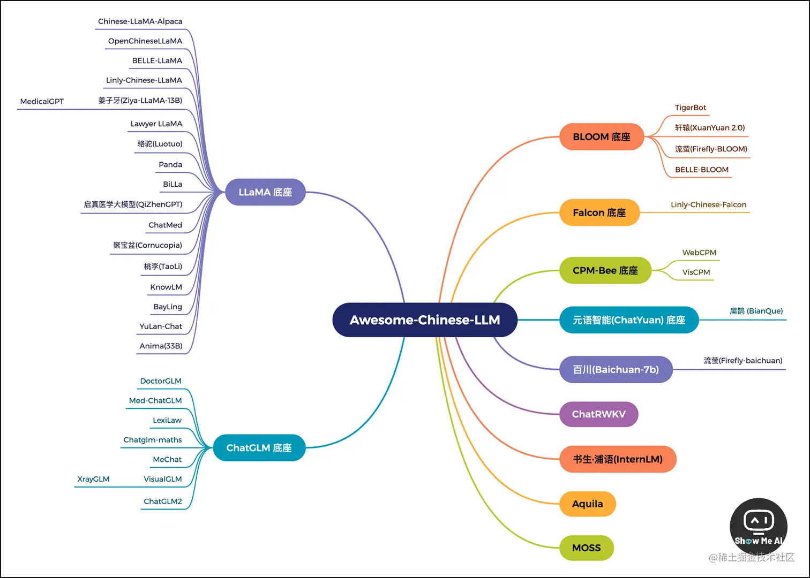
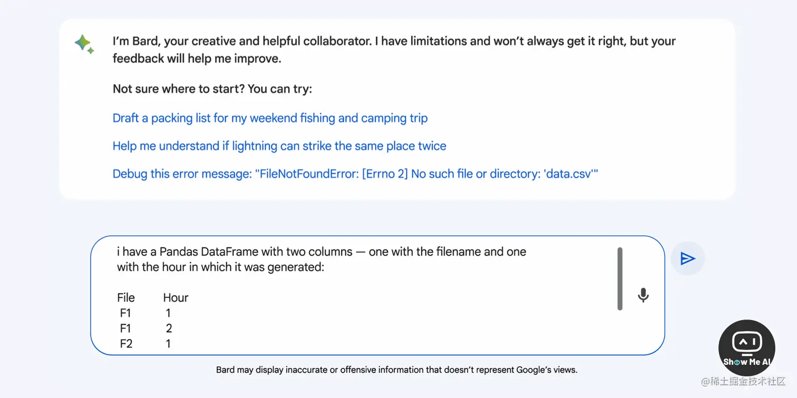
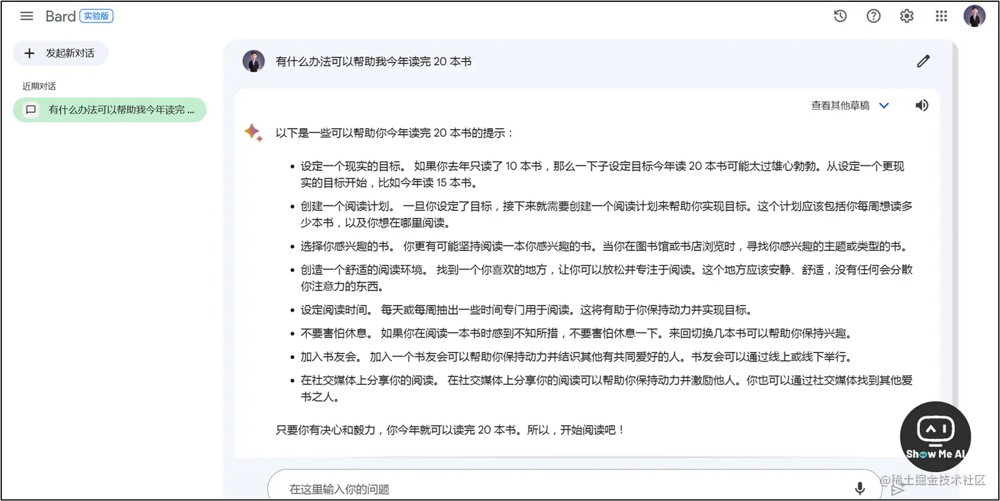
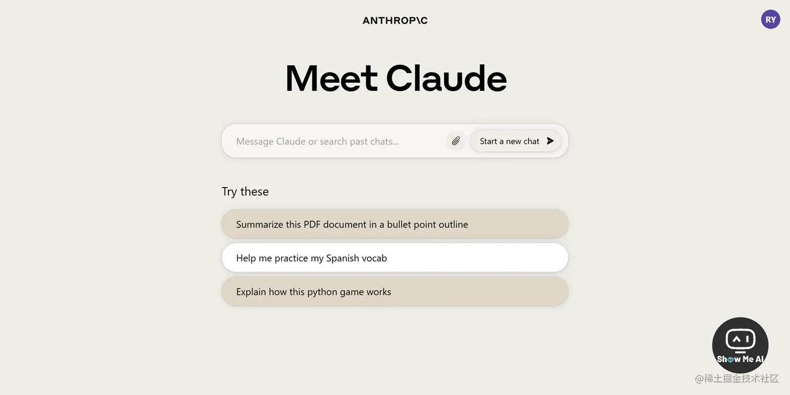
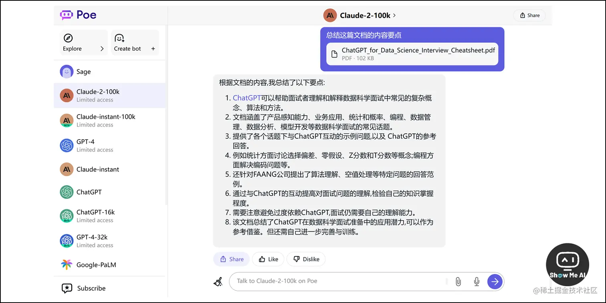
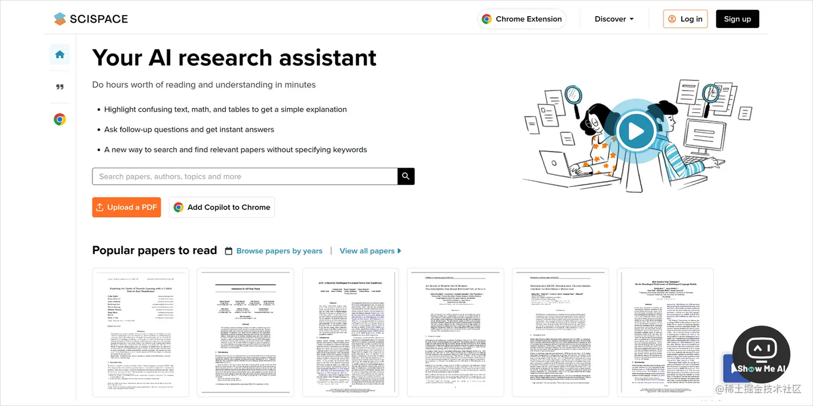
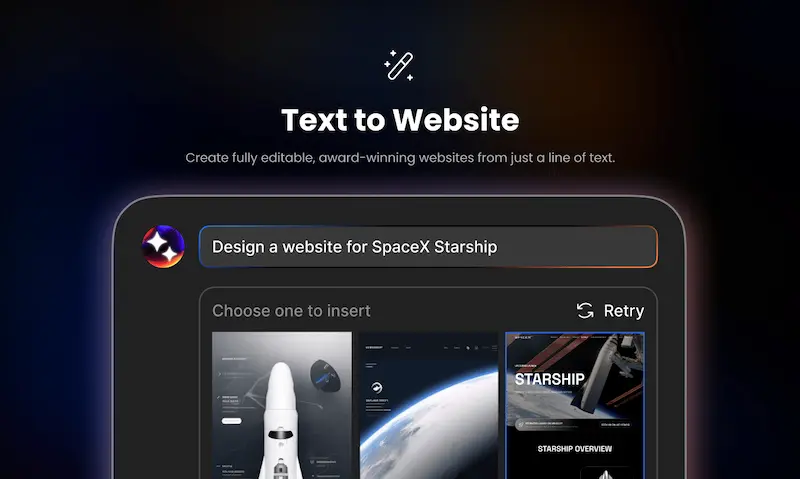
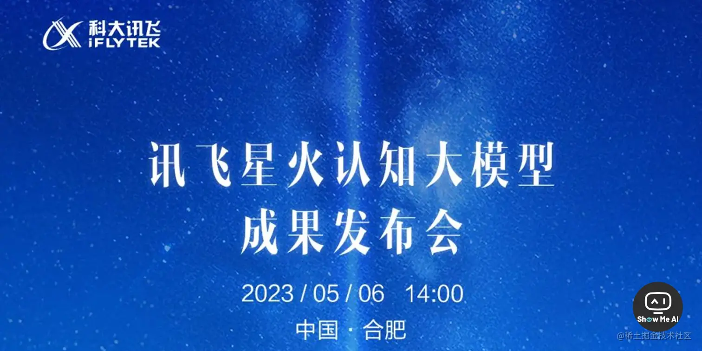
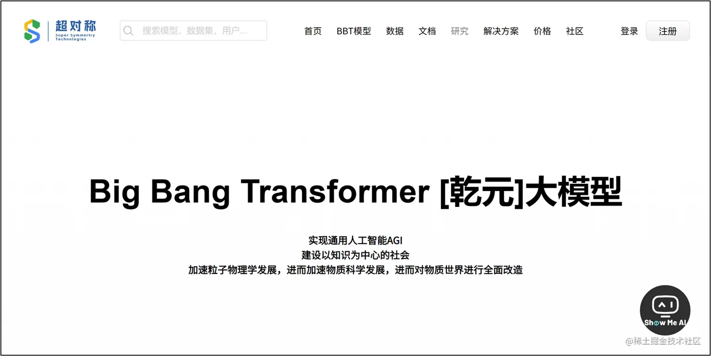

# ChatGPT竞品项目

## 国内现象级 AI产品

[⁡‬‬⁡‬⁣‌⁡‌⁡⁡‬⁢‬⁢⁡⁢‍⁤‍‌⁡‍‌‍⁣‌‬‍‌‬‍‌⁢国内现象级 AI 产品 - 飞书云文档 (feishu.cn)](https://ssw9noe1h6.feishu.cn/wiki/wikcnwf2VnY0LGjM4PVuXBWpPke)

### Awesome Chinese LLM 思维导图，中文大语言模型关系图谱

### 文心一言

> https://yiyan.baidu.com/welcome

百度出品，目前未大规模开放，可申请使用

### 通义千问

阿里达摩院出品，目前未大规模开放，可申请使用

### 通义听悟

阿里「通义听悟」推出浏览器插件，实时翻译/转写/摘要音视频

阿里「通义听悟」推出了**浏览器插件**，可以在浏览器中一键启动这个大模型工具，帮助实时翻译和记录音视频内容，生成字幕和内容摘要！体验非常便捷和炫酷~

将插件添加至 Chrome 或 Edge 浏览器后，在一个非空白页面点击插件按钮，注册登录后即可开始使用。结束后，前往**网页版** ([tingwu.aliyun.com](https://tingwu.aliyun.com/)) 查看结果，包括翻译、转录、概要、章节速览等内容 [**⋙ Chrome插件**](https://chrome.google.com/webstore/detail/通义听悟-工作学习ai助手/omlgpaciclcjgbligehccipcikleeiea)) | [**Edge插件**](https://microsoftedge.microsoft.com/addons/detail/通义听悟-工作学习ai助手/hbfhdcdeikaehendoojplfpjcfifnlme) | [**使用教程**](https://tingwu.aliyun.com/helpcenter/9ba338)

### 🤖 阿里「天猫精灵」大模型升级内测，首个大模型终端操作系统

7月5日，天猫精灵官方微博宣布启动「精灵大模型升级内测」，包含更深入的知识探索、更温暖的共情互动、更丰富的生活妙招、更及时的灵感启发是四类建议对话场景。

官方视频显示，在天猫精灵App内通过以下三种方式可以申请内测，体验业内首个大模型终端操作系统：

> 1. **搜索栏**输入「精灵大模型开放内测」
> 2. **热搜榜**点击「精灵大模型开放内测」
> 3. Sound系列用户会在官方App**首页**看到内测弹窗和图片

用户获得内测资格、同意协议后，在线完成固件升级，几十秒之后天猫精灵的声音、语调和内容生成就都发生显著变化 [**⋙ 微博 @天猫精灵**](https://weibo.com/5623104361/N8snWkGjB)

### 🤖 字节「火山语音」推出AI多角色演播方案，超拟人的有声小说

7月5日，字节旗下的火山语音团队推出「AI多角色演播方案」，通过NLP技术智能理解文本内容，实现多个角色自动配音，千人千「声」，会「哭」会「笑」，形成媲美真人的多角色演播效果。

这是首个AI有声小说领域的高质量综合解决方案，包含 60+ 款优质音色，还结合有声创作流程，同时满足规模化、差异化、精品化的内容定制需求。

官网给出的示例非常好玩儿！可以前往体验 [**⋙ @火山语音团队**](https://mp.weixin.qq.com/s/kX5kK7uK1CNeSmuj0YA34g)

### ChatYuan: 元语功能型对话大模型

> https://huggingface.co/spaces/tianpanyu/ChatYuan-Demo

2023 年 2 月曾短暂发布，后因未知原因关闭，现在已经更新升级到 v2 版本，可使用抱抱脸体验 demo, 性能与 OpenAI 的 ChatGPT 有一定差距。代码和模型已开源 [[GitHub 代码](https://github.com/clue-ai/ChatYuan)].

### MOSS

> https://github.com/OpenLMLab/MOSS

MOSS是一个支持中英双语和多种插件的开源对话语言模型，moss-moon系列模型具有160亿参数，在FP16精度下可在单张A100/A800或两张3090显卡运行，在INT4/8精度下可在单张3090显卡运行。MOSS基座语言模型在约七千亿中英文以及代码单词上预训练得到，后续经过对话指令微调、插件增强学习和人类偏好训练具备多轮对话能力及使用多种插件的能力。

开源了模型、训练数据和训练权重，有兴趣的朋友可以本地试用。

## 国外现象级 AI产品

[国外现象级 AI 产品 - 飞书云文档 (feishu.cn)](https://ssw9noe1h6.feishu.cn/wiki/wikcnpYJwVOZLqsdHHfqShHezKf)

## Claude2

这次对标GPT4，升级后的Claude2，各项评测指标与GPT4非常接近，而且支持附件，上下分支持100k的token（相对于40万汉字，而GPT4最多支持32k，ChatGPT就更少了），更重要的是，它和ChatGPT一样，可以免费使用！

并且此次升级，官网提供了更便捷的使用方式（官网），据说只要注册就可以免费直接用。

这里谈到“据说”，是因为——当小编开心地输入网址（claude.ai）的时候却发现：

用不了……是的，网站可以进入，但就是被限制了，不让用！！！什么情况？

赶紧查看详细说明，一看，果然……又被歧视了，官网就没对国内开放……

赶紧询问高人该怎么办。高人拈花一笑，随手丢了个网址，使用poe使用Claude2：

https://poe.com/Claude-2-100k

按照网页引导注册登录后，发现果然可以用，而且支持上传附件。

最重要的是，每日可以免费使用30条，正常够用了，要是嫌少，还可以花钱扩容

补充一下，以上方法还是需要通过魔法的。

## 🤖 『谷歌 Bard 新增辅助编程功能』帮助编写、调试和解释代码

Google Bard 是一款由 Google 设计的人工智能聊天机器人工具，用于使用自然语言处理和机器学习模拟人类对话。除了补充谷歌搜索之外，Bard 还可以集成到网站、消息传递平台或应用程序中，以对用户问题提供真实、自然的语言响应。Bard 是围绕搜索而设计的，它旨在允许使用更多自然语言查询而不是关键字进行搜索。Bard 的 AI 是围绕听起来自然的对话式查询和响应进行训练的，它不仅提供答案列表，还提供响应的上下文，它还旨在帮助解决后续问题——搜索的新内容。

> 谷歌出品，使用需申请，与 OpenAI ChatGPT 相比不支持代码功能，需翻墙注册使用

Google 在其官方博客中发布，Bard 新增了辅助编程功能，完成代码生成、代码调试和代码片段解释等任务。

Bard 不仅可以使用 C++、Go、Java、JavaScript、Python、TypeScript 等20多种编程语言，还可以使用 Google Sheets函数，并直接导出到Google Colab中进行测试代码，与谷歌已有产品进行了融合。 [**Google Bolg**](https://blog.google/technology/ai/code-with-bard/amp/)

### Bard 悄咪咪支持中文了！Google 这波反击挺强势啊~

> [bard.google.com](https://bard.google.com/) (需魔法)

Bard 是谷歌推出的AI聊天机器人，用来与 OpenAI 进行竞争。不过因为 Bard 不支持中文，国内小伙伴们对其也兴趣寥寥。今天，ShowMeAI 社区小伙伴突然发现，**Bard 支持中文了！而且免费！**

谷歌官方信息表明，本次重大更新，Bard 新支持了40多种语言 (包括简体中文、繁体中文、阿拉伯语、德语、西班牙语等)，覆盖了全球主流语言。除此之外，新版 Bard 还新增了多项辅助创作功能，例如支持Google智能镜头、朗读回答内容、固定近期对话、与他人分享对话、修改 Bard 回答等，为用户提供了更人性化和智能化的交互方式 [**⋙ 实验版本更新记录 2023.07.13**](https://bard.google.com/updates)

## Character AI

月访问量2亿、首周170万安装量！声称碾压 ChatGPT

官网：<https://character.ai>

[Character.ai：每个人都可定制自己的个性化AI (baidu.com)](https://baijiahao.baidu.com/s?id=1763251679965944178&wfr=spider&for=pc)

## Claude 2 惊艳更新&免费使用，再也不担心被 OpenAI 封号啦

7月11日，Anthropic 公司在官方推特发布了新一代AI模型 Claude 2，并开放**免费使用**。

> 链接：[claude.ai](https://claude.ai)
>
> 只对英国和美国的IP开放 (记得魔法开全局模式)

脱胎于 OpenAI 的初创公司 Anthropic 产品 Claude 模型，需申请使用

更新：Claude 模型现已经可以通过 slack 免费使用，地址: https://www.anthropic.com/claude-in-slack

新版模型提升很大：

> 1. **支持更长的上下文**：最多支持 200K token (约 150K 个单词)，目前只开放了 100K
> 2. **生成更长的响应**：多达 4K token的连贯文档
> 3. **生成更好的代码**：在编程基准测试和人工反馈评估中表现显著提高
> 4. **使用了更多非英语数据**，以及2022年到2023年初的新数据
> 5. **支持上传和分析文本**：一次最多支持5个10M大小的 PDF、TXT、CSV 文件，并支持跨文件分析  [**⋙ Twitter @AnthropicAI**](https://twitter.com/AnthropicAI/status/1678759122194530304) | [**中文解读**](https://mp.weixin.qq.com/s/ovwPR78hCGUi8rjxulkrvw)

使用 Poe 也可以体验到 Claude 2 最新模型，从使用体验上来说与 Claude 网站保持一致。目前 Poe 内可以每天免费使用30次

> 链接：[poe.com/Claude-2-10…](https://poe.com/Claude-2-100k)
>
> 需要魔法，每天免费使用30次

ChatGPT 最有实力的竞争对手 Claude 也开放 API 申请了，很大方，不仅会给免费的 API，官网也可以直接使用进行问答。

> 申请地址：[www.anthropic.com/product](https://www.anthropic.com/product)

## YouChat

> https://you.com/

注册登陆后即可免费使用，并且由于 you.com 本身是搜索引擎，侧边栏会出现实时搜索结果

## Phind

https://phind.com/

无需注册直接使用，并且由于 phind.com 本身是搜索引擎，侧边栏会出现实时搜索结果

##  ChatSonic

> https://writesonic.com/chat

注册后提供一定免费额度，超出免费额度需付费

## 『一站式 AI 科研辅助工具 SCISpace』科研界的 ChatGPT

[**SCISpace**](https://typeset.io/) 是一款专门为学术研究构建的平台，已经帮助全世界各地 100 多万名研究人员撰写了高质量的研究论文，并影响了学术出版的格局。

SCISpace 对撰写论文需要的多项工具进行了深度集成，包括文本编辑、语法纠错、格式排版、插入数据、代码、媒体、注释和剽窃检测等工具。**因此，作者可以基于 SCISpace 构建一个从编写、审查到格式的端到端完整工作流，并于全世界的专家进行有效合作。**

## Dora.ai文本描述就能生成网页

[Dora.ai](https://www.dora.run/)

国人开发的一个 AI 工具，给出文本描述就能生成网页，还能添加 3D 互动。目前处于测试阶段，需要排队登记内测资格。

[Product Hunt 的投票中](https://www.producthunt.com/posts/dora-ai-alpha)，暂时排在第一，作者到周刊讨论区求票了

## 🤖 『科大讯飞将发布「星火认知大模型」』内测申请已开放 (通过有窍门儿)

科大讯飞公众号宣布，2023年5月6日14:00举办「星火认知大模型」成果发布会，并将同步发布讯飞AI学习机、讯飞听见、讯飞智能办公本、讯飞智慧驾舱、讯飞开放平台等5项应用成果。 [**预约线上发布会**](https://mp.weixin.qq.com/s/9uYus4226lrkD57_JyxZkQ)

ShowMeAI社群亲测，填写调研问卷可以光速通过内测申请！记得！一定要接来自安徽合肥的官方调研电话，然后就拿到了内测名额！

> 调研问卷地址：[xinghuo.xfyun.cn/](https://xinghuo.xfyun.cn/)

## 🤖 『超对称联手复旦发布「BBT-2」大模型』可编程、金融、文生图

**BBT-2** (BigBang Tansformer-2，乾元2) 是超对称技术公司、复旦大学知识工场实验室联合发布的120亿参数的通用大模型。项目团队以其为基础训练出了代码、金融、图文等专业模型。

根据官方数据，其中的代码大模型在CSDN的自动编程评测标准上能达到C3，和GPT-3.5处于同一等级「条件自动编程」。据悉，BBT系列模型其中3个即将开源到GitHub、UCloud和官网，开箱可用。 [**在线Demo**](https://www.ssymmetry.com/) | [**更多测评**](https://mp.weixin.qq.com/s/OZquNIN1nnM8W3CQlSRm9g)
