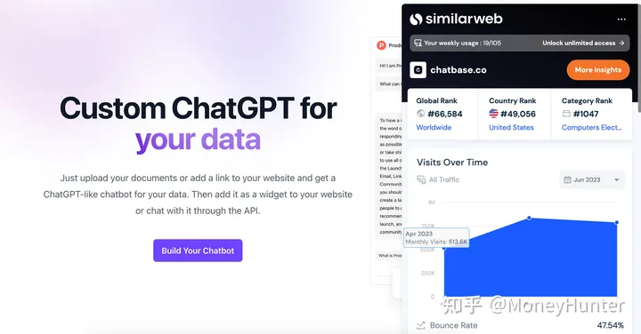

# ChatGPT变现和赚钱

[⁣‌⁣‍5分钟成为自媒体达人-飞书云文档(feishu.cn)](https://ssw9noe1h6.feishu.cn/wiki/wikcnDgYy2uj11zJR0SjTqYqoWc)

[利用ChatGPT变现有哪些方法？ - 知乎 (zhihu.com)](https://www.zhihu.com/question/583678223/answer/2982766964)

1.卖普通账号

国内注册 chatgpt 账号有一定的门槛，很多人自己无法注册账号，我们可以把已经注册好的账号，卖给这些有需求的人。账号的来源可以自己去注册，也可以当中间商，赚差价。

2.卖 plus 账号

chatgpt 除了普通账号之外，还有付费账号，所以，不仅可以卖普通账号，还能卖付费账号。

3.付费专栏

开通一个付费专栏，提供和 chatgpt 相关的知识和技能。和 chatgpt 相关的知识和技能，都可以从网上获取，整理一下，用自己的话表述出来就行。

4.付费社群

任何一个新的热点出来后，都可以做知识付费，可以是教别人如何使用 chatgpt，也可以是教别人如何用 chatgpt 赚钱等等。

5.买 chatgpt 相关概念的股票

投资有风险，入行需谨慎。

6.做导航网站

由 chatgpt 衍生出来的应用很多，可以做一个导航站，方便用户使用的同时，还能盈利。

7.付费群

做一个付费交流群，里面提供注册指导，赠送相关资料等等。

8.卖课

卖课也属于知识付费的一种，将在外网收集到的，关于 chatgpt 的知识和信息，做成付费课程。很多人上不了外网，这就存在信息差。

9.代提问

有些人想用 chatgpt，但自己没有账号，或者其他限制，用不了，那么可以提供代替提问的服务，0.5 元/条。可以从闲鱼，抖音，快手，贴吧，小红书等平台引流。

10.出书

可以利用 chatgpt，出一本关于 chatgpt 的书，快的话一两天就能搞定。

11.写小说

可以用 chatgpt 写各种题材的小说，出个框架，然后让 chatgpt 填补内容，可以是武侠小说，爱情小说，童话故事，爽文小说等等。

12.教提问

想要用好 chatgpt，核心在于要会提问，问的问题越好，chatgpt 回答的质量就 越高，很多人不知道如何提问，那么就可以教他们如何向 chatgpt 提问。

13.卖资料包

现在网上有很多和 chatgpt 相关的资料，教程等等，如果不想做知识付费，也可以直接卖这些资料包赚钱。

14.翻译

chatgpt 有强大的翻译功能，可以利用这个功能，在网上做一些书面的翻译工作。

15.数字藏品

可以借助 chatgpt 生成 ai 绘画，做成数字藏品来出售。

16.写歌词

可以用于 chatgpt 辅助写歌词，然后出售。

17.视频脚本

凡是和文案相关的工作，都可以用 chatgpt 来做，比如视频脚本等等，批量做出视频脚本来出售。

18.撸广告费

可以用 chatgpt 批量生成内容，然后分发到一些图文内容平台，撸取广告费。

19.生成短视频

这个需要配合其他工具来使用，比如 chatgpt 出文案，剪映将文案转成视频，发到短视频上，可以用来引流，卖货等等。

20.做音频

chatgpt 出文案，然后用文字转音频工具，将文案转成音频，可以铺上喜马拉雅等平台，也可以直接出售音频赚钱。

21.文档裂变

可以将一些有价值的 chatgpt 信息做成文档，文档里放上付费二维码，文档主要起到裂变引流的作用，需要配合付费产品使用。

22.代写

很多代写相关的活儿，比如代写论文，代写情书，代写道歉信等等，都可以用chatgpt 来做，用闲鱼，小红书，淘宝，抖音来引流获客即可。

23.给人起名

给人起名一直都比较赚钱，现在可以用 chatgpt 来做。

24.企业起名

除了给人起名之外，其他相关的起名，都可以用 chatgpt 来做，比如给公司起名，还可以配合 AI 绘画出公司 logo。

## 66种通过ChatGPT进行副业赚钱的小技巧

由本人与ChatGPT共同创作完成，希望能够帮助到大家。

### 1、代提问

这个与代写文章类似，区别就是写文章一般是直播引流，而这个更多的是闲鱼售卖引流，1条0.5-1块，而且可以批发售卖，只要执行力强，虽然不多，但肯定能赚点。

### 2、星球回答

知识星球的用户是可以找星主和嘉宾提问的，如果星球粉丝量大，尤其是免费星球，星主想增加粉丝粘性，但是又没有太多时间，就可以用ChatGPT来辅助回答，甚至可以付费提问，比如1块1个。

### 3、技术支持

当你学会把ChatGPT部署到公众号、微信群、飞书等地方之后，大多数人看到了是用着玩，但是有商业嗅觉的人看到了，就会找你帮其部署，这个客单价可不低的。

### 4、代申请API

API其实就是接口的意思，部署到公众号、微信群、飞书必须用到，那有需求又不会申请的，当然是可以帮其有偿代申请喽。

### 5、开发软件

程序员可以给中小企业开发应用软件，提高企业办公效率。当然稍大的规模，可能得多人组团搞了。

### 6、倒卖设备

AI绘画和ChatGPT对算力要求极高，需要大量运算，那相应的硬件必然跟着涨价，如果有资金可以先投入囤一批，等水涨船高的时候再卖，就像当年的囤内存一样，可能有人觉得这样不道德，不过咱们只赚点副业的小钱，肯定还没那没大的囤货实力。

### 7、短信服务商

由于大多数人自己注册，都需要接码平台弄虚拟号，所以如果能自己搭建一个接码平台，那肯定能赚一笔中间的服务费，不同地区注册价格也不一样，但1个号赚1块钱很能赚不少，关键是量大。

### 8、付费专栏

公众号上有许多的付费专栏，这些比知识星球体量更轻，交付更快，也更好操作，不用长期运营，可以从一个具体的项目切入去尝试。

### 9、代提供短信服务

之前说过搭建接码平台，但是肯定不是一般人能搞出来的，大多数人都在搞账号、搞问答，那咱们也可以去帮助那些不会用接码平台的人，比如接码平台要2块，你收客户4块，从中可以赚些差价。

### 10、科学上网

咱们有好多人之前根本没有接触过这方面，那咱们懂的就可以教他们上，顺便收点儿服务费。

### 11、付费群

现在不是有好多交流群么，既可以进免费群，到里面收指导费；也可以进付费群，里面的指导免费。如果有号源，还可以送号送资料。就是要注意交流内容，很容易被封控。

### 12、卖Plus号

咱们一般用户用普通号即可满足需求，但是普通号不稳定，无法满足需要超长时间使用的用户，比如微企业、个体户等。他们又不想租用，但是又不会申请，或者支付不了，那你就可以办好卡帮他们申请支付赚差价，现在价格炒的很高，但Plus对于个人其实真没太大用。

### 13、镜像站

咱们好多用户不会或不想登梯子，所以国内出现好多打着“最接近于ChatGPT的应用”这样标语的软件或网站，程序员也很容易弄，因为其实就是接入API，然后收月租费。人家官网一年烧25亿，咱们个人哪儿搞的起，有点挂羊头卖狗肉，所以不推荐这种无良的经营模式。

### 14、出书

记得前几天看有个纯拿ChatGPT出了本叫“革命”的书的大佬，纸质版都发行了，速度真是快。甚至亚马逊上都有不少标明就是ChatGPT出的电子版。完全可以弄个目录框架，让ChatGPT分段写，然后自己再整合排版，据说快的话，四个小时就出一本书，不过好像比较泛泛，可读性并不强。

### 15、卖课

可以整理一下ChatGPT的所有变现方法都列出来，然后出个课程，在各个平台售卖，教别人让他们选择合适的方式进行变现。课程根据内容多少与渠道不同，价格从99到999不等。

### 16、写童话故事

ChatGPT写童话故事最合适，因为经常一本正经的瞎编，至少不会太误导，而且比写书简单多了，但是目前咱们是要会用ChatGPT结合AI绘画来出童话绘本故事，这样才有人买，亚马逊上可以卖电子版。

### 17、卖模型

咱们之前总说代回答问题，其实使用ChatGPT时，会提问问题也是一门学问。就像你AI绘画写关键词的语法一样，人家说需要苏格拉底式的提问，提问是有逻辑递进顺序的，咱们可以研究一下各种情形下的提问模型，总结出来当课程售卖。因为好多人一开始都自我感觉良好，用用就知道自己都问不到点上，所以一定有很多人会买的，尤其是刚刚使用上的人。

### 18、导航站

现在咱们大家都热衷于玩ChatGPT，但其实国内外已经有好几百个AI网站，文字出图的、文字出音频的、文字出视频的等等，有点搭建网站技术的人可以把这些链接都汇总起来，做一个导航网站，再做好SEO排行，流量很多，嵌入广告自然就有收益了。

### 19、开发小程序

之前说过为小微企业开发软件，其实程序员也可以挖掘大众需求自己做微信小程序、抖音小程序、APP等，比如取名字的，算命的，文字游戏等小软件，不仅很容易，而且也是有市场的，说不定下一个爆火的就是你开发的。

### 20、提示工程师

现在网上流传一个提示工程师的岗位招聘介绍，据说年薪百万，就是不知道明年是否还能给这么多，不过这个职业应该还会有的，要是AI方面研究的比较深，可以兼职做这个。

### 21、文稿整理师

好多需要写文案的公司有招兼职文稿整理员的需求，而且还只招会用ChatGPT的，比如让你用ChatGPT生产内容或翻译之后再修改通顺，每小时40块，有点像快餐店打零工，咱们有空闲时间的都可以去搞一下。

### 22、卖资料包

现在ChatGPT相关的课程、咨询、使用方法、调教方法网上一大堆，咱们不会技术、不会录课，能到还不会收集整理么？整理好了进行售卖，至少现阶段肯定卖的出去，这就是你用时间换钱，人家用钱换时间而已。

### 23、细分领域

现在大多数通过ChatGPT赚钱，都是停留在卖账号、教上网、学使用这个阶段。那么咱们能否提前布局一下你擅长的细分领域呢？比如用ChatGPT进行WPS表格优化、写AI绘图的prompt、优化文章逻辑或长度、递进式循环提问技巧等等。

### 24、投资

咱们好多人都喜欢炒股，可能一时能赚到，但是说实话，要是不懂投资，那就是赌博，早晚还会赔回去。其实真正总能从股市赚到钱的都是会长期投资的，因为长期回报率就是接近于10%，但是学习投资体系不是一两天的事儿，咱们完全可以借助ChatGPT当你的投资顾问，有了问题直接问，加速学习。

### 25、理财

跟投资类似，理财一方面是包括投资，另一方面不仅限于投资。无论你是买股票基金，还是存钱买保险，甚至是日常花销，都属于理财范畴。学会花钱一样很重要。也是可以借助ChatGPT加速学习的。

### 26、自动客服

说实话，ChatGPT的表达能力比好多人工客服及机器人客服好多了，所以懂接入的人完全可以利用业余时间，找到有这方面需求的公司帮助将ChatGPT接入到公司现有的系统中，然后顺便进行一些个性化开发，按需求大小、按件质量及人工时长进行合理收费。

### 27、检测系统

就像病毒与杀毒软件一样，有了想用ChatGPT为自己提供帮助的人，那就有不愿意用其帮助的人。比如写毕业论文，要是学生都用ChatGPT写，尤其是研究生要是都研究这个，都没什么创新了，那老师和学校肯定是不干啊。所以目前就有了检测系统，就是为了辨识作品是否是ChatGPT生成的。这个技术大佬们可以研究一下。

### 28、AI出图

具体AI绘画出图怎么变现就不细说了，没有ChatGPT之前出图的prompt都是需要自己搜集，或者借助相应的prompt网站。现在有了ChatGPT那就省事多了，直接给ChatGPT发指令，就可以出prompt了，当然也需要有调教模型才会出的比较理想哈。

### 29、数据分析

ChatGPT有强大的数据分析能力，可以将要分析的数据全都交给ChatGPT，如果信息量太大，还可以用链接的方式让其去读网址里面的内容，然后按你的要求进行提炼、分析、梳理等工作。这样找到有分析需求的兼职，不就分分钟干完了。

### 30、翻译

ChatGPT算是最智能的翻译工具了，普通的翻译语法方面经常是不通顺，利用ChatGPT可以很好的进行翻译，它的水平介于工具翻译与人工翻译之间。可以做网站，也可以直接代翻译，而且可以翻译多种语音，收费可以比人工翻译便宜一些，那不想用人工翻译，又觉得工具翻译不咋地的，自然就会找你喽。

### 31、创作大纲

ChatGPT只要给一个比较明确的需求，然后告诉它要大纲，那很快就能给列出来一个大纲。有的确实前期只需要大纲，所以大纲也是可以卖的。

### 32、电子邮件

ChatGPT的自动回复电子邮件是一大特点，这对于使用电子邮件比较多、对邮件格式的艺术性有要求的公司，是比较实用的，可以卖邮件文案包。

### 33、数字藏品

对于NFT，最早是手动生产，去年是借助AI绘画生成，现在AI绘画又可以借助ChatGPT生成了，真是速度越来越快。

### 34、网络小说

用ChatGPT直接写网络小说还是不太容易实现的，但是对于那些兼职、专职的网络小说作家来说，提供灵感还是很有帮助的，他们不是有字数要求么，如果要是没时间还可以水一些字数，哈哈。

### 35、写歌词

与写小说类似，直接用ChatGPT写出来的歌词也不太靠谱，但是对于作词家提供些灵感还是可以的。

### 36、视频脚本

这个也不用多说了，能生产文案，自然能生产视频脚本和视频描述这些东西，但是确实有专门通过这个赚钱的，自然可以利用ChatGPT提高N倍的效率。

### 37、SEO

咱们都知道SEO的重要作用，利用ChatGPT生成关键词，然后在通过SEO排行，那自然能够吸引被动搜索过来的粉丝来点击你喽。

### 38、出售账号

最初的变现就是自己注册账号然后找客户卖账号。如果使用注册机，一天能够跑上万个账号。不会注册，那就做中间商赚差价，一个账号单独买20多，赚个几块钱，一天上百账号，收益也不错。目前看来视频号、小红书、贴吧都还容易引流，一是容易爆，二是感兴趣的多，三是付费能力高。引到私域后再转化。

### 39、试用赚钱

把ChatGPT接入企业微信或公众号等卖使用次数。前20次免费，后面用1次0.5块。目前很多人对这个感兴趣。想办法让这些人知道你做这个项目，自然就可以变现了。

### 40、培训班

有淘金的人，自然就能卖牛仔裤。有人想通过这个热点来赚钱但是不会做，那咱们就把用ChatGPT赚钱的方法列出来，开个培训班，只要有内容，想通过ChatGPT赚钱的人自然就会学习。

### 41、API接入

有不少人和公司想把ChatGPT接入到企微、飞书、钉钉等。但如果自己不懂技术的话，就需要找程序员了，程序员可以看看网上的教程，比如B站，稍微研究一下就可以做这个项目来变现了，而且后期还免维护。

### 42、做网站

使用ChatGPT大量的生成内容，一天生成几万篇以上内容，然后把这些内容分类导入到网站里面。然后再做SEO排名，在短时间之内，通过大量的内容输出，获得大量的排名和流量。只要网站起来，之后无论直接做项目变现、卖产品、卖服务都可以。

### 43、问答

拿百度举例，以前大家一般是使用搜索引擎，看到问题，然后搜索问题找答案。现在有了ChatGPT，直接写上问题就行了，省去了搜索和筛选的时间，关键是准确率高达95%。多账号操作，一天赚个几百，一点问题没有。

### 44、生成短视频

使用ChatGPT直接生成想要的文案，导入到剪映，用图文成片功能3分钟就能做成原创短视频了。做垂直高客单领域，一天做几百个短视频，账号矩阵，整个平台上那个领域都是你的短视频。之前有人做公众号霸屏，专门做几千块的产品，一天发上万篇内容，直接把某个领域一网打进，一天十几万的收益。

### 45、数字人

现在的数字人在短视频里面跟真人很小。甚至可以让数字人学习你觉得不错的真人，慢慢的数字人就有了这个人的面容和语气。再用ChatGPT生产的原创内容，就能够做出更好的短视频了。

### 46、写文章

写商业热点文章、小红书文章、自媒体文章、跨境电商文章、朋友圈文章等。这个文章不止这几个，其实有很多种，需要哪类就写哪类。

### 47、做直播

有人使用数字人和ChatGPT做直播，甚至还能够进行互动，估计ChatGPT也能改变直播的行业了。再继续发展下去，以后直播的时候，看到的人不知道是真是假了。

### 48、写程序

ChatGPT很不可思议，甚至可以写程序，还能审程序错误，重复循环，最终编写一段完整的程序，效率极高。

### 49、讲故事

已经有做教育的人，通过ChatGPT产生的故事文案，加上自己上镜，开始做自媒体短视频了。有了ChatGPT，就算是从零开始做一个自媒体都是能够实现。一次做10个账号，就算是起来5个账号，一个账号一个月赚个5万块，5个账号一个月就是5万块的收入。

### 50、聊天机器人

就是接入API，搭建成智能聊天机器人，与自动客服类似，只是应用领域不太一样，这个更多的是陪聊。

### 51、做音频

ChatGPT的文字生成能力，故事生成能力超强，可以生成大量的内容。再加上配音神器，直接生成音频，然后上传到喜马拉雅等平台，去变现。

### 52、传播文档

这个就是自己将网上搜索到的跟ChatGPT有关的有价值的链接，汇总写到飞书上面。然后通过全网的各种渠道传播，能够让大家访问到你的链接。同时文档里面贴上你的专栏收费二维码，这样看到的人多了之后，感兴趣的就会进行付费。

### 53、租Plus号

之前咱们说过卖普通号，缺点就是不稳定，米国白天咱们这边就是晚上，属于高峰时段（注册过2亿人次）很容易断。而Plus号，这个是每月135元专线，通道更稳定更快，新功能也能提前使用。咱们说过卖Plus号，而这个租Plus号主要是针对普通号与Plus号之间需求的用户，就像拼单一样。一个账号价格是每天4块多的成本，可以赚一倍，可以多账号操作，只是这个风险也大要谨慎。

### 54、代写

咱们之前说过可以自己用ChatGPT来写文章，增长自己的公域粉丝。这个就是帮助别人写文章。因为有不少用户知道虽然知道ChatGPT，但是不会用，却也想体验。而且咱们能高效率的输出，价格也不高，比如一篇5块这样。当然去视频平台，也可以进行在线直播答题。

### 55、问题咨询

之前说的咨询是指问用户自身领域的问题，这个问题咨询指的是咨询ChatGPT本身的使用问题，当您对相关的问题比较了解了，趁着大热可以做这个，要是不会还可以直接让ChatGPT替您回答。

### 56、海量问答

咱们之前说过专业领域问答，主要是为了建立垂直IP。这个海量问答的逻辑是用极客等工具搜索热点问题，尤其是观看多而回答少的问题，不论专业是否垂直，多账号操作，每天回答到账号的极限，快速吸粉。

### 57、企业起名

之前说过给人起名，这个类似就是那些设计公司，可以借助ChatGPT提供灵感，给企业起名或者口号标语，延伸到AI绘画一起配合使用，还可以出商标LOGO，而且有些LOGO相当的惊艳，可以批量出了之后挑选。

### 58、资格证

以后要是有提示工程师、投喂工程师等岗位了，那自然也会有相关的培训机构，甚至还有可能有职称，从业资格这些，咱们有能力的可以提前布局。

### 59、卖赚钱视频

这个就是做直播，然后给录下来，给你看他是怎么引流，什么话术，怎么赚钱，然后把视频卖给你。其实也是买课程的一种，只是算是流量很大很暴力的一种。

### 60、卖自家货

因为现在ChatGPT是个热点，所以搜索量很大，很多人蹭这个热点，比如说什么免费指导注册之类的，反正是先给你拉过来，然后再做淘客、微商优惠券返利那一套生意。

### 61、快速引流

这个其实不是为了马上赚钱，更多的是为了引流到私域，因为目前是个窗口期，谁也不知道哪天突然就会出台更严格的制度给封了，所以先引流过来，以后慢慢转化，比如建一个免费的星球，公众号之类的。

### 62、出海赚钱

咱们好多人是由于知道了ChatGPT，才接触了外面的世界，所以咱们也可以顺带着出海赚外国人的钱。

### 63、商品推荐

自媒体要么是人带货，要么是货带人。之前说过的大多数写文案都是人带货，当然也可以货带人。怎么带呢，就是像那些知乎或者视频平台的测评达人、好物分享号那样，通过对货物的详细描述、润色和对比进行商品推荐，自然能够更快的大批量的出文案、视频，做起来号速度也更快了。

### 64、国内模型

由于ChatGPT的出现，国内有实力的公司，尤其是搜索类的都会很着急出台自己的产品。这个技术含量很高，基本都是科学家级别的在搞，咱们可以先关注一下，等出来产品之后，后面是否会出来不少相应的比如维护、调试、投喂、算力之类的兼职。

### 65、交友

想找另一半的，以前网聊的时候需要自己编笑话、情话、嘘寒问暖之类的，难倒了技术宅。现在咱们有了这个小助理，那肯定是对答如流，贴心到底了。正所谓找到好的另一半，等于少付出十年。当然咱们也得提高自己水平，真实心意，别搞骗人那套。

### 66、取代人类

其实变现方法千万种，总结起来也不多，写到最后就逗大家一乐吧。也许不久的将来咱们都被机器人压榨的没有生存空间需要殖民外星球了，也许像黑客帝国那样都躺着进元宇宙里面玩去了。

## 200个使用ChatGPT

- 1.为企业客户提供自然语言处理和文本生成服务。
- 2.将ChatGPT用于人工客服，解决客户的问题和提供帮助
- 3.开发聊天机器人应用程序，将ChatGPT用于自动化聊天功能
- 4.利用ChatGPT生成创意广告和标语为客户提供广告创意服务
- 5.为内容营销提供服务，将ChatGPT用于生成博客文章、社交媒体帖子等
- 6.为客户提供内容汇编服务，利用ChatGPT生成有关特定主题的文章、新闻等内容。
- 7.为学校、大学等机构提供学术写作服务，将ChatGPT用于生成学术论文、研究报告等。
- 8.将ChatGPT用于智能音箱和智能家居系统中的语音交互功能
- 9.为网站和移动应用程序提供搜索优化服务，利用chatGPT生成高质量的元数据和标签。
- 10.开发在线教育平台，利用ChatGPT生成教学资料和练习题
- 11.将ChatGPT用于游戏中的自动生成剧
- 12.为新闻机构提供自动化新闻写作服务，将ChatGPT用于生成新闻稿件
- 13.为出版商提供自动化图书写作服务将ChatGPT用于生成小说、诗歌等文学作品。
- 14.开发智能客户管理系统，将ChatGPT用于客户交互和服务
- 15.为医疗保健机构提供自动化医学写作服务，将chatGPT用于生成医学报告和诊断。
- 16.将ChatGPT用于自动化翻译和语音识别服务。
- 17.为电子商务平台提供商品描述和评论的自动生成服务
- 18.为政府机构提供自动化公告和通知写作服务，将ChatGPT用于生成政府文件和通知。
- 19.将ChatGPT用于自动化电子邮件回复和邮件营销服务
- 20.为人力资源机构提供自动化招聘广告和面试评估服务，将ChatGPT用于生成招聘广告和评估报告
- 21.开发智能客户服务机器人，利用ChatGPT为客户提供快速解答和服务
- 22.将chatGPT用于自动化合同和法律文件写作服务
- 23.为政治候选人提供自动化演讲稿和宣传口号的生成服务。
- 24.将ChatGPT用于社交媒体机器人和推广服务
- 25.为旅游机构提供自动化旅游路线和攻略的生成服务，利用ChatGPT为旅游者提供个性化的旅游规划
- 26.将ChatGPT用于自动化数据分析和报告生成服务。
- 27.为金融机构提供自动化财务报告和分析结果
- 28.将chatGPT用于自动化简历和求职信的生成服务。
- 29.为艺术家和音乐人提供自动化歌曲和作品的生成服务，将ChatGPT用于生成歌词和作品构思
- 30.将ChatGPT用于自动化天气预报和气象分析服务
- 31.为电影制作公司提供自动化剧本和故事创作服务，将ChatGPT用于生成剧本和故事构思。
- 32.将ChatGPT用于自动化产品描述和规格的生成服务
- 33.为人工智能领域提供自动化技术报告和论文写作服务，利用ChatGPT生成技术报告和论文
- 34.将ChatGPT用于自动化游戏角色和游戏世界的生成服务
- 35.为餐厅和食品供应商提供自动化菜单和食谱的生成服务，将ChatGPT用于生成菜单和食谱
- 36.将ChatGPT用于自动化音乐推荐和播放列表的生成服务
- 37.为艺术家和设计师提供自动化艺术作品和设计稿的生成服务，利用ChatGPT生成艺术作品和设计构思
- 38.将ChatGPT用于自动化房地产描述和房屋布局的生成服务
- 39.为电视和电影广告制作提供自动化厂告和宣传口号的生成服务，将ChatGPT用于生成广告和宣传语
- 40.将ChatGPT用于自动化博客评论和社交媒体互动的生成服务
- 41.为汽车制造商提供自动化汽车描述和配置的生成服务，将ChatGPT用于生成汽车描述和配置方案目动化招标文件和标书的生成服务
- 43.为咨询公司提供自动化报告和建议书的生成服务，将ChatGPT用于生成咨询报告和建议书。
- 44.将chatGPT用于自动化产品说明书和操作手册的生成服务
- 45.为房地产经纪人和开发商提供自动化房源描述和户型图的生成服务，将ChatGPT用于生成房源描述和户型图
- 46.将chatGPT用于自动化新产品推广和宣传的生成服务
- 47.为健身教练和体育俱乐部提供自动化运动计划和指导服务，将chatGPT用于生成个性化的运动计划和指导建议。
- 48.将ChatGPT用于自动化智能家居控制和场景配置的生成服务
- 49.为游戏开发商提供自动化游戏关卡和任务的生成服务，利用ChatGPT生成游戏关卡和任务构思
- 50.将chatGPT用于自动化医疗诊断和建议的生成服务
- 51.为企业提供自动化市场调研和报告的生成服务，将ChatGPT用于生成市场调研和报告
- 52.将ChatGPT用于自动化数据清洗和预处理的服务。
- 53.为电子商务网站提供自动化商品描述和详情页的生成服务，将ChatGPT用于生成商品描述和详情页。
- 54.将ChatGPT用于自动化故事生成和创意写作服务。
- 55.为招聘公司和人力资源部门提供自动化候选人推荐和招聘广告的生成服务将ChatGPT用于生成候选人推荐和招聘广告。
- 56.将chatGPT用于自动化论文摘要和综述的生成服务
- 57.为法律团队和律师事务所提供自动化法律文件和合同的生成服务，将ChatGPT用于生成法律文件和合同
- 58.将ChatGPT用于自动化问答系统和客户服务的生成服务。
- 59.为在线教育平台提供自动化课程内容和学习计划的生成服务，将ChatGPT用于生成课程内容和学习计划。
- 60.将ChatGPT用于自动化广告标语和品牌口号的生成服务
- 61.为新闻机构提供自动化新闻稿和报道的生成服务，将ChatGPT用于生成新闻稿和报道。
- 62.将ChatGPT用于自动化图片标注和图像识别的服务
- 63.为保险公司提供自动化理赔报告和赔偿建议的生成服务，将ChatGPT用于生成理赔报告和赔偿建议
- 64.将chatGPT用于自动化网站和应用界面设计的生成服务。
- 65.为出版社提供自动化图书章节和封面设计的生成服务，将ChatGPT用于生成图书章节和封面设计。
- 66.将ChatGPT用于自动化语音合成和语音识别的服务。
- 67.为翻译公司提供自动化翻译和语言转换的服务，将ChatGPT用于翻译和语言转换。
- 68.供自动化房产描述和广告的生成服务，将ChatGPT用于生成房产描述和厂告。
- 69.将ChatGPT用于自动化音乐创作和作曲的服务。
- 70.为航空公司提供自动化航班时刻表和机票价格的生成服务，将ChatGPT用于生成航班时刻表和机票价格。
- 71.将ChatGPT用于自动化企业品牌定位和品牌策略的生成服务。
- 72为医疗器械公司提供自动化产品介绍和说明书的生成服务，将ChatGPT用于生成产品介绍和说明书
- 73.将ChatGPT用于自动化智能客服和机器人的服务。
- 74.为电影制作公司提供自动化剧本和剧情构思的生成服务，将ChatGPT用于生成剧本和剧情构思
- 75.将ChatGPT用于自动化社交媒体帖子和广告的生成服务。
- 76.为舞蹈和表演艺术公司提供自动化舞蹈和表演构思的生成服务，将ChatGPT用于生成舞蹈和表演构思。
- 77.将ChatGPT用于自动化媒体报道和采访问题的生成服务。
- 78.为家居装饰公司提供自动化家居设计和装修建议的生成服务，将ChatGPT用于生成家居设计和装修建议。
- 79.将chatGPT用于自动化搜索引擎优化和关键词研究的服务。
- 80.为游戏开发商提供自动化游戏剧情和角色设定的生成服务，将ChatGPT用于生成游戏剧情和角色设定。
- 81.将ChatGPT用于自动化营销邮件和邮件主题的生成服务。
- 82.为音频制作公司提供自动化音频剪辑和混音的生成服务，将ChatGPT用于生成音频剪辑和混音。
- 83.将ChatGPT用于自动化机器翻译和机器人语音翻译的服务。
- 84.为医疗保健机构提供自动化医学报告和健康建议的生成服务，将ChatGPT用于生成医学报告和健康建议。85将ChatGPT用于自动化智能推荐和推荐引擎的服务。
- 86.为酒店和旅游公司提供自动化酒店和景点介绍的生成服务，将ChatGPT用于生成酒店和景点介绍。
- 87.将ChatGPT用于自动化人脸识别和身份认证的服务。
- 88.为人力资源公司提供自动化职位描述和招聘广告的生成服务，将ChatGPT用于生成职位描述和招聘广告
- 85.将chatGPT用于自动化智能推荐和推荐引擎的服务。
- 86.为酒店和旅游公司提供自动化酒店和景点介绍的生成服务，将ChatGPT用于生成酒店和景点介绍。
- 87.将ChatGPT用于自动化人脸识别和身份认证的服务。
- 88.为人力资源公司提供自动化职位描述和招聘广告的生成服务，将ChatGPT用于生成职位描述和招聘广告。
- 89.将ChatGPT用于自动化金融分析和投资组合建议的服务。
- 90.为汽车公司提供自动化汽车设计和汽车广告的生成服务，将ChatGPT用于生成汽车设计和汽车广告。
- 91.将ChatGPT用于自动化智能问答和问答机器人的服务。
- 92.为美容行业提供自动化美容建议和扩肤方案的生成服务，将ChatGPT用于生成美容建议和护肤方案。
- 93.将ChatGPT用于自动化自然语言生成和文本摘要的服务。
- 94.为网络安全公司提供自动化安全漏洞检测和漏洞修复的生成服务，将ChatGPT用于生成安全漏洞检测和漏洞修复方案。
- 95.将chatGPT用于自动化智能客户关系管理和CRM系统的服务。
- 96.为食品和饮料公司提供自动化食品配方和菜谱的生成服务，将ChatGPT用于生成食品配方和菜谱。
- 97.将ChatGPT用于自动化自然语言理解和文本分类的服务。
- 98.为游戏公司提供自动化游戏故事背景和游戏关卡设计的生成服务，将ChatGPT用于生成游戏故事背景和游戏关卡设计。
- 99.将ChatGPT用于自动化机器写作和文本生成的服务。
- 100.为农业公司提供自动化作物种植和农产品销售的生成服务，将ChatGPT用于生成作物种植和农产品销售方案。
- 101.将ChatGPT用于自动化音乐创作和曲谱生成的服务，为音乐行业提供更加智能的音乐创作工具。
- 102.为旅游公司提供自动化旅游路线规划和旅游指南的生成服务，将ChatGPT用于生成旅游路线规划和旅游指南
- 103.将ChatGPT用于自动化翻译和多语言生成的服务，为跨国公司提供更加智能的翻译和多语言支持。
- 104.为医疗行业提供自动化疾病诊断和医疗方案的生成服务，将ChatGPT用于生成疾病诊断和医疗方案。
- 105.将ChatGPT用于自动化文本生成和语音合成的服务，为语音助手和虚拟人物提供更加智能的对话能力。
- 106.为房地产公司提供自动化房屋设计和房屋销售的生成服务，将ChatGPT用于生成房屋设计和房屋销售方案。
- 107.将ChatGPT用于自动化智能客服和在线客服的服务，为企业提供更加智能的客户服务支持
- 108.为电影和电视剧制作公司提供自动化剧本创作和情节设计的生成服务，将ChatGPT用于生成剧本和情节设计
- 109.将chatGPT用于自动化智能笔记和思维导图的服务，为学生和研究人员提供更加智能的笔记和思维导图工具。
- 110.为社交媒体公司提供自动化社交媒体帖子和广告的生成服务，将ChatGPT用于生成社交媒体帖子和广告。
- 111.将ChatGPT用于自动化智能推荐和个性化推荐的服务，为电商和内容平台提供更加智能的推荐系统。
- 112.为教育机构提供自动化课程设计和教学资料的生成服务，将ChatGPT用于生成课程设计和教学资料。
- 113.将ChatGPT用于自动化文本翻译和语言学习的服务，为个人和企业提供更加智能的语言学习和翻译工具。
- 114.为保险公司提供自动化保险方案和理赔流程的生成服务，将ChatGPT用于生成保险方案和理赔流程。
- 115.将ChatGPT用于自动化智能写作和创意生成的服务，为广告和营销行业提供更加智能的创意生成工具。
- 116.为政府部门提供自动化文件处理和政策制定的生成服务，将ChatGPT用于生成文件处理和政策制定方案。
- 117.将ChatGPT用于自动化智能问答和知识管理的服务，为企业和组织提供更加智能的问答和知识管理工具
- 118.为游戏开发公司提供自动化游戏关卡设计和游戏故事的生成服务，将ChatGPT用于生成游戏关卡设计和游戏故事。
- 119.将ChatGPT用于自动化智能推广和品牌建设的服务，为企业提供更加智能的推广和品牌建设支持。
- 120.为人力资源公司提供自动化招聘方案和人才管理的生成服务，将ChatGPT用于生成招聘方案和人才管理方案。
- 121.将ChatGPT用于自动化智能摘要和信息提取的服务，为个人和企业提供更加智能的信息摘要和提取工具。
- 122.为法律行业提供自动化法律文件和法律建议的生成服务，将ChatGPT用于生成法律文件和法律建议。
- 123.将ChatGPT用于自动化智能推荐和定制化服务的服务，为电商和餐饮行业提供更加智能的推荐和定制化服务支持。
- 124.为音频制作公司提供自动化音频剪辑和音效制作的生成服务，将ChatGPT用于生成音频剪辑和音效制作方案。
- 125.将ChatGPT用于自动化智能写作和翻译的服务，为个人和企业提供更加智能的写作和翻译工具。
- 126.为物流公司提供自动化路线规划和配送方案的生成服务，将ChatGPT用于生成路线规划和配送方案。
- 127.将ChatGPT用于自动化智能推荐和影视资源管理的服务，为影视行业提供更加智能的影视资源管理和推荐系统。
- 128.为游戏运营公司提供自动化游戏数据分析和游戏社交的生成服务，将ChatGPT用于生成游戏数据分析和游戏社交方案。
- 129.将chatGPT用于自动化智能问答和知识咨询的服务，为个人和企业提供更加智能的问答和知识咨询工具。
- 130.为零售公司提供自动化商品描述和推广策略的生成服务，将ChatGPT用于生成商品描述和推广策略。
- 131.将ChatGPT用于自动化智能写作和诗歌创作的服务，为个人和企业提供更加智能的写作和诗歌创作工具。
- 132.为保险公司提供自动化保险产品设计和理赔服务，将ChatGPT用于生成保险产品设计和理赔方案。
- 133.将ChatGPT用于自动化智能问答和聊天机器人的服务，为个人和企业提供更加智能的问答和聊天机器人工具。
- 134.为广告公司提供自动化广告创意和推广策略的生成服务，将ChatGPT用于生成广告创意和推广策略。
- 135.将ChatGPT用于自动化智能写作和内容管理的服务，为个人和企业提供更加智能的写作和内容管理工具。
- 136.为互联网金融公司提供自动化风险评估和投资建议的生成服务，将ChatGPT用于生成风险评估和投资建议。
- 137.将ChatGPT用于自动化智能推荐和旅游规划的服务，为旅游行业提供更加智能的旅游规划和推荐系统。
- 138.为农业公司提供自动化种植方案和农产品销售的生成服务，将ChatGPT用于生成种植方案和农产品销售策略
- 139.将chatGPT用于自动化智能问答和医疗咨询的服务，为个人和医疗机构提供更加智能的问答和医疗咨询工具。
- 140.为能源公司提供自动化能源管理和能源转型的生成服务，将ChatGPT用于生成能源管理和能源转型方案。
- 141.将ChatGPT用于自动化智能写作和教育教学的服务，为个人和教育机构提供更加智能的写作和教学工具。
- 142.为社交媒体平台提供自动化内容创作和社交推广的生成服务，将ChatGPT用于生成内容创作和社交推广策略。
- 143.将ChatGPT用于自动化智能问答和在线客服的服务，为企业提供更加智能的问答和在线客服支持。
- 144.为房地产公司提供自动化房地产销售和投资方案的生成服务，将ChatGPT用于生成房地产销售和投资方案。
- 145.将ChatGPT用于自动化智能写作和科技创新的服务，为个人和企业提供更加智能的科技创新工具。
- 146.为招聘公司提供自动化职位发布和招聘流程管理的生成服务，将ChatGPT用于生成职位发布和招聘流程管理方案。
- 147.将ChatGPT用于自动化智能问答和法律咨询的服务，为个人和律师事务所提供更加智能的问答和法律咨询工具
- 148.为电商平台提供自动化商品推荐和营销策略的生成服务，将ChatGPT用于生成商品推荐和营销策略。
- 149.将ChatGPT用于自动化智能写作和游戏开发的服务，为游戏开发者提供更加智能的写作和游戏开发工具。
- 150.为人力资源公司提供自动化员工管理和绩效评估的生成服务，将ChatGPT用于生成员工管理和绩效评估方案。
- 151.将ChatGPT用于自动化智能问答和政府公共服务的服务，为公众提供更加智能的问答和政府公共服务支持。
- 152.为餐饮公司提供自动化菜品推荐和营销策略的生成服务，将ChatGPT用于生成菜品推荐和营销策略。
- 153.将ChatGPT用于自动化智能写作和文化创意的服务，为个人和企业提供更加智能的文化创意工具。
- 154.为电影公司提供自动化剧本创作和电影推广的生成服务，将ChatGPT用于生成剧本创作和电影推广策略。
- 155.将ChatGPT用于自动化智能问答和心理咨询的服务，为个人和心理咨询机构提供更加智能的问答和心理咨询工Eo
- 156.为物流公司提供自动化物流管理和配送方案的生成服务，将ChatGPT用于生成物流管理和配送方案。
- 157.将ChatGPT用于自动化智能写作和娱乐创作的服务，为个人和企业提供更加智能的娱乐创作工具。
- 158.为出版社提供自动化图书创作和出版推广的生成服务，将ChatGPT用于生成图书创作和出版推广策略。
- 159.将ChatGPT用于自动化智能问答和科学研究的服务，为个人和科研机构提供更加智能的问答和科学研究工具。
- 160.为交通运输公司提供自动化交通管理和运输方案的生成服务，将ChatGPT用于生成交
- 161.将ChatGPT用于自动化智能写作和广告创意的服务，为广告公司和企业提供更加智能的广告创意工具。
- 162.为医疗保健公司提供自动化医疗管理和病例分析的生成服务，将ChatGPT用于生成医疗管理和病例分析方案。
- 163.将ChatGPT用于自动化智能问答和教育培训的服务，为个人和培训机构提供更加智能的问答和教育培训工具。
- 164.为能源公司提供自动化能源管理和可持续发展方案的生成服务，将chatGPT用于生成能源管理和可持续发展方案。
- 165.将ChatGPT用于自动化智能写作和旅游推广的服务，为旅游公司和企业提供更加智能的旅游推广工具。
- 166.为银行和金融机构提供自动化财务管理和风险评估的生成服务，将
  chatGPT用于生成财务管理和风险评估方案。
- 167.将chatGPT用于自动化智能问答和文化教育的服务，为个人和文化教育机构提供更加智能的问答和文化教育工加。
- 168.为房地产公司提供自动化房产管理和房产推广的生成服务，将ChatGPT用于生成房产管理和房产推广策略。
- 169.将ChatGPT用于自动化智能写作和品牌推广的服务，为品牌公司和企业提供更加智能的品牌推广工具。
- 170.为农业公司提供自动化农业管理和农产品推广的生成服务，将ChatGPT用于生成农业管理和农产品推广策略
- 171.将ChatGPT用于自动化智能问答和医学研究的服务，为个人和医疗机构提供更加智能的问答和医学研究工具。
- 172.为公共事业公司提供自动化公共事业管理和可持续发展方案的生成服务，将chatGPT用于生成公共事业管理和可持续发展方案。
- 173.将ChatGPT用于自动化智能写作和音乐创作的服务，为音乐人和企业提供更加智能的音乐创作工具。
- 174.为保险公司提供自动化保险管理和风险评估的生成服务，将ChatGPT用于生成保险管理和风险评估方案。
- 175.将ChatGPT用于自动化智能写作和游戏开发的服务，为游戏公司和开发者提供更加智能的游戏开发工具。
- 176.为交通运输公司提供自动化交通管理和可持续发展方案的生成服务，将chatGPT用于生成交通管理和可持续发展方案。
- 177.将chatGPT用于自动化智能问答和法律咨询的服务，为个人和律师事务所提供更加智能的问答和法律咨询工具。
- 178.为餐饮公司提供自动化餐饮管理和餐饮推广的生成服务，将ChatGPT用于生成餐饮管理和餐饮推广策略。
- 179.将ChatGPT用于自动化智能写作和摄影创作的服务，为摄影师和企业提供更加智能的摄影创作工具。
- 180.为人力资源公司提供自动化招聘管理和人才评估的生成服务，将ChatGPT用于生成招聘管理和人才评估方案。
- 181.将chatGPT用于自动化智能问答和商业咨询的服务，为个人和商业机构提供更加智能的问答和商业咨询工具。
- 182.为化工公司提供自动化化工管理和化工产品推广的生成服务，将ChatGPT用于生成化工管理和化工产品推广策略。
- 183.将ChatGPT用于自动化智能写作和艺术创作的服务，为艺术家和企业提供更加智能的艺术创作工具。
- 184.为教育公司提供自动化教育管理和教育推广的生成服务，将ChatGPT用于生成教育管理和教育推广策略。
- 185.将ChatGPT用于自动化智能问答和科学研究的服务，为个人和科研机构提供更加智能的问答和科学研究工具。
- 186.为水务公司提供自动化水务管理和可持续发展方案的生成服务，将ChatGPT用于生成水务管理和可持续发展方案。
- 187.将ChatGPT用于自动化智能写作和动画创作的服务，为动画师和企业提供更加智能的动画创作工具。
- 188.为投资公司提供自动化投资管理和风险评估的生成服务，将ChatGPT用于生成投资管理和风险评估方案。
- 189.将ChatGPT用于自动化智能写作和广告创意的服务，为广告公司和企业提供更加智能的广告创意工具。
- 190.为城市规划公司提供自动化城市规划和可持续发展方案的生成服务，将ChatGPT用于生成城市规划和可持续发展方案。
- 191.将chatGPT用于自动化智能问答和医疗咨询的服务，为个人和医疗机构提供更加智能的问答和医疗咨询工具。
- 192.为旅游公司提供自动化旅游管理和旅游推广的生成服务，将ChatGPT用于生成旅游管理和旅游推广策略。
- 193.将ChatGPT用于自动化智能写作和品牌创意的服务，为品牌公司和企业提供更加智能的品牌创意工具。
- 194.为能源公司提供自动化能源管理和可持续发展方案的生成服务，将ChatGPT用于生成能源管理和可持续发展方案
- 195.将ChatGPT用于自动化智能问答和心理咨询的服务，为个人和心理咨询机构提供更加智能的问答和心理咨询工具。
- 196.为物流公司提供自动化物流管理和物流推广的生成服务，将ChatGPT用于生成物流管理和物流推广策略
- 197.将ChatGPT用于自动化智能写作和音乐创作的服务，为音乐家和企业提供更加智能的音乐创作工具。
- 198.为金融公司提供自动化金融管理和风险评估的生成服务，将ChatGPT用于生成金融管理和风险评估方案
- 199.将ChatGPT用于自动化智能问答和工业咨询的服务，为个人和工业机构提供更加智能的问答和工业咨询工具
- 200.为房地产公司提供自动化房地产管理和房地产推广的生成服务，将ChatGPT用于生成房地产管理和房地产推广策略。

## 待整理

ChatGPT套壳插件

分类：AI套壳插件

安装：200,000+（20万+）

网址：[ChatGPT侧边栏(国内免费使用) - Microsoft Edge Addons](https://link.zhihu.com/?target=https%3A//microsoftedge.microsoft.com/addons/detail/chatgpt%E4%BE%A7%E8%BE%B9%E6%A0%8F%E5%9B%BD%E5%86%85%E5%85%8D%E8%B4%B9%E4%BD%BF%E7%94%A8/dedljpdecfecpdeobfmcpkemkdhgjdng)

介绍：

微软浏览器ChatGPT插件

没想到了20几万的安装量

刺激不刺激

想法：

另外的小市场，还是很有市场

AI优化linkedin内容

分类：AI工具

网址：[Taplio - Grow Your Personal Brand on LinkedIn](https://link.zhihu.com/?target=https%3A//taplio.com/)

流量：130万/月

增速：34万/月

用户：4200+

月入：163800+刀/月

介绍：

GP4创建优化后的linkedin内容，定时发布内容等

这个量级对应这个收入感觉少了点，毕竟才月入百万

linkedin周边一直很赚钱

想法：

仔细研究下linkedin的AI周边

AI Meme

分类：AI工具

地址：[https://app.supermeme.ai?via=MoneyHunter](https://link.zhihu.com/?target=https%3A//app.supermeme.ai/%3Fvia%3DMoneyHunter)

流量：

3月28日：30万/月

7月10日：70万/月

用户：30万+

介绍：

AI生成meme图

它应该是赚钱的，因为它升级成多语言了，而且更加正规化了

想法：

套壳 套壳

AI Email 营销

分类：AI营销

地址：[https://twitter.com/AIToolReport/status/1677701642416795650](https://link.zhihu.com/?target=https%3A//twitter.com/AIToolReport/status/1677701642416795650)

订阅人数：10万+

介绍：

通过送免费资料到，邮件订阅或者是付费资料

免费资料是诱饵，邮件订阅付费资料是赚钱

赚钱：

10几万的邮件订阅，可以做很多事情了

ChatGPT网站客服

地址：[Chatbase | ChatGPT for your website](https://link.zhihu.com/?target=https%3A//www.chatbase.co/)

流量：

3月28日：30万/月

7月8日：78万/月

流量增长：第一个月

流量来源：PH|TW

想法：

1：全智能客服，比人工好用多了

2：能不能套壳API，去分发一个

\#AI #ChatGPT工具

自己数据训练的AI

分类：AI工具

网址：[https://chat.dante-ai.com/?via=moneyhunter](https://link.zhihu.com/?target=https%3A//chat.dante-ai.com/%3Fvia%3Dmoneyhunter)

流量：

7月11日：56万/月

增速：56万/2个月

介绍：

这几天这个爆发贼快，前面也看了chatbase

想法：

这个跑BB应该也不错，做BB站也不错

AI图片处理站

分类：AI工具

网址：[Magic Studio - Powered by AI, Created by you](https://link.zhihu.com/?target=https%3A//magicstudio.com/)

流量：

7月11日：130万/月

介绍：

很奇怪，这几天看到这类的站点

1：去掉背景

2：去掉图片中的Object

3：图片变清晰

这三个其实都是有源码的他们的流量其实都不低

AI导航

分类：AI导航

地址：[Top APPs Powered By Ai - TopApps.Ai](https://link.zhihu.com/?target=https%3A//topapps.ai/)

流量：

4月23日：10万/月

6月1日：15万/月

7月11日：37万/月

介绍：这个导航有意思，一来直接一个大幅度的弹框，让你email订阅

想法：

1：这个用法非常好，感觉每天做一波email marketing很nice

这个弹框好

这个项目想前面的那个therundown

AI Prompt站点

分类：AI Prompt

地址：[https://www.aishort.top/](https://link.zhihu.com/?target=https%3A//www.aishort.top/)

流量：

5月29日：36.6万/月

7月11日：74万/月

插件安装：

Chrome：4000+

IE：3000+

介绍：一个各种分类prompt站点

想法：

嘿嘿嘿，这个简不简单

结合这一个看就知道为什么，这么火

ChatGPT4免费使用

分类：Chat工具

地址：[Forefront: Your New AI Assistant](https://link.zhihu.com/?target=https%3A//www.forefront.ai/)

流量：

5月14日：230万/月

7月11日：950万/月

介绍：

\- 免费用 GPT-4

\- 自带上百种角色，点击直接沟通（可选企业家、艺术家、医生、律师、算命、卡通任务、电影角色）

\- 若不满足，支持定义新角色

\- 不需要懂 prompt，依然高效精准

想法：

看看大产品的操盘方式，已经看到很多人在推这个了

------------介绍----------

\- 好操盘啊，前面免费，等用户把资料和习惯培养好了就开始收费了

\- 好操盘

AI工具站点|电商需求

分类：AI工具站点

地址：[Create Ultra Realistic AI Art Generator For Free](https://link.zhihu.com/?target=https%3A//www.zmo.ai/)

流量：

5月8日：240万/月

7月11日：570万/月

用户：几百万（它自己写的）

介绍：做了一系列的工具,感觉都挺实用的，电商需求也挺好

看下面两个：

[On Model Images, Photography For Fashion Brands | ZMO.AI](https://link.zhihu.com/?target=https%3A//www.zmo.ai/aimodels/)

[Background Generator & Remover | Background AI](https://link.zhihu.com/?target=https%3A//www.zmo.ai/background-ai)

想法：

1：如果能做返利，我直接加入返利

2：这种model感觉还是很厉害

### chatGPT赚钱|专栏1代提问

这个专栏系列会以我看到的赚钱案例为主，融入我的思考，今天是第一篇:如何利用ChatGPT代提问赚钱

我的回答:
这个适合有流量资源的KOL，尤其是在站外有流量的，借助直播形式，观众刷礼物你帮提问，礼物定价低一点，建议定在1-2毛/条，赚的是低价批量的钱

国内的话，可以直播文心一言，我今天在视频号播了3小时，场观1800多，时不时有人刷礼物
大家可以试下，1个粉丝牌一个问题，赚钱不难.

### chatGPT赚钱|专栏2付费题

现在有很多项目，可以收费回答问题，比如百度问答、知乎付费咨询。

我的回答:

来钱比较快的，可以去注册一个百度问答，然后回答上面的付费问题，一个问题大概1-3元，不需要我们想太多直接用ChatGPT来回答即可。

来钱稍微慢点的，我在知乎选择一个硬核知识的赛道，利用ChatGPT写回答，搞N个号矩阵写回答
不敢想象，如果某个编程领域全是我的回答会怎么样.

如果是我的话，我会选择一个最热门的技术，比如大数据，同样去各个平台铺回答。

然后在知乎开个10元每次答题咨询，答案就借助ChatGPT来回答

ChatGPT对于这种明确的技能，，准确率要比99%的人高

### ChatGPT赚钱专栏3卖号服务

今天这篇文章讲个直接的赚小钱案例:信息差套利卖号服务

我的回答:

卖号有两个难点:一是手里要有足够的货源，原则来说买卖账号不合规，官方就不允许买卖账号;二是要能找到买家

上面两点你得解决，如果解决不了，这个生意就仅仅是套利，你只能赚个小钱.

如果你解决了上述两个问题，可以继续往下看

卖账号分两种，一是IP玩法，这块非常考验卖家的影响力;二是纯流量玩法，搞大量流量，总能有部分人被转化。

纯流量又分免费流量和付费流量，免费的好理解，靠内容引流，付费流量指的是投广告，这个需要你计算ROI如果投入产出比大于1就可以持续搞。

总结:这个生意有点不好做，窗口期有限，如果你能解决货源和售后的问题，可以找有流量的KOL合作。

### chatGPT赚钱专栏4开发软件

今天来写一个稍微有点难度的案例:辅助做软件

我的回答:

为什么说这个有点难度?因为你利用GPT来做软件，需要你懂一点编程基础，现在它还没有强大到，你说句话他就能直接给你搞出来一个网站。

你需要告诉GPT具体的需求，具体是实现语言，中间的编码过程，编码逻辑不再需要你去考虑.

至于做什么软件，那可太多了，比如我前段时间靠GPT来辅助我写一个题库类型的微信小程序，它的写代码效率比我高太多了。

我建议大家先从微信小程序开始，因为小程序比较简单，入门也快。

### chatGPT赚钱专栏5短信验证码

今天这篇写点垂直赛道:接码平台

我的回答:

昨天还有位读者在微信问我，有没有这个服务了，我精力有限，没有做这个业务。

大家有技术、有海外背景的，完全可以利用信息差赚一波，印象中国内外电商平台就有很多卖家，你完全可以利用这个信息差，再做个平台。

你需要做两件事:一是搞得后端交付，这个很重要;二是基于后端去专门做精准流量，说白了就是有使用GPT业务需求的人，以及那些搞GPT付费圈子的群主。

### chatGPT赚钱专栏6镜像站

今天这篇讲点适合技术人的:镜像站。

我的回答:

很多人受限于客观条件，没有办法访问XX官网，但是他们有使用GPT的需求

我们基于注册门槛这个痛点，可以开发个合规的国内可用镜像网站

网站做成付费制，可以按提问次数收费，也可以按月收费，还可以按年付费

比如:10元100次，一个月20元无限制提问，一年100元

### ChatGPT赚钱|专栏7导航站

今天这篇写:导航站，适合有技术的程序员。

我的回答:

很多人可能不知道导航站的作用，给大家讲一个互联网典型案例。

<www.hao123.com> 这个网站的老板，就是做了个导航站

里面有具体的分类，有电影、视频、小说、新闻.....等等，这些分类里面的内容全部都不是他的，都是别人的网站，他只是做了收集分类整理。

就是这样一个网站，当年卖了1190万，老板李兴平直接财务自由了

为什么这样一个网站能有如此大的价值?

因为当时中国还有很多很多人根本不会用百度，甚至听都没听过，李兴平抓住了这个细分领域，成就了业界地位。

### chatGPT赚钱|专栏8微信小程序

今天这篇来讲我前几天跑通的:开发微信小程序

我的回答:

做小程序需要有点前端基础，不用太多，HTML、CSS、JS三门语言足以。

知道这三门语言之后，直接下载微信开发者工具开怼就行了.

做小程序5几个核心问题我讲一下:

- 1、能看懂代码。
- 2、能描述清楚你的需求，GPT没办法凭空产生，你得给它具体的描述
- 3、不能盲目相信GPT，它的代码现在还是会有坑，你一定得自己测试过后再发布,
- 4、小程序赚钱，需要1000访问才能开通流量主，我这边有渠道，大概60元能买1000用户
- 5、小程序公告，只有封面广告不用写代码，其他广告也是要接入代码的，只不过很简单

1、高价买卖账号。由于ChatGPT官方在注册账号时，限制中国大陆和中国香港地区的手机号码接收其验证码，造成一般人难以注册账号，于是买卖账号的“生意”兴起。淘宝上一个ChatGPT的登录账号一度卖到30元，有的不良商家甚至“一号多卖”，导致同一账号同时有多人使用，动辄被“限流”。实际上，这些账号都是商家通过所谓“接码平台”注册的，接码成本平均在2-3元左右（使用美国虚拟号码成本为1刀左右）。如果自己不会注册账号，或者嫌麻烦，实在需要买一个账号的，价格在5-10元算是比较合理的。

2、付费买卖“使用次数”。ChatGPT的另一种使用方式是通过调用其官方接口，进行二次分发，这种方式不需要用使用VPN工具，因此很受欢迎。国内一些公司瞄准了这一“商机”，开发出各种基于其API的对话机器人产品，通过出售对话次数，付费包月的形式进行转卖，包月的费用一度高达200元/月，按次数收费也达到0.1元/次。然而，OpenAI官方对ChatGPT模型API的定价为1000个字节/0.002美元，这一价格远低于国内一些厂家“转卖”价格。实际上，目前已经有许多主打免费的相关产品，如微信搜索小程序“灵境机器人”，就是一款完全免费的基于Gpt3.5接口的对话机器人产品。

3、花钱买卖各种“使用指令”。另一种收“智商税”的形式是建立高价的“知识星球”，兜售所谓的“使用指令”。实际上，ChatGPT作为一款强大的人工智能产品，根本没有所谓的“指令”，其强大的功能都是基于其自然语言理解能力。一些所谓的“指令”，无非是一些使用上的语言经验，类似的东西网上有大把免费的，真正要训练好自己的机器人，需要结合自己的使用场景，去不断摸索和调整，而不能简单依赖于所谓的“指令”。

4、高价买卖所谓“梯子”。要通过官网使用ChatGPT，需要用到所谓的“梯子”。这里要插一句的是，实际上ChatGPT的官网在不使用VPN的情况下，是可以正常访问的，说明这个网站目前并不是国家防火墙认定的不适合访问的网站。只是ChatGPT官方在用户登陆Chat工具时，会验证登陆者的IP地址，对来自中国大陆和中国香港的IP进行限制登陆，这实际上可能是一种新的技术封锁。而我们使用VPN工具，主要是将IP模拟成为其他国家，以绕过ChatGPT的IP限制，这是一种师夷长技以制夷”的无奈之举。但是，目前的一些所谓梯子产品，价格畸高，而且通过出售VPN工具牟利是一种违法行为，一旦被抓获，用户以包月甚至包年购买的服务，可能就打了水漂。

5、用ChatGPT降维打击，却忽悠他人ChatGPT与普通人毫无关系。此前，35氪发表了一篇题为《ChatGPT在县城，时髦年轻人已经用它吊打同事了》的文章，讲述了ChatGPT的强大功能。然而，目前社会上还是有一批或是别有用心，或是不思学习进取的人，仍然认为ChatGPT无法是一个聊天的玩具。实际上，在未来，掌握人工智能的使用技巧，可能是一项极其重要的技能，越早学习，越熟练地掌握，特别是将AI与自己熟悉的工作和场景结合起来，将帮助你脱颖而出。

### 初阶赚钱手段：编故事

赚钱范围：几十元到几百元，特别厉害的不设上限。

油管博主LiamJamesKay告诉用户们，用ChatGPT编一本童书或许是发财好主意。

为什么是童书？

第一，童书篇幅比较短；第二，童书故事很简单。

为了这本童书有市场，你必须定一个有教育意义的主题，比如讲一只害羞小熊上学的故事，“这样可以鼓励第一次去学校的小朋友，父母更愿意买”，博主这样说。

接下来的步骤，就是给ChatGPT下指令：编一个关于害羞小熊Timmy上学的故事，篇幅在2000字左右。

勤恳的AI开始写作了：熊妈妈安慰Timmy，说班上其他小熊可能有相同的想法，所以大家会互相支持巴拉巴拉巴拉。

故事差不多了，童书总要配图吧？

那你就接着问ChatGPT，“你能具体描述下这只小熊长什么样子吗？”

没错，接着把ChatGPT的描述交给AI绘画，选一个你喜欢的形象，再通过AI给小熊加上在家、在学校等各种场景。

得到了文本和图片，身为人类，你要做的事情只是把图文稍微编辑一下，生成PDF，上传到收费阅读的网站、App中去。

虽然可能卖不了几个钱，但说老实话，也没啥成本，对吧？

请ChatGPT写文章这件事，不仅可以用在写童书上。

因为ChatGPT挺智能的，而且可以不断纠错、学习，所以咱们让它写一些简单的资讯类文章，通常内容上也不会出什么错。

油管博主Knowledgebase建议，用ChatGPT写诸如“冬天维护汽车需要什么”“不运动就能减肥的做法”之类的文章，投稿给小网站，或卖给汽车企业、食品企业作为维护客户关系的文案，都是挺不错的选择。

### 进阶赚钱手段：答问题

赚钱范围：如果勤劳一点，每天应该都有小100元

ChatGPT和人类的交流，基本上就是我问它答——朋友们，这个世界上是有付费咨询、付费问题的啊！

博主Knowledgebase意识到这个问题后，用5分钟赚到了5美元。

他找到一个有偿求作业答案的网站（国内或许有类似的网站），随便找了一个问题，复制后去问ChatGPT；再把ChatGPT的答案复制过去——叮，你的答案已被采纳，5美元到账。

如果用这个方法赚小孩子的钱让你感到不安，那就去赚程序员的钱。

有些网站是专门有偿求代码的，相信大家也知道，ChatGPT可以写代码……

### 高阶赚钱手段：玩弄流量

赚钱范围：每月1万美元，直到不设上限。

哇，你已经看到了高阶版！

其实，“高阶”并不要求你有更多的知识、更多的时间和技术，只需要身为人类的你，有一些更好的创意而已。

博主LiamJamesKay提到了两种途径。

一个是利用Chrome浏览器上的扩展功能。

用过Chrome浏览器的朋友们一定知道，它带有成千上万的扩展功能，比如全网页截图、一键分享网站链接、下载网页中的视频等等。

这些扩展功能，有一些是收费的——我们完全可以通过ChatGPT来编写一个简单的收费扩展功能。

心动了心动了！

上文提到的博主是一位素食者，非常受不了在打开食谱网站时，看到满屏“牛肉”“鸡蛋”“奶酪”之类字眼的轰炸。

于是他——可以弄个素食食谱转换的扩展！

运作方式简单到离谱：当你点击这个扩展功能时，网页中的非素食食物词汇，就会变成类似的素食食物，比如把“牛奶”变成“豆浆”“燕麦奶”，或者更简单点，只要出现“肉”，就把这个词变成“素肉”。

想法有了，接下来就交给ChatGPT。

得到代码了，身为编程小白的你，接着问ChatGPT：怎么把这段代码变成Chrome收费扩展功能呢？

在按照ChatGPT的回答操作后，这个功能上线了，我们来看看效果：

左边是原网页，写的是“700毫升半脱脂牛奶“，经过转换后，变成了“700毫升半脱脂素牛奶”。

虽然看上去非常不智能，但是反正也没啥成本，挂在扩展功能商店里，保不准有人买呢？

更别提，哪怕是一个非常简单的全网页截图扩展功能，一个月都能收入1万美元。

还有更骚的操作。

博主建议，咱们可以免费提供这个扩展功能，不过用户在使用前，需要输入自己的邮箱地址。

不久之后，你就可以获得非常多的素食者的邮箱——现代人，想想吧，这可以做多少事！

Liam还提到了另一个点子：做一些简单的网页版小工具。

网页版汇率换算、单位换算、BMI计算等等，想必每个人都用过——让ChatGPT做一个类似的网页并不难，直接对它说你想要什么就可以了。

举个例子，做视频、做演讲，都需要控制说话的总时长。咱们可以搞个网页小工具，让用户把文案放进来，选择说话速度（可以分成慢、中、快3种），计算出说完这段话需要的时间。

你就说，牛不牛？

做出的网页可能很丑，你就继续跟ChatGPT说，“给页面加上彩色边框”“把按键换成可爱的猫爪形状”等等。

你问怎么赚钱？你每次点开类似网站的时候，没有被满屏的广告闪瞎眼睛吗？

如果以上这些工作，还让你觉得“不太体面”，有种不能旱涝保收的感觉，那还有更好的消息！

目前，很多科技公司已经开始招聘“提示词工程师（promptengineer）”，年薪最高可达200万人民币，不需要高超的编程技能，也不需要学位，只要设计指令让ChatGPT完成任务就能干！这个新岗位的出现，可能让我们这些文字工作者重获第二春！

### 变现-赚钱思路

1）初级-账号：

对于新事物的出现，很多人对此都是抱着一个看热闹的态度，大家对于这个东西的整体认知水平是很低的！

所以这个时候的思路就是快速去抢占市场，去各个平台发一些和ChatGPT相关的视频和文章去抢占市场。

涉猎的平台包括但不限于以下平台类型和具体平台

| 视频类          | 抖音、快手、视频号、B站、爱奇艺、腾讯、优酷                  |
| --------------- | ------------------------------------------------------------ |
| 文字类          | 知乎、简书、即刻、百家号、今日头条                           |
| 博客类          | CSDN博客、掘金（程序员技术类）、开源中国、新浪博客、微博，博客园 |
| 笔记/图文交流类 | 小红书、百度贴吧、豆瓣                                       |
| 电商类          | 闲鱼、拼多多、淘宝、天猫、阿里巴巴、京东、唯品会             |

所有的操盘都围绕着账号进行展开！

一个良好的商业模式就是产品+流量+转化，所以对于初级的赚钱思路卖账号而言，产品就是账号本身，流量就是天然的各个平台的免费流量。

我觉得有了这个方法之后，我觉得基本上不缺内容，甚至一天可以把所有的内容都更新出来，

每天定时进行发布就可以了，再加上一点点seo优化，其实很容易拿到排名。获得自然的流量。

1.找到你想做的关键词，也就是你想要引流的人群，关心的问题，可以从这些问题入手。比如宝妈关心什么，大学生关心什么，

2.用chatgpt搜索这些人群关心的问题，比如新手宝妈应该知道的100个问题。

3.再用chatgpt去一一回复这些问题，你就能够有100个这些人群关心的问题的内容了。

4.再把这些内容每天定时发布到公众号，抖音，小红书，视频号，快手，甚至b站，都可以。

5.seo优化其实可以在第3步的时候进行，把你要优化的关键词让chatgpt融入到给你的回答里就好了。

6.ChatGPT+AI绘画结合变现,魔法+魔法=仙法.

### 微信交流群在下面，如有缺漏，可以提交到Issues新增

- [商业源码程序](https://github.com/garyvalue/chatgpt-business#商业源码程序)
- [微信chatgpt](https://github.com/garyvalue/chatgpt-business#微信chatgpt)
- [账号API渠道](https://github.com/garyvalue/chatgpt-business#账号api渠道只收录gpt40)
- [支付收款渠道](https://github.com/garyvalue/chatgpt-business#支付收款渠道)
- [服务器渠道](https://github.com/garyvalue/chatgpt-business#服务器渠道)
- [课程配套服务](https://github.com/garyvalue/chatgpt-business#课程配套服务)
- [课程众筹](https://github.com/garyvalue/chatgpt-business#课程众筹)
- 执照办理及支付进件
- GPT知识星球
- 开发定制外包
- [变现方式](https://github.com/garyvalue/chatgpt-business#变现方式)
- [Telegram交流群](https://github.com/garyvalue/chatgpt-business#telegram交流群)
- [微信交流群](https://github.com/garyvalue/chatgpt-business#微信交流群-已满300人请加v回复进群即可)

### 商业源码程序

| 名字                         | 作者             | 描述                                                         | 开源                    | -    | 地址                                                         |
| ---------------------------- | ---------------- | ------------------------------------------------------------ | ----------------------- | ---- | ------------------------------------------------------------ |
| ChatGPT-Next-Web             | Yidadaa          | 一键拥有你自己的跨平台ChatGPT应用                            | 是                      | -    | [GITHUB](https://github.com/Yidadaa/ChatGPT-Next-Web)        |
| gptlink                      | gptlink          | 10分钟搭建自己可免费商用的ChatGPT环境，搭建简单，包含用户，订单，任务，付费等功能 | 是                      | -    | [GITHUB](https://github.com/gptlink/gptlink)                 |
| ChatGPT-Admin-Web            | AprilNEA         | 带有用户管理和后台管理系统的ChatGPTWebUI                     | 是                      | -    | [GITHUB](https://github.com/AprilNEA/ChatGPT-Admin-Web)      |
| FastGPT                      | c121914yu        | 一个使用OpenAIAPI来快速建立人工智能知识库的平台，支持多对多的关系。 | 是                      | -    | [GITHUB](https://github.com/c121914yu/FastGPT)               |
| ChatGpt-Web                  | 79E              | 使用React搭建的一款可商业化的ChatGptWeb应用。                | 低版本开源高版本付费    | -    | [GITHUB](https://github.com/79E/ChatGpt-Web)                 |
| chatgpt-web                  | Chanzhaoyu       | 用Express和Vue3搭建的ChatGPT演示网页                         | 开源，pro版本收费       | -    | [GITHUB](https://github.com/Chanzhaoyu/chatgpt-web-plus)     |
| chatgpt-web-plus/free        | chatgpt-web-plus | ChatGPTWebPlus体验版                                         | 否                      | -    | [GITHUB](https://github.com/chatgpt-web-plus/free)           |
| GPT-WEB-JAVA                 | a616567126       | 基于JDK8AI聊天机器人！支持ChatGPT、Midjourney画图、flagstudio画图、sd画图，卡密兑换，易支付，公众号引流，邮件注册 | 低版本开源，高版本收费  | -    | [GITHUB](https://github.com/a616567126/GPT-WEB-JAVA)         |
| gpt-commercial               | apeto2           | 基于Java语言实现服务端功能，前端使用React框架，底层使用官方的ChatGPTAPI | 开源，pro版本收费       | -    | [GITHUB](https://github.com/apeto2/gpt-commercial)           |
| 奈斯AI                       | Carefree         | 奈斯AI智能对话-AI绘图Chat                                    | 否                      | -    | [其他地址](https://www.nsmao.com/post/3819)                  |
| chatgpt-web                  | Kerwin1202       | 用Express和Vue3搭建的ChatGPT演示网页                         | 是                      | -    | [GITHUB](https://github.com/Kerwin1202/chatgpt-web)          |
| Ai-Rabbit-chatgpt-MidJourney | hanzaitu         | 最新ChatGPT、Midjourney部署版本，支持PC端、移动端、桌面客户端，采用Java开发支持Redis队列，专为高并发设计，最极致的UI设计 | 否                      | -    | [GITHUB](https://github.com/hanzaitu/Ai-Rabbit-chatgpt-MidJourney) |
| wordpress-nextjs-chatgpt     | leslietu123      | 基于开源项目#ChatGPT-Next-Web演变而来，增加了用户系统，会员系统，支付系统，后端基于WordpressrestAPI | 是                      | -    | [GITHUB](https://github.com/leslietu123/wordpress-nextjs-chatgpt) |
| chatgpt-admin-ui             | shican1234       | java开发的chatgpt小程序前端使用uniapp,可打包多端运行,APP,H5,公众号,小程序等,三级分销,卡密充值,提供opai的反向代理,支持WEB端，SD绘画等AI绘画功能 | 开源，pro版本收费       | -    | [GITHUB](https://github.com/shican1234/chatgpt-admin-ui)     |
| chatgpt_android              | jinmiao          | ChatGPT安卓版-私人定制AI，只需要本地设置APIKey就可以使用，聊天历史本地存储 | 低版本开源，pro版本收费 | -    | [GITHUB](https://github.com/jinmiao/chatgpt_android)         |
| yao-knowledge                | YaoApp           | 独立部署、ChatGPT驱动、支持全文语义搜索、聊天机器人的AI协同知识库。 | 未表明                  | -    | [GITHUB](https://github.com/YaoApp/yao-knowledge)            |
| muchat-aio                   | panyanyany       | 团队版ChatGPTWeb应用，多用户，免登录。适合公司、组织或小团体内部使用 | 是                      | -    | [GITHUB](https://github.com/panyanyany/muchat-aio)           |
| chatgpt-plus                 | yangjian102621   | 基于OpenAIAPI实现的ChatGPTWeb应用，包括通用版和角色版。自带管理后台，采用Go+Vue3+element-plus实现。 | 是                      | -    | [GITHUB](https://github.com/yangjian102621/chatgpt-plus)     |
| AILink                       | vastsa           | ChatGPT4，Midjourney绘图，Cuade，Azure，轻应用模块，用户登录注册，邀请激励，在线支付，角色扮演，实时连续对话网页版，查询余额，自定义Key，代码显示高亮 | 否                      | -    | [GITHUB](https://github.com/vastsa/AILink)                   |
| AIChatWeb                    | Nanjiren01       | 在ChatGPT-Next-Web的基础上，增加注册登录，额度限制，邀请，敏感词，支付，基于docker一键部署。提供后台管理系统，可配置标题、欢迎词、额度不足提醒、公告 | 前端开源，后端收费      | -    | [GITHUB](https://github.com/Nanjiren01/AIChatWeb)            |
| chatgpt-jiezi                | hncboy           | Java开发的ChatGPT的项目，基于SpringBoot3和JDK17，支持AccessToken和ApiKey模式。 | 是                      | -    | [GITHUB](https://github.com/hncboy/chatgpt-web-java)         |
| chat                         | swuecho          | 用于团队的聊天网络应用，带有用户管理和速率限制的sass，支持chatgpt（openai&azure），claude或自定义模型 | 是                      | -    | [GITHUB](https://github.com/swuecho/chat)                    |
| 简绘AI                       | Mysql            | 国内API接口，Midjourney绘图，StableDiffusion绘图             | 否                      | -    | [其他地址](https://www.kancloud.cn/qccyun/jhai/3172373)      |
| 小狐狸创作系统               | 站长工具         | PC版，多key轮询，H5版，对接公众号，卡密功能，AI绘画功能，角色模拟功能，GPT4接口 | 否                      | -    | [其他地址](https://tuan.chinaz.com/goods_detail/3540)        |
| GPTCMS商业版                 | 狂团软件         | AI聊天已支持gpt3.5、gpt4、灵犀星火、api2d，chatglm等通道AI绘画已支持gpt3.5、灵犀SD、MJ-V4，意间AI、MJ-V5.1等通道 | 否                      | -    | [其他地址](https://www.kt8.cn/item/view2067.html))           |
| 岁若CHATGPT                  | 岁若网络         | 自主研发丝滑CHATGPT+绘画独立部署H5+PC+APP+公众号流量风口支持炮灰域名 | 否                      | -    | [其他地址](https://www.huzhan.com/code/goods446203.html)     |
| ChatGPT分销系统              | ChatGPT分销系统  | ChatGPT分销系统助你快速在AI风口                              | 否                      | -    | [其他地址](https://ai.buy.hn/)                               |
| ChatGPT问答系统              | 摸摸鱼传媒       | AI智能工具箱JAVA开发三级分销Al绘画                           | 否                      | -    | [其他地址](https://www.kancloud.cn/momoyu/momoyu/3169616)    |
| GPT国内普及版                | 晋恺工作室       | GPT国内普及版付费版系统                                      | 否                      | -    | [其他地址](https://r0zc3prvpnr.feishu.cn/docx/A5aqdWNy1oBkDixoakhcCjiLngh) |
| minddial-uniapp              | Feiir            | 基于uniapp的小程序，实现了Chat-Next-Web的功能与UI，可作为ChatGPT小程序，支持gpt3.5、gpt4等接入 | 否                      | -    | [GITHUB](https://github.com/Feiir/minddial-uniapp)           |
| ChatGPT分销版                | 猿创科技         | 1.敏感词过滤，三级分销，多账号轮训，H5版本，双对话模式，第四方支付，六大AI模型，会员制度，学院中心，私有部署，Saas架构，无限开户 | 否                      | -    | [其他地址](https://hs741f1tsz.feishu.cn/docx/X5wEd0pvCojCjrx8SlYctNeNnob) |
| ChatGPT-swoole               | 猿创科技         | ChatGPT                                                      | 否                      | -    | [其他地址](https://www.kancloud.cn/me_coder/chat/3125072)    |
| 码多多AI                     | 码多多信息科技   | ChatAI智能聊天系统是一款基于人工智能技术的聊天系统。它可以与用户进行自然语言对话，提供各种服务和答案 | 否                      | -    | [其他地址](http://ai.likeai.vip/)                            |
| chatgpt                      | putyy            | uniapp、hyperfMineAdmin实现的chatgpt应用，支持小程序、h5、app！ | 是                      | -    | [GITHUB](https://github.com/putyy/chatgpt)                   |
| go-proxy-bingai              | adams549659584   | 用Vue3和Go搭建的微软NewBing演示站点，拥有一致的UI体验，支持ChatGPT提示词，国内可用。 | 是                      | -    | [GITHUB](https://github.com/adams549659584/go-proxy-bingai)  |
| 迈特AI助手                   | 南阳迈特网络科技 | 基于chatgpt的AI智能创作系统                                  | 否                      | -    | [其他地址](https://www.nymaite.com/a/13948.html)             |
| ChatGPT-Java-FunAi           | huangPengL       | ChatGPTJava基于SpringBoot的后端开源web学习项目，FunAi。支持OpenAI官方所有接口。无限轮聊天+带上下文逻辑+流式输出/普通输出。PDF解析+EmbeddingAPI+递归分词文段抽取+文本向量化+向量语义匹配+召回知识库相似文本匹配。 | 是                      | -    | [GITHUB](https://github.com/huangPengL/ChatGPT-Java-FunAi)   |
| SuperBot                     | dulaiduwang003   | ChatGPTWEB版本（可编译至WINDOWS平台或MAC平台）               | 是                      | -    | [GITHUB](https://github.com/dulaiduwang003/ChatGPT-WEB)      |
| chatserver-web               | wooveep          | 基于OPENAI的ChatGPTAPI开发的适合企业团队使用的AI助手         | 是                      | -    | [GITHUB](https://github.com/wooveep/chatserver-web)          |
| ChatGPT-Midjourney-Pro       | Licoy            | 基于Golang+Vue3+NaiveUI的全新ChatGPT-Midjourney的AIGC应用    | 否                      | -    | [GITHUB](https://github.com/Licoy/ChatGPT-Midjourney-Pro)    |
| chatgpt-java-system          | xiebiao99        | SpringBoot+Vue+Uniapp搭建的Java版本的ChatGPT系统，小程序和H5包含智能Ai对话、精美Ai壁纸、知识付费商城、积分、会员、分享等公功能 | 否                      | -    | [GITHUB](https://github.com/xiebiao99/chatgpt-java-system)   |
| 超级AI大脑                   | 274056675        | 超级AI大脑一个基于SpringBoot架构，支持web，Android，IOS，H5多端应用，使用了OpenAI的ChatGPT模型实现了智能聊天机器人 | 是                      | -    | [GITHUB](https://github.com/274056675/springboot-openai-chatgpt) |
| chatgpt-nine-ai              | longyanjiang     | 使用Nestjs和Vue3搭建的AIGC生态社区持续集成AI能力到社区之中   | 否                      | -    | [GITHUB](https://github.com/longyanjiang/chatgpt-nine-ai)    |

### 微信chatgpt

| 名字                 | 作者       | 描述                                                         | 开源 | 地址                                                     |
| -------------------- | ---------- | ------------------------------------------------------------ | ---- | -------------------------------------------------------- |
| ChatGPT-on-WeChat    | kx-Huang   | 两步在云端部署你的微信ChatGPT聊天机器人                      | 是   | [GITHUB](https://github.com/kx-Huang/ChatGPT-on-WeChat)  |
| chatgpt-on-wechat    | zhayujie   | 使用ChatGPT搭建微信聊天机器人，基于GPT3.5/4.0API实现，支持个人微信、公众号、企业微信部署，能处理文本、语音和图片，访问操作系统和互联网。 | 是   | [GITHUB](https://github.com/zhayujie/chatgpt-on-wechat)  |
| worktool             | gallonyin  | 【企业微信】企业微信机器人聊天机器人、自动加好友、自动拉群、自动群发机器人免Root零封号集成ChatGPT | 是   | [GITHUB](https://github.com/gallonyin/worktool)          |
| wecom-chatgpt        | jh-leong   | 基于企业微信和云开发平台，帮助无代码基础的小白轻松构建可在企业微信、微信使用的个人ChatGPT应用 | 是   | [GITHUB](https://github.com/jh-leong/wecom-chatgpt)      |
| chatgpt-mirai-qq-bot | lss233     | 一键部署！真正的AI聊天机器人！支持ChatGPT、文心一言、讯飞星火、Bing、Bard、ChatGLM、POE，多账号，人设调教，虚拟女仆、图片渲染、语音发送 | 是   | [GITHUB](https://github.com/lss233/chatgpt-mirai-qq-bot) |
| chatgpt-wechat       | whyiyhw    | 企业微信/微信安全使用的ChatGPT个人助手应用                   | 是   | [GITHUB](https://github.com/whyiyhw/chatgpt-wechat)      |
| wechat-chatgpt       | shfshanyue | 基于ChatGPT/Midjourney的AI助手微信机器人，支持个人微信与企业微信，支持客服模式并实时更新 | 是   | [GITHUB](https://github.com/shfshanyue/wechat-chatgpt)   |
| wxbot                | yqchilde   | 一个好玩的个人微信机器人程序(DeanDLL、千寻、VLW)，插件开发，查天气，ChatGPT聊天，设置定时任务，公众号监控转发 | 是   | [GITHUB](https://github.com/yqchilde/wxbot)              |

### 账号API渠道，只收录GPT4.0

| 名字       | 网址                              | 交流群 | 价格 |
| ---------- | --------------------------------- | ------ | ---- |
| OpenAI-SB  | <https://openai-sb.com/>            | --     | --   |
| API2D      | <https://api2d.com/>                | --     | --   |
| OhMyGPT    | <https://aigptx.top/>               | --     | --   |
| AIProxy   | <https://aiproxy.io/>               | --     | --   |
| API2GPT    | <https://www.api2gpt.com/>          | --     | --   |
| CloseAI    | <https://console.closeai-asia.com/> | --     | --   |
| AI.LS      | <https://ai.ls/>                    | --     | --   |
| OpenAIMax | <https://openaimax.com/>            | --     | --   |

### 支付收款渠道

| 名字               | 联系人       | 网站类型     | 通道类型         | mapi接口       | 结算方式    | 网址                                  |
| ------------------ | ------------ | ------------ | ---------------- | -------------- | ----------- | ------------------------------------- |
| 海豹支付           | uscncn(微信) | 易支付       | 支付宝/微信      | 否             | 支付宝/USDT | [海豹支付](https://payseals.com/)     |
| 以下无营业执照方案 | 正规三方     | 需要提供资料 | 联系uscncn(微信) | 钱款去向       | -           | -                                     |
| 汇付斗拱           | 正规三方     | 国家支付备案 | 支付宝/微信      | 银联汇入银行卡 | 人民币      | [汇付斗拱](https://paas.huifu.com/)   |
| 盛付通             | 正规三方     | 国家支付备案 | 支付宝/微信      | 银联汇入银行卡 | 人民币      | [盛付通](https://shengpay.com/)       |
| 富友支付           | 正规三方     | 国家支付备案 | 支付宝/微信      | 银联汇入银行卡 | 人民币      | [富友支付](https://www.fuioupay.com/) |

#### 正规三方需要提供的资料如下

资料如下

### 服务器渠道

| 名字     | 国内/外商家 | 地区 | 网址                                    |
| -------- | ----------- | ---- | --------------------------------------- |
| 斯巴达   | 国外        | 美国 | [spartanhost](https://spartanhost.net/) |
| Racknerd | 国外        | 美国 | [racknerd](https://www.racknerd.com/)   |

### 课程配套服务

课程网站开源程序：[PlayEdu](https://github.com/PlayEdu/PlayEdu)

### 课程众筹

课程列表

### 变现方式

通过openai已知的赚钱模式
1、倒卖账号、KEY
2、销售源码
3、帮助别人开发独立站
4、拉风投，赞助（故事讲好点，拿的出数据，有真实收录，可以有人投资，投的是规模效益）
5、租赁平台，教人如何通过你的软件赚钱
6、贡献打赏（非常不赚钱，但能赚圈内名气）
8、开个公司用ai创业
9、生成冷门领域、靠内容赚钱
10、做个AI平台自己运营
11、教别人怎么推广openai赚钱
12、提供支付收款

### Telegram交流群

<https://t.me/+tmxUcp49e5RjN2U1>
