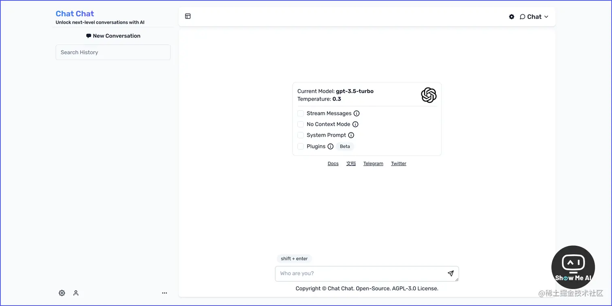
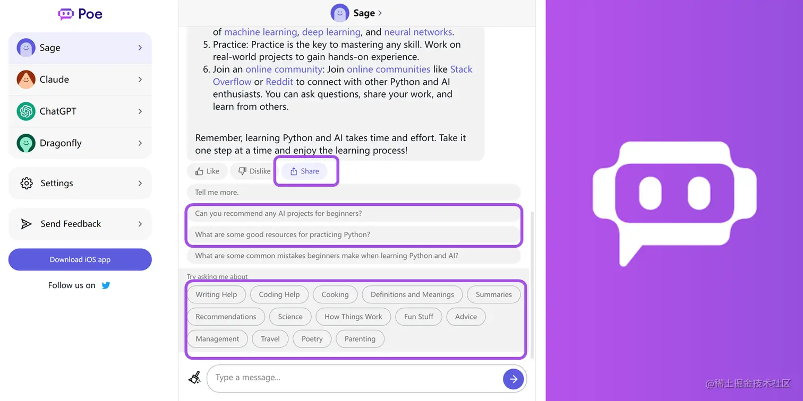

# 问答模型整合网站

## 『Chat Chat 开源啦』解锁你的下一级 AI 对话体验

[**⋙ GitHub**](https://github.com/okisdev/ChatChat) | [**官网**](https://chat.okisdev.com/)

Chat Chat 可以使用 OpenAI、微软 Azure、Claude、Cohere、Hugging Face 等多个 API，让你的 AI 对话体验更加丰富。

此外，Chat Chat 还支持 Plugins，可以搜索内容和总结网页；并且支持分享记录，支持云端存储记录和个人设置等

## HuggingChat

[HuggingChat](https://huggingface.co/chat)

AI 平台 HuggingFace 自家的 AI 聊天页面，底层可以配置不同模型，免费使用。

## 🤖 Quora Poe整合多家AI模型，重新定义 AI 问答社区

Quora（美版知乎）作为问答式社区的鼻祖在，在22年12月就推出了 AI 产品 🌏[**Poe 移动端 Beta 版**](https://techcrunch.com/2022/12/21/quora-launches-poe-a-way-to-talk-to-ai-chatbots-like-chatgpt/)，近期终于上线了 🌏[**Poe Web 端**](https://poe.com/)。

Poe 整体类似 ChatGPT 的对话机器人，目前有 4 个机器人 Sage、Cloude、ChatGPT 及 Dragonfly，并在不断增加新的聊天机器人。**这些机器人的 AI 能力分别来自 OpenAI、Anthropic 的 Cloude 以及其它一些 AI 模型，算是目前整合各家 AI 模型推出的一款产品**。

在 Poe 里进行问答，**它会在回答的答案里标注出很多关键词，就像网站文章里的链接一样，你可以点击进一步了解**，这体验已经和现在的 Quora 甚至维基百科非常类似了。

此外，Poe 尝试把社区做在了对话里，在完成问答后的下方，不仅给出了备选的延申问题，**还给出了与当前主题相关度不高的其他话题**，并且支持对问答内容进行**点赞、分享到 Poe 内部社区或外部社交平台**等操作，打通了社交关系链。

> 和很多其它类似 ChatGPT 套壳产品不同，Poe 不需要你有 OpenAI 账号，也不需要提交 API Key，直接下载注册即可用，账号会和你的 Quora 账号关联。**目前是完全免费的**。
