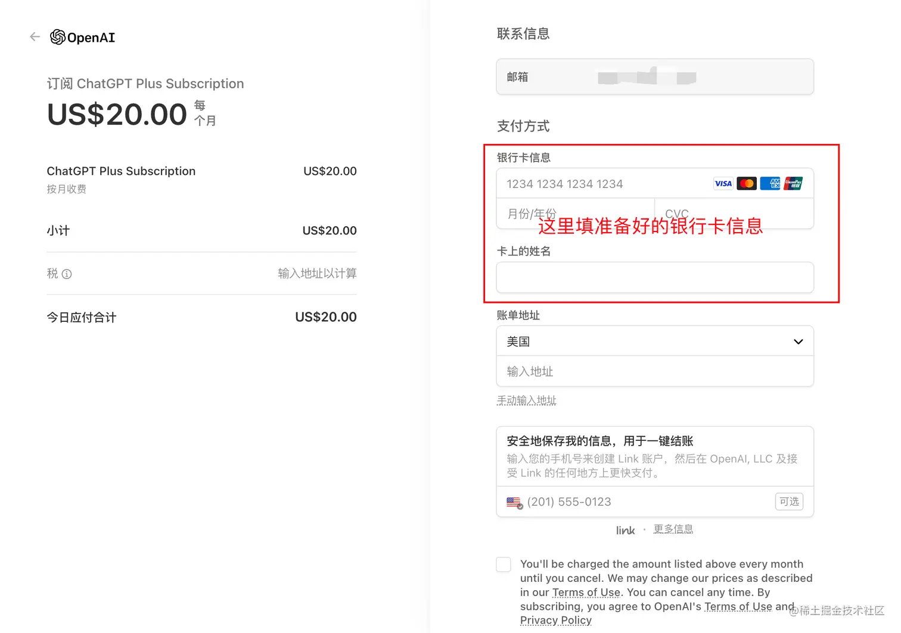
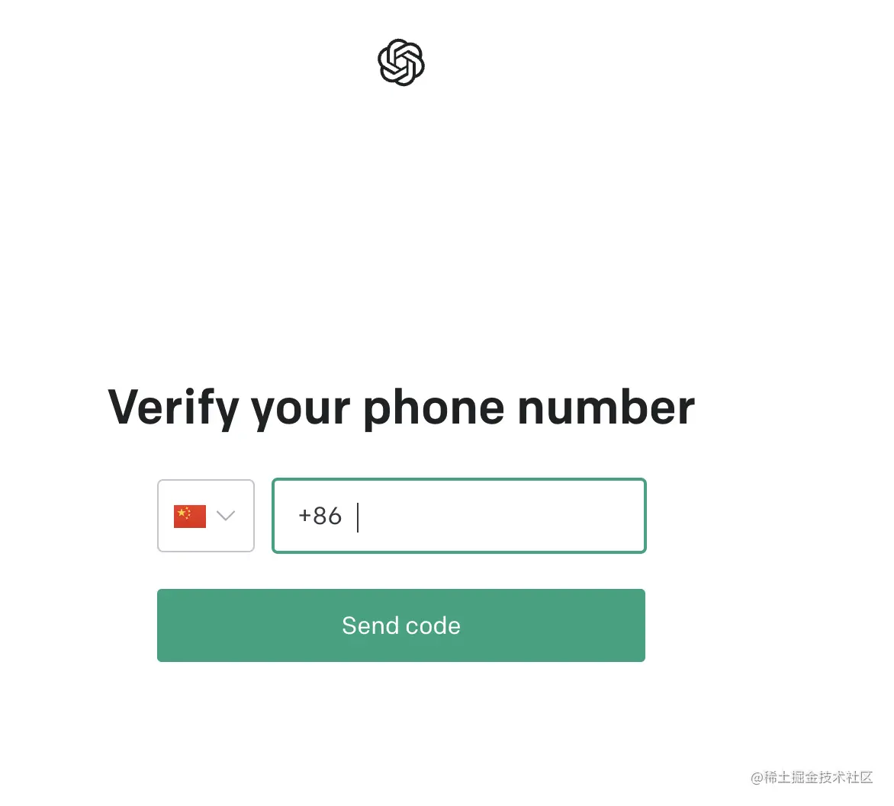

# ChatGPT注册

参考：[ChatGPT怎么注册，ChatGPT注册最全图文操作流程讲解！一篇教程就够了！ - 水源工具箱 (1144.net.cn)](https://www.1144.net.cn/?id=55)

【【呕心沥血】小白也能懂的ChatGPT注册+GPT Plus开通宝藏教程（涵海外手机号注册+虚拟信用卡申请】https://www.bilibili.com/video/BV1ph4y1Q7um?vd_source=36c9491a7fa2ab8a22ca060af01b7472

[亲测验证2023/09/06如何100%成功注册ChatGPT账号方法教程 - 不过了了Blog (butnono.com)](https://www.butnono.com/chatgptsignup.html)

## 准备工作

1. 准备一个可以科学上网的魔法工具，挂个代理：日本、新加坡或者美国，建议新加坡；温馨提示：香港节点无法使用。
2. 准备一个国外手机号，GoogleVoice 虚拟号会被识别，亲测不行，需使用特定**平台**接收；
3. Chrome 或者Edge 浏览器或者其他的浏览器, 这样可以同时登陆多个账号

## 相关网址

- OpenAI官网ChatGPT注册地址：https://chat.openai.com/
- 邮箱注册地址：
  - Gmail注册：https://support.google.com/mail/answer/56256?hl=zh-Hans
  - Outlook注册：https://outlook.live.com/mail/0/
- 手机验证码：
  - 海外手机号申请：https://sms-activate.org/cn
- 虚拟信用卡：
  - Depay官网：[Depay](https://www.dupay.one/)
  - Nobepay官网：https://www.nobepay.com/   邀请码：C8154E0
  - Dupay需要下载APP：https://www.dupay.one/zh-cn/index.html

## 注册和使用注意前提

随着使用人数越来越多，openai官方更新了更严格的账号注册和使用政策，如果出现同一IP批量注册，共享IP多人登录，就可能出现IP被封，无法注册、登录，甚至封号等情况。

一个纯净的独享的IP去注册使用，这样可大限度规避官方的审查。

## 科学魔法上网工具

购买服务器搭建神秘力量工具

打开神秘力量上网工具，要走全局代理，不然也会被定位到国内不能使用。

## 美区商店App Store充值

无需绑定国外信用卡直接购买美区 Apple ID、Google Play、Spotify、Hulu礼品卡

**教程：【支付宝可以给美国 App Store 充钱了！无需绑定国外信用卡直接购买美区 Apple ID、Google Play、Spotify、Hulu礼品卡】** https://www.bilibili.com/video/BV1Fe411w7gG/?share_source=copy_web&vd_source=36c9491a7fa2ab8a22ca060af01b7472

冲礼品卡，Apple ID被封停是因为你登陆iCloud了，敢登iCloud光速封号，最好不要登陆iCloud，去商店登陆；封了找苹果客服就可以，外区的号国内客服也给解决

只登App Store一点事没有，我现在iPad上还用着美区ID的商店，而且国区App也能正常更新。

我是正规号，中转美，目前一切购买包括内购都没问题

美区ID是用163邮箱注册的，去tb上买的礼品卡充值，一直用的好好的没什么问题。

重新注册了个外服apple id，结果礼品卡充了两刀没法内购，然后我就打了两次苹果美区客服，然后昨天晚上两点多，打过去让我重新试了一下，就购买成功了

长期正常使用的话登陆iCloud也没啥，我现在主力美区账户（为了提前试一下高级加密），一直没有问题

不是充钱了不能登，而是一直不能登，这种外区的账号，除非你是完全自己注册，有自己的住址有自己的银行卡或者他注册时要求的各种信息，简单点说就是你在国外生活，不然一旦登陆要是出现什么状况把你的iCloud一锁，你没有足够的信息证明你这个外区账号完全属实，就解锁不了你的手机就直接变砖，而且像很多人买的那些一人一号的账号几乎都是批量注册的，登陆iCloud几乎必锁，更不要说那些多人共享用来下软件的账号。设置里iCloud自己账号登着能证明手机是自己的，登其他的就是手机是其他账号的人的，自己注册的外区没有真实信息也很难解锁，跟房子一样，iCloud就像房产证上的名字，写你名字就是你的，写别人的对不起房子归别人，自己假信息注册的也对不起没有这个人但不是你的。差不多你这么理解。再说你要把别人账号登iCloud干嘛，从app store推出登其他的账号不就能下载吗，别用这个满足好奇心

美区苹果官网买礼品卡可以直接用银联卡，最安全的方法

## 手动批量注册ChatGPT账号(网上卖账号的就是这个方法，稳定不易封号)

其他相似文章：[⁢国内升级ChatGPT Plus保姆级教程 - 飞书云文档 (feishu.cn)](https://wvjj4la592.feishu.cn/docx/BWL5d5xUmoryt3xrK9lcxZCUnHb)

### 前言

ChatGPT 3-4月份后封号热潮，那面对大面积的封号，有没有什么办法可以避免？

### 准备

- 个良好的梯子(建议使用 OpenAI 官方支持地区的原生 IP 地址，否则后续使用可能出现封号和回答不连续等各种乱七八糟的问题)
- 一个支持的邮箱 (QQ 和163 等国内邮箱不支持，建议使用国际 Gmail 邮箱)
- 一个国外手机号 (中国地区手机号不支持，建议使用美国实体卡号码)

### 注册前置准备

- 域名（用于批量无限制注册，且不会封号）
- 国外手机号接码平台（用于接收注册验证码）
- depay（虚拟信用卡，用于升级 ChatGPT 会员）

### 域名用作域名邮箱

#### 1、域名说明

中国国内的邮箱账号通通都无法注册openai

例如：QQ邮箱、网易邮箱——126、163、Foxmail 等邮箱都注册不了。

所以我们需要一个网站域名，用域名来作 **域名邮箱**：使用域名注册的邮箱。

————————————————————————————————————————————

例如：<t@hjxem.vip>，就是一个域名邮箱，并且@符号前面的字符可完全自定义。

使用域名邮箱有以下几个优点：

1. 专业：使用自己的域名作为邮箱地址，可以让你看起来更专业。
2. 灵活：域名邮箱可以使用多种不同的邮件客户端，例如 Outlook、Thunderbird 等，可以根据自己的需求选择合适的邮件客户端。
3. 安全：域名邮箱通常提供更高级别的安全保护，例如 SSL/TLS 加密等。
4. 可扩展：域名邮箱可以方便地添加邮件账户，例如注册微信公众号、微信小程序、微信公众平台都需要不同的邮件账户。

可以无限制的注册微信小程序账号啥的，也可以无限制注册 ChatGPT 账号且防封。

#### 2、使用自己的域名作 域名邮箱

以网易免费企业邮箱为例，演示搭建域名邮箱的正确姿势。

也可以使用其他企业邮箱或者国外免费邮箱，如 proton.me，web.de

##### 2.1、注册网易企业邮箱

注册地址：[ym.163.com/](https://ym.163.com/)

填写注册资料

注册成功之后，会收到一条短信，包含账号，密码

打开 [mailhz.qiye.163.com/](https://mailhz.qiye.163.com/) 输入短信里面的账号密码进行登录，登录成功之后，会提示开启二次认证，选择手机短信验证就可以了

按照提示重置密码

##### 2.2、验证域名所有权

登录成功之后，进入管理后台

然后点击组织架构菜单下面的域名管理

可以看到，咱们的域名 `hjxem.vip` 正在等待验证。那咱们现在就进行验证，点击上图红框所属的这一行，进入到验证页面。

进入到验证界面之后注意以下这两个值，接下来的步骤会用上:

三个配置值需要使用：

- 记录类型：TXT
- 主机记录：mydomain
- 记录值：`上面复制到的那个记录值`

##### 2.3、域名解析

首先，在阿里云控制台的域名服务中找到你的域名：如：hjxem.vip，进入域名解析页面

##### 2.4、添加解析记录

在域名解析页面中，添加一条新的记录

接下来填写如下信息，先以显性 URL 为例配置邮箱：

- 记录类型：显性 URL
- 主机记录：em
- 记录值：类型选301，填写：`hjx个人邮箱`

配置好之后，咱们就耐心的等待验证结果就好了，一般十分钟左右就可以了，验证结果将以邮件和短信形式通知到咱们。

##### 2.5、验证 DNS 的 MX 记录

下面所有操作都是在阿里云域名解析界面完成

添加 CNAME 记录：

- 记录类型：CNAME
- 主机记录：mail
- 记录值：mailhz.qiye.163.com

添加 MX 记录：

- 记录类型：MX
- 主机记录：@
- 记录值：hzmx01.mxmail.netease.com
- 优先级：5

再添加一条 MX 记录：

- 记录类型：MX
- 主机记录：@
- 记录值：hzmx02.mxmail.netease.com
- 优先级：10

添加 TXT 记录：

- 记录类型：TXT
- 主机记录：@
- 记录值：`v=spf1 include:spf.163.com -all`

再添加一条 TXT 记录：

- 记录类型：TXT
- 主机记录：_dmarc
- 记录值：`v=DMARC1; p=none; fo=1; ruf=mailto:[dmarc@qiye.163.com](https://link.juejin.cn?target=mailto%3Admarc@qiye.163.com); rua=mailto:[dmarc_report@qiye.163.com](https://link.juejin.cn?target=mailto%3Admarc_report@qiye.163.com)`

总共算下来，你需要添加如下 6 条记录：

之后回到网易邮箱配置界面：

直接点确定就好了，让他立即生效：

之后就可以使用新域名邮箱登录啦！

而且还可以前往组织机构管理页面添加账号，想加多少就加多少，再也不用担心注册微信公众平台不够邮箱了。

### 开始注册

有了域名邮箱配置好了之后，打开openai 官方ChatGPT注册地址：[chat.openai.com](https://chat.openai.com)

#### 3、接码平台SMS-Activate

推荐这个接码平台，价格还算优惠，还稳定：[SMS-Activate是在线接受短信的虚拟号码服务](https://sms-activate.org/cn/)

这是一个域外站点，可以支持 facebook, 手机号，邮箱等账号的租赁，当然除付费的话，也有免费的域外手机号，这个大家就不用试了，已经被用烂了，gpt屏蔽了那些免费的手机号

备注说明：**收码平台是需要注册的，收码也是需要付费的，最低需要充值2美元，可以通过支付宝付款。机场也是付费软件，价格在20元左右。**

首先打开网站地址：[SMS-Activate是在线接受短信的虚拟号码服务](https://sms-activate.org/cn/)，注册一个账号

使用邮箱注册 注意：邮箱建议选用google、outlook、网易163、QQ等邮箱，收不到确认邮件的建议在垃圾邮件看一下。

注册登录之后继续下面↓

接下来就是需要充钱了

这里支持的支付方式非常多，并且支持支付宝充值，还是很方便的。那我们就用支付宝充吧。

最低充值金额 2 美元，然后加上手续费，大概是 14 元人民币左右。它会帮你折算成卢布（150p左右），用于账户等购买

如果需求量大的话，建议充值 10 美元，不需要手续费。

##### 购买手机号

充值完成之后，在左边的服务列表中找到 OpenAI

或搜索：openai，选择使用该项目的号码

**注意**：加入购物车购买的手机号只有20分钟接收验证码时期，过了就没了

点开之后可以选择各个国家的手机号

**这里有个小技巧**：如果你一直用同一个国家的手机号注册大概率会在第三个开始就收不到验证码了（具体原因不明），那我们可以用一系列国家（亚洲国家除外）为一个轮询，交替注册，我用的最高金额的就是 30 卢布的。总体平均成本控制在25卢布左右。

不同国家的手机租的费用是不同的，大家需要关注一下，这里列举一些支持的国家列表，都是亲测可用且便宜实惠的：

- 肯尼亚
- 罗马尼亚
- 哥伦比亚
- 吉尔吉斯斯坦
- 巴拉圭
- 巴西
- 阿根廷
- 菲律宾
- 立陶宛
- 拉脱维亚
- 阿尔巴尼亚
- 阿尔及利亚
- 安道尔
- 安哥拉
- 安提瓜和巴布达
- 阿根廷
- 亚美尼亚
- 澳大利亚
- 奥地利
- 阿塞拜疆
- 巴哈马
- 孟加拉国
- 巴巴多斯
- 印度尼西亚

例如，我们以肯尼亚为例，点击购物车就直接购买成功了

复制一下这个号码

把号码粘贴至 OpenAI 注册输入框，注意：**与前面识别代码相同的数字需要去掉**。

删除之后，就可以点击 Send code 了

回到接码平台，一般1分钟内就可以收到验证码了。

注册成功之后，可以前往 [OpenAI 开放平台](https://platform.openai.com)查看免费 API KEY 的使用额度，可以看到，有 5 美元，美滋滋。

#### 4、Depay 虚拟卡

ChatGPT Plus 订阅不支持中国内地信用卡和借记卡，在中国开的 VISA 和万事达都无法正常给ChatGPT Plus 以及 ChatGPT API 支付。

`ChatGPT Plus` 版本购买需要美国信用卡，可以有更快的速度以及体验最新的模型（比如现在的 ChatGPT 4）

所以必须使用国外信用卡，这里推荐 [Depay](https://www.dupay.one/)。

首先注册一个 Depay 账号，[点击注册 Depay 账号——dupay.one/web-app/Register](https://www.dupay.one/web-app/Register)

注册很简单，扫描下面的二维码，使用邮箱或者手机注册即可

手机上注册：

- 下载 `Depay App`，苹果需要美国账号去 `APP Store` 下载，用安卓设备会比较方便。(进去后可以切换语言为中文)
- PC、手机端都能翻墙

用刚刚注册的账号和密码登录 Depay APP 然后继续下面操作

————————————————————————————————————————————

接下来需要开卡：

进入 Depay APP 点击界面左上角的“申请卡”，开通虚拟信用卡。

开卡的时候可以选0开卡费的，也可以选 10USDT 开卡费(一次性)的，区别是：

- 0开卡费：需要你完成 KYC 认证，通俗点说就是需要你上传身份证(国内身份证没问题)或者护照认证
- 10USDT：如果你暂时不想上传自己身份证或者护照实名的话，可以先选10USDT开卡费的

高级卡、白金卡等有 10U 和 50U 的开卡费，自己决定要不要开通，区别在于月费、手续费和额度。

| Master卡片等级 | Lite卡      | 标准卡      | 高级卡     | 白金卡      | 黑金卡                |
| -------------- | ----------- | ----------- | ---------- | ----------- | --------------------- |
| 开卡费         | 10 USDT     | 0 USDT      | 10 USDT    | 50 USDT     | 活动空投/邀请20人开卡 |
| 月费           | 2 USDT      | 1 USDT      | 0.5 USDT   | O USDT      | 0 USDT                |
| 卡片额度/月    | 20000  USDT | 20000  USDT | 50000 USDT | 200000 USDT | 500000 USDT           |
| 卡片充值手续费 | 2%          | 1.35%       | 1.2%       | 1%          | 0.8%                  |

开通后不要急着注销，因为注销了后再开卡要 10U 开卡费，你后面**充值 ChatGPT Plus** 还是需要用的，建议是把 Depay 卡当做普通的信用卡用。

————————————————————————————————————————————

以上步骤完成之后，就可以充值了。

注意：Depay 是不接受支付宝或微信转账的，需要充值 USDT加密货币，所以需要自行从第三方购买币种；也可以充值美刀

充值 USDT 加密货币：

- 需要下载欧易并 [注册](https://cnouyi.care/join/36959806)，先进行 `USDT` 充值（根据你的需要买入，买后会冻结 24h）：[cnouyi.care/join/369598…](https://cnouyi.care/join/36959806)

也可以叫朋友转USDT 加密货币给你：

比如这个教程里有：[【保姆级教程】从零开通ChatGPT Plus - 掘金 (juejin.cn)](https://juejin.cn/post/7211409997111476280)

充值 USDT加密货币总结：可以注册一个欧易账号（大致流程：点击欧易 App 首页——我要买币——快捷买币——选 USDT——购买至少23USDT(大概￥200)——支持支付宝、微信或者银行卡购买）。

————————————————————————————————————————————

充值成功之后，USDT是放在钱包里面的，无法直接使用。

这时我们需要把接收到的 USDT 转成美元，然后充值到虚拟卡账户里面。

操作步骤：“钱包”-“实时兑换”。

将所有的USDT都兑换成USD美元。

兑换为美元后，点击Depay App首页的To Card，将兑换的USD美元存入卡中，到此，Depay充值大功告成。就可以激活卡了。

**📢📢📢注意**
需要注意的是，新注册的欧易用户默认完成身份认证后，需要等待24小时才可以提现，如果你着急提现到Depay，你也可以私信找我代充，按照汇率1:8收点劳务费。一般不是很急的话建议24小时就行，不必花这冤枉钱。

银行卡这边一切都就绪了，记住几个重要的信息分别为：卡号，到期时间(格式：02/26)，CVV安全码。OpenAI绑定信用卡填写的内容是卡号 有效期 04/26 CVV码 美国邮编

恭喜你，现在你成功拥有了一张专属的海外信用卡，接下来你可以：

- 购买 Plug 体验 ChatGPT-4：登录进入：<https://chat.openai.com> 点击左下角的 Upgrade to Plus 即可
- 绑定 OpenAI信用卡：登录进入 [platform.openai.com](https://platform.openai.comaccount/billing/payment-methods) 选择 Payment methods 填写信用卡即可

—————————————————————————————————————————

**ps：据说招行的visa信用卡也可以支付，有条件的可以尝试下**

—————————————————————————————————————————

#### 5、升级ChatGPT Plus

接下来打开 ChatGPT Plus 升级界面。

一些群友反馈没有出现这个升级的选项，记得把IP切换到美国再重新登陆，现阶段只有美国的IP才会有这个选项，(升级的时候需要美国IP，升级完毕后不要求)。

**另外，切记切记——**：

1. 使用其他网络，一定要用美国或者欧洲IP，但不要用那种很多人使用的代理，容易失败。如果你自己的代理被别人污染了。
   1. 查看是否是美国或欧洲的IP：[en.ipip.net/](https://en.ipip.net/)
   2. 或者这个网站：<https://whoer.net/zh>
   3. 测试一下IP 的纯洁度：<https://scamalytics.com/>

2. 浏览器开启无痕模式
3. 如果1、2都做了还是失败，那么尝试清空浏览器缓存，重新登录ChatGPT再尝试。如果还是不行，那么建议更换你目前在用的代理节点再试，直到成功。

接下来按表单填写银行卡信息即可

下面重点讲一下如何填写一个有效的账单地址。

账单地址我们可以使用一些美国地址生成器，直接生成一个免税州的账单地址，有很多州都是需要收稅的。

日本地址生成：[www.meiguodizhi.com/jp-address](https://www.meiguodizhi.com/jp-address)

英国地址生成：[www.meiguodizhi.com/uk-address](https://www.meiguodizhi.com/uk-address)

美国地址生成：[www.meiguodizhi.com/](https://www.meiguodizhi.com/)

推荐使用的是：<https://www.meiguodizhi.com/>   这个工具来生成的账单地址。

> 美国有5个州免消费税，分别是：
>
> 俄勒冈州（Oregon）
>
> 阿拉斯加州（Alaska）
>
> 特拉华州（Delaware）
>
> 蒙大拿州（Montana）
>
> 新罕布什尔州（New Hampshire）。

进入网站之后，可以自己输入一个城市来进行生成。例如，我使用 Oregon 来生成一个地址：

然后，把这些地址信息复制到注册表单里面就 OK 了。

**这里做个小提示**：很多人在订阅的时候被提示“信用卡被拒绝”，首先这并不是 Depay 卡的原因，请仔细检查你的IP地址（IP建议使用美国免税的地区IP），如果试了3次还没有订阅成功，那么请不要再试了，再试你的 ChatGPT 账号可能就要被限制订阅了。

### ChatGPT Plus初体验

看到PLUS的尊贵标识，就说明你已经成功开通ChatGPT Plus了。

每个月大概不到￥150，也就3杯星巴克的钱，换来的是一个高效的信息获取渠道，不亏，是一个跨时代的生产力。

至此，恭喜您，已经成为了尊贵的ChatGPT Plus用户，成为全球走在时代前沿的人了。从现在起，访问ChatGPT Plus就拥有Default和Legacy双模型回答，以及快速、稳定的AI回复。

### 其他接码平台

GrizzlySMS.com 是一个来自俄罗斯的临时手机号码接码服务，该服务有别其他的短信接码平台，提供的是短期号码，由于是短租所以价格比较便宜，平台显示的金额均为卢布。

适合短期用短信接码来进行平台注册的用户，购买一个号码的有效期是 20 分钟。

**官网：**[**https://grizzlysms.com**](https://grizzlysms.com/)

Grizzly SMS 的短信接码服务为客户提供了批量购买虚拟手机号码的方案，以注册各种流行平台的账户。网站支持 API 接码，可在几分钟内完成批量账户注册。此外还提供了一次性短信激活服务便于零售客户。

目前 Grizzly SMS 提供来自 190 多个国家和地区的手机号码（如瑞典、法国、俄罗斯、美国、德国、香港、印尼、马来西亚、越南、柬埔寨、菲律宾等）。

支持下列平台：Telegram、YouTube、Gmail、Facebook（脸谱）、Instagram、TikTok（抖音）、Discord、Line、KakaoTalk、Tinder、Nike、Naver、POF、Line、Amazon、WhatsApp 等。

充值余额的方法包括：国际银行卡、Qiwi、Payeer、USDT（加密货币）、支付宝等。

说明：接码平台均搜集整理自互联网，无法保证绝对好用。特别付费接码平台，充值前一定要先看一下平台是否还活跃，有展示官方群的一定加一下，看看他们是不是还在正常运营。请勿用于非法用途，非法产生一切后果与本站无关。

现在短信验证码认证已经是各大网站普遍使用的一种验证方式了，所以接码平台应运而生。

解码平台是将手机号码共享给大家使用，可以用来接收验证码进行注册账号等操作。

**国内免费接码平台（注意甄别）：**

| [免费在线接收短信](https://www.goinsms.xyz/) | [免费临时邮箱](https://www.suiyongsuiqi.com/zh/mail/) | [在线短信接收](http://www.114sim.com/)   | [极速接码平台](https://smsjisu.com/) |
| -------------------------------------------- | ----------------------------------------------------- | ---------------------------------------- | ------------------------------------ |
| [云际云短信](https://yunjisms.xyz/)          | [小鸟接码](http://www.xnsms.com/)                     | [有信云短信接收](https://www.zusms.com/) | [接码号](https://jiemahao.com/)      |
| [免费接码平台](https://www.zsrq.net/)        |                                                       |                                          |                                      |

### 后续使用问题

#### 1.使用 Chatgpt 的时候，经常被锁中国区 ip 怎么解

上面我们遇到一个问题，虽然我们注册好账户以后，因为客户端 ip 在中国，不被chatgpt支持，所以被锁了，但是我们仍然有解法可以使用。在介绍解法之前，我们先了解一下chatgpt 的两种形式，目前市面上所有的公众号等提供的 chatgpt 无非都是通过这两种形式来接入的。

- fetch 请求，这种会通过请求接口的方式来与 gpt 联动，将暴露客户端的 ip，这也是 web chatgpt的实现方式
- 库接入，这种只提供 openapi key（账户鉴权 key)

也就是说，我们在页面中使用的时候，因为客户端 ip 被检测到地域，所以不能进行后续的操作，我们可以通过用虚拟 ip 的方式来解决（这里不赘述），也可以选择用第二种方式使用 gpt

这里不需要我们实现任何服务，因为现成的插件实在太多了，这里推荐 vscode 中的 extensions，可以搜索 chatgpt，安装下面这个插件

安装完成后在左边的扩展中会多出一个选项

点开后，如果你还没输入 openapi key，你需要先生成一个并填入，大家打开[platform.openai.com/account/api…](https://platform.openai.com/account/api-keys) ，用我们之前注册好的账号登录一下

我们生成一个 openapi key，并且填入（这里的 key 最好保存一下，因为 hash 后面就看不了了，只能重新生成），接着我们就可以和 C 老师愉快开始交流了

#### 2.如何取消ChatGPT Plus的自动订阅？

> 上面说过，我们的Depay信用卡其实没有透支功能，只是相当于借记卡，理论上说只要你不往卡里充钱，其实不必担心下个月被扣款。不过，保险起见，你还是可以取消自动订阅，方法是：
> 打开ChatGPT首页并登录——左下角——My Account——Manage My Subscription——Cancel Plan

#### 3.ChatGPT Plus中的default mode和legacy mode有什么区别？

> default mode就是Turbo mode，它会更有情感和活力，会有趣一些，不过回答上偏更加简洁，省去了之前legacy mode一些细节。
> legacy mode则更适合学术论文，不像Turbo Mode回答那么大众，适合科研，论文。
> 更详细的比较可以参考：[www.reddit.com/r/ChatGPT/c…](https://ChatGPT/comments/111skny/the_differences_between_default_and_legacy_models/)

#### 4.为什么升级到ChatGPT Plus需要这么麻烦？

> 这个问题归根结底是因为openAI不支持PayPal充值，大家没事就写 e-mail给openai的ceoSam Altman(国人喊他奥特曼)，让他早点支持支持payPal吧。

#### 5.升级ChatGPT Plus每个月$20值不值？

> 这是一个仁者见仁智者见智的问题，你觉得值它就值，你觉得不值，就尝试下取消续费就好。不过，应该没人会拒绝更优越的生产力吧？

## ChatGPT个人单个号注册方法(以官网登录的邮箱为例)

除了可选邮箱可以使用国外注册的邮箱，如谷歌邮箱或其他企业邮箱或者国外免费邮箱，如 proton.me，web.de

其他跟【手动批量注册ChatGPT账号】的 [开始注册] 栏一样流程

### 注册 Gmail 邮箱账号

> Gmail是由Google提供的免费电子邮件服务

**Gmail邮箱注册：网络通畅以后，建议你注册个Gmail邮箱，邮箱注册地址是：**[**https://mail.google.com/**](https://mail.google.com/) 

Gmail邮箱注册：https://support.google.com/mail/answer/56256?hl=zh-Hans

上面我们提到中国区邮箱是不能使用的，所以我们需要用 gmail 来完成自动登录，我们首先打开 [www.gmail.com/](https://www.gmail.com/)，然后点击右上角的 create an account(创建账户）

按照自己的需求填写好个人信息后，点击下一步

电话号码和邮箱最好都填一下，google 采用两步验证，安全性会高一些，接着下一步，后续可能还会有我同意之类的按钮，正常走完即可。

所有的信息填完，会跳转到个人页，并且右上角可以看到用户信息

点击右上角我们还可以进行账户的切换，也许你可能会有多个 google 账号，这个大家可以先不用关注，顺手一提

##### 回到 chatgpt 的注册页面注册

然后我们这一步就完成了，我们回到 chatgpt 的注册页面 [chat.openai.com/auth/login](https://chat.openai.com/auth/login), 点击 log in

点击 continue with google，选择刚注册账号，并完成登录流程

紧接着，它会要求我们输入姓名，并用手机号验证

到这一步我们这一 part 就完成了，我们开始租一个 chatgpt 允许的国家手机号用于验证码获取

### 注册 Outloo 邮箱账号

- Outlook注册：https://outlook.live.com/mail/0/

### 苹果邮箱

## 脚本或者软件批量注册ChatGPT账号(不稳定，易被封号)

### 步骤1：创建批量注册账号的Excel表格

首先，在电脑上打开Excel软件，在新表格中创建以下列：姓名、用户名、电子邮件、密码。确保在每列下方都有足够的空间，以便填写信息。

### 步骤2：填写注册账号信息

现在，填写你需要注册的ChatGPT账号信息。

可以选择随机生成用户名和密码，或者使用自己设置的用户名和密码。同时，一定要确保填写正确的电子邮件地址，因为ChatGPT需要验证该地址。确认所有信息都准确无误后，保存Excel表格。

### 步骤3：安装多账号注册工具

为了实现批量注册ChatGPT账号，需要下载一款多账号注册工具。这类工具可以帮助用户自动填写表格中的信息，并模拟登录ChatGPT进行账号注册。

目前市面上有很多 多账号注册软件工具可供选择，其中比较常用的有：

- AMR：
- ZennoPoster：
- GhostBrowser：

脚本：

- 待定
- 待定

在选择适合自己的注册工具之前，一定要确保该工具支持ChatGPT注册。

### 步骤4：设置多账号注册工具

启动注册工具后，进入设置界面，按照提示输入ChatGPT网站地址和所需注册的账号数量。

然后，将Excel表格导入到注册工具中。在导入Excel表格时，一定要注意选择正确的表格，以免出错。

### 步骤5：启动并等待

设置完成后，启动多账号注册工具并等待完成注册。

注册过程中，工具会自动根据Excel表格中的信息填写用户名、密码和电子邮件等信息，并模拟登录ChatGPT进行账号注册。

注册完成后，工具会自动将注册成功的账号信息存储到Excel表格中，以便后续使用。

### 总结

批量注册ChatGPT账号可以帮助用户快速创建多个账号，适用于团队、公司或者组织等需要在平台上推广和宣传的场合。

但是，一定要注意账号的合法性和规范性，避免因违反平台规则而受到惩罚。

同时，使用多账号注册工具时，也要确保该工具的安全性和稳定性，避免泄漏账号信息或者注册失败的情况。

## 注册常见问题

### 1.官网打不开。

**解决方法**：这是由于ChatGPT目前尚未在国内开放使用，所以大家需要注册、登录和使用的时候都需要借助“魔法”。

### 2.出现提示：Access denied。

 **解决方法**：这样的情况，大部分原因是因为官方还检测到你的IP地址在国内；可以试试以下几种方法：

**切换梯子节点，并选择全局代理**

**清除浏览器 ** **cookie**

**魔法上网梯子的问题，建议换个魔法**

**建议chrome或edge浏览器**

**可以尝试使用无痕模式**

### 3.Oops!, something went wrong；

**解决方法**：和上边的原因是一样的，可以试下 2 中提到的方法

### 4.邮箱验证收不到验证码。

**解决方法**：因为目前OpenAI官网访问客户超级多了，服务器已经过载了。建议稍晚些再试，或者换个浏览器：Chrome或Edge浏览器。

### 5.出现提示：Too many signups from the same IP。

**解决方法**：可能是因为多次重定向了（有可能是频繁点击注册按钮），也有可能是当前使用的节点被太多人重复使用。建议切换下节点并打开全局代理。

### 6.出现提示：Thanks for submitting the form, you'll be notified when we're ready for you to try ChatGPT。

**解决方法**：可能是目前ChatGPT官网访问过载了，用的人太多了，需要稍晚些再试。

### 7.SMS接收不到验证码。

**解决方法**：这个有可能虚拟号码有问题，不太稳定，比如印度号码一到晚上就不好用；也有可能是使用的客户较多，服务器繁忙。只能多试几次

### 8.出现提示：Error 429, You are being rate limited。

 **解决方法：**这个问题比较少见，但是利用 2 中方法应该可以解决的。

### 9.出现提示：OpenAI's services are not available in your country。

**解决方法**：这个一般是因为网络环境的问题，需要切换梯子节点，如果多次切换还不行的话，建议换个“梯子”

### 10.出现提示：Signup is currently unavailable, please try again later。

**解决方法：**可以试下 2 中提到的方法。

### 11.出现提示：The site owner may have set restriction that  prevent you from the site。

   **解决方法：**这个是因为IP多次使用，被检测出有问题，可以试下 2 中提到的方法。

### 12.出现提示：Too many requests in 1 hour.Try again later。

**解决方法**：这个因为目前官网访问过载了，用的人太多了，需要稍晚些再试。

以上所有问题解决以后，会出现以上界面，说明可以正常登录了；

不过随着用户数量的增加，服务器压力增大，普通账户的增加了限制次数和时间，请之后再尝试。如果想彻底解决的话可以尝试开通Plus账户吧。

此外还有个小技巧就是: 可以多注册几个账号, 这样成本更便宜, 次数用完了再注册一个。

 缺点是: 调教完了的账号, 次数用完了,再注册, 需要重新调教.
