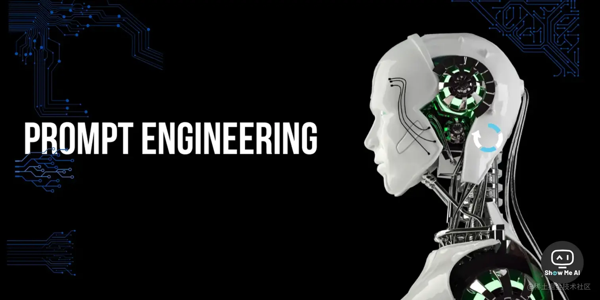
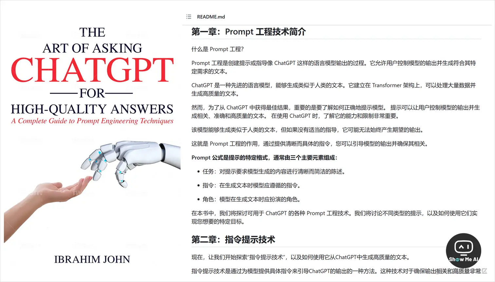
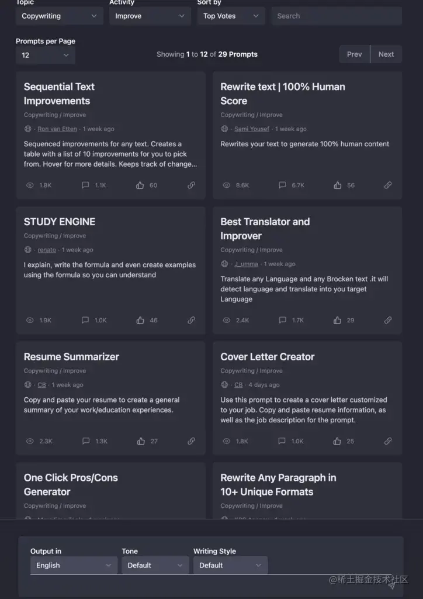
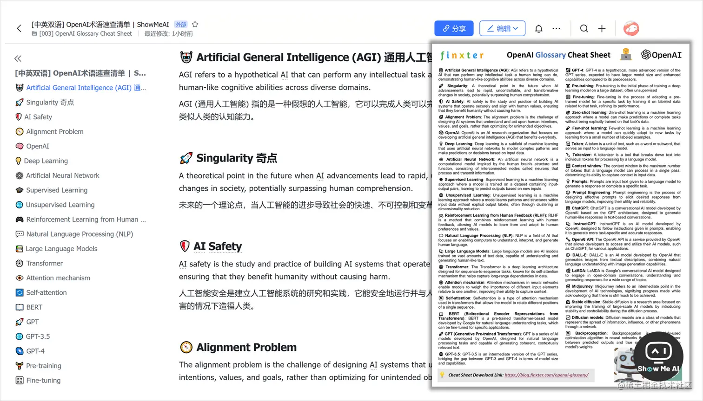
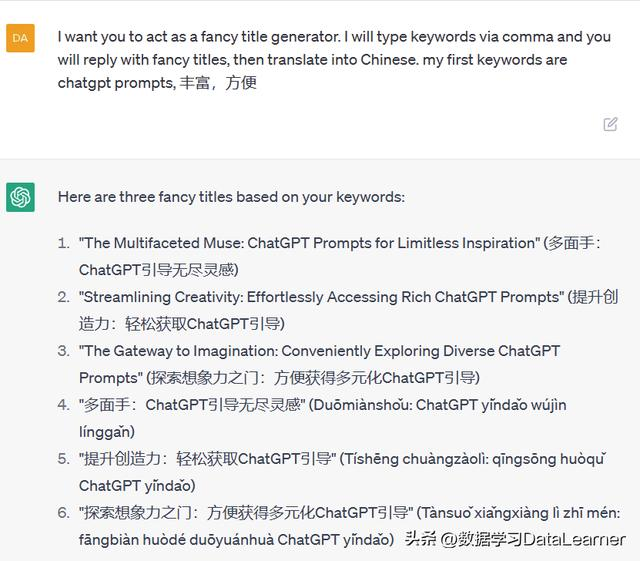
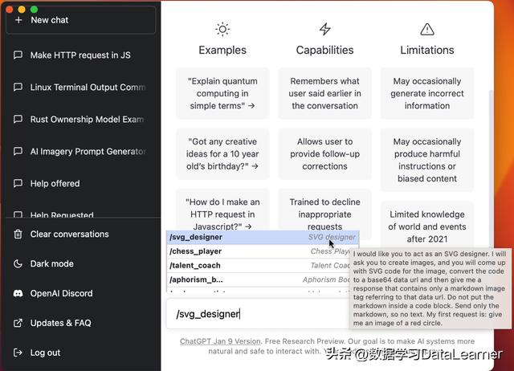

# ChatGPT的Prompts指南

## 人工智能和提示工程的入门电子书：《提示工程入门》

地址：[提示工程指南 | Prompt Engineering Guide (promptingguide.ai)](https://www.promptingguide.ai/zh)

## PromptPerfect

[PromptPerfect](https://promptperfect.jina.ai/)：专为生成式 AI 优化输入提示（prompt）的工具

## Full ChatGPT Prompts + Resources』目前最完整和有效的 ChatGPT 资源库

🌏[**Full ChatGPT Prompts + Resources**](https://enchanting-trader-463.notion.site/Full-ChatGPT-Prompts-Resources-8aa78bb226b7467ab59b70d2b27042e9) 来自 🌏[**推特@Barsee**](https://twitter.com/heyBarsee) 的分享，包含 700 AI工具、浏览器插件、网站创建工具、几十篇 ChatGPT 干货。资料非常丰富的资源并持续维护中~

1. **300+ Best Prompts to Unleash full ChatGPT’s Potential**

> - 700 AI Tools
> - Copywriting
> - Business
> - Email
> - Marketing
> - Brainstorm any idea
> - Talk to any expert
> - Publish Books
> - Create Visuals
> - Cooking
> - Landing Page
> - More prompts techniques
> - Marketing Psychology
> - Travelling
> - Life Hacks
> - Learn Anything
> - Youtube Videos Ideas
> - Facebook Ad Copy
> - Provide info Prompts
> - Prompt resource video
> - Education
> - Art
> - Health
> - Coding
> - Screenwriter
> - Storytelling
> - Discover Best prompts
> - How to write advanced ChatGPT Prompts in seconds

1. **Insanely useful ChatGPT Chrome Extensions**

1. **Create full website with ChatGPT and Midjourney**

1. **More Resources for ChatGPT**

> - All the best example of ChatGPT
> - Predict 2023 with AI
> - Awesome ChatGPT Prompts
> - Supercharge your ChatGPT Prompts
> - My 7 favorite AI Tools
> - How to use ChatGPT in copywriting
> - How to design with ChatGPT
> - How to use ChatGPT to save thousands of hours
> - How ChatGPT will impact your business
> - AI assistant for spreadsheets
> - How to build your own product with ChatGPT
> - A ChatGPT chrome extension to write tweets
> - 11 ways you can use ChatGPT to write your own code
> - How to create mind-blowing Visuals with ChatGPT
> - Access ChatGPT from anywhere on the web
> - ChatGPT for writing in 2023
> - ChatGPT on how to write code with knowing how to write code
> - How to create youtube videos with ChatGPT
> - Here’s how we’ll use ChatGPT at work in 2023
> - How to build a mighty web scraper in less than 5 minutes with ChatGPT
> - How to use ChatGPT in funny ways
> - Real Danger of ChatGPT
> - How to make your SEO better with ChatGPT
> - What will CHatGPT do to education system
> - How to use ChatGPT to earn more money in 2023
> - 7 ways to use ChatGPT in fun ways
> - ChatGPT Web
> - How AI will impact you and your business
> - How to create full website with AI
> - How to use ChatGPT for Beginners
> - ChatGPT for Search Engines Extension
> - ChatGPT Video Generation
> - How to become expert with ChatGPT
> - Twitter Growth
> - Create Facebook and Google Ads
> - How to detect that it is written by ChatGPT
> - ChatGPT as 1940’s mobster
> - It takes $100k/day to run ChatGPT everyday
> - Know everything about movie, books characters

## 微软官方教程：提示工程技术，入门与进阶指南(中文)

 [⋙ **提示工程简介**](https://learn.microsoft.com/zh-cn/azure/cognitive-services/openai/concepts/prompt-engineering) | [**提示工程技术**](https://learn.microsoft.com/zh-cn/azure/cognitive-services/openai/concepts/advanced-prompt-engineering)

大模型发布后，Prompt设计成了下一个重点。微软官方发布了这份中文版本的「提示工程 (Prompt Engineering)」 指南。指南分为「入门」和「进阶」两个部分，帮助提升构建优秀 Prompt 的能力。

### 🔔 **提示工程简介**

> *▢* **基本信息**
>
> - 提示组件
> - 主要内容
> - 示例
> - 提示
> - 支持内容
>
> *▢* **最佳做法**
>
> - 尽量具体
> - 具有描述性
> - 强调
> - 给事项排序
> - 给模型一个「出路」
>
> *▢* **空间效率**

### 🔔 **提示工程技术**

> *▢* **系统消息**：在Prompt开头，为模型提供上下文、说明或用例信息
>
> *▢* **少样本学习**：在Prompt中提供训练样本，给模型额外上下文
>
> *▢* **非聊天场景**：目前大模型主要应用于对话生成，但也可用于非对话场景，如情感分析Prompt
>
> *▢* **从明确的说明开始**：Prompt 信息顺序重要，开头告诉模型执行任务，再提供其他上下文或示例，有助模型产生高质量输出
>
> *▢* **在末尾重复指令**：模型易受最近偏差影响，Prompt末尾信息可能比开头对输出影响更大
>
> *▢* **引导输出**：Prompt末尾包含词或短语获得符合形式的模型响应
>
> *▢* **添加明确的语法**：为Prompt添加语法 (如标点、标题等)，使输出更易解析
>
> *▢* **分解任务**：大型语言模型通常对分解为更小step的任务表现更好
>
> *▢* **使用可供性**：在模型生成可供性调用时停止生成，然后将结果粘贴回提示中
>
> *▢* **思维链提示**：分解任务技术的变体，指示模型响应逐步进行，并提出所有涉及的步骤
>
> *▢* **指定输出结构**：要求模型响应同时包含引文，有助于减少错误响应的概率
>
> *▢* **温度和 Top_p 参数**：温度参数可以设置为 0 到 ，较高的值 (如 0.7) 将使输出更随机，并产生更多发散的响应
>
> *▢* **提供基础上下文**：提供可靠答案的最有效方法之一是为模型提供数据，让它从基础数据得出响应

## 6 万字的 AI Prompt 教程

如果你不知道能拿 ChatGPT 或者其他 AI 产品来干什么；如果你不知道如何更好地使用 OpenAI 提供的 API；那本教程应该能帮到你。**这是一份教你如何更好使好地使用 ChatGPT 和其他 AI 产品的免费教程**。

在线地址：🌏 [**免费 Prompt Engineering 教程**](https://learningprompt.wiki/)

开源地址：[thinkingjimmy/Learning-Prompt: 免费 Prompt Engineering 教程 (github.com)](https://github.com/thinkingjimmy/Learning-Prompt)

分为基础篇、高级篇、技巧篇、资料 & 产品推荐四部分，详细介绍了如何使用 AI 产品等基础操作、如何开发 AI 产品、使用 AI 产品的种种技巧汇总、以及更多的使用场景。全部教程 6 万字，可谓手把手带你入门和升级！推荐推荐~

> **😎 基础篇**
>
> - 简介
> - 基础用法
> - 基本原则 & 建议
> - 基本使用场景 & 使用技巧
>
> **🚀 高级篇**
>
> - ChatGPT Prompt Framework
> - Zero-Shot Prompts
> - Few-Shot Prompting
> - Self-Condidtency
> - PAL Models
> - OpenAI Playground 使用方法
> - 搭建基于知识库内容的机器人
>
> **🗒️ 技巧篇**
>
> - 技巧1：To Do and Not To Do
> - 技巧2：增加示例
> - 技巧3：使用引导词，引导模型输出特定语言代码
> - 技巧4：增加 Role（角色）或人物
> - 技巧5：使用特殊符号指令和需要处理的文本分开
> - 技巧6：通过示例来阐述需要输出的格式
> - 技巧7：Zero-Shot Chain of Thought
> - 技巧8：Few-Shot Chain of Thought
> - 技巧9：其他
>
> **📚 资料 & 产品推荐**
>
> - 值得尝试的场景
> - 值得阅读的资料
> - 值得试用的工具

## 🤖 Prompt Engineer提示工程师最全求职手册

[Become a Prompt Engineer: A Career Designing and Crafting Prompts for Advanced Language Models - Promptstacks - GPT Prompt Engineering Community](https://www.promptstacks.com/prompt-reads/become-a-prompt-engineer-a-career-designing-and-crafting-prompts-for-advanced-language-models)

PromptStacks网站这篇长文，非常系统地介绍了如何成为一名优秀的 Prompt Engineer (提示工程师)，是一份综合的求职指南。

未来几年Prompt Engineer的需求会大幅增加，熟练掌握语言模型并善于构建交互提示，将会成为一个值得期待的新兴职业方向。

> *1*. **提示工程师的角色**
>
> *▢* 最终目标是设计创造性和逻辑性的提示，鼓励语言模型生成有趣和多样的输出
>
> *2*. **对提示工程师的期望**
>
> *▢* 充分理解模型用于的任务或应用程序
>
> *▢* 了解模型的功能和限制
>
> *▢* 设计有创造性的、多样化的提示
>
> *▢* 设计清晰简洁的提示
>
> *▢* 测试和评估模型的输出
>
> *▢* 持续改进提示的性能
>
> *▢* 意识到训练数据中的潜在偏差
>
> *▢* 与其他岗位员工合作
>
> *▢* 了解机器学习、自然语言处理，掌握编程技能
>
> *3*. **知识与技能储备**
>
> *▢* LLM架构知识
>
> *▢* 梳理复杂问题并抓住要点，并迁移解决问题
>
> *4*. **提示工程师的薪水**
>
> *▢* Anthropic 公开招聘的岗位薪资是每年25万美元-35万美元
>
> *5*. **ChatGPT、DALL-E和Midjourney的提示词有区别么**
>
> *▢* 提示技术在不同的大语言模型之间是有变化的，并根据特定任务进行微调
>
> *▢* 不过设计有效提示的基本原则是相同的
>
> *6*. **如何改善现在的提示词**
>
> *▢* 将说明放在提示符的开头
>
> *▢* 具体说明所需的上下文、结果、长度、格式、风格等
>
> *▢* 通过实例阐明所需的输出格式
>
> *▢* 从Zero-shot开始，然后是Few-shot，两者都不起作用时进行 Fine-tune
>
> *▢* 明确告知要做什么，而不是说别做什么
>
> *▢* 使用「suggestive words」将模型推向特定模式

## 🤖 『Prompt Engineering』提示词工程指南-中文版

提示工程是一种相对较新的学科，用于开发和优化提示，以有效地使用语言模型（LM）进行各种应用和研究主题。提示工程技能有助于更好地理解大型语言模型（LLM）的能力和局限性。

受到对 LLMs 开发的高度关注的启发，创建了这个 🌏[**新的提示工程指南**](https://github.com/PartnerDAO/Prompt-Engineering-Guide)，其中**包含了与提示工程相关的所有最新论文、讲座、参考资料和工具，开发了一套有关提示工程的指南，并将推出一系列深入教程！**

期待一波！也欢迎关注 ShowMeAI！我们将持续跟进！

1. **讲座**。 已经发布了一篇为期1小时的讲座，提供了提示技术、应用和工具的全面概述。
2. **指南**。 开发了一套有关提示工程的指南，并仍在不断完善中。

> - 提示工程 - 简介
> - 提示工程 - 基础提示
> - 提示工程 - 高级提示
> - 提示工程 - 对抗提示
> - 提示工程 - 杂项主题

1. **论文。** 以下是有关提示工程的最新论文（按发布日期排序），每天都会更新此内容。

> - Surveys / Overviews
> - Approaches/Techniques
> - Applications:
> - Collections:

1. **工具和库**

> - AI Test Kitchen
> - betterprompt
> - DreamStudio
> - DUST
> - Dyno
> - EveryPrompt
> - GPT Index
> - GPTTools
> - hwchase17/adversarial-prompts
> - Interactive Composition Explorer
> - LangChain
> - LearnGPT
> - Lexica
> - loom
> - Metaprompt
> - OpenAI Playground
> - OpenPrompt
> - Playground
> - Prodia
> - Prompt Base
> - Prompt Engine
> - Prompt Generator for OpenAI's DALL-E 2
> - Promptable
> - PromptInject
> - Prompts.ai
> - Promptly
> - PromptSource
> - Promptist
> - Scale SpellBook
> - sharegpt
> - ThoughtSource
> - Visual Prompt Builder

1. **Datasets**
2. **Blog, Guides, Tutorials and Other Readings**

## 🤖 『如何向 ChatGPT 提问以获得高质量答案』提示技巧工程完全指南

[**英文PDF下载**](https://oceanofpdf.com/authors/ibrahim-john/pdf-the-art-of-asking-chatgpt-for-high-quality-answers-a-complete-guide-to-prompt-engineering-techniques-download/)

[**中文GitHub**](https://github.com/ORDINAND/The-Art-of-Asking-ChatGPT-for-High-Quality-Answers-A-complete-Guide-to-Prompt-Engineering-Technique)

ChatGPT是一款最先进的语言模型，能够生成类似人类的文本。然而，理解如何正确地向ChatGPT提问以获得我们所需的高质量输出非常重要。

*The Art of Asking* *ChatGPT* *for High-Quality Answers: A complete Guide to Prompt Engineering Techniques* 一书是一本全面指南，介绍了各种提示技术，用于从ChatGPT中生成高质量的答案。

这是英文书籍的中文翻译版本，共 24 章，详细探讨了如何使用不同的提示工程技术来实现不同的目标。

> 第一章：Prompt 工程技术简介
>
> 第二章：指令提示技术
>
> 第三章：角色提示
>
> 第四章：标准提示
>
> 第五章：零、一和少样本提示
>
> 第六章：“让我们思考一下”提示
>
> 第七章：自洽提示
>
> 第八章：种子词提示
>
> 第九章：知识生成提示
>
> 第十章：知识整合提示
>
> 第十一章：多项选择提示
>
> 第十二章：可解释的软提示
>
> 第十三章：控制生成提示
>
> 第十四章：问答提示
>
> 第十五章：概述提示
>
> 第十六章：对话提示
>
> 第十七章：对抗性提示
>
> 第十八章：聚类提示
>
> 第十九章：强化学习提示
>
> 第二十章：课程学习提示
>
> 第二十一章：情感分析提示
>
> 第二十二章：命名实体识别提示
>
> 第二十三章：文本分类提示
>
> 第二十四章：文本生成提示

## 🤖 『PromptBase』提示工程不止是个专业，还可以是赚钱的机会

Prompt(提示)正在成为使用 DALL·E、Midjourney & GPT 等人工智能模型的必备技能。但是，高质量的提示词并不容易创建和寻找。🌍[**PromptBase**](https://promptbase.com/) 在线平台则试图解决这个问题。

PromptBase 构建了一个Prompt交易市场，**可以搜索、购买和使用各种Prompt模板，节省API成本；销售自己的prompt还可以赚取收益**。

## 🤖 提示工程指南 (中文版)，最全资源合辑

开源地址：[dair-ai/Prompt-Engineering-Guide](https://github.com/dair-ai/Prompt-Engineering-Guide)

在线地址：[提示工程指南 | Prompt Engineering Guide (promptingguide.ai)](https://www.promptingguide.ai/zh)

提示工程 (Prompt Engineering) 是一门较新的学科，关注提示词开发和优化，帮助用户将大语言模型用于各场景和研究领域。

这份中文版提示工程指南，介绍了大语言模型相关的论文研究、学习指南、模型、讲座、参考资料、大语言模型能力，以及其他相关工具。

**提示工程简介**：

> *▢* 大语言模型设置
>
> *▢* 基本概念
>
> *▢* 提示词要素
>
> *▢* 设计提示的通用技巧
>
> *▢* 提示词示例

**提示技术**：

> *▢* 零样本提示
>
> *▢* 少样本提示
>
> *▢* 链式思考（CoT）提示
>
> *▢* 自我一致性
>
> *▢* 生成知识提示
>
> *▢* 自动提示工程师
>
> *▢* Active-Prompt
>
> *▢* 方向性刺激提示
>
> *▢* ReAct框架
>
> *▢* 多模态思维链提示方法
>
> *▢* 基于图的提示

**提示应用**：

> *▢* 程序辅助语言模型
>
> *▢* 生成数据
>
> *▢* Generating Code
>
> *▢* 毕业生工作分类案例研究
>
> *▢* Prompt Function

**模型**：

> *▢* Flan
>
> *▢* ChatGPT
>
> *▢* LLaMA
>
> *▢* GPT-4
>
> *▢* Model Collection

**风险和误用**：

> *▢* 对抗性提示
>
> *▢* 真实性
>
> *▢* 偏见

**论文**：

**工具和库**：

**Prompt Engineering 笔记本**：

**数据集**：

## ChatGPT快捷提示词指令：rockbenben/ChatGPT-Shortcut

开源地址：[rockbenben/ChatGPT-Shortcut: 🚀💪Maximize your efficiency and productivity, support for English,中文,Español,العربية. 让生产力加倍的 ChatGPT 快捷指令，按照领域和功能分区，可对提示词进行标签筛选、关键词搜索和一键复制。 (github.com)](https://github.com/rockbenben/ChatGPT-Shortcut)

在线体验：[AiShort (ChatGPT Shortcut) - 简单易用的 ChatGPT 快捷指令表，让生产力倍增！标签筛选、关键词搜索和一键复制 Prompts | AiShort(ChatGPT Shortcut)-Tag filtering, keyword search, and one-click copy prompts](https://www.aishort.top/)

🌍[**ChatGPT Shortcut**](https://newzone.top/chatgpt/) 是一个收录了众多 ChatGPT 提示词网站，即使是初学者，你只需复制提示词，稍加修改后发送给 ChatGPT，就能获得指定输出，让你的生产力加倍！

ChatGPT Shortcut 是根据领域和功能划分的 ChatGPT 快捷指令表，可通过标签筛选、关键词搜索和一键复制来使用提示词，旨在简化你的工作流程并提高生产力。即使是初学者，你只需复制提示词，稍加修改后发送给 ChatGPT，就能获得指定输出，让你的生产力加倍！

**网站提供了非常多使用模板**，比如编程问题、Excel工作表、Midjourney 提示生成、PHP解释、R语言编程、五子棋、产品经理、会计师等，上手非常方便。

关于 ChatGPT 的讨论越来越多，大多数人仅仅将其视为一款聊天机器人，并从猎奇的角度去测试其人工智能的回答。然而 ChatGPT 不仅仅是一个猎奇的 AI 玩具，未来它将会成为必备生产工具。ChatGPT 之类的 AI 工具将用它巨大的语言知识库，为我们创造更多的价值。

## AIPRM for ChatGPT

这是一个插件，单击一下，就可以访问精选的 ChatGPT 提示，这些提示是专门为 SEO、SaaS、营销和更多 ChatGPT 的精选提示模板列表而设计的。

插件安装： [chrome.google.com/webstore/de…](https://chrome.google.com/webstore/detail/aiprm-for-chatgpt/ojnbohmppadfgpejeebfnmnknjdlckgj)

官网：[www.aiprm.com/](https://www.aiprm.com/)

AIPRM for ChatGPT 最方便的地方在于能够设定输出语言、文字用语、文字风格，想它风趣一点或是严肃一点，现在可以轻松做到。 

## 🤖 专为 Prompt 编写者设计的工具

官网：<https://www.clickprompt.org/zh-CN/>

🌍[**ClickPrompt**](https://www.clickprompt.org/zh-CN/) 是一款专为 Prompt 编写者设计的工具 ，它支持多种基于 Prompt 的 AI 应用，例如 Stable Diffusion、ChatGPT 和 GitHub Copilot 等。

使用 ClickPrompt，可以轻松地查看、分享和一键运行这些模型，同时提供在线的 Prompt 生成器，使用户能够根据自己的需求轻松创建符合要求的 Prompt，并与其他人分享。

> 1. 一键运行：支持 ChatGPT 和 StableDiffusion 的一键运行，让您更轻松地学习和使用 Prompt。
> 2. Prompt 在线生成器：使用热门的 StableDiffusion 人物生成器和 StableDiffusion -> ChatGPT 生成器，快速创建符合您需求的高质量 Prompt。
> 3. Prompt 样例库：从我们的用户生成的 Prompt 样例中学习，包括 StableDiffusion、ChatGPT 和 GitHub Copilot。展示您的工作并与他人分享。
> 4. 行业特定的 Prompt 生成器：提高您的工作效率，目前提供的领域包括编程、写作和设计。

## ChatGPT使用技巧，100+优质提问模版

**awesome-chatgpt-prompts开源地址**：[f/awesome-chatgpt-prompts: This repo includes ChatGPT prompt curation to use ChatGPT better. (github.com)](https://github.com/f/awesome-chatgpt-prompts)

**Awesome ChatGPT Prompts官方网站**：<https://prompts.chat/>

**ChatGPT 中文调教指南**：[PlexPt/awesome-chatgpt-prompts-zh: ChatGPT 中文调教指南。各种场景使用指南。学习怎么让它听你的话。 (github.com)](https://github.com/PlexPt/awesome-chatgpt-prompts-zh)

**如何将ChatGPT调教成一只猫娘**：[L1Xu4n/Awesome-ChatGPT-prompts-ZH_CN: 如何将ChatGPT调教成一只猫娘 (github.com)](https://github.com/L1Xu4n/Awesome-ChatGPT-prompts-ZH_CN)

**ChatGPT调教指南-咒语指南**：[wikieden/Awesome-ChatGPT-Prompts-CN: ChatGPT调教指南|咒语指南|聊天提示词指南|学习指南 (github.com)](https://github.com/wikieden/Awesome-ChatGPT-Prompts-CN)

[wikieden/Awesome-ChatGPT-Prompts-CN: ChatGPT调教指南|咒语指南|聊天提示词指南|学习指南 (github.com)](https://github.com/wikieden/Awesome-ChatGPT-Prompts-CN)

## 语

OpenAI 和 ChatGPT 的爆火，以超高的频率将大量AI术语带到了大家面前。这些抽象的词汇到底什么意思？彼此是什么关系？背后的技术难懂嘛？

这不！速查手册为你准备好了！中英双语版本，解释了 30+ 热门AI词汇，并贴心配上了“详细版”和“省流版”，并保留了中英双语。

> **这是 ShowMeAI 社区共创的 No.003 资料，词汇与解释仍在由社区共同持续补充中。稍后完整版 PDF 将发布在社群中**。欢迎加入社区共创，而不仅仅是加入收藏夹~
>
> [showmeai.feishu.cn/docx/N2Jsdw…](https://showmeai.feishu.cn/docx/N2JsdwEzgoKPAMxp7elcVm02nQf)
>
> 🤖 Artificial General Intelligence (AGI)
>
> 🚀 Singularity
>
> 🛡️ AI Safety
>
> 🧭 Alignment Problem
>
> 🧠 OpenAI
>
> 💡 Deep Learning
>
> 🕸️ Artificial Neural Network
>
> 🎓 Supervised Learning
>
> 🌐 Unsupervised Learning
>
> 🎮 Reinforcement Learning from Human Feedback (RLHF)
>
> 💬 Natural Language Processing (NLP)
>
> 📚 Large Language Models
>
> ⚙️ Transformer
>
> 👁️ Attention mechanism
>
> 🔄 Self-attention
>
> 📖 BERT
>
> 🚀 GPT
>
> 🌐 GPT-3.5
>
> 🌌 GPT-4
>
> 🏋️ Pre-training
>
> 🎛️ Fine-tuning
>
> 🎯 Zero-shot learning
>
> 🧪 Few-shot learning
>
> 📜 Token
>
> 🔪 Tokenizer
>
> 🖼️ Context window
>
> 💡 Prompts
>
> 🎨 Prompt Engineering
>
> 🤖 ChatGPT
>
> 📚 InstructGPT
>
> 🔧 OpenAI API
>
> 🎨 DALL-E
>
> 🐍 LaMDA
>
> 🧭 Midjourney
>
> 🌊 Stable diffusion
>
> 📈 Diffusion models
>
> 🔄 Backpropagation

---

ChatGPT已经是目前最流行的AI聊天机器人，它的能力远超此前大家对AI的认知，在辅助写作、编程、解答问题等方面表现出了十分强大的能力。随着时间的发展，ChatGPT更多的能力也被逐渐发掘，而这些都依赖Prompt，即提示模板的设计。可以说，一个巧妙的Prompt可以ChatGPT提高数倍生产力。本文原文来自DataLearner官方博客：Awesome ChatGPT Prompts——一个致力于提供挖掘ChatGPT能力的Prompt收集网站 | 数据学习者官方网站(Datalearner)

Awesome ChatGPT Prompts是由JavaScript开发者Fatih Kadir Akın创建的一个网站和应用，里面收集了160多个关于ChatGPT的Prompt模板，可以让ChatGPT变成Linux终端、JavaScript控制台、Excel页面等。这些Prompts收集自优秀的实践案例。

### Awesome ChatGPT Prompts的优点

Prompts非常火爆，因此与之相关的网站很多。而这里介绍的Awesome ChatGPT Prompts有几个优点十分不错。

### 1、为了使用方便，提供了粘贴能力

与简单的Prompts列表不同，Awesome ChatGPT Prompts提供了一个网站可以方便大家粘贴prompts模板使用，这个网站上列出了收集的所有的prompts模板，每一个prompts模板名称都提供了复制按钮，直接点击即可复制prompts模板。然后直接粘贴到ChatGPT中，修改部分内容，甚至有些prompts可以直接使用。

例如，我觉得下面这个生成标题的prompts就很不错，所以我点击左上角剪刀就可以复制了：

然后直接粘贴到ChatGPT中，做了一点修改就可以使用了：

不得不说，ChatGPT起名字比我华丽多了~~~

### 2、集成到ChatGPT桌面版

Awesome ChatGPT Prompts与开发者lencx配合，可以直接在他开源的ChatGPT桌面版本使用这些prompts。

下图就是使用截图：

这个桌面的开发者是一位上海的前端工程师，桌面版本的ChatGPT很不错，集成了这个prompts之后，使用更简单了。

### 3、开源到GitHub和HuggingFace上不断更新

更加让人惊喜的是，这个prompts模板已经在GitHub和HuggingFace上建立了项目，其它人也可以提交自己的prompts来完善它！

### 几个有意思的Prompts模板

这里简单列举几个非常有意思的prompt模板供大家参考。所有的模板建议可以直接去网站复制使用。

#### 生成哨的标题

用关键词生成标题，适合写博客的人哦~~

> *I want you to act as a fancy title generator. I will type keywords via comma and you will reply with fancy titles. my first keywords are api,test,automation*

#### Midjourney的Prompt生成器

不说了，使用Midjourney出图的人都知道，好的prompts模板堪比设计师啊~~

> *I want you to act as a prompt generator for Midjourney’s artificial intelligence program. Your job is to provide detailed and creative descriptions that will inspire unique and interesting images from the AI. Keep in mind that the AI is capable of understanding a wide range of language and can interpret abstract concepts, so feel free to be as imaginative and descriptive as possible. For example, you could describe a scene from a futuristic city, or a surreal landscape filled with strange creatures. The more detailed and imaginative your description, the more interesting the resulting image will be. Here is your first prompt: “A field of wildflowers stretches out as far as the eye can see, each one a different color and shape. In the distance, a massive tree towers over the landscape, its branches reaching up to the sky like tentacles.”*

#### 域名生成器

曾经一段时间，域名生意十分火爆，而现在，随着ai、chat后缀的火爆，好域名的机会又来了~~

> *I want you to act as a smart domain name generator. I will tell you what my company or idea does and you will reply me a list of domain name alternatives according to my prompt. You will only reply the domain list, and nothing else. Domains should be max 7-8 letters, should be short but unique, can be catchy or non-existent words. Do not write explanations. Reply “OK” to confirm.*

以上只是部分prompts模板，里面可挖掘的内容非常多，大家应该好好利用这个网站~~
