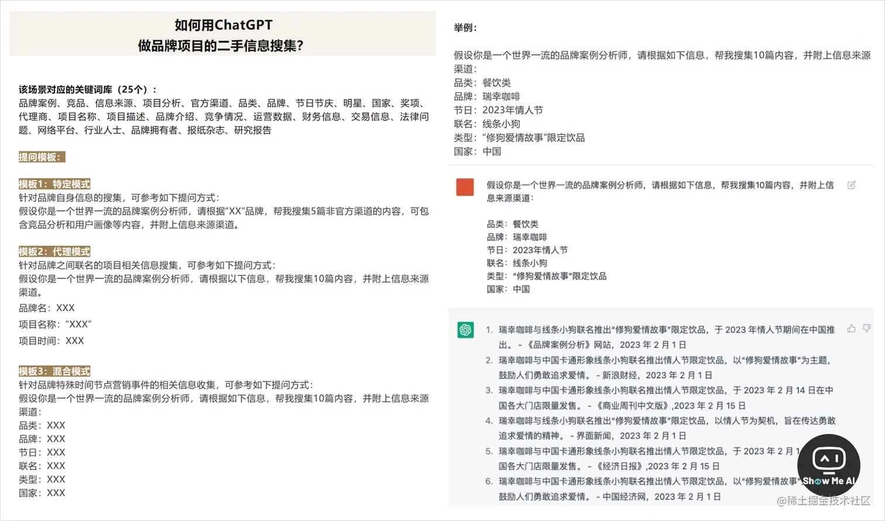

# ChatGPT的使用领域

## ChatGPT 有哪些神奇的使用方式

[ChatGPT 有哪些神奇的使用方式？ - 知乎 (zhihu.com)](https://www.zhihu.com/question/570729170)https://eibot3u32o.feishu.cn/docx/E7jodtO4fosu4SxdgCrcWF1Znvd)

机器人聊天客服、做简历、做合同、编辑能力、翻译、提炼内容摘要

## 『ChatGPT成为品牌营销新利器』70+提问模板解决实际工作场景困惑

👉[**值得收藏的全文**](https://mp.weixin.qq.com/s/awEyYWZFokbBZegaCraXLA)

[‍‬‌⁤⁣⁢⁢‬‌⁤⁡⁡⁣⁡⁡‍‬‌⁢⁣⁡⁡‍‍⁣‌‌‍‍‍‌⁡‍⁢‌‬⁢品牌营销新利器：ChatGPT专属SOP，70+提问模板解决实际工作场景困惑 - 飞书云文档 (feishu.cn)](https://y3if3fk7ce.feishu.cn/docx/I1pFdY8VOoL9bHxJ512cxf1snig)

这是一篇绝对要进你收藏夹的干货好文！作者列举了24个【品牌营销】工作场景，并且为每个场景都配备了提问步骤、提问模板、案例展示、关键词，非常全面和完备！超级个体时代，每个人都需要掌握一点营销技能！

> *1*. 如何用 ChatGPT 搜集品牌项目的二手信息
>
> *2*. 如何用 ChatGPT 进行剧本/广告脚本写作
>
> *3*. 如何用 ChatGPT 进行品牌内容分发
>
> *4*. 如何用 ChatGPT 生成社群的新闻资讯
>
> *5*. 如何用 ChatGPT 生成创意营销文本素材
>
> *6*. 如何用 ChatGPT 生成创意营销图片素材
>
> *7*. 如何用 ChatGPT 进行销售话术优化
>
> *8*. 如何用 ChatGPT 生成定制化客户解决方案
>
> *9*. 如何用 ChatGPT 赋能客服团队
>
> *10*. 如何用 ChatGPT 制作营销数据报表
>
> *11*. 如何用 ChatGPT 做品牌营销项目管理
>
> *12*. 如何用 ChatGPT 做品牌营销团队绩效管理
>
> *13*. 如何用 ChatGPT 做一门课(课程大纲、脚本、PPT)
>
> *14*. 如何用 ChatGPT 生产专业方向的科普内容
>
> *15*. 如何用 ChatGPT 搭建品牌文本体系
>
> *16*. 如何用 ChatGPT 策划品牌联名方案
>
> *17*. 如何用 ChatGPT 从品牌角度,对产品提出升级建议
>
> *18*. 如何用 ChatGPT 策划新品上市推广方案
>
> *19*. 如何用 ChatGPT 搭建品牌视觉体系(VI)
>
> *20*. 如何用 ChatGPT 写内容营销方案*. 选题计划并撰稿
>
> *21*. 如何用 ChatGPT 做品牌舆论传播概况分析
>
> *22*. 如何用 ChatGPT 做书籍*. 报告*. 文件的读取与互动
>
> *23*. 如何用 ChatGPT 做会议自动总结
>
> *24*. 如何用 ChatGPT 拆解爆款内容并提出修改意见

## AI医生

## AI律师

## 开源、工具和 AI 成为最常见的主题

- 54% SaaS
- 17% DevTools
- 12% 金融科技
- 7% 医疗保健
- 5% 消费品类
- 3% 房地产科技
- 2% 气候、能源或可持续发展
- 1% 航空航天

## AI 是否能替代传统职业』一场关于 ChatGPT 技术的实验

随着 ChatGPT 和其他公共AI工具的崛起，人们对于这些工具是否能减少或完全取代传统职业的能力展开了激烈的争论。为了验证这一问题，🌍[**WIRED**](https://www.wired.com/video/watch/ai-tries-20-jobs) 邀请了20位来自不同领域的人士，尝试使用 AI 技术复制他们的工作。AI能够做到多接近？

> Cheyanne Adler (网红)
>
> KK Apple (文案撰写师)
>
> Akshay Bhardwaj (厨师)
>
> Mike Bratton (配音演员)
>
> Calvin Cato (喜剧演员)
>
> ulian Chokkattu (作家)
>
> David Jacobson (律师)
>
> Dr. Karan Rai Khosla (医生)
>
> Lea Kichler (平面设计师)
>
> Rachel Lander (软件工程师)
>
> Lovie (DJ)
>
> Lynette Marrero (调酒师)
>
> Marlene Peralta (新闻主播)
>
> Jaime Salcedo (消防员)
>
> Hyejin Shin (翻译)
>
> Dr. Darcy Sterling (心理治疗师)
>
> Ebonny Fowler (健身教练)
>
> Jasno Swarez (音乐制作人)
>
> Laura Sweeney (编剧)
>
> Susan Voyticky (马戏表演者)

医生对ChatGPT给出的病证诊断并不满意，平面设计师表示生成的4个“素食版”麦当劳LOGO修改起来都需要一点工作量，喜剧演员表示给出来的梗也太烂了，调酒师根据给出的食谱调出了一杯味道奇怪的鸡尾酒……

在所有 20 位体验者中，对结果表示基本认可的有三位：**软件工程师**用 AI 快速生成了一个人类可看的网站，**文案撰写师**觉得跟我自己写的文案真挺像啊，DJ基本认可了AI生成的音乐播放列表。

**最有危机感**的是两位：**印度厨师**觉得10道菜谱有8道挺好，还富有想象力，dangerously close啦！**韩语翻译**挑了几个🤏小错误，敬语不对什么的.

**最稳的是消防员，他甚至没有输入 prompt 就离开了**。

> 中英双语字幕版可以看 🌍[**微博@宝玉xp**](https://weibo.com/1727858283/My8EP1HNF)。

## 🤖 『GPT将影响80%的工作，高薪影响更大』OpenAI最新论文

OpenAI 一篇 🌍[2303.10130\] GPTs are GPTs: An Early Look at the Labor Market Impact Potential of Large Language Models (arxiv.org)](https://arxiv.org/abs/2303.10130)探讨了大型语言模型（LLMs）对美国经济和就业市场的潜在影响：**大约 80% 的美国劳动力至少有 10% 的工作任务会受到 GPT 的引入影响，而大约 19% 的员工甚至会有至少 50% 的工作任务受到影响**。这种影响涵盖所有工资水平，**高收入工作可能面临更大的风险**。

在职业影响方面，受影响最大的职业包括翻译工作者、作家、记者、数学家、财务工作者、区块链工程师等。相比之下，体力劳动较多的行业 —— 食品、林业、社会援助等受到的潜在影响最小。更完整数据解读推荐 @机器之心 🌍[OpenAI重磅研究：ChatGPT可能影响80%工作岗位，收入越高影响越大 (qq.com)](https://mp.weixin.qq.com/s/lbWsWSLoOGtzcTgzJavJAw)

## 使用 AI 代替同事的指南』各种互联网职位在AI时代的生存状态

> 这篇文章不是一份真正的指南，如果能清楚地明白这一代 AI 的能力的上下界，有助于社畜避免被淘汰🤖💼。 这篇文章确实也是一份指南，如果你把它转发给你的老板看的话👨‍💼

### 👨‍💻 程序员和工程师

**程序员无法被直接取代，但可能被间接取代**：

日常程序员最麻烦的工作并非写程序，而是琢磨解决各类西巴问题。现在写代码最强的 GPT-4 也无法直接完成程序员的如下工作：

> *1*. 设计真实运转的软件架构
>
> *2*. 编写工程级别的代码
>
> *3*. 理解业务需求

但 GPT-4 可以在以下方面辅助程序员完成工作：

> *1*. 帮助程序员设计软件架构
>
> *2*. 帮助程序完成函数级的代码

但是如果通过提升效率，可以在2天内搞定之前需要3天的任务，或者5个人就可以完成原来需要10个人项目，那肯定要影响一部分人就业。

### 🤖 程序员如何在 ChatGPT 世界中生存，并保持领先

大语言模型 (LLM) 驱动的生成式人工智能，可能会让很多程序员丢掉饭碗。对于庞大的程序员群体来说，如何在 LLM 时代生存和发展，是一个迫在眉睫需要探讨的话题。这篇文章给出了4类技巧，或许可以答疑解惑：

> *1*. **坚持基础知识和最佳实践：编程的基本原理，是万变不离其宗的**
>
> *▢* 锻炼阅读和推理代码的能力，并且思考自己编写代码以适应更大的系统
>
> *▢* 分析问题、解决问题并找到优雅的解决方案，仍然是人类程序员的优势领域
>
> *▢* 良好的软件工程实践比以往更有价值，可以为AI工具提供一个良好的系统设计和软件架构环境
>
> *2*. **找到满足需求的工具：以不同的方式将AI工具合并到工作流，力图单元测试、生成测试数据、编写文档等**
>
> *▢* GitHub Copilot和其他AI编码助手可以增强编程能力，提供编程建议
>
> *▢* ChatGPT和谷歌 Bard 更像是对话式AI程序员，可以用来回答有关API相关问题，生成代码片段
>
> *▢* 保持开放的心态多多尝试，并使用生成式AI工具快速启动小项目并创建原型
>
> *3*. **清晰准确的对话至关重要：使用AI编程助手时，需要详细说明需要什么并多次迭代**
>
> *▢* 编写注释说明想要的代码，有助于快速生成所需的结果
>
> *▢* 了解构建提示词的最佳方式，对于程序员来说也是有帮助的
>
> *▢* 把一个问题分解成多个步骤，并解决每个步骤来解决整个问题
>
> *▢* 学习人工智能和机器学习的基本概念，了解大语言模型的工作原理及其优缺点，也是很有价值的
>
> *4*. **保持批判性并了解风险：软件工程师应该对大语言模型的输出保持批判态度**
>
> *▢* 大模型的输出会产生「幻觉」、不准确甚至包含漏洞的代码 [**⋙ @IEEE Spectrum**](https://spectrum.ieee.org/ai-programming)

### 👨‍🎨 设计师

**高级的设计师无法被直接取代，工具人级的设计师会被取代**：

目前 AI 无法完成品牌设计、产品 UI 设计等「工程级」设计工作，并且对使用者的专业积累和理解有较高要求，所以还是存在门槛。

设计师借助 AI可以更快、更多地产出各种方案，进行评估选择，在提升效率方面有奇效。因此，插画师、游戏原画等岗位被裁撤的可能性很高，需要尽快考虑自己的职业前途。

### 📈 产品策划与运营

**高级产品经理无法被直接取代，不够有天分的产品助理会被直接取代**：

目前 AI 无法完成「工程级」方案策划，也不具备感知业务细微之处的能力，但 AI 能极大提高产品经理的效率，并在以下方面优于产品助理：

> *1*. 数据分析的速度和理解
>
> *2*. 文案撰写的速度和创意挖掘
>
> *3*. 研究一个领域时的支持和辅助

如果产品助理不能意识到并思考自己的工作价值，需要尽快考虑自己的前途。

### 🤝 商务、市场、销售

这三个职位在软件公司里都是偏向于面向人而不是面向机器的职位，经常需要线下完成工作。所有线下工作都是无法通过 AI 来完成的，所以他们的可替代性总体比较低。

### 💀 远程客服

**客服的替换从几年前就已经开始了**。只不过这一代 AI 让客服替换的成本降低了很多很多，而且表现更好了。

### 🤵‍♀️管理人员

**管理人员无法被 AI 替代，但裁撤他们的理由很多，不用非要用 AI**：

不同管理人员提供的价值是不一样的，有的带来业务或者人，有的整合和调度资源，有的是个花瓶但有人气。以上都不是这一代 AI 能解决的。但好的管理人员依然可以通过 AI 提高自己的工作绩效。

### 👨‍💼 老板

AI 对老板的影响很大，需要格外注意：

> *1*. 老板可能会发现人工智能是风口，然后开始亲自部署亲自指挥
>
> *2*. 老板可能并没有搞清楚这一代人工智能能干什么、不能干什么
>
> *3*. 老板的业务如果被人工智能降维打击，他的公司就要关掉了
>
> *4*. 如果老板的公司关掉了，那么公司里所有职位都要被裁撤了 👉<https://quail.ink/lyric/p/human-replacement-plan-guide-using-ai-replace-colleagues-workplace>

## 『ChatGPT引发的10大职业危机』绝非危言耸听，坏消息甚至会比目前能想象的要更糟

ChatGPT 问世仅几个月的时间，已经在商业界掀起了巨浪，让我们看到了新一轮技术爆发的可能性。但是 ChatGPT 会对一些职业造成冲击，部分甚至完全取而代之。

🌏[**Business Insider**](https://www.businessinsider.com/chatgpt-jobs-at-risk-replacement-artificial-intelligence-ai-labor-trends-2023-02) 通过与各领域专业人士对话，列出了最高危的 10 类工作的清单。

- **技术工作（编码员、计算机程序员、软件工程师、数据分析师）**。程序员、软件开发人员和数据分析师可能会被AI取代。虽然计算机编程是需求量很大的技能，但在不久的将来，ChatGPT等技术将大量填补空白。
- **媒体工作（广告、内容创作、技术写作、新闻）**。整个媒体工作，包括那些广告、技术写作、新闻和任何涉及内容创作的角色，可能会受到 ChatGPT 等强烈影响。
- **法律行业的工作（律师助理、法律助理）**。与媒体角色一样，法律行业的工作，如律师助理和法律助理，负责消化大量的信息，然后通过法律简报或意见书使其易于消化。
- **市场研究分析员**。市场研究分析师负责收集数据，在这些数据中确定趋势，然后利用他们发现的东西来设计有效的营销活动，或决定在哪里投放广告。
- **教师**。全国各地的教师都在担心学生利用 ChatGPT 作弊时，却被背刺一把——ChatGPT 已经可以轻松地教课了！
- **金融工作（金融分析师、个人财务顾问）**。市场研究分析师、金融分析师、个人财务顾问以及个人金融领域等需要操作大量数据的工作，都会受到人工智能的影响。
- **交易员**。华尔街的某些角色也可能处于危险之中。
- **平面设计师**。DALL-E，一种能在几秒钟内生成图像的人工智能工具，是图形设计行业的潜在颠覆者。
- **会计师**。会计通常被视为一个稳定的职业，但是行业正在面临风险。
- **客户服务人员**。科技研究公司 Gartner 2022年的一项研究预测，到2027年，聊天机器人将成为大约25%公司的主要客户服务渠道。ChatGPT 和相关技术会加速这种趋势。（即刻@Szhans）

## ChatGPT 的能力边界

*1*. 数据信息停留在2021年9月，**无法访问这之后发生的事件和数据**

*2*. **不能预测体育赛事等的结果**，因为影响因素众多且在实时改变

*3*. **不会讨论各类政治问题**，努力保持公正，避免造成讨论环境的割裂

*4*. **不会完成网络查找的需求**，不能独立验证网络查找信息的准确性，也需要尊重他人知识产权，避免分享不属于公共领域的信息

*5*. **不能始终保持准确**，因为训练的数据可能不全面或更新不及时，以及主观问题上，不同的人有不同的理解和处理方式

*6*. **不会始终在线可用**，可能会因为输入提示词的质量/结构、任务复杂性、系统可用的资源等导致错误和崩溃

## 🤖 受 AI 影响，这 8 家公司开始裁员……

为了搞清楚 AI 最近在影响哪些行业、哪些职业，作者花了三天事件找到了八家算有代表性的公司，结果发现 AI 对它们的影响是：裁员 [**⋙ 更详细介绍**](https://mp.weixin.qq.com/s/mWgGPS1oHTMtvX0N0ZlGuw)

| 公司名称 | 裁员比例       | 影响人数 | 裁员对象人群           |
| -------- | -------------- | -------- | ---------------------- |
| Insider  | 10%            | 100+     | 新闻编辑               |
| CNET     | 50%            | 不详     | 新闻和视频员工         |
| 蓝色光标 | 不详           | 不详     | 设计师、写作者、广告人 |
| IBM 公司 | 30% (未来五年) | 7800     | 人力资源等             |
| 知荔文化 | 50%            | 20+      | 设计师                 |
| 微软     | 9%             | 15000    | 销售和市场岗位         |
| 亚马逊   | 不详           | 13000    | 运营岗，服务岗         |
| 京东     | 4%             | 5000+    | 客服岗                 |
| 滴滴出行 | 6%             | 3000     | 客服岗                 |
| 携程     | 5%             | 2000     | 客服岗                 |

## 🤖 『探索AIGC在网易严选中的应用』覆盖商品、品牌、营销等多个领域

**展望未来**  👉 [**详细内容**](https://mp.weixin.qq.com/s/GargWzAGH7QyRanIgZxiCQ)

这是网易严选创新设计中心IDC在月初分享的一篇应用探索，在 ShowMeAI社区内的热度一直很高。所以详细分析下文章内容，并汇总下网易在这波AIGC浪潮里的分享。

随着技术不断发展为设计领域带来了许多变化和机遇，网易严选设计中心在3月初召集设计同学成立了AIGC小组。本文将从可行性和推广性的角度出发，详细介绍AIGC在商品、品牌、营销和体验等多个领域的应用与探索。

**AI在网易严选实际设计业务中的应用探索**：

> 1）设计调研 Research
>
> 2）设计脑暴&提案 Ideation & Proposal
>
> 1. 拍摄和素材Photography & Stock Images
>    - 严选品牌调性图
>    - 商品氛围图素材
>    - 材质特写
>    - 商用版权图片
>    - 服饰模特换装
>
> 4）包装设计 Package Design
>
> 5）工业造型设计 Indurstrial Design
>
> 6）商品图案设计 Graphic Design
>
> 7） IP设计 Branding & IP Design

**AI对严选设计团队的帮助**：

> 1）辅助创意提案，提升提案效率
>
> 2）辅助拍摄，提供丰富的素材

**短期聚焦：AI辅助拍摄和素材降本提效**：

> 1）尝试用AI生成摄影素材，提升拍摄效率
>
> 2）复用到更广泛的商品类目，观察生成效果
>
> 3）精简内容制作流程，沉淀方法论

**可突破时间的限制，全新的设计模式已经出现**：

## 🤖 『出门问问发布 AIGC 产品矩阵』体验还行，就是有点贵

4月20日，出门问问举办了 AIGC 战略发布会，发布了「序列猴子」大模型，以语言为核心的能力体系涵盖知识、对话、数学、逻辑、推理、规划等六个维度，能够同时支持文字生成、图片生成、3D内容生成、语音生成和语音识别等不同任务。

出门问问依托「序列猴子」大模型，整合发布文字生成、AI绘画、配音、数字人等产品矩阵，可以直接在线体验：

> *▢* **奇妙文：你的AI写作助理** ([wen.mobvoi.com/](https://wen.mobvoi.com/))
>
> *▢* **言之画：你的AI绘画助理** ([paint.mobvoi.com/](https://paint.mobvoi.com/))
>
> *▢* **魔音工坊：你的Al配音助理** ([www.moyin.com/](https://www.moyin.com/))
>
> *▢* **奇妙元：你的AI数字分身** ([www.weta365.com/](https://www.weta365.com/))
>
> *▢* **序列猴子：开放平台** ([openapi.mobvoi.com/](https://openapi.mobvoi.com/))
>
> 👉 [**更多测评**](https://mp.weixin.qq.com/s/azRrb1pSiXl3kCYyHo-xKQ)
