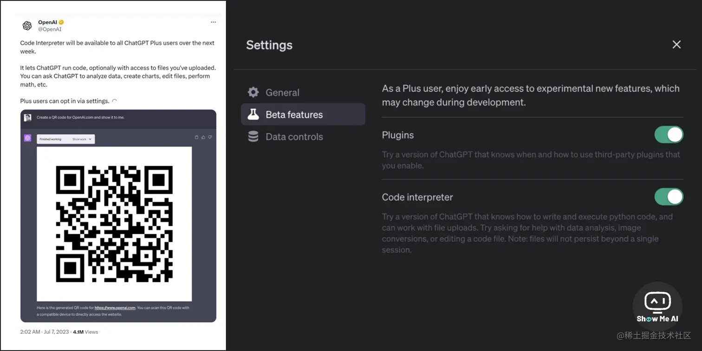
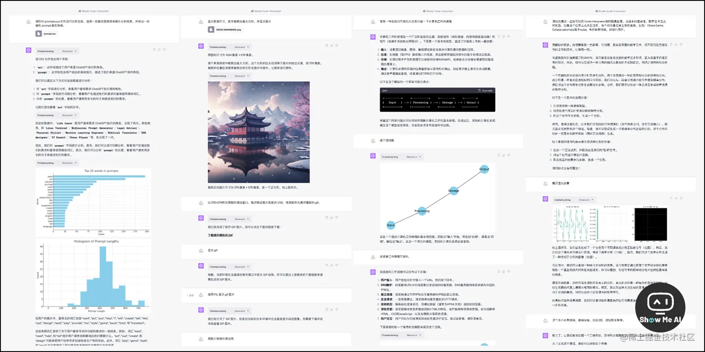
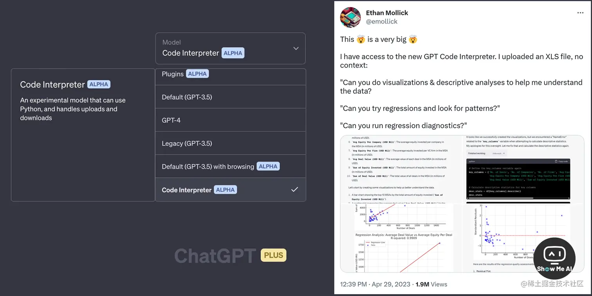

# ChatGPT功能更新

## ChatGPT更新的功能

**(Code lnterprete)代码解释器**：ChatGPT的代码解释器将深刻的改变我们同计算机的交互方式，可以接收用户上传的文本，数据，还有图片，然后向他提出要求，ChatGPT会用即时编程的方式来处理你的要求，然后再给出反馈。

- 比如说，上传数据，要求对数据进行分析，然后按照你的要求来输出图表
- 比如说，修改图片：
  - 上传一张图片：要求把分辨率改为 1080*768，不要使图片变形，多余部分用黑色填充，加一个黑色能板，透明度设为30%，然后将格式修改为jpg
  - 会把要求翻译成代码，然后会自己根据代码执行来改图片
- 待定...

## ChatGPT 探索：Code Interpreter 高级指南

7月7日，OpenAI 在官方推特发布信息，接下来一周内，将向所有 ChatGPT Plus 用户开放 Code Interpreter (代码解释器) 功能。最近几天，对这个新功能的尝试可谓不亦乐乎！也再次见证了 OpenAI 的炸群能力 (*￣3￣)╭ 一起通过案例来看看功能的使用方法和效果！

> 1. **使用 Python 进行编程**：模型内置一个 Python 解释器，可以运行 Python 代码
> 2. **处理上传和下载**：支持将文件上传到当前对话工作区，并下载工作结果
> 3. **沙箱化执行环境**：解释器插件在一个受保护的执行环境中运行，包括防火墙和临时磁盘空间
> 4. **持久会话**：代码由解释器插件在一个持久的会话中进行评估，会话在聊天对话的持续时间内保持活动状态，可通过多次调用构建（超时销毁）
> 5. **使用场景**：解决数学问题 (定量和定性)，进行数据分析、数据可视化、绘制流程图、转换视频/图片等文件格式、处理图片/PDF等文件等 [**⋙ Twitter @OpenAI**](https://twitter.com/OpenAI/status/1677015057316872192) | [**Code Interpreter 高级指南**](https://mp.weixin.qq.com/s/K_csi1oWDv5tEaeeKSlvwA)

## 🤖 『ChatGPT + Code Interpreter = Magic』魔法

[**⋙ 部分推文**](https://twitter.com/rezkhere/status/1653779990222188546)

OpenAI 近期面向部分用户发放了 Code Interpreter (代码解释器) 插件使用权限，推上目前满屏惊讶脸 😮 拿到权限的用户，展示了使用 Code Interpreter插件进行的诸多尝试：

> *1*. 处理图片。输出动态二维码、脸部识别、图片转ASCII码、创建调色板等
>
> *2*. OCR 识别。导入图片输出文本等
>
> *3*. 画图，生成较为复杂的svg
>
> *4*. 生成 GIF 动画，也可以将GIF转为视频
>
> *5*. 生成音频。创作音乐等
>
> *6*. 生成日历邀请文件 .ics
>
> *7*. 游戏模拟器，比如吃豆人游戏、行星轨道、跳棋、国际象棋
>
> *8*. 数据分析。对上传的任意excel文件进行数据分析，绘制各类型图表，并提供洞察
>
> *9*. 多个插件之间可以串起来，前一个代码运行的结果可以给下一个插件代码作为参数
