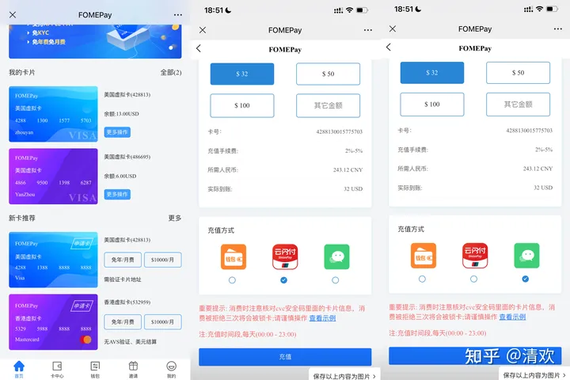

# ChatGPT API Key申请使用及充值教程

## 一、ChatGPT API介绍

OpenAI开放 ChatGPT 和 Whisper API，ChatGPT API允许任何企业在其应用程序、网站、产品和服务中使用 ChatGPT 功能，Whisper API可以实现语音转文本。

ChatGPT API有什么用？简单地说，它允许任何企业或个人在他们自己的应用程序、网站、产品和服务中使用 ChatGPT 功能，并且是最新的训练模型，$0.002/1K tokens的价格看起来也似乎非常诱人！

ChatGPT API 的开放, 类似乔布斯当时建立了Apple应用商店，让全世界的企业和个人开发者都可以在应用程序中预留人工智能的接口, 与类ChatGPT平台联结起来。

## 二、ChatGPT账号申请及充值

本文默认你已经申请好了OpenAI官网账号，如果你还没有，请先参考[《Chat GPT官方推荐新手教程》](https://chatgpt-plus.github.io/chatgpt-plus/) 

参考文中的第1步先申请一个账号，需要用到申请一个，成本不到1$，支持支付宝。关于充值，参考上面推荐新手教程的第2、3步做即可。

有了卡之后，登录到OpenAI网站，点击右上角账号信息-->Billing ,设置付款方式，在这里绑定你刚刚申请的卡号信息即可对ChatGPT API充值。

## 三、开始使用ChatGPT API

OpenAI账号注册完成后，登录界面里，点击右上角 View API keys—> Create new secret key，可以生成属于你自己的API，有了这个API，就可以用于开发基于ChatGPT API的应用程序。

需要注意的是，出于安全原因，这个API只展示一次，请务必在关闭对话框之前，将其复制到你其他的地方保管。

另外，点击左侧栏的Usage ,可以方便清晰看到token的使用量情况，数据5分钟更新一次。

OpenAI官方针对每一个新注册的账户，提供18-5免费token使用额度。这样一想，前面花费不到18免费token使用额度。

不过需要注意的是，免费额度有时间限制，过期了额度就作废。

ChatGPT API的使用方法也十分简单，首先可以用简单的curl命令测试下。把$OPENAI_API_KEY替换成你自己的API KEY就好。

另外，官方也提供了基于各种编程语言的简单实现代码。比如Python，你只需import openai包，带上刚申请的API，模型选择看你自己。

更多的例子，请自行参考[官方例子](https://openai.com/blog/introducing-chatgpt-and-whisper-apis)以及[官方API文档](https://platform.openai.com/docs/api-reference/introduction)。

不过，作为开发人员，我们也可以灵活地选择特定构建版本，以享受最新的特性。

## 四、ChatGPT API使用的几个问题

### 1、ChatGPT API速度如何

个人感觉这个 token 用得还是挺快的！比官方的ChatGPT要快，响应也不需要一个字一个字蹦出来了。会不会突然有点不适应了？哈哈！

### 2、如何给ChatGPT API充值

文章开头说了，国内无法通过任何银行卡充值，必须使用Depay虚拟信用卡来绑定充值，参考文章第二章的官方指导文档操作即可。当然，如果你已经有国外卡，那会方便很多，直接充。

### 3、ChatGPT API Token收费标准

官方这次的收费标准是 $0.002/1K tokens，大概 750 词。虽然1k个token看起来很多。但其实，发送一段供API响应的文本可能就会花费不少token。

据我观察，基本问1个问题就要耗费100~200个token，算起来其实不少的，尤其在连续会话中，为了保持对话的连续性，必须每次都要回传历史消息，并且输入都要算 token 数算钱的，满打满算，按量付费其实也不便宜。

按照一般的经验来看，在英语中“一个 token 通常对应大约 4 个字符”，而1个汉字大致是2~2.5个token。

举一个官方的说明例子可能更直观一些：根据 OpenAI 官方文档，“ChatGPT is great!”这组单词就需要六个 token—— 它的 API 将其分解为“Chat”、“G”、“PT”、“is”、“great”和“!”。

如果你想查询一串指定的文本到底需要耗费多少个token(钱💰)，官方也有提供一个：[免费查询计算器](https://platform.openai.com/tokenizer)：

### 4、ChatGPT API的连续会话能力

我们知道，官方的ChatGPT以及ChatGPT Plus最强的地方就在于它拥有上下文联系，也就是能跟你连续会话的能力，正因为如此，让你拥有了跟一个现实伴侣、导师或者朋友交谈的感觉。另外，这次的API自带连续对话能力，你只需在接口入参的地方将历史对话内容一并赋值给Message参数，回传给模型就可以。不过这势必会增加token的费用，这点有点坑啊。官方似乎也意识到了这点，所以，单次传的token上限为4096，超过4096会返回报错。

### 5、ChatGPT API使用的地区限制

ChatGPT API使用有地区限制吗？有群友反馈说今天开始国内访问API已经不稳定了，目前我这边还是可以的。但后面不好说，可能得走国际IP也说不定。

### 6、关于套壳APP&网站

随着官方ChatAPT API的发布，过段时间，国内势必会不断涌出套壳APP或者网站，声称用的最新的ChatAPT API。文章前面说了，token是需要付费的，而且如果达到跟官方chatgpt甚至 chatgpt plus一样优秀的连续会话水平，是需要回传历史会话信息的。

试想一下，把你跟ChatAPT API聊天的答案之类的都传过去，这一下得花多少token。请大家千万要多留一个心眼，毕竟天下没有免费的午餐。

比如，你可以试试问一下那些套壳AI网站“今天是哪一天？”，看看它怎么回答。

### 7、Whisper API

除了 ChatGPT API，这次，OpenAI 还宣布了 Whisper API 。Whisper 是OpenAI在2022年9月份开源的语音转文字模型，开元之后就受到了全球开发者社区的盛赞。

Whisper API 基于开源 的whisper-large-v2 模型，方便开发者们按需使用，价格为每分钟 0.006 美元。

根据官方文档的介绍，Whisper API 可被用来转录（以源语言转录）或翻译（转录为英语），并转为各种格式（M4A、MP3、MP4、MPEG、MPGA、WAV、WEBM）

官方也有提供Whisper的使用[例子](https://openai.com/blog/introducing-chatgpt-and-whisper-apis)：

## 五、ChatGPT Plus还有必要续费吗？

最后一个问题，ChatGPT API发布之后，有些人会想，是不是ChatGPT Plus可以不用续费了。

其实并不然。正如上面所介绍，ChatGPT API使用偏向于程序员以及应用开发者，对普通用户有较大的使用门槛。还有，上面也说了，Token看似便宜，实际上需要回传历史消息才能延续上下文连续回话能力，何况当前还有4096个token的限制，真正使用下来，一个月也比Plus的$20定价也便宜不了多少。

API速度上会比Plus快，但是，二者关于回答的质量上，目前肯定是官方Plus占优。毕竟除了模型，模型的参数才是决定性的，一句话，你永远可以相信官方。

## 六、淘宝的黄牛能把OpenAI 120刀的API-Key卖到人民币35块一个

很多人对OpenAI 120刀的API-Key有误解~
这句话换个说法，就能理解了。其实是价值OpenAI 120刀的API-Key~所谓价值，并非就是实际需要支付120的费用。因为早在5月份之前，OpenAI的两个体系都是有部分免费服务的。老玩家应该很清楚。

一、Chatgpt可以免费提问，具体额度忘记是多少Token的量了，5月之后，平台用户激增，官方开始考虑盈利，开启了全面会员制，只有PLUS会员才能使用

二、OpenAI API 只需要绑卡获取API-Key就会送120刀的额度，对卡资金也没有什么要求，卖到人民币35块一个，其实就是一个账号的费用。对比注册成本2块钱不到。黄牛每个号都是"含泪"赚取33。

5月之后，机制改动，openai api收费标准是按量计费。而且绑卡就扣5美刀的费用。计算价格时，通常会计算输入文本和生成文本中的 Token 数量之和。例如，如果输入有 10 个 Token，而输出有 20 个 Token，则总共会计算 30 个 Token 的价格。1000个Token约等于750个英文单词或者400～500个汉字。特殊字符也放过，统统算入 Token。

黄牛们，通过不停的绑卡账号---解绑卡---再绑卡别的账号，白嫖了大量的免费额度。后来官方出现了几次大的风控，可能与这个也有关，城门失火殃及池鱼，用相关卡段的订阅的很多都被波及了。有几个卡段直接被官方禁用，不支持订阅GPT了

小喻是二月份开始使用428813卡段订阅ChatGPT和MIDjourney会员，到目前已经连续使用了6个月了。10刀的开卡费用，最低充值额度5美刀。除了第一次开卡费用也没有支付过月费和年费、管理费。

————————————————————————————————————————————

OpenAI 120刀的API-Key，只是额度120刀，很多黄牛在前2月就批量养号，一个号绑定一张美元虚拟信用卡。批量开卡的成本在2刀左右。如果是几千个账号起那美元虚拟卡开卡成本低至1.5刀左右。

卖35人民币也还有一半的利润。 这是我知道的稍微正规的渠道。如果卡是0成本的，那35人民币都全是毛利。

需要能获取OPEN AI API-KEY的用户可以自己注册开通一张美元虚拟信用卡，0门槛，免实名登记。即开即用无需等待。可以白嫖120刀的额度哦。

[FOMEPay支持微信、支付宝、云闪付（上百家银行卡、信用卡）也支持USDT；总有一个适合你。](https://gpt.fomepay.com/#/pages/login/index?d=176993)

**FOMEPay平台开一张免实名的428813美国虚拟卡。 操作步骤如下**：

**申请卡片成功后，直接复制卡片信息点击订阅即可。操作非常简单。**

**这张卡申请下来之后还可以作为别的用途，有效期四年！**

428813（美国虚拟卡）适用范围非常广泛，只要是支持美国VISA卡的场景均可。

例如：

- 1、AI软件：ChatGPT、OPEN AI midjourney等；
- 2、电商网站：Amazon、Wish、Ebay 速卖通、敦煌网、阿里巴巴国际站等
- 3、广告平台：Facebook、Google、Twitter、Pinterest等
- 4、应用商店：App Store、GooglePlay等
- 5、视频网站：Netflix、Amazon 、PrimeViedo、Hulu等
- 6、时尚潮流：FootLocker、Yeezy 、Supply、Supreme、NIKE、Stockx等
- 7、其他应用:T-Mobile充值、GoogleVoice充值、Ultra Mobile充值等。