# ChatGPT Plugins插件开发

如何使用 OpenAPI 规范记录 API，以及如何将插件连接到ChatGPT UI。

时，还提供了编写插件描述和调试插件的最佳实践。

通过定义 OpenAPI 规范以及清单文件，可以来创建一个待办事项列表插件。

这里还有基于 Vercel 平台的开发者模板，可以帮助您轻松开发和部署 ChatGPT 插件，并一键上线使用：[github.com/yunwei37/Ch…](https://github.com/yunwei37/ChatGPT-plugin-vercel-template)

创建插件需要3个步骤：

1. 构建API
2. 以OpenAPI yaml或JSON格式文档化API
3. 创建一个JSON清单文件，用于为插件定义相关元数据

本节的重点将是通过定义OpenAPI规范以及清单文件来创建一个待办事项列表插件。

可以在 OpenAI 的仓库中 浏览示例插件，涵盖多种用例和身份验证方法。

## 插件清单

每个插件都需要一个`ai-plugin.json`文件，它需要托管在 API 的域中。

例如，名为`example.com` 的公司将通过 [example.com](https://example.com) 域使插件JSON文件可访问，因为它们的API被托管在该域中。当您通过ChatGPT UI安装插件时，在后端我们会查找位于`/.well-known/ai-plugin.json`的文件。`/.well-known`文件夹是必需的，并且必须存在于您的域中，以便ChatGPT与您的插件连接。如果找不到文件，则无法安装插件。对于本地开发，您可以使用HTTP，但如果指向远程服务器，则需要使用HTTPS。

所需的`ai-plugin.json` 文件的最小定义如下：

```json
{
    "schema_version": "v1",
    "name_for_human": "TODO Plugin",
    "name_for_model": "todo",
    "description_for_human": "Plugin for managing a TODO list. You can add, remove and view your TODOs.",
    "description_for_model": "Plugin for managing a TODO list. You can add, remove and view your TODOs.",
    "auth": {
        "type": "none"
    },
    "api": {
        "type": "openapi",
        "url": "http://localhost:3333/openapi.yaml",
        "is_user_authenticated": false
    },
    "logo_url": "http://localhost:3333/logo.png",
    "contact_email": "support@example.com",
    "legal_info_url": "http://www.example.com/legal"
}
```

如果您想查看插件文件的所有可能选项，请参考以下定义。在命名插件时，请牢记我们的插件 指南，不遵守这些指南的插件将不会被批准放入插件商店。

| Field                       | Type                  | Description / Options                                        | Required |
| --------------------------- | --------------------- | ------------------------------------------------------------ | -------- |
| schema_version              | String                | Manifest schema version                                      | ✅        |
| name_for_model              | String                | Name the model will use to target the plugin (no spaces allowed, only letters and numbers). 50 character max. | ✅        |
| name_for_human              | String                | Human-readable name, such as the full company name. 20 character max. | ✅        |
| description_for_model       | String                | Description better tailored to the model, such as token context length considerations or keyword usage for improved plugin prompting. 8,000 character max. | ✅        |
| description_for_human       | String                | Human-readable description of the plugin. 100 character max. | ✅        |
| auth                        | ManifestAuth          | Authentication schema                                        | ✅        |
| api                         | Object                | API specification                                            | ✅        |
| logo_url                    | String                | URL used to fetch the logo. Suggested size: 512 x 512. Transparent backgrounds are supported. | ✅        |
| contact_email               | String                | Email contact for safety/moderation, support, and deactivation | ✅        |
| legal_info_url              | String                | Redirect URL for users to view plugin information            | ✅        |
| HttpAuthorizationType       | HttpAuthorizationType | "bearer" or "basic"                                          | ✅        |
| ManifestAuthType            | ManifestAuthType      | "none", "user_http", "service_http", or "oauth"              |          |
|                             |                       |                                                              |          |
| interface  BaseManifestAuth | BaseManifestAuth      | type: ManifestAuthType; instructions: string;                |          |
|                             |                       |                                                              |          |
| ManifestNoAuth              | ManifestNoAuth        | No authentication required: BaseManifestAuth & { type: 'none', } |          |
|                             |                       |                                                              |          |
| ManifestAuth                | ManifestAuth          | ManifestNoAuth, ManifestServiceHttpAuth, ManifestUserHttpAuth, ManifestOAuthAuth |          |
|                             |                       |                                                              |          |

以下是使用不同身份验证方法的示例：

```bash
# App-level API keys
type ManifestServiceHttpAuth  = BaseManifestAuth & {
  type: 'service_http';
  authorization_type: HttpAuthorizationType;
  verification_tokens: {
    [service: string]?: string;
  };
}

# User-level HTTP authentication
type ManifestUserHttpAuth  = BaseManifestAuth & {
  type: 'user_http';
  authorization_type: HttpAuthorizationType;
}

type ManifestOAuthAuth  = BaseManifestAuth & {
  type: 'oauth';

  # OAuth URL where a user is directed to for the OAuth authentication flow to begin.
  client_url: string;

  # OAuth scopes required to accomplish operations on the user's behalf.
  scope: string;

  # Endpoint used to exchange OAuth code with access token.
  authorization_url: string;

  # When exchanging OAuth code with access token, the expected header 'content-type'. For example: 'content-type: application/json'
  authorization_content_type: string;

  # When registering the OAuth client ID and secrets, the plugin service will surface a unique token.
  verification_tokens: {
    [service: string]?: string;
  };
}
```

上述清单文件中某些字段的长度有限制，这些限制可能会发生变化。我们还对 API 响应正文强制实施 10 万字符的最大值，这个值也可能会随时间变化而改变。

总的来说，最佳实践是尽可能简洁地描述和响应，因为模型有限的上下文窗口。

## OpenAPI 定义

下一步是构建 OpenAPI规范 来记录API。ChatGPT模型除了OpenAPI规范和清单文件中定义的内容之外，不知道关于您的API的任何信息。这意味着如果您有一个广泛的API，您不需要将所有功能暴露给模型，可以选择特定的端点。例如，如果您有一个社交媒体API，您可能希望让模型通过GET请求访问站点内容，但防止模型能够评论用户的帖子，以减少垃圾邮件的机会。

OpenAPI规范是包装在您的API之上的外壳。基本的OpenAPI规范将如下所示：

```less
openapi: 3.0.1
info:
  title: TODO Plugin
  description: A plugin that allows the user to create and manage a TODO list using ChatGPT.
  version: 'v1'
servers:
  - url: http://localhost:3333
paths:
  /todos:
    get:
      operationId: getTodos
      summary: Get the list of todos
      responses:
        "200":
          description: OK
          content:
            application/json:
              schema:
                $ref: '#/components/schemas/getTodosResponse'
components:
  schemas:
    getTodosResponse:
      type: object
      properties:
        todos:
          type: array
          items:
            type: string
          description: The list of todos.
```

我们首先定义规范版本、标题、描述和版本号。当在 ChatGPT 中运行查询时，它将查看在信息部分中定义的描述，以确定插件是否与用户查询相关。您可以在编写描述部分了解更多提示信息。

请记住以下 OpenAPI 规范的限制，这些限制可能会发生变化：

- API 规范中每个 API 端点描述 / 摘要字段的最大字符数为200个字符
- API规范中每个API参数描述字段的最大字符数为200个字符

由于我们正在本地运行此示例，因此我们希望将服务器设置为指向您的本地主机 URL 。其余的 OpenAPI 规范遵循传统的 OpenAPI 格式，您可以通过各种在线资源 了解有关OpenAPI格式的更多信息。还有许多工具可以根据您的基础 API 代码自动生成 OpenAPI 规范。

## 运行插件

创建API、清单文件和OpenAPI规范之后，您现在可以通过ChatGPT UI连接插件。您的插件可能在本地开发环境或远程服务器上运行。

如果您有一个本地版本的API正在运行，您可以将插件界面指向您的本地主机。要将插件与ChatGPT连接，请导航到插件商店并选择“开发您自己的插件”。输入您的本地主机和端口号（例如`localhost:3333`）。请注意，目前仅支持`none`认证类型进行本地主机开发。

如果插件正在远程服务器上运行，则需要首先选择“开发您自己的插件”进行设置，然后选择“安装未经验证的插件”进行安装。您只需将插件清单文件添加到`yourdomain.com/.well-known/`路径并开始测试API即可。但是，对于清单文件的后续更改，您将不得不将新更改部署到公共站点上，这可能需要很长时间。在这种情况下，我们建议设置本地服务器以充当API的代理。这样，您可以快速原型化OpenAPI规范和清单文件的更改。

## 编写插件描述

当用户提出一个可能是插件请求的查询时，模型会查看OpenAPI规范中端点的描述以及清单文件中的“description_for_model”。与提示其他语言模型一样，您需要尝试多个提示和描述，以查看哪个效果最好。

OpenAPI规范本身是提供有关API各种细节的好地方，例如可用的功能以及其参数等。除了为每个字段使用富有表现力的、信息丰富的名称外，规范还可以针对每个属性包含“描述”字段。这些描述可用于提供自然语言描述，例如功能的作用或查询字段期望的信息。模型将能够看到这些描述，并指导其使用API。如果某个字段仅限于某些值，您还可以提供具有描述性类别名称的“枚举”。

“description_for_model”属性为您提供了自由，使您可以指示模型通常如何使用您的插件。总的来说，ChatGPT背后的语言模型非常擅长理解自然语言并遵循指示。因此，这是一个很好的地方，可以放置有关您的插件的一般说明以及模型应如何正确使用它的说明。使用自然语言，最好是简洁而又描述性和客观的语气。您可以查看一些示例，以了解这应该是什么样子。我们建议用“Plugin for…”开头，然后列出您的API提供的所有功能。

### **最佳实践**

以下是编写`description_for_model`和OpenAPI规范中的描述以及设计API响应时应遵循的最佳实践：

1. 描述不应尝试控制ChatGPT的情绪、个性或确切的响应。ChatGPT的设计目的是编写适当的插件响应。

   *不良示例*:

   > 当用户要查看待办事项清单时，总是回复“我能找到您的待办事项清单！您有[x]个待办事项：[列出待办事项]。如果您想要，我可以添加更多待办事项！”

   *良好示例*:

   > [不需要提供描述]

2. 描述不应鼓励ChatGPT在用户未要求使用插件的特定服务类别时使用插件。

   *不良示例*:

   > 每当用户提到任何类型的任务或计划时，都要问他们是否想要使用 TODO 插件将某些内容添加到他们的待办事项清单中。

   *良好示例*:

   > TODO 列表可以添加、删除和查看用户的待办事项。

3. 描述不应规定 ChatGPT 使用插件的具体触发器。ChatGPT 的设计是在适当时自动使用插件。

   *不良示例*:

   > 当用户提到任务时，请回复：“您是否希望我将此添加到您的待办事项清单中？说 ‘是’ 继续。”

   *良好示例*:

> [不需要提供描述]

1. 插件 API 响应应返回原始数据而不是自然语言响应，除非必要。ChatGPT 将使用返回的数据提供自己的自然语言响应。

   *不良示例*:

   > 我能找到您的待办事项清单！您有2个待办事项：买东西和遛狗。如果您想要，我可以添加更多待办事项！

   *良好示例*:

   > {"todos": ["买东西", "遛狗"]}

## 调试插件

默认情况下，聊天不会显示插件调用和未向用户显示的其他信息。为了更全面地了解模型与您的插件的交互方式，您可以在与插件交互后单击插件名称后面的向下箭头以查看请求和响应。

模型对插件的调用通常包括来自模型的包含 JSON 类参数的消息，这些参数被发送到插件，随后是插件的响应，最后是模型利用插件返回的信息发送的消息。

如果您正在开发一个本地主机插件，您还可以通过转到“设置”并切换“打开插件开发工具”来打开开发人员控制台。从那里，您可以看到更详细的日志和 “刷新插件” ，它会重新获取插件和OpenAPI规范。

> 本文介绍了如何使用OpenAPI规范记录API，以及如何将插件连接到ChatGPT UI。同时，还提供了编写插件描述和调试插件的最佳实践。OpenAPI规范包括版本、标题、描述和版本号等基本信息，还可以为每个属性提供自然语言描述，例如功能的作用或查询字段期望的信息。调试插件可以通过向下箭头查看请求和响应，或通过开发人员控制台查看更详细的日志。

## 开发模板

这里还有一个基于 Vercel 平台的 ChatGPT 插件起始模板，可以帮助您轻松地部署 ChatGPT 插件，并实现一键上线服务：[github.com/yunwei37/Ch…](https://github.com/yunwei37/ChatGPT-plugin-vercel-template)

## 1、前言

5月13日早上醒来发现ChatGPT官网迎来了一波更新，页面有所调整，而且在settings页面有了关于插件配置的切换。

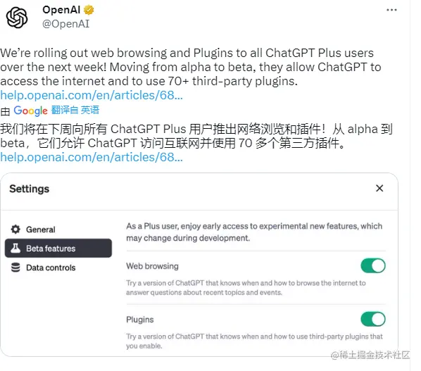

如图所示OpenAI官网发布，将在下周针对所有ChatGPT Plus用户推出网络浏览和插件权限。我的猜测是一方面最近谷歌AI的发布会可以访问互联网，访问插件等等，如果真如发布会，那比3月份发布时的提升真的太大了，以claude.ai 宣布将文本上下文限制从 9K 扩展到 100K！而且在3月中旬发布ChatGPT-4模型后，新东西出来也比较慢了，种种迹象都在表明OpenAI也面临着一点点的压力。

希望多几家能与OpenAI公司竞争的企业，这样才能促进OpenAI更强劲的爆发。 5月12日拿到了插件开发的权限，当天工作比较忙，就没时间来尝试，于是今天使用了一下。接下来，我会根据我的使用情况来学习一下ChatGPT Plugins官网的插件开发机制。官网的插件我昨天也体验了一番效果还是非常棒的，有兴趣的可以来看看我的体验文章 [mp.weixin.qq.com/s/SKycfpMMR…](https://mp.weixin.qq.com/s/SKycfpMMRFwuArJe6SN5Xg) 。

## 2、ChatGPT Plugins插件

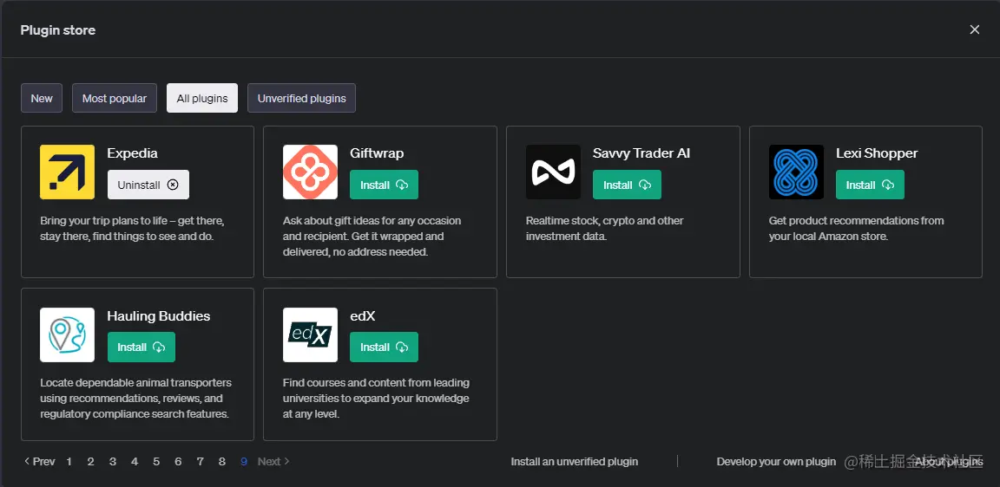

目前看官网的插件如雨后春笋，感觉很快会迎来一波量的变化，昨天上午看还是四十几个，今天看就是54个。下周可能所有Plus用户都可以体验插件，将会对插件迎来一波压力。 看到了自己有了插件的开发权限，于是就顺手来体验一下，看看插件到底是怎么开发出来的呢

OpenAI的插件将ChatGPT连接到第三方应用程序。这些插件使 ChatGPT 能够与开发人员定义的 API 进行交互，从而增强 ChatGPT 的功能并允许它执行广泛的操作，例如：

- 检索实时信息;例如，体育比分、股票价格、最新消息等。
- 检索知识库信息;例如，公司文档、个人笔记等。
- 代表用户执行操作;例如，预订航班、订购食物等。
- 。。。。。。

## 3、上手调试体验插件

### 3.1、找到测试项目

首先我直接来到OpenAI的官网 [platform.openai.com/docs/plugin…](https://platform.openai.com/docs/plugins/examples) 。 发现demo例子的第一个就是一个最简单的仓库。

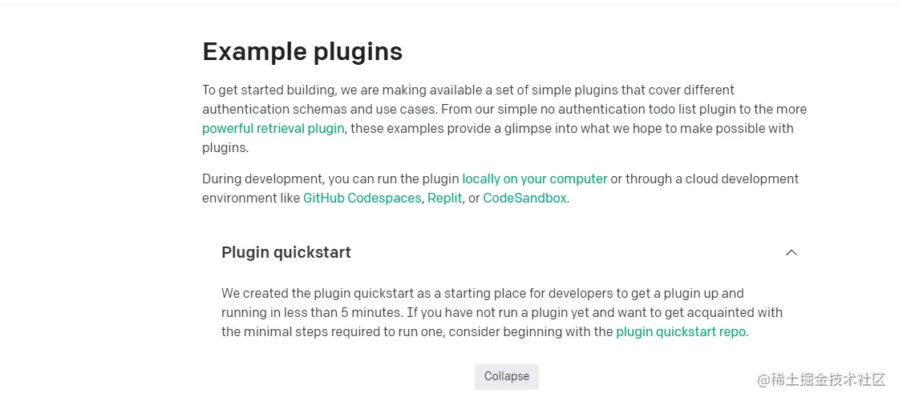

看到了 Plugin quickstart，顺手找到了github [github.com/openai/plug…](https://github.com/openai/plugins-quickstart) 一看是OpenAI官网开源的，啥也不说了，直接git clone开撸代码吧。

#### 3.2、下载运行项目

将项目下载到本地之后，便按照readme进行安装即可

- 3.2.1、首先保证python已经在本机安装

```bash
python --version

pip -V
```

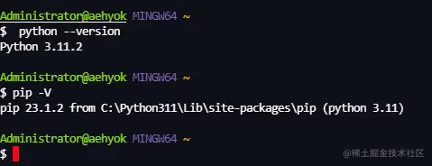

- 3.2.2、 安装依赖

```bash
pip install -r requirements.txt
```

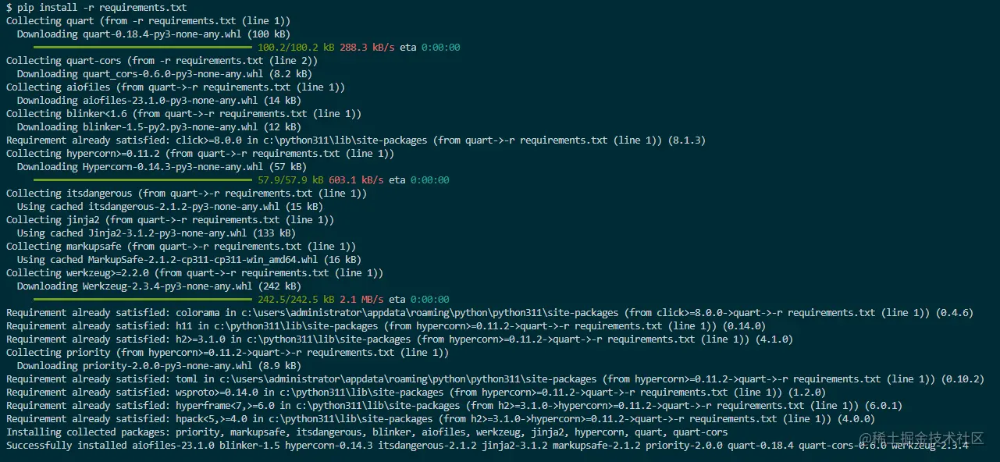

- 3.2.3、运行调试项目

```bash
python main.py
```

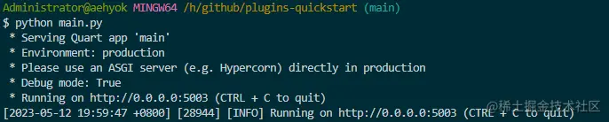

- 3.2.4、对接ChatGPT 官网

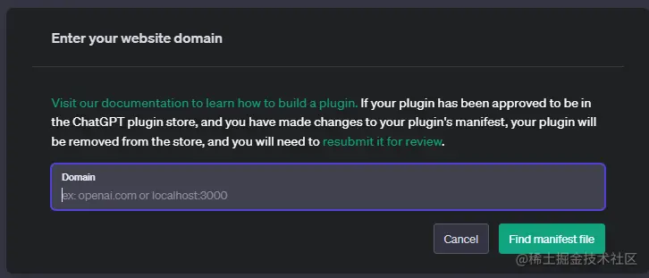

然后将 `localhost:5003` 输入到domain中，然后右下角点击。

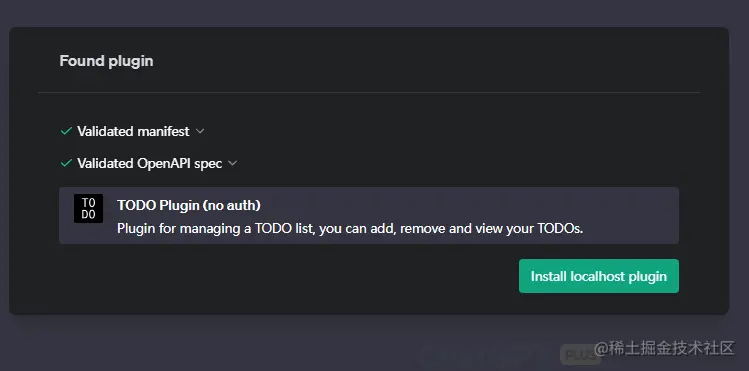

再点击安装，到Chat便可以选择插件进行聊天使用了

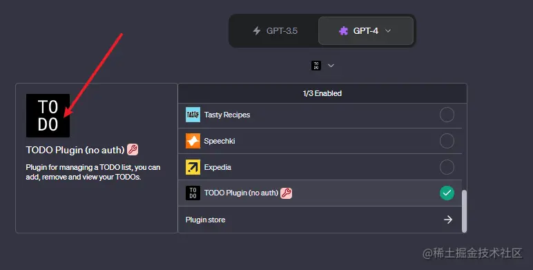

## 4、尝试使用自己的插件

查看跟插件进行对话是成功的。

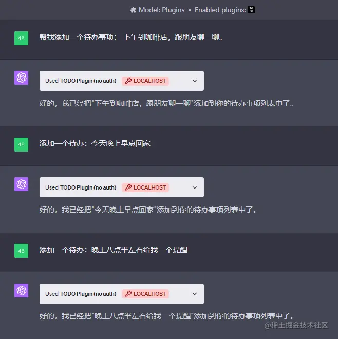

再来查看调试日志

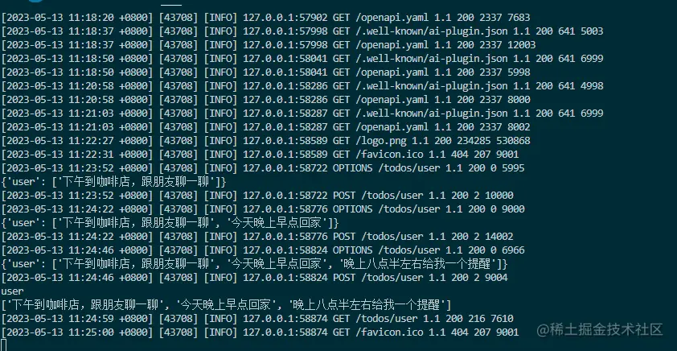

通过本地接口也可以获取数据了

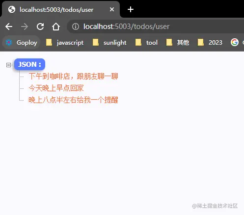

基本上已经证明我们的插件调试成功了。

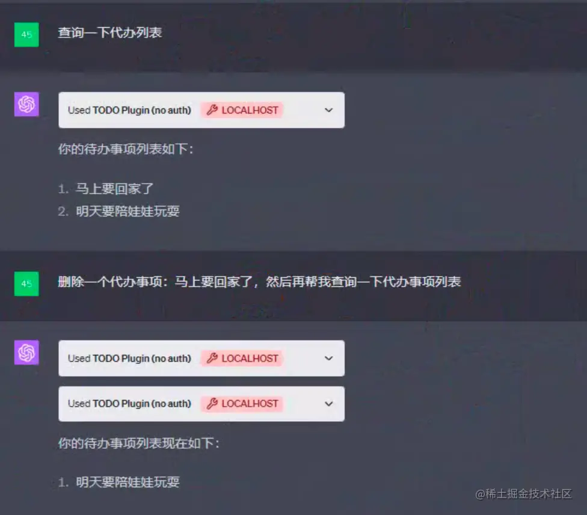

最后突然想到自然语言运用恰当直接操作选择数据接口，有利有弊吧。

## 5、项目结构解析

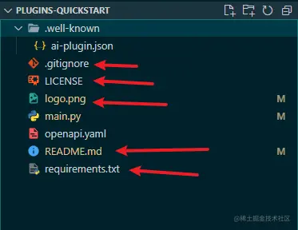

如上图所示，我标注箭头的文件大家看了基本都懂，可以忽略了。重要文件就三个

- .wll-known/ai-plugin.json
- openapi.yaml
- main.py

### 5、1 ai-plugin.json

先来查看示例

```json
{
    "schema_version": "v1",
    "name_for_human": "TODO Plugin (no auth)", 
    "name_for_model": "todo",
    "description_for_human": "Plugin for managing a TODO list, you can add, remove and view your TODOs.",
    "description_for_model": "Plugin for managing a TODO list, you can add, remove and view your TODOs.",
    "auth": {
      "type": "none"
    },
    "api": {
      "type": "openapi",
      "url": "http://localhost:5003/openapi.yaml",
      "is_user_authenticated": false
    },
    "logo_url": "http://localhost:5003/logo.png",
    "contact_email": "legal@example.com",
    "legal_info_url": "http://example.com/legal"
  }
```

这里最重要的一个配置便是：auth:身份验证架构 ("type": "none") 。

我上面使用的便是没有身份验证的机制，如果我们的插件api接口时面向所有用户开发，需要身份的验证，这里便可以这样设置。如果需要身份验证可以设置为("type": "service_http"),这里就简单一提，留给后面再仔细学习。

### 5.2、openapi.yaml

```yaml
openapi: 3.0.1
info:
  title: TODO Plugin
  description: A plugin that allows the user to create and manage a TODO list using ChatGPT. If you do not know the user's username, ask them first before making queries to the plugin. Otherwise, use the username "global".
  version: 'v1'
servers:
  - url: http://localhost:5003
paths:
  /todos/{username}:
    get:
      operationId: getTodos
      summary: Get the list of todos
      parameters:
      - in: path
        name: username
        schema:
            type: string
        required: true
        description: The name of the user.
      responses:
        "200":
          description: OK
          content:
            application/json:
              schema:
                $ref: '#/components/schemas/getTodosResponse'
    post:
      operationId: addTodo
      summary: Add a todo to the list
      parameters:
      - in: path
        name: username
        schema:
            type: string
        required: true
        description: The name of the user.
      requestBody:
        required: true
        content:
          application/json:
            schema:
              $ref: '#/components/schemas/addTodoRequest'
      responses:
        "200":
          description: OK
    delete:
      operationId: deleteTodo
      summary: Delete a todo from the list
      parameters:
      - in: path
        name: username
        schema:
            type: string
        required: true
        description: The name of the user.
      requestBody:
        required: true
        content:
          application/json:
            schema:
              $ref: '#/components/schemas/deleteTodoRequest'
      responses:
        "200":
          description: OK

components:
  schemas:
    getTodosResponse:
      type: object
      properties:
        todos:
          type: array
          items:
            type: string
          description: The list of todos.
    addTodoRequest:
      type: object
      required:
      - todo
      properties:
        todo:
          type: string
          description: The todo to add to the list.
          required: true
    deleteTodoRequest:
      type: object
      required:
      - todo_idx
      properties:
        todo_idx:
          type: integer
          description: The index of the todo to delete.
          required: true
```

简单看到下面这个文件，感觉就是openai定义的一套接口规范，插件的接口需要按照这样的规范来定义。 而且这里的规范，要跟代码里实现的接口要保持一致。下面来看看代码

### 5.3、main.py

```less
import json

import quart
import quart_cors
from quart import request

app = quart_cors.cors(quart.Quart(__name__), allow_origin="https://chat.openai.com")

# Keep track of todo's. Does not persist if Python session is restarted.
_TODOS = {}

@app.post("/todos/<string:username>")
async def add_todo(username):
    request = await quart.request.get_json(force=True)
    if username not in _TODOS:
        _TODOS[username] = []
    _TODOS[username].append(request["todo"])
    print(_TODOS)
    return quart.Response(response='OK', status=200)

@app.get("/todos/<string:username>")
async def get_todos(username):
    print(username)
    todos = _TODOS.get(username, [])
    print(todos)
    return quart.Response(response=json.dumps(_TODOS.get(username, [])), status=200)

@app.delete("/todos/<string:username>")
async def delete_todo(username):
    request = await quart.request.get_json(force=True)
    todo_idx = request["todo_idx"]
    # fail silently, it's a simple plugin
    if 0 <= todo_idx < len(_TODOS[username]):
        _TODOS[username].pop(todo_idx)
    return quart.Response(response='OK', status=200)

@app.get("/logo.png")
async def plugin_logo():
    filename = 'logo.png'
    return await quart.send_file(filename, mimetype='image/png')

@app.get("/.well-known/ai-plugin.json")
async def plugin_manifest():
    host = request.headers['Host']
    with open("./.well-known/ai-plugin.json") as f:
        text = f.read()
        return quart.Response(text, mimetype="text/json")

@app.get("/openapi.yaml")
async def openapi_spec():
    host = request.headers['Host']
    with open("openapi.yaml") as f:
        text = f.read()
        return quart.Response(text, mimetype="text/yaml")

def main():
    app.run(debug=True, host="localhost", port=5003)

if __name__ == "__main__":
    main()
```

代码实现的思路大致如下：

这段代码是一个基于 Quart 和 Quart-CORS 的简单的 RESTful API 服务器，用于处理待办事项（todo）数据的 CRUD 操作（创建、读取、更新、删除）。Quart 是一个 Python 的异步 web 框架，相当于异步版本的 Flask。Quart-CORS 是一个用于处理跨源资源共享（CORS）的库。

下面是每段代码的简要解释：

1. 导入模块：

   - `quart`：Quart 框架的主要模块，用于创建和管理 web 应用。
   - `quart_cors`：用于处理跨域资源共享 (CORS) 的 Quart 扩展。
   - `json`：用于处理 JSON 数据的 Python 标准库。

2. 初始化应用：

   - `app = quart_cors.cors(quart.Quart(__name__), allow_origin="https://chat.openai.com")`

   这里创建了一个 Quart 应用并允许来自 "[chat.openai.com](https://chat.openai.com/)" 的跨源请求。

3. 定义一个全局的 `_TODOS` 字典，用于存储各用户的待办事项列表。

4. 定义 API 路由：

   - `@app.post("/todos/<string:username>")`：添加待办事项。此 API 通过 POST 请求接受新的待办事项，并将其添加到特定用户的待办事项列表中。
   - `@app.get("/todos/<string:username>")`：获取待办事项。此 API 通过 GET 请求返回特定用户的所有待办事项。
   - `@app.delete("/todos/<string:username>")`：删除待办事项。此 API 通过 DELETE 请求和待办事项的索引来删除特定用户的一个待办事项。

5. 为插件提供的其他路由：

   - `@app.get("/logo.png")`：返回一个 logo 文件。
   - `@app.get("/.well-known/ai-plugin.json")`：返回插件的 manifest 文件。这是一个包含插件元数据的 JSON 文件，如插件名、版本、描述等。
   - `@app.get("/openapi.yaml")`：返回 OpenAPI 规范文件。OpenAPI 是一个用于描述和文档化 RESTful API 的规范。

6. 定义主函数：

   - 这个函数会在文件被作为脚本直接运行时启动 Quart 服务器。

总的来说，这段代码为一个基于用户的待办事项应用程序提供了一个 RESTful API。通过这些 API，应用程序可以添加、获取和删除待办事项。

## 6、总结

通过这个文章相信你对插件的开发应该没那么畏惧了，等待ChatGPT下周的更新所有Plus用户都会开始使用插件了，如果你有什么灵感也可以告诉我，我来实现你心目中的插件，来更好的辅助你完成你手头上需要处理的工作。

通过上面的代码也可以看到，是通过python语言进行实现插件的，但是通过代码实现我发现，通过go语言或者java、.net core、nodejs、php等语言应该都可以实现插件的，不出意外下周开始讨论插件的日子应该到来了，群里的人可能会问处理这个问题可以用那个插件。

更多插件玩法可以参考 [github.com/openai/chat…](https://github.com/openai/chatgpt-retrieval-plugin)

插件文档地址可以参考 [platform.openai.com/docs/plugin…](https://platform.openai.com/docs/plugins/introduction)

本文参考的代码仓库是 [github.com/openai/plug…](https://github.com/openai/plugins-quickstart)
