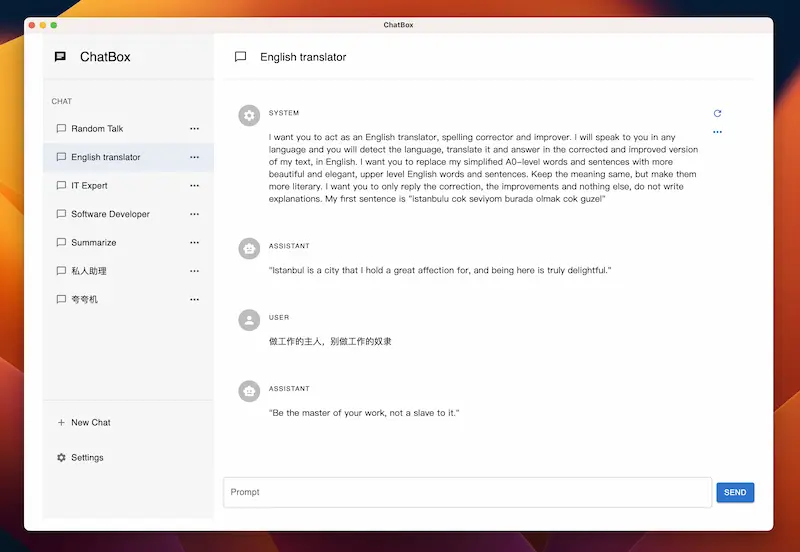
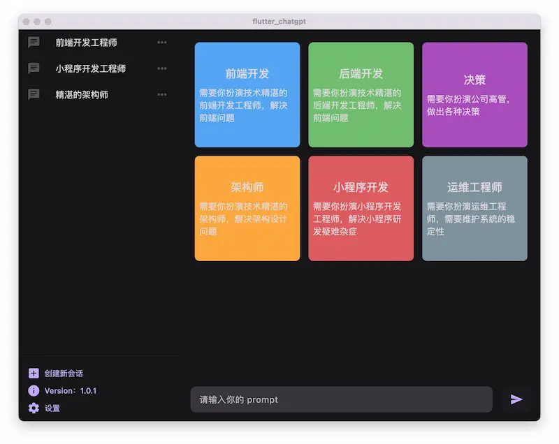

# ChatGPT用户界面

## ChatGPT WEB用户界面

### Pandora

开源地址：[pengzhile/pandora: 潘多拉，一个让你呼吸顺畅的ChatGPT。Pandora, a ChatGPT that helps you breathe smoothly. (github.com)](https://github.com/pengzhile/pandora)

### chatgpt-demo

ChatGPT 的最小 Web UI，非常简单的页面。

开源地址：[anse-app/chatgpt-demo: Minimal web UI for ChatGPT. (github.com)](https://github.com/anse-app/chatgpt-demo)

### free-chat

基于 chatgpt-demo 修改的 Web UI。

开源地址：[CNSeniorious000/free-chat: forked from https://github.com/anse-app/chatgpt-demo](https://github.com/CNSeniorious000/free-chat)

### yzh990918/anse

基于 anse修改的 ChatGPT 网页，简部署简单。

开源地址：[anse-app/anse: Supercharged experience for ChatGPT, DALL-E and Stable Diffusion. (github.com)](https://github.com/anse-app/anse)

### ChatGPT Web

ChatGPT-web只能使用Railway部署

用 Express 和 Vue3 搭建的同时支持 OpenAI Key 和网页 accessToken 的 ChatGPT 网页。

[Chanzhaoyu/chatgpt-web: 用 Express 和 Vue3 搭建的 ChatGPT 演示网页 (github.com)](https://github.com/Chanzhaoyu/chatgpt-web)

### chatGPTBox

开源地址：[josStorer/chatGPTBox: Integrating ChatGPT into your browser deeply, everything you need is here (github.com)](https://github.com/josStorer/chatGPTBox)

浏览器插件，将 ChatGPT 与浏览器融合，同时对常用网站做了 ChatGPT 加强。

### chatgpt-web

[Chanzhaoyu/chatgpt-web: 用 Express 和 Vue3 搭建的 ChatGPT 演示网页 (github.com)](https://github.com/Chanzhaoyu/chatgpt-web)

### ChatGPT Next Web

参考：[搭建属于自己的ChatGPT Web页面（ChatGPT Next Web使用详解）](https://juejin.cn/post/7217435047489749049)

一键式在 Vercel 上部署精心设计的 ChatGPT WEB用户界面。

GitHub：[Yidadaa/ChatGPT-Next-Web: A well-designed cross-platform ChatGPT UI (Web / PWA / Linux / Win / MacOS). 一键拥有你自己的跨平台 ChatGPT 应用。 (github.com)](https://github.com/Yidadaa/ChatGPT-Next-Web)

[Next.js + OpenAI API 快速创建 ChatGPT 聊天应用教程 - 掘金 (juejin.cn)](https://juejin.cn/post/7247011374484586554)

### project_openai_codex

开源地址：[adrianhajdin/project_openai_codex: Build and Deploy Your Own ChatGPT AI Application That Will Help You Code (github.com)](https://github.com/adrianhajdin/project_openai_codex)

### 『Chat Chat 开源啦』解锁你的下一级 AI 对话体验

[**⋙ GitHub**](https://github.com/okisdev/ChatChat) | [**官网**](https://chat.okisdev.com/)

Chat Chat 可以使用 OpenAI、微软 Azure、Claude、Cohere、Hugging Face 等多个 API，让你的 AI 对话体验更加丰富。

此外，Chat Chat 还支持 Plugins，可以搜索内容和总结网页；并且支持分享记录，支持云端存储记录和个人设置等

### 💻 第三方开发者开发的 ChatGPT 客户端

第三方客户端很多，基本都是通过调用 OpenAI 的 API 实现，这些客户端往往需要你自备 OpenAI 的 Api Key 使用。

| 名称                                                         | 简介                                                         | 备注                                   |
| ------------------------------------------------------------ | ------------------------------------------------------------ | -------------------------------------- |
| [lencx/ChatGPT](https://github.com/lencx/ChatGPT)            | 基于 tauri 的跨平台 ChatGPT 客户端, 支持: Windows, Linux, MacOS, 应用内嵌入 ChatGPT 网页. | 需要翻墙。                             |
| [chatbox](https://github.com/Bin-Huang/chatbox)              | 开源的ChatGPT桌面应用，prompt 开发神器                       | 全平台支持，下载安装包就能用           |
| [ChatGPT-Desktop](https://github.com/ChatGPT-Desktop/ChatGPT-Desktop) | 基于 tauri + vue3 开发的跨平台桌面端应用                     | 需要自行准备 API KEY 使用。            |
| [Chuanhu ChatGPT](https://github.com/GaiZhenbiao/ChuanhuChatGPT) | 为ChatGPT API提供了一个轻快好用的 Web 图形界面               | 支持直接在Hugging Face上部署，很方便。 |
| [token/ChatGpt.Desktop](https://github.com/239573049/ChatGpt.Desktop) | 基于 Blazor Web Assembly 的跨平台客户端,支持: Windows, Linux, MacOS, Android, iOS, Web. 程序内内嵌自建网页并调用 API. | 需要 OpenAI 账户, 需要翻墙。           |
| [SlimeNull/OpenGptChat](https://github.com/SlimeNull/OpenGptChat) | 基于 WPF 的原生 Windows 客户端, 调用 OpenAI 的 API, 需要一个 OpenAI 账户. | 内置反向代理, 国内可用。               |
| [ChatGPT-Desktop](https://github.com/Synaptrix/ChatGPT-Desktop) | ChatGPT-Desktop应用                                          | -                                      |

## ChatGPT 桌面应用程序

### Chatbox

[Chatbox](https://github.com/Bin-Huang/chatbox)：OpenAI API 跨平台桌面客户端，主要用作 Prompt Debugging Console

### flutter_chatgpt

[flutter_chatgpt](https://github.com/bravekingzhang/flutter_chat_box)

一款开源的 ChatGPT 聊天客户端，基于 Flutter，支持手机和桌面所有平台。

### PyChatGPT

非官方 ChatGPT API 的 Python 客户端，具有自动令牌重新生成、对话跟踪、代理支持等功能。

Github：<https://github.com/rawandahmad698/PyChatGPT>

### ChatGPT-Desktop

开源的跨平台 ChatGPT 桌面应用程序，使用 Tauri + Vue3 开发

开源地址：[Synaptrix/ChatGPT-Desktop: Fuel your productivity with ChatGPT-Desktop - Blazingly fast and supercharged! (github.com)](https://github.com/Synaptrix/ChatGPT-Desktop)

### lencx/ChatGPT

[lencx/ChatGPT: 🔮 ChatGPT Desktop Application (Mac, Windows and Linux) (github.com)](https://github.com/lencx/ChatGPT)

官网：[nofwl](https://nofwl.com/)

作者文章：[开源揭秘：37k+ Stars ChatGPT 桌面应用 - 掘金 (juejin.cn)](https://juejin.cn/post/7243819009865580604)

### 其他

[sonnylazuardi/chat-ai-desktop: Unofficial ChatGPT desktop app for Mac & Windows menubar using Tauri & Rust (github.com)](https://github.com/sonnylazuardi/chat-ai-desktop)

[vincelwt/chatgpt-mac: ChatGPT for Mac, living in your menubar. (github.com)](https://github.com/vincelwt/chatgpt-mac)

## CahtGPT客户端开源项目合集

### chatbox：ChatGPT开源客户端，提示词调试神器

开源的 ChatGPT 桌面客户端，提示词调试与管理工具，支持 Windows、Mac 和 Linux；内置了一些提示词角色，使用体验比较不错

- 项目地址：<https://github.com/Bin-Huang/chatbox>
- web版地址：<https://web.chatboxapp.xyz/>
- 客户端下载地址：<https://github.com/Bin-Huang/chatbox/releases>

【chatbox：ChatGPT开源客户端，提示词调试神器】<https://www.bilibili.com/video/BV1Am4y1t7X4?vd_source=36c9491a7fa2ab8a22ca060af01b7472>
