# 如何快速创建一个 ChatGPT 机器人

ChatGPT搭建微信聊天机器人：[zhayujie/chatgpt-on-wechat: Wechat robot based on ChatGPT, which using OpenAI api and itchat library. 使用ChatGPT搭建微信聊天机器人，基于GPT3.5/4.0 API实现，支持个人微信、公众号、企业微信部署，能处理文本、语音和图片，访问操作系统和互联网。 (github.com)](https://github.com/zhayujie/chatgpt-on-wechat)

[bupticybee/ChineseAiDungeonChatGPT: 中文版的ai地牢，直接使用的openai的ChatGPT api作为讲故事的模型。 (github.com)](https://github.com/bupticybee/ChineseAiDungeonChatGPT)

## GPT4All：ChatGPT本地私有化部署,终生免费

### GPT4All是什么

根据官方网站GPT4All的描述，它是一个免费使用、本地运行的、注重隐私的聊天机器人。不需要GPU或互联网。

GTP4All是一个生态系统，用于训练和部署在消费级CPU上本地运行的强大且定制的大型语言模型。

我们的GPT4All模型是一个4GB的文件，您可以下载并连接到GPT4All开源生态系统软件中。Nomic AI提供高质量和安全的软件生态系统，努力实现个人和组织轻松训练和本地实施自己的大型语言模型。

### 它是如何工作的？

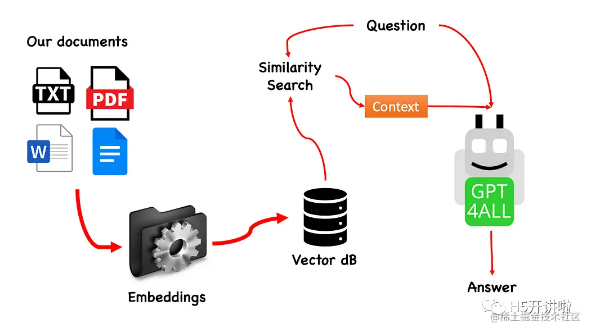

该过程非常简单（当您了解之后），并且可以在其他模型上重复。具体步骤如下：

- 加载GPT4All模型
- 使用Langchain检索并加载我们的文档
- 将文档分割成小块，以便嵌入式能够理解
- 使用FAISS根据我们要传递给GPT4All的问题创建嵌入式向量数据库
- 在基于问题的语境中在嵌入式向量数据库上执行相似性搜索（语义搜索）：这将作为我们问题的上下文
- 使用Langchain将问题和上下文提供给GPT4All，并等待答案。

所以我们需要的是嵌入式向量。嵌入式向量是一条信息的数值表示，例如文本、文档、图像、音频等。该表示捕捉了被嵌入的语义含义，这正是我们所需要的。对于这个项目，我们无法依赖于重型GPU模型：因此，我们将下载Alpaca原生模型，并使用Langchain中的LlamaCppEmbeddings。不用担心！每一步都有详细的解释。

### Let’s start coding

**创建虚拟环境**:

为你的新Python项目创建一个新的文件夹，例如GPT4ALL_Fabio（请用你的名字替换Fabio）：

```python
mkdir GPT4ALL_Fabiocd GPT4ALL_Fabio
```

接下来，创建一个新的Python虚拟环境。如果你安装了多个Python版本，请指定你想要使用的版本。在这个例子中，我将使用与Python 3.10关联的主要安装。

```python
python3 -m venv .venv
```

命令python3 -m venv .venv创建了一个名为.venv的新虚拟环境（点号会创建一个名为venv的隐藏目录）。

虚拟环境提供了一个隔离的Python安装环境，允许你仅针对特定项目安装软件包和依赖项，而不会影响系统范围的Python安装或其他项目。这种隔离有助于保持一致性，并防止不同项目需求之间的潜在冲突。

一旦虚拟环境创建好了，你可以使用以下命令来激活它：

```python
source .venv/bin/activate
```

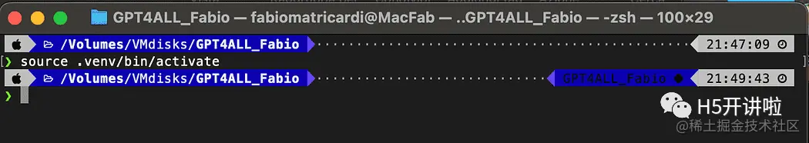

**安装依赖**:

对于我们正在构建的项目，我们不需要太多的软件包。我们只需要以下几个：

- GPT4All的Python绑定
- Langchain用于与我们的文档交互

```python
pip install pygpt4all==1.0.1
pip install pyllamacpp==1.0.6
pip install langchain==0.0.149
pip install unstructured==0.6.5
pip install pdf2image==1.16.3
pip install pytesseract==0.3.10
pip install pypdf==3.8.1
pip install faiss-cpu==1.7.4
```

对于LangChain，你可以看到我们指定了版本号。这个库最近正在接受很多更新，所以为了确保我们的设置明天也能正常工作，最好指定一个我们知道能正常工作的版本。Unstructured是pdf加载器、pytesseract和pdf2image的必需依赖库。

注意：GitHub存储库中有一个requirements.txt文件，其中包含与此项目相关的所有版本。你可以在将其下载到主项目文件目录后，使用以下命令一次性进行安装：

```python
pip install -r requirements.txt
```

请记住，某些库有根据你在虚拟环境中运行的Python版本提供的不同版本可用。

**下载模型**:

这是一个非常重要的步骤。

对于这个项目，我们当然需要

GPT4All模型。在Nomic AI网站上描述的过程非常复杂，并且需要一些我们不一定都拥有的硬件（比如我）。所以这里是已经转换并准备好使用的模型链接。只需点击下载。

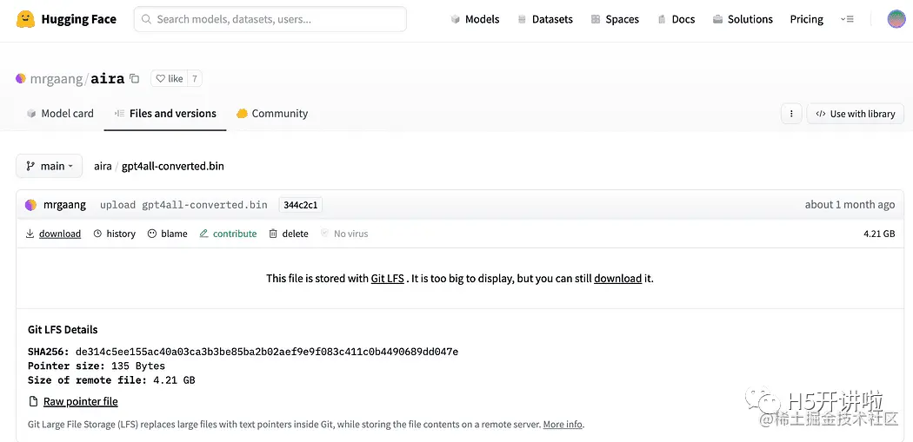

正如简介中简要描述的，我们还需要嵌入模型，这是一个可以在我们的CPU上运行而不会崩溃的模型。点击这里的链接【[huggingface.co/Pi3141/alpa…](https://huggingface.co/Pi3141/alpaca-native-7B-ggml/blob/397e872bf4c83f4c642317a5bf65ce84a105786e/ggml-model-q4_0.bin%E3%80%91%E4%B8%8B%E8%BD%BD%E5%B7%B2%E7%BB%8F%E8%BD%AC%E6%8D%A2%E4%B8%BA4%E4%BD%8D%E5%B9%B6%E5%87%86%E5%A4%87%E5%A5%BD%E7%94%A8%E4%BD%9C%E5%B5%8C%E5%85%A5%E6%A8%A1%E5%9E%8B%E7%9A%84alpaca-native-7B-ggml%E6%A8%A1%E5%9E%8B%E3%80%82)

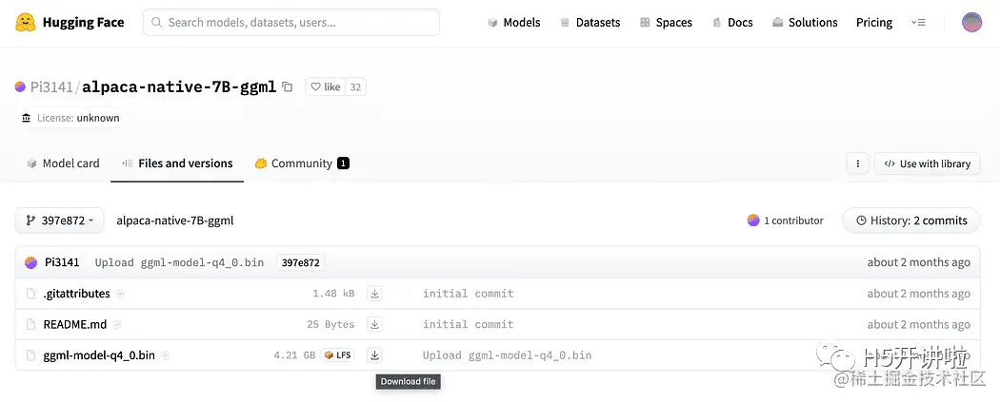

为什么我们需要嵌入？如果你还记得流程图中的第一步，在收集知识库文档之后，我们需要将它们嵌入。LLamaCPP嵌入来自Alpaca模型，非常适合这项工作，而且这个模型也很小（4 GB）。顺便说一下，你也可以在问答环节中使用Alpaca模型！

2023.05.25更新：Mani Windows用户在使用llamaCPP嵌入时遇到了问题。这主要是因为在安装python包llama-cpp-python时使用了以下命令：

```python
pip install llama-cpp-python
```

这个命令会从源代码编译库。通常Windows上的机器默认没有安装CMake或C编译器。但不要担心，有解决办法。

在Windows上运行llama-cpp-python的安装过程时，需要编译源代码，但由于Windows默认没有安装CMake和C编译器，因此无法从源代码构建。

在Mac用户使用Xtools和Linux用户上，通常操作系统中已经安装了C编译器。

**为了避免问题，你必须使用预编译的wheel。**

访问[github.com/abetlen/lla…](https://github.com/abetlen/llama-cpp-python/releases)

找到适用于你架构和Python版本的预编译的wheel版本，你必须选择0.1.49版本，因为更高的版本不兼容。

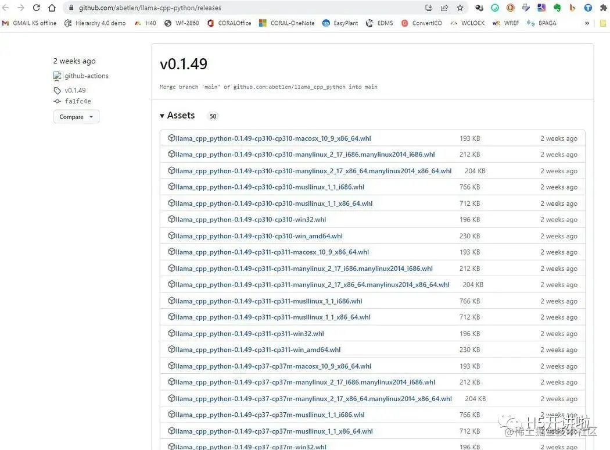

在我这里，我使用的是Windows 10 64位，Python 3.10

所以我的文件是llama_cpp_python-0.1.49-cp310-cp310-win_amd64.whl

这个问题在GitHub存储库中有记录【[github.com/fabiomatric…](https://github.com/fabiomatricardi/GPT4All_Medium/issues/2%E3%80%91%E3%80%82)

下载完成后，你需要将这两个模型文件放到models目录中，如下所示。

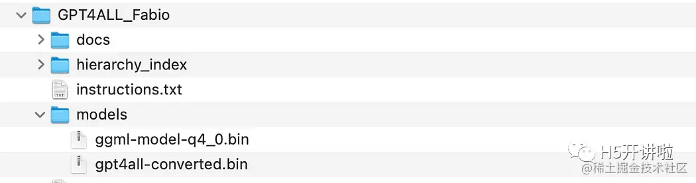

目录结构和放置模型文件的位置

### 与GPT4All的基本交互

由于我们想要对GPT模型的交互进行控制，我们需要创建一个Python文件（我们称之为pygpt4all_test.py），导入依赖项并给模型发送指令。你会发现这很容易。

```python
from pygpt4all.models.gpt4all import GPT4All
```

这是我们模型的Python绑定。现在我们可以调用它并开始提问。让我们试一个有创意的问题。

我们创建一个函数来读取模型的回调，并要求GPT4All完成我们的句子。

```python
def new_text_callback(text):
    print(text, end="")

model = GPT4All('./models/gpt4all-converted.bin')
model.generate("Once upon a time, ", n_predict=55, new_text_callback=new_text_callback)
```

第一条语句告诉我们的程序在哪里找到模型（记住我们在上面的部分所做的事情）。

第二条语句要求模型生成一个回答，并完成我们的提示文本 "Once upon a time,"。

要运行它，请确保虚拟环境仍处于激活状态，然后简单地运行：

```python
python3 pygpt4all_test.py
```

你应该会看到模型正在加载的文本和句子的完成。根据你的硬件资源，这可能需要一些时间。

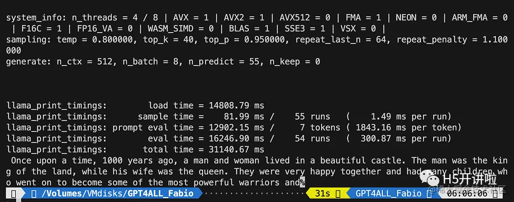

结果可能与你的不同... 但对我们来说重要的是它正在工作，我们可以继续使用LangChain创建一些高级功能。

注意（更新于2023.05.23）：如果你遇到与pygpt4all相关的错误，请查看故障排除部分，其中提供了由Rajneesh Aggarwal或Oscar Jeong给出的解决方案。

### LangChain在GPT4All上的模板

LangChain框架是一个非常强大的库。它提供了组件，以一种易于使用的方式与语言模型进行交互，并且还提供了Chains。可以将Chains视为以特定方式组装这些组件，以最好地完成特定的用例。它们旨在成为一个更高级的接口，使人们能够轻松地开始使用特定的用例。这些Chains也可以进行定制。

在我们的下一个Python测试中，我们将使用一个Prompt Template。语言模型接受文本作为输入，这段文本通常被称为prompt。通常情况下，这不仅仅是一个硬编码的字符串，而是模板、示例和用户输入的组合。LangChain提供了多个类和函数，使构建和处理prompt变得简单。让我们看看如何实现。

创建一个新的Python文件，命名为my_langchain.py。

```python
# Import of langchain Prompt Template and Chain
from langchain import PromptTemplate, LLMChain

# Import llm to be able to interact with GPT4All directly from langchain
from langchain.llms import GPT4All

# Callbacks manager is required for the response handling 
from langchain.callbacks.base import CallbackManager
from langchain.callbacks.streaming_stdout import StreamingStdOutCallbackHandler

local_path = './models/gpt4all-converted.bin' 
callback_manager = CallbackManager([StreamingStdOutCallbackHandler()])
```

我们从LangChain中导入了Prompt Template和Chain，以及GPT4All llm类，以便能够直接与我们的GPT模型进行交互。

然后，在设置了llm路径之后（与之前一样），我们实例化了回调管理器，以便能够捕获我们查询的响应。

创建一个模板非常简单：根据文档教程，我们可以使用如下代码：

```python
template = """Question: {question}

Answer: Let's think step by step on it.

"""
prompt = PromptTemplate(template=template, input_variables=["question"])
```

template变量是一个多行字符串，包含了与模型的交互结构：在花括号中插入模板的外部变量，对于我们的情况就是问题。

由于它是一个变量，你可以决定它是一个硬编码的问题还是用户输入的问题：这里是两个示例。

```python
# Hardcoded question
question = "What Formula 1 pilot won the championship in the year Leonardo di Caprio was born?"

# User input question...
question = input("Enter your question: ")
```

对于我们的测试运行，我们将注释掉用户输入的问题。现在我们只需要将我们的模板、问题和语言模型连接在一起。

```python
template = """Question: {question}
Answer: Let's think step by step on it.
"""

prompt = PromptTemplate(template=template, input_variables=["question"])

# initialize the GPT4All instance
llm = GPT4All(model=local_path, callback_manager=callback_manager, verbose=True)

# link the language model with our prompt template
llm_chain = LLMChain(prompt=prompt, llm=llm)

# Hardcoded question
question = "What Formula 1 pilot won the championship in the year Leonardo di Caprio was born?"

# User imput question...
# question = input("Enter your question: ")

#Run the query and get the results
llm_chain.run(question)
```

记得验证你的虚拟环境仍然处于激活状态，并运行以下命令：

```python
python3 my_langchain.py
```

你可能会得到与我不同的结果。令人惊奇的是，你可以看到GPT4All在尝试为你找到答案时所遵循的整个推理过程。调整问题可能会得到更好的结果。

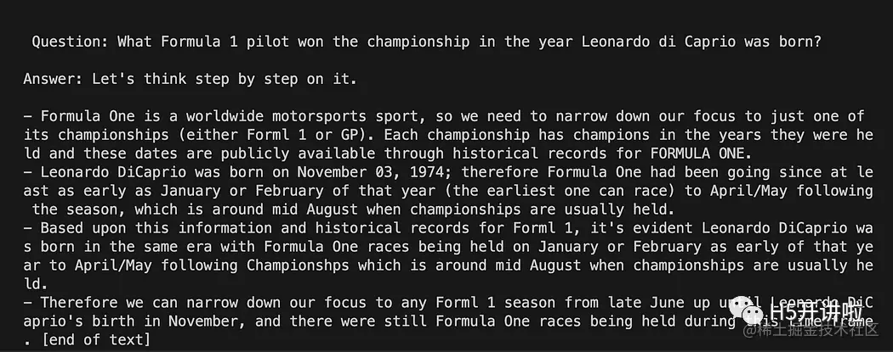

### 使用LangChain和GPT4All回答关于文件的问题

在这里，我们开始了令人惊奇的部分，因为我们将使用GPT4All作为一个聊天机器人来回答我们的问题。

根据与GPT4All进行问答的工作流程，我们需要加载我们的PDF文件，并将其分成块。接下来，我们需要为我们的嵌入向量准备一个向量存储库。我们需要将我们的分块文档输入到向量存储库中进行信息检索，然后将它们与该数据库上的相似性搜索一起作为LLM查询的上下文进行嵌入。

为此，我们将直接使用Langchain库中的FAISS。FAISS是Facebook AI Research开发的开源库，旨在快速在大规模高维数据集中查找相似项。它提供索引和搜索方法，使得在数据集中快速找到最相似的项变得更加简单和快速。对我们来说特别方便的是，它简化了信息检索，并允许我们本地保存创建的数据库：这意味着在第一次创建后，将非常快速地加载数据库以供以后使用。

**创建向量索引数据库**:

创建一个新的文件叫做 my_knowledge_qna.py：

```python
from langchain import PromptTemplate, LLMChain
from langchain.llms import GPT4All
from langchain.callbacks.base import CallbackManager
from langchain.callbacks.streaming_stdout import StreamingStdOutCallbackHandler

# function for loading only TXT files
from langchain.document_loaders import TextLoader

# text splitter for create chunks
from langchain.text_splitter import RecursiveCharacterTextSplitter

# to be able to load the pdf files
from langchain.document_loaders import UnstructuredPDFLoader
from langchain.document_loaders import PyPDFLoader
from langchain.document_loaders import DirectoryLoader

# Vector Store Index to create our database about our knowledge
from langchain.indexes import VectorstoreIndexCreator

# LLamaCpp embeddings from the Alpaca model
from langchain.embeddings import LlamaCppEmbeddings

# FAISS  library for similaarity search
from langchain.vectorstores.faiss import FAISS

import os  #for interaaction with the files
import datetime
```

第一组库与之前使用的相同：另外我们使用Langchain进行向量存储索引的创建，使用LlamaCppEmbeddings与我们的Alpaca模型进行交互（使用cpp库进行4位量化和编译），以及PDF加载器。

我们还要加载具有自己路径的LLMs：一个用于嵌入和一个用于文本生成。

```python
# assign the path for the 2 models GPT4All and Alpaca for the embeddings 
gpt4all_path = './models/gpt4all-converted.bin' 
llama_path = './models/ggml-model-q4_0.bin' 
# Calback manager for handling the calls with  the model
callback_manager = CallbackManager([StreamingStdOutCallbackHandler()])

# create the embedding object
embeddings = LlamaCppEmbeddings(model_path=llama_path)
# create the GPT4All llm object
llm = GPT4All(model=gpt4all_path, callback_manager=callback_manager, verbose=True)
```

为了测试，让我们看看是否成功读取了所有的PDF文件：第一步是声明三个函数，用于处理每个单独的文档。第一个函数是将提取的文本分割成块，第二个函数是创建带有元数据的向量索引（例如页码等），最后一个函数是用于测试相似性搜索（稍后我将更详细地解释）。

```python
# Split text 
def split_chunks(sources):
    chunks = []
    splitter = RecursiveCharacterTextSplitter(chunk_size=256, chunk_overlap=32)
    for chunk in splitter.split_documents(sources):
        chunks.append(chunk)
    return chunks


def create_index(chunks):
    texts = [doc.page_content for doc in chunks]
    metadatas = [doc.metadata for doc in chunks]

    search_index = FAISS.from_texts(texts, embeddings, metadatas=metadatas)

    return search_index


def similarity_search(query, index):
    # k is the number of similarity searched that matches the query
    # default is 4
    matched_docs = index.similarity_search(query, k=3) 
    sources = []
    for doc in matched_docs:
        sources.append(
            {
                "page_content": doc.page_content,
                "metadata": doc.metadata,
            }
        )

    return matched_docs, sources
```

现在我们可以测试文档目录中的索引生成：我们需要将所有的PDF文件放在那里。Langchain还有一种加载整个文件夹的方法，不论文件类型如何：由于后续处理比较复杂，我将在下一篇关于LaMini模型的文章中介绍。

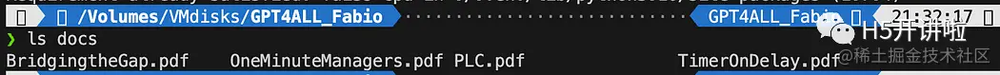

我们将把这些函数应用到列表中的第一个文档上。

```python
# get the list of pdf files from the docs directory into a list  format
pdf_folder_path = './docs'
doc_list = [s for s in os.listdir(pdf_folder_path) if s.endswith('.pdf')]
num_of_docs = len(doc_list)
# create a loader for the PDFs from the path
loader = PyPDFLoader(os.path.join(pdf_folder_path, doc_list[0]))
# load the documents with Langchain
docs = loader.load()
# Split in chunks
chunks = split_chunks(docs)
# create the db vector index
db0 = create_index(chunks)
```

在第一行中，我们使用os库来获取docs目录中的PDF文件列表。然后，我们使用Langchain加载docs文件夹中的第一个文档（doc_list[0]），将其分割成块，然后使用LLama嵌入创建向量数据库。

正如您所看到的，我们使用了pyPDF方法。这个方法稍微复杂一些，因为您需要逐个加载文件，但是使用pypdf将PDF加载到文档数组中使您能够得到一个数组，其中每个文档都包含页面内容和带有页码的元数据。当您想要知道我们将通过查询提供给GPT4All的上下文的来源时，这非常方便。以下是来自readthedocs的示例：

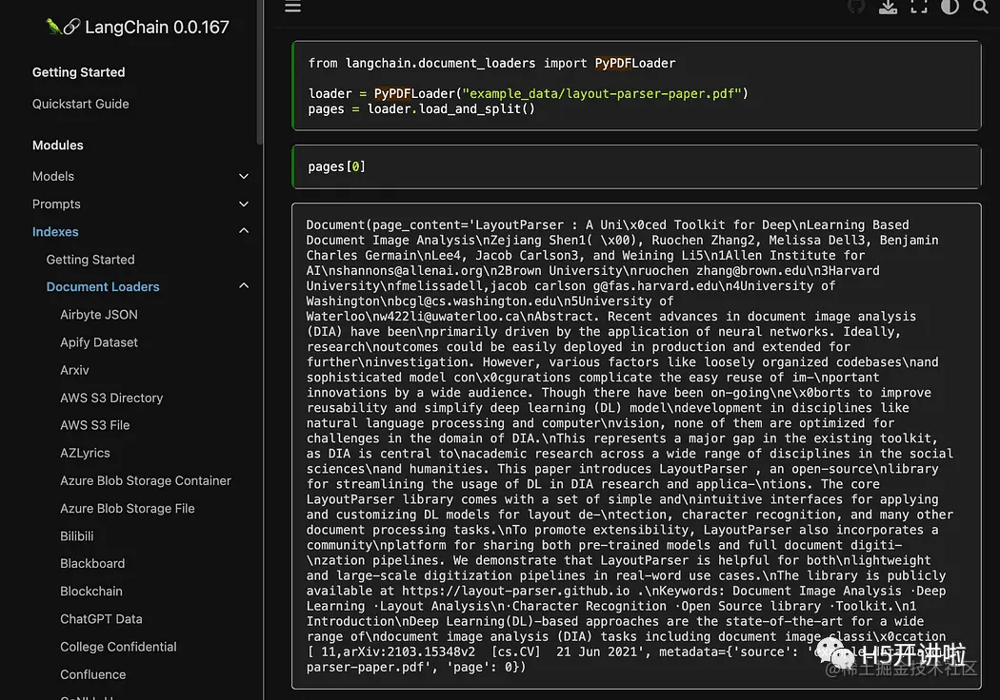

然后执行下面的命令运行：

```python
python3 my_knowledge_qna.py
```

在加载用于嵌入的模型之后，您将看到令牌在索引中的工作方式：不要惊慌，因为这需要时间，特别是如果您只在CPU上运行，就像我一样（这需要8分钟）。

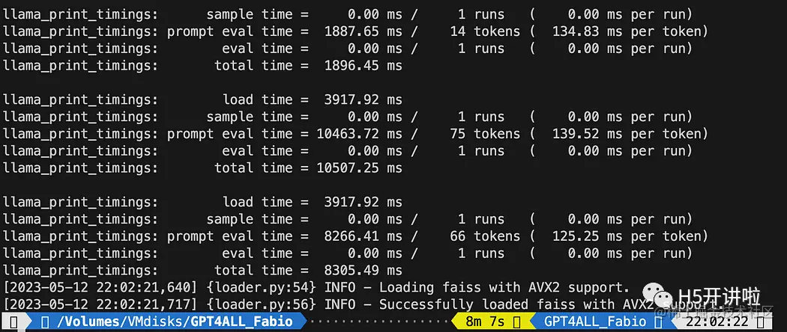

正如我之前解释的，pyPDF方法较慢，但为我们提供了用于相似性搜索的额外数据。为了遍历所有文件，我们将使用FAISS中的一种便捷方法，它允许我们将不同的数据库合并在一起。现在我们做的是使用上面的代码生成第一个数据库（我们将其称为db0），然后使用for循环创建列表中下一个文件的索引，并立即将其与db0合并。

以下是代码：请注意，我添加了一些日志，以便使用datetime.datetime.now()提供进度状态，并打印结束时间和开始时间的差值来计算操作所需的时间（如果您不喜欢，可以将其删除）。

合并指令如下：

```python
# merge dbi with the existing db0db0.merge_from(dbi)
```

最后一条指令是将我们的数据库保存到本地：整个生成过程可能需要数小时（取决于文档的数量），所以我们只需执行一次这个操作非常好！

```python
# Save the databasae locallydb0.save_local("my_faiss_index")
```

以下是完整的代码。当我们与GPT4All互动并直接从文件夹加载索引时，我们将对其中许多部分进行注释。

```python
# get the list of pdf files from the docs directory into a list  format
pdf_folder_path = './docs'
doc_list = [s for s in os.listdir(pdf_folder_path) if s.endswith('.pdf')]
num_of_docs = len(doc_list)
# create a loader for the PDFs from the path
general_start = datetime.datetime.now() #not used now but useful
print("starting the loop...")
loop_start = datetime.datetime.now() #not used now but useful
print("generating fist vector database and then iterate with .merge_from")
loader = PyPDFLoader(os.path.join(pdf_folder_path, doc_list[0]))
docs = loader.load()
chunks = split_chunks(docs)
db0 = create_index(chunks)
print("Main Vector database created. Start iteration and merging...")
for i in range(1,num_of_docs):
    print(doc_list[i])
    print(f"loop position {i}")
    loader = PyPDFLoader(os.path.join(pdf_folder_path, doc_list[i]))
    start = datetime.datetime.now() #not used now but useful
    docs = loader.load()
    chunks = split_chunks(docs)
    dbi = create_index(chunks)
    print("start merging with db0...")
    db0.merge_from(dbi)
    end = datetime.datetime.now() #not used now but useful
    elapsed = end - start #not used now but useful
    #total time
    print(f"completed in {elapsed}")
    print("-----------------------------------")
loop_end = datetime.datetime.now() #not used now but useful
loop_elapsed = loop_end - loop_start #not used now but useful
print(f"All documents processed in {loop_elapsed}")
print(f"the daatabase is done with {num_of_docs} subset of db index")
print("-----------------------------------")
print(f"Merging completed")
print("-----------------------------------")
print("Saving Merged Database Locally")
# Save the databasae locally
db0.save_local("my_faiss_index")
print("-----------------------------------")
print("merged database saved as my_faiss_index")
general_end = datetime.datetime.now() #not used now but useful
general_elapsed = general_end - general_start #not used now but useful
print(f"All indexing completed in {general_elapsed}")
print("-----------------------------------")
```

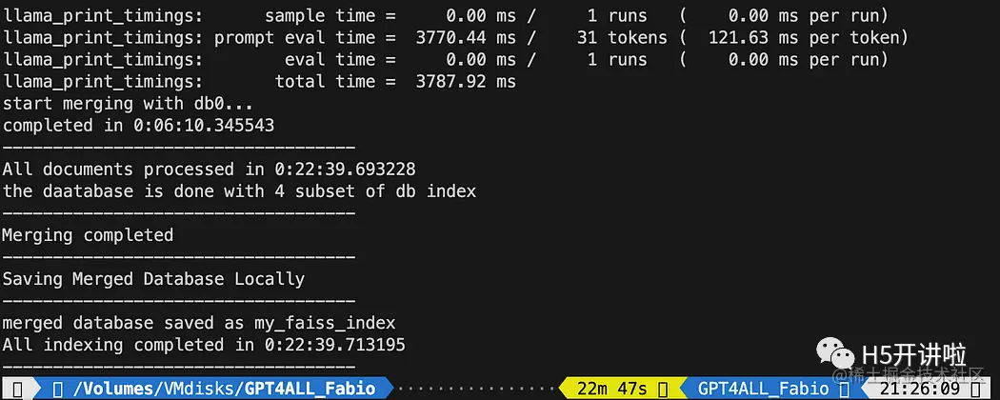

**向GPT4All提问关于您的文档的问题**:

现在我们到了这一步。我们有了我们的索引，我们可以加载它，并使用一个提示模板向GPT4All提问。我们先从一个硬编码的问题开始，然后循环遍历我们的输入问题。

将以下代码放入一个名为 db_loading.py 的 Python 文件中，并在终端中使用 python3 db_loading.py 命令运行它:

```python
from langchain import PromptTemplate, LLMChain
from langchain.llms import GPT4All
from langchain.callbacks.base import CallbackManager
from langchain.callbacks.streaming_stdout import StreamingStdOutCallbackHandler
# function for loading only TXT files
from langchain.document_loaders import TextLoader
# text splitter for create chunks
from langchain.text_splitter import RecursiveCharacterTextSplitter
# to be able to load the pdf files
from langchain.document_loaders import UnstructuredPDFLoader
from langchain.document_loaders import PyPDFLoader
from langchain.document_loaders import DirectoryLoader
# Vector Store Index to create our database about our knowledge
from langchain.indexes import VectorstoreIndexCreator
# LLamaCpp embeddings from the Alpaca model
from langchain.embeddings import LlamaCppEmbeddings
# FAISS  library for similaarity search
from langchain.vectorstores.faiss import FAISS
import os  #for interaaction with the files
import datetime

# TEST FOR SIMILARITY SEARCH

# assign the path for the 2 models GPT4All and Alpaca for the embeddings 
gpt4all_path = './models/gpt4all-converted.bin' 
llama_path = './models/ggml-model-q4_0.bin' 
# Calback manager for handling the calls with  the model
callback_manager = CallbackManager([StreamingStdOutCallbackHandler()])

# create the embedding object
embeddings = LlamaCppEmbeddings(model_path=llama_path)
# create the GPT4All llm object
llm = GPT4All(model=gpt4all_path, callback_manager=callback_manager, verbose=True)

# Split text 
def split_chunks(sources):
    chunks = []
    splitter = RecursiveCharacterTextSplitter(chunk_size=256, chunk_overlap=32)
    for chunk in splitter.split_documents(sources):
        chunks.append(chunk)
    return chunks


def create_index(chunks):
    texts = [doc.page_content for doc in chunks]
    metadatas = [doc.metadata for doc in chunks]

    search_index = FAISS.from_texts(texts, embeddings, metadatas=metadatas)

    return search_index


def similarity_search(query, index):
    # k is the number of similarity searched that matches the query
    # default is 4
    matched_docs = index.similarity_search(query, k=3) 
    sources = []
    for doc in matched_docs:
        sources.append(
            {
                "page_content": doc.page_content,
                "metadata": doc.metadata,
            }
        )

    return matched_docs, sources

# Load our local index vector db
index = FAISS.load_local("my_faiss_index", embeddings)
# Hardcoded question
query = "What is a PLC and what is the difference with a PC"
docs = index.similarity_search(query)
# Get the matches best 3 results - defined in the function k=3
print(f"The question is: {query}")
print("Here the result of the semantic search on the index, without GPT4All..")
print(docs[0])
```

打印的文本是与查询最匹配的前3个来源的列表，还提供了文档名称和页码。

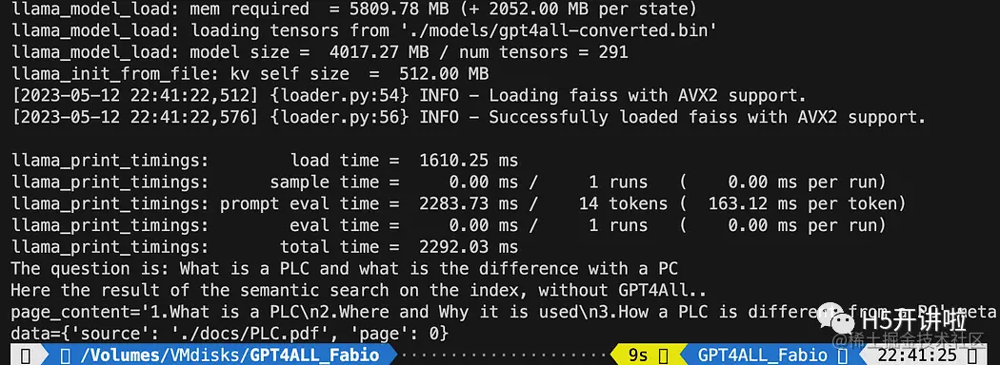

现在我们可以使用相似性搜索作为查询的上下文，使用提示模板。在这3个函数之后，只需将所有代码替换为以下内容：

```python
# Load our local index vector db
index = FAISS.load_local("my_faiss_index", embeddings)

# create the prompt template
template = """
Please use the following context to answer questions.
Context: {context}
---
Question: {question}
Answer: Let's think step by step."""

# Hardcoded question
question = "What is a PLC and what is the difference with a PC"
matched_docs, sources = similarity_search(question, index)
# Creating the context
context = "\n".join([doc.page_content for doc in matched_docs])
# instantiating the prompt template and the GPT4All chain
prompt = PromptTemplate(template=template, input_variables=["context", "question"]).partial(context=context)
llm_chain = LLMChain(prompt=prompt, llm=llm)
# Print the result
print(llm_chain.run(question))
```

运行之后你会得到一个这样的结果：

```vbnet
Please use the following context to answer questions.
Context: 1.What is a PLC
2.Where and Why it is used
3.How a PLC is different from a PC
PLC is especially important in industries where safety and reliability are
critical, such as manufacturing plants, chemical plants, and power plants.
How a PLC is different from a PC
Because a PLC is a specialized computer used in industrial and
manufacturing applications to control machinery and processes.,the
hardware components of a typical PLC must be able to interact with
industrial device. So a typical PLC hardware include:
---
Question: What is a PLC and what is the difference with a PC
Answer: Let's think step by step. 1) A Programmable Logic Controller (PLC), 
also called Industrial Control System or ICS, refers to an industrial computer 
that controls various automated processes such as manufacturing 
machines/assembly lines etcetera through sensors and actuators connected 
with it via inputs & outputs. It is a form of digital computers which has 
the ability for multiple instruction execution (MIE), built-in memory 
registers used by software routines, Input Output interface cards(IOC) 
to communicate with other devices electronically/digitally over networks 
or buses etcetera
2). A Programmable Logic Controller is widely utilized in industrial 
automation as it has the ability for more than one instruction execution. 
It can perform tasks automatically and programmed instructions, which allows 
it to carry out complex operations that are beyond a 
Personal Computer (PC) capacity. So an ICS/PLC contains built-in memory 
registers used by software routines or firmware codes etcetera but 
PC doesn't contain them so they need external interfaces such as 
hard disks drives(HDD), USB ports, serial and parallel 
communication protocols to store data for further analysis or 
report generation.
```

如果你希望使用用户输入来替换问题：

```python
question = "What is a PLC and what is the difference with a PC"
```

就像下面这样：

```python
question = input("Your question: ")
```

### 结论

现在是你进行实验的时候了。对与你的文档相关的所有主题提出不同的问题，并观察结果。在 Prompt 和模板方面，肯定还有很大的改进空间：你可以在这里找到一些灵感。而且 Langchain 的文档真的很棒（我都能够理解！）。

## MiniGPT-4

近日，来自阿卜杜拉国王科技大学的研究团队，便提出了一个具有类似 GPT-4 图像理解与对话能力的 AI 大模型——MiniGPT-4，并将其开源![[哇]](./assets/a18f9afe2c7e4788a8ea8ffd22ac51a0.webp)。

据介绍，MiniGPT-4 具有出色的多模态能力，如从手写草稿创建网站、生成详细的图像描述、根据图像创作故事和诗歌、为图像中描述的问题提供解决方案，以及根据食物照片教对话对象如何烹饪一道美味的菜品等![[让我看看]](./assets/a18f9afe2c7e4788a8ea8ffd22ac51a0.webp)。

在技术层面上，MiniGPT-4 由一个带有预训练的 ViT 和 Q-Former 的视觉编码器、一个单一的线性投影层和一个 Vicuna 大语言模型组成。而且，MiniGPT-4 只需要训练线性层，使视觉特征与 Vicuna 保持一致。

有 Y Combinator 用户这样评价 MiniGPT-4，“在技术层面上，他们正在做一些非常简单的事情......但结果非常惊人。最重要的是，它在 OpenAI 的 GPT-4 图像模态之前出现。（这是）开源 AI 的真正胜利。”

也有用户表示，“我认为他们为一个不相关的项目使用 GPT-4 名称是一种糟糕的形式。毕竟，底层的 Vicuna 只是一个微调的 LLaMA。另外，他们使用了较小的 13B 版本。然而，结果看起来很有趣。”

图文生成

本地电脑直接部署运行：要求显存12G

开源地址：<https://github.com/Vision-CAIR/MiniGPT-4>

项目体验地址：[minigpt-4.github.io/](https://minigpt-4.github.io/)

项目作者认为，GPT-4 所实现的多模态能力，在以前的视觉 - 语言模型中很少见，因此认为，GPT-4 先进的多模态生成能力，主要原因在于利用了更先进的大型语言模型。

为了验证这一想法，团队成员将一个冻结的视觉编码器与一个冻结的 Vicuna 进行对齐，造出了 MiniGPT-4。

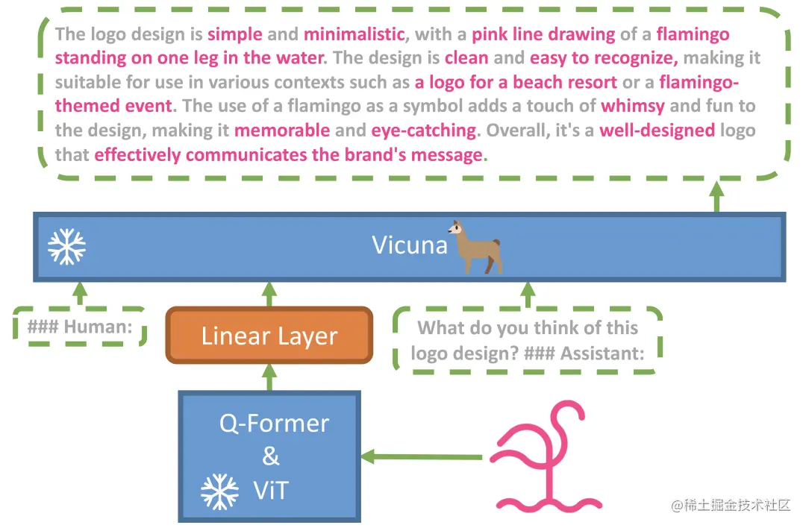

在研究中，他们发现 MiniGPT-4 具有许多类似于 GPT-4 的能力，如详细的图像描述生成、从手写草稿创建网站等。

不仅如此，他们还在研究中还收获了意想不到的惊喜，除了能实现上述功能之外，MiniGPT-4 还能根据图像创作故事和诗歌，为图像中显示的问题提供解决方案，教用户如何根据食物照片做饭等。

下面给大家看几个示例。

拍一张菜品图片，让 AI 自动帮你生成菜谱：

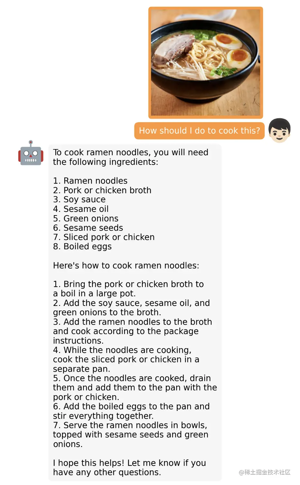

让 AI 描述图像内容：

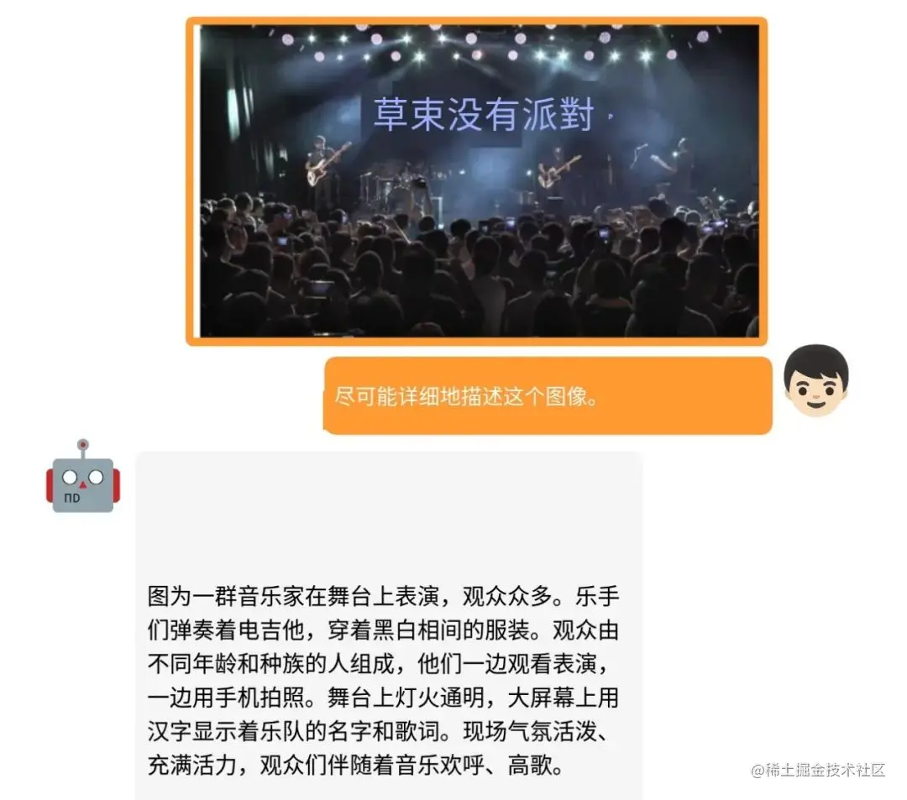

通过商品图，直接生成广告文案：

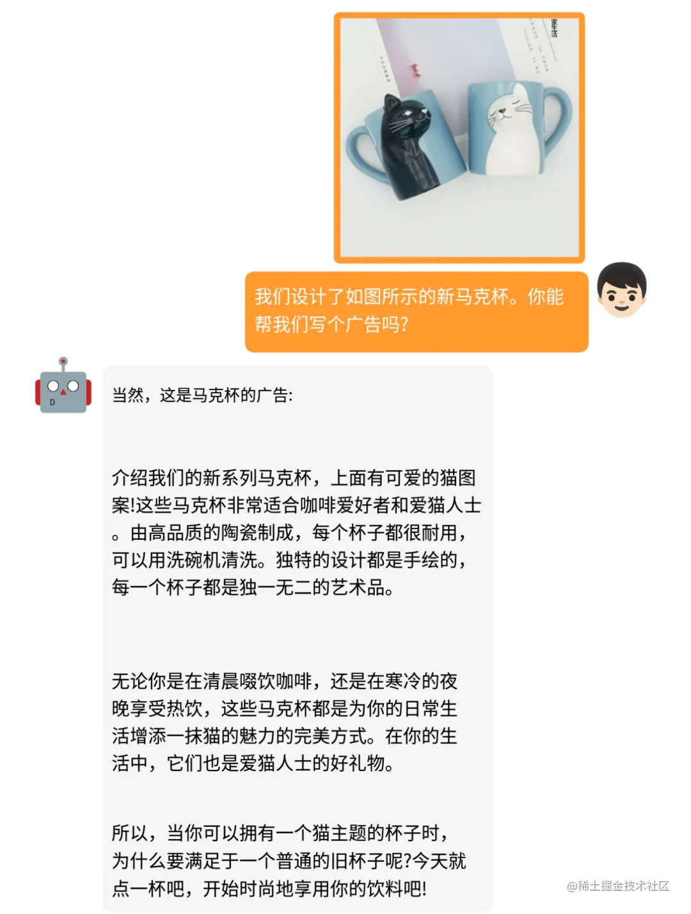

根据实验结果表明，GPT-4 这些先进的能力，理论上可以归因于它使用了更先进的大语言模型。

也就是说，未来在图像、声音、视频等领域，基于这些大语言模型所造出来的应用，其实际效果都不会太差。

这个项目证实了大语言模型在图像领域的可行性，接下来应该会有不少开发者入场，将 GPT-4 的能力进一步往音频、视频等领域延伸，进而让我们得以看到更多有趣、令人惊艳的 AI 应用。

迄今为止，GPT-4 凭借多模态能力已经成为 AI 领域备受关注的大模型，可以利用手写文本生成网站并且还能够识别出图片中的幽默元素，这些优秀的能力在以前的视觉语言模型中很难实现。那么能否利用目前比较先进的大型LLM进行微调从而尽可能达到GPT-4的性能呢？作者团队因此提出了MiniGPT-4。

经过验证，MiniGPT-4在文本方面可以达到90% ChatGPT的能力，在视觉感知方面，同样具备与GPT-4的多模态功能。 [**官网**](https://minigpt-4.github.io/) | [**GitHub**](https://github.com/Vision-CAIR/MiniGPT-4) | [**中文解读**](https://mp.weixin.qq.com/s/Ir3cg8HYOPP5upGIwolF1A)

## CyberWaifu开源聊天机器人 hatGPT+Claude

【【CyberWaifu开源发布，ChatGPT+Claude】我要给她完整的一生，引入思考链和记忆数据库】<https://www.bilibili.com/video/BV11V4y1z7rS?vd_source=36c9491a7fa2ab8a22ca060af01b7472>

开源地址：<https://github.com/Syan-Lin/CyberWaifu>

### 使用 Chato 搭建自己的知识库 | 轻松定制 ChatGPT 智能问答机器人

体验地址：<https://chato.cn/>

Chato是一款强大而易用的工具，能帮助你将垂直行业知识注入AI，并创建属于自己的AI助手。无需编程，通过上传文档或回答问题，Chato自动学习并建立知识库。你可以设定机器人角色、定制个性，并灵活发布到各渠道。

## ChatGPT实时语音聊天

ChatGPT+VITS+Galgame

【ChatGPT+Galgame 与老婆自由对话！】<https://www.bilibili.com/video/BV1TD4y1E7e8?vd_source=36c9491a7fa2ab8a22ca060af01b7472>

项目地址：<https://github.com/cjyaddone/ChatWaifu>
L2D版本：<https://github.com/cjyaddone/ChatWaifuL2D>
QQ机器人版本：<https://github.com/MuBai-He/ChatWaifu-marai>
