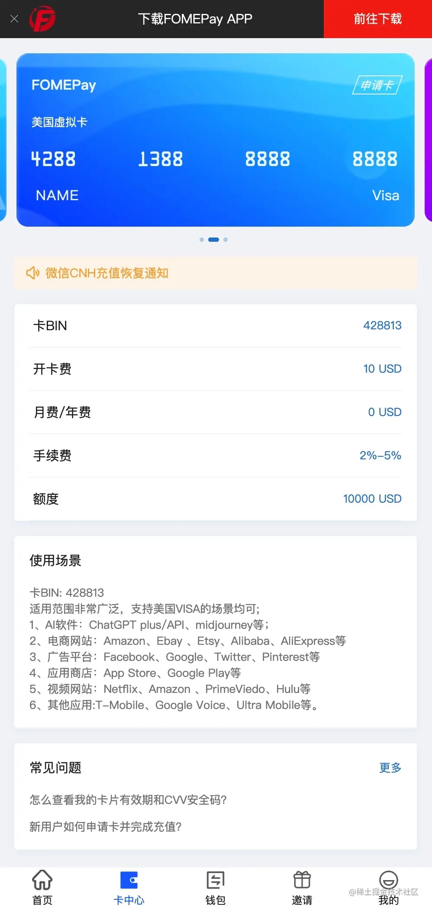
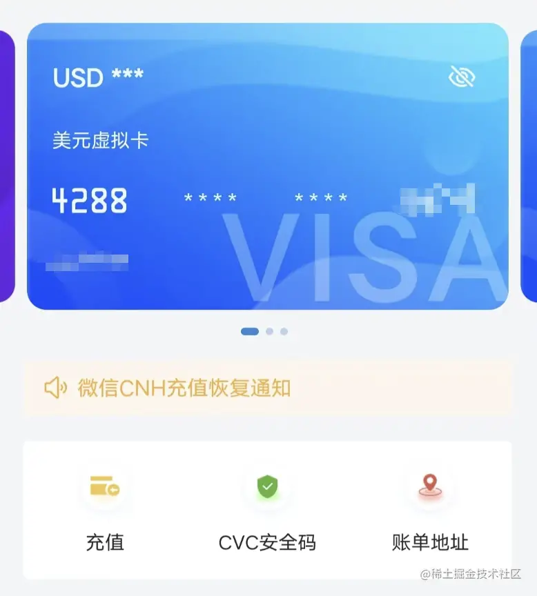
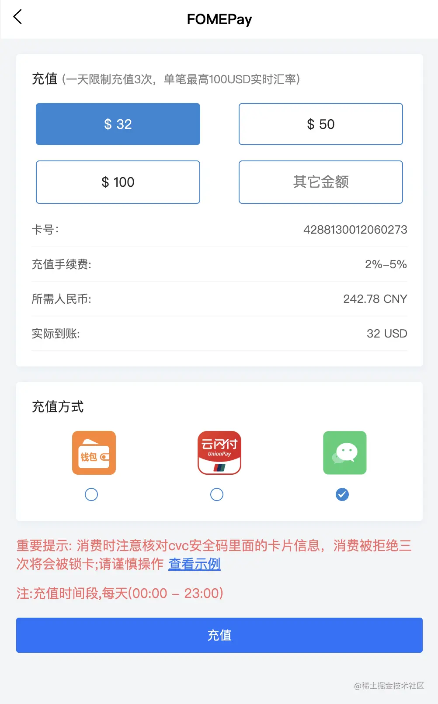
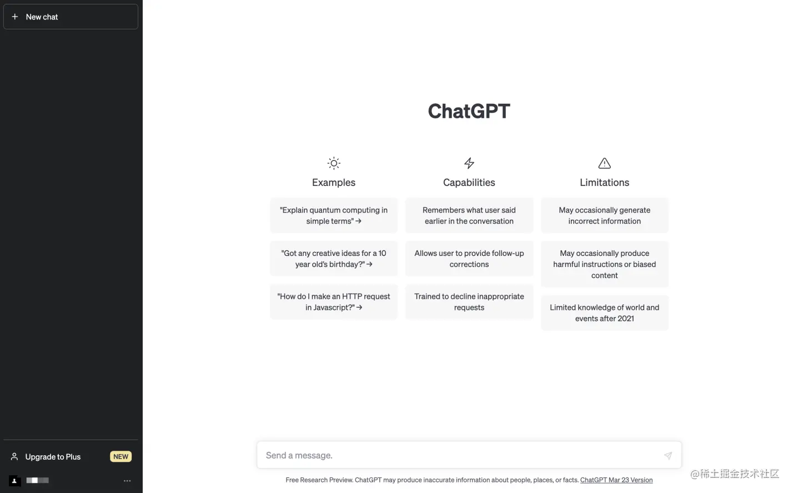
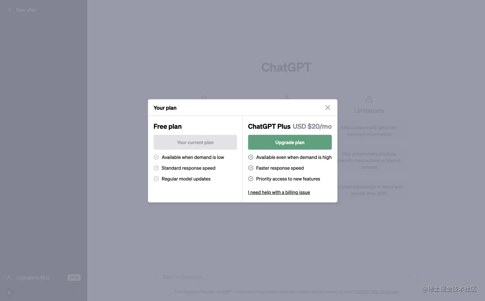
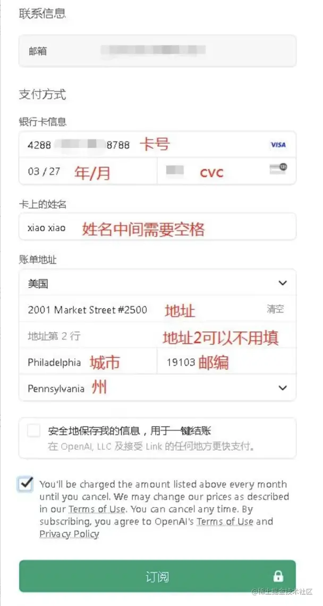

# 充值ChatGPT Plus

[亲测成功 如何用国内信用卡支付ChatGPT PLUS——通过Stripe Link实现续费订阅（9/15更新 ） - 知乎 (zhihu.com)](https://zhuanlan.zhihu.com/p/640502882)

使用 FOMEPay卡，开卡费需要 $10

很多优势：

- 注册方便，仅需手机号即可完成注册。
- 无需实名认证，这点非常重要，再也不用担心平台跑路信息被泄漏了。
- 使用门槛低，可直接使用微信、云闪付完成支付。

## 可以给ChatGPT Plus以及OpenAI充值付款的虚拟信用卡

[那些可以给ChatGPT Plus以及OpenAI充值付款的虚拟信用卡-VPS大玩家 (vpsdawanjia.com)](https://www.vpsdawanjia.com/6390.html?eqid=a80c495100052e7800000004647407d7)

[Depay 替代品来了！知名开源 Web3 钱包 OneKey 推出虚拟卡服务，可开通ChatGPT | 爱玩实验室 (iwanlab.com)](https://iwanlab.com/onekey-card-tutorial/)

[【保姆级教程】从零开通ChatGPT Plus | 爱玩实验室 (iwanlab.com)](https://iwanlab.com/chatgpt-plus-depay/)

## 虚拟信用卡注册

点击链接 [FOMEPay](https://gpt.fomepay.com/#/pages/login/index?d=678878) 即可完成注册。

## 申请虚拟信用卡卡

首先，进入「卡中心」页面，点击上方的「申请卡」即可申请一张虚拟卡。

注意，我们要申请的是「美国虚拟卡」，不要申请香港虚拟卡，只有「美国虚拟卡」才支持充值 ChatGPT Plus。

并且在网页顶部可以点击「前往下载」按钮下载 APP，方便操作。

## 充值ChatGPT

虚拟卡申请完成后，点击「充值」按钮进行充值，充值旁边还有一个「CVC安全码」，在充值 ChatGPT Plus 时所有需要的信息都可以在这里找到。

一天最多充值 3 次足够用了，可以选择微信和云闪付进行支付。开卡费 $10，充值 ChatGPT Plus 则需要 $20，充值时需要计算下手续费（但根据我的实测，充值竟然没要手续费，不知道是系统 BUG 还是怎样），保证「实际到账」金额足够用来支付 ChatGPT Plus。

## 升级 ChatGPT Plus

进入 https://chat.openai.com/ 点击左下角的「Upgrade to Plus」按钮：

 点击「Upgrade plan」：

以下表单对照 FOMEPay APP 中「卡中心」的「CVC安全码」页面信息填写即可：

注意，有些账单地址是需要交税的，所以充值 ChatGPT Plus 需要大于 $20，这个我问过客服，客服说这个表单中填写的地址可以和虚拟信用卡地址不一致，你可以随便找一个不需要交税的地址试一试。

点击订阅按钮几秒钟后即可订阅完成，在 FOMEPay APP 中「卡中心」的「账单」列表可以看到一笔消费账单。

现在，就可以愉快的使用尊贵的 ChatGPT Plus 了。