# 美区Apple-ID-注册教程

## 准备

- 1个邮箱（没注册过 Apple ID且能接收邮件即可 ）
- 1个可接收验证码手机号，内地即可
- 美国地址、邮编等信息（我是现打开地图盲定位）

## 注册

苹果 Apple ID 注册官网，[http://appleid.apple.com](http://appleid.apple.com/)，手机电脑都可以，打开苹果 Apple ID 官网后下拉，找到「**创建您的Apple ID**」并点击。

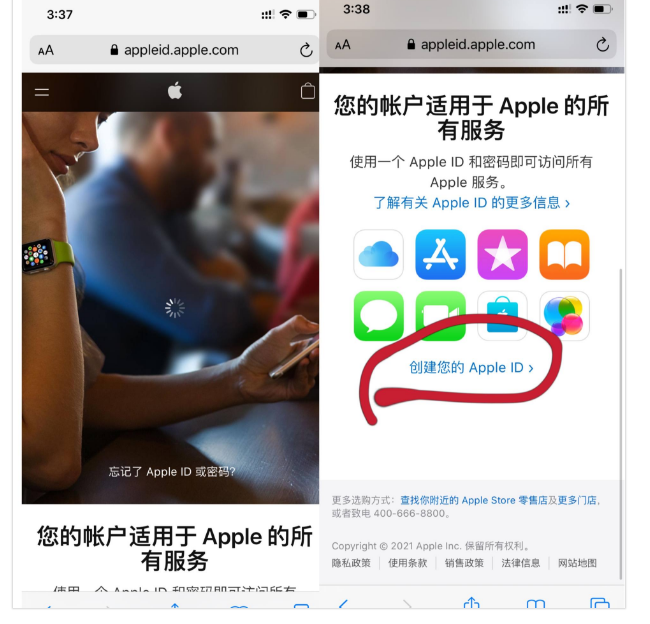

接着填写相关信息，姓名随便填写，国家与地区选美国，然后填写邮箱（未注册过 Apple ID 的邮箱）和电话（电话使用国内的自己号码就行），填完信息后点「**继续**」按钮。

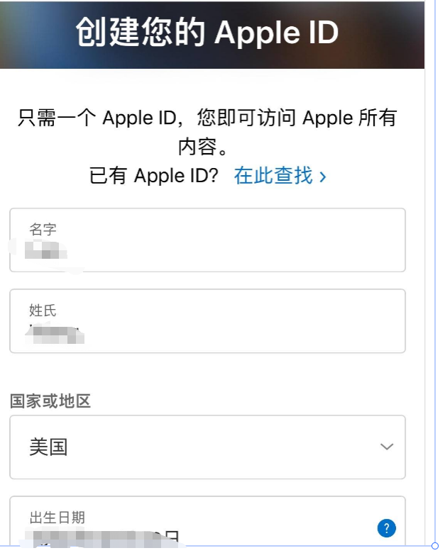

这时候会验证你的邮箱和电话，输入好邮箱验证码和短信验证码后点「**下一步**」。点下一步后就会跳到下面这个界面，到这个界面就差不多注册成功一半了，但是还不能下载 APP ，需要去 App Store 激活下才能正常使用。

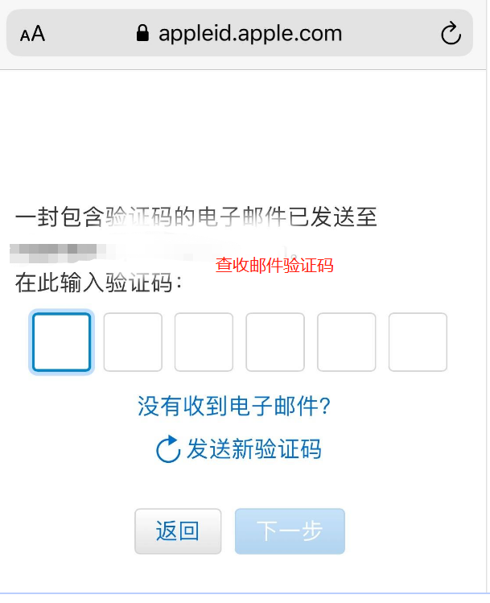

## 账号激活

首先需要在 App Store 退出自己的 Apple ID 账号，打开 「**App Store**」 点击右上角 「**头像**」，然后这个界面一直往下拉拉到页面的底部，点「**退出登录**」按钮

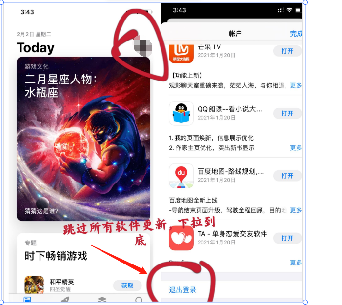

退出自己的 Apple ID 账号以后，就可以去激活刚刚注册的 Apple ID 了，先输入刚刚注册好的美区 Apple ID，点「**登录**」，会发送一条验证码到手机上，填写验证码点「**下一步**」，这时候会弹出一个弹窗，点「**检查**」按钮。

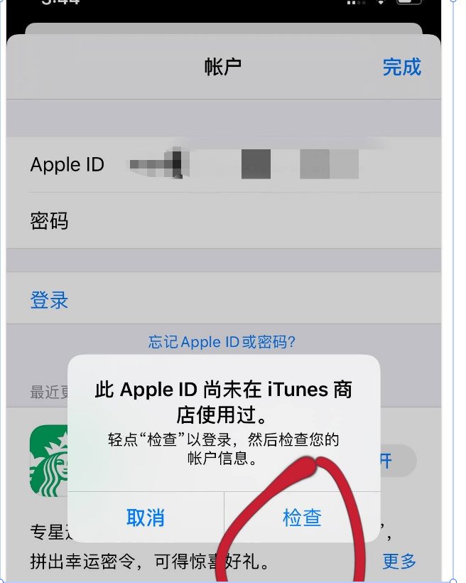

点完「**检查**」按钮，会跳转到「**条款**」页面，需要点击「**同意条款按钮**」再点右上角「**下一步**」，

这个时候就到了「**付款方式**」那一栏**千万不要点！！！**如果误点了的话就退出去从头开始激活，

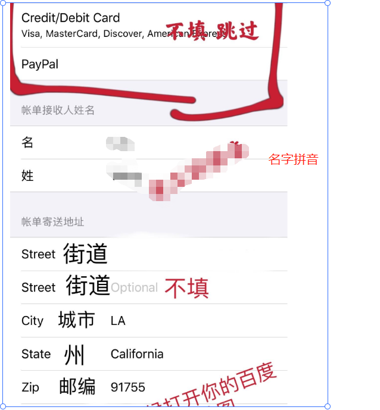

拉到美国境内，随便放大再放大，点开

你就能获得邮编，地址，电话，街道！！

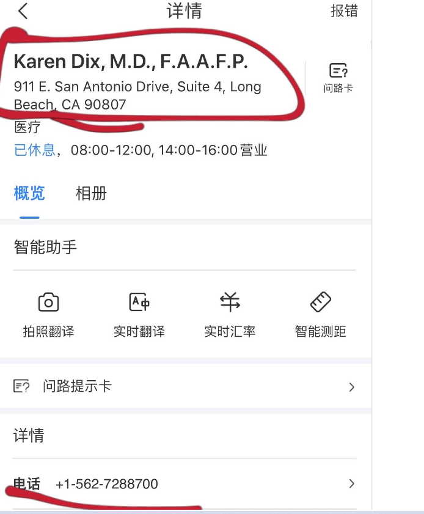

提交就OK了

Apple ID 注册好了你就可以在 App Store 下载免费的软件了。

最后, 如果您还是嫌麻烦,可以直接找以下淘宝店铺直接采购账号, 但是买过来还是要自己把密码改了哦

价格35元

https://tuicashier.youzan.com/pay/wscgoods_order?banner_id=f.105129028~tag_list_top.4~1.1~St4gBOuZ&slg=tagGoodList-default%2COpBottom%2C1005321662%2CabTraceId&components_style_layout=undefined&reft=1677661636983&spm=f.105129028&sf=qq_sm&alias=2fy70xnbgirgnjm&shopAutoEnter=1&is_share=1&from_uuid=794874653&share_cmpt=native_wechat&is_silence_auth=1

## 待定

### 关于付费

ChatGPT plus 官网不支持国内 Visa 卡，无法支付。也有很多介绍虚拟信用卡方式付费，个人感觉太麻烦，又得不到保证。

介绍一下国内付费 ChatGPT plus（ChatGPT 4）最有保障的方式。

1. 注册一个美国 AppStore 账号，将账号切换到美区。
2. 搜索 ChatGPT 或者 OpenAI，找到官方 ChatGPT 应用，下载，并登录账号。
3. 支付宝切换到美国（旧金山），购买礼品卡，充值美区账号下。
4. 打开 IOS ChatGPT，选择账户余额进行付费。

手机充值后，该账号就升级为 ChatGPT plus，可以放心使用 ChatGPT4。

### 关于续费

付费成功后，记得关注自动扣费日期，在自动扣费日期前，保证美国 AppStore 账号余额够 ChatGPT plus 自动扣费（方式也是通过支付宝购买礼品卡对美区 AppStore 账号充值）。ChatGPT IOS 会自动扣费。

### 小技巧：突破 3 小时 25 条消息限制

电脑端 ChatGPT plus 限制，3 小时内只能发送 25 条消息限制。打开 IOS 应用，新建对话，选择 GPT-4 模型，发送消息后，回到电脑端刷新 Web 浏览器，就能看到刚才由手机端创建的对话。

能看到："Model: GPT-4(Mobile, V2)" ，该对话无 3 小时 25 条消息限制

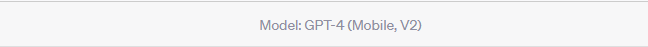

普通 Web 端创建对话，模型："Model: GPT4"，该对话有 3 小时 25 条消息限制

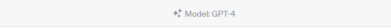

**2023.07.31 日更新，ChatGPT 限制更改为每 3 小时 50 条消息**

### 如何购买礼品卡

支付宝地点切换到美国，比如 San Francisco。

在首页搜索 PockytShop。进小程序后搜索 itunes, 就能输入金额购买礼品卡了。

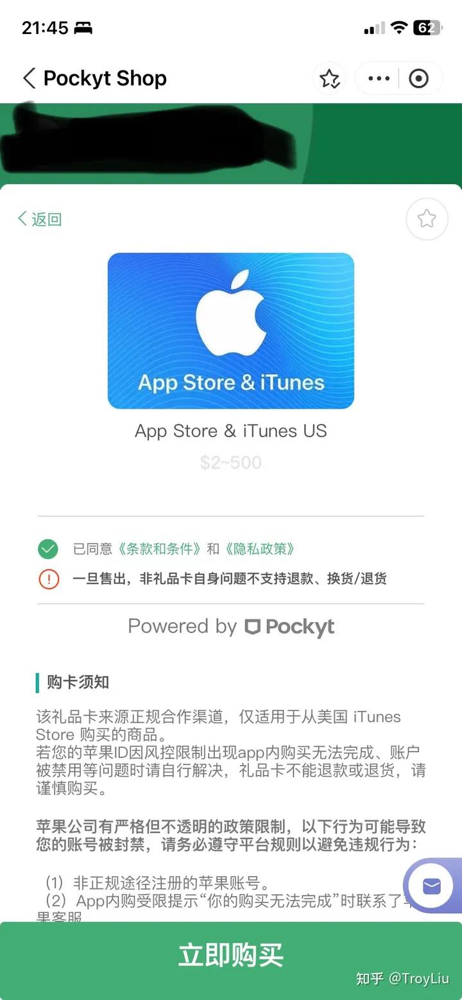

## 待定2

### OpenAI/ChatGPT Plus不支持的信用卡

- 国内招行VISA/MASTERCARD、全币卡。
- 全球付香港虚拟卡。
- 万里汇香港虚拟卡。
- 由于OpenAI不对中国大陆和香港地区开放，所以所有的国内和香港信用卡都不支持，不论是银联还是Visa、MasterCard，全部不支持。
- 目前由于美国的银行金融的监管，Depay虚拟银行卡受限制，暂不支持注册会员，不支持充钱到信用卡，所以Depay暂时也无法使用。

### OpenAI/ChatGPT Plus支持的信用卡

- 据网友反馈派安盈（Payoneer）的信用卡`529366`也可以绑定OpenAI/ChatGPT Plus.
- 据网友反馈4288,4859,5405卡段绑定ChatGPT Plus成功.

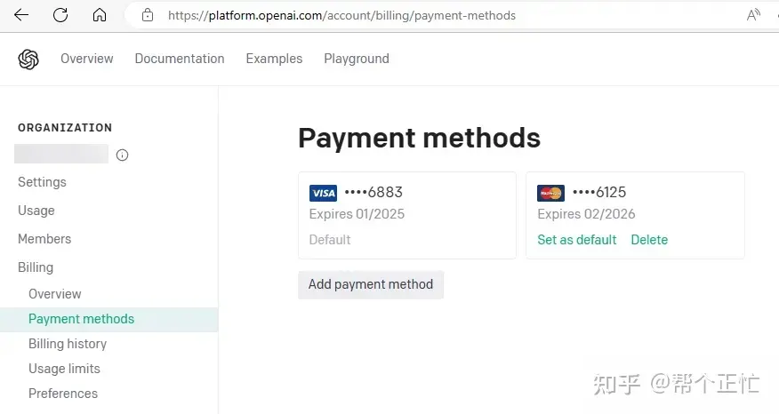

虚拟卡平台：[AmzKeys账号注册](https://amzkeys.com/index.php?c=register&a=index&invite_code=14401&domain_type=1&alliance_type=2)

### 解决办法

- 全局隐身模式（日本，美国，英国，德国，澳大利亚等线路）.
- Chat GPT PLUS续费用户：点“Upgrade”或者“Renew Plus”然后选择“Manage My Subscription”，
- 进到里面把之前绑的卡删除，然后退出来再点“Upgrade”然后再点“Upgrade Plan”进入付款页面。