# 国外的号码如何购买使用

## 0月租的英国手机卡：GiffGaff卡

参考：[买了1张0月租的英国手机卡：GiffGaff卡 – 皮普的数字花园 (pipuwong.com)](https://pipuwong.com/giffgaff)

1.下单地址在官网，文章有写。

2.按照我的步骤购买，然后按照保号方法，即可永久使用。

简单来说，买了以后，一年发一次短信就可以一直使用。0 月租的。

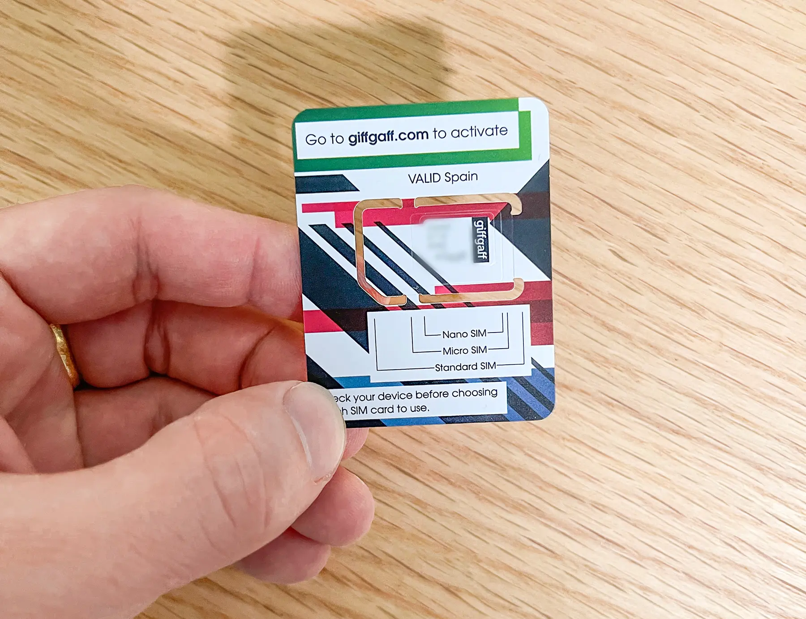

1. [giffgaff资费](https://pipuwong.com/giffgaff#giffgaff资费)
2. [2个方法保号](https://pipuwong.com/giffgaff#2个方法保号)
3. [使用条件](https://pipuwong.com/giffgaff#使用条件)
4. [激活标准流程](https://pipuwong.com/giffgaff#激活标准流程)
5. [英国手机卡giffgaff切换为eSIM操作教程](https://pipuwong.com/giffgaff#英国手机卡giffgaff切换为esim操作教程)

经过这一次的 ChatGPT，突然意识到需要买一张外国卡专门注册外国的服务，少一些不确定性多一份安心，经过前辈们的推荐，选择了英国的 GiffGaff卡。

该卡发行国家是英国，号码为英国段，希望大家了解自己的需求和业务是否合适。

由于官网购买需要等待比较长的时间，我就直接在JD买了，27元送到家门口。

本文主要记录激活流程，Enjoy！

### giffgaff资费

1.无月租；
2.收短信免费；
3.打电话 1英镑/分钟 ；
4.接电话 1英镑/分钟 ；
5.发短信 0.3英镑/条；
6.流量上网 0.2英镑/MB

不需要实名认证。

### 2个方法保号

180天消费一次即可，任意消费一次，即可长期使用；
1.发短信 0.3英镑/条；
2.流量上网 0.2英镑/MB；

建议发短信保号，比较好控制。
但要发给英国号码，发送给中国号码是不行的（电信诈骗管得严），不然。。。会出现这样的情况👇

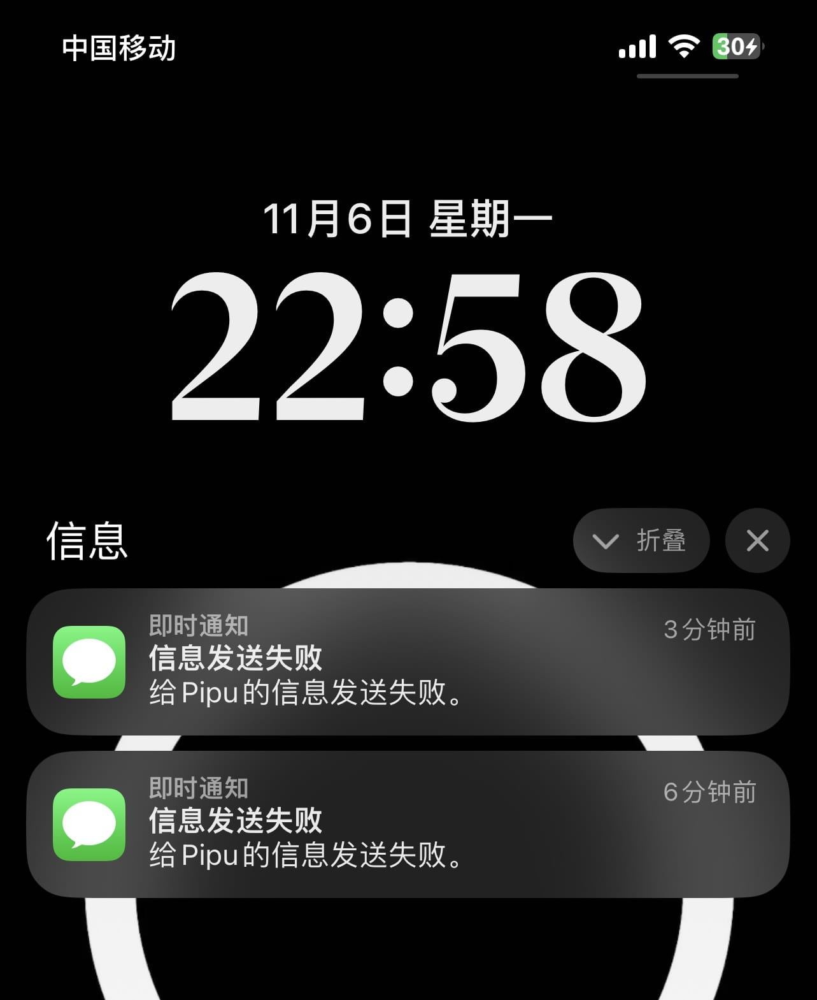

英国号码格式如下：0044 7423325451（另外也可网上找下英国号码，应该能找到）

### 使用条件

国内全网通的手机就行

### 激活标准流程

#### 1.打开 giffgaff 官网

(国内也可以打开):https://www.giffgaff.com/activate

#### 2.输入手机卡背面的 activate code

然后点击 activate your SIM

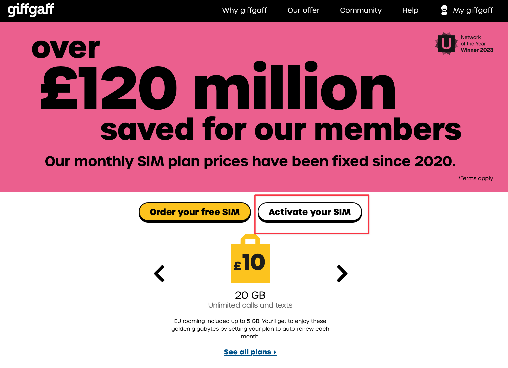

#### 3.依次输入注册邮箱，注册官网的登录密码

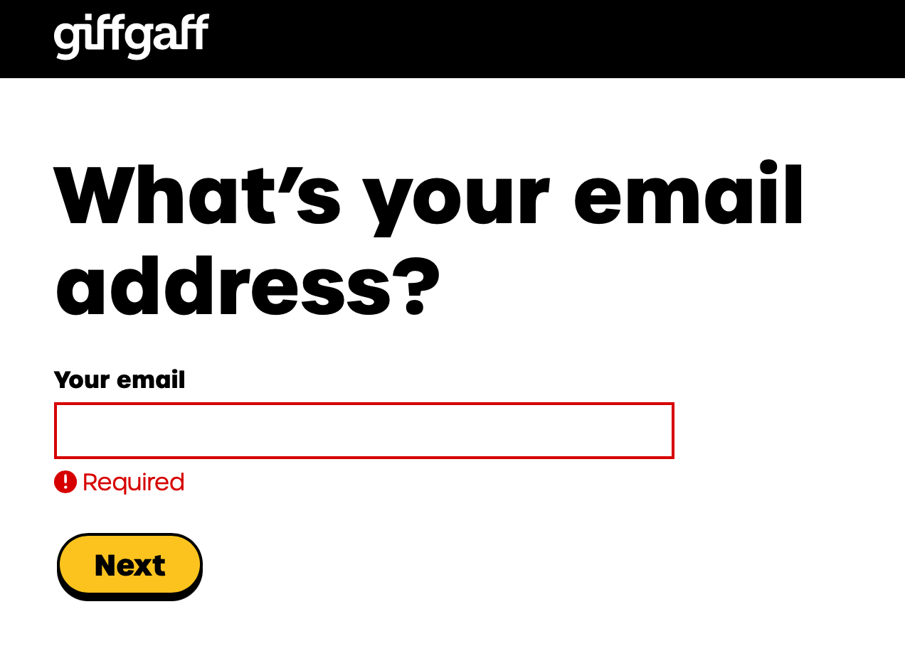

#### 4.点击 register

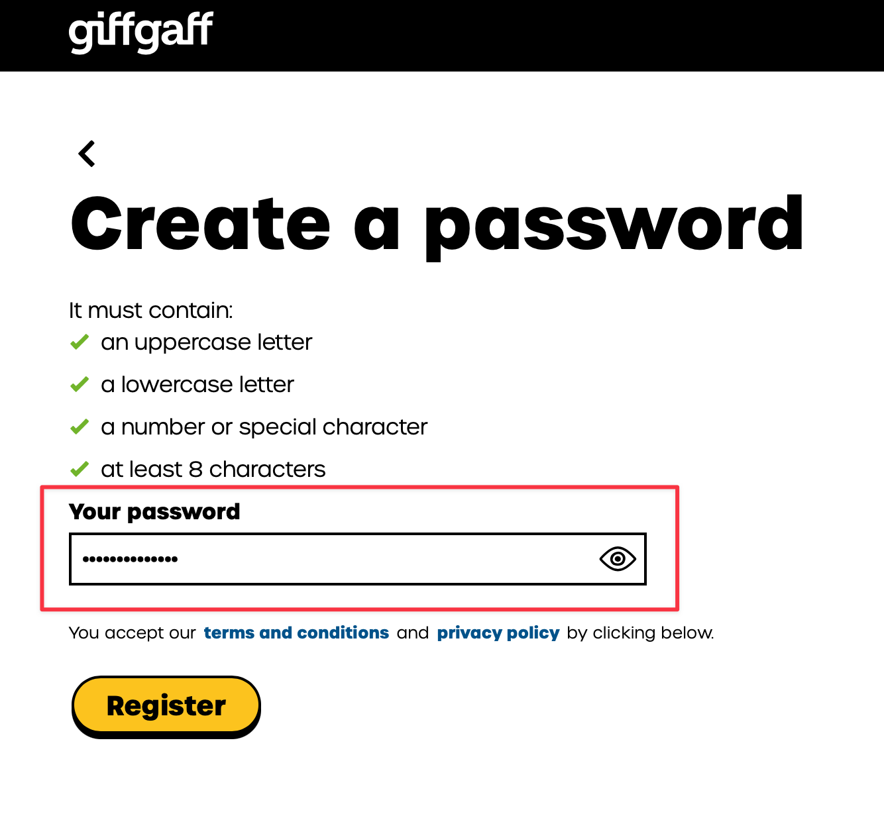

#### 5.Pay as yougo（随用随付，0月租）

一定一定点击最下面 pay as you go！千万别选择套餐激活！选择充值激活就好！

除非明天出国，套餐现在选择了明天就可以用上！否则会浪费套餐的时间（30 天后过期）。

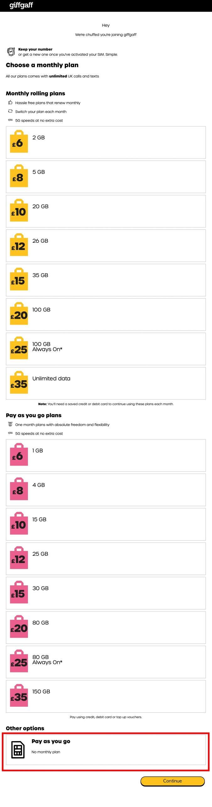

#### 6.充值

一般选择充值 10 英镑激活，然后点击 pay now。

可以用招商银行的visa信用卡

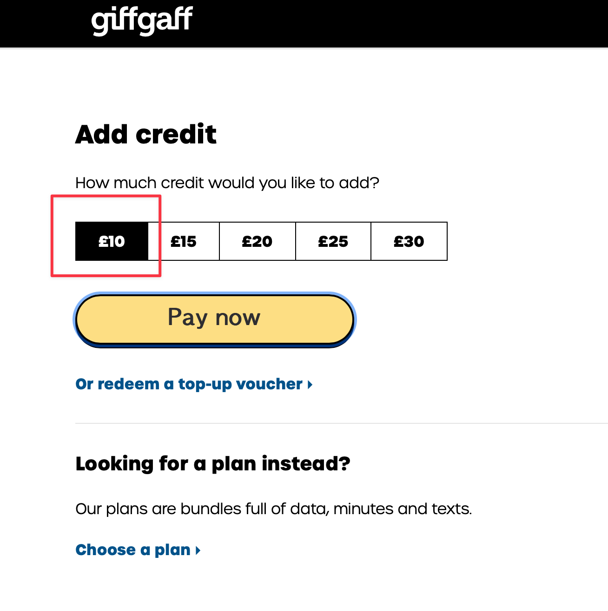

#### 7.激活

使用信用卡激活，VISA 或 Master Card 的信用卡都可使用；

依次填写账单地址（账单地址不重要，随便填个英国收件地址即可），然后点 activate your SIM。

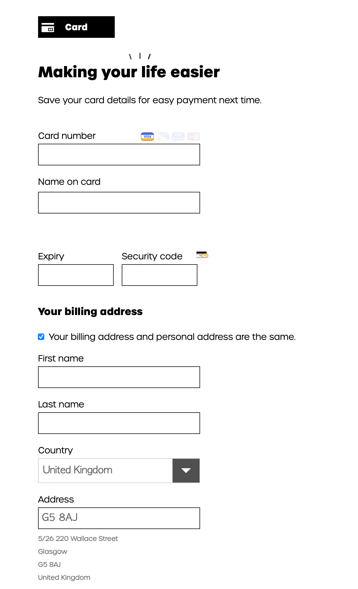

#### 8.等待激活

等待激活即可，余额大概会在 15-30 分钟内到账

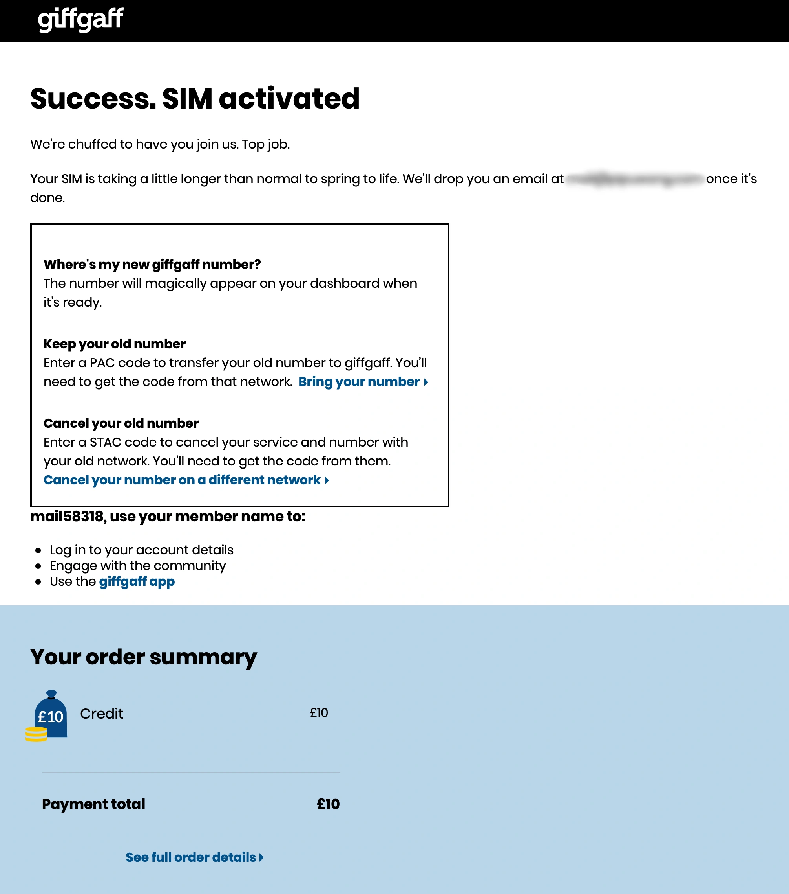

#### 9.激活成功

收到激活成功的短信和邮件

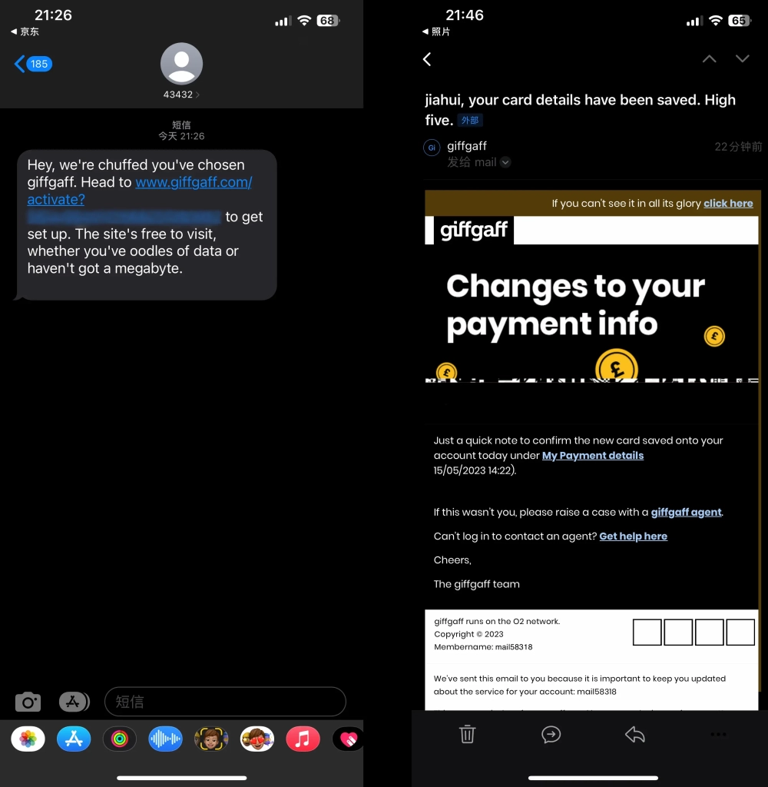

#### 10.下载APP

下载GiffGaff APP方便管理号码

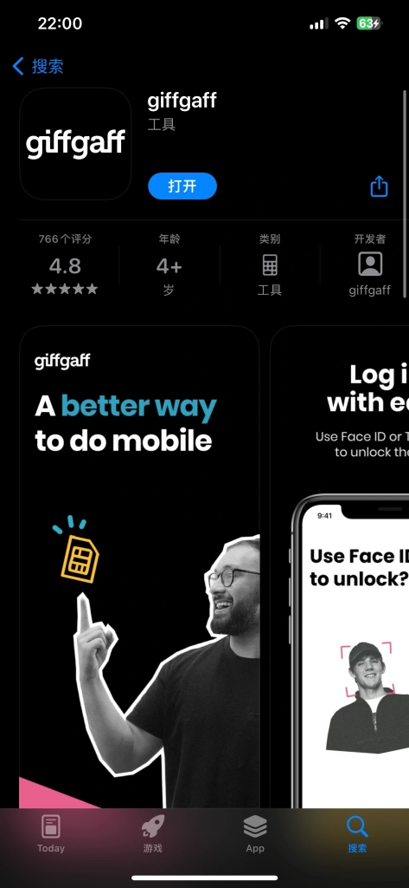

#### 11.⚠️ 双卡用户要注意

必须关闭“自动切换蜂窝数据”，不然会自动切换两张卡的蜂窝数据，会导致GiffGaff卡有漫游费。

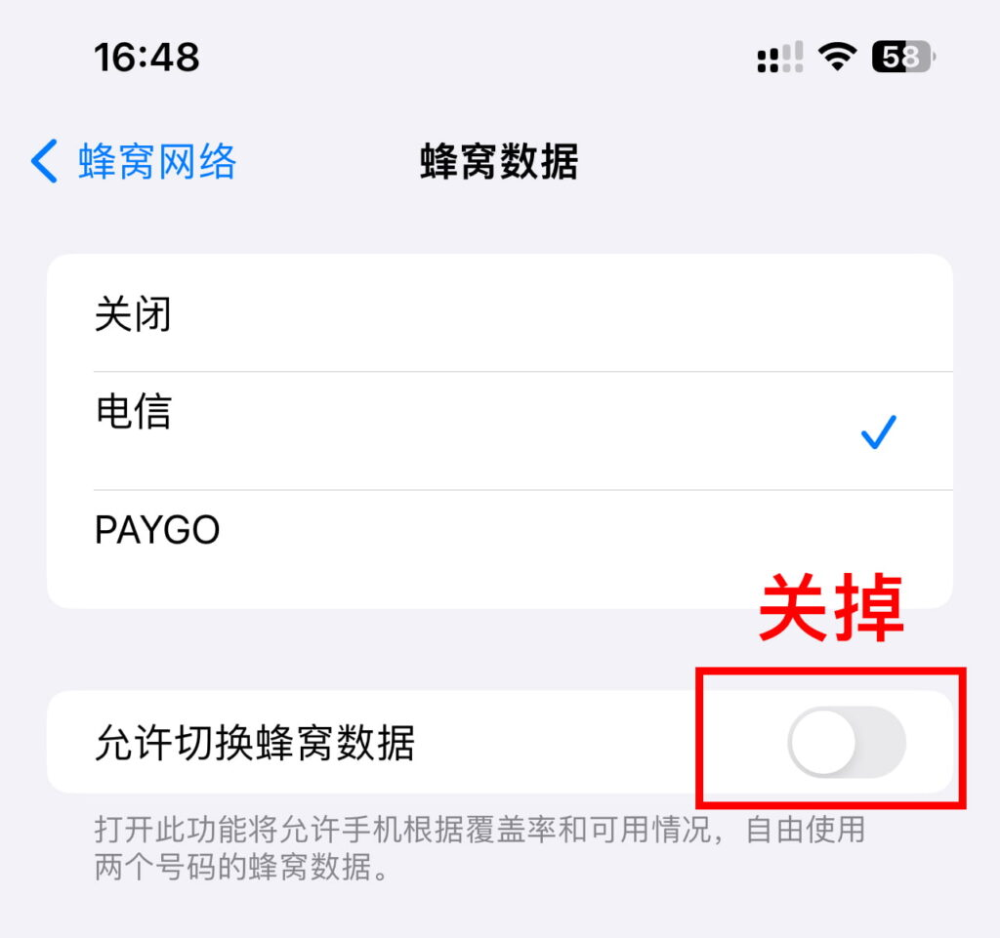

设置路径：设置——蜂窝数据——蜂窝数据

### 英国手机卡giffgaff切换为eSIM操作教程

目前只支持将实体sim卡转换为eSIM，不过暂时不支持直接订购eSIM，有卡的用户可以按照操作步骤将英国手机卡giffgaff切换为eSIM。

1、 确认手机支持eSIM

2、 使用英国节点

3、前往giffgaff应用程序。转到帐户>SIM卡>更换我的SIM卡>切换到新的eSIM

4、按照提示流程操作即可更换成功

## 美国原生实体手机卡：PAYGO卡

参考：[买了一张美国原生实体手机卡：PAYGO卡 – 皮普的数字花园 (pipuwong.com)](https://pipuwong.com/paygo)

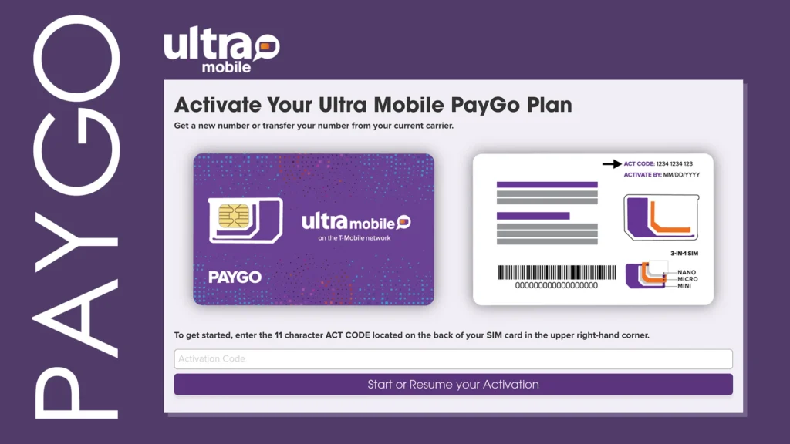

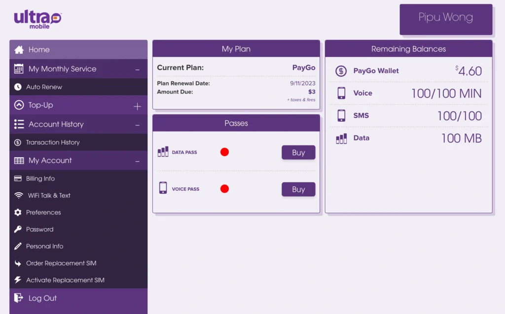

### 简介

PAYGO 是Urtra Mobile 推出的美国原生实体电话卡，我愿称之为最强。

官网：[https://www.ultramobile.com](https://www.ultramobile.com/)

#### 手机卡套餐信息

PayGo提供100分钟的通话，100条短信和100MB 5G/4G LTE流量数据，每月只需3美元。流量可用于移动热点。超出100后，每分钟3美分、每短信1美分、每MB3美分。

- 卡供应商：Ultra Mobile
- 网络运营商：T-Mobile
- 电话卡类型：美国当地原生卡
- 月租：5美金
- 通话：100分钟
- 短信：100条（在美国收短信是免费，但在中国属漫游，是需要收费的，0.1美元/条）
- 流量：100MB

#### 需要注意的地方

- 保号的方法：Ultra卡为旅游卡，有效期30天，每月充值3美金即可长期使用。（可在官网设置自动扣费，省心又省力）
- 关于WifiCalling：仅支持苹果手机，其他不支持。

### 购买的原因

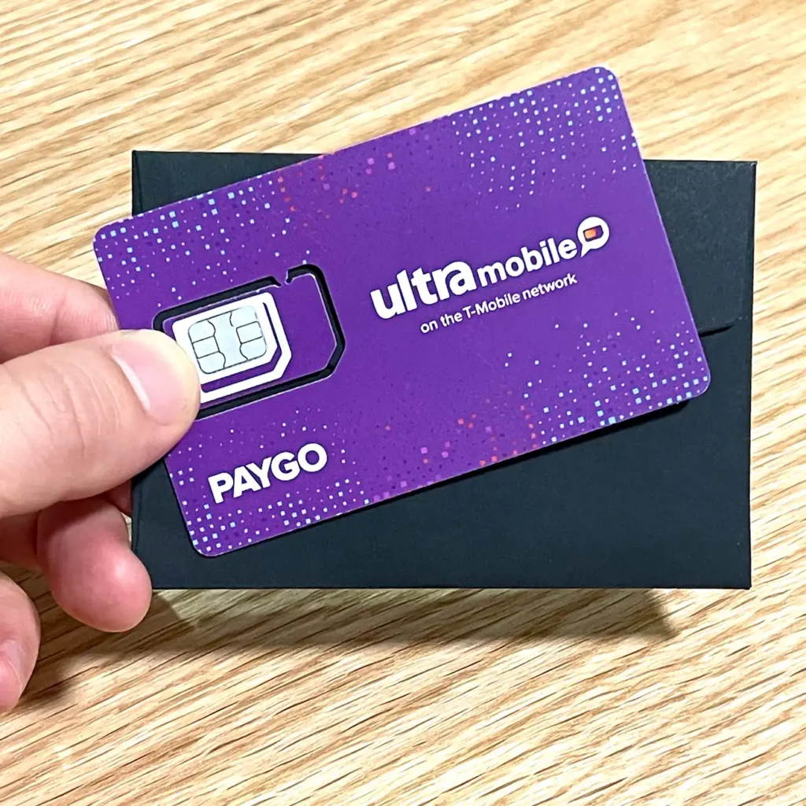

**1. 为了使用美区的Appleid和Apple Store**

**2. 为了更好地使用外国 APP 服务**

跟上一篇文章[《买了1张GiffGaff卡》](https://pipuwong.com/giffgaff)有点相似

**3. 账号归属权**

这很重要，相当于身份证，即使忘记密码，也可以找回来。

⚠️我相信很多人为了图方便，直接在淘宝买美区或者港区的Apple ID账号，在的确很方便。
但这种做法有以下弊端：

- 风控问题
  - 这种账号大多数都是共享账号，即存在不同ip登录的情况，容易被Apple风控，这侵犯了Apple的利益。
- 不能及时更新
  - 因App需要经常修复Bug和添加新功能，当更新的时候你有可能登录不上，也有可能账号已经被卖家改了密码。

有个海外电话卡，是挺方便的，只要它公司不跨，号码就一直能使用，日常使用只是接收验证码，已经足够。

### 激活流程

**1.打开激活网址**

[paygo.ultra.me/activate](http://paygo.ultra.me/activate)（建议使用Google Chrome无痕模式）

访问需要配合魔法BUFF，激活过程中可能会跳人机验证码。

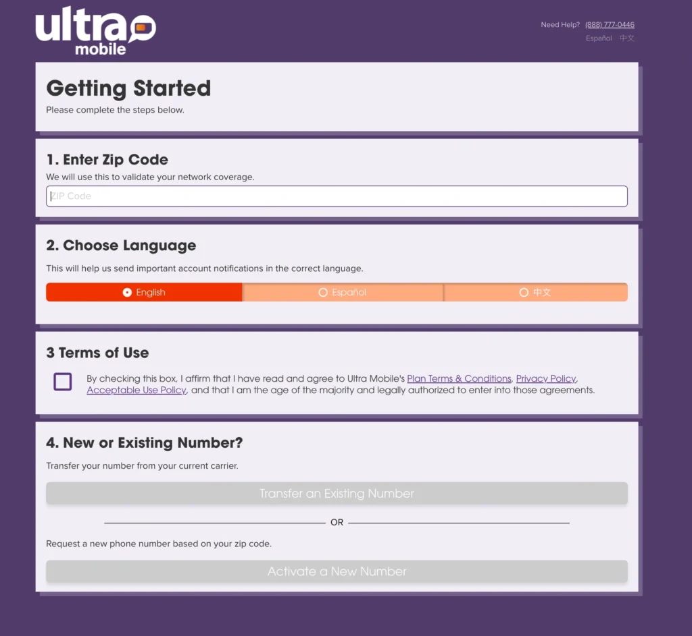

**2.输入ACT CODE**

在卡背面右上角，有11位英文数字，英文需大写

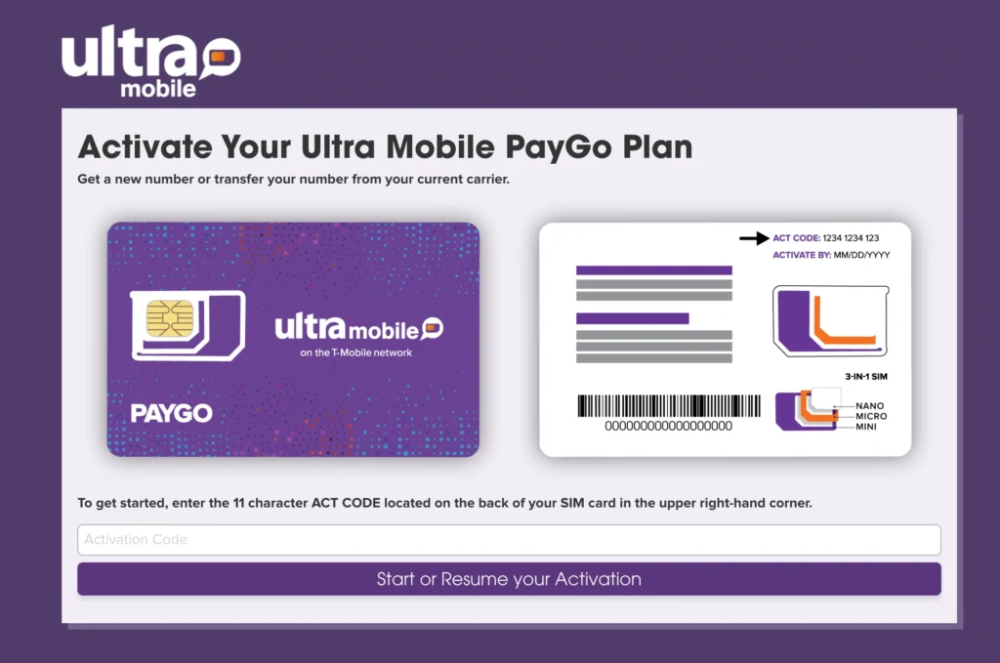

**3.输入美国的地址**

最好选择免税的州，因为不用给税费，如阿拉斯加州（Alaska）、特拉华州（Delaware）、蒙大拿州（Montana）、新罕布什尔州（New Hampshire）和俄勒冈州（Oregon）。

具体的街道地址和邮政编码，需要大家自行搜索，关键词：`美国地址生成器`

**4.激活成功**

输入完地址以后，还需要绑定一张Visa或Master的信用卡（国内发行的都可以），最后充值5美金，设置每月自动扣费，设置完毕以后就激活成功了！愉快地玩耍吧！

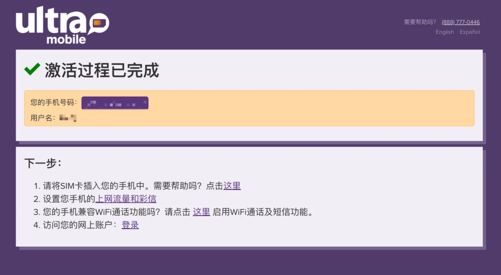