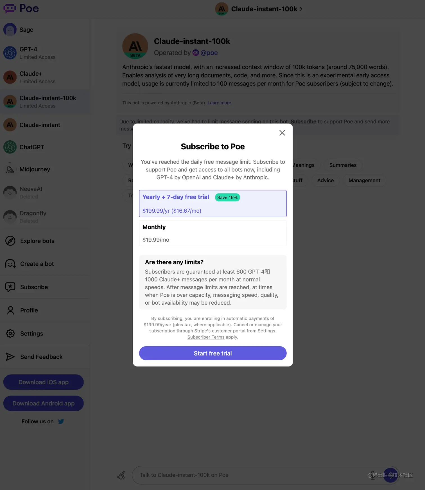

# 问答模型聚合类网站

Claude 2.0 注册使用教程 - 免费无限制的 ChatGPT (GPT4) 替代品！ AI 界“超级黑马”：<https://www.iplaysoft.com/claude.html>

ChatGPT、Claude 和 Dragonfly 都是非常流行的聊天机器人，它们各有特色。其中Sage.Sage 是一个基于机器学习的聊天机器人，能够识别自然语言并做出智能回答。

- Sage 通过自然语言处理和对话管理技术来实现对话的自然流畅和个性化，同时支持多种语言。Sage 较为擅长语言相关的工作，例如创作文章，做摘要等。
- ChatGPT 是由开放人工智能(OpenAI) 公司开发的一种聊天机器人，能够利用人工智能技术快速解答用户的问题，包括邮件、翻译、作诗、改善程式码等。ChatGPT 的独特之处在于其拥有先进的深度学习算法，可以逐步提高自己的回答质量，同时也支持多种语言，是目前知名度最高的聊天机器人
- Claude 是一种由思科系统开发的聊天机器人，旨在为网络安全和网络统一通信提供全面支持。Claude 较擅长对话相关的工作，能够在问题不清晰时，主动向用户提问。
- Dragonfly 是由 IBM 开发的聊天机器人，其特点是可以使用多种形式的对话方式，例如文字聊天、语音聊天和图像聊天等。较擅长提供正确和可信的信息，并且会拒绝不合规的提问。Dragonfly 还可以根据用户的需要提供精准的回答，支持多语言，适用于多种场景。

总之这四种聊天机器人各有其特点，用户可以根据自己的需求选择使用

## ChatGPT的镜像产品

以下对话式 AI 聊天机器人就像 ChatGPT，是最好的 ChatGPT 替代方案。

[Chatsonic](https://writesonic.com/chat)

[craft](https://www.craft.do/)：

[Vondy](https://www.vondy.com/)

[cursor](https://www.cursor.so/)（GPT4.0）

[Poe](https://poe.com/)（GPT4.0）

[Rytr](https://rytr.me/)

[FreeGPT](https://freegpt.one/)

[YouGPT](https://you.com/)

[Jasper](https://www.jasper.ai/)

## ChatHub聚合客户端

> 官网：[chathub.gg](https://chathub.gg/)
>
> GitHub开源地址：<https:/github.com/chathub-dev/chathub>

ChatHub 是一个 chatbot 聚合客户端，目前已经支持ChatGPT、New Bing Chat、Google Bard、Claude、ChatGLM等，可以在一个页面同时与多个聊天机器人进行对话。

ChatHub 也提供了 Chrome 和 Edge 浏览器插件，基础版本可以免费使用，已经吸引了 10W+ 活跃用户，极大提高了聊天机器人的可用性和体验质量

## Perplexity Pro

> www.perplexity.ai/pro
>
> Perplexity Pro 是付费升级版本，每月 $20 就可以解锁 GPT-4、Claude-2 等顶尖的AI大模型，并且获得每天 300 多次的 Copilot 使用权限等

本次 Perplexity 整合 Claude-2能力，可以为用户提供更长的上下文、更大的文件 (最大25MB，大于 Claude 官网的10MB)、更自然和易读的文本内容、更快速智能的回复，将 Perplexity 提升到了一个新的水平

## [Poe AI](https://poe.com/)

Poe 是国外知乎开发的一款跟 AI 聊天软件,里面内嵌了很多 AIGC 应用：比如 ChatGPT、GPT-4、Claude 的各个版本、NeevaAI 等等其它。

(推荐) 注册后免费使用，可免费试用当前最先进的 GPT-4，提供多种模型选择。能科学上网即可注册，有 iPhone 客户端可以使用。

每天免费使用一次 GPT-4

## [steamship](https://www.steamship.com/)

steamship 实测可用 GPT-4，传送门：[www.steamship.com/plugins/gpt…](https://www.steamship.com/plugins/gpt-4)

创建 instance

没有使用次数限制。

## [huggingface](https://huggingface.co/spaces/ysharma/ChatGPT4)

huggingface-gpt4，传送门：[huggingface.co/spaces/ysha…](https://huggingface.co/spaces/ysharma/ChatGPT4)

Hugging face 起初是一家总部位于纽约的聊天机器人初创服务商，他们本来打算创业做聊天机器人，然后在 github 上开源了一个 Transformers 库

虽然聊天机器人业务没搞起来，但是他们的这个库在机器学习社区迅速大火起来。目前已经共享了超 100,000 个预训练模型、10,000个数据集，变成了机器学习界的 github

[github.com/huggingface](https://github.com/huggingface)

## AIGC 聚合思考

想了想：

好像有很多国外类似平台，都嵌入了很多 AIGC 应用，但在墙内好像还没见到过，墙内除了一些准备割韭菜的网站，没有看到一个官方的、较大的平台/应用说已经集合了众多 AIGC 能力，让普罗大众感受 AIGC 的能力。。。

还等不及我等韭菜的生长，9.9 充值的镰刀都挥了过来，无语凝噎。。。

国外的一些好的聚合 AIGC 能力的平台，用户量也很庞大：[Slack](https://slack.com/)、[Discord](https://discord.com/)、[Poe](https://poe.com/)、[OraAi](https://ora.ai/explore/recent) 等...

1. [Slack](https://slack.com/)

1. [Discord](https://discord.com/)

1. [Poe](https://poe.com/)

1. [OraAi](https://ora.ai/explore/recent)

感兴趣的掘友可以试试~

反观：不知道有些企业都在干嘛，比如【三六零】，炒作了这么久，究竟做出了啥？？

**360 导航聚合的东西伸手就来，十几块钱也不嫌少，反正能捞一点就是一点是吧？？？**

[苏打办公-AIGC工具 (360.cn)](https://bangong.360.cn/home/index.html?c=gw#/search?lv0=849&time=1684201179569&referrer=other)

## 『Chat Chat 开源啦』解锁你的下一级 AI 对话体验

[**⋙ GitHub**](https://github.com/okisdev/ChatChat) | [**官网**](https://chat.okisdev.com/)

Chat Chat 可以使用 OpenAI、微软 Azure、Claude、Cohere、Hugging Face 等多个 API，让你的 AI 对话体验更加丰富。

此外，Chat Chat 还支持 Plugins，可以搜索内容和总结网页；并且支持分享记录，支持云端存储记录和个人设置等

## HuggingChat

[HuggingChat](https://huggingface.co/chat)

AI 平台 HuggingFace 自家的 AI 聊天页面，底层可以配置不同模型，免费使用。

## 🤖 Quora Poe整合多家AI模型，重新定义 AI 问答社区

Quora（美版知乎）作为问答式社区的鼻祖在，在22年12月就推出了 AI 产品 🌏[**Poe 移动端 Beta 版**](https://techcrunch.com/2022/12/21/quora-launches-poe-a-way-to-talk-to-ai-chatbots-like-chatgpt/)，近期终于上线了 🌏[**Poe Web 端**](https://poe.com/)。

Poe 整体类似 ChatGPT 的对话机器人，目前有 4 个机器人 Sage、Cloude、ChatGPT 及 Dragonfly，并在不断增加新的聊天机器人。**这些机器人的 AI 能力分别来自 OpenAI、Anthropic 的 Cloude 以及其它一些 AI 模型，算是目前整合各家 AI 模型推出的一款产品**。

在 Poe 里进行问答，**它会在回答的答案里标注出很多关键词，就像网站文章里的链接一样，你可以点击进一步了解**，这体验已经和现在的 Quora 甚至维基百科非常类似了。

此外，Poe 尝试把社区做在了对话里，在完成问答后的下方，不仅给出了备选的延申问题，**还给出了与当前主题相关度不高的其他话题**，并且支持对问答内容进行**点赞、分享到 Poe 内部社区或外部社交平台**等操作，打通了社交关系链。

> 和很多其它类似 ChatGPT 套壳产品不同，Poe 不需要你有 OpenAI 账号，也不需要提交 API Key，直接下载注册即可用，账号会和你的 Quora 账号关联。**目前是完全免费的**。

## 免费使用GPT-4

以下的三个都需要**梯子**，请自行准备

### steamship.com

网址：<https://www.steamship.com/>

**不限次使用**，但是回复速度和以下两个相比有点慢

这里打开之后也需要账号，我这里直接使用 `Google账号` 快捷创建账号，也可以使用 `Github账号` 或者手动创建一个，创建账号之后直接无脑下一步就可以了

登陆之后新打开这个[网址](https://www.steamship.com/plugins/gpt-4/_create)，直接进入创建 `GPT-4实例` 的页面，这里可以点击 `Optional Configuration` 进行自定义配置或者直接默认配置，最后点击 `create按钮` 创建

### poe.com

网址：<https://poe.com/GPT-4>

这里打开之后需要账号，我这里直接使用Google账号进行创建账号，直接无脑下一步就可以打开

> - GPT-4：每天一次
> - Claude+：每天三次
> - Claude-instant-100k：需要填写一些银行卡信息的才可以免费使用七天，我没用过
> - ChatGPT：基于3.5，这个是我最常用的，完全够用

如果想要不限次使用的话，按月 `¥19.99`，按年 `¥199.99` 

### chat.forefront.ai

网址：<https://chat.forefront.ai/>

这里打开之后还是需要账号，我这里直接使用Google账号进行创建账号，直接无脑下一步就可以打开

> - GPT-4：每三个小时五次
> - Claude+：每三个小时五次
> - Claude：不限制使用
> - GPT-3.5：不限制使用

如果想要不限次使用的话，需要付费（这里感觉太贵了） 
